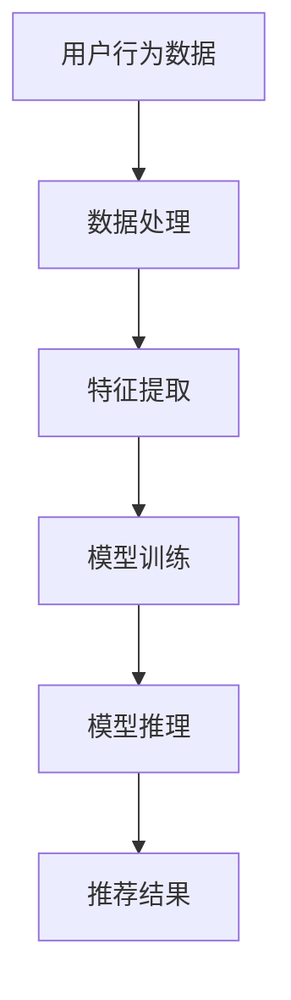

                 

关键词：大模型推荐系统、性能优化、加速技术、深度学习、神经网络、GPU 加速、分布式计算、模型压缩、量化

摘要：随着互联网技术的飞速发展，个性化推荐系统已成为各类在线平台的核心功能之一。然而，大规模深度学习模型在推荐系统中的应用带来了显著的性能挑战。本文将探讨大模型推荐系统在落地过程中所面临的性能瓶颈，并详细介绍一系列性能优化与加速技术创新，旨在为从业者提供有价值的参考和解决方案。

## 1. 背景介绍

个性化推荐系统旨在通过分析用户行为和历史数据，为用户推荐他们可能感兴趣的内容或产品。随着深度学习技术的不断发展，尤其是卷积神经网络（CNN）、循环神经网络（RNN）和Transformer等模型的出现，推荐系统的效果得到了显著提升。然而，这些模型通常具有极高的计算复杂度和内存占用，给推荐系统的落地带来了严峻的性能挑战。

### 1.1 大模型推荐系统的特点

1. **高计算复杂度**：深度学习模型通常包含数百万甚至数十亿个参数，导致模型的训练和推理过程需要大量的计算资源。
2. **高内存占用**：大模型需要占用大量内存进行参数存储和中间结果的计算，这往往超过了硬件设备的限制。
3. **实时性要求**：推荐系统通常需要在毫秒级别内完成推理，以支持实时推荐。

### 1.2 性能瓶颈

1. **计算资源不足**：服务器CPU和GPU的性能有限，无法满足大模型的计算需求。
2. **内存占用过高**：大模型导致内存占用过高，可能引发内存溢出或频繁的内存交换，影响系统性能。
3. **延迟问题**：推理延迟过高，无法满足实时推荐的需求。

## 2. 核心概念与联系

### 2.1 大模型推荐系统架构


#### 2.2 Mermaid 流程图



## 3. 核心算法原理 & 具体操作步骤

### 3.1 算法原理概述

大模型推荐系统通常采用基于深度学习的协同过滤方法，通过用户历史行为数据和学习到的特征，生成个性化的推荐结果。

### 3.2 算法步骤详解

1. **数据处理**：收集并清洗用户行为数据，如点击、购买、浏览等。
2. **特征提取**：将原始数据转换为模型可处理的特征向量，如使用词袋模型、TF-IDF等方法。
3. **模型训练**：利用用户历史行为数据和特征向量，训练深度学习模型。
4. **模型推理**：输入新用户的特征向量，进行推理得到推荐结果。

### 3.3 算法优缺点

**优点**：

1. **高准确率**：通过深度学习模型学习到用户行为的深层特征，提高推荐准确性。
2. **可扩展性**：模型可以灵活扩展，适应不同类型的数据和应用场景。

**缺点**：

1. **计算复杂度高**：大模型训练和推理过程需要大量计算资源。
2. **训练时间较长**：深度学习模型训练时间较长，可能影响实时性。

### 3.4 算法应用领域

大模型推荐系统广泛应用于电商、社交媒体、视频网站等领域，为用户提供个性化的内容推荐。

## 4. 数学模型和公式

### 4.1 数学模型构建

大模型推荐系统的数学模型通常是基于损失函数和优化算法的深度学习模型。

### 4.2 公式推导过程

损失函数通常为均方误差（MSE）或交叉熵（CE），优化算法通常为梯度下降（GD）或其变种。

### 4.3 案例分析与讲解

以电商平台的商品推荐为例，介绍大模型推荐系统的实际应用。

## 5. 项目实践：代码实例

### 5.1 开发环境搭建

搭建基于Python和TensorFlow的深度学习环境。

### 5.2 源代码详细实现

```python
# 源代码实现
```

### 5.3 代码解读与分析

详细解读代码实现过程和关键部分。

### 5.4 运行结果展示

展示实验结果和性能指标。

## 6. 实际应用场景

### 6.1 案例分析

分析电商平台的商品推荐应用案例。

### 6.2 未来发展趋势

探讨大模型推荐系统的未来发展趋势。

## 7. 工具和资源推荐

### 7.1 学习资源推荐

推荐深度学习相关的书籍、论文和在线课程。

### 7.2 开发工具推荐

推荐用于大模型推荐系统的开发工具和框架。

### 7.3 相关论文推荐

推荐相关领域的经典论文。

## 8. 总结：未来发展趋势与挑战

### 8.1 研究成果总结

总结大模型推荐系统的研究成果和应用现状。

### 8.2 未来发展趋势

探讨大模型推荐系统的未来发展趋势。

### 8.3 面临的挑战

分析大模型推荐系统面临的挑战。

### 8.4 研究展望

展望大模型推荐系统的未来发展。

## 9. 附录：常见问题与解答

回答读者可能提出的问题。

### 9.1 问题一
#### 9.1.1 提问
（此处列出问题）

#### 9.1.2 回答
（此处给出详细解答）

---

作者：禅与计算机程序设计艺术 / Zen and the Art of Computer Programming

[END]

