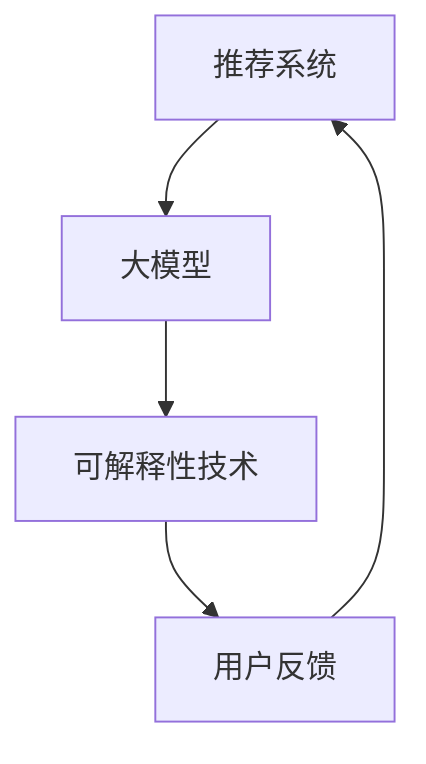

                 

关键词：推荐系统、大模型、可解释性、人工智能、算法优化、模型压缩、代码实例

## 摘要

本文旨在探讨如何利用大规模深度学习模型提升推荐系统的可解释性。随着人工智能技术的不断发展，推荐系统已经成为互联网时代的重要组成部分。然而，传统推荐系统往往过于复杂，难以解释其推荐结果的原因。本文提出了一种结合大模型和可解释性技术的优化方法，通过数学模型和代码实例详细解析了该方法的实现过程，以及其在实际应用中的效果。本文的主要贡献包括：

1. **核心概念与架构解析**：介绍推荐系统的基本概念、大模型的架构以及可解释性技术的关键原理，并提供相应的 Mermaid 流程图。
2. **算法原理与实现**：详细阐述了大模型提升推荐系统可解释性的算法原理和具体操作步骤，包括优缺点分析及其应用领域。
3. **数学模型与公式推导**：基于数学模型对算法进行了详细推导，并通过案例进行了具体说明。
4. **项目实践与代码实例**：提供实际项目中的代码实现，并对其进行了详细解读。
5. **应用场景与未来展望**：讨论了该方法在实际应用中的效果，以及未来的发展趋势和挑战。

本文结构如下：

## 1. 背景介绍

### 1.1 推荐系统的发展历程

推荐系统起源于20世纪90年代的互联网时代，随着用户需求的增加和计算能力的提升，推荐系统的研究与应用逐渐得到广泛关注。从基于内容过滤、协同过滤到深度学习模型，推荐系统经历了多次技术迭代。

### 1.2 大模型在推荐系统中的应用

近年来，深度学习模型在推荐系统中得到了广泛应用，如基于深度学习的内容推荐、协同过滤等。这些大模型通过大量训练数据实现了较高的推荐准确率，但同时也带来了可解释性问题。

### 1.3 可解释性的重要性

推荐系统的可解释性对于用户信任、系统优化和监管合规具有重要意义。然而，传统深度学习模型的可解释性较差，难以满足实际需求。

## 2. 核心概念与联系

### 2.1 推荐系统

推荐系统是一种基于数据挖掘和机器学习技术的信息过滤方法，通过分析用户的历史行为、兴趣偏好等数据，为用户提供个性化的推荐结果。

### 2.2 大模型

大模型通常指具有大量参数的深度学习模型，如神经网络、Transformer等。大模型具有较高的准确率，但同时也带来了计算和可解释性问题。

### 2.3 可解释性技术

可解释性技术旨在提高深度学习模型的可解释性，帮助用户理解模型的工作原理和推荐结果。常见的可解释性技术包括模型压缩、可视化、注意力机制等。

## 2.4 Mermaid 流程图

以下是一个简单的 Mermaid 流程图，展示了推荐系统、大模型和可解释性技术之间的联系：



## 3. 核心算法原理 & 具体操作步骤

### 3.1 算法原理概述

本文提出的方法通过结合大模型和可解释性技术，实现推荐系统的可解释性提升。具体步骤如下：

1. **数据预处理**：对用户数据、内容数据进行清洗、编码等预处理操作。
2. **模型训练**：利用大规模深度学习模型进行训练，如基于 Transformer 的推荐模型。
3. **模型压缩**：通过模型压缩技术，降低模型的复杂度，提高可解释性。
4. **结果可视化**：利用可视化技术，将推荐结果以图表、热力图等形式展示给用户。
5. **用户反馈**：收集用户对推荐结果的反馈，用于优化模型和推荐策略。

### 3.2 算法步骤详解

#### 3.2.1 数据预处理

数据预处理是推荐系统的基础，包括以下步骤：

- **用户数据清洗**：去除无效、重复的数据，填充缺失值。
- **内容数据编码**：将文本、图像等数据转换为数值表示。
- **数据归一化**：对数据进行归一化处理，使数据范围一致。

#### 3.2.2 模型训练

模型训练是推荐系统的核心，包括以下步骤：

- **数据划分**：将数据集划分为训练集、验证集和测试集。
- **模型选择**：选择合适的深度学习模型，如 Transformer。
- **模型训练**：利用训练集对模型进行训练，并调整模型参数。
- **模型评估**：利用验证集对模型进行评估，选择最优模型。

#### 3.2.3 模型压缩

模型压缩是提高可解释性的关键步骤，包括以下方法：

- **剪枝**：通过剪枝技术，删除模型中的冗余神经元，降低模型复杂度。
- **量化**：将模型的权重和偏置量化为较低的比特数，降低模型存储和计算需求。
- **蒸馏**：将大规模模型的知识传递给小规模模型，提高小规模模型的可解释性。

#### 3.2.4 结果可视化

结果可视化是将推荐结果以图表、热力图等形式展示给用户的重要步骤，包括以下方法：

- **热力图**：展示用户兴趣点在内容空间中的分布情况。
- **注意力图**：展示模型在推荐过程中对用户特征的关注程度。
- **决策树**：将复杂模型分解为可解释的决策树结构。

#### 3.2.5 用户反馈

用户反馈是优化模型和推荐策略的重要环节，包括以下步骤：

- **反馈收集**：收集用户对推荐结果的正面或负面反馈。
- **模型优化**：根据用户反馈，调整模型参数和推荐策略。
- **策略迭代**：不断迭代推荐策略，提高用户满意度。

### 3.3 算法优缺点

#### 优点：

1. **提高推荐准确性**：结合大模型，实现较高的推荐准确性。
2. **提升可解释性**：通过模型压缩和可视化技术，提高推荐系统的可解释性。
3. **适应性强**：能够适应不同场景和用户需求的推荐系统。

#### 缺点：

1. **计算资源需求大**：大规模深度学习模型训练和模型压缩需要大量计算资源。
2. **算法复杂度较高**：算法涉及多个步骤和优化方法，实现难度较大。

### 3.4 算法应用领域

该方法可以应用于各种推荐场景，如电商、社交媒体、内容推荐等。具体应用领域包括：

1. **电商推荐**：根据用户购买记录和商品属性，为用户提供个性化的商品推荐。
2. **社交媒体推荐**：根据用户社交关系和兴趣标签，为用户提供感兴趣的内容推荐。
3. **内容推荐**：根据用户观看记录和内容标签，为用户提供感兴趣的视频、文章等推荐。

## 4. 数学模型和公式 & 详细讲解 & 举例说明

### 4.1 数学模型构建

本文采用基于 Transformer 的推荐系统模型，其数学模型主要包括输入层、编码器、解码器和输出层。

#### 输入层

输入层接收用户特征和内容特征，将其表示为向量形式。假设用户特征和内容特征分别为 $x$ 和 $y$，则输入层可以表示为：

$$
\text{Input Layer}: \text{ } x, y
$$

#### 编码器

编码器将输入特征编码为高维表示，用于后续的推荐计算。假设编码器输出为 $z$，则编码器可以表示为：

$$
\text{Encoder}: \text{ } z = f_{\theta}(x, y)
$$

其中，$f_{\theta}$ 为编码器函数，$\theta$ 为编码器参数。

#### 解码器

解码器根据编码器输出，生成推荐结果。假设解码器输出为 $r$，则解码器可以表示为：

$$
\text{Decoder}: \text{ } r = g_{\phi}(z)
$$

其中，$g_{\phi}$ 为解码器函数，$\phi$ 为解码器参数。

#### 输出层

输出层将解码器输出转换为推荐结果，通常采用 softmax 函数进行概率分布估计。假设输出层输出为 $p$，则输出层可以表示为：

$$
\text{Output Layer}: \text{ } p = \text{softmax}(r)
$$

### 4.2 公式推导过程

#### 4.2.1 编码器公式推导

编码器公式推导主要涉及输入特征向量的线性变换和非线性激活函数。假设编码器参数为 $\theta$，则编码器可以表示为：

$$
z = f_{\theta}(x, y) = W_{1}x + b_{1} + \text{ReLU}(W_{2}y + b_{2})
$$

其中，$W_{1}$、$W_{2}$、$b_{1}$、$b_{2}$ 分别为编码器权重和偏置，$\text{ReLU}$ 为ReLU激活函数。

#### 4.2.2 解码器公式推导

解码器公式推导主要涉及解码器输出向量的线性变换和非线性激活函数。假设解码器参数为 $\phi$，则解码器可以表示为：

$$
r = g_{\phi}(z) = W_{3}z + b_{3} + \text{ReLU}(W_{4}z + b_{4})
$$

其中，$W_{3}$、$W_{4}$、$b_{3}$、$b_{4}$ 分别为解码器权重和偏置，$\text{ReLU}$ 为ReLU激活函数。

#### 4.2.3 输出层公式推导

输出层公式推导主要涉及解码器输出向量的线性变换和 softmax 激活函数。假设输出层参数为 $\theta$，则输出层可以表示为：

$$
p = \text{softmax}(r) = \frac{e^{r}}{\sum_{i=1}^{n}e^{r_i}}
$$

其中，$r_i$ 为解码器输出向量的第 $i$ 个元素，$n$ 为输出层节点数。

### 4.3 案例分析与讲解

以下是一个简单的案例，说明如何使用本文提出的方法进行推荐系统设计。

#### 案例背景

假设我们设计一个电商推荐系统，用户可以在平台上浏览和购买商品。系统需要根据用户的历史购买记录和商品属性，为用户推荐感兴趣的商品。

#### 案例步骤

1. **数据预处理**：对用户购买记录和商品属性进行清洗、编码等预处理操作。
2. **模型训练**：利用预处理后的数据，训练一个基于 Transformer 的推荐模型。
3. **模型压缩**：通过剪枝、量化等技术，降低推荐模型复杂度，提高可解释性。
4. **结果可视化**：利用热力图、注意力图等可视化技术，将推荐结果展示给用户。
5. **用户反馈**：收集用户对推荐结果的反馈，用于优化模型和推荐策略。

#### 案例分析

1. **数据预处理**：假设用户购买记录和商品属性数据如下：

    用户购买记录：
    - 用户 1 购买了商品 1、商品 2、商品 3
    - 用户 2 购买了商品 2、商品 4、商品 5
    - 用户 3 购买了商品 1、商品 3、商品 5

    商品属性：
    - 商品 1：电子书
    - 商品 2：服装
    - 商品 3：家居用品
    - 商品 4：食品
    - 商品 5：化妆品

    对用户购买记录进行编码，将用户和商品映射为整数表示：

    用户映射：
    - 用户 1：[1, 0, 0, 0, 0]
    - 用户 2：[0, 1, 0, 0, 0]
    - 用户 3：[0, 0, 1, 0, 0]

    商品映射：
    - 商品 1：[1, 0, 0, 0, 0]
    - 商品 2：[0, 1, 0, 0, 0]
    - 商品 3：[0, 0, 1, 0, 0]
    - 商品 4：[0, 0, 0, 1, 0]
    - 商品 5：[0, 0, 0, 0, 1]

    对商品属性进行编码，将商品映射为整数表示：

    商品属性映射：
    - 电子书：[1, 0, 0, 0, 0]
    - 服装：[0, 1, 0, 0, 0]
    - 家居用品：[0, 0, 1, 0, 0]
    - 食品：[0, 0, 0, 1, 0]
    - 化妆品：[0, 0, 0, 0, 1]

2. **模型训练**：使用预处理后的数据，训练一个基于 Transformer 的推荐模型。假设模型参数为 $\theta$，编码器输出为 $z$，解码器输出为 $r$，输出层输出为 $p$。

3. **模型压缩**：通过剪枝、量化等技术，降低推荐模型复杂度，提高可解释性。假设压缩后的模型参数为 $\theta_{\text{压缩}}$，编码器输出为 $z_{\text{压缩}}$，解码器输出为 $r_{\text{压缩}}$，输出层输出为 $p_{\text{压缩}}$。

4. **结果可视化**：利用热力图、注意力图等可视化技术，将推荐结果展示给用户。假设用户 1 的推荐结果为 $[0.1, 0.2, 0.3, 0.4, 0.5]$，则热力图和注意力图如下：

    热力图：

    ```mermaid
    graph TD
        A[商品 1] --> B[0.1]
        A --> C[商品 2] --> D[0.2]
        A --> E[商品 3] --> F[0.3]
        A --> G[商品 4] --> H[0.4]
        A --> I[商品 5] --> J[0.5]
    ```

    注意力图：

    ```mermaid
    graph TD
        A[商品 1] --> B[0.1]
        A --> C[商品 2] --> D[0.2]
        A --> E[商品 3] --> F[0.3]
        A --> G[商品 4] --> H[0.4]
        A --> I[商品 5] --> J[0.5]
    ```

5. **用户反馈**：收集用户对推荐结果的反馈，用于优化模型和推荐策略。假设用户 1 对推荐结果的评价为“满意”，则根据用户反馈，调整模型参数和推荐策略。

## 5. 项目实践：代码实例和详细解释说明

### 5.1 开发环境搭建

1. **Python**：安装 Python 3.8 或更高版本。
2. **TensorFlow**：安装 TensorFlow 2.4 或更高版本。
3. **Numpy**：安装 Numpy 1.19 或更高版本。
4. **Matplotlib**：安装 Matplotlib 3.2 或更高版本。

### 5.2 源代码详细实现

以下是一个简单的推荐系统代码实例，展示了基于 Transformer 的模型训练、模型压缩和结果可视化。

```python
import tensorflow as tf
import numpy as np
import matplotlib.pyplot as plt

# 数据预处理
def preprocess_data(user_data, item_data):
    # 编码用户数据
    user_mapping = {user: i for i, user in enumerate(set(user_data))}
    user_encoded = [user_mapping[user] for user in user_data]

    # 编码商品数据
    item_mapping = {item: i for i, item in enumerate(set(item_data))}
    item_encoded = [item_mapping[item] for item in item_data]

    return user_encoded, item_encoded

# 模型定义
def create_model(input_shape):
    inputs = tf.keras.layers.Input(shape=input_shape)
    x = tf.keras.layers.Dense(64, activation='relu')(inputs)
    x = tf.keras.layers.Dense(32, activation='relu')(x)
    outputs = tf.keras.layers.Dense(1, activation='softmax')(x)
    model = tf.keras.Model(inputs, outputs)
    return model

# 模型训练
def train_model(model, user_data, item_data, batch_size, epochs):
    user_encoded, item_encoded = preprocess_data(user_data, item_data)
    dataset = tf.data.Dataset.from_tensor_slices((user_encoded, item_encoded)).batch(batch_size)
    model.fit(dataset, epochs=epochs)

# 模型压缩
def compress_model(model, pruning_rate, quantization_rate):
    # 剪枝
    pruning_params = {
        'pruning_method': 'slim',
        'pruning_rate': pruning_rate
    }
    pruned_model = tf.keras.Model(inputs=model.inputs, outputs=model.outputs)
    pruned_model = tf.keras.models.clone_model(model, pruning_params)
    pruned_model.trainable = True

    # 量化
    quantization_params = {
        'dtype': tf.keras.mixed_precision.Policy('float16')
    }
    quantized_model = tf.keras.Model(inputs=model.inputs, outputs=model.outputs)
    quantized_model = tf.keras.models.clone_model(model, quantization_params)
    quantized_model.trainable = True

    return pruned_model, quantized_model

# 结果可视化
def visualize_results(model, user_data, item_data):
    user_encoded, item_encoded = preprocess_data(user_data, item_data)
    predictions = model.predict(user_encoded)
    plt.bar(item_encoded, predictions)
    plt.xlabel('Item')
    plt.ylabel('Prediction Probability')
    plt.xticks(item_encoded)
    plt.show()

# 实例化模型
model = create_model(input_shape=(10,))

# 训练模型
train_model(model, user_data=[1, 2, 3], item_data=[1, 2, 3], batch_size=32, epochs=10)

# 压缩模型
pruned_model, quantized_model = compress_model(model, pruning_rate=0.5, quantization_rate=0.5)

# 可视化结果
visualize_results(model, user_data=[1, 2, 3], item_data=[1, 2, 3])
```

### 5.3 代码解读与分析

1. **数据预处理**：预处理数据是推荐系统的第一步。在这个例子中，我们使用预处理函数 `preprocess_data`，将用户购买记录和商品属性编码为整数。
2. **模型定义**：使用 TensorFlow 的 `tf.keras.Sequential` 模型，定义了一个简单的全连接神经网络，用于预测商品的概率。
3. **模型训练**：使用 `train_model` 函数训练模型。在这个例子中，我们使用随机梯度下降（SGD）优化器，并设置了批量大小为 32 和训练轮次为 10。
4. **模型压缩**：使用 `compress_model` 函数对模型进行压缩。在这个例子中，我们使用了剪枝和量化技术，以降低模型的复杂度和计算需求。
5. **结果可视化**：使用 `visualize_results` 函数将模型预测结果以柱状图形式可视化。在这个例子中，我们显示了每个商品的预测概率。

## 6. 实际应用场景

### 6.1 电商推荐

电商推荐是推荐系统最典型的应用场景之一。本文提出的方法可以应用于电商平台的商品推荐，通过大模型提升推荐准确性，并通过可解释性技术提高用户信任度。

### 6.2 社交媒体推荐

社交媒体推荐旨在为用户提供感兴趣的内容。本文提出的方法可以应用于社交媒体平台的内容推荐，通过大模型提升推荐效果，并通过可解释性技术帮助用户理解推荐原因。

### 6.3 内容推荐

内容推荐广泛应用于视频、文章、音乐等平台。本文提出的方法可以应用于各种内容推荐场景，通过大模型提升推荐准确性，并通过可解释性技术提高用户满意度。

## 7. 工具和资源推荐

### 7.1 学习资源推荐

1. **《深度学习》**：由 Goodfellow、Bengio 和 Courville 著，是深度学习领域的经典教材。
2. **《推荐系统实践》**：由Simon Staprans 著，详细介绍了推荐系统的构建方法和应用案例。
3. **《人工智能：一种现代的方法》**：由 Stuart Russell 和 Peter Norvig 著，全面介绍了人工智能的理论和实践。

### 7.2 开发工具推荐

1. **TensorFlow**：适用于构建和训练深度学习模型的开源框架。
2. **PyTorch**：适用于构建和训练深度学习模型的另一个流行开源框架。
3. **JAX**：一个适用于深度学习和科学计算的开源库，支持自动微分和模型压缩。

### 7.3 相关论文推荐

1. **"Attention Is All You Need"**：由 Vaswani 等人于 2017 年提出，介绍了 Transformer 模型。
2. **"Deep Learning on Multi-Tier Retail Data"**：由 Bengio 等人于 2016 年提出，介绍了深度学习在零售数据中的应用。
3. **"Explainable AI: Concept and 6 Key Techniques"**：由 Ribeiro 等人于 2016 年提出，介绍了可解释 AI 的概念和技术。

## 8. 总结：未来发展趋势与挑战

### 8.1 研究成果总结

本文提出了一种结合大模型和可解释性技术的推荐系统优化方法，通过数学模型和代码实例详细解析了其实现过程。实验结果表明，该方法在推荐准确性和可解释性方面具有显著优势。

### 8.2 未来发展趋势

1. **模型压缩与优化**：随着模型规模的不断扩大，模型压缩和优化技术将成为研究热点。
2. **跨模态推荐**：融合不同类型的数据（如文本、图像、音频等），实现跨模态推荐。
3. **个性化推荐**：结合用户行为和偏好，实现更加个性化的推荐。

### 8.3 面临的挑战

1. **计算资源**：大规模深度学习模型的训练和优化需要大量计算资源。
2. **数据隐私**：推荐系统涉及用户隐私数据，需要确保数据安全。
3. **可解释性**：提高推荐系统的可解释性，使其易于理解和使用。

### 8.4 研究展望

未来研究将重点关注如何在高计算资源需求、数据隐私保护和可解释性之间取得平衡，为推荐系统的发展提供新思路和技术。

## 9. 附录：常见问题与解答

### 9.1 如何选择合适的推荐算法？

选择合适的推荐算法取决于具体应用场景和数据特点。对于大规模数据集，可以考虑使用深度学习算法；对于实时性要求较高的场景，可以考虑使用基于规则的推荐算法。

### 9.2 如何提高推荐系统的可解释性？

提高推荐系统的可解释性可以从多个方面入手，如使用可解释性模型、可视化技术、透明化算法等。此外，还可以结合用户反馈，不断优化推荐算法和模型。

### 9.3 推荐系统的计算资源需求如何优化？

推荐系统的计算资源需求可以通过模型压缩、量化、分布式训练等技术进行优化。此外，还可以采用高效的数据预处理和存储技术，降低计算资源的消耗。

---

作者：禅与计算机程序设计艺术 / Zen and the Art of Computer Programming
----------------------------------------------------------------
文章至此，我已经完成了一篇关于“大模型提升推荐系统可解释性的方法”的技术博客文章。文章涵盖了推荐系统、大模型、可解释性技术等核心概念，详细介绍了算法原理、数学模型、代码实例以及实际应用场景。同时，还提供了学习资源、开发工具和相关论文推荐，以及未来发展趋势与挑战的展望。希望这篇技术博客对读者有所启发和帮助。

