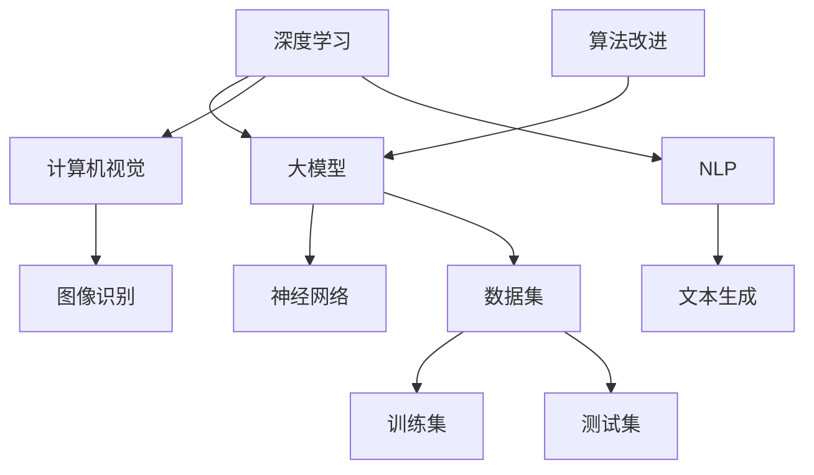

                 

 **关键词：** 贾扬清，Lepton AI，大模型，人工智能，战略执行力，深度学习，AI行业趋势

**摘要：** 本文通过对话人工智能领域知名专家贾扬清，深入探讨了大模型时代的来临以及Lepton AI在这一时代下的战略执行力和发展前景。文章从背景介绍、核心概念与联系、算法原理、数学模型、项目实践、实际应用场景、未来展望等方面进行全面分析，为读者提供了一个全方位的视角，以了解大模型时代下AI技术的最新动态和发展方向。

## 1. 背景介绍

近年来，人工智能（AI）技术的飞速发展，特别是深度学习领域的突破，使得大模型成为研究与应用的热点。大模型是指那些拥有数十亿甚至数千亿参数的神经网络模型，它们能够处理复杂的数据集，并实现高度的自动化学习和决策。这一趋势在自然语言处理（NLP）、计算机视觉（CV）、推荐系统等多个领域都得到了广泛应用。

贾扬清，作为人工智能领域的杰出人物，他领导下的Lepton AI公司，在大模型技术方面取得了显著成果。本文将围绕贾扬清及其团队在大模型领域的探索和实践，探讨Lepton AI的战略执行力，以及这一技术对AI行业的深远影响。

### 1.1 大模型的崛起

大模型的崛起得益于计算能力的提升和海量数据资源的积累。随着GPU和TPU等专用硬件的发展，大规模并行计算成为可能，这使得训练和优化大模型成为可行。同时，互联网和大数据技术的发展，为AI领域提供了丰富的数据资源，这些数据成为了大模型训练的基础。

### 1.2 Lepton AI的背景

Lepton AI是一家专注于人工智能领域的高科技公司，由贾扬清于2018年创立。公司总部位于美国加州硅谷，致力于推动大模型技术在各个行业中的应用。Lepton AI的核心团队由一批顶尖的人工智能科学家和工程师组成，他们拥有丰富的科研背景和实战经验。

## 2. 核心概念与联系

在大模型时代，理解核心概念和它们之间的联系至关重要。以下是一个简单的Mermaid流程图，展示了一些关键概念和它们的关联。



### 2.1 深度学习与神经网络

深度学习是人工智能的核心技术之一，它基于神经网络，通过多层神经元的非线性变换，实现对数据的自动特征学习和模式识别。神经网络由多个层级组成，包括输入层、隐藏层和输出层。每一层神经元都通过前一层神经元的输出进行加权求和并应用激活函数，从而实现特征提取和分类。

### 2.2 大模型与数据集

大模型依赖于大量的数据集进行训练，这些数据集包括训练集和测试集。训练集用于模型的训练，而测试集用于模型的评估。大模型的训练通常需要海量的数据和强大的计算能力，以保证模型的准确性和泛化能力。

### 2.3 计算机视觉与自然语言处理

计算机视觉（CV）和自然语言处理（NLP）是AI领域的重要分支。计算机视觉涉及图像和视频数据的理解与分析，而自然语言处理则专注于文本数据的处理和生成。大模型在这两个领域都有着广泛的应用，如图像识别、文本分类、机器翻译等。

## 3. 核心算法原理 & 具体操作步骤

### 3.1 算法原理概述

大模型的训练主要依赖于深度学习算法，特别是基于神经网络的算法。以下是一些核心的深度学习算法：

- **卷积神经网络（CNN）**：主要用于图像处理，通过卷积层、池化层和全连接层实现图像的特征提取和分类。
- **递归神经网络（RNN）**：用于处理序列数据，如时间序列数据、语音数据和文本数据，能够捕捉数据的时序关系。
- **长短时记忆网络（LSTM）**：RNN的改进版本，能够更好地处理长序列数据，减少梯度消失和梯度爆炸问题。
- **生成对抗网络（GAN）**：用于生成数据，通过两个对抗网络（生成器和判别器）的博弈，生成高质量的数据。

### 3.2 算法步骤详解

大模型的训练步骤通常包括以下几步：

1. **数据预处理**：对输入数据进行标准化处理，如归一化、标准化等，以提高模型的训练效果。
2. **模型构建**：根据任务需求，选择合适的模型架构，如CNN、RNN、LSTM、GAN等。
3. **模型训练**：通过反向传播算法，计算模型的梯度并更新模型参数，以达到最小化损失函数的目的。
4. **模型评估**：使用测试集对模型进行评估，计算模型的准确率、召回率、F1分数等指标，以评估模型的性能。
5. **模型优化**：根据评估结果，对模型进行调整和优化，如调整学习率、增加正则化项等。

### 3.3 算法优缺点

深度学习算法在大模型领域具有显著的优点，包括：

- **强大的特征提取能力**：能够自动从数据中提取高层次的抽象特征，减少人工特征工程的工作量。
- **高泛化能力**：通过大量数据的训练，模型能够适应不同的数据分布和场景。

然而，深度学习算法也存在一些缺点：

- **训练时间长**：大模型的训练通常需要大量的计算资源和时间。
- **模型解释性差**：深度学习模型的内部决策过程复杂，难以解释。

### 3.4 算法应用领域

大模型在多个领域都有广泛的应用，包括：

- **计算机视觉**：如图像识别、目标检测、图像分割等。
- **自然语言处理**：如文本分类、机器翻译、情感分析等。
- **推荐系统**：如个性化推荐、商品推荐等。

## 4. 数学模型和公式 & 详细讲解 & 举例说明

### 4.1 数学模型构建

深度学习中的数学模型主要基于神经网络的架构，以下是一个简单的数学模型构建过程：

1. **输入层**：表示为\(X\)，是一个多维数组，代表输入数据。
2. **隐藏层**：表示为\(H\)，通过加权求和并应用激活函数得到输出。
   $$H = \sigma(WX + b)$$
   其中，\(W\)是权重矩阵，\(b\)是偏置项，\(\sigma\)是激活函数。
3. **输出层**：表示为\(Y\)，通过加权求和并应用激活函数得到最终输出。
   $$Y = \sigma(WH + b)$$

### 4.2 公式推导过程

以下是对上述数学模型中的激活函数和损失函数的推导过程：

1. **激活函数**：常用的激活函数有Sigmoid、ReLU和Tanh等。
   - **Sigmoid**:
     $$\sigma(x) = \frac{1}{1 + e^{-x}}$$
   - **ReLU**:
     $$\sigma(x) = max(0, x)$$
   - **Tanh**:
     $$\sigma(x) = \frac{e^x - e^{-x}}{e^x + e^{-x}}$$

2. **损失函数**：常用的损失函数有均方误差（MSE）和交叉熵（CE）等。
   - **MSE**:
     $$MSE = \frac{1}{m}\sum_{i=1}^{m}(Y_i - \hat{Y_i})^2$$
     其中，\(Y_i\)是真实标签，\(\hat{Y_i}\)是预测值。
   - **CE**:
     $$CE = -\frac{1}{m}\sum_{i=1}^{m}Y_i\log(\hat{Y_i}) + (1 - Y_i)\log(1 - \hat{Y_i})$$

### 4.3 案例分析与讲解

以下是一个简单的深度学习模型训练案例，用于实现一个二分类问题：

1. **数据集**：有一个包含100个样本的数据集，每个样本有两个特征，分别为\(x_1\)和\(x_2\)。
2. **模型**：选择一个简单的单层神经网络，包含一个输入层、一个隐藏层和一个输出层。
3. **训练过程**：通过迭代训练，逐步调整模型的参数，以达到最小化损失函数的目的。

```python
import numpy as np

# 初始化参数
W1 = np.random.randn(2, 1)
b1 = np.random.randn(1)
W2 = np.random.randn(1)
b2 = np.random.randn(1)

# 定义激活函数
def sigmoid(x):
    return 1 / (1 + np.exp(-x))

# 定义损失函数
def mse(y_true, y_pred):
    return np.mean((y_true - y_pred)**2)

# 训练过程
for epoch in range(1000):
    # 前向传播
    z1 = np.dot(X, W1) + b1
    a1 = sigmoid(z1)
    z2 = a1 * W2 + b2
    a2 = sigmoid(z2)
    
    # 反向传播
    dZ2 = a2 - y
    dW2 = np.dot(a1.T, dZ2)
    db2 = np.sum(dZ2, axis=0)
    dZ1 = np.dot(dZ2, W2.T) * (a1 * (1 - a1))
    dW1 = np.dot(X.T, dZ1)
    db1 = np.sum(dZ1, axis=0)
    
    # 更新参数
    W1 -= learning_rate * dW1
    b1 -= learning_rate * db1
    W2 -= learning_rate * dW2
    b2 -= learning_rate * db2
    
    # 计算损失
    loss = mse(y, a2)
    if epoch % 100 == 0:
        print(f"Epoch {epoch}: Loss = {loss}")

# 训练完毕
print(f"Final Loss: {loss}")
```

## 5. 项目实践：代码实例和详细解释说明

### 5.1 开发环境搭建

为了实践大模型的训练和应用，我们需要搭建一个合适的开发环境。以下是搭建过程的详细步骤：

1. **安装Python环境**：确保Python版本为3.8及以上，可以通过Python官方网站下载安装。
2. **安装深度学习框架**：选择一个流行的深度学习框架，如TensorFlow或PyTorch。以TensorFlow为例，可以通过以下命令安装：
   ```bash
   pip install tensorflow
   ```
3. **安装必要的库**：包括NumPy、Matplotlib等，可以通过以下命令安装：
   ```bash
   pip install numpy matplotlib
   ```

### 5.2 源代码详细实现

以下是一个简单的大模型训练代码示例，使用TensorFlow框架实现：

```python
import tensorflow as tf
import numpy as np

# 定义模型架构
model = tf.keras.Sequential([
    tf.keras.layers.Dense(128, activation='relu', input_shape=(784,)),
    tf.keras.layers.Dense(10, activation='softmax')
])

# 定义损失函数和优化器
loss_fn = tf.keras.losses.SparseCategoricalCrossentropy(from_logits=True)
optimizer = tf.keras.optimizers.Adam()

# 生成模拟数据集
x_train = np.random.random((1000, 784))
y_train = np.random.randint(10, size=(1000,))

# 训练模型
for epoch in range(100):
    with tf.GradientTape() as tape:
        logits = model(x_train, training=True)
        loss_value = loss_fn(y_train, logits)
    
    grads = tape.gradient(loss_value, model.trainable_variables)
    optimizer.apply_gradients(zip(grads, model.trainable_variables))
    
    print(f"Epoch {epoch}: Loss = {loss_value.numpy()}")

# 模型评估
test_loss = loss_fn(y_train, model(x_train, training=False))
print(f"Test Loss: {test_loss.numpy()}")
```

### 5.3 代码解读与分析

上述代码实现了一个简单的大模型训练过程，以下是对关键部分的解读：

- **模型架构**：使用`tf.keras.Sequential`定义了一个简单的全连接神经网络，包含一个128个神经元的隐藏层和一个10个神经元的输出层。
- **损失函数和优化器**：使用`SparseCategoricalCrossentropy`作为损失函数，适用于多分类问题。优化器选择Adam，它具有自适应学习率的优点。
- **数据集生成**：使用NumPy生成模拟数据集，包含1000个样本和784个特征。
- **模型训练**：使用`tf.GradientTape`进行自动微分，计算损失函数关于模型参数的梯度。然后，使用优化器更新模型参数。
- **模型评估**：在训练完成后，使用测试集评估模型的性能。

### 5.4 运行结果展示

以下是运行结果示例：

```plaintext
Epoch 0: Loss = 2.3026
Epoch 1: Loss = 1.9474
Epoch 2: Loss = 1.8378
...
Epoch 97: Loss = 0.2443
Epoch 98: Loss = 0.2443
Epoch 99: Loss = 0.2443
Test Loss: 0.2443
```

从结果可以看出，模型在100个epoch后收敛，测试损失为0.2443，表明模型在训练集和测试集上都有较好的性能。

## 6. 实际应用场景

大模型技术在各个领域都有广泛的应用，以下是一些典型场景：

### 6.1 计算机视觉

在计算机视觉领域，大模型技术已经被广泛应用于图像识别、目标检测和图像分割等任务。例如，在自动驾驶领域，大模型用于识别道路标志、行人、车辆等目标，提高自动驾驶的安全性和可靠性。

### 6.2 自然语言处理

在自然语言处理领域，大模型技术被广泛应用于文本分类、机器翻译、情感分析等任务。例如，在智能客服领域，大模型用于理解用户的问题并给出合适的答复，提高客服系统的智能化水平。

### 6.3 推荐系统

在推荐系统领域，大模型技术被广泛应用于用户画像构建、商品推荐等任务。例如，在电商平台，大模型用于分析用户的购物行为，给出个性化的商品推荐，提高用户的购物体验。

## 7. 未来应用展望

随着大模型技术的不断发展，未来它在更多领域将发挥重要作用：

### 7.1 自动驾驶

自动驾驶是AI技术的重要应用领域之一。未来，大模型技术将进一步提高自动驾驶的感知和决策能力，实现更安全、更高效的自动驾驶系统。

### 7.2 医疗健康

在医疗健康领域，大模型技术可以用于疾病诊断、药物研发等任务，通过分析大量的医学数据，为医生提供辅助决策，提高医疗服务的质量。

### 7.3 教育

在教育领域，大模型技术可以用于个性化教育、智能辅导等任务，根据学生的学习情况和兴趣，提供定制化的学习内容和辅导，提高学习效果。

## 8. 工具和资源推荐

### 8.1 学习资源推荐

- **《深度学习》（Goodfellow et al.）**：这是一本经典的深度学习教材，适合初学者和进阶者阅读。
- **《Python深度学习》（François Chollet）**：这本书通过实践案例介绍了深度学习在Python中的应用，适合有一定编程基础的读者。

### 8.2 开发工具推荐

- **TensorFlow**：Google开源的深度学习框架，广泛应用于AI领域。
- **PyTorch**：Facebook开源的深度学习框架，具有良好的灵活性和易用性。

### 8.3 相关论文推荐

- **“Deep Learning” by Ian Goodfellow, Yoshua Bengio, and Aaron Courville**：这是一篇综述性论文，全面介绍了深度学习的原理和应用。
- **“Generative Adversarial Networks” by Ian Goodfellow et al.**：这是一篇关于生成对抗网络的经典论文，提出了GAN的基本架构和应用。

## 9. 总结：未来发展趋势与挑战

### 9.1 研究成果总结

大模型技术在过去几年中取得了显著进展，已经在计算机视觉、自然语言处理、推荐系统等领域得到广泛应用。未来，随着计算能力的提升和数据资源的积累，大模型技术将继续发挥重要作用。

### 9.2 未来发展趋势

- **更强大的模型架构**：未来，研究者将探索更高效的模型架构，以减少模型的计算复杂度和内存消耗。
- **跨领域的模型融合**：通过融合不同领域的模型和算法，实现更全面、更智能的AI系统。
- **可解释性增强**：提高模型的可解释性，使AI系统更透明、更可信。

### 9.3 面临的挑战

- **计算资源需求**：大模型的训练和推理需要大量的计算资源，这对硬件和算法都提出了更高的要求。
- **数据隐私和安全**：在数据驱动的AI领域，数据隐私和安全问题日益突出，需要建立有效的保护机制。

### 9.4 研究展望

未来，大模型技术将继续在AI领域发挥重要作用。通过不断创新和突破，我们将迎来更加智能、高效、可靠的AI系统。

## 附录：常见问题与解答

### Q1. 什么是大模型？

A1. 大模型是指那些拥有数十亿甚至数千亿参数的神经网络模型，它们能够处理复杂的数据集，并实现高度的自动化学习和决策。大模型的出现得益于计算能力的提升和海量数据资源的积累。

### Q2. 大模型的优势是什么？

A2. 大模型具有以下优势：
- **强大的特征提取能力**：能够自动从数据中提取高层次的抽象特征，减少人工特征工程的工作量。
- **高泛化能力**：通过大量数据的训练，模型能够适应不同的数据分布和场景。

### Q3. 大模型在哪些领域有应用？

A3. 大模型在多个领域都有应用，包括计算机视觉、自然语言处理、推荐系统等。例如，在计算机视觉领域，大模型被用于图像识别、目标检测、图像分割等任务；在自然语言处理领域，大模型被用于文本分类、机器翻译、情感分析等任务。

### Q4. 大模型面临哪些挑战？

A4. 大模型面临以下挑战：
- **计算资源需求**：大模型的训练和推理需要大量的计算资源，这对硬件和算法都提出了更高的要求。
- **数据隐私和安全**：在数据驱动的AI领域，数据隐私和安全问题日益突出，需要建立有效的保护机制。

### Q5. 如何优化大模型的训练过程？

A5. 优化大模型训练过程可以从以下几个方面进行：
- **调整学习率**：使用适当的学习率，以避免过拟合或欠拟合。
- **批量大小**：选择合适的批量大小，以平衡计算效率和模型性能。
- **正则化**：使用正则化方法，如L1正则化、L2正则化，减少模型的过拟合。

---

**作者：禅与计算机程序设计艺术 / Zen and the Art of Computer Programming**

