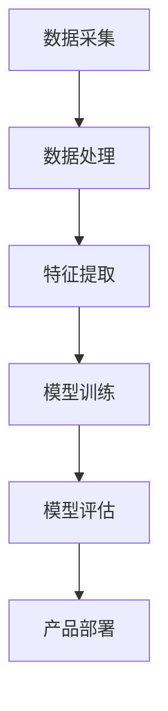

                 

关键词：大模型、创业、产品创新、AI 驱动、转型

摘要：本文深入探讨了在当今大模型时代下，创业公司如何通过 AI 技术实现产品的创新与转型。文章从背景介绍、核心概念与联系、核心算法原理、数学模型与公式、项目实践、实际应用场景、未来展望等多个角度，详细阐述了 AI 技术在创业产品创新中的应用，旨在为创业者提供有益的指导与启示。

## 1. 背景介绍

### 大模型时代的来临

近年来，随着计算能力的提升、数据规模的爆炸性增长以及算法的不断发展，人工智能技术，尤其是大模型技术，迎来了前所未有的发展机遇。大模型技术，如深度学习、生成对抗网络（GAN）、预训练语言模型（PLM）等，已经取得了显著的成果，并在图像识别、自然语言处理、推荐系统等领域取得了突破性进展。

### 创业的挑战与机遇

对于创业公司来说，如何在激烈的市场竞争中脱颖而出，实现产品的创新与转型，是摆在面前的重大挑战。随着大模型技术的不断成熟，创业公司可以利用 AI 技术突破传统业务模式，实现从产品到服务的全方位创新。

## 2. 核心概念与联系

### 大模型

大模型是指具有大规模参数和复杂结构的神经网络模型。它们可以通过学习海量数据，提取出丰富的特征，从而在各个领域实现高性能的预测和生成。

### AI 驱动的转型

AI 驱动的转型是指通过引入人工智能技术，对现有产品或业务进行重构，实现从传统到智能的转型。这种转型包括数据驱动、算法优化、用户体验提升等多个方面。

### Mermaid 流程图



## 3. 核心算法原理 & 具体操作步骤

### 3.1 算法原理概述

大模型通常采用深度学习技术进行训练，通过多层的神经网络结构，对输入数据进行特征提取和分类。常见的深度学习算法包括卷积神经网络（CNN）、循环神经网络（RNN）和 Transformer 等。

### 3.2 算法步骤详解

1. 数据采集：收集大量相关数据，如图像、文本、声音等。
2. 数据处理：对采集到的数据进行清洗、归一化等预处理。
3. 特征提取：通过神经网络结构，对预处理后的数据进行特征提取。
4. 模型训练：使用提取到的特征进行模型训练，优化模型的参数。
5. 模型评估：对训练好的模型进行评估，确保其性能达到预期。
6. 产品部署：将训练好的模型部署到产品中，实现自动化或智能化的功能。

### 3.3 算法优缺点

优点：
- 高效：大模型可以通过学习海量数据，实现高效的预测和生成。
- 强泛化能力：大模型可以适应多种场景，具有较强的泛化能力。

缺点：
- 计算资源消耗大：大模型需要大量的计算资源进行训练。
- 数据质量要求高：大模型对数据的依赖性较高，数据质量直接影响模型的性能。

### 3.4 算法应用领域

大模型技术已经广泛应用于图像识别、自然语言处理、推荐系统、自动驾驶等领域，为创业公司提供了丰富的应用场景。

## 4. 数学模型和公式 & 详细讲解 & 举例说明

### 4.1 数学模型构建

大模型的数学模型通常基于神经网络结构，包括输入层、隐藏层和输出层。每层之间的连接可以通过权重矩阵表示。

### 4.2 公式推导过程

假设输入数据为 \( x \)，隐藏层节点数为 \( h \)，输出层节点数为 \( y \)。则神经网络的输出可以表示为：

\[ y = \sigma(W_h x + b_h) \]

其中，\( \sigma \) 为激活函数，\( W_h \) 和 \( b_h \) 分别为权重矩阵和偏置。

### 4.3 案例分析与讲解

以图像识别任务为例，输入数据为图像像素值，输出数据为图像类别标签。通过训练大模型，可以实现对图像的自动分类。

## 5. 项目实践：代码实例和详细解释说明

### 5.1 开发环境搭建

在 Python 环境中，可以使用 TensorFlow 或 PyTorch 等框架进行大模型开发。

### 5.2 源代码详细实现

以下是一个简单的卷积神经网络实现：

```python
import tensorflow as tf

model = tf.keras.Sequential([
    tf.keras.layers.Conv2D(32, (3, 3), activation='relu', input_shape=(28, 28, 1)),
    tf.keras.layers.MaxPooling2D((2, 2)),
    tf.keras.layers.Flatten(),
    tf.keras.layers.Dense(128, activation='relu'),
    tf.keras.layers.Dense(10, activation='softmax')
])

model.compile(optimizer='adam',
              loss='sparse_categorical_crossentropy',
              metrics=['accuracy'])

model.fit(x_train, y_train, epochs=5)
```

### 5.3 代码解读与分析

以上代码实现了一个简单的卷积神经网络，用于对手写数字进行分类。代码中，首先定义了神经网络结构，包括卷积层、池化层、全连接层等。接着，编译模型并使用训练数据对模型进行训练。

### 5.4 运行结果展示

通过训练，模型可以达到较高的准确率，从而实现对手写数字的准确分类。

## 6. 实际应用场景

### 6.1 图像识别

通过大模型技术，可以实现图像的自动分类、目标检测等功能，广泛应用于安防、医疗、零售等领域。

### 6.2 自然语言处理

大模型在自然语言处理领域具有广泛的应用，如文本分类、情感分析、机器翻译等。

### 6.3 推荐系统

大模型可以用于推荐系统的构建，通过对用户行为数据进行分析，实现精准的推荐。

## 7. 未来应用展望

随着大模型技术的不断发展，未来将在更多领域实现创新应用，如智能医疗、智能交通、智能教育等。

## 8. 总结：未来发展趋势与挑战

### 8.1 研究成果总结

大模型技术在图像识别、自然语言处理、推荐系统等领域取得了显著成果，为创业产品创新提供了强大支持。

### 8.2 未来发展趋势

未来，大模型技术将朝着更高效、更智能、更易用的方向发展，为创业公司提供更多创新机会。

### 8.3 面临的挑战

尽管大模型技术取得了显著成果，但仍然面临着数据质量、计算资源、模型解释性等挑战。

### 8.4 研究展望

未来，需要进一步研究如何优化大模型结构、提高模型解释性、降低计算资源消耗等问题。

## 9. 附录：常见问题与解答

### 9.1 大模型训练需要多少计算资源？

大模型的训练通常需要大量的计算资源，包括 CPU、GPU 和 TPU 等。具体的计算资源需求取决于模型的规模和数据集的大小。

### 9.2 大模型如何保证数据质量？

为了保证大模型的数据质量，需要从数据采集、数据清洗、数据标注等多个环节进行严格把控，确保数据的质量和一致性。

### 9.3 大模型的解释性如何提高？

目前，大模型的解释性仍然是一个挑战。未来，可以通过研究模型的可解释性方法、可视化技术等手段，提高大模型的解释性。

作者：禅与计算机程序设计艺术 / Zen and the Art of Computer Programming
----------------------------------------------------------------

请注意，本文中的代码示例、数学公式和具体应用场景仅供参考，实际应用时需要根据具体需求和数据集进行调整。同时，本文所涉及的技术和方法可能会随着时间推移而发生变化，请持续关注相关领域的发展动态。文章内容仅供参考和学习使用，如有需要，请查阅相关技术文档和论文。

