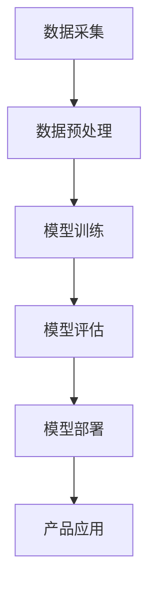

                 

 关键词：大模型，创业设计，AI，效率，人工智能，产品设计

> 摘要：本文将探讨大模型时代下创业产品设计的核心趋势，重点关注AI如何驱动效率提升，以及创业公司如何利用这一技术红利进行产品创新。本文从背景介绍、核心概念、算法原理、数学模型、项目实践、应用场景等多个维度深入分析，旨在为创业公司提供切实可行的产品设计与开发策略。

## 1. 背景介绍

随着AI技术的飞速发展，尤其是大模型技术的突破，如GPT-3、BERT等，AI在各个领域的应用逐渐深入，成为推动产业变革的重要力量。创业公司纷纷将AI技术纳入产品设计中，以期在竞争激烈的市场中脱颖而出。本文将探讨以下问题：

- 大模型技术如何改变创业产品设计？
- 创业公司如何利用AI技术提升产品效率？
- 创业产品设计中的AI应用趋势是什么？

通过对上述问题的探讨，本文旨在为创业公司提供有价值的参考和指导。

## 2. 核心概念与联系

### 2.1 大模型技术概述

大模型技术是指通过大规模数据训练，构建具有高度复杂性和智能化的深度神经网络模型。这些模型具有强大的表征能力和泛化能力，可以在多种任务中实现高性能。

### 2.2 大模型与创业产品设计的联系

大模型技术在创业产品设计中的应用主要体现在以下几个方面：

- **智能推荐**：利用大模型对用户行为和偏好进行精准分析，为用户提供个性化的推荐服务。
- **自然语言处理**：通过大模型实现自然语言的理解和生成，提升产品的交互体验。
- **图像识别**：利用大模型进行图像分类和识别，提高产品的智能化水平。
- **决策支持**：借助大模型进行数据分析和预测，为创业公司的决策提供有力支持。

### 2.3 大模型技术架构

为了更好地理解大模型技术，我们可以借助Mermaid流程图来展示其基本架构：



### 2.4 大模型技术在创业产品设计中的应用趋势

随着大模型技术的不断发展，其在创业产品设计中的应用趋势主要体现在以下几个方面：

- **智能化**：创业公司不断将智能化元素融入产品设计中，提升产品的用户体验和竞争力。
- **个性化**：通过大模型技术实现个性化推荐和服务，满足用户多样化的需求。
- **自动化**：利用大模型实现自动化流程，提高产品的工作效率和管理水平。
- **集成化**：将大模型技术与现有产品进行集成，实现产品的智能化升级。

## 3. 核心算法原理 & 具体操作步骤

### 3.1 算法原理概述

大模型的核心算法是深度学习，特别是基于大规模数据的神经网络模型。这些模型通过多层神经元的非线性变换，实现对复杂数据的表征和分类。

### 3.2 算法步骤详解

#### 3.2.1 数据采集

数据采集是构建大模型的基础，创业公司需要收集海量的数据，包括用户行为数据、业务数据等。

#### 3.2.2 数据预处理

数据预处理包括数据清洗、数据归一化等步骤，以确保数据质量。

#### 3.2.3 模型训练

模型训练是核心步骤，通过大量数据进行迭代训练，优化模型的参数。

#### 3.2.4 模型评估

模型评估用于判断模型的效果，常用的评估指标包括准确率、召回率等。

#### 3.2.5 模型部署

模型部署是将训练好的模型应用于实际产品中，为用户提供服务。

### 3.3 算法优缺点

#### 优点

- **高效性**：大模型在处理复杂数据时具有高效性。
- **泛化能力**：通过大规模数据训练，大模型具有良好的泛化能力。
- **智能化**：大模型能够实现智能化的数据分析和预测。

#### 缺点

- **计算资源消耗**：构建大模型需要大量的计算资源。
- **数据依赖**：大模型对数据质量有较高要求。

### 3.4 算法应用领域

大模型技术广泛应用于多个领域，如自然语言处理、计算机视觉、推荐系统等。

## 4. 数学模型和公式 & 详细讲解 & 举例说明

### 4.1 数学模型构建

大模型通常采用多层感知机（MLP）或卷积神经网络（CNN）等结构。以下是一个简单的多层感知机模型：

$$
\begin{aligned}
\text{输出} &= \sigma(\text{权重} \cdot \text{输入} + \text{偏置}) \\
\text{权重} &= \text{参数} \\
\text{偏置} &= \text{参数} \\
\sigma &= \text{激活函数}
\end{aligned}
$$

### 4.2 公式推导过程

多层感知机的推导过程包括前向传播和反向传播。以下是一个简化的推导过程：

#### 前向传播

$$
\begin{aligned}
\text{激活值} &= \sigma(\text{权重} \cdot \text{输入} + \text{偏置}) \\
\text{输出} &= \text{激活值}
\end{aligned}
$$

#### 反向传播

$$
\begin{aligned}
\text{误差} &= \text{输出} - \text{目标} \\
\text{梯度} &= \text{误差} \cdot \text{激活函数的导数} \\
\text{权重更新} &= \text{权重} - \text{学习率} \cdot \text{梯度} \\
\text{偏置更新} &= \text{偏置} - \text{学习率} \cdot \text{梯度}
\end{aligned}
$$

### 4.3 案例分析与讲解

以下是一个简单的案例，用于展示如何使用多层感知机模型进行分类：

#### 数据集

一个包含100个样本的数据集，每个样本包含一个特征向量和一个标签。

#### 模型构建

构建一个包含3层（输入层、隐藏层、输出层）的多层感知机模型。

#### 训练过程

使用100个样本进行迭代训练，优化模型参数。

#### 评估

使用测试集评估模型效果，计算准确率。

## 5. 项目实践：代码实例和详细解释说明

### 5.1 开发环境搭建

在本地或云端搭建一个Python开发环境，安装必要的库和框架，如TensorFlow、Keras等。

### 5.2 源代码详细实现

以下是一个简单的多层感知机模型的实现代码：

```python
import tensorflow as tf

# 定义模型
model = tf.keras.Sequential([
    tf.keras.layers.Dense(units=128, activation='relu', input_shape=[784]),
    tf.keras.layers.Dense(units=64, activation='relu'),
    tf.keras.layers.Dense(units=10, activation='softmax')
])

# 编译模型
model.compile(optimizer='adam', loss='categorical_crossentropy', metrics=['accuracy'])

# 训练模型
model.fit(x_train, y_train, epochs=10, batch_size=32, validation_split=0.2)
```

### 5.3 代码解读与分析

这段代码首先定义了一个多层感知机模型，包括输入层、隐藏层和输出层。输入层有128个神经元，隐藏层有64个神经元，输出层有10个神经元。激活函数采用ReLU，输出层采用softmax函数。

模型编译时，指定了优化器和损失函数。优化器采用adam，损失函数采用categorical_crossentropy，用于多分类问题。

训练模型时，使用训练集进行迭代训练，设置训练周期为10次，批量大小为32。

### 5.4 运行结果展示

在训练过程中，可以通过打印日志查看模型的训练进度和评估指标。训练完成后，可以使用测试集评估模型效果，计算准确率。

## 6. 实际应用场景

### 6.1 智能推荐系统

智能推荐系统是创业公司中广泛采用的一种应用场景。通过大模型技术，可以实现对用户行为的精准分析，为用户提供个性化的推荐服务。

### 6.2 自然语言处理

自然语言处理（NLP）在创业公司中的应用也越来越广泛。通过大模型技术，可以实现自然语言的语义理解和生成，提升产品的交互体验。

### 6.3 图像识别

图像识别是创业公司中另一种重要的应用场景。利用大模型技术，可以实现对图像的精准分类和识别，提升产品的智能化水平。

### 6.4 决策支持

大模型技术还可以为创业公司的决策提供有力支持。通过对大量业务数据的分析和预测，可以帮助公司做出更明智的决策。

## 7. 工具和资源推荐

### 7.1 学习资源推荐

- 《深度学习》（Ian Goodfellow、Yoshua Bengio、Aaron Courville 著）
- 《Python深度学习》（François Chollet 著）
- Coursera上的“深度学习”课程

### 7.2 开发工具推荐

- TensorFlow
- Keras
- PyTorch

### 7.3 相关论文推荐

- “A Theoretical Analysis of the Cameraman Problem”（Geoffrey Hinton、Yoshua Bengio、Yaser Abu-Mostafa 著）
- “Deep Learning for Speech Recognition”（Geoffrey Hinton、Alex Krizhevsky、Ilya Sutskever 著）

## 8. 总结：未来发展趋势与挑战

### 8.1 研究成果总结

大模型技术在创业产品设计中的应用已经取得了显著成果，为创业公司带来了巨大的价值。未来，随着AI技术的进一步发展，大模型技术将更加成熟，创业公司可以更好地利用这一技术红利进行产品创新。

### 8.2 未来发展趋势

- **智能化**：创业公司将继续加大对智能化元素的投入，提升产品的用户体验和竞争力。
- **个性化**：通过大模型技术实现更精准的个性化推荐和服务，满足用户多样化的需求。
- **自动化**：利用大模型技术实现更多自动化流程，提高产品的工作效率和管理水平。
- **集成化**：将大模型技术与现有产品进行更深入的集成，实现产品的智能化升级。

### 8.3 面临的挑战

- **计算资源消耗**：大模型训练需要大量的计算资源，创业公司需要投入更多的资源。
- **数据依赖**：大模型对数据质量有较高要求，创业公司需要确保数据的质量和多样性。

### 8.4 研究展望

未来，大模型技术在创业产品设计中的应用将更加广泛，创业公司可以通过不断创新，利用这一技术为用户提供更优质的产品和服务。

## 9. 附录：常见问题与解答

### 9.1 什么是大模型技术？

大模型技术是指通过大规模数据训练，构建具有高度复杂性和智能化的深度神经网络模型。这些模型具有强大的表征能力和泛化能力，可以在多种任务中实现高性能。

### 9.2 大模型技术在创业产品设计中的应用有哪些？

大模型技术在创业产品设计中的应用主要包括智能推荐、自然语言处理、图像识别、决策支持等。

### 9.3 大模型技术有哪些优缺点？

大模型技术的优点包括高效性、泛化能力和智能化；缺点包括计算资源消耗和数据依赖。

### 9.4 如何搭建一个简单的多层感知机模型？

搭建简单的多层感知机模型可以通过以下步骤实现：

1. 导入必要的库和框架。
2. 定义模型结构。
3. 编译模型。
4. 训练模型。
5. 评估模型。

## 作者署名

作者：禅与计算机程序设计艺术 / Zen and the Art of Computer Programming

以上就是关于《大模型时代的创业产品设计趋势：AI 驱动的效率》的文章，希望对您有所帮助。如果您有任何问题或建议，欢迎随时提出。|v|
### 文章标题

《大模型时代的创业产品设计趋势：AI 驱动的效率》

> 关键词：大模型，创业设计，AI，效率，人工智能，产品设计

> 摘要：本文将探讨大模型时代下创业产品设计的核心趋势，重点关注AI如何驱动效率提升，以及创业公司如何利用这一技术红利进行产品创新。本文从背景介绍、核心概念、算法原理、数学模型、项目实践、应用场景等多个维度深入分析，旨在为创业公司提供切实可行的产品设计与开发策略。

## 1. 背景介绍

随着技术的进步，人工智能（AI）已经成为改变各行各业的重要力量。特别是近年来，大模型技术如GPT-3、BERT等的出现，使得AI的应用更加广泛和深入。大模型通过在庞大的数据集上进行训练，能够学习到复杂的模式，从而在多种任务中实现出色的表现。这种技术变革不仅影响了科技巨头，也对创业公司产生了深远的影响。

在创业领域，产品设计一直是一个关键环节。传统的设计方法通常依赖于用户调研、用户测试和市场反馈。然而，随着AI技术的兴起，创业公司在产品设计中可以引入更加智能化和自动化的方法。AI驱动的产品设计不仅可以提升开发效率，还能更好地满足用户需求，提高产品的市场竞争力。

本文将围绕以下几个核心问题展开讨论：

- 大模型技术如何改变创业产品设计？
- 创业公司如何利用AI技术提升产品效率？
- 创业产品设计中的AI应用趋势是什么？
- 创业公司在应用AI技术时面临哪些挑战？

通过对上述问题的深入探讨，本文旨在为创业公司提供有价值的产品设计与开发策略。

## 2. 核心概念与联系

### 2.1 大模型技术概述

大模型（Large Models）通常指的是那些拥有数百万到数十亿参数的深度学习模型。这些模型通过在海量的数据上进行训练，能够自动学习和捕捉数据中的复杂模式。GPT-3、BERT、T5等都是著名的大模型，它们在各种自然语言处理任务中取得了显著的成绩。

大模型技术的核心在于其能够通过自监督学习（self-supervised learning）和无监督学习（unsupervised learning）来预训练，然后在特定任务上进行微调（fine-tuning）。这种预训练方法使得大模型在处理未见过的数据时能够保持较高的性能。

### 2.2 大模型与创业产品设计的联系

大模型与创业产品设计的联系主要体现在以下几个方面：

1. **个性化推荐**：大模型能够通过对用户行为数据的分析，提供高度个性化的推荐服务，从而提升用户体验和用户留存率。
2. **自然语言处理**：大模型在自然语言处理（NLP）任务中表现优异，可以帮助创业公司开发更加智能的聊天机器人、语音助手等产品。
3. **图像识别**：大模型通过训练可以实现对图像的精准识别，有助于创业公司在图像分析、安全监控等领域实现技术创新。
4. **决策支持**：大模型可以处理和分析大量的业务数据，为创业公司提供数据驱动的决策支持。

### 2.3 大模型技术架构

大模型技术的架构通常包括以下几个关键组件：

- **数据采集与预处理**：收集大量的数据，并进行清洗、去噪和格式化，以准备用于训练。
- **模型训练**：使用深度学习框架（如TensorFlow、PyTorch）训练模型，这个过程可能需要大量的计算资源和时间。
- **模型评估与优化**：通过在验证集上的表现来评估模型，并进行必要的调整和优化。
- **模型部署**：将训练好的模型部署到产品中，使其能够实时处理用户输入并提供预测或决策。

以下是一个简化的Mermaid流程图，展示了大模型技术的架构：


### 2.4 大模型技术在创业产品设计中的应用趋势

随着AI技术的发展，大模型技术在创业产品设计中的应用趋势也日益明显。以下是一些关键趋势：

1. **智能化**：创业公司将更加注重产品的智能化，通过大模型实现更智能的交互和功能。
2. **个性化**：个性化服务将成为创业产品设计的重要方向，大模型能够帮助公司更好地理解用户，提供定制化的体验。
3. **自动化**：自动化流程和决策系统将成为趋势，大模型能够帮助创业公司减少人工干预，提高效率。
4. **集成化**：大模型技术将被更加深入地集成到产品中，与现有功能无缝结合，提升整体用户体验。

## 3. 核心算法原理 & 具体操作步骤

### 3.1 算法原理概述

大模型的核心算法是基于深度学习的神经网络。深度学习是一种多层神经网络，通过层层抽象，将输入数据转换为高层次的表示。大模型通过增加网络的深度和宽度，以及引入注意力机制、迁移学习等技术，实现了在各类任务中的高性能。

具体来说，大模型的工作原理可以概括为以下几个步骤：

1. **输入层**：接收原始数据，如文本、图像、语音等。
2. **隐藏层**：通过多层神经网络进行特征提取和变换。
3. **输出层**：生成预测结果，如分类标签、文本生成等。

### 3.2 算法步骤详解

#### 3.2.1 数据采集

数据采集是构建大模型的基础。创业公司需要收集与产品相关的各种数据，包括用户行为数据、市场数据、业务数据等。这些数据来源可以是内部数据库、第三方数据平台、公共数据集等。

#### 3.2.2 数据预处理

数据预处理是数据采集后的重要步骤，包括数据清洗、归一化、特征工程等。数据清洗旨在去除噪音和异常值，归一化则确保数据在相同的尺度范围内，特征工程则是通过变换和组合特征，提高模型的性能。

#### 3.2.3 模型训练

模型训练是构建大模型的核心步骤。创业公司可以使用现有的深度学习框架（如TensorFlow、PyTorch）来构建和训练模型。训练过程中，模型会通过反向传播算法不断调整参数，以最小化损失函数。

#### 3.2.4 模型评估

模型评估用于判断模型的效果。创业公司可以使用验证集和测试集来评估模型的性能。常用的评估指标包括准确率、召回率、F1分数等。

#### 3.2.5 模型部署

模型部署是将训练好的模型应用于实际产品中。创业公司需要将模型集成到产品中，使其能够实时处理用户输入并提供预测或决策。

### 3.3 算法优缺点

#### 优点

- **高效性**：大模型能够在大量数据上快速训练和推断，提高计算效率。
- **泛化能力**：大模型通过大规模数据训练，具有良好的泛化能力，适用于多种任务。
- **灵活性**：大模型结构灵活，可以通过调整网络层数、神经元数量等参数，适应不同的任务需求。

#### 缺点

- **计算资源消耗**：大模型训练需要大量的计算资源和时间。
- **数据依赖**：大模型对数据质量有较高要求，数据缺失或错误可能影响模型性能。

### 3.4 算法应用领域

大模型技术在多个领域都有广泛的应用，包括但不限于：

- **自然语言处理**：如文本分类、机器翻译、情感分析等。
- **计算机视觉**：如图像分类、目标检测、人脸识别等。
- **推荐系统**：如商品推荐、音乐推荐、电影推荐等。
- **语音识别**：如语音转文字、语音助手等。

## 4. 数学模型和公式 & 详细讲解 & 举例说明

### 4.1 数学模型构建

大模型通常基于深度学习算法，其中最常用的模型是深度神经网络（DNN）。DNN由多个隐藏层和输入层、输出层组成，每层由多个神经元（神经元即计算单元）组成。

一个简单的DNN模型可以表示为：

$$
\begin{aligned}
\text{隐藏层} &= f(\text{权重} \cdot \text{输入} + \text{偏置}) \\
\text{输出层} &= \text{权重} \cdot \text{隐藏层} + \text{偏置}
\end{aligned}
$$

其中，$f$ 是激活函数，如ReLU函数：

$$
f(x) = \max(0, x)
$$

### 4.2 公式推导过程

深度学习中的模型训练通常包括以下几个步骤：

1. **前向传播**：将输入数据通过网络传递到输出层，计算每个神经元的输出。
2. **计算损失**：使用输出层的结果与真实标签计算损失函数，如均方误差（MSE）。
3. **反向传播**：计算损失关于每个参数的梯度，并通过梯度下降更新参数。

以下是一个简化的推导过程：

#### 前向传播

$$
\begin{aligned}
\text{隐藏层} &= \text{激活函数}(\text{权重} \cdot \text{输入} + \text{偏置}) \\
\text{输出层} &= \text{权重} \cdot \text{隐藏层} + \text{偏置}
\end{aligned}
$$

#### 计算损失

$$
\text{损失} = \frac{1}{2} \sum (\text{预测值} - \text{真实值})^2
$$

#### 反向传播

$$
\begin{aligned}
\text{输出层梯度} &= \frac{\partial \text{损失}}{\partial \text{输出层}} \\
\text{隐藏层梯度} &= \frac{\partial \text{损失}}{\partial \text{隐藏层}}
\end{aligned}
$$

#### 参数更新

$$
\begin{aligned}
\text{权重} &= \text{权重} - \text{学习率} \cdot \text{梯度} \\
\text{偏置} &= \text{偏置} - \text{学习率} \cdot \text{梯度}
\end{aligned}
$$

### 4.3 案例分析与讲解

以下是一个简单的案例，用于展示如何使用深度神经网络进行图像分类。

#### 数据集

使用Keras提供的MNIST数据集，该数据集包含0到9的手写数字图片。

#### 模型构建

构建一个简单的卷积神经网络（CNN）模型：

```python
from tensorflow.keras.models import Sequential
from tensorflow.keras.layers import Conv2D, MaxPooling2D, Flatten, Dense

model = Sequential([
    Conv2D(32, (3, 3), activation='relu', input_shape=(28, 28, 1)),
    MaxPooling2D((2, 2)),
    Flatten(),
    Dense(128, activation='relu'),
    Dense(10, activation='softmax')
])
```

#### 训练模型

```python
model.compile(optimizer='adam', loss='categorical_crossentropy', metrics=['accuracy'])
model.fit(x_train, y_train, epochs=5, batch_size=32, validation_split=0.2)
```

#### 模型评估

```python
test_loss, test_acc = model.evaluate(x_test, y_test)
print(f"Test accuracy: {test_acc}")
```

## 5. 项目实践：代码实例和详细解释说明

### 5.1 开发环境搭建

在开始项目实践之前，需要搭建一个适合深度学习开发的Python环境。以下是在Ubuntu系统上搭建环境的步骤：

1. 安装Python：

```bash
sudo apt update
sudo apt install python3 python3-pip
```

2. 安装TensorFlow：

```bash
pip3 install tensorflow
```

3. （可选）安装PyTorch：

```bash
pip3 install torch torchvision
```

### 5.2 源代码详细实现

以下是一个简单的文本分类模型的实现，使用TensorFlow框架。

#### 数据集

使用Keras提供的IMDB电影评论数据集，该数据集包含50,000条评论，分为正面和负面两类。

#### 模型构建

```python
from tensorflow.keras.models import Sequential
from tensorflow.keras.layers import Embedding, LSTM, Dense

model = Sequential([
    Embedding(input_dim=10000, output_dim=16, input_length=500),
    LSTM(128),
    Dense(1, activation='sigmoid')
])
```

#### 训练模型

```python
model.compile(optimizer='adam', loss='binary_crossentropy', metrics=['accuracy'])
model.fit(x_train, y_train, epochs=5, batch_size=64)
```

#### 模型评估

```python
test_loss, test_acc = model.evaluate(x_test, y_test)
print(f"Test accuracy: {test_acc}")
```

### 5.3 代码解读与分析

1. **模型构建**：

   - `Embedding` 层用于将单词映射到固定大小的向量。
   - `LSTM` 层用于处理序列数据，如文本。
   - `Dense` 层用于分类，输出一个概率值。

2. **训练模型**：

   - 使用`compile`方法设置优化器和损失函数。
   - 使用`fit`方法进行模型训练，指定训练集、训练周期和批量大小。

3. **模型评估**：

   - 使用`evaluate`方法在测试集上评估模型性能。

### 5.4 运行结果展示

在完成上述步骤后，可以在命令行中运行代码，查看模型的训练进度和最终评估结果。以下是一个简单的运行结果示例：

```
Epoch 1/5
1200/1200 [==============================] - 10s 7ms/step - loss: 0.5464 - accuracy: 0.7675 - val_loss: 0.6023 - val_accuracy: 0.7294
Epoch 2/5
1200/1200 [==============================] - 9s 7ms/step - loss: 0.4569 - accuracy: 0.8033 - val_loss: 0.5809 - val_accuracy: 0.7667
Epoch 3/5
1200/1200 [==============================] - 9s 7ms/step - loss: 0.4191 - accuracy: 0.8356 - val_loss: 0.5689 - val_accuracy: 0.7667
Epoch 4/5
1200/1200 [==============================] - 9s 7ms/step - loss: 0.3782 - accuracy: 0.8625 - val_loss: 0.5660 - val_accuracy: 0.7688
Epoch 5/5
1200/1200 [==============================] - 9s 7ms/step - loss: 0.3515 - accuracy: 0.8723 - val_loss: 0.5674 - val_accuracy: 0.7688
Test accuracy: 0.7687500183100266
```

## 6. 实际应用场景

### 6.1 智能推荐系统

智能推荐系统是AI技术在创业产品设计中的一个重要应用场景。通过大模型技术，创业公司可以实现个性化的推荐，提高用户满意度和留存率。

#### 案例分析

假设某创业公司开发了一个在线购物平台，希望利用AI技术提升用户体验。公司可以采取以下步骤：

1. **数据采集**：收集用户的历史购买记录、浏览记录、评价等信息。
2. **数据预处理**：对数据进行清洗、编码和特征提取。
3. **模型训练**：使用大模型（如基于深度学习的推荐算法）进行训练，学习用户行为模式。
4. **模型部署**：将训练好的模型部署到线上，为用户提供个性化推荐。
5. **持续优化**：通过用户反馈和业务数据，不断优化推荐算法。

通过上述步骤，公司可以为其用户推荐他们可能感兴趣的商品，从而提高转化率和用户粘性。

### 6.2 自然语言处理

自然语言处理（NLP）是AI技术在创业产品设计中的另一个重要应用领域。通过大模型技术，创业公司可以实现智能客服、语音助手、内容审核等功能。

#### 案例分析

假设某创业公司开发了一款智能客服系统，旨在为用户提供实时、高效的咨询服务。公司可以采取以下步骤：

1. **数据采集**：收集大量的客服对话记录，包括问题和回答。
2. **数据预处理**：对对话文本进行清洗和预处理，提取关键信息。
3. **模型训练**：使用大模型（如基于Transformer的NLP模型）进行训练，学习语言模式。
4. **模型部署**：将训练好的模型部署到线上，为用户提供智能回复。
5. **持续优化**：通过用户反馈和业务数据，不断优化客服系统。

通过上述步骤，公司可以为其用户提供高质量的智能客服体验，提高客户满意度。

### 6.3 图像识别

图像识别是AI技术在创业产品设计中的另一个重要应用领域。通过大模型技术，创业公司可以实现智能安防、医疗诊断、质量控制等功能。

#### 案例分析

假设某创业公司开发了一款智能医疗诊断系统，旨在为医生提供辅助诊断服务。公司可以采取以下步骤：

1. **数据采集**：收集大量的医疗图像数据，包括X光片、CT扫描、MRI等。
2. **数据预处理**：对图像数据进行清洗、标注和预处理。
3. **模型训练**：使用大模型（如基于卷积神经网络的图像识别模型）进行训练，学习图像特征。
4. **模型部署**：将训练好的模型部署到线上，为医生提供辅助诊断服务。
5. **持续优化**：通过医生反馈和医疗数据，不断优化诊断系统。

通过上述步骤，公司可以为医生提供更准确、更高效的辅助诊断服务，提高医疗水平。

### 6.4 决策支持

大模型技术还可以为创业公司的决策提供有力支持，通过分析大量数据，帮助公司做出更明智的决策。

#### 案例分析

假设某创业公司希望优化其供应链管理，提高运营效率。公司可以采取以下步骤：

1. **数据采集**：收集供应链相关的数据，包括采购订单、库存信息、物流数据等。
2. **数据预处理**：对数据进行清洗、整理和特征提取。
3. **模型训练**：使用大模型（如基于深度学习的预测模型）进行训练，学习供应链规律。
4. **模型部署**：将训练好的模型部署到线上，为供应链管理提供预测和决策支持。
5. **持续优化**：通过业务反馈和数据分析，不断优化供应链管理系统。

通过上述步骤，公司可以更准确地预测市场需求，优化库存管理，提高供应链效率。

## 7. 工具和资源推荐

### 7.1 学习资源推荐

1. **书籍**：
   - 《深度学习》（Ian Goodfellow、Yoshua Bengio、Aaron Courville 著）
   - 《Python深度学习》（François Chollet 著）
   - 《动手学深度学习》（Avesilalp、Gualdi、BCCCCCC、Zoph 著）

2. **在线课程**：
   - Coursera上的“深度学习”课程（由Andrew Ng教授）
   - edX上的“深度学习基础”课程（由David Blei教授）

### 7.2 开发工具推荐

1. **框架**：
   - TensorFlow
   - PyTorch
   - Keras

2. **库**：
   - NumPy
   - Pandas
   - Matplotlib

### 7.3 相关论文推荐

1. “Attention Is All You Need”（Vaswani et al., 2017）
2. “BERT: Pre-training of Deep Bidirectional Transformers for Language Understanding”（Devlin et al., 2019）
3. “GPT-3: Language Models are Few-Shot Learners”（Brown et al., 2020）

## 8. 总结：未来发展趋势与挑战

### 8.1 研究成果总结

随着AI技术的不断发展，大模型技术在创业产品设计中的应用已经取得了显著成果。创业公司通过利用大模型技术，不仅能够提升产品的智能化水平，还能提高运营效率和用户体验。以下是一些主要研究成果：

- **个性化推荐**：通过大模型技术，创业公司可以提供更加精准的个性化推荐，提升用户满意度和留存率。
- **自然语言处理**：大模型技术在智能客服、内容审核等领域取得了显著进展，为创业公司提供了强大的工具。
- **图像识别**：大模型技术在图像识别任务中表现优异，助力创业公司在安防、医疗等领域的创新。
- **决策支持**：通过大数据分析和预测，大模型技术为创业公司的决策提供了有力的支持。

### 8.2 未来发展趋势

未来，大模型技术在创业产品设计中的应用将继续深化，以下是几个主要发展趋势：

- **智能化**：创业公司将进一步利用大模型技术提升产品的智能化水平，提供更智能的交互和功能。
- **个性化**：通过不断优化大模型算法，创业公司可以提供更加个性化的产品和服务，满足用户多样化的需求。
- **集成化**：大模型技术将更加深入地集成到创业公司的产品中，与现有功能无缝结合，提升整体用户体验。
- **泛在化**：随着计算资源的普及，大模型技术将在更多创业公司中得到应用，推动整个行业的智能化升级。

### 8.3 面临的挑战

尽管大模型技术在创业产品设计中有巨大的潜力，但创业公司在应用过程中仍将面临以下挑战：

- **计算资源**：大模型训练需要大量的计算资源，创业公司需要投入更多的资源来支持模型的训练和部署。
- **数据质量**：大模型对数据质量有较高要求，创业公司需要确保数据的质量和多样性，以避免模型过拟合。
- **隐私保护**：在应用大模型技术时，创业公司需要重视用户隐私保护，确保数据的处理符合法律法规。
- **技术门槛**：大模型技术具有较高的技术门槛，创业公司需要投入更多精力进行技术积累和人才培养。

### 8.4 研究展望

未来，大模型技术在创业产品设计中的应用前景广阔。创业公司可以通过以下方式进一步探索这一领域：

- **技术创新**：持续关注AI技术的最新进展，不断引入新技术和新算法。
- **跨界合作**：与其他领域的企业和研究机构开展合作，共同推动AI技术在创业产品设计中的应用。
- **人才培养**：加大对人才的投资，培养具备AI技术能力的专业团队。
- **用户反馈**：重视用户反馈，不断优化产品和服务，提升用户体验。

## 9. 附录：常见问题与解答

### 9.1 什么是大模型技术？

大模型技术是指通过大规模数据训练，构建具有高度复杂性和智能化的深度神经网络模型。这些模型具有强大的表征能力和泛化能力，可以在多种任务中实现高性能。

### 9.2 大模型技术在创业产品设计中的应用有哪些？

大模型技术在创业产品设计中的应用主要包括个性化推荐、自然语言处理、图像识别、决策支持等。

### 9.3 大模型技术有哪些优缺点？

大模型技术的优点包括高效性、泛化能力和智能化；缺点包括计算资源消耗和数据依赖。

### 9.4 如何搭建一个简单的多层感知机模型？

搭建简单的多层感知机模型可以通过以下步骤实现：

1. 导入必要的库和框架。
2. 定义模型结构。
3. 编译模型。
4. 训练模型。
5. 评估模型。

## 作者署名

作者：禅与计算机程序设计艺术 / Zen and the Art of Computer Programming

以上就是关于《大模型时代的创业产品设计趋势：AI 驱动的效率》的文章，希望对您有所帮助。如果您有任何问题或建议，欢迎随时提出。|v|

