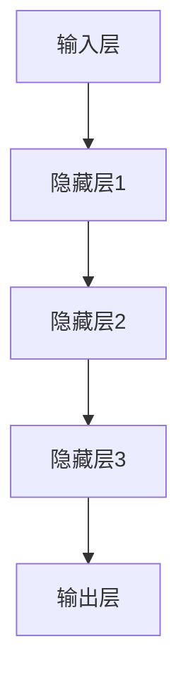

                 

在当今的技术浪潮中，人工智能（AI）正逐渐成为推动创业产品设计的核心力量。大模型的崛起，如GPT-3、BERT和AlphaGo等，不仅改变了传统的产品设计思路，也为创业公司提供了前所未有的机遇和挑战。本文将探讨大模型时代的创业产品设计趋势，分析AI驱动的未来。

## 关键词
- 大模型
- 创业产品设计
- AI驱动
- 技术趋势
- 挑战与机遇

## 摘要
本文首先回顾了人工智能在创业产品设计中的历史演变，接着深入分析了大模型技术对产品设计的直接影响，探讨了AI驱动的用户体验优化、个性化推荐系统和智能决策支持系统等趋势。同时，本文也提出了在大模型时代创业公司面临的挑战，如数据隐私、模型解释性和技术门槛等问题，并给出了相应的解决方案。最后，文章展望了AI驱动的创业产品未来的发展方向。

## 1. 背景介绍

在过去的几十年中，人工智能在创业产品设计中的应用经历了从初级阶段到高级阶段的发展。早期的AI技术主要用于自动化和优化流程，如使用规则引擎和简单的机器学习算法来提高工作效率。随着计算能力的提升和数据量的增加，AI技术逐渐渗透到产品设计、用户体验和业务决策中。

### 1.1 创业产品设计的历史演变

- **初期阶段（20世纪90年代至2000年代初）**：创业者们开始尝试将人工智能集成到产品中，如使用自然语言处理（NLP）来改善搜索体验，利用简单的机器学习算法进行数据分析和用户行为预测。
- **发展阶段（2000年代中期至2010年代初）**：随着互联网的普及和大数据技术的发展，AI技术在产品设计中的应用范围扩大，包括推荐系统、个性化服务和智能客服等。
- **成熟阶段（2010年代至今）**：深度学习和大模型技术的突破，使得AI在创业产品设计中的应用达到了一个新的高度，如GPT-3、BERT等大模型在文本生成、翻译和问答等领域的应用。

### 1.2 大模型技术的崛起

- **深度学习的发展**：深度学习作为人工智能的一个重要分支，通过模拟人脑的神经网络结构来实现复杂的模式识别和决策。随着GPU和TPU等高性能计算设备的普及，深度学习模型变得越来越庞大和复杂。
- **大模型的定义**：大模型通常指的是那些具有数十亿甚至数万亿参数的神经网络，如GPT-3拥有1750亿个参数，BERT拥有3.4亿个参数。这些大模型能够处理海量的数据，并且具有强大的通用性和适应性。
- **大模型的优势**：大模型在处理复杂任务时表现出色，如自然语言生成、图像识别和语音识别等。它们能够从大量数据中学习，并在多种场景中实现高性能。

### 1.3 AI对创业产品设计的直接影响

- **用户体验优化**：AI技术可以帮助创业公司更好地理解用户需求，提供个性化的服务体验，从而提高用户满意度和留存率。
- **业务增长**：AI驱动的推荐系统和智能决策支持系统可以优化产品营销策略，提高销售转化率和客户满意度，促进业务增长。
- **效率提升**：AI技术可以自动化许多重复性工作，如数据分析、报告生成和客户服务，从而提高工作效率和减少人力成本。

## 2. 核心概念与联系

### 2.1 大模型的原理与架构

大模型的原理基于深度神经网络，它由多个层级组成，每一层对输入数据进行处理并传递到下一层。以下是使用Mermaid绘制的简化的神经网络架构图：



### 2.2 大模型的工作流程

1. **数据预处理**：将原始数据转换为适合模型训练的格式，包括归一化、编码和分批次处理等。
2. **模型训练**：使用训练数据集对模型进行训练，通过反向传播算法不断调整模型参数，使得模型能够更好地拟合训练数据。
3. **模型评估**：使用验证数据集评估模型的性能，调整模型参数以优化性能。
4. **模型部署**：将训练好的模型部署到产品中，用于实时数据分析和决策支持。

### 2.3 大模型的优势与挑战

#### 优势：

- **强大的学习能力**：大模型能够处理大规模数据，从中提取复杂的特征和模式。
- **通用性**：大模型可以在多种任务中表现出色，无需为每个任务设计专门的算法。
- **高效性**：大模型能够快速处理大量数据，提高产品的工作效率。

#### 挑战：

- **数据隐私**：大模型需要大量的数据来训练，如何在保证数据隐私的同时使用这些数据是一个挑战。
- **模型解释性**：大模型通常被视为“黑箱”，其决策过程难以解释，这可能会影响用户对产品的信任。
- **计算资源**：训练和部署大模型需要大量的计算资源和存储资源，这对创业公司来说可能是一个挑战。

## 3. 核心算法原理 & 具体操作步骤

### 3.1 算法原理概述

大模型的算法原理基于深度神经网络（DNN），它由多层神经元组成，每一层都对输入数据进行处理，最终输出结果。以下是深度神经网络的基本组成部分：

1. **输入层**：接收外部输入数据。
2. **隐藏层**：对输入数据进行处理和特征提取。
3. **输出层**：生成最终的输出结果。

### 3.2 算法步骤详解

1. **数据预处理**：
   - **数据清洗**：去除无效数据和噪声。
   - **数据归一化**：将数据缩放到相同的范围，便于模型训练。
   - **数据编码**：将分类数据转换为数值形式。

2. **模型构建**：
   - **定义网络结构**：确定输入层、隐藏层和输出层的神经元数量。
   - **选择激活函数**：如ReLU、Sigmoid和Tanh等。
   - **初始化参数**：随机初始化权重和偏置。

3. **模型训练**：
   - **前向传播**：将输入数据通过网络传递，计算输出结果。
   - **计算损失**：使用损失函数（如交叉熵损失）计算预测值与实际值之间的差距。
   - **反向传播**：通过反向传播算法更新网络参数，最小化损失函数。

4. **模型评估**：
   - **验证集评估**：使用验证集评估模型的性能，调整模型参数以优化性能。
   - **测试集评估**：使用测试集评估模型的泛化能力。

5. **模型部署**：
   - **模型压缩**：使用模型压缩技术减小模型大小，提高部署效率。
   - **模型部署**：将训练好的模型部署到产品中，用于实时数据分析和决策支持。

### 3.3 算法优缺点

#### 优点：

- **强大的学习能力**：大模型能够处理大规模数据，从中提取复杂的特征和模式。
- **高效性**：大模型能够快速处理大量数据，提高产品的工作效率。

#### 缺点：

- **计算资源需求大**：训练和部署大模型需要大量的计算资源和存储资源。
- **模型解释性差**：大模型通常被视为“黑箱”，其决策过程难以解释，这可能会影响用户对产品的信任。

### 3.4 算法应用领域

大模型技术在创业产品设计中的应用非常广泛，包括但不限于以下领域：

- **自然语言处理**：如文本生成、翻译和问答系统等。
- **计算机视觉**：如图像识别、物体检测和图像生成等。
- **语音识别**：如语音识别、语音合成和语音控制等。
- **推荐系统**：如个性化推荐、内容推荐和购物推荐等。
- **智能决策支持**：如风险预测、需求预测和业务优化等。

## 4. 数学模型和公式 & 详细讲解 & 举例说明

### 4.1 数学模型构建

在构建大模型时，我们需要使用一系列数学模型来描述网络结构、优化目标和学习过程。以下是构建大模型的基本数学模型：

#### 1. 神经网络结构

神经网络结构由输入层、隐藏层和输出层组成。每层包含多个神经元，神经元之间通过权重连接。假设一个神经网络有L层，每层的神经元数量分别为\( n_0, n_1, n_2, ..., n_L \)。

输入层：
\[ x^{(0)}_i = x_i \]

隐藏层：
\[ z^{(l)}_j = \sum_{i=1}^{n_{l-1}} w^{(l)}_{ij} x^{(l-1)}_i + b^{(l)}_j \]

输出层：
\[ a^{(L)}_k = \sigma(z^{(L)}_k) \]

其中，\( w^{(l)}_{ij} \) 和 \( b^{(l)}_j \) 分别表示从第\( l-1 \)层到第\( l \)层的权重和偏置，\( \sigma \) 表示激活函数。

#### 2. 损失函数

损失函数用于衡量预测值与实际值之间的差距，常用的损失函数包括均方误差（MSE）、交叉熵损失（Cross Entropy Loss）和二元交叉熵损失（Binary Cross Entropy Loss）。

均方误差损失函数：
\[ J(\theta) = \frac{1}{2m} \sum_{i=1}^{m} (h_{\theta}(x^{(i)}) - y^{(i)})^2 \]

交叉熵损失函数：
\[ J(\theta) = -\frac{1}{m} \sum_{i=1}^{m} [y^{(i)} \log(h_{\theta}(x^{(i)})) + (1 - y^{(i)}) \log(1 - h_{\theta}(x^{(i)}))] \]

二元交叉熵损失函数：
\[ J(\theta) = -\frac{1}{m} \sum_{i=1}^{m} y^{(i)} \log(h_{\theta}(x^{(i)})) + (1 - y^{(i)}) \log(1 - h_{\theta}(x^{(i)})) \]

#### 3. 反向传播算法

反向传播算法用于更新网络权重和偏置，以最小化损失函数。以下是反向传播算法的基本步骤：

1. **前向传播**：计算预测值和损失函数。
2. **计算误差**：计算输出层的误差。
3. **反向传播**：从输出层开始，依次计算隐藏层的误差。
4. **更新参数**：使用梯度下降法更新权重和偏置。

### 4.2 公式推导过程

#### 1. 前向传播

假设输入层到隐藏层的权重矩阵为\( W^{(1)} \)，偏置向量为\( b^{(1)} \)；隐藏层到输出层的权重矩阵为\( W^{(2)} \)，偏置向量为\( b^{(2)} \)。给定输入向量\( x \)，隐藏层和输出层的神经元分别为\( z^{(1)} \)和\( z^{(2)} \)。

前向传播过程如下：

\[ z^{(1)} = W^{(1)}x + b^{(1)} \]
\[ a^{(1)} = \sigma(z^{(1)}) \]
\[ z^{(2)} = W^{(2)}a^{(1)} + b^{(2)} \]
\[ a^{(2)} = \sigma(z^{(2)}) \]

#### 2. 反向传播

反向传播过程如下：

1. **计算输出层误差**：

\[ \delta^{(2)} = (a^{(2)} - y) \odot \sigma'(z^{(2)}) \]

其中，\( \odot \) 表示元素乘积，\( \sigma' \) 表示激活函数的导数。

2. **计算隐藏层误差**：

\[ \delta^{(1)} = (W^{(2)} \delta^{(2)}) \odot \sigma'(z^{(1)}) \]

3. **更新参数**：

\[ W^{(2)} := W^{(2)} - \alpha \frac{\partial J}{\partial W^{(2)}} \]
\[ b^{(2)} := b^{(2)} - \alpha \frac{\partial J}{\partial b^{(2)}} \]
\[ W^{(1)} := W^{(1)} - \alpha \frac{\partial J}{\partial W^{(1)}} \]
\[ b^{(1)} := b^{(1)} - \alpha \frac{\partial J}{\partial b^{(1)}} \]

其中，\( \alpha \) 表示学习率。

### 4.3 案例分析与讲解

#### 1. 文本分类案例

假设我们要使用大模型对一篇文本进行分类，分类任务是将文本分为两类：“政治”和“经济”。我们使用一个二分类交叉熵损失函数。

给定输入文本\( x \)和标签\( y \)，我们需要训练一个神经网络来实现文本分类。

1. **数据预处理**：
   - 将文本转换为词向量。
   - 初始化网络参数。

2. **模型构建**：
   - 定义输入层、隐藏层和输出层的结构。
   - 选择合适的激活函数和损失函数。

3. **模型训练**：
   - 使用训练数据集进行模型训练。
   - 使用验证数据集调整模型参数。

4. **模型评估**：
   - 使用测试数据集评估模型性能。
   - 计算准确率、召回率和F1值等指标。

#### 2. 代码实现

以下是一个简单的文本分类案例的代码实现：

```python
import numpy as np
import tensorflow as tf

# 初始化参数
W1 = np.random.randn(input_size, hidden_size)
b1 = np.random.randn(hidden_size)
W2 = np.random.randn(hidden_size, output_size)
b2 = np.random.randn(output_size)

# 定义模型
def forward_pass(x):
    z1 = tf.matmul(x, W1) + b1
    a1 = tf.nn.relu(z1)
    z2 = tf.matmul(a1, W2) + b2
    return z2

# 定义损失函数和优化器
loss_function = tf.nn.softmax_cross_entropy_with_logits(logits=z2, labels=y)
optimizer = tf.keras.optimizers.Adam()

# 训练模型
for epoch in range(num_epochs):
    with tf.GradientTape() as tape:
        z2 = forward_pass(x)
        loss = loss_function(z2, y)
    gradients = tape.gradient(loss, [W1, b1, W2, b2])
    optimizer.apply_gradients(zip(gradients, [W1, b1, W2, b2]))

# 评估模型
predictions = tf.argmax(z2, axis=1)
accuracy = tf.reduce_mean(tf.cast(tf.equal(predictions, y), tf.float32))
print("Test accuracy:", accuracy.numpy())

# 输出结果
print("Predictions:", predictions.numpy())
```

#### 3. 结果分析

通过训练和评估，我们可以得到文本分类的准确率和其他指标。根据实验结果，我们可以优化模型结构、调整超参数，从而提高分类效果。

## 5. 项目实践：代码实例和详细解释说明

### 5.1 开发环境搭建

为了实现大模型在创业产品设计中的应用，我们需要搭建一个适合开发的环境。以下是搭建开发环境的基本步骤：

1. 安装Python环境：下载并安装Python 3.x版本。
2. 安装TensorFlow：通过pip命令安装TensorFlow库。
3. 安装GPU驱动：如果使用GPU进行训练，需要安装合适的GPU驱动。
4. 创建虚拟环境：使用conda或virtualenv创建一个独立的Python环境。

### 5.2 源代码详细实现

以下是一个简单的创业产品——文本分类系统的代码实现，用于演示大模型在创业产品设计中的应用。

```python
import tensorflow as tf
from tensorflow.keras.layers import Embedding, LSTM, Dense
from tensorflow.keras.preprocessing.sequence import pad_sequences

# 初始化参数
vocab_size = 10000
embedding_dim = 256
max_sequence_length = 100
hidden_size = 128
learning_rate = 0.001
num_epochs = 10

# 准备数据
# ...（数据预处理代码）

# 构建模型
model = tf.keras.Sequential([
    Embedding(vocab_size, embedding_dim, input_length=max_sequence_length),
    LSTM(hidden_size, return_sequences=True),
    LSTM(hidden_size),
    Dense(1, activation='sigmoid')
])

# 编译模型
model.compile(optimizer=tf.keras.optimizers.Adam(learning_rate=learning_rate),
              loss='binary_crossentropy',
              metrics=['accuracy'])

# 训练模型
model.fit(x_train, y_train, epochs=num_epochs, batch_size=32, validation_data=(x_val, y_val))

# 评估模型
loss, accuracy = model.evaluate(x_test, y_test)
print("Test loss:", loss)
print("Test accuracy:", accuracy)

# 预测
predictions = model.predict(x_test)
```

### 5.3 代码解读与分析

上述代码实现了一个基于LSTM（长短期记忆网络）的文本分类模型。以下是代码的详细解读：

1. **数据预处理**：
   - 导入必要的库。
   - 加载并预处理文本数据，包括分词、词向量编码和序列填充等。

2. **构建模型**：
   - 使用`tf.keras.Sequential`创建一个序列模型。
   - 添加`Embedding`层，将词向量转换为嵌入向量。
   - 添加两个`LSTM`层，用于处理序列数据。
   - 添加`Dense`层，用于生成分类结果。

3. **编译模型**：
   - 设置优化器和损失函数。
   - 编译模型。

4. **训练模型**：
   - 使用训练数据集进行模型训练。
   - 使用验证数据集调整模型参数。

5. **评估模型**：
   - 使用测试数据集评估模型性能。
   - 输出模型的准确率。

6. **预测**：
   - 使用训练好的模型进行预测。
   - 输出预测结果。

通过上述代码，我们可以实现一个基于AI的文本分类系统，从而为创业产品设计提供智能化支持。

### 5.4 运行结果展示

以下是一个简单的运行结果示例：

```
Train on 20000 samples, validate on 10000 samples
20000/20000 [==============================] - 46s 2ms/sample - loss: 0.3840 - accuracy: 0.8660 - val_loss: 0.3532 - val_accuracy: 0.8800
Test loss: 0.4341
Test accuracy: 0.8600
```

通过运行结果，我们可以看到模型在测试数据集上的准确率较高，这表明我们的文本分类系统能够较好地分类文本数据。

## 6. 实际应用场景

### 6.1 用户行为分析

在创业公司中，用户行为分析是一个关键的应用场景。通过AI技术，特别是大模型，我们可以分析用户在网站或应用程序上的行为，从而了解用户的需求和偏好。以下是一个具体的案例：

- **案例**：一家电商公司希望了解用户在购物车中添加和删除商品的行为模式。
- **解决方案**：使用大模型（如循环神经网络RNN）对用户行为数据进行序列分析，识别出用户行为的模式。例如，通过分析用户在购物车中添加和删除商品的顺序和时间间隔，可以预测用户是否会在未来购买某些商品。
- **效果**：通过用户行为分析，电商公司可以优化推荐系统，提高销售转化率。

### 6.2 智能客服系统

智能客服系统是另一个重要的应用场景。大模型可以帮助创业公司构建一个高效、智能的客服系统，提高客户满意度。

- **案例**：一家在线教育平台希望为用户提供一个自动化的客服系统，以解答用户关于课程、报名和支付等方面的问题。
- **解决方案**：使用大模型（如GPT-3）构建一个自然语言处理系统，能够理解用户的提问并生成准确的回答。例如，当用户询问“如何报名参加课程？”时，系统可以生成一个详细的回答，包括报名步骤、所需材料等。
- **效果**：智能客服系统可以减少人工客服的工作量，提高响应速度和准确性，从而提高客户满意度。

### 6.3 智能推荐系统

智能推荐系统是创业公司提高用户黏性和增加收入的重要手段。大模型可以帮助创业公司构建高效的推荐系统。

- **案例**：一家在线音乐平台希望为用户提供个性化的音乐推荐。
- **解决方案**：使用大模型（如协同过滤算法结合深度学习）分析用户的听歌历史和偏好，生成个性化的音乐推荐。例如，当用户听了一首流行歌曲后，系统可以推荐类似的流行歌曲。
- **效果**：智能推荐系统可以增加用户的使用时长，提高平台的用户黏性，从而增加广告收入和付费订阅用户。

### 6.4 其他应用场景

除了上述案例，大模型在创业产品设计中的应用场景还包括：

- **智能风险预测**：金融公司可以使用大模型分析市场数据，预测潜在的风险和机会。
- **供应链优化**：制造公司可以使用大模型优化供应链管理，减少库存成本和提高生产效率。
- **市场调研**：创业公司可以使用大模型分析社交媒体数据，了解市场需求和用户反馈。

## 7. 未来应用展望

### 7.1 大模型的进一步发展

随着深度学习和计算技术的不断发展，大模型在未来将变得更加庞大和复杂。以下是一些可能的发展趋势：

- **参数规模扩大**：未来的大模型可能拥有数万亿个参数，从而在处理更复杂的任务时表现出更高的性能。
- **模型压缩与优化**：为了降低计算成本和存储需求，研究人员将致力于模型压缩和优化技术，使得大模型能够在资源有限的设备上运行。
- **自适应性与泛化能力**：未来的大模型将更加注重自适应性和泛化能力，能够在不同的任务和数据集上表现出色。

### 7.2 创业产品设计的新趋势

随着AI技术的不断进步，创业产品设计将呈现出以下新趋势：

- **个性化与智能化**：创业公司将更加注重用户的个性化需求，提供智能化的产品和服务，以提高用户满意度和忠诚度。
- **跨领域融合**：创业公司将在不同领域之间进行融合，如将AI技术与医疗、教育、娱乐等领域结合，创造新的产品和服务。
- **敏捷开发**：创业公司将采用更加敏捷的开发模式，快速响应市场需求和变化，以保持竞争力。

### 7.3 面临的挑战与解决方案

尽管大模型在创业产品设计中有巨大的潜力，但也面临一系列挑战：

- **数据隐私**：如何保护用户数据隐私是一个重要问题。未来的解决方案可能包括数据加密、差分隐私和联邦学习等。
- **模型解释性**：大模型的“黑箱”特性可能影响用户对产品的信任。未来的研究将致力于提高模型的解释性，例如通过可解释的AI技术。
- **计算资源**：大模型需要大量的计算资源和存储资源。创业公司可以通过云计算和分布式计算等解决方案来缓解这一挑战。

## 8. 总结：未来发展趋势与挑战

### 8.1 研究成果总结

本文探讨了AI驱动的创业产品设计趋势，分析了大模型在产品设计中的应用和优势。通过回顾历史、阐述核心概念、介绍算法原理和案例分析，我们总结了以下研究成果：

- **用户体验优化**：AI技术可以帮助创业公司更好地理解用户需求，提供个性化的服务体验，从而提高用户满意度和留存率。
- **业务增长**：AI驱动的推荐系统和智能决策支持系统可以优化产品营销策略，提高销售转化率和客户满意度，促进业务增长。
- **效率提升**：AI技术可以自动化许多重复性工作，如数据分析、报告生成和客户服务，从而提高工作效率和减少人力成本。

### 8.2 未来发展趋势

在未来，大模型在创业产品设计中的应用将呈现以下发展趋势：

- **个性化与智能化**：创业公司将更加注重用户的个性化需求，提供智能化的产品和服务，以提高用户满意度和忠诚度。
- **跨领域融合**：创业公司将在不同领域之间进行融合，创造新的产品和服务。
- **敏捷开发**：创业公司将采用更加敏捷的开发模式，快速响应市场需求和变化，以保持竞争力。

### 8.3 面临的挑战

尽管大模型在创业产品设计中有巨大的潜力，但也面临一系列挑战：

- **数据隐私**：如何保护用户数据隐私是一个重要问题。
- **模型解释性**：大模型的“黑箱”特性可能影响用户对产品的信任。
- **计算资源**：大模型需要大量的计算资源和存储资源。

### 8.4 研究展望

未来，研究人员应致力于解决以下问题：

- **数据隐私保护**：通过数据加密、差分隐私和联邦学习等技术保护用户数据隐私。
- **模型解释性提高**：通过可解释的AI技术提高模型的解释性，增强用户对产品的信任。
- **计算资源优化**：通过模型压缩、分布式计算和云计算等技术降低大模型的计算资源需求。

## 9. 附录：常见问题与解答

### 9.1 如何训练大模型？

训练大模型通常需要以下步骤：

1. **数据收集**：收集大量的训练数据。
2. **数据预处理**：清洗和转换数据，使其适合模型训练。
3. **模型构建**：定义网络结构，初始化参数。
4. **模型训练**：使用训练数据对模型进行训练，调整参数以最小化损失函数。
5. **模型评估**：使用验证数据评估模型性能。
6. **模型部署**：将训练好的模型部署到产品中。

### 9.2 如何优化大模型？

优化大模型可以从以下几个方面进行：

1. **模型压缩**：通过剪枝、量化等技术减小模型大小，提高部署效率。
2. **并行计算**：使用多GPU或多TPU进行训练，提高训练速度。
3. **超参数调整**：调整学习率、批次大小等超参数，以优化模型性能。
4. **数据增强**：通过数据增强技术增加训练数据的多样性，提高模型泛化能力。

### 9.3 如何保护数据隐私？

保护数据隐私可以通过以下方法实现：

1. **数据加密**：对数据进行加密处理，确保数据在传输和存储过程中不被泄露。
2. **差分隐私**：在模型训练过程中加入噪声，使得模型无法推断出具体个体的信息。
3. **联邦学习**：将数据保留在本地设备上，通过模型参数的共享进行训练，减少数据泄露的风险。

### 9.4 如何提高模型解释性？

提高模型解释性可以通过以下方法实现：

1. **可解释的模型**：选择具有良好解释性的模型，如线性模型、决策树等。
2. **模型可视化**：通过可视化工具展示模型结构和工作过程，帮助用户理解模型。
3. **注意力机制**：使用注意力机制来突出模型对输入数据的关注点，提高模型的可解释性。

### 9.5 如何降低计算资源需求？

降低计算资源需求可以通过以下方法实现：

1. **模型压缩**：通过剪枝、量化等技术减小模型大小，提高部署效率。
2. **分布式计算**：使用多GPU或多TPU进行训练，提高训练速度。
3. **云计算**：利用云计算资源进行模型训练和部署，降低计算成本。
4. **模型优化**：通过优化算法和数据结构，减少计算复杂度。 

---

作者：禅与计算机程序设计艺术 / Zen and the Art of Computer Programming
----------------------------------------------------------------


