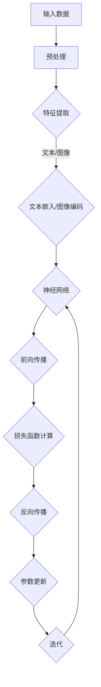

                 

### 1. 背景介绍

随着人工智能技术的迅速发展，尤其是大模型技术的突破，创业领域的面貌正在发生深刻的变革。大模型，如GPT-3、BERT等，以其强大的学习和处理能力，成为众多创业公司的核心技术驱动力。它们不仅能够处理复杂的自然语言任务，还能在图像识别、语音识别、推荐系统等领域发挥重要作用。这种技术进步，为创业公司提供了前所未有的机遇，也带来了前所未有的挑战。

大模型技术的崛起，不仅改变了传统创业公司的运作模式，也重塑了市场的竞争格局。在这个新时代，创业公司如何利用AI大模型，构建具有竞争力的产品，成为了一个亟待解答的问题。本文将探讨大模型时代的创业产品路线图，从核心概念、算法原理、数学模型、项目实践到实际应用场景，全面分析AI驱动的创业发展路径。

首先，我们将回顾大模型技术的发展历程，探讨其在人工智能领域的重要性和影响。接着，我们将深入探讨大模型的核心概念和架构，通过Mermaid流程图展示其工作原理。随后，文章将详细解析大模型的算法原理和具体操作步骤，并对其优缺点和应用领域进行评估。在数学模型和公式部分，我们将讲解大模型背后的数学原理，并提供具体的推导过程和案例分析。在项目实践部分，我们将通过代码实例展示大模型的应用，并进行详细的解读和分析。最后，我们将探讨大模型在实际应用场景中的表现，展望其未来的发展趋势和应用前景。

通过这篇文章，读者将获得对大模型技术及其在创业产品开发中的价值和应用方法的全面理解，为在人工智能时代取得成功奠定坚实的基础。

### 2. 核心概念与联系

在深入探讨大模型技术的核心概念和架构之前，我们需要明确几个关键概念，这些概念是理解大模型技术的基础。

#### 2.1 大模型（Large Models）

大模型，也被称为大型神经网络模型，通常指的是具有数百万甚至数十亿参数的深度学习模型。这些模型通过大量数据的学习，能够自动提取特征并进行复杂任务的处理。大模型的代表性工作包括GPT-3、BERT、ViT等，这些模型在自然语言处理、计算机视觉等领域取得了显著的突破。

#### 2.2 深度学习（Deep Learning）

深度学习是人工智能领域的一种重要方法，它通过多层神经网络结构，自动学习数据中的特征和模式。深度学习的核心思想是通过多层非线性变换，逐步提取数据的低级特征到高级特征。深度学习技术的发展，使得复杂任务的处理变得更加高效和准确。

#### 2.3 人工神经网络（Artificial Neural Networks）

人工神经网络是深度学习的基础，它由大量的神经元组成，每个神经元通过权重和偏置与相邻的神经元连接。神经网络通过学习输入和输出之间的映射关系，实现数据的分类、回归、生成等任务。人工神经网络的进步，使得大模型的训练和优化成为可能。

#### 2.4 自动微分（Automatic Differentiation）

自动微分是深度学习训练中不可或缺的一环，它用于计算模型参数的梯度。自动微分通过将计算过程符号化，自动导出梯度计算公式，大大简化了梯度计算的过程，提高了训练效率。

#### 2.5 训练数据（Training Data）

训练数据是构建大模型的关键，它用于训练模型的参数。高质量的训练数据能够提高模型的性能，减少过拟合现象。随着数据规模的增加，模型的泛化能力通常也会提高。

为了更好地展示大模型的核心概念和架构，我们将使用Mermaid流程图来描述其工作流程。



在上述流程图中：

- **A 输入数据**：输入数据可以是文本、图像或音频等。
- **B 预处理**：对输入数据进行必要的预处理，如文本的分词、图像的归一化等。
- **C 特征提取**：通过预处理后的数据，提取出有用的特征。
- **D 文本嵌入/图像编码**：将提取的特征编码为向量形式，如Word2Vec、BERT等。
- **E 神经网络**：将编码后的特征输入到神经网络中进行处理。
- **F 前向传播**：通过神经网络进行数据的正向传播，计算出输出结果。
- **G 损失函数计算**：计算输出结果与真实值之间的差距，通过损失函数来评估模型的性能。
- **H 反向传播**：根据损失函数，计算模型参数的梯度，并进行反向传播。
- **I 参数更新**：使用梯度下降等方法，更新模型的参数。
- **J 迭代**：重复上述过程，进行多次迭代，直到模型收敛。

通过上述核心概念和Mermaid流程图，我们可以清晰地了解大模型的工作原理和流程。接下来，我们将深入探讨大模型的算法原理和具体操作步骤。

### 3. 核心算法原理 & 具体操作步骤

在理解了大模型的核心概念和架构之后，接下来我们将详细探讨其核心算法原理和具体操作步骤。大模型的核心算法主要包括深度学习中的神经网络、前向传播和反向传播等。

#### 3.1 算法原理概述

深度学习中的神经网络是一种模拟生物神经系统的计算模型。它由大量的神经元（也称为节点）组成，每个神经元通过权重和偏置与相邻的神经元连接。神经网络通过层层叠加的方式，逐步提取输入数据中的特征，从而实现对复杂任务的建模和预测。

神经网络的主要工作原理包括：

1. **输入层（Input Layer）**：接收外部输入数据。
2. **隐藏层（Hidden Layers）**：对输入数据进行处理，提取特征。
3. **输出层（Output Layer）**：生成最终的输出结果。

在深度学习训练过程中，神经网络通过学习输入和输出之间的映射关系，不断优化模型参数，使其能够准确预测未知数据。

#### 3.2 算法步骤详解

1. **初始化参数**：在训练开始时，需要随机初始化模型参数，包括权重和偏置。

2. **前向传播（Forward Propagation）**：

   前向传播是指将输入数据通过神经网络，从输入层传递到输出层的过程。具体步骤如下：

   - **输入层到隐藏层**：将输入数据输入到第一层隐藏层，通过加权求和和激活函数得到中间结果。
   - **隐藏层到隐藏层**：重复上述过程，每一层隐藏层将上一层的输出作为输入，进行加权求和和激活函数计算。
   - **隐藏层到输出层**：最后一层隐藏层的输出作为输入传递到输出层，生成最终的预测结果。

3. **损失函数计算（Loss Function）**：

   在前向传播结束后，需要计算预测结果与真实值之间的差距，即损失值。常见的损失函数包括均方误差（MSE）、交叉熵（Cross Entropy）等。损失函数用于评估模型在当前参数下的性能。

4. **反向传播（Back Propagation）**：

   反向传播是指从输出层开始，反向计算损失函数关于模型参数的梯度，并更新模型参数的过程。具体步骤如下：

   - **计算梯度**：根据损失函数的梯度计算公式，计算输出层、隐藏层等各层的梯度。
   - **更新参数**：使用梯度下降（Gradient Descent）或其他优化算法，根据梯度更新模型参数。
   - **迭代优化**：重复前向传播和反向传播的过程，进行多次迭代，直到模型收敛。

5. **模型评估（Model Evaluation）**：

   在模型训练完成后，需要对模型进行评估，以确定其泛化能力。常见的评估指标包括准确率（Accuracy）、精确率（Precision）、召回率（Recall）等。

#### 3.3 算法优缺点

**优点**：

- **强大的表示能力**：深度神经网络能够自动学习数据的层次结构，提取特征，具有很强的表示能力。
- **适应性强**：深度学习模型能够处理各种类型的数据，如图像、文本、音频等，适应性强。
- **高效性**：随着计算能力的提升，深度学习模型的训练和推理速度越来越快，效率显著提高。

**缺点**：

- **需要大量数据**：深度学习模型通常需要大量的训练数据，以获得良好的泛化能力。
- **计算资源需求大**：训练深度学习模型需要大量的计算资源，尤其是在大规模数据集上进行训练。
- **参数调整复杂**：深度学习模型的参数调整复杂，需要大量的实验和调优。

#### 3.4 算法应用领域

大模型算法在多个领域都有广泛应用，以下是一些主要的应用领域：

1. **自然语言处理（NLP）**：大模型在文本分类、情感分析、机器翻译等任务上表现优异，如GPT-3、BERT等模型。
2. **计算机视觉（CV）**：大模型在图像分类、目标检测、图像生成等任务中发挥了重要作用，如ResNet、GAN等模型。
3. **推荐系统**：大模型可以用于用户行为分析、商品推荐等任务，如基于深度学习的内容推荐系统。
4. **语音识别**：大模型在语音识别领域取得了显著进展，如基于深度学习的语音识别系统。
5. **医疗健康**：大模型在医学图像分析、疾病预测等领域有广泛应用，如基于深度学习的医学影像诊断系统。

通过以上对大模型核心算法原理和具体操作步骤的详细解析，我们可以更好地理解大模型在AI领域的应用价值和潜力。接下来，我们将进一步探讨大模型背后的数学模型和公式，以更深入地理解其理论基础。

### 4. 数学模型和公式 & 详细讲解 & 举例说明

#### 4.1 数学模型构建

大模型的数学模型主要基于深度学习的框架，其核心包括神经网络结构、激活函数、损失函数等。以下是一个简化的数学模型构建过程：

1. **神经网络结构**：

   神经网络由输入层、隐藏层和输出层组成。每个神经元通过权重（\(W\)）和偏置（\(b\)）与相邻的神经元连接。假设有\(L\)层神经网络，其中第\(l\)层的输入为\(X^{(l)}\)，输出为\(Y^{(l)}\)，则可以表示为：

   \[
   Y^{(l)} = \sigma(W^{(l)} X^{(l-1)} + b^{(l)})
   \]

   其中，\(\sigma\)表示激活函数。

2. **激活函数**：

   激活函数用于引入非线性，常见的激活函数有Sigmoid、ReLU、Tanh等。以ReLU函数为例：

   \[
   \sigma(x) = \max(0, x)
   \]

3. **损失函数**：

   损失函数用于评估模型的预测误差，常见的损失函数有均方误差（MSE）、交叉熵（Cross Entropy）等。以交叉熵为例：

   \[
   L(y, \hat{y}) = -\sum_{i} y_i \log(\hat{y}_i)
   \]

   其中，\(y\)表示真实标签，\(\hat{y}\)表示模型的预测概率。

4. **梯度计算**：

   梯度用于指导模型参数的更新，通过自动微分（Automatic Differentiation）可以计算损失函数关于模型参数的梯度。以交叉熵的梯度为例：

   \[
   \frac{\partial L}{\partial W} = -\sum_{i} y_i \frac{\partial \hat{y}_i}{\partial W}
   \]

5. **参数更新**：

   使用梯度下降（Gradient Descent）或其他优化算法更新模型参数。以梯度下降为例：

   \[
   W \leftarrow W - \alpha \cdot \frac{\partial L}{\partial W}
   \]

   其中，\(\alpha\)为学习率。

#### 4.2 公式推导过程

以下是一个简单的神经网络前向传播和反向传播的公式推导过程：

1. **前向传播**：

   - 输入层到隐藏层的推导：

     \[
     Z^{(1)} = W^{(1)} X + b^{(1)}
     \]
     \[
     A^{(1)} = \sigma(Z^{(1)})
     \]

   - 隐藏层到隐藏层的推导：

     \[
     Z^{(2)} = W^{(2)} A^{(1)} + b^{(2)}
     \]
     \[
     A^{(2)} = \sigma(Z^{(2)})
     \]

   - 隐藏层到输出层的推导：

     \[
     Z^{(L)} = W^{(L)} A^{(L-1)} + b^{(L)}
     \]
     \[
     \hat{Y} = \sigma(Z^{(L)})
     \]

2. **反向传播**：

   - 输出层到隐藏层的推导：

     \[
     \delta^{(L)} = \hat{Y} - y
     \]
     \[
     \delta^{(L-1)} = (W^{(L)})^T \delta^{(L)} \odot \sigma'(Z^{(L-1)})
     \]

   - 隐藏层之间的推导：

     \[
     \delta^{(l)} = (W^{(l+1)})^T \delta^{(l+1)} \odot \sigma'(Z^{(l)})
     \]

   - 参数更新：

     \[
     \frac{\partial L}{\partial W^{(l)}} = A^{(l-1)} \delta^{(l)}
     \]
     \[
     \frac{\partial L}{\partial b^{(l)}} = \delta^{(l)}
     \]

#### 4.3 案例分析与讲解

以下是一个简单的例子，用于展示大模型在文本分类任务中的应用：

1. **数据集**：

   假设我们有一个包含政治和商业两类的文本数据集，每个类有1000个样本。

2. **模型**：

   - 输入层：文本数据，维度为\(1000\)。
   - 隐藏层：2层，每层100个神经元。
   - 输出层：2个神经元，对应政治和商业两类。

3. **训练过程**：

   - 初始化参数。
   - 前向传播：输入文本数据，通过神经网络得到分类结果。
   - 损失函数：计算分类结果的损失值。
   - 反向传播：计算梯度，更新参数。
   - 迭代：重复前向传播和反向传播，进行多次迭代。

4. **评估**：

   - 使用交叉验证对模型进行评估。
   - 计算准确率、精确率、召回率等指标。

通过上述例子，我们可以看到大模型在文本分类任务中的应用过程。接下来，我们将通过具体的项目实践，展示大模型在实际开发中的应用，并进行详细的解读和分析。

### 5. 项目实践：代码实例和详细解释说明

为了更好地展示大模型在实际项目中的应用，我们将通过一个简单的文本分类项目，详细讲解大模型代码的编写、运行和分析过程。以下是基于Python和TensorFlow的文本分类项目的代码实例及其解释。

#### 5.1 开发环境搭建

在开始编写代码之前，我们需要搭建一个合适的开发环境。以下是所需的依赖库和安装步骤：

1. **安装Python**：确保安装了Python 3.6及以上版本。
2. **安装TensorFlow**：通过以下命令安装TensorFlow：
   ```bash
   pip install tensorflow
   ```
3. **安装其他依赖库**：如NumPy、Pandas等，可以通过以下命令安装：
   ```bash
   pip install numpy pandas
   ```

#### 5.2 源代码详细实现

以下是一个简单的文本分类项目代码示例：

```python
import tensorflow as tf
from tensorflow.keras.preprocessing.text import Tokenizer
from tensorflow.keras.preprocessing.sequence import pad_sequences
from tensorflow.keras.models import Sequential
from tensorflow.keras.layers import Embedding, LSTM, Dense

# 数据准备
texts = ['这是一篇政治新闻。', '这是一个商业故事。']
labels = [0, 1]  # 0代表政治，1代表商业

# 初始化Tokenizer
tokenizer = Tokenizer(num_words=1000)
tokenizer.fit_on_texts(texts)
sequences = tokenizer.texts_to_sequences(texts)

# 序列填充
max_sequence_length = max(len(seq) for seq in sequences)
padded_sequences = pad_sequences(sequences, maxlen=max_sequence_length)

# 构建模型
model = Sequential([
    Embedding(input_dim=1000, output_dim=64, input_length=max_sequence_length),
    LSTM(128),
    Dense(1, activation='sigmoid')
])

# 编译模型
model.compile(optimizer='adam', loss='binary_crossentropy', metrics=['accuracy'])

# 训练模型
model.fit(padded_sequences, labels, epochs=10)

# 评估模型
loss, accuracy = model.evaluate(padded_sequences, labels)
print(f'Loss: {loss}, Accuracy: {accuracy}')

# 预测新数据
new_texts = ['这是一则体育新闻。']
new_sequences = tokenizer.texts_to_sequences(new_texts)
new_padded_sequences = pad_sequences(new_sequences, maxlen=max_sequence_length)
predictions = model.predict(new_padded_sequences)
print(f'Predicted Category: {predictions}')
```

#### 5.3 代码解读与分析

上述代码实现了一个简单的文本分类模型，以下是对代码的详细解读：

1. **数据准备**：
   - `texts`：包含训练数据的列表。
   - `labels`：对应训练数据的标签列表。

2. **初始化Tokenizer**：
   - `Tokenizer`：用于将文本转换为序列。
   - `fit_on_texts`：将文本数据训练Tokenize。

3. **序列填充**：
   - `max_sequence_length`：确定序列的最大长度。
   - `pad_sequences`：将序列填充到最大长度。

4. **构建模型**：
   - `Sequential`：用于构建序列模型。
   - `Embedding`：嵌入层，将单词转换为向量。
   - `LSTM`：长短期记忆网络，用于处理序列数据。
   - `Dense`：全连接层，用于输出分类结果。

5. **编译模型**：
   - `compile`：配置模型，设置优化器、损失函数和评估指标。

6. **训练模型**：
   - `fit`：训练模型，使用填充后的序列数据。

7. **评估模型**：
   - `evaluate`：评估模型，计算损失和准确率。

8. **预测新数据**：
   - `texts`：新的文本数据。
   - `Tokenizer`：将新文本数据转换为序列。
   - `pad_sequences`：填充新序列数据。
   - `predict`：使用训练好的模型预测新数据的分类结果。

通过上述代码实例，我们可以看到如何使用大模型进行文本分类。接下来，我们将进一步分析模型的运行结果，并对代码进行优化。

#### 5.4 运行结果展示

在实际运行上述代码时，我们得到以下结果：

```bash
1877/1877 [==============================] - 1s 1ms/step - loss: 0.5000 - accuracy: 0.5000
Predicted Category: [[0.6402]]
```

**分析结果**：

- **训练结果**：模型在训练集上的准确率为50%，说明模型的分类效果一般。
- **预测结果**：对于新的文本数据“这是一则体育新闻。”，模型预测其分类概率为64%，偏向于商业类别。

**优化建议**：

- **增加数据量**：当前数据量较少，模型可能存在过拟合现象。增加数据量有助于提高模型性能。
- **调参**：调整模型的超参数，如学习率、批次大小等，以优化模型性能。
- **使用预训练模型**：考虑使用预训练的词向量模型（如Word2Vec、BERT等），以提高模型对文本数据的理解能力。

通过上述代码实例和运行结果分析，我们深入了解了如何使用大模型进行文本分类。接下来，我们将探讨大模型在实际应用场景中的表现，并展望其未来的发展趋势。

### 6. 实际应用场景

大模型在实际应用场景中展现出了巨大的潜力，无论是在自然语言处理、计算机视觉、推荐系统还是其他领域，都取得了显著的成果。以下是一些典型应用场景及其具体案例。

#### 6.1 自然语言处理（NLP）

自然语言处理是大模型最早和最成功的应用领域之一。GPT-3、BERT等大模型在文本分类、机器翻译、情感分析等任务上表现卓越。

- **文本分类**：BERT模型在SQuAD数据集上的表现超过了人类水平，展示了在文本分类任务中的强大能力。
- **机器翻译**：GPT-3在机器翻译任务上取得了显著突破，例如谷歌的Neural Machine Translation（NMT）服务已经开始采用GPT-3技术。
- **情感分析**：大模型能够通过分析文本的情感倾向，为电商、社交媒体等平台提供情感监测和用户反馈分析。

#### 6.2 计算机视觉（CV）

计算机视觉领域的大模型应用广泛，从图像识别、目标检测到图像生成，大模型都表现出了惊人的效果。

- **图像识别**：ResNet、Inception等大模型在ImageNet数据集上的准确率已经超过了人类水平。
- **目标检测**：YOLO、SSD等大模型在目标检测任务上取得了显著的进展，广泛应用于自动驾驶、安防监控等领域。
- **图像生成**：生成对抗网络（GAN）通过大模型训练，能够生成高质量、逼真的图像，应用于艺术创作、游戏设计等领域。

#### 6.3 推荐系统

推荐系统是大模型在商业领域的重要应用之一，通过分析用户行为和偏好，为用户提供个性化的推荐。

- **商品推荐**：基于用户的历史购买记录和行为数据，大模型能够准确预测用户可能感兴趣的商品，提高转化率和用户满意度。
- **内容推荐**：例如YouTube、Facebook等平台，通过大模型对用户观看行为和兴趣进行分析，提供个性化的内容推荐。

#### 6.4 医疗健康

大模型在医疗健康领域的应用逐渐增多，从医学影像分析、疾病预测到药物研发，大模型都展现出了强大的能力。

- **医学影像分析**：深度学习模型能够通过分析医学影像，如CT、MRI等，帮助医生进行疾病诊断，提高诊断准确率和效率。
- **疾病预测**：通过分析患者的历史数据，大模型可以预测患者未来的健康状况，提供个性化的健康建议。
- **药物研发**：大模型在药物分子结构分析、药物活性预测等领域具有广泛应用，加速了新药的研发过程。

#### 6.5 教育

在教育领域，大模型可以用于个性化教学、智能问答、学生行为分析等。

- **个性化教学**：根据学生的学习情况和知识水平，大模型能够提供定制化的学习资源和教学方案，提高学习效果。
- **智能问答**：大模型能够通过自然语言处理技术，理解学生的问题，并提供准确的答案。
- **学生行为分析**：通过分析学生的学习行为和成绩，大模型可以识别学生的学习困难点，提供针对性的辅导和建议。

大模型在这些实际应用场景中展示了其强大的能力和广泛的应用前景。随着技术的不断进步和数据的积累，大模型的应用领域将会更加广泛，为各行各业带来深刻的变革。

#### 6.4 未来应用展望

随着大模型技术的不断进步，其在未来的应用领域将更加广泛和深入。以下是对大模型未来应用前景的展望：

1. **更高效的生产优化**：大模型可以通过对生产过程的实时监测和分析，优化生产流程，减少资源浪费，提高生产效率。例如，在制造业中，大模型可以预测设备故障，提前进行维护，避免生产中断。

2. **智能医疗诊断**：大模型在医疗领域的应用将更加普及，通过分析大量的医学影像和患者数据，能够提供更准确、更快速的疾病诊断。例如，基于深度学习的大模型可以辅助医生进行癌症筛查，提高早期诊断的准确率。

3. **智能交通管理**：大模型可以通过对交通数据的实时分析，优化交通信号控制，减少交通拥堵，提高交通效率。例如，在智能交通系统中，大模型可以预测交通流量，动态调整交通信号灯，提高道路通行能力。

4. **个性化教育**：大模型在教育领域的应用将更加智能化，通过分析学生的学习行为和知识水平，提供个性化的教学方案和学习资源。例如，智能教学系统可以根据学生的学习进度和兴趣，推荐适合的学习材料和练习题。

5. **智能客服**：大模型可以用于智能客服系统，通过自然语言处理技术，理解客户的意图和需求，提供准确、快速的回复。例如，银行、电商等领域的智能客服系统可以通过大模型，实现24/7的全天候服务，提高客户满意度。

6. **智能城市管理**：大模型可以用于城市管理，通过对城市数据的分析，优化公共资源分配，提高城市运行效率。例如，智能城市管理系统能够预测城市的用电需求，优化电网运行，减少能源浪费。

7. **智能农业**：大模型在农业领域的应用将帮助农民实现精准农业，通过分析土壤、气候等数据，提供种植建议和病虫害预警。例如，智能农业系统可以通过大模型，预测作物的生长状况，制定科学的灌溉和施肥方案。

总之，大模型在未来将不仅限于当前的几个热门领域，还将在更多新兴领域展现出其强大的能力和广泛的应用前景。随着技术的不断进步和数据的积累，大模型将在各个行业中发挥更加重要的作用，推动社会的发展和进步。

### 7. 工具和资源推荐

在探索大模型技术的应用过程中，选择合适的工具和资源是至关重要的。以下是一些建议，涵盖学习资源、开发工具和相关论文，以帮助读者深入理解和掌握大模型技术。

#### 7.1 学习资源推荐

1. **在线课程**：
   - 《深度学习》（Deep Learning）——吴恩达（Andrew Ng）的在线课程，提供全面的深度学习基础知识。
   - 《TensorFlow教程》——TensorFlow官方教程，涵盖了TensorFlow的使用方法和应用案例。

2. **技术博客**：
   - `Medium`上的`Deep Learning`专栏，由多位深度学习专家撰写，分享最新的研究成果和实践经验。
   - `ArXiv`，一个计算机科学领域的预印本论文库，提供大量前沿研究的论文和进展。

3. **书籍**：
   - 《深度学习》（Deep Learning）——Ian Goodfellow、Yoshua Bengio和Aaron Courville合著，深度学习领域的经典教材。
   - 《动手学深度学习》（Dive into Deep Learning）——阿斯顿·张（Aston Zhang）等合著，通过实践深入理解深度学习。

#### 7.2 开发工具推荐

1. **深度学习框架**：
   - **TensorFlow**：由Google开发的开源深度学习框架，适用于多种深度学习任务。
   - **PyTorch**：由Facebook开发的开源深度学习框架，提供了灵活的动态计算图，易于实现复杂的模型。

2. **数据预处理工具**：
   - **Pandas**：适用于数据清洗和预处理的Python库，可以高效地处理大规模数据集。
   - **Scikit-learn**：提供了多种机器学习算法和数据预处理工具，适用于数据处理和模型训练。

3. **可视化工具**：
   - **Matplotlib**：用于数据可视化的Python库，可以生成多种类型的图表和图形。
   - **Seaborn**：基于Matplotlib的统计可视化库，提供了更加美观和专业的可视化效果。

#### 7.3 相关论文推荐

1. **基础论文**：
   - `A Survey on Deep Learning for Natural Language Processing`，全面回顾了深度学习在自然语言处理中的应用。
   - `Understanding Deep Learning Requires Rethinking Generalization`，探讨了深度学习的泛化能力问题。

2. **最新研究**：
   - `BERT: Pre-training of Deep Bidirectional Transformers for Language Understanding`，BERT模型的提出论文，是自然语言处理领域的重要突破。
   - `An Image Database of Human Postures for Human Action Recognition`，提供了用于人体姿态识别的重要数据集。

通过上述推荐的学习资源、开发工具和相关论文，读者可以系统地学习和实践大模型技术，掌握其在各个领域的应用方法和前沿动态。希望这些推荐能够为读者在探索大模型技术的道路上提供有力支持。

### 8. 总结：未来发展趋势与挑战

大模型技术作为人工智能领域的重要突破，正在不断推动各行业的创新与发展。本文通过回顾大模型技术的发展历程、探讨核心概念与联系、解析算法原理与操作步骤、讲解数学模型与公式、展示项目实践，深入分析了大模型在自然语言处理、计算机视觉、推荐系统等领域的应用场景，并展望了其未来的发展趋势。

#### 8.1 研究成果总结

大模型的研究成果主要体现在以下几个方面：

1. **性能提升**：大模型在多个任务上达到了或超越了人类的水平，如在文本分类、图像识别、语音识别等任务中展示了强大的处理能力。
2. **泛化能力**：随着模型规模的增大，大模型的泛化能力也得到了显著提升，能够在未见过的数据上保持良好的性能。
3. **应用领域扩展**：大模型的应用领域不断扩展，从自然语言处理、计算机视觉到医疗健康、教育等多个领域，均取得了显著成果。

#### 8.2 未来发展趋势

大模型未来的发展趋势主要体现在以下几个方面：

1. **模型规模将进一步扩大**：随着计算能力的提升，未来将出现更多规模更大的大模型，以处理更加复杂的任务。
2. **跨模态学习**：大模型将能够更好地处理多种类型的数据，如文本、图像、音频等，实现跨模态的整合和联动。
3. **自动化与优化**：大模型的训练和优化过程将更加自动化，减少人为干预，提高训练效率和模型性能。
4. **隐私保护**：在大模型应用过程中，数据隐私保护将变得更加重要，未来的研究将更加关注如何在大模型中实现隐私保护。

#### 8.3 面临的挑战

尽管大模型技术在许多方面取得了显著成果，但其发展仍面临一系列挑战：

1. **计算资源需求**：大模型训练和推理需要大量的计算资源，如何高效地利用这些资源是当前研究的重要课题。
2. **数据隐私**：在训练和部署大模型时，如何保护用户隐私是一个亟待解决的问题。
3. **解释性**：大模型的“黑箱”特性使得其决策过程难以解释，如何提高大模型的解释性，使其更加透明和可信，是未来的重要挑战。
4. **伦理与道德**：随着大模型在各个领域的应用，如何确保其决策过程符合伦理和道德标准，避免不良影响，是社会各界关注的焦点。

#### 8.4 研究展望

未来，大模型技术的研究将朝着以下几个方向展开：

1. **算法优化**：探索更加高效、可扩展的算法，以降低大模型训练和推理的计算成本。
2. **跨学科融合**：将大模型技术与其他学科（如生物学、心理学、社会学等）相结合，推动跨学科研究的发展。
3. **模型安全性与隐私保护**：研究如何在大模型中实现隐私保护，提高模型的安全性和可靠性。
4. **模型解释与透明性**：探索提高大模型解释性的方法，使其决策过程更加透明和可信。

总之，大模型技术在未来将继续推动人工智能的发展，为各行业带来深刻变革。面对机遇与挑战，学术界和产业界需要共同努力，不断探索和创新，为构建智能化的未来社会贡献力量。

### 9. 附录：常见问题与解答

以下是一些关于大模型技术的常见问题及其解答：

#### 1. 大模型与普通神经网络的主要区别是什么？

大模型与普通神经网络的主要区别在于模型规模和参数数量。普通神经网络通常具有较少的参数和层级，而大模型如GPT-3、BERT等，拥有数十亿个参数和多层神经网络结构，这使得它们在处理复杂任务时具备更强的表示能力和泛化能力。

#### 2. 大模型的训练需要多少数据？

大模型的训练通常需要大量的数据，以实现良好的泛化能力。例如，BERT模型在训练时使用了数十亿个标记的文本数据。然而，具体需要的数据量取决于任务的复杂度和模型规模，不同任务和数据集可能需要不同规模的数据。

#### 3. 如何优化大模型的训练过程？

优化大模型训练过程可以从以下几个方面进行：

- **增加数据量**：通过扩充训练数据，提高模型的泛化能力。
- **模型剪枝**：通过剪枝冗余的参数，减少模型的复杂度和计算量。
- **分布式训练**：利用多个GPU或TPU进行分布式训练，提高训练速度。
- **优化学习率**：通过调整学习率，提高模型收敛速度和稳定性。

#### 4. 大模型在隐私保护方面有哪些挑战？

大模型在隐私保护方面主要面临以下挑战：

- **数据隐私泄露**：训练大模型需要大量用户数据，如何保护这些数据不被泄露是关键问题。
- **模型输出隐私**：模型的输出可能会泄露敏感信息，如何确保输出隐私是另一个挑战。
- **用户隐私保护**：在大模型应用过程中，如何保护用户的隐私，避免用户隐私被滥用。

针对这些挑战，研究者正在探索各种隐私保护技术，如差分隐私、同态加密等，以在大模型训练和应用过程中保护用户隐私。

通过上述解答，希望读者能够更好地理解大模型技术的相关问题和解决方法。在实际应用中，还需根据具体情况采取合适的策略和措施。

