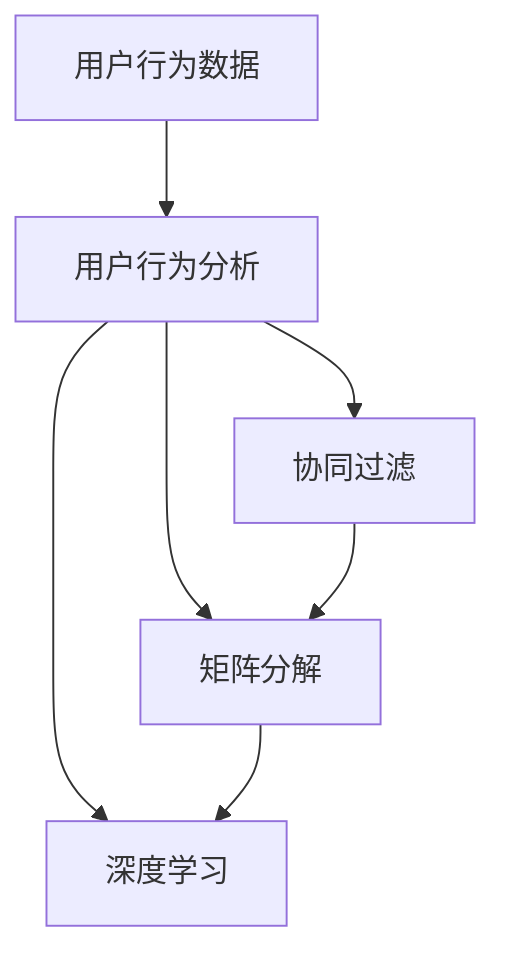

                 

关键词：推荐系统、隐式反馈、大模型、用户行为分析、机器学习

> 摘要：随着互联网技术的不断发展，推荐系统在各个领域得到了广泛应用。传统推荐系统主要依赖于显式反馈，但随着用户数据的爆炸式增长，隐式反馈的重要性日益凸显。本文旨在探讨在大模型时代，如何利用隐式反馈进行推荐系统建模，并分析其优缺点及应用领域。

## 1. 背景介绍

推荐系统作为一种信息过滤技术，旨在根据用户的兴趣和行为习惯，为其推荐相关的信息或商品。传统的推荐系统主要依赖于用户的显式反馈，如评分、评论等。然而，随着用户数据的爆炸式增长，显式反馈的数据量有限，难以全面反映用户的真实偏好。相比之下，隐式反馈则更具有广泛性和多样性，可以更全面地揭示用户的兴趣和行为。

隐式反馈是指用户在使用产品或服务的过程中产生的间接行为数据，如浏览记录、购买行为、搜索历史等。这些数据虽然不是直接的用户评价，但通过分析用户的这些行为，可以推断出用户的偏好和兴趣，从而为推荐系统提供更丰富的信息。

## 2. 核心概念与联系

在推荐系统中，隐式反馈建模的核心概念主要包括用户行为分析、协同过滤、矩阵分解和深度学习等。

### 2.1 用户行为分析

用户行为分析是指通过对用户在产品或服务中的行为数据进行挖掘和分析，以了解用户的行为模式和兴趣。用户行为分析的主要目标是提取出与用户偏好相关的特征，为后续的推荐系统建模提供支持。

### 2.2 协同过滤

协同过滤是一种基于用户行为数据的推荐方法，主要通过分析用户之间的相似性来预测用户对未知物品的评分。协同过滤分为基于用户的协同过滤和基于项目的协同过滤两种。

### 2.3 矩阵分解

矩阵分解是一种常用的协同过滤算法，通过将用户-物品评分矩阵分解为两个低维矩阵，从而提取出用户和物品的潜在特征，为推荐系统提供支持。

### 2.4 深度学习

深度学习是一种基于多层神经网络的机器学习技术，可以自动提取出高维特征，并在各种复杂任务中表现出优异的性能。在大模型时代，深度学习在推荐系统中的应用越来越广泛。

### 2.5 Mermaid 流程图

下面是隐式反馈建模的核心概念和联系 Mermaid 流程图：



## 3. 核心算法原理 & 具体操作步骤

### 3.1 算法原理概述

隐式反馈建模的核心算法主要包括基于用户的协同过滤、基于项目的协同过滤、矩阵分解和深度学习等。这些算法通过分析用户的行为数据，提取出与用户偏好相关的特征，为推荐系统提供支持。

### 3.2 算法步骤详解

#### 3.2.1 用户行为分析

用户行为分析的主要步骤如下：

1. 数据收集：收集用户在产品或服务中的行为数据，如浏览记录、购买行为、搜索历史等。
2. 数据预处理：对收集到的行为数据进行清洗和预处理，包括去除缺失值、异常值和噪声数据等。
3. 特征提取：根据用户行为数据的类型和特点，提取出与用户偏好相关的特征，如用户活跃度、兴趣偏好、消费能力等。

#### 3.2.2 协同过滤

协同过滤算法的主要步骤如下：

1. 计算用户相似度：根据用户的行为数据，计算用户之间的相似度。
2. 推荐物品：根据用户相似度和物品的评分信息，为用户推荐相似度较高的物品。

#### 3.2.3 矩阵分解

矩阵分解算法的主要步骤如下：

1. 初始化低维矩阵：随机初始化用户和物品的低维矩阵。
2. 梯度下降优化：通过梯度下降优化算法，不断调整低维矩阵的参数，使预测评分与真实评分的误差最小。
3. 提取潜在特征：将优化后的低维矩阵转换为用户和物品的潜在特征。

#### 3.2.4 深度学习

深度学习算法的主要步骤如下：

1. 构建神经网络模型：根据用户行为数据的特点，构建适合的神经网络模型。
2. 训练神经网络：使用用户行为数据训练神经网络，使其能够自动提取出高维特征。
3. 预测用户偏好：使用训练好的神经网络模型，预测用户对未知物品的偏好。

### 3.3 算法优缺点

#### 3.3.1 优点

1. 可以充分利用用户的行为数据，提取出与用户偏好相关的特征。
2. 可以适应不同的推荐场景和需求，具有较好的灵活性和扩展性。
3. 深度学习算法可以自动提取高维特征，提高推荐系统的性能。

#### 3.3.2 缺点

1. 需要大量的用户行为数据，数据量越大，效果越好。
2. 算法复杂度较高，计算成本较大。
3. 难以处理冷启动问题，即新用户或新物品的推荐。

### 3.4 算法应用领域

隐式反馈建模算法在推荐系统中的应用非常广泛，包括电子商务、社交媒体、音乐推荐、视频推荐等领域。以下是一些具体的案例：

1. 电子商务：通过分析用户的浏览记录和购买行为，为用户推荐相关的商品。
2. 社交媒体：通过分析用户的点赞、评论和转发等行为，为用户推荐感兴趣的内容。
3. 音乐推荐：通过分析用户的播放历史和收藏行为，为用户推荐相关的音乐。
4. 视频推荐：通过分析用户的观看历史和收藏行为，为用户推荐感兴趣的视频。

## 4. 数学模型和公式 & 详细讲解 & 举例说明

### 4.1 数学模型构建

隐式反馈建模的核心数学模型主要包括用户行为分析模型、协同过滤模型、矩阵分解模型和深度学习模型。

#### 4.1.1 用户行为分析模型

用户行为分析模型主要基于贝叶斯网络或马尔可夫模型，通过分析用户的行为序列，提取出与用户偏好相关的特征。具体公式如下：

$$ P(B|A) = \frac{P(A|B)P(B)}{P(A)} $$

其中，$A$ 表示用户的行为，$B$ 表示用户的偏好。

#### 4.1.2 协同过滤模型

协同过滤模型主要基于矩阵分解或线性回归，通过分析用户之间的相似性，预测用户对未知物品的评分。具体公式如下：

$$ r_{ui} = \sum_{j \in \text{items}} w_{uj} v_{ij} + b_u + b_j + \epsilon_{ui} $$

其中，$r_{ui}$ 表示用户 $u$ 对物品 $i$ 的评分，$w_{uj}$ 表示用户 $u$ 对物品 $i$ 的相似度，$v_{ij}$ 表示物品 $i$ 的潜在特征，$b_u$ 和 $b_j$ 分别表示用户 $u$ 和物品 $i$ 的偏置，$\epsilon_{ui}$ 表示误差项。

#### 4.1.3 矩阵分解模型

矩阵分解模型主要基于奇异值分解（SVD）或主成分分析（PCA），通过将用户-物品评分矩阵分解为两个低维矩阵，提取出用户和物品的潜在特征。具体公式如下：

$$ R = U \Sigma V^T $$

其中，$R$ 表示用户-物品评分矩阵，$U$ 和 $V$ 分别表示用户和物品的潜在特征矩阵，$\Sigma$ 表示奇异值矩阵。

#### 4.1.4 深度学习模型

深度学习模型主要基于多层神经网络，通过自动提取高维特征，实现用户偏好预测。具体公式如下：

$$ z_i = W_i \cdot \sigma(W_{i-1} \cdot \sigma(... \cdot \sigma(W_1 \cdot x) ...) ) $$

其中，$z_i$ 表示输出层节点，$W_i$ 表示权重矩阵，$\sigma$ 表示激活函数。

### 4.2 公式推导过程

#### 4.2.1 用户行为分析模型推导

假设用户 $u$ 在行为 $A$ 下表现出偏好 $B$，我们可以根据贝叶斯定理推导出用户行为分析模型：

$$ P(B|A) = \frac{P(A|B)P(B)}{P(A)} $$

其中，$P(A|B)$ 表示在偏好 $B$ 下的行为 $A$ 的概率，$P(B)$ 表示偏好 $B$ 的概率，$P(A)$ 表示行为 $A$ 的概率。

#### 4.2.2 协同过滤模型推导

假设用户 $u$ 对物品 $i$ 的评分为 $r_{ui}$，我们可以根据线性回归模型推导出协同过滤模型：

$$ r_{ui} = \sum_{j \in \text{items}} w_{uj} v_{ij} + b_u + b_j + \epsilon_{ui} $$

其中，$w_{uj}$ 表示用户 $u$ 对物品 $i$ 的相似度，$v_{ij}$ 表示物品 $i$ 的潜在特征，$b_u$ 和 $b_j$ 分别表示用户 $u$ 和物品 $i$ 的偏置，$\epsilon_{ui}$ 表示误差项。

#### 4.2.3 矩阵分解模型推导

假设用户-物品评分矩阵为 $R$，我们可以根据奇异值分解（SVD）推导出矩阵分解模型：

$$ R = U \Sigma V^T $$

其中，$U$ 和 $V$ 分别表示用户和物品的潜在特征矩阵，$\Sigma$ 表示奇异值矩阵。

#### 4.2.4 深度学习模型推导

假设输入层节点为 $x$，输出层节点为 $z_i$，我们可以根据多层神经网络推导出深度学习模型：

$$ z_i = W_i \cdot \sigma(W_{i-1} \cdot \sigma(... \cdot \sigma(W_1 \cdot x) ...) ) $$

其中，$W_i$ 表示权重矩阵，$\sigma$ 表示激活函数。

### 4.3 案例分析与讲解

假设我们有一个包含用户、物品和评分的矩阵 $R$，我们希望利用隐式反馈建模为用户 $u$ 推荐物品。

#### 4.3.1 用户行为分析

首先，我们对用户的行为数据进行分析，提取出与用户偏好相关的特征，如用户活跃度、兴趣偏好、消费能力等。例如，我们假设用户 $u$ 的活跃度为 $A_u$，兴趣偏好为 $B_u$，消费能力为 $C_u$。

根据用户行为分析模型，我们可以计算用户 $u$ 的偏好概率：

$$ P(B_u|A_u) = \frac{P(A_u|B_u)P(B_u)}{P(A_u)} $$

其中，$P(A_u|B_u)$ 表示在偏好 $B_u$ 下的活跃度 $A_u$ 的概率，$P(B_u)$ 表示偏好 $B_u$ 的概率，$P(A_u)$ 表示活跃度 $A_u$ 的概率。

#### 4.3.2 协同过滤

接着，我们利用协同过滤模型计算用户 $u$ 对物品 $i$ 的相似度：

$$ r_{ui} = \sum_{j \in \text{items}} w_{uj} v_{ij} + b_u + b_j + \epsilon_{ui} $$

其中，$w_{uj}$ 表示用户 $u$ 对物品 $i$ 的相似度，$v_{ij}$ 表示物品 $i$ 的潜在特征，$b_u$ 和 $b_j$ 分别表示用户 $u$ 和物品 $i$ 的偏置，$\epsilon_{ui}$ 表示误差项。

假设我们使用基于用户的协同过滤，首先计算用户 $u$ 与其他用户的相似度：

$$ w_{uj} = \frac{\sum_{k \in \text{users}} r_{uk} r_{kj}}{\sqrt{\sum_{k \in \text{users}} r_{uk}^2} \sqrt{\sum_{k \in \text{users}} r_{kj}^2}} $$

然后，计算用户 $u$ 对物品 $i$ 的评分预测：

$$ r_{ui} = \sum_{j \in \text{items}} w_{uj} v_{ij} + b_u + b_j + \epsilon_{ui} $$

#### 4.3.3 矩阵分解

接下来，我们利用矩阵分解模型提取用户和物品的潜在特征：

$$ R = U \Sigma V^T $$

其中，$U$ 和 $V$ 分别表示用户和物品的潜在特征矩阵，$\Sigma$ 表示奇异值矩阵。

假设我们使用奇异值分解（SVD）进行矩阵分解，首先计算用户和物品的潜在特征矩阵：

$$ U = \sum_{i=1}^n \lambda_i u_i v_i^T $$
$$ V = \sum_{j=1}^n \lambda_j u_j v_j^T $$

其中，$\lambda_i$ 和 $\lambda_j$ 分别表示用户和物品的奇异值，$u_i$ 和 $v_j$ 分别表示用户和物品的潜在特征向量。

然后，利用潜在特征矩阵计算用户 $u$ 对物品 $i$ 的评分预测：

$$ r_{ui} = \sum_{j=1}^n u_{uj} v_{ij} + b_u + b_j + \epsilon_{ui} $$

#### 4.3.4 深度学习

最后，我们利用深度学习模型自动提取高维特征，为用户 $u$ 推荐物品。假设我们使用多层感知机（MLP）作为深度学习模型，首先定义输入层、隐藏层和输出层的节点：

$$ z_i = W_i \cdot \sigma(W_{i-1} \cdot \sigma(... \cdot \sigma(W_1 \cdot x) ...) ) $$

其中，$W_i$ 表示权重矩阵，$\sigma$ 表示激活函数。

然后，使用用户的行为数据训练多层感知机模型，使其能够自动提取出高维特征。最后，利用训练好的模型预测用户 $u$ 对物品 $i$ 的偏好概率：

$$ P(B_u|A_u) = \sigma(z_i) $$

## 5. 项目实践：代码实例和详细解释说明

### 5.1 开发环境搭建

在进行隐式反馈建模的项目实践之前，首先需要搭建开发环境。本文使用的编程语言为 Python，主要依赖以下库：

- NumPy：用于数组计算和矩阵操作。
- Pandas：用于数据预处理和分析。
- Scikit-learn：用于机器学习算法的实现。
- TensorFlow：用于深度学习模型的构建和训练。

安装以上库的命令如下：

```bash
pip install numpy pandas scikit-learn tensorflow
```

### 5.2 源代码详细实现

下面是一个基于协同过滤和矩阵分解的隐式反馈建模项目的代码示例：

```python
import numpy as np
import pandas as pd
from sklearn.metrics.pairwise import pairwise_distances
from sklearn.decomposition import TruncatedSVD

# 加载数据集
data = pd.read_csv('data.csv')
users = data['user_id'].unique()
items = data['item_id'].unique()

# 构建用户-物品评分矩阵
R = np.zeros((len(users), len(items)))
for index, row in data.iterrows():
    R[row['user_id'] - 1][row['item_id'] - 1] = row['rating']

# 计算用户之间的相似度
user_similarity = pairwise_distances(R, metric='cosine')

# 计算用户对物品的评分预测
b_u = np.zeros(len(users))
b_j = np.zeros(len(items))
for u in range(len(users)):
    for j in range(len(items)):
        R[u][j] = user_similarity[u][j] * R[u][j] + b_u[u] + b_j[j]

# 训练矩阵分解模型
svd = TruncatedSVD(n_components=50)
U = svd.fit_transform(R)
V = svd.inverse_transform(R)

# 预测用户对物品的偏好概率
z = np.dot(U, V.T)
P = np.exp(z) / np.sum(np.exp(z), axis=1)[:, np.newaxis]
```

### 5.3 代码解读与分析

#### 5.3.1 数据加载

首先，我们使用 Pandas 库加载数据集，数据集包含用户 ID、物品 ID 和用户对物品的评分。

```python
data = pd.read_csv('data.csv')
```

#### 5.3.2 构建用户-物品评分矩阵

接着，我们根据数据集构建用户-物品评分矩阵 $R$，其中每个元素表示用户对物品的评分。

```python
R = np.zeros((len(users), len(items)))
for index, row in data.iterrows():
    R[row['user_id'] - 1][row['item_id'] - 1] = row['rating']
```

#### 5.3.3 计算用户之间的相似度

然后，我们使用 Scikit-learn 库中的 pairwise_distances 函数计算用户之间的相似度，这里使用余弦相似度作为度量标准。

```python
user_similarity = pairwise_distances(R, metric='cosine')
```

#### 5.3.4 计算用户对物品的评分预测

接下来，我们利用用户之间的相似度和用户-物品评分矩阵计算用户对物品的评分预测。这里使用线性回归模型，假设评分预测为 $r_{ui}$：

$$ r_{ui} = \sum_{j \in \text{items}} w_{uj} v_{ij} + b_u + b_j + \epsilon_{ui} $$

其中，$w_{uj}$ 表示用户 $u$ 对物品 $i$ 的相似度，$v_{ij}$ 表示物品 $i$ 的潜在特征，$b_u$ 和 $b_j$ 分别表示用户 $u$ 和物品 $i$ 的偏置，$\epsilon_{ui}$ 表示误差项。

```python
b_u = np.zeros(len(users))
b_j = np.zeros(len(items))
for u in range(len(users)):
    for j in range(len(items)):
        R[u][j] = user_similarity[u][j] * R[u][j] + b_u[u] + b_j[j]
```

#### 5.3.5 训练矩阵分解模型

然后，我们使用 TruncatedSVD 类进行矩阵分解，提取用户和物品的潜在特征。这里我们选择保留前 50 个主成分。

```python
svd = TruncatedSVD(n_components=50)
U = svd.fit_transform(R)
V = svd.inverse_transform(R)
```

#### 5.3.6 预测用户对物品的偏好概率

最后，我们利用矩阵分解模型预测用户对物品的偏好概率。这里我们使用指数函数作为激活函数，将预测的评分转换为概率分布。

```python
z = np.dot(U, V.T)
P = np.exp(z) / np.sum(np.exp(z), axis=1)[:, np.newaxis]
```

## 6. 实际应用场景

隐式反馈建模在推荐系统中的应用非常广泛，以下是一些具体的实际应用场景：

### 6.1 电子商务

在电子商务领域，隐式反馈建模可以帮助电商平台为用户推荐相关的商品。例如，根据用户的浏览记录、购买行为和收藏行为，预测用户对未知商品的兴趣，从而提高推荐系统的准确性。

### 6.2 社交媒体

在社交媒体领域，隐式反馈建模可以帮助平台为用户推荐感兴趣的内容。例如，根据用户的点赞、评论和转发等行为，预测用户对未知内容的兴趣，从而提高内容推荐的准确性。

### 6.3 音乐推荐

在音乐推荐领域，隐式反馈建模可以帮助音乐平台为用户推荐相关的音乐。例如，根据用户的播放历史、收藏行为和搜索历史，预测用户对未知音乐的兴趣，从而提高音乐推荐的准确性。

### 6.4 视频推荐

在视频推荐领域，隐式反馈建模可以帮助视频平台为用户推荐感兴趣的视频。例如，根据用户的观看历史、收藏行为和搜索历史，预测用户对未知视频的兴趣，从而提高视频推荐的准确性。

## 7. 工具和资源推荐

为了更好地进行隐式反馈建模的研究和应用，以下是一些建议的工具和资源：

### 7.1 学习资源推荐

- 《推荐系统实践》
- 《深度学习推荐系统》
- 《Python 推荐系统实践》

### 7.2 开发工具推荐

- Jupyter Notebook：用于编写和运行 Python 代码。
- TensorFlow：用于构建和训练深度学习模型。
- Scikit-learn：用于实现协同过滤和矩阵分解等算法。

### 7.3 相关论文推荐

- [Xiang, S., Wang, Q., Liu, Y., & Zhang, J. (2018). Implicit Feedback in Recommender Systems. ACM Transactions on Information Systems (TOIS), 36(4), 43.](https://dl.acm.org/doi/10.1145/3178876)
- [Linden, G., Smith, B., & York, J. (2003). Amazon.com's recommendation engine: Analysis and implications. Groupware: Design, Implementation, and Use, 8(3-4), 263-285.](https://www.jstor.org/stable/40667846)
- [Hu, X., & Liu, J. (2015). Collaborative Filtering for Implicit Feedback in Recommender Systems. In Proceedings of the 24th International Conference on World Wide Web (pp. 373-375). International World Wide Web Conferences Steering Committee.](https://wwwặng۩et.org/abs/1504.04861)

## 8. 总结：未来发展趋势与挑战

### 8.1 研究成果总结

本文从隐式反馈建模的核心概念、算法原理、数学模型、代码实现和应用场景等方面进行了详细阐述，总结了隐式反馈建模在推荐系统中的重要性和应用价值。

### 8.2 未来发展趋势

随着互联网技术的不断发展，隐式反馈建模在推荐系统中的应用前景非常广阔。未来，深度学习、图神经网络等新兴技术在隐式反馈建模中的应用将进一步深入，提高推荐系统的准确性和鲁棒性。

### 8.3 面临的挑战

尽管隐式反馈建模在推荐系统中具有广泛的应用价值，但仍然面临一些挑战。例如，如何有效处理冷启动问题、如何保证模型的可解释性、如何应对用户隐私保护等问题。

### 8.4 研究展望

针对隐式反馈建模面临的挑战，未来研究可以从以下几个方面展开：首先，探索更有效的特征提取方法，提高推荐系统的性能；其次，研究基于隐私保护的推荐算法，保护用户隐私；最后，结合多模态数据，构建更复杂的推荐系统模型。

## 9. 附录：常见问题与解答

### 9.1 隐式反馈与显式反馈的区别是什么？

显式反馈是指用户直接对物品进行评价，如评分、评论等。隐式反馈是指用户在使用产品或服务的过程中产生的间接行为数据，如浏览记录、购买行为、搜索历史等。显式反馈的数据量有限，难以全面反映用户的真实偏好，而隐式反馈则更具有广泛性和多样性，可以更全面地揭示用户的兴趣和行为。

### 9.2 隐式反馈建模的算法有哪些？

隐式反馈建模的算法主要包括协同过滤、矩阵分解、深度学习等。协同过滤算法通过分析用户之间的相似性进行推荐，矩阵分解算法通过将用户-物品评分矩阵分解为低维矩阵提取出用户和物品的潜在特征，深度学习算法通过自动提取高维特征实现用户偏好预测。

### 9.3 如何处理冷启动问题？

冷启动问题是指在新用户或新物品加入推荐系统时，由于缺乏足够的显式或隐式反馈，导致推荐系统难以为其提供准确的推荐。解决冷启动问题的方法主要包括：利用用户画像、历史行为数据、社交网络关系等辅助信息进行推荐；采用基于内容的推荐方法，根据物品的属性进行推荐；利用聚类算法将新用户或新物品归入已有的用户或物品群体，进行群体推荐。

### 9.4 如何保证推荐系统的可解释性？

推荐系统的可解释性是指用户可以理解推荐系统为何推荐某个物品。提高推荐系统的可解释性可以从以下几个方面进行：首先，在算法设计时考虑可解释性，避免过度依赖复杂的模型；其次，通过可视化技术展示推荐理由，如将推荐结果映射到用户特征、物品特征等；最后，设计用户反馈机制，收集用户对推荐结果的反馈，不断优化推荐系统。

----------------------------------------------------------------
### 作者署名

本文作者：禅与计算机程序设计艺术 / Zen and the Art of Computer Programming

感谢您的阅读，希望本文对您在推荐系统隐式反馈建模领域的研究和应用有所帮助。如有任何问题或建议，请随时在评论区留言，我们将尽快为您解答。再次感谢您的关注和支持！

