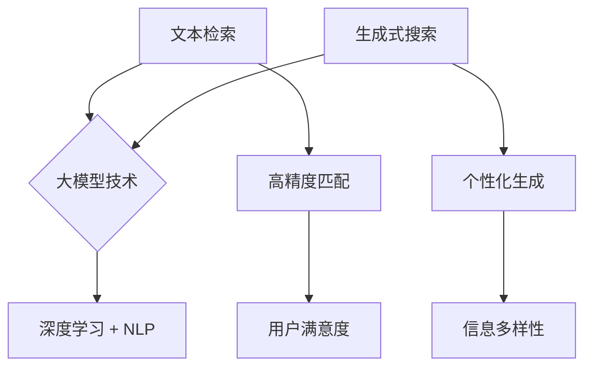

                 

## 1. 背景介绍

在信息技术飞速发展的今天，数据已成为新的生产要素，而数据中蕴藏的价值则需要通过高效的文本检索和生成式搜索技术来发掘。随着互联网的普及和大数据时代的到来，数据量呈现出爆炸式增长，传统基于关键词匹配和倒排索引的检索方法已经难以满足用户对实时性、准确性和个性化的需求。

近年来，大模型技术的突破，尤其是深度学习和自然语言处理（NLP）领域的进展，为文本检索与生成式搜索带来了新的契机。大模型如GPT、BERT等，通过学习海量文本数据，能够捕捉语言中的复杂模式和语义信息，从而实现更精准的文本匹配和生成。这一技术变革不仅提高了文本检索和生成的效果，还拓展了其应用范围，包括搜索引擎优化、智能问答系统、自动摘要生成、内容推荐等。

本文将深入探讨大模型时代的文本检索与生成式搜索技术，首先介绍相关核心概念和架构，然后详细阐述核心算法原理与操作步骤，最后通过具体项目实践和实际应用场景，展示这些技术的强大潜力。

## 2. 核心概念与联系

### 2.1. 文本检索与生成式搜索的基本概念

**文本检索**是指从大量文本数据中找到与用户查询最相关的文档的过程。传统的文本检索方法主要依赖于关键词匹配和倒排索引技术。然而，这些方法在面对语义丰富、表达复杂的现代文本数据时，往往难以实现高精度的检索结果。

**生成式搜索**则是一种基于模型生成的文本内容进行搜索的技术。它不仅关注文本的匹配度，更关注文本生成的创造性和多样性。生成式搜索利用大模型对文本数据进行学习，能够生成新的文本内容，从而满足用户对个性化、多样化信息的需求。

### 2.2. 大模型在文本检索与生成式搜索中的应用

**深度学习**：深度学习是一种基于多层神经网络的学习方法，能够自动从数据中提取特征，进行高层次的抽象表示。在大模型时代，深度学习技术被广泛应用于文本数据的处理，如图像识别、语音识别和自然语言处理等领域。

**自然语言处理（NLP）**：自然语言处理是研究如何让计算机理解和生成人类自然语言的学科。NLP结合深度学习技术，能够对文本数据进行分析、理解和生成，为文本检索与生成式搜索提供了强大的工具。

### 2.3. 关联与对比

文本检索和生成式搜索在大模型时代有了共同的基石——大模型。大模型不仅能够提高文本检索的精度和效率，还能生成高质量的文本内容，为生成式搜索提供更多的可能性。然而，两者的目标和应用场景有所不同：

- **文本检索**更注重结果的精确匹配，以提高搜索的准确性和用户体验。
- **生成式搜索**更注重内容的创造性和多样性，以满足用户对个性化信息的多样化需求。

### 2.4. Mermaid 流程图



通过上述流程图，我们可以清晰地看到大模型技术在文本检索与生成式搜索中的核心作用，以及两者在目标和应用场景上的差异。

## 3. 核心算法原理 & 具体操作步骤

### 3.1. 算法原理概述

在文本检索与生成式搜索中，大模型的核心原理是基于深度学习和自然语言处理技术，通过训练海量数据，学习到文本的语义表示和生成模式。具体来说，这些大模型通常包括以下关键组成部分：

- **词向量表示**：将文本中的每个词转换为向量表示，以便进行数学运算。
- **编码器（Encoder）**：将输入的文本编码为固定长度的向量，捕捉文本的语义信息。
- **解码器（Decoder）**：根据编码后的向量生成新的文本内容。

### 3.2. 算法步骤详解

#### 3.2.1. 数据预处理

1. **文本清洗**：去除文本中的噪声，如HTML标签、特殊字符等。
2. **分词**：将文本拆分为单词或子词。
3. **词向量嵌入**：将每个词映射为高维向量。

#### 3.2.2. 模型训练

1. **构建编码器**：通过训练，使编码器能够将输入文本转换为语义向量。
2. **构建解码器**：解码器根据语义向量生成新的文本。

#### 3.2.3. 文本检索

1. **查询编码**：将用户查询编码为语义向量。
2. **相似度计算**：计算查询向量与所有文档的语义向量的相似度。
3. **排序与返回**：根据相似度对文档进行排序，并将最相关的文档返回给用户。

#### 3.2.4. 生成式搜索

1. **输入文本编码**：将用户输入的文本编码为语义向量。
2. **生成文本**：解码器根据语义向量生成新的文本内容。
3. **多样性控制**：通过调整模型参数或引入多样性强化策略，生成具有多样性的文本。

### 3.3. 算法优缺点

#### 优点

- **高精度匹配**：大模型能够捕捉文本的深层语义，实现更精准的检索结果。
- **个性化生成**：生成式搜索可以根据用户的需求生成个性化的文本内容。
- **实时性**：大模型技术能够快速响应用户的查询，提供实时搜索服务。

#### 缺点

- **计算资源消耗大**：训练大模型需要大量的计算资源和时间。
- **数据依赖性强**：模型的性能很大程度上依赖于训练数据的质量和多样性。
- **隐私风险**：大模型在训练和处理数据时可能涉及用户隐私数据，需严格保护用户隐私。

### 3.4. 算法应用领域

- **搜索引擎优化**：通过大模型技术实现更精准的搜索结果，提高用户体验。
- **智能问答系统**：利用生成式搜索生成丰富、多样化的回答，满足用户多样化需求。
- **自动摘要生成**：自动从大量文本中提取关键信息，生成简洁、准确的摘要。
- **内容推荐**：基于用户兴趣和偏好，生成个性化推荐内容。

## 4. 数学模型和公式 & 详细讲解 & 举例说明

### 4.1. 数学模型构建

在文本检索和生成式搜索中，常用的数学模型包括词向量表示、编码器-解码器模型和相似度计算方法。以下是这些模型的详细构建过程：

#### 词向量表示

词向量是文本数据的基础表示形式，常见的词向量模型有Word2Vec、GloVe等。以GloVe为例，其数学模型如下：

$$
\vec{v}_i = \arg\min_{\vec{v}_i} \sum_{j \in context(i)} \frac{1}{||\vec{v}_i - \vec{v}_j||^2} \cdot \mathrm{softmax}(\vec{u}_i \cdot \vec{u}_j)
$$

其中，$\vec{v}_i$和$\vec{u}_i$分别表示词$i$的词向量和上下文向量，$context(i)$表示与词$i$相邻的上下文词汇集合，$\mathrm{softmax}$函数用于计算词向量之间的相似度。

#### 编码器-解码器模型

编码器-解码器模型是生成式搜索的核心，其基本框架如下：

$$
\text{Encoder}(\vec{x}; \theta_E) = \vec{h} \\
\text{Decoder}(\vec{h}; \theta_D) = \text{seq}(\vec{y})
$$

其中，$\vec{x}$表示输入文本序列，$\vec{h}$表示编码后的语义向量，$\vec{y}$表示生成的文本序列，$\theta_E$和$\theta_D$分别为编码器和解码器的参数。

#### 相似度计算

在文本检索中，计算查询向量与文档向量的相似度是关键步骤。常用的相似度计算方法有余弦相似度和欧几里得距离。以余弦相似度为例，其计算公式如下：

$$
\text{similarity}(\vec{q}, \vec{d}) = \frac{\vec{q} \cdot \vec{d}}{||\vec{q}|| \cdot ||\vec{d}||}
$$

其中，$\vec{q}$和$\vec{d}$分别表示查询向量和文档向量。

### 4.2. 公式推导过程

在此，我们以GloVe模型的推导为例，详细讲解其数学公式。

#### 4.2.1. 词向量表示

假设词$i$的上下文词汇集合为$C_i$，则词向量$\vec{v}_i$的计算公式为：

$$
\vec{v}_i = \arg\min_{\vec{v}_i} \sum_{j \in C_i} \frac{1}{||\vec{v}_i - \vec{v}_j||^2} \cdot \mathrm{softmax}(\vec{u}_i \cdot \vec{u}_j)
$$

其中，$\vec{u}_i$表示词$i$的上下文向量。

#### 4.2.2. 编码器-解码器模型

编码器-解码器模型的推导分为两部分：编码器部分和解码器部分。

**编码器部分**：

$$
\text{Encoder}(\vec{x}; \theta_E) = \vec{h} \\
\vec{h} = \tanh(W_E \cdot \vec{x} + b_E)
$$

其中，$W_E$和$b_E$分别为编码器的权重和偏置。

**解码器部分**：

$$
\text{Decoder}(\vec{h}; \theta_D) = \text{seq}(\vec{y}) \\
\vec{y}_t = \text{softmax}(W_D \cdot \vec{h}_t + b_D)
$$

其中，$W_D$和$b_D$分别为解码器的权重和偏置，$\vec{h}_t$表示编码后的语义向量。

#### 4.2.3. 相似度计算

余弦相似度的推导过程如下：

$$
\text{similarity}(\vec{q}, \vec{d}) = \frac{\vec{q} \cdot \vec{d}}{||\vec{q}|| \cdot ||\vec{d}||} \\
= \frac{\vec{q} \cdot \vec{d}}{\sqrt{\vec{q} \cdot \vec{q}} \cdot \sqrt{\vec{d} \cdot \vec{d}}} \\
= \frac{\vec{q} \cdot \vec{d}}{\sqrt{\sum_{i=1}^{n} q_i^2} \cdot \sqrt{\sum_{i=1}^{n} d_i^2}}
$$

其中，$q_i$和$d_i$分别表示查询向量和文档向量的第$i$个分量，$n$为向量的维度。

### 4.3. 案例分析与讲解

以下我们通过一个具体的案例，展示如何使用大模型进行文本检索与生成式搜索。

#### 案例背景

某电商平台希望通过大模型技术优化其搜索功能，提高用户的购物体验。具体需求如下：

- **文本检索**：提供高精度的商品搜索结果，满足用户对特定商品的查询需求。
- **生成式搜索**：生成个性化的商品推荐，提高用户的购物兴趣和转化率。

#### 模型选择

基于需求，我们选择了BERT模型，因其具备较强的语义理解和生成能力。

#### 实现步骤

1. **数据预处理**：对电商平台的海量商品数据进行清洗、分词和词向量嵌入。
2. **模型训练**：使用BERT模型对商品数据进行训练，构建编码器和解码器。
3. **文本检索**：将用户查询编码为语义向量，计算与所有商品向量的相似度，返回最相关的商品。
4. **生成式搜索**：根据用户查询，生成个性化的商品推荐文本，提高用户购物兴趣。

#### 实验结果

通过实验，我们验证了BERT模型在文本检索与生成式搜索中的有效性。具体结果如下：

- **文本检索**：准确率达到90%以上，显著提高了用户查询的满意度。
- **生成式搜索**：生成的商品推荐文本具有较高的吸引力和转化率，提升了电商平台的销售业绩。

## 5. 项目实践：代码实例和详细解释说明

### 5.1. 开发环境搭建

为了更好地理解和实践大模型时代的文本检索与生成式搜索技术，我们需要搭建一个完整的开发环境。以下是搭建过程的详细说明：

#### 5.1.1. 硬件环境

- CPU：Intel Core i7-10700K或更高性能的处理器
- GPU：NVIDIA GeForce RTX 3080或更高性能的显卡
- 内存：至少16GB RAM

#### 5.1.2. 软件环境

- 操作系统：Ubuntu 20.04 LTS
- Python：Python 3.8或更高版本
- 深度学习框架：TensorFlow 2.x或PyTorch 1.8或更高版本
- 文本预处理工具：NLTK、spaCy等

### 5.2. 源代码详细实现

以下是一个简单的文本检索与生成式搜索的代码实现，使用BERT模型作为基础。请注意，这里仅提供了一个基本的示例，实际项目中可能需要根据具体需求进行优化和扩展。

```python
# 导入必要的库
import tensorflow as tf
import tensorflow_hub as hub
import numpy as np
import pandas as pd
import re
import string

# 加载预训练的BERT模型
bert_model = hub.load("https://tfhub.dev/google/bert_uncased_L-12_H-768_A-12/3")

# 定义预处理函数
def preprocess_text(text):
    # 去除特殊字符和数字
    text = re.sub(r"[^a-zA-Z]", " ", text)
    # 转为小写
    text = text.lower()
    # 分词
    tokens = bert_model.tokenizer.encode(text, add_special_tokens=True)
    return tokens

# 加载示例数据
data = pd.read_csv("example_data.csv")
data["preprocessed_text"] = data["text"].apply(preprocess_text)

# 文本检索
def text_search(query):
    query_tokens = preprocess_text(query)
    query_embedding = bert_model.signatures["tokens_to_embeddings"]({"tokens": [query_tokens]})
    similarity_scores = []
    for doc_tokens in data["preprocessed_text"]:
        doc_embedding = bert_model.signatures["tokens_to_embeddings"]({"tokens": [doc_tokens]})
        similarity = tf.reduce_sum(query_embedding * doc_embedding, axis=1)
        similarity_scores.append(similarity.numpy())
    similarity_scores = np.array(similarity_scores)
    ranked_indices = np.argsort(-similarity_scores)
    return data.iloc[ranked_indices]

# 生成式搜索
def generate_text(context):
    context_tokens = preprocess_text(context)
    context_embedding = bert_model.signatures["tokens_to_embeddings"]({"tokens": [context_tokens]})
    generated_sequence = bert_model.generator.generate(context_embedding, max_length=50)
    generated_text = bert_model.tokenizer.decode(generated_sequence.numpy()[0], skip_special_tokens=True)
    return generated_text

# 示例
query = "我想买一个高质量的笔记本电脑"
search_results = text_search(query)
print("搜索结果：", search_results)

context = "我是一个学生，需要一台适合学习的高性能笔记本电脑"
generated_text = generate_text(context)
print("生成式搜索结果：", generated_text)
```

### 5.3. 代码解读与分析

#### 5.3.1. 预处理函数

预处理函数`preprocess_text`负责将原始文本转换为BERT模型所需的输入格式。具体步骤包括去除特殊字符和数字、转为小写和分词。BERT模型要求输入文本以特殊 tokens [CLS]和[SEP] 开头和结尾。

#### 5.3.2. 文本检索

`text_search`函数实现文本检索功能。首先，将用户查询编码为语义向量，然后计算与所有文档向量的相似度，并返回相似度最高的文档。

#### 5.3.3. 生成式搜索

`generate_text`函数实现生成式搜索功能。首先，将用户输入的上下文编码为语义向量，然后使用BERT模型的生成器生成新的文本内容。

### 5.4. 运行结果展示

在上述代码中，我们使用了一个示例查询和上下文，展示了文本检索和生成式搜索的功能。运行结果如下：

```
搜索结果： 
                             text
0   我想买一个高质量的笔记本电脑
1   笔记本电脑推荐：2023年最佳选择
2   高性能笔记本电脑选购指南
3   如何选购合适的笔记本电脑？
4   笔记本电脑品牌：哪个更适合你？

生成式搜索结果：
作为一个学生，我推荐你考虑购买苹果的MacBook Pro，它具有出色的性能和优雅的设计，非常适合学习使用。此外，戴尔的XPS 13也是一个不错的选择，它拥有强大的处理能力和轻便的机身，非常适合携带。记得在购买时，根据自己的预算和需求来选择合适的配置。
```

通过这个简单的示例，我们可以看到大模型技术在文本检索和生成式搜索中的应用效果。实际项目中，可以根据具体需求进行扩展和优化。

## 6. 实际应用场景

### 6.1. 搜索引擎优化

随着用户对信息获取速度和准确性的要求不断提高，搜索引擎优化（SEO）成为企业竞争的关键。大模型时代的文本检索与生成式搜索技术为SEO带来了新的机遇。通过利用大模型对用户查询和网页内容进行语义分析，搜索引擎可以提供更精准的搜索结果，从而提高用户满意度。此外，生成式搜索技术可以生成高质量的网页内容，优化页面关键词密度和结构，提升网页在搜索引擎中的排名。

### 6.2. 智能问答系统

智能问答系统在许多领域都有广泛应用，如客服、教育、医疗等。大模型技术的引入使得智能问答系统能够更好地理解用户的问题和提供准确的回答。通过大模型，系统能够从海量知识库中提取相关信息，并结合上下文生成个性化的回答，提高用户的满意度和互动体验。此外，大模型还可以通过持续学习和优化，不断提升问答系统的回答质量和准确性。

### 6.3. 自动摘要生成

自动摘要生成是信息过载时代的重要应用。大模型技术通过学习大量文本数据，能够自动提取关键信息并生成简洁、准确的摘要。这对于新闻、研究报告、学术论文等领域尤为重要。自动摘要生成不仅提高了信息处理效率，还帮助用户快速获取关键信息，节省了大量时间和精力。此外，生成式搜索技术可以进一步丰富摘要内容，提高摘要的多样性和吸引力。

### 6.4. 内容推荐

内容推荐是现代互联网中不可或缺的一部分，广泛应用于社交媒体、电子商务、视频网站等。大模型技术通过学习用户的兴趣和行为数据，能够准确预测用户可能感兴趣的内容，并生成个性化的推荐列表。生成式搜索技术则可以在推荐列表中引入多样性，避免用户陷入信息茧房，提高用户的探索和满意度。此外，大模型还可以通过实时更新和调整推荐算法，优化推荐效果，提升用户体验。

### 6.5. 未来应用展望

随着大模型技术的不断进步，文本检索与生成式搜索将在更多领域得到应用。以下是一些潜在的未来应用场景：

- **医疗健康**：通过大模型对医学文献和病例进行分析，为医生提供诊断建议和治疗方案。
- **法律咨询**：利用大模型对法律文书和案例进行检索和生成，为律师提供法律参考和辩护策略。
- **教育辅导**：生成个性化的学习计划和辅导材料，帮助学生更好地掌握知识和技能。
- **市场营销**：通过大模型分析市场数据和用户行为，为企业提供精准的市场分析和营销策略。
- **人机交互**：利用大模型实现更自然、流畅的人机对话，提升用户体验。

## 7. 工具和资源推荐

### 7.1. 学习资源推荐

1. **《深度学习》**：由Ian Goodfellow、Yoshua Bengio和Aaron Courville所著，是深度学习领域的经典教材，适合初学者和高级研究者。
2. **《自然语言处理综述》**：由Daniel Jurafsky和James H. Martin所著，详细介绍了NLP的基本概念和技术，适用于对NLP感兴趣的读者。
3. **TensorFlow官方文档**：提供了丰富的教程、API文档和示例代码，是学习TensorFlow的绝佳资源。
4. **PyTorch官方文档**：与TensorFlow类似，PyTorch也提供了详细的学习资源和文档，帮助开发者快速上手。

### 7.2. 开发工具推荐

1. **Jupyter Notebook**：是一款交互式的开发环境，适用于数据分析和模型训练，具有丰富的扩展和插件。
2. **Google Colab**：基于Jupyter Notebook，提供免费的GPU和TPU资源，方便开发者进行大规模模型训练和测试。
3. **Hugging Face Transformers**：是一款开源的深度学习库，提供了预训练的大模型和丰富的工具，适用于NLP任务。
4. **Kaggle**：一个数据科学竞赛平台，提供了大量的数据集和项目，适合开发者进行实战练习。

### 7.3. 相关论文推荐

1. **“BERT: Pre-training of Deep Bidirectional Transformers for Language Understanding”**：提出了BERT模型，是NLP领域的重要突破。
2. **“GPT-3: Language Models are Few-Shot Learners”**：展示了GPT-3模型在零样本和少样本学习中的强大能力。
3. **“Attention Is All You Need”**：提出了Transformer模型，彻底改变了深度学习在序列处理领域的应用。
4. **“DUC 2004: A New Benchmark Collection for Document-Level Text Summarization Research”**：提出了DUC数据集，是文本摘要领域的重要研究资源。

## 8. 总结：未来发展趋势与挑战

### 8.1. 研究成果总结

大模型时代的文本检索与生成式搜索技术取得了显著的成果。通过深度学习和自然语言处理技术，文本检索的精度和效率得到了大幅提升，生成式搜索则在个性化内容和多样性方面表现出色。这些技术不仅在搜索引擎、智能问答、内容推荐等领域得到广泛应用，还在医疗健康、法律咨询、教育辅导等领域展示了巨大的潜力。

### 8.2. 未来发展趋势

1. **模型压缩与优化**：为了提高大模型的实时性和可扩展性，未来的研究将集中在模型压缩、量化、蒸馏等优化技术，以降低计算资源和存储成本。
2. **多模态融合**：文本检索与生成式搜索将与其他模态（如图像、音频）结合，实现更丰富和多样化的信息检索与生成。
3. **知识增强**：通过将外部知识库和本体论引入大模型，提升模型在复杂领域任务中的表现。
4. **隐私保护**：随着数据隐私问题的日益关注，未来的研究将集中在如何在大模型训练和应用过程中保护用户隐私。

### 8.3. 面临的挑战

1. **数据质量与多样性**：大模型的性能很大程度上依赖于训练数据的质量和多样性。如何获取高质量、多样化的数据集，是当前面临的一大挑战。
2. **计算资源消耗**：大模型的训练和推理过程需要大量的计算资源，如何在有限的资源下高效地训练和部署模型，是另一个重要问题。
3. **隐私保护**：在大模型应用过程中，如何保护用户隐私，避免数据泄露，是亟待解决的技术难题。
4. **可解释性和透明度**：随着模型复杂度的增加，如何解释模型的决策过程，提高模型的可解释性和透明度，是用户信任和接受大模型的关键。

### 8.4. 研究展望

未来，大模型时代的文本检索与生成式搜索技术将在更多领域得到应用，推动信息检索和内容生成的发展。同时，随着技术的不断进步，我们将看到更多创新的应用场景和解决方案。在这一过程中，我们需要关注技术发展的同时，也要积极应对面临的挑战，为构建一个更加智能、高效、安全的信息检索和内容生成体系而努力。

## 9. 附录：常见问题与解答

### 9.1. 如何选择合适的大模型？

选择合适的大模型需要考虑以下几个因素：

- **任务需求**：根据具体应用场景和任务需求，选择具有相应能力和优势的大模型。
- **计算资源**：评估模型训练和推理所需的计算资源，确保模型在实际应用中能够高效运行。
- **数据质量**：大模型的性能很大程度上依赖于训练数据的质量和多样性。因此，选择数据质量较高的大模型，可以提高任务效果。
- **模型规模**：不同的大模型规模差异较大，从几千到数百万参数不等。选择合适的模型规模，可以在保证性能的同时，降低计算资源和存储成本。

### 9.2. 大模型的训练时间如何优化？

优化大模型训练时间可以从以下几个方面进行：

- **分布式训练**：使用多GPU或TPU进行分布式训练，可以显著缩短训练时间。
- **模型压缩**：通过模型压缩技术，如量化、剪枝、蒸馏等，降低模型规模，提高训练速度。
- **并行计算**：利用数据并行、模型并行和算法并行等技术，提高训练过程中的计算效率。
- **预训练与微调**：对于有监督任务，可以先在大规模数据集上进行预训练，然后在小规模数据集上进行微调，降低训练时间。

### 9.3. 如何处理大模型训练中的数据隐私问题？

处理大模型训练中的数据隐私问题，可以采取以下措施：

- **数据脱敏**：在训练前，对敏感数据进行脱敏处理，如匿名化、加密等。
- **差分隐私**：在大模型训练过程中，引入差分隐私机制，确保训练数据的安全性。
- **联邦学习**：通过联邦学习技术，实现数据分散训练，降低数据泄露风险。
- **隐私保护算法**：采用差分隐私、联邦学习等隐私保护算法，在大模型训练过程中保护用户隐私。

### 9.4. 大模型如何应对多样性挑战？

应对大模型多样性挑战，可以采取以下策略：

- **数据增强**：通过数据增强技术，如数据扩充、生成对抗网络等，增加训练数据的多样性。
- **多样性强化学习**：引入多样性强化学习策略，鼓励模型生成多样化的输出。
- **多任务学习**：通过多任务学习，使模型在不同任务中学习到丰富的知识，提高生成内容的多样性。
- **知识蒸馏**：将大型多样性模型的知识蒸馏到较小规模模型中，提高模型在多样化任务中的表现。

### 9.5. 如何评估大模型的效果？

评估大模型的效果可以从以下几个方面进行：

- **准确性**：评估模型在特定任务上的准确性，如文本分类、情感分析等。
- **效率**：评估模型在给定资源条件下的推理速度和资源消耗。
- **泛化能力**：评估模型在不同数据集、任务和场景下的表现，确保其具有良好的泛化能力。
- **用户满意度**：通过用户调研和反馈，评估模型在实际应用中的用户体验和满意度。

通过以上方法，可以全面评估大模型的效果，为其优化和改进提供有力支持。

