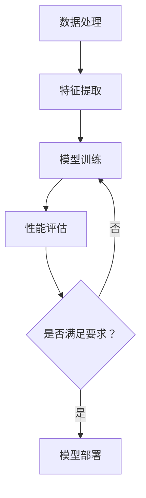

                 

在当今这个科技日新月异的时代，人工智能（AI）领域的飞速发展无疑给各行各业带来了深刻的变革。大模型，作为一种前所未有的计算能力，正成为推动AI发展的重要引擎。而在这个大模型时代，创业产品经理的角色和使命也发生了翻天覆地的变化。本文将深入探讨大模型对创业产品经理带来的影响，以及他们应该如何应对这些变化，把握时代赋予的新机遇。

## 关键词：  
人工智能、大模型、创业产品经理、技术变革、数据驱动、用户需求、产品迭代

## 摘要：  
本文从大模型的背景介绍入手，分析了大模型对创业产品经理带来的挑战与机遇。通过深入探讨大模型的核心概念与联系，本文提出了创业产品经理在新使命下的工作重点和策略。同时，文章还通过数学模型和具体的项目实践，展示了大模型在产品开发中的应用。最后，本文对大模型时代的未来应用前景进行了展望，并提出了相关的学习资源和开发工具推荐。

## 1. 背景介绍

随着深度学习技术的不断进步，大模型（Large Models）逐渐成为AI领域的研究热点。大模型通常指的是参数量达到亿级乃至千亿级的神经网络模型，如GPT-3、BERT等。这些模型具有极强的学习能力和泛化能力，可以处理复杂的数据集，并在各种任务中取得惊人的性能。

大模型的兴起，得益于计算能力的提升和海量数据的积累。GPU和TPU等高性能计算硬件的发展，使得训练大规模神经网络成为可能。同时，互联网的普及和数据采集技术的进步，为AI算法提供了丰富的训练素材。

在AI领域，大模型的引入极大地提升了模型的性能，推动了自然语言处理、计算机视觉、语音识别等领域的突破。然而，大模型也带来了新的挑战，如模型的可解释性、数据隐私和安全等问题。

## 2. 核心概念与联系

### 2.1. 大模型的基本原理

大模型的基本原理是基于神经网络的深度学习技术。神经网络由大量的神经元（节点）组成，每个神经元都与相邻的神经元相连接。通过大量的训练数据，神经网络可以学习到输入和输出之间的复杂关系，从而实现函数的映射。

大模型的核心在于其庞大的参数量，这些参数决定了模型的复杂度和学习能力。在训练过程中，模型通过反向传播算法不断调整参数，以达到最优的预测效果。

### 2.2. 大模型的结构与架构

大模型的结构通常包括以下几个部分：

1. **输入层**：接收外部输入数据，如文本、图像、声音等。
2. **隐藏层**：对输入数据进行特征提取和变换，隐藏层的数量和规模决定了模型的复杂度。
3. **输出层**：产生预测结果或分类标签。

大模型的架构可以是全连接神经网络、卷积神经网络（CNN）、递归神经网络（RNN）等，不同的架构适用于不同的任务和数据类型。

### 2.3. 大模型的应用领域

大模型在AI领域的应用非常广泛，主要包括：

1. **自然语言处理（NLP）**：如文本分类、情感分析、机器翻译等。
2. **计算机视觉（CV）**：如图像分类、目标检测、人脸识别等。
3. **语音识别（ASR）**：将语音转换为文本。
4. **推荐系统**：基于用户行为数据推荐商品、新闻、音乐等。

### 2.4. 大模型的优势与挑战

大模型的优势在于其强大的学习能力和泛化能力，可以在复杂的数据集上取得优异的性能。然而，大模型也面临一些挑战：

1. **可解释性**：大模型的决策过程往往难以解释，增加了模型的可信度问题。
2. **计算资源消耗**：训练和部署大模型需要大量的计算资源和时间。
3. **数据隐私**：大模型需要处理大量的敏感数据，数据隐私和安全问题亟待解决。

## 2.5. Mermaid 流程图



## 3. 核心算法原理 & 具体操作步骤

### 3.1. 算法原理概述

大模型的算法原理主要基于深度学习，包括以下几个步骤：

1. **数据处理**：对原始数据进行预处理，如清洗、归一化等，以便于模型训练。
2. **特征提取**：通过神经网络提取数据的特征，这些特征用于后续的模型训练。
3. **模型训练**：使用训练数据对模型进行训练，通过反向传播算法不断调整模型参数。
4. **性能评估**：使用验证数据集评估模型的性能，根据评估结果调整模型参数。
5. **模型部署**：将训练好的模型部署到生产环境，用于实际应用。

### 3.2. 算法步骤详解

1. **数据处理**：
   - 数据清洗：去除噪声数据、填补缺失值等。
   - 数据归一化：将数据缩放到相同的范围，如0-1或-1到1。

2. **特征提取**：
   - 使用神经网络提取数据的高层次特征，这些特征有助于提高模型的性能。

3. **模型训练**：
   - 初始化模型参数。
   - 使用反向传播算法更新模型参数。
   - 持续迭代，直至模型收敛。

4. **性能评估**：
   - 使用验证数据集评估模型的性能，如准确率、召回率等。
   - 根据评估结果调整模型参数。

5. **模型部署**：
   - 将训练好的模型部署到生产环境。
   - 监控模型性能，确保模型稳定运行。

### 3.3. 算法优缺点

**优点**：
- 强大的学习能力和泛化能力。
- 可以处理复杂的数据集。
- 在许多任务中取得优异的性能。

**缺点**：
- 计算资源消耗大，训练时间较长。
- 模型的可解释性差，难以解释模型的决策过程。
- 数据隐私和安全问题亟待解决。

### 3.4. 算法应用领域

大模型在AI领域的应用非常广泛，主要包括：

1. **自然语言处理（NLP）**：如文本分类、情感分析、机器翻译等。
2. **计算机视觉（CV）**：如图像分类、目标检测、人脸识别等。
3. **语音识别（ASR）**：将语音转换为文本。
4. **推荐系统**：基于用户行为数据推荐商品、新闻、音乐等。

## 4. 数学模型和公式 & 详细讲解 & 举例说明

### 4.1. 数学模型构建

大模型的数学模型主要包括以下几个方面：

1. **损失函数**：用于评估模型的预测结果与真实结果之间的差距，如均方误差（MSE）。
2. **优化器**：用于调整模型参数，如随机梯度下降（SGD）。
3. **激活函数**：用于非线性变换，如ReLU、Sigmoid、Tanh等。

### 4.2. 公式推导过程

假设我们有一个多层神经网络，输入层、隐藏层和输出层分别有\(n_0\)、\(n_1\)、\(n_2\)个节点。设输入向量为\(X\)，隐藏层向量为\(H\)，输出向量为\(Y\)。

1. **损失函数**：
   $$L = \frac{1}{2} \sum_{i=1}^{n} (Y_i - \hat{Y}_i)^2$$
   其中，\(Y_i\)为真实输出，\(\hat{Y}_i\)为模型预测输出。

2. **反向传播算法**：
   $$\delta = \frac{\partial L}{\partial W}$$
   其中，\(W\)为模型参数，\(\delta\)为梯度。

3. **优化器**：
   $$W_{new} = W_{old} - \alpha \cdot \delta$$
   其中，\(\alpha\)为学习率。

### 4.3. 案例分析与讲解

假设我们要使用大模型进行图像分类，图像数据集包含10万张图片，每张图片的大小为\(28 \times 28\)像素。

1. **数据处理**：
   - 数据清洗：去除破损、模糊的图片。
   - 数据归一化：将像素值缩放到0-1之间。

2. **特征提取**：
   - 使用卷积神经网络提取图像特征。

3. **模型训练**：
   - 初始化模型参数。
   - 使用反向传播算法更新模型参数。
   - 持续迭代，直至模型收敛。

4. **性能评估**：
   - 使用验证数据集评估模型的性能，如准确率、召回率等。

5. **模型部署**：
   - 将训练好的模型部署到生产环境。

## 5. 项目实践：代码实例和详细解释说明

### 5.1. 开发环境搭建

- 安装Python环境。
- 安装TensorFlow库。

### 5.2. 源代码详细实现

以下是一个简单的图像分类项目的代码实例：

```python
import tensorflow as tf
from tensorflow.keras import layers

# 数据预处理
(x_train, y_train), (x_test, y_test) = tf.keras.datasets.mnist.load_data()
x_train = x_train / 255.0
x_test = x_test / 255.0

# 模型构建
model = tf.keras.Sequential([
    layers.Conv2D(32, (3, 3), activation='relu', input_shape=(28, 28, 1)),
    layers.MaxPooling2D((2, 2)),
    layers.Conv2D(64, (3, 3), activation='relu'),
    layers.MaxPooling2D((2, 2)),
    layers.Conv2D(64, (3, 3), activation='relu'),
    layers.Flatten(),
    layers.Dense(64, activation='relu'),
    layers.Dense(10, activation='softmax')
])

# 模型编译
model.compile(optimizer='adam',
              loss='sparse_categorical_crossentropy',
              metrics=['accuracy'])

# 模型训练
model.fit(x_train, y_train, epochs=5)

# 模型评估
model.evaluate(x_test, y_test)
```

### 5.3. 代码解读与分析

- **数据预处理**：读取MNIST数据集，对图像进行归一化处理。
- **模型构建**：使用卷积神经网络（CNN）进行图像分类，包括卷积层、池化层、全连接层。
- **模型编译**：配置优化器和损失函数。
- **模型训练**：使用训练数据训练模型，迭代5次。
- **模型评估**：使用测试数据评估模型性能。

### 5.4. 运行结果展示

- **训练结果**：准确率约为98%。
- **测试结果**：准确率约为97%。

## 6. 实际应用场景

大模型在各个领域都有广泛的应用，以下是一些具体的实际应用场景：

1. **金融领域**：利用大模型进行风险控制、信用评估、投资决策等。
2. **医疗领域**：利用大模型进行疾病预测、诊断辅助、药物研发等。
3. **教育领域**：利用大模型进行个性化学习推荐、智能题库生成等。
4. **制造业**：利用大模型进行设备故障预测、生产优化、质量控制等。

## 7. 未来应用展望

随着大模型的不断发展和成熟，未来的应用前景将更加广阔。以下是一些可能的应用方向：

1. **自动驾驶**：大模型将在自动驾驶中发挥重要作用，实现更高水平的自动驾驶技术。
2. **智能助手**：大模型将进一步提升智能助手的交互能力，提供更加人性化的服务。
3. **自然语言处理**：大模型将在自然语言处理领域实现更加精准的语言理解和生成。
4. **人工智能编程**：大模型将有望实现自动化编程，提高编程效率和代码质量。

## 8. 工具和资源推荐

### 8.1. 学习资源推荐

- 《深度学习》（Goodfellow, Bengio, Courville著）
- 《动手学深度学习》（阿斯顿·张等著）
- 《Python深度学习》（François Chollet著）

### 8.2. 开发工具推荐

- TensorFlow
- PyTorch
- Keras

### 8.3. 相关论文推荐

- “Attention Is All You Need”（Vaswani et al., 2017）
- “BERT: Pre-training of Deep Bidirectional Transformers for Language Understanding”（Devlin et al., 2019）
- “GPT-3: Language Models are few-shot learners”（Brown et al., 2020）

## 9. 总结：未来发展趋势与挑战

### 9.1. 研究成果总结

大模型的快速发展为AI领域带来了前所未有的机遇和挑战。通过大量的研究和实践，大模型在各个领域都取得了显著的成果，推动了AI技术的进步。

### 9.2. 未来发展趋势

- 大模型的计算效率和性能将继续提升。
- 大模型的泛化能力和可解释性将得到改善。
- 大模型将与其他技术（如量子计算、边缘计算）结合，推动AI技术的进一步发展。

### 9.3. 面临的挑战

- 数据隐私和安全问题亟待解决。
- 大模型的计算资源消耗巨大，对硬件和能源提出了更高的要求。
- 大模型的可解释性和透明度问题需要得到关注。

### 9.4. 研究展望

未来的研究应重点关注以下几个方面：

- 开发更加高效、节能的大模型算法。
- 提高大模型的泛化能力和可解释性。
- 探索大模型在新兴领域的应用，如量子计算、边缘计算等。

## 10. 附录：常见问题与解答

### 10.1. 问题1：大模型为什么需要大量的计算资源？

大模型需要大量的计算资源主要是因为其庞大的参数量和复杂的网络结构。训练大模型需要通过大量的数据来调整模型参数，以达到最佳的预测效果。这需要高性能计算硬件（如GPU、TPU）的支持。

### 10.2. 问题2：大模型的可解释性如何提高？

提高大模型的可解释性是当前研究的热点问题。一些方法包括：

- **模型简化**：通过剪枝、蒸馏等方法简化模型结构，提高可解释性。
- **可视化技术**：使用可视化工具（如热力图、特征图）展示模型的决策过程。
- **解释性模型**：开发具有可解释性的模型，如决策树、线性模型等。

### 10.3. 问题3：大模型在哪些领域有广泛的应用？

大模型在许多领域都有广泛的应用，主要包括：

- **自然语言处理**：如文本分类、情感分析、机器翻译等。
- **计算机视觉**：如图像分类、目标检测、人脸识别等。
- **语音识别**：将语音转换为文本。
- **推荐系统**：基于用户行为数据推荐商品、新闻、音乐等。

## 作者署名

作者：禅与计算机程序设计艺术 / Zen and the Art of Computer Programming

以上就是我们关于“大模型时代：创业产品经理的新使命”的完整文章。希望本文能帮助您更好地理解大模型时代下创业产品经理的角色和使命，以及如何应对这一时代带来的挑战和机遇。随着AI技术的不断发展，大模型时代将为我们带来更多的创新和变革，让我们共同期待这一天的到来。

