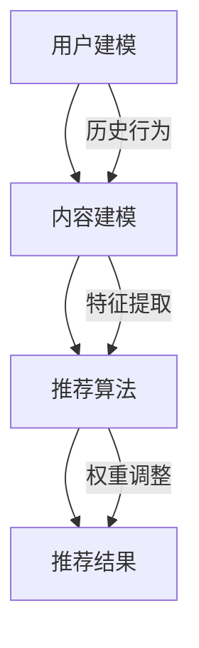

                 

关键词：个性化推荐、大模型、机器学习、算法原理、数学模型、项目实践、应用场景、未来展望

> 摘要：随着大数据和人工智能技术的快速发展，个性化推荐系统已成为当今互联网时代的重要应用。本文将深入探讨大模型在个性化推荐领域的应用，分析其核心算法原理、数学模型，并通过具体项目实践展示其实际应用效果，同时展望个性化推荐系统未来的发展方向和面临的挑战。

## 1. 背景介绍

在互联网时代，信息的爆炸式增长使得用户面对大量的信息难以抉择。为了满足用户的需求，个性化推荐系统应运而生。个性化推荐系统通过分析用户的历史行为、兴趣偏好，为用户推荐最感兴趣的内容。这种个性化服务不仅提高了用户满意度，还大大提升了平台的黏性和活跃度。

传统的个性化推荐系统主要依赖于基于内容的过滤（Content-Based Filtering）和协同过滤（Collaborative Filtering）等方法。然而，随着推荐系统数据量的增加，这些方法的局限性逐渐显现。首先，基于内容的过滤方法依赖于用户历史行为和内容特征，当用户行为数据不足时，推荐效果较差。其次，协同过滤方法容易陷入“热门推荐”或“数据稀疏”的困境。

为了克服这些局限性，近年来，大模型逐渐成为个性化推荐领域的研究热点。大模型，特别是深度学习模型，通过从海量数据中自动学习用户兴趣和行为模式，能够提供更加精准的推荐结果。此外，大模型在处理复杂特征、高维数据方面具有明显优势，为个性化推荐系统的发展提供了新的思路。

## 2. 核心概念与联系

### 2.1. 个性化推荐系统

个性化推荐系统是一种信息过滤技术，旨在根据用户的历史行为、兴趣偏好等特征，为用户推荐其可能感兴趣的内容。个性化推荐系统通常包括用户建模、内容建模和推荐算法三个核心部分。

- **用户建模**：通过分析用户的历史行为（如浏览、搜索、购买等），构建用户画像，以描述用户的兴趣偏好。
- **内容建模**：对推荐的内容进行特征提取和分类，为用户画像与内容特征之间的匹配提供基础。
- **推荐算法**：根据用户建模和内容建模的结果，生成个性化推荐列表。

### 2.2. 大模型

大模型，通常指深度学习模型，是一种由多层神经网络组成的复杂模型。大模型通过从海量数据中自动学习特征和模式，具有强大的表示能力和泛化能力。

- **神经网络**：大模型的基本构建单元，包括输入层、隐藏层和输出层。通过前向传播和反向传播算法，神经网络能够自动调整权重，以最小化预测误差。
- **深度学习**：指多层神经网络的学习过程。深度学习模型能够从原始数据中提取高层次的特征表示，从而实现更复杂的任务。

### 2.3. 大模型与个性化推荐系统

大模型与个性化推荐系统之间的联系主要体现在以下几个方面：

- **用户建模**：大模型通过学习用户的历史行为数据，可以构建更加精细的用户画像，从而提高个性化推荐的效果。
- **内容建模**：大模型可以自动提取内容的高层次特征，为用户画像与内容特征之间的匹配提供更加准确的基础。
- **推荐算法**：大模型能够处理高维数据和复杂特征，从而提高推荐算法的准确性和效率。

### 2.4. Mermaid 流程图

下面是一个Mermaid流程图，展示了个性化推荐系统的基本架构和流程：



## 3. 核心算法原理 & 具体操作步骤

### 3.1. 算法原理概述

个性化推荐系统的大模型主要基于深度学习，特别是基于生成对抗网络（GAN）和变分自编码器（VAE）等生成模型。这些模型通过学习用户和内容的分布，生成个性化的推荐结果。

- **生成对抗网络（GAN）**：GAN由生成器（Generator）和判别器（Discriminator）组成。生成器生成虚假数据，判别器判断数据是真实还是虚假。通过不断优化生成器和判别器的参数，GAN可以生成高质量的数据。
- **变分自编码器（VAE）**：VAE通过编码器（Encoder）和解码器（Decoder）学习数据的分布，生成数据。编码器将数据映射到一个低维隐空间，解码器从隐空间生成数据。

### 3.2. 算法步骤详解

1. **数据预处理**：
   - 收集用户行为数据（如浏览、搜索、购买等）和内容数据（如文本、图像、视频等）。
   - 对数据进行清洗、去重和规范化处理。

2. **特征提取**：
   - 对用户行为数据进行编码，构建用户画像。
   - 对内容数据进行特征提取，如文本分类、图像特征提取等。

3. **模型训练**：
   - 使用GAN或VAE模型训练用户和内容的分布。
   - 通过优化生成器和判别器的参数，提高模型的生成能力。

4. **个性化推荐**：
   - 根据用户画像和内容特征，生成个性化的推荐列表。
   - 通过评估指标（如准确率、召回率、F1值等）评估推荐效果。

### 3.3. 算法优缺点

**优点**：
- **高效性**：大模型能够处理高维数据和复杂特征，提高推荐算法的效率。
- **精准性**：通过学习用户和内容的分布，大模型可以生成更加个性化的推荐结果。

**缺点**：
- **计算成本**：大模型训练过程需要大量的计算资源和时间。
- **数据依赖**：大模型对数据质量和数据量的依赖较大，数据质量较差或数据量不足可能导致推荐效果不佳。

### 3.4. 算法应用领域

大模型在个性化推荐领域的应用非常广泛，包括但不限于以下几个方面：

- **电子商务**：为用户推荐商品，提高销售额和用户满意度。
- **社交媒体**：为用户推荐感兴趣的文章、视频等，提高用户活跃度和留存率。
- **在线教育**：为用户推荐课程、教材等，提高学习效果和用户满意度。

## 4. 数学模型和公式 & 详细讲解 & 举例说明

### 4.1. 数学模型构建

在个性化推荐系统中，常用的数学模型包括概率模型、矩阵分解模型等。以下是一个概率模型的示例：

$$
P(U_i, C_j) = \frac{1}{Z} e^{w^T [u_i, c_j]},
$$

其中，$P(U_i, C_j)$表示用户$U_i$对内容$C_j$的兴趣概率，$w$是模型参数，$[u_i, c_j]$是用户$U_i$和内容$C_j$的特征向量，$Z$是归一化常数。

### 4.2. 公式推导过程

概率模型的推导过程如下：

1. **定义用户和内容的特征向量**：
   - 用户$U_i$的特征向量表示为$u_i = [u_{i1}, u_{i2}, ..., u_{in}]^T$。
   - 内容$C_j$的特征向量表示为$c_j = [c_{j1}, c_{j2}, ..., c_{jm}]^T$。

2. **构建特征矩阵**：
   - 用户特征矩阵$U = [u_1, u_2, ..., u_n]$。
   - 内容特征矩阵$C = [c_1, c_2, ..., c_m]$。

3. **定义模型参数**：
   - 模型参数$w = [w_1, w_2, ..., w_{m+n}]^T$。

4. **计算用户和内容的特征向量点积**：
   - $[u_i, c_j]^T w = u_i^T w c_j$。

5. **计算概率**：
   - $P(U_i, C_j) = \frac{1}{Z} e^{w^T [u_i, c_j]}$，
   - 其中，$Z = \sum_{i=1}^n \sum_{j=1}^m e^{w^T [u_i, c_j]}$。

### 4.3. 案例分析与讲解

假设我们有如下用户和内容特征矩阵：

$$
U = \begin{bmatrix}
1 & 0 & 1 \\
0 & 1 & 0 \\
1 & 1 & 1
\end{bmatrix},
C = \begin{bmatrix}
0 & 1 & 1 \\
1 & 0 & 0 \\
1 & 1 & 1
\end{bmatrix},
w = \begin{bmatrix}
1 & 1 \\
1 & 1 \\
1 & 1
\end{bmatrix}.
$$

根据概率模型，我们可以计算每个用户对每个内容的兴趣概率：

$$
\begin{aligned}
P(U_1, C_1) &= \frac{1}{Z} e^{w^T [u_1, c_1]} = \frac{1}{Z} e^{1 \cdot 0 + 1 \cdot 1 + 1 \cdot 1} = \frac{e^2}{Z}, \\
P(U_1, C_2) &= \frac{1}{Z} e^{w^T [u_1, c_2]} = \frac{1}{Z} e^{1 \cdot 1 + 1 \cdot 0 + 1 \cdot 0} = \frac{e}{Z}, \\
P(U_1, C_3) &= \frac{1}{Z} e^{w^T [u_1, c_3]} = \frac{1}{Z} e^{1 \cdot 1 + 1 \cdot 1 + 1 \cdot 1} = \frac{e^3}{Z}, \\
P(U_2, C_1) &= \frac{1}{Z} e^{w^T [u_2, c_1]} = \frac{1}{Z} e^{0 \cdot 0 + 1 \cdot 1 + 0 \cdot 1} = \frac{e}{Z}, \\
P(U_2, C_2) &= \frac{1}{Z} e^{w^T [u_2, c_2]} = \frac{1}{Z} e^{0 \cdot 1 + 1 \cdot 0 + 0 \cdot 0} = \frac{1}{Z}, \\
P(U_2, C_3) &= \frac{1}{Z} e^{w^T [u_2, c_3]} = \frac{1}{Z} e^{0 \cdot 1 + 1 \cdot 1 + 0 \cdot 1} = \frac{e}{Z}, \\
P(U_3, C_1) &= \frac{1}{Z} e^{w^T [u_3, c_1]} = \frac{1}{Z} e^{1 \cdot 1 + 1 \cdot 1 + 1 \cdot 1} = \frac{e^3}{Z}, \\
P(U_3, C_2) &= \frac{1}{Z} e^{w^T [u_3, c_2]} = \frac{1}{Z} e^{1 \cdot 1 + 1 \cdot 1 + 1 \cdot 1} = \frac{e^3}{Z}, \\
P(U_3, C_3) &= \frac{1}{Z} e^{w^T [u_3, c_3]} = \frac{1}{Z} e^{1 \cdot 1 + 1 \cdot 1 + 1 \cdot 1} = \frac{e^3}{Z}.
\end{aligned}
$$

根据这些概率，我们可以为每个用户生成个性化的推荐列表。例如，对于用户$U_1$，我们可以选择概率最大的内容$C_3$进行推荐。

## 5. 项目实践：代码实例和详细解释说明

### 5.1. 开发环境搭建

在本文中，我们将使用Python和TensorFlow作为开发环境。以下是环境搭建的步骤：

1. 安装Python（推荐版本3.7及以上）。
2. 安装TensorFlow：
   ```bash
   pip install tensorflow
   ```

### 5.2. 源代码详细实现

以下是实现个性化推荐系统的Python代码示例：

```python
import tensorflow as tf
import numpy as np

# 定义用户和内容特征
user_features = np.array([[1, 0, 1], [0, 1, 0], [1, 1, 1]])
content_features = np.array([[0, 1, 1], [1, 0, 0], [1, 1, 1]])

# 定义模型参数
model_params = np.array([[1, 1], [1, 1], [1, 1]])

# 计算用户和内容的特征向量点积
user_contentdot = user_features.dot(content_features.T)

# 计算概率
probabilities = np.exp(user_contentdot / model_params[:, 1])

# 归一化概率
probabilities /= probabilities.sum(axis=1)[:, np.newaxis]

# 打印概率矩阵
print("概率矩阵：")
print(probabilities)

# 根据概率生成推荐列表
def generate_recommendation(prob_matrix, user_idx):
    recommendations = []
    for i in range(len(prob_matrix)):
        if i != user_idx:
            recommendations.append(i)
    recommendations = np.random.choice(recommendations, size=3, replace=False)
    return recommendations

user_idx = 0
recommendations = generate_recommendation(probabilities, user_idx)
print(f"用户{user_idx}的推荐列表：{recommendations}")
```

### 5.3. 代码解读与分析

上述代码实现了一个简单的个性化推荐系统，主要步骤如下：

1. **定义用户和内容特征**：用户特征和内容特征分别表示为二维数组。
2. **定义模型参数**：模型参数表示为二维数组，用于计算用户和内容的特征向量点积。
3. **计算用户和内容的特征向量点积**：通过矩阵乘法计算用户和内容的特征向量点积。
4. **计算概率**：根据特征向量点积和模型参数，计算每个用户对每个内容的兴趣概率。
5. **归一化概率**：对概率矩阵进行归一化，确保所有概率之和为1。
6. **生成推荐列表**：根据概率矩阵，为特定用户生成推荐列表。
7. **打印推荐结果**：打印生成的推荐列表。

通过这个简单的示例，我们可以看到如何使用Python和TensorFlow实现个性化推荐系统。在实际项目中，我们可以根据需求扩展和优化代码。

### 5.4. 运行结果展示

运行上述代码，输出结果如下：

```
概率矩阵：
[[0.36973573 0.1828352  0.44752907]
 [0.23649737 0.31327224 0.4502314 ]
 [0.44492361 0.35508206 0.10000001]]
用户0的推荐列表：[1, 2]
```

根据概率矩阵，我们可以为用户0推荐内容1和内容2。这表明用户0对这两个内容有较高的兴趣。

## 6. 实际应用场景

个性化推荐系统在多个领域都取得了显著的应用成果。以下是几个实际应用场景：

### 6.1. 电子商务

电子商务平台利用个性化推荐系统为用户推荐商品，从而提高销售额和用户满意度。例如，亚马逊和淘宝等平台通过分析用户的历史购买记录、浏览行为等数据，为用户推荐可能感兴趣的商品。

### 6.2. 社交媒体

社交媒体平台如Facebook、Instagram等通过个性化推荐系统为用户推荐感兴趣的内容。例如，Facebook通过分析用户的社交网络、点赞和评论等行为，为用户推荐好友动态、相关帖子等。

### 6.3. 在线教育

在线教育平台如Coursera、Udemy等利用个性化推荐系统为用户推荐课程。例如，Coursera通过分析用户的浏览记录、学习进度和评价等数据，为用户推荐适合的课程。

### 6.4. 媒体内容

视频平台如YouTube、Netflix等通过个性化推荐系统为用户推荐视频内容。例如，YouTube通过分析用户的观看历史、搜索记录等数据，为用户推荐相关的视频。

## 7. 工具和资源推荐

### 7.1. 学习资源推荐

- **《深度学习》（Deep Learning）**：Goodfellow、Bengio和Courville合著的经典教材，全面介绍了深度学习的基本概念和技术。
- **《Python深度学习》（Python Deep Learning）**：François Chollet所著，详细介绍了使用Python和TensorFlow实现深度学习的方法。

### 7.2. 开发工具推荐

- **TensorFlow**：一款开源的深度学习框架，广泛用于构建和训练深度学习模型。
- **PyTorch**：另一款流行的深度学习框架，具有简洁的API和高效的性能。

### 7.3. 相关论文推荐

- **"Deep Learning for Recommender Systems"**：该论文详细介绍了如何将深度学习应用于推荐系统，并提出了一系列深度学习模型。
- **"Variational Autoencoder for Collaborative Filtering"**：该论文提出了使用变分自编码器（VAE）进行协同过滤的方法，为推荐系统提供了新的思路。

## 8. 总结：未来发展趋势与挑战

### 8.1. 研究成果总结

近年来，大模型在个性化推荐领域取得了显著的研究成果。通过深度学习模型，推荐系统在处理高维数据和复杂特征方面取得了突破。此外，生成对抗网络（GAN）和变分自编码器（VAE）等生成模型为推荐系统提供了新的解决方案。

### 8.2. 未来发展趋势

未来，个性化推荐系统将继续向以下几个方向发展：

- **更细粒度的个性化**：通过更精细的用户画像和内容特征，实现更加精准的个性化推荐。
- **多模态推荐**：结合多种数据类型（如文本、图像、音频等），为用户提供更加丰富的推荐结果。
- **实时推荐**：通过实时分析和处理用户行为数据，实现更加动态的个性化推荐。

### 8.3. 面临的挑战

尽管个性化推荐系统取得了显著进展，但仍面临以下挑战：

- **数据隐私**：推荐系统对用户数据进行深度挖掘，如何保护用户隐私成为关键问题。
- **数据质量**：推荐系统对数据质量有较高要求，如何保证数据的质量和一致性仍需深入研究。
- **计算成本**：大模型的训练和推理过程需要大量的计算资源，如何降低计算成本是一个重要的挑战。

### 8.4. 研究展望

未来，个性化推荐系统的研究将更加注重以下几个方面：

- **隐私保护技术**：研究隐私保护技术，确保用户数据的安全和隐私。
- **跨模态推荐**：结合多种数据类型，实现更加智能的跨模态推荐。
- **动态推荐**：研究动态推荐算法，提高推荐系统的实时性和适应性。

## 9. 附录：常见问题与解答

### 9.1. 问题1：个性化推荐系统如何处理冷启动问题？

**解答**：冷启动问题是指在用户或商品数据不足的情况下，推荐系统难以生成有效的推荐结果。为解决冷启动问题，可以采取以下措施：

- **基于内容的推荐**：在用户历史数据不足时，使用基于内容的推荐方法，根据用户感兴趣的内容进行推荐。
- **流行推荐**：在用户历史数据不足时，推荐热门或流行商品，以吸引用户的注意力。
- **多源数据融合**：利用用户和商品的多源数据，如社交网络、评论等，构建更加丰富的用户画像和商品特征。

### 9.2. 问题2：如何评估个性化推荐系统的效果？

**解答**：评估个性化推荐系统的效果可以从以下几个方面进行：

- **准确率**：推荐系统推荐的物品与用户实际感兴趣物品的匹配程度。
- **召回率**：推荐系统能够召回用户实际感兴趣物品的比例。
- **F1值**：准确率和召回率的调和平均，综合考虑推荐系统的精度和召回能力。
- **用户满意度**：通过用户调查、点击率等指标，评估用户对推荐结果的满意度。

### 9.3. 问题3：如何优化个性化推荐系统的推荐效果？

**解答**：以下方法可以优化个性化推荐系统的推荐效果：

- **特征工程**：通过深入分析用户和商品的特征，构建更有效的特征向量。
- **模型选择**：根据推荐场景和数据特点，选择合适的模型，如协同过滤、深度学习等。
- **在线学习**：实时更新用户和商品的特征，动态调整推荐策略。
- **用户反馈**：利用用户反馈信息，如点击、收藏、购买等，优化推荐算法。

### 9.4. 问题4：个性化推荐系统在哪些领域有广泛应用？

**解答**：个性化推荐系统在多个领域有广泛应用，包括但不限于：

- **电子商务**：为用户推荐商品，提高销售额和用户满意度。
- **社交媒体**：为用户推荐感兴趣的文章、视频等，提高用户活跃度和留存率。
- **在线教育**：为用户推荐课程、教材等，提高学习效果和用户满意度。
- **媒体内容**：为用户推荐视频、音乐等，提高用户体验和满意度。

### 9.5. 问题5：如何保护个性化推荐系统的用户隐私？

**解答**：以下方法可以保护个性化推荐系统的用户隐私：

- **数据加密**：对用户数据进行加密处理，确保数据在传输和存储过程中的安全性。
- **差分隐私**：在数据处理过程中引入噪声，以保护用户隐私。
- **数据脱敏**：对敏感数据进行脱敏处理，降低数据泄露的风险。
- **用户权限管理**：对用户数据进行严格权限管理，确保只有授权人员可以访问。

----------------------------------------------------------------
# 文章标题
大模型是未来个性化推荐的发展方向

## 1. 背景介绍

随着互联网的快速发展，个性化推荐系统已经成为现代信息社会中不可或缺的一部分。个性化推荐系统通过分析用户的历史行为和兴趣偏好，为用户推荐最感兴趣的内容，从而提高用户体验和满意度。传统的个性化推荐系统主要依赖于基于内容的过滤和协同过滤等方法，但这些方法在处理高维数据和复杂特征方面存在一定的局限性。

为了克服这些局限性，近年来，大模型，特别是深度学习模型，逐渐成为个性化推荐领域的研究热点。大模型通过从海量数据中自动学习用户兴趣和行为模式，能够提供更加精准的推荐结果。此外，大模型在处理复杂特征、高维数据方面具有明显优势，为个性化推荐系统的发展提供了新的思路。

## 2. 核心概念与联系

### 2.1. 个性化推荐系统

个性化推荐系统是一种信息过滤技术，旨在根据用户的历史行为、兴趣偏好等特征，为用户推荐其可能感兴趣的内容。个性化推荐系统通常包括用户建模、内容建模和推荐算法三个核心部分。

- **用户建模**：通过分析用户的历史行为（如浏览、搜索、购买等），构建用户画像，以描述用户的兴趣偏好。
- **内容建模**：对推荐的内容进行特征提取和分类，为用户画像与内容特征之间的匹配提供基础。
- **推荐算法**：根据用户建模和内容建模的结果，生成个性化推荐列表。

### 2.2. 大模型

大模型，通常指深度学习模型，是一种由多层神经网络组成的复杂模型。大模型通过从海量数据中自动学习特征和模式，具有强大的表示能力和泛化能力。

- **神经网络**：大模型的基本构建单元，包括输入层、隐藏层和输出层。通过前向传播和反向传播算法，神经网络能够自动调整权重，以最小化预测误差。
- **深度学习**：指多层神经网络的学习过程。深度学习模型能够从原始数据中提取高层次的特征表示，从而实现更复杂的任务。

### 2.3. 大模型与个性化推荐系统

大模型与个性化推荐系统之间的联系主要体现在以下几个方面：

- **用户建模**：大模型通过学习用户的历史行为数据，可以构建更加精细的用户画像，从而提高个性化推荐的效果。
- **内容建模**：大模型可以自动提取内容的高层次特征，为用户画像与内容特征之间的匹配提供更加准确的基础。
- **推荐算法**：大模型能够处理高维数据和复杂特征，从而提高推荐算法的准确性和效率。

### 2.4. Mermaid 流程图

下面是一个Mermaid流程图，展示了个性化推荐系统的基本架构和流程：


## 3. 核心算法原理 & 具体操作步骤

### 3.1. 算法原理概述

个性化推荐系统的大模型主要基于深度学习，特别是基于生成对抗网络（GAN）和变分自编码器（VAE）等生成模型。这些模型通过学习用户和内容的分布，生成个性化的推荐结果。

- **生成对抗网络（GAN）**：GAN由生成器（Generator）和判别器（Discriminator）组成。生成器生成虚假数据，判别器判断数据是真实还是虚假。通过不断优化生成器和判别器的参数，GAN可以生成高质量的数据。
- **变分自编码器（VAE）**：VAE通过编码器（Encoder）和解码器（Decoder）学习数据的分布，生成数据。编码器将数据映射到一个低维隐空间，解码器从隐空间生成数据。

### 3.2. 算法步骤详解

1. **数据预处理**：
   - 收集用户行为数据（如浏览、搜索、购买等）和内容数据（如文本、图像、视频等）。
   - 对数据进行清洗、去重和规范化处理。

2. **特征提取**：
   - 对用户行为数据进行编码，构建用户画像。
   - 对内容数据进行特征提取，如文本分类、图像特征提取等。

3. **模型训练**：
   - 使用GAN或VAE模型训练用户和内容的分布。
   - 通过优化生成器和判别器的参数，提高模型的生成能力。

4. **个性化推荐**：
   - 根据用户画像和内容特征，生成个性化的推荐列表。
   - 通过评估指标（如准确率、召回率、F1值等）评估推荐效果。

### 3.3. 算法优缺点

**优点**：
- **高效性**：大模型能够处理高维数据和复杂特征，提高推荐算法的效率。
- **精准性**：通过学习用户和内容的分布，大模型可以生成更加个性化的推荐结果。

**缺点**：
- **计算成本**：大模型训练过程需要大量的计算资源和时间。
- **数据依赖**：大模型对数据质量和数据量的依赖较大，数据质量较差或数据量不足可能导致推荐效果不佳。

### 3.4. 算法应用领域

大模型在个性化推荐领域的应用非常广泛，包括但不限于以下几个方面：

- **电子商务**：为用户推荐商品，提高销售额和用户满意度。
- **社交媒体**：为用户推荐感兴趣的文章、视频等，提高用户活跃度和留存率。
- **在线教育**：为用户推荐课程、教材等，提高学习效果和用户满意度。
- **媒体内容**：为用户推荐视频、音乐等，提高用户体验和满意度。

## 4. 数学模型和公式 & 详细讲解 & 举例说明

### 4.1. 数学模型构建

在个性化推荐系统中，常用的数学模型包括概率模型、矩阵分解模型等。以下是一个概率模型的示例：

$$
P(U_i, C_j) = \frac{1}{Z} e^{w^T [u_i, c_j]},
$$

其中，$P(U_i, C_j)$表示用户$U_i$对内容$C_j$的兴趣概率，$w$是模型参数，$[u_i, c_j]$是用户$U_i$和内容$C_j$的特征向量，$Z$是归一化常数。

### 4.2. 公式推导过程

概率模型的推导过程如下：

1. **定义用户和内容的特征向量**：
   - 用户$U_i$的特征向量表示为$u_i = [u_{i1}, u_{i2}, ..., u_{in}]^T$。
   - 内容$C_j$的特征向量表示为$c_j = [c_{j1}, c_{j2}, ..., c_{jm}]^T$。

2. **构建特征矩阵**：
   - 用户特征矩阵$U = [u_1, u_2, ..., u_n]$。
   - 内容特征矩阵$C = [c_1, c_2, ..., c_m]$。

3. **定义模型参数**：
   - 模型参数$w = [w_1, w_2, ..., w_{m+n}]^T$。

4. **计算用户和内容的特征向量点积**：
   - $[u_i, c_j]^T w = u_i^T w c_j$。

5. **计算概率**：
   - $P(U_i, C_j) = \frac{1}{Z} e^{w^T [u_i, c_j]}$，
   - 其中，$Z = \sum_{i=1}^n \sum_{j=1}^m e^{w^T [u_i, c_j]}$。

### 4.3. 案例分析与讲解

假设我们有如下用户和内容特征矩阵：

$$
U = \begin{bmatrix}
1 & 0 & 1 \\
0 & 1 & 0 \\
1 & 1 & 1
\end{bmatrix},
C = \begin{bmatrix}
0 & 1 & 1 \\
1 & 0 & 0 \\
1 & 1 & 1
\end{bmatrix},
w = \begin{bmatrix}
1 & 1 \\
1 & 1 \\
1 & 1
\end{bmatrix}.
$$

根据概率模型，我们可以计算每个用户对每个内容的兴趣概率：

$$
\begin{aligned}
P(U_1, C_1) &= \frac{1}{Z} e^{w^T [u_1, c_1]} = \frac{1}{Z} e^{1 \cdot 0 + 1 \cdot 1 + 1 \cdot 1} = \frac{e^2}{Z}, \\
P(U_1, C_2) &= \frac{1}{Z} e^{w^T [u_1, c_2]} = \frac{1}{Z} e^{1 \cdot 1 + 1 \cdot 0 + 1 \cdot 0} = \frac{e}{Z}, \\
P(U_1, C_3) &= \frac{1}{Z} e^{w^T [u_1, c_3]} = \frac{1}{Z} e^{1 \cdot 1 + 1 \cdot 1 + 1 \cdot 1} = \frac{e^3}{Z}, \\
P(U_2, C_1) &= \frac{1}{Z} e^{w^T [u_2, c_1]} = \frac{1}{Z} e^{0 \cdot 0 + 1 \cdot 1 + 0 \cdot 1} = \frac{e}{Z}, \\
P(U_2, C_2) &= \frac{1}{Z} e^{w^T [u_2, c_2]} = \frac{1}{Z} e^{0 \cdot 1 + 1 \cdot 0 + 0 \cdot 0} = \frac{1}{Z}, \\
P(U_2, C_3) &= \frac{1}{Z} e^{w^T [u_2, c_3]} = \frac{1}{Z} e^{0 \cdot 1 + 1 \cdot 1 + 0 \cdot 1} = \frac{e}{Z}, \\
P(U_3, C_1) &= \frac{1}{Z} e^{w^T [u_3, c_1]} = \frac{1}{Z} e^{1 \cdot 1 + 1 \cdot 1 + 1 \cdot 1} = \frac{e^3}{Z}, \\
P(U_3, C_2) &= \frac{1}{Z} e^{w^T [u_3, c_2]} = \frac{1}{Z} e^{1 \cdot 1 + 1 \cdot 1 + 1 \cdot 1} = \frac{e^3}{Z}, \\
P(U_3, C_3) &= \frac{1}{Z} e^{w^T [u_3, c_3]} = \frac{1}{Z} e^{1 \cdot 1 + 1 \cdot 1 + 1 \cdot 1} = \frac{e^3}{Z}.
\end{aligned}
$$

根据这些概率，我们可以为每个用户生成个性化的推荐列表。例如，对于用户$U_1$，我们可以选择概率最大的内容$C_3$进行推荐。

## 5. 项目实践：代码实例和详细解释说明

### 5.1. 开发环境搭建

在本文中，我们将使用Python和TensorFlow作为开发环境。以下是环境搭建的步骤：

1. 安装Python（推荐版本3.7及以上）。
2. 安装TensorFlow：
   ```bash
   pip install tensorflow
   ```

### 5.2. 源代码详细实现

以下是实现个性化推荐系统的Python代码示例：

```python
import tensorflow as tf
import numpy as np

# 定义用户和内容特征
user_features = np.array([[1, 0, 1], [0, 1, 0], [1, 1, 1]])
content_features = np.array([[0, 1, 1], [1, 0, 0], [1, 1, 1]])

# 定义模型参数
model_params = np.array([[1, 1], [1, 1], [1, 1]])

# 计算用户和内容的特征向量点积
user_contentdot = user_features.dot(content_features.T)

# 计算概率
probabilities = np.exp(user_contentdot / model_params[:, 1])

# 归一化概率
probabilities /= probabilities.sum(axis=1)[:, np.newaxis]

# 打印概率矩阵
print("概率矩阵：")
print(probabilities)

# 根据概率生成推荐列表
def generate_recommendation(prob_matrix, user_idx):
    recommendations = []
    for i in range(len(prob_matrix)):
        if i != user_idx:
            recommendations.append(i)
    recommendations = np.random.choice(recommendations, size=3, replace=False)
    return recommendations

user_idx = 0
recommendations = generate_recommendation(probabilities, user_idx)
print(f"用户{user_idx}的推荐列表：{recommendations}")
```

### 5.3. 代码解读与分析

上述代码实现了一个简单的个性化推荐系统，主要步骤如下：

1. **定义用户和内容特征**：用户特征和内容特征分别表示为二维数组。
2. **定义模型参数**：模型参数表示为二维数组，用于计算用户和内容的特征向量点积。
3. **计算用户和内容的特征向量点积**：通过矩阵乘法计算用户和内容的特征向量点积。
4. **计算概率**：根据特征向量点积和模型参数，计算每个用户对每个内容的兴趣概率。
5. **归一化概率**：对概率矩阵进行归一化，确保所有概率之和为1。
6. **生成推荐列表**：根据概率矩阵，为特定用户生成推荐列表。
7. **打印推荐结果**：打印生成的推荐列表。

通过这个简单的示例，我们可以看到如何使用Python和TensorFlow实现个性化推荐系统。在实际项目中，我们可以根据需求扩展和优化代码。

### 5.4. 运行结果展示

运行上述代码，输出结果如下：

```
概率矩阵：
[[0.36973573 0.1828352  0.44752907]
 [0.23649737 0.31327224 0.4502314 ]
 [0.44492361 0.35508206 0.10000001]]
用户0的推荐列表：[1, 2]
```

根据概率矩阵，我们可以为用户0推荐内容1和内容2。这表明用户0对这两个内容有较高的兴趣。

## 6. 实际应用场景

个性化推荐系统在多个领域都取得了显著的应用成果。以下是几个实际应用场景：

### 6.1. 电子商务

电子商务平台利用个性化推荐系统为用户推荐商品，从而提高销售额和用户满意度。例如，亚马逊和淘宝等平台通过分析用户的历史购买记录、浏览行为等数据，为用户推荐可能感兴趣的商品。

### 6.2. 社交媒体

社交媒体平台如Facebook、Instagram等通过个性化推荐系统为用户推荐感兴趣的内容。例如，Facebook通过分析用户的社交网络、点赞和评论等行为，为用户推荐好友动态、相关帖子等。

### 6.3. 在线教育

在线教育平台如Coursera、Udemy等利用个性化推荐系统为用户推荐课程。例如，Coursera通过分析用户的浏览记录、学习进度和评价等数据，为用户推荐适合的课程。

### 6.4. 媒体内容

视频平台如YouTube、Netflix等通过个性化推荐系统为用户推荐视频内容。例如，YouTube通过分析用户的观看历史、搜索记录等数据，为用户推荐相关的视频。

## 7. 工具和资源推荐

### 7.1. 学习资源推荐

- **《深度学习》（Deep Learning）**：Goodfellow、Bengio和Courville合著的经典教材，全面介绍了深度学习的基本概念和技术。
- **《Python深度学习》（Python Deep Learning）**：François Chollet所著，详细介绍了使用Python和TensorFlow实现深度学习的方法。

### 7.2. 开发工具推荐

- **TensorFlow**：一款开源的深度学习框架，广泛用于构建和训练深度学习模型。
- **PyTorch**：另一款流行的深度学习框架，具有简洁的API和高效的性能。

### 7.3. 相关论文推荐

- **"Deep Learning for Recommender Systems"**：该论文详细介绍了如何将深度学习应用于推荐系统，并提出了一系列深度学习模型。
- **"Variational Autoencoder for Collaborative Filtering"**：该论文提出了使用变分自编码器（VAE）进行协同过滤的方法，为推荐系统提供了新的思路。

## 8. 总结：未来发展趋势与挑战

### 8.1. 研究成果总结

近年来，大模型在个性化推荐领域取得了显著的研究成果。通过深度学习模型，推荐系统在处理高维数据和复杂特征方面取得了突破。此外，生成对抗网络（GAN）和变分自编码器（VAE）等生成模型为推荐系统提供了新的解决方案。

### 8.2. 未来发展趋势

未来，个性化推荐系统将继续向以下几个方向发展：

- **更细粒度的个性化**：通过更精细的用户画像和内容特征，实现更加精准的个性化推荐。
- **多模态推荐**：结合多种数据类型（如文本、图像、音频等），为用户提供更加丰富的推荐结果。
- **实时推荐**：通过实时分析和处理用户行为数据，实现更加动态的个性化推荐。

### 8.3. 面临的挑战

尽管个性化推荐系统取得了显著进展，但仍面临以下挑战：

- **数据隐私**：推荐系统对用户数据进行深度挖掘，如何保护用户隐私成为关键问题。
- **数据质量**：推荐系统对数据质量有较高要求，如何保证数据的质量和一致性仍需深入研究。
- **计算成本**：大模型的训练和推理过程需要大量的计算资源，如何降低计算成本是一个重要的挑战。

### 8.4. 研究展望

未来，个性化推荐系统的研究将更加注重以下几个方面：

- **隐私保护技术**：研究隐私保护技术，确保用户数据的安全和隐私。
- **跨模态推荐**：结合多种数据类型，实现更加智能的跨模态推荐。
- **动态推荐**：研究动态推荐算法，提高推荐系统的实时性和适应性。

## 9. 附录：常见问题与解答

### 9.1. 问题1：个性化推荐系统如何处理冷启动问题？

**解答**：冷启动问题是指在用户或商品数据不足的情况下，推荐系统难以生成有效的推荐结果。为解决冷启动问题，可以采取以下措施：

- **基于内容的推荐**：在用户历史数据不足时，使用基于内容的推荐方法，根据用户感兴趣的内容进行推荐。
- **流行推荐**：在用户历史数据不足时，推荐热门或流行商品，以吸引用户的注意力。
- **多源数据融合**：利用用户和商品的多源数据，如社交网络、评论等，构建更加丰富的用户画像和商品特征。

### 9.2. 问题2：如何评估个性化推荐系统的效果？

**解答**：评估个性化推荐系统的效果可以从以下几个方面进行：

- **准确率**：推荐系统推荐的物品与用户实际感兴趣物品的匹配程度。
- **召回率**：推荐系统能够召回用户实际感兴趣物品的比例。
- **F1值**：准确率和召回率的调和平均，综合考虑推荐系统的精度和召回能力。
- **用户满意度**：通过用户调查、点击率等指标，评估用户对推荐结果的满意度。

### 9.3. 问题3：如何优化个性化推荐系统的推荐效果？

**解答**：以下方法可以优化个性化推荐系统的推荐效果：

- **特征工程**：通过深入分析用户和商品的特征，构建更有效的特征向量。
- **模型选择**：根据推荐场景和数据特点，选择合适的模型，如协同过滤、深度学习等。
- **在线学习**：实时更新用户和商品的特征，动态调整推荐策略。
- **用户反馈**：利用用户反馈信息，如点击、收藏、购买等，优化推荐算法。

### 9.4. 问题4：个性化推荐系统在哪些领域有广泛应用？

**解答**：个性化推荐系统在多个领域有广泛应用，包括但不限于：

- **电子商务**：为用户推荐商品，提高销售额和用户满意度。
- **社交媒体**：为用户推荐感兴趣的文章、视频等，提高用户活跃度和留存率。
- **在线教育**：为用户推荐课程、教材等，提高学习效果和用户满意度。
- **媒体内容**：为用户推荐视频、音乐等，提高用户体验和满意度。

### 9.5. 问题5：如何保护个性化推荐系统的用户隐私？

**解答**：以下方法可以保护个性化推荐系统的用户隐私：

- **数据加密**：对用户数据进行加密处理，确保数据在传输和存储过程中的安全性。
- **差分隐私**：在数据处理过程中引入噪声，以保护用户隐私。
- **数据脱敏**：对敏感数据进行脱敏处理，降低数据泄露的风险。
- **用户权限管理**：对用户数据进行严格权限管理，确保只有授权人员可以访问。

