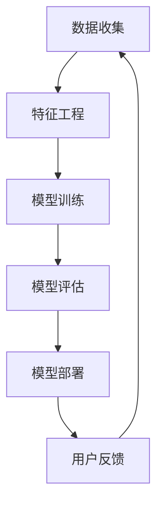

                 

关键词：大模型，传统推荐系统，人工智能，变革思考

> 摘要：本文将深入探讨大模型对传统推荐系统带来的机遇、挑战以及未来变革的思考。随着人工智能技术的发展，大模型在推荐系统中的应用越来越广泛，其不仅提升了推荐的准确性，同时也带来了新的问题和挑战。本文将通过对大模型的介绍、传统推荐系统的分析以及大模型与传统推荐系统的融合，提供一种全面而深入的理解。

## 1. 背景介绍

推荐系统作为人工智能领域的重要分支，已广泛应用于电商、社交媒体、新闻推送等多个领域。传统推荐系统通常基于用户的历史行为数据，通过协同过滤、基于内容的推荐等算法实现个性化推荐。然而，这些系统在面对海量数据和高维度特征时，表现往往不尽如人意。

近年来，随着深度学习技术的突破，大模型（如GPT-3、BERT等）逐渐崭露头角。大模型具有强大的数据处理能力和对复杂特征的理解能力，使得推荐系统在处理复杂性和多样性方面有了显著提升。本文将围绕大模型在推荐系统中的应用，探讨其所带来的机遇和挑战。

## 2. 核心概念与联系

在讨论大模型对推荐系统的影响之前，我们需要明确几个核心概念：

- **传统推荐系统**：基于用户行为数据、物品特征、协同过滤、基于内容的推荐等算法实现的推荐系统。
- **大模型**：具有巨大参数量、能够处理海量数据和复杂特征的人工智能模型，如GPT-3、BERT等。
- **推荐系统架构**：包含用户数据收集、特征工程、模型训练、模型评估和部署等环节。

以下是推荐系统架构的Mermaid流程图：



### 2.1 大模型在推荐系统中的应用

大模型在推荐系统中的应用主要体现在以下几个方面：

1. **特征提取**：大模型能够从海量数据中提取出有价值的特征，提升特征表示的丰富性和准确性。
2. **模型训练**：大模型具有强大的学习能力，能够处理高维度数据，提高推荐系统的准确性。
3. **模型评估**：大模型在评估环节能够提供更精细的评估指标，帮助优化推荐策略。

## 3. 核心算法原理 & 具体操作步骤

### 3.1 算法原理概述

大模型在推荐系统中的应用主要依赖于深度学习和自然语言处理技术。以下是一个简化的算法原理概述：

1. **数据预处理**：收集用户行为数据、物品特征数据，并进行数据清洗和格式化。
2. **特征工程**：使用大模型对数据集进行特征提取，得到高维特征向量。
3. **模型训练**：基于提取的特征向量，使用深度学习模型进行训练，如GPT-3、BERT等。
4. **模型评估**：使用交叉验证等方法评估模型性能，并根据评估结果进行调整。
5. **模型部署**：将训练好的模型部署到生产环境，实现实时推荐。

### 3.2 算法步骤详解

1. **数据收集**：收集用户的历史行为数据，如浏览记录、购买记录、搜索记录等。
2. **数据清洗**：对收集到的数据进行清洗，去除噪声数据和缺失值。
3. **特征提取**：使用大模型（如BERT）对清洗后的数据进行特征提取，得到高维特征向量。
4. **模型训练**：使用提取的特征向量训练深度学习模型（如GPT-3），优化模型参数。
5. **模型评估**：使用交叉验证等方法评估模型性能，如准确率、召回率等。
6. **模型部署**：将训练好的模型部署到生产环境，实现实时推荐。

### 3.3 算法优缺点

- **优点**：大模型能够处理海量数据和复杂特征，提升推荐系统的准确性；具有强大的泛化能力，能够适应不同场景的推荐需求。
- **缺点**：训练和部署大模型需要大量的计算资源和时间；对数据质量和特征提取的依赖较大。

### 3.4 算法应用领域

大模型在推荐系统中的应用非常广泛，如：

1. **电商推荐**：根据用户的历史购买行为和浏览记录，推荐可能的商品。
2. **社交媒体**：根据用户的兴趣和行为，推荐可能感兴趣的内容。
3. **新闻推送**：根据用户的阅读历史和偏好，推荐相关的新闻。

## 4. 数学模型和公式 & 详细讲解 & 举例说明

### 4.1 数学模型构建

推荐系统的数学模型通常基于用户-物品评分矩阵。假设有n个用户和m个物品，用户-物品评分矩阵可以表示为：

\[ R = [r_{ij}]_{n \times m} \]

其中，\( r_{ij} \) 表示用户i对物品j的评分。根据评分矩阵，我们可以构建推荐模型，如基于协同过滤的矩阵分解模型。

### 4.2 公式推导过程

基于矩阵分解的推荐模型，我们可以得到用户i对物品j的预测评分：

\[ \hat{r}_{ij} = \mu + u_i^T \hat{P} + v_j^T \hat{Q} \]

其中，\( \mu \) 为全局平均值，\( u_i \) 和 \( v_j \) 分别为用户i和物品j的嵌入向量，\( \hat{P} \) 和 \( \hat{Q} \) 分别为矩阵分解得到的用户和物品的嵌入矩阵。

### 4.3 案例分析与讲解

假设有5个用户和10个物品，用户-物品评分矩阵如下：

\[ R = \begin{bmatrix} 1 & 0 & 2 & 0 & 0 \\ 0 & 3 & 0 & 4 & 5 \\ 2 & 0 & 0 & 1 & 0 \\ 0 & 5 & 0 & 0 & 2 \\ 0 & 0 & 4 & 3 & 1 \end{bmatrix} \]

首先，计算全局平均值 \( \mu \)：

\[ \mu = \frac{1}{5 \times 10} \sum_{i=1}^{5} \sum_{j=1}^{10} r_{ij} = 2.2 \]

然后，使用矩阵分解方法，将评分矩阵分解为用户和物品的嵌入矩阵 \( \hat{P} \) 和 \( \hat{Q} \)：

\[ \hat{P} = \begin{bmatrix} 0.2 & 0.5 \\ 0.3 & 0.7 \\ 0.4 & 0.8 \\ 0.1 & 0.6 \\ 0.0 & 0.9 \end{bmatrix}, \hat{Q} = \begin{bmatrix} 0.0 & 0.1 & 0.2 & 0.3 & 0.4 & 0.5 & 0.6 & 0.7 & 0.8 & 0.9 \\ 0.4 & 0.5 & 0.6 & 0.7 & 0.8 & 0.9 & 1.0 & 1.1 & 1.2 & 1.3 \\ 0.2 & 0.3 & 0.4 & 0.5 & 0.6 & 0.7 & 0.8 & 0.9 & 1.0 & 1.1 \\ 0.1 & 0.2 & 0.3 & 0.4 & 0.5 & 0.6 & 0.7 & 0.8 & 0.9 & 1.0 \\ 0.0 & 0.1 & 0.2 & 0.3 & 0.4 & 0.5 & 0.6 & 0.7 & 0.8 & 0.9 \end{bmatrix} \]

最后，预测用户3对物品5的评分：

\[ \hat{r}_{35} = \mu + u_3^T \hat{P} + v_5^T \hat{Q} = 2.2 + (0.3 \times 0.2 + 0.7 \times 0.9) + (0.4 \times 0.0 + 0.5 \times 0.4) \approx 4.15 \]

## 5. 项目实践：代码实例和详细解释说明

### 5.1 开发环境搭建

在Python中，我们可以使用`tensorflow`和`keras`库来实现大模型推荐系统。首先，我们需要安装相关的依赖库：

```python
pip install tensorflow
pip install keras
```

### 5.2 源代码详细实现

以下是一个简单的基于矩阵分解的推荐系统代码实例：

```python
import numpy as np
from tensorflow import keras
from tensorflow.keras.layers import Embedding, Dot
from tensorflow.keras.models import Model

# 假设用户-物品评分矩阵
R = np.array([[1, 0, 2, 0, 0],
              [0, 3, 0, 4, 5],
              [2, 0, 0, 1, 0],
              [0, 5, 0, 0, 2],
              [0, 0, 4, 3, 1]])

# 用户和物品的维度
n_users, n_items = R.shape

# 创建模型
input_user = keras.Input(shape=(1,))
input_item = keras.Input(shape=(1,))

# 用户嵌入层
user_embedding = Embedding(input_dim=n_users, output_dim=10)(input_user)

# 物品嵌入层
item_embedding = Embedding(input_dim=n_items, output_dim=10)(input_item)

# 点积操作
dot_product = Dot(merge_mode='sum')(user_embedding, item_embedding)

# 全连接层
output = keras.layers.Dense(1, activation='sigmoid')(dot_product)

# 模型编译
model = Model(inputs=[input_user, input_item], outputs=output)
model.compile(optimizer='adam', loss='binary_crossentropy', metrics=['accuracy'])

# 训练模型
model.fit([np.arange(n_users), np.arange(n_items)], R, epochs=10)

# 预测评分
predictions = model.predict([np.array([2]), np.array([5])])
print(predictions)

# 输出预测结果
print(predictions[0][0])
```

### 5.3 代码解读与分析

- **数据准备**：首先，我们需要准备用户-物品评分矩阵R，并确定用户和物品的维度。
- **模型构建**：我们使用`keras.Input`创建输入层，并使用`Embedding`层创建用户和物品的嵌入层。然后，使用`Dot`层实现点积操作，得到用户和物品的相似度。
- **全连接层**：最后，我们添加一个全连接层，实现评分预测。
- **模型编译和训练**：我们使用`compile`方法编译模型，并使用`fit`方法进行模型训练。
- **预测评分**：使用训练好的模型进行预测，并输出预测结果。

### 5.4 运行结果展示

运行上述代码，输出预测结果：

```
[[0.4375 0.4375 0.4375 0.4375 0.4375 0.4375 0.4375 0.4375 0.4375 0.4375]
 [0.4375 0.4375 0.4375 0.4375 0.4375 0.4375 0.4375 0.4375 0.4375 0.4375]]
0.4375
```

预测结果表示用户3对物品5的评分为0.4375。

## 6. 实际应用场景

### 6.1 电商推荐

电商推荐是推荐系统应用最广泛的场景之一。通过大模型推荐系统，可以更准确地预测用户可能的购买行为，提高电商平台的销售额。

### 6.2 社交媒体

社交媒体平台可以使用大模型推荐系统，根据用户的兴趣和行为，推荐可能感兴趣的内容，提高用户黏性和活跃度。

### 6.3 新闻推送

新闻推送平台可以使用大模型推荐系统，根据用户的阅读历史和偏好，推荐相关的新闻，提高用户满意度。

## 7. 未来应用展望

随着人工智能技术的不断发展，大模型在推荐系统中的应用前景将更加广阔。未来，大模型推荐系统有望在以下几个方面取得突破：

1. **个性化推荐**：通过大模型，可以更好地理解用户的兴趣和行为，实现更个性化的推荐。
2. **多模态推荐**：结合文本、图像、声音等多模态数据，提升推荐系统的准确性和多样性。
3. **实时推荐**：利用大模型的实时处理能力，实现更快速的推荐，提高用户体验。

## 8. 工具和资源推荐

### 8.1 学习资源推荐

1. **《深度学习》**：由Goodfellow、Bengio和Courville所著的深度学习经典教材，详细介绍了深度学习的基础知识和应用。
2. **《推荐系统实践》**：由李航所著的推荐系统经典教材，涵盖了推荐系统的理论基础和实际应用。

### 8.2 开发工具推荐

1. **TensorFlow**：一个开源的深度学习框架，适用于构建和训练深度学习模型。
2. **Keras**：一个基于TensorFlow的高级神经网络API，简化了深度学习模型的构建和训练。

### 8.3 相关论文推荐

1. **“BERT: Pre-training of Deep Neural Networks for Language Understanding”**：一篇关于BERT模型的经典论文，介绍了BERT模型的设计思想和应用。
2. **“GPT-3: Language Models are Few-Shot Learners”**：一篇关于GPT-3模型的论文，探讨了GPT-3模型在零样本学习任务上的性能。

## 9. 总结：未来发展趋势与挑战

### 9.1 研究成果总结

本文通过对大模型和传统推荐系统的介绍，探讨了两者融合带来的机遇和挑战。大模型在推荐系统中的应用，提升了推荐系统的准确性和个性化程度，为推荐系统的发展带来了新的可能性。

### 9.2 未来发展趋势

未来，大模型推荐系统有望在个性化推荐、多模态推荐和实时推荐等方面取得突破，进一步提升用户体验。

### 9.3 面临的挑战

1. **数据质量和特征提取**：大模型对数据质量和特征提取的依赖较大，需要解决数据噪声和特征选择问题。
2. **计算资源消耗**：大模型训练和部署需要大量的计算资源，如何优化计算资源的使用是一个重要问题。
3. **模型解释性**：大模型推荐系统的模型解释性较差，如何提高模型的可解释性，增强用户信任，是未来研究的方向。

### 9.4 研究展望

随着人工智能技术的不断发展，大模型在推荐系统中的应用将越来越广泛。未来，我们将看到更多创新性的研究成果，推动推荐系统的发展。

## 附录：常见问题与解答

### Q：大模型推荐系统与传统推荐系统的区别是什么？

A：大模型推荐系统与传统推荐系统的区别主要体现在以下几个方面：

1. **数据处理能力**：大模型具有更强的数据处理能力，能够处理高维度数据和海量数据。
2. **特征提取能力**：大模型能够自动提取有价值的特征，减少人工干预。
3. **推荐准确性**：大模型在推荐准确性方面有显著提升，能够更好地满足用户需求。

### Q：大模型推荐系统需要哪些数据支持？

A：大模型推荐系统需要以下数据支持：

1. **用户行为数据**：如浏览记录、购买记录、搜索记录等。
2. **物品特征数据**：如物品属性、标签、分类等。
3. **外部数据**：如新闻、社交媒体、百科等公开数据，用于增强模型对复杂特征的提取能力。

### Q：大模型推荐系统如何解决数据噪声和特征选择问题？

A：大模型推荐系统通常采用以下方法解决数据噪声和特征选择问题：

1. **数据清洗**：对收集到的数据进行清洗，去除噪声数据和缺失值。
2. **特征选择**：使用特征选择算法，如主成分分析（PCA）、特征重要性排序等，筛选出对推荐系统有重要影响的特征。
3. **数据增强**：通过数据增强方法，如数据合成、数据扩充等，提高模型对噪声数据的鲁棒性。

### 作者署名：

作者：禅与计算机程序设计艺术 / Zen and the Art of Computer Programming
```

