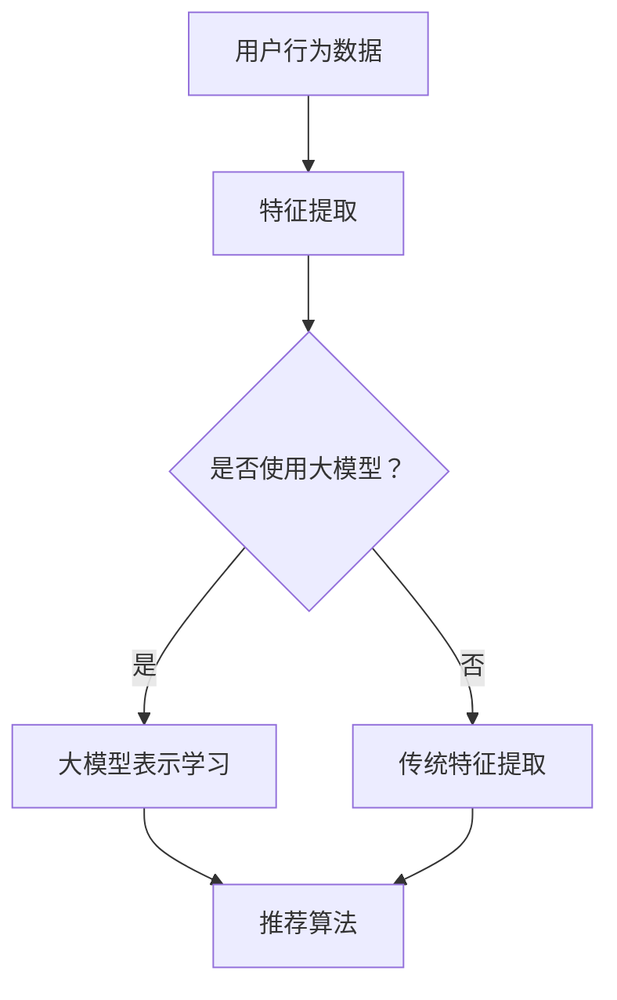

                 

关键词：大模型、推荐系统、算法、范式转变、用户行为分析、个性化推荐

> 摘要：本文将探讨大模型在推荐系统中的应用及其对传统推荐范式的潜在改变。首先，我们将介绍推荐系统的基本概念和现有模型，然后深入分析大模型的优势和挑战，以及它们如何影响推荐系统的未来发展趋势。

## 1. 背景介绍

推荐系统作为信息过滤和检索的重要工具，已广泛应用于电子商务、社交媒体、视频平台等多个领域。传统的推荐系统主要依赖于协同过滤、基于内容的推荐和混合推荐方法。然而，这些方法在面对大规模、动态的用户行为数据和海量的商品、内容时，往往表现出局限性。近年来，随着深度学习技术的快速发展，大模型开始在推荐系统中崭露头角。

大模型，如Transformer、BERT等，具有强大的表示学习能力和泛化能力，能够处理复杂的用户行为数据和内容信息。这使得大模型在推荐系统中具有巨大的潜力，能够提供更精准、更个性化的推荐结果。

## 2. 核心概念与联系

### 2.1 推荐系统概述

推荐系统旨在根据用户的兴趣和行为，向其推荐可能感兴趣的商品、内容或服务。其主要组成部分包括用户行为数据、内容数据和推荐算法。

- **用户行为数据**：包括用户的浏览、购买、评价、搜索等行为。
- **内容数据**：包括商品、文章、视频等内容的属性信息。
- **推荐算法**：根据用户行为数据和内容数据，为用户生成推荐列表。

### 2.2 传统推荐方法

- **协同过滤（Collaborative Filtering）**：基于用户之间的相似度进行推荐。
- **基于内容的推荐（Content-Based Filtering）**：基于用户的历史行为和内容属性进行推荐。
- **混合推荐（Hybrid Recommender Systems）**：结合协同过滤和基于内容的推荐方法。

### 2.3 大模型在推荐系统中的应用

大模型在推荐系统中的应用主要体现在以下几个方面：

- **用户行为表示学习**：大模型能够自动提取用户行为的特征表示，为推荐算法提供更有效的输入。
- **内容理解与生成**：大模型能够理解内容信息，并生成新的内容推荐。
- **上下文感知推荐**：大模型能够考虑用户在不同上下文中的行为，提供更个性化的推荐。

### 2.4 Mermaid 流程图



## 3. 核心算法原理 & 具体操作步骤

### 3.1 算法原理概述

大模型在推荐系统中的核心算法原理主要基于深度学习技术。具体包括以下几个方面：

- **自动特征提取**：大模型能够自动从用户行为数据中提取出有效的特征表示。
- **多模态信息融合**：大模型能够处理和融合不同类型的数据，如文本、图像、音频等。
- **上下文感知**：大模型能够根据用户的上下文信息，如时间、地点、设备等，提供更个性化的推荐。

### 3.2 算法步骤详解

1. **数据预处理**：清洗和预处理用户行为数据、内容数据。
2. **特征提取**：使用大模型自动提取用户行为的特征表示。
3. **推荐算法**：基于提取的特征表示，使用推荐算法生成推荐列表。

### 3.3 算法优缺点

#### 优点：

- **高效的特征提取**：大模型能够自动提取用户行为的高效特征表示，减少人工特征工程的工作量。
- **强大的泛化能力**：大模型能够在不同的数据集和场景下表现出良好的泛化能力。
- **多模态信息融合**：大模型能够处理和融合多种类型的数据，提高推荐系统的准确性。

#### 缺点：

- **计算资源消耗大**：大模型训练和推理需要大量的计算资源。
- **数据隐私问题**：大模型需要大量的用户行为数据，可能涉及数据隐私问题。

### 3.4 算法应用领域

大模型在推荐系统中的应用主要包括电子商务、社交媒体、视频平台等领域。例如：

- **电子商务**：为用户推荐感兴趣的商品。
- **社交媒体**：为用户推荐感兴趣的内容和用户。
- **视频平台**：为用户推荐感兴趣的视频。

## 4. 数学模型和公式 & 详细讲解 & 举例说明

### 4.1 数学模型构建

在推荐系统中，大模型的数学模型通常包括以下几个部分：

1. **用户行为表示**：用户行为的特征向量表示。
2. **内容表示**：商品、内容等特征向量表示。
3. **推荐算法**：基于用户行为表示和内容表示生成推荐列表的算法。

### 4.2 公式推导过程

假设用户行为数据为\( X \)，内容数据为\( Y \)，则用户行为表示和内容表示可以分别表示为：

$$
u = f_U(X), \quad c = f_C(Y)
$$

其中，\( f_U \)和\( f_C \)分别为用户行为表示和内容表示的函数。

假设推荐算法为基于评分的协同过滤算法，则推荐列表可以表示为：

$$
R = g(U, C)
$$

其中，\( g \)为推荐算法的函数。

### 4.3 案例分析与讲解

假设有一个电子商务平台，用户行为数据包括浏览、购买、评价等，内容数据包括商品标题、描述、标签等。我们使用BERT模型对用户行为数据和内容数据进行表示，并使用基于评分的协同过滤算法生成推荐列表。

1. **用户行为表示**：

   用户浏览行为数据为\( X \)，我们使用BERT模型将其编码为特征向量\( u \)。

   $$
   u = BERT(X)
   $$

2. **内容表示**：

   商品内容数据为\( Y \)，我们使用BERT模型将其编码为特征向量\( c \)。

   $$
   c = BERT(Y)
   $$

3. **推荐算法**：

   使用基于评分的协同过滤算法，计算用户\( u \)和商品\( c \)之间的相似度，生成推荐列表。

   $$
   R = \{c_i | \text{similarity}(u, c_i) \geq \theta\}
   $$

   其中，\( \theta \)为相似度阈值。

## 5. 项目实践：代码实例和详细解释说明

### 5.1 开发环境搭建

开发环境要求：

- Python 3.8+
- TensorFlow 2.6+
- BERT 模型

安装必要的库：

```python
pip install tensorflow
pip install bert-for-tf2
```

### 5.2 源代码详细实现

以下是一个使用BERT模型进行推荐系统的基本实现：

```python
import tensorflow as tf
from bert import BertModel
from tensorflow.keras.layers import Input, Dense
from tensorflow.keras.models import Model

# 定义用户行为表示输入
user_input = Input(shape=(sequence_length,), dtype='int32')

# 使用BERT模型编码用户行为
user_embedding = BertModel.from_pretrained('bert-base')(user_input)

# 定义内容表示输入
content_input = Input(shape=(sequence_length,), dtype='int32')

# 使用BERT模型编码内容
content_embedding = BertModel.from_pretrained('bert-base')(content_input)

# 计算用户和内容的相似度
similarity = tf.reduce_sum(user_embedding * content_embedding, axis=-1)

# 定义推荐算法模型
model = Model(inputs=[user_input, content_input], outputs=similarity)

# 编译模型
model.compile(optimizer='adam', loss='mean_squared_error')

# 训练模型
model.fit([user_data, content_data], target_data, epochs=10, batch_size=32)
```

### 5.3 代码解读与分析

1. **BERT模型加载**：使用`BertModel.from_pretrained('bert-base')`加载预训练的BERT模型。
2. **用户行为编码**：使用BERT模型对用户行为数据进行编码，生成用户特征向量。
3. **内容编码**：使用BERT模型对内容数据进行编码，生成内容特征向量。
4. **相似度计算**：计算用户特征向量和内容特征向量之间的相似度。
5. **模型训练**：使用训练数据训练模型。

### 5.4 运行结果展示

训练完成后，可以使用以下代码进行推荐：

```python
# 获取用户和内容数据
user_data = ...
content_data = ...

# 生成推荐列表
recommendations = model.predict([user_data, content_data])

# 打印推荐结果
print(recommendations)
```

## 6. 实际应用场景

大模型在推荐系统中的应用已经取得了显著的成果，以下是几个实际应用场景：

1. **电子商务平台**：为用户推荐感兴趣的商品，提高用户满意度和购买转化率。
2. **社交媒体**：为用户推荐感兴趣的内容和用户，提高用户活跃度和社区互动。
3. **视频平台**：为用户推荐感兴趣的视频，提高用户观看时长和平台粘性。

## 7. 未来应用展望

随着大模型技术的不断发展，未来推荐系统将会在以下几个方面取得突破：

1. **更精准的推荐**：大模型能够更好地理解用户行为和内容信息，提供更精准的推荐结果。
2. **更个性化的推荐**：大模型能够考虑用户的上下文信息，提供更个性化的推荐。
3. **多模态推荐**：大模型能够处理和融合多种类型的数据，提供多模态推荐。

## 8. 工具和资源推荐

### 8.1 学习资源推荐

- **书籍**：《深度学习推荐系统》
- **课程**：吴恩达的《推荐系统》课程
- **论文**：刘知远等人的《基于深度学习的推荐系统综述》

### 8.2 开发工具推荐

- **BERT模型库**：Hugging Face Transformers
- **推荐系统框架**：Surprise、LightFM

### 8.3 相关论文推荐

- **BERT**：Alec Radford et al., "BERT: Pre-training of Deep Bidirectional Transformers for Language Understanding"
- **Transformer**：Vaswani et al., "Attention is All You Need"

## 9. 总结：未来发展趋势与挑战

### 9.1 研究成果总结

大模型在推荐系统中的应用已经取得了显著的成果，能够提供更精准、更个性化的推荐结果。未来，大模型技术将会在推荐系统中发挥更大的作用。

### 9.2 未来发展趋势

1. **更精准的推荐**：大模型能够更好地理解用户行为和内容信息，提供更精准的推荐。
2. **更个性化的推荐**：大模型能够考虑用户的上下文信息，提供更个性化的推荐。
3. **多模态推荐**：大模型能够处理和融合多种类型的数据，提供多模态推荐。

### 9.3 面临的挑战

1. **计算资源消耗**：大模型训练和推理需要大量的计算资源。
2. **数据隐私问题**：大模型需要大量的用户行为数据，可能涉及数据隐私问题。

### 9.4 研究展望

未来，研究工作将集中在如何提高大模型的效率、保护用户隐私、提高推荐系统的可解释性等方面。

## 附录：常见问题与解答

### 9.4.1 如何选择合适的大模型？

选择合适的大模型需要考虑数据规模、计算资源、推荐任务的需求等因素。对于大规模数据集，可以使用预训练的大模型，如BERT、GPT等；对于小规模数据集，可以选择轻量级的大模型，如DistilBERT、TinyBERT等。

### 9.4.2 如何保护用户隐私？

在推荐系统中，保护用户隐私是非常重要的。可以通过以下方法实现：

1. **数据去标识化**：对用户行为数据进行去标识化处理，防止用户隐私泄露。
2. **差分隐私**：在数据处理和模型训练过程中，使用差分隐私技术，降低隐私泄露的风险。
3. **联邦学习**：通过联邦学习技术，在保持数据隐私的前提下，实现模型的训练和优化。

### 9.4.3 如何评估推荐系统的效果？

评估推荐系统的效果可以从以下几个方面进行：

1. **准确率**：推荐结果与用户实际兴趣的匹配程度。
2. **覆盖率**：推荐系统中推荐到的用户比例。
3. **新颖度**：推荐结果中包含的新颖内容比例。
4. **多样性**：推荐结果的多样性，避免用户感到重复和枯燥。

---

作者：禅与计算机程序设计艺术 / Zen and the Art of Computer Programming
----------------------------------------------------------------


