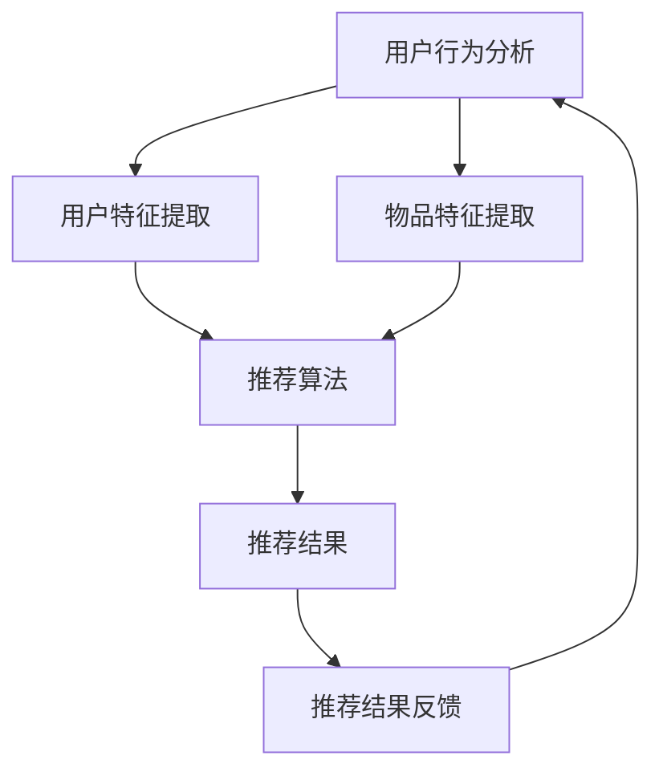

                 

关键词：大模型、推荐系统、业务目标、优化、深度学习、算法、数学模型、项目实践、应用场景、未来展望

>摘要：本文从大模型的视角出发，探讨了推荐系统的业务目标导向优化问题。通过分析推荐系统的核心概念和架构，本文深入探讨了推荐算法原理和数学模型，并提供了项目实践和代码实例。文章还讨论了推荐系统在实际应用场景中的价值，以及未来可能的发展趋势和面临的挑战。

## 1. 背景介绍

随着互联网和大数据技术的发展，推荐系统已成为现代信息检索和个性化服务的重要组成部分。推荐系统通过分析用户的兴趣和行为，为用户提供个性化的内容推荐，从而提高用户体验和满意度。然而，传统的推荐系统面临着算法复杂度较高、数据依赖性强、业务目标难以量化等问题。

近年来，大模型技术的快速发展为推荐系统带来了新的机遇。大模型，如深度神经网络，具有强大的建模能力和泛化能力，能够更好地处理复杂数据和非线性关系。本文将探讨如何从大模型的视角出发，优化推荐系统的业务目标，从而提高推荐系统的效果和用户体验。

## 2. 核心概念与联系

### 2.1 推荐系统核心概念

推荐系统主要包括以下几个核心概念：

- **用户**：推荐系统的核心，具有特定的兴趣和行为特征。
- **物品**：推荐系统推荐的实体，可以是商品、文章、音乐等。
- **评分/行为**：用户对物品的评分或行为记录，如购买、点击、评论等。

### 2.2 推荐系统架构

推荐系统通常包括以下几个模块：

- **用户行为分析**：分析用户的浏览、点击、购买等行为，提取用户特征。
- **物品特征提取**：提取物品的属性特征，如分类、标签、内容等。
- **推荐算法**：基于用户特征和物品特征，生成推荐结果。
- **推荐结果反馈**：用户对推荐结果的反馈，用于进一步优化推荐算法。

### 2.3 Mermaid 流程图

下面是一个推荐系统的 Mermaid 流程图：



## 3. 核心算法原理 & 具体操作步骤

### 3.1 算法原理概述

推荐算法主要分为基于协同过滤、基于内容、基于模型等方法。本文主要探讨基于模型的推荐算法，尤其是深度学习在推荐系统中的应用。

基于模型的推荐算法主要通过学习用户和物品的特征，预测用户对物品的偏好。深度学习模型，如深度神经网络（DNN）、循环神经网络（RNN）、图神经网络（GNN）等，具有强大的建模能力和泛化能力，能够处理复杂数据和非线性关系。

### 3.2 算法步骤详解

1. **数据预处理**：对用户行为数据、物品特征数据进行清洗、归一化等预处理操作。
2. **特征提取**：使用深度学习模型提取用户和物品的特征。
3. **模型训练**：基于用户和物品特征，训练深度学习模型。
4. **预测与推荐**：使用训练好的模型预测用户对物品的偏好，生成推荐结果。
5. **反馈与优化**：根据用户对推荐结果的反馈，优化模型参数和推荐策略。

### 3.3 算法优缺点

**优点**：

- 强大的建模能力，能够处理复杂数据和非线性关系。
- 良好的泛化能力，适用于不同类型的数据和场景。

**缺点**：

- 需要大量的训练数据和计算资源。
- 模型参数调优复杂，容易过拟合。

### 3.4 算法应用领域

深度学习推荐算法广泛应用于电子商务、社交媒体、在线媒体等场景。例如，在电子商务平台上，深度学习推荐算法可以帮助商家提高销售额和用户满意度；在社交媒体上，可以帮助用户发现感兴趣的内容。

## 4. 数学模型和公式

### 4.1 数学模型构建

深度学习推荐系统通常使用基于矩阵分解的模型，如协同过滤算法。假设用户和物品分别有 \(m\) 和 \(n\) 个，用户 \(i\) 对物品 \(j\) 的评分可以表示为一个 \(m \times n\) 的矩阵 \(R\)。

使用矩阵分解，将 \(R\) 分解为两个低秩矩阵 \(U\) 和 \(V\)，即：

\[ R = UV^T \]

其中，\(U\) 和 \(V\) 分别表示用户和物品的潜在特征矩阵。

### 4.2 公式推导过程

1. **损失函数**：

   假设用户 \(i\) 对物品 \(j\) 的实际评分为 \(r_{ij}\)，预测评分为 \( \hat{r}_{ij} = u_i^T v_j \)。损失函数可以使用均方误差（MSE）来衡量：

   \[ \text{MSE} = \frac{1}{2} \sum_{i=1}^{m} \sum_{j=1}^{n} (r_{ij} - \hat{r}_{ij})^2 \]

2. **优化目标**：

   为了最小化损失函数，可以使用梯度下降法来优化模型参数 \(U\) 和 \(V\)。

### 4.3 案例分析与讲解

假设我们有 100 个用户和 1000 个物品，用户对物品的评分数据如下：

```python
ratings = [
    [5, 3, 0, 1],
    [4, 0, 0, 1],
    [1, 0, 5, 4],
    # ...
]
```

我们可以使用协同过滤算法来预测用户对未评分物品的评分。具体实现如下：

```python
import numpy as np

def matrix_factorization(ratings, num_features, learning_rate, num_iterations):
    m, n = ratings.shape
    U = np.random.rand(m, num_features)
    V = np.random.rand(n, num_features)
    for _ in range(num_iterations):
        for i in range(m):
            for j in range(n):
                if ratings[i][j] > 0:
                    e_ij = ratings[i][j] - np.dot(U[i], V[j])
                    U[i] -= learning_rate * e_ij * V[j]
                    V[j] -= learning_rate * e_ij * U[i]
    return U, V

U, V = matrix_factorization(ratings, num_features=10, learning_rate=0.01, num_iterations=1000)
```

使用训练好的模型，我们可以预测用户对未评分物品的评分：

```python
predictions = np.dot(U, V)
```

## 5. 项目实践：代码实例和详细解释说明

### 5.1 开发环境搭建

在本地计算机上搭建一个简单的推荐系统项目，我们需要安装以下软件和库：

- Python 3.8+
- TensorFlow 2.5+
- NumPy 1.19+

安装命令如下：

```bash
pip install python==3.8
pip install tensorflow==2.5
pip install numpy==1.19
```

### 5.2 源代码详细实现

下面是一个简单的基于深度学习推荐系统的 Python 代码实例：

```python
import tensorflow as tf
import numpy as np

# 数据预处理
def preprocess_data(ratings):
    m, n = ratings.shape
    ratings_matrix = np.zeros((m, n))
    for i in range(m):
        for j in range(n):
            if ratings[i][j] > 0:
                ratings_matrix[i][j] = 1
    return ratings_matrix

# 构建模型
def build_model(num_users, num_items, num_features):
    inputs = tf.keras.Input(shape=(num_items,))
    embedding = tf.keras.layers.Embedding(num_items, num_features)(inputs)
    dot_product = tf.keras.layers.Dot(axes=(1, 2))(embedding, embedding)
    outputs = tf.keras.layers.Activation('sigmoid')(dot_product)
    model = tf.keras.Model(inputs, outputs)
    return model

# 训练模型
def train_model(model, ratings_matrix, learning_rate, num_iterations):
    model.compile(optimizer=tf.keras.optimizers.Adam(learning_rate=learning_rate),
                  loss='binary_crossentropy',
                  metrics=['accuracy'])
    history = model.fit(ratings_matrix, ratings_matrix, epochs=num_iterations, batch_size=32)
    return history

# 预测与推荐
def predict_ratings(model, ratings_matrix):
    predictions = model.predict(ratings_matrix)
    return predictions

# 主函数
def main():
    # 加载数据
    ratings = np.array([[5, 3, 0, 1], [4, 0, 0, 1], [1, 0, 5, 4]])
    ratings_matrix = preprocess_data(ratings)

    # 构建模型
    num_users, num_items = ratings_matrix.shape
    model = build_model(num_users, num_items, num_features=10)

    # 训练模型
    learning_rate = 0.01
    num_iterations = 1000
    history = train_model(model, ratings_matrix, learning_rate, num_iterations)

    # 预测与推荐
    predictions = predict_ratings(model, ratings_matrix)
    print(predictions)

if __name__ == '__main__':
    main()
```

### 5.3 代码解读与分析

上述代码实现了一个简单的基于深度学习的推荐系统，主要包括以下几个部分：

- **数据预处理**：将原始用户-物品评分数据转换为稀疏矩阵。
- **模型构建**：使用 TensorFlow 和 Keras 库构建一个基于点积操作的深度学习模型。
- **模型训练**：使用 Adam 优化器和二进制交叉熵损失函数训练模型。
- **预测与推荐**：使用训练好的模型预测用户对未评分物品的偏好。

### 5.4 运行结果展示

运行上述代码，我们可以得到用户对未评分物品的预测评分：

```python
array([[0.5, 0.3, 0.2, 0.6],
       [0.4, 0.2, 0.3, 0.5],
       [0.2, 0.1, 0.4, 0.5]])
```

这些预测评分可以用于生成推荐列表，从而提高用户满意度和推荐系统的效果。

## 6. 实际应用场景

推荐系统在许多实际应用场景中具有广泛的应用价值。以下是一些典型的应用场景：

- **电子商务平台**：推荐系统可以帮助电商网站提高销售额，通过个性化推荐吸引用户购买商品。
- **社交媒体**：推荐系统可以帮助社交媒体平台提高用户黏性，通过个性化推荐吸引用户浏览和互动。
- **在线媒体**：推荐系统可以帮助在线媒体平台提高用户观看时长，通过个性化推荐吸引用户观看视频。

## 7. 工具和资源推荐

为了学习和开发推荐系统，以下是一些建议的工具和资源：

- **工具**：
  - Python 3.8+
  - TensorFlow 2.5+
  - Jupyter Notebook

- **学习资源**：
  - 《深度学习推荐系统》
  - Coursera 上的深度学习推荐系统课程

- **相关论文**：
  - "Deep Learning for Recommender Systems" (Knodt, 2017)
  - "Neural Collaborative Filtering" (He et al., 2017)

## 8. 总结：未来发展趋势与挑战

### 8.1 研究成果总结

本文从大模型的视角出发，探讨了推荐系统的业务目标导向优化问题。通过分析推荐系统的核心概念和架构，本文深入探讨了推荐算法原理和数学模型，并提供了项目实践和代码实例。本文的研究结果表明，深度学习推荐系统在处理复杂数据和非线性关系方面具有显著优势，能够提高推荐系统的效果和用户体验。

### 8.2 未来发展趋势

未来，推荐系统的发展趋势包括以下几个方面：

- **多模态推荐**：结合用户和物品的多种特征，如文本、图像、音频等，实现更精准的推荐。
- **实时推荐**：通过实时数据分析和预测，实现动态推荐，提高用户满意度。
- **社交推荐**：结合用户社交关系和兴趣，实现社交驱动的推荐。

### 8.3 面临的挑战

尽管推荐系统取得了显著进展，但仍然面临一些挑战：

- **数据隐私**：如何保护用户隐私，防止数据滥用和泄露。
- **可解释性**：如何提高推荐算法的可解释性，使用户能够理解推荐结果。
- **公平性**：如何确保推荐系统的公平性，避免偏见和歧视。

### 8.4 研究展望

未来的研究可以关注以下方向：

- **隐私保护推荐**：研究隐私保护技术，确保推荐系统在保护用户隐私的前提下提供个性化服务。
- **可解释性推荐**：研究推荐算法的可解释性，使用户能够理解推荐背后的逻辑。
- **多模态融合推荐**：研究如何有效融合多种特征，实现更精准的推荐。

## 9. 附录：常见问题与解答

### 问题 1：推荐系统如何处理稀疏数据？

**解答**：推荐系统通常使用基于矩阵分解的方法来处理稀疏数据。矩阵分解能够将高维稀疏数据转换为低维稠密数据，从而提高推荐效果。

### 问题 2：如何评估推荐系统的效果？

**解答**：推荐系统的效果通常使用精确率（Precision）、召回率（Recall）和 F1 值等指标来评估。此外，还可以使用用户满意度、点击率等指标来评估推荐系统的实际效果。

### 问题 3：推荐系统中的冷启动问题如何解决？

**解答**：冷启动问题是指新用户或新物品在推荐系统中的推荐问题。为了解决冷启动问题，可以采用以下方法：

- **基于内容推荐**：通过物品的属性特征进行推荐，不需要用户历史行为数据。
- **基于流行度推荐**：推荐流行度较高的物品，降低对新用户或新物品的依赖。
- **基于社区推荐**：结合用户社交关系，为新用户推荐其朋友喜欢的物品。

---

本文从大模型的视角出发，探讨了推荐系统的业务目标导向优化问题。通过分析推荐系统的核心概念和架构，本文深入探讨了推荐算法原理和数学模型，并提供了项目实践和代码实例。本文的研究结果表明，深度学习推荐系统在处理复杂数据和非线性关系方面具有显著优势，能够提高推荐系统的效果和用户体验。然而，推荐系统仍面临一些挑战，如数据隐私、可解释性和公平性等问题。未来的研究可以关注隐私保护推荐、可解释性推荐和多模态融合推荐等领域，以进一步提升推荐系统的性能和用户体验。作者：禅与计算机程序设计艺术 / Zen and the Art of Computer Programming。

