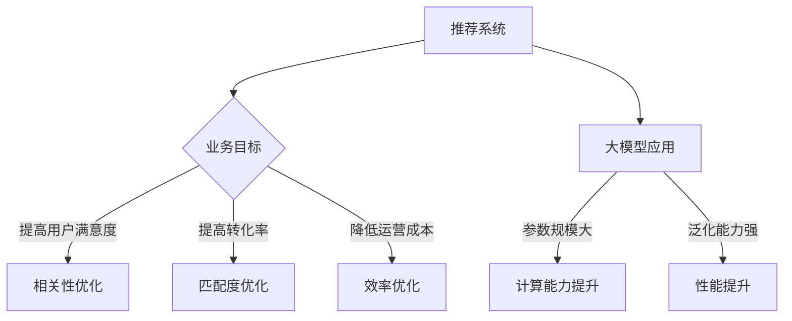

                 

关键词：推荐系统、大模型、业务目标、优化、算法、数学模型、应用实例、未来展望

>摘要：本文从大模型的视角出发，探讨了推荐系统在业务目标导向下的优化问题。首先介绍了推荐系统的基本概念和业务目标，然后分析了大模型在推荐系统中的应用及其优势。接着，详细阐述了推荐系统的核心算法原理和数学模型，并通过实际应用案例进行了深入讲解。最后，展望了推荐系统的未来发展趋势和面临的挑战。

## 1. 背景介绍

推荐系统是一种基于数据和算法的应用，通过分析用户的兴趣和行为，为用户推荐感兴趣的商品、信息或服务。在当今信息爆炸的时代，推荐系统已经成为各类互联网平台的重要功能，广泛应用于电子商务、社交媒体、新闻资讯等领域。

随着人工智能技术的发展，尤其是深度学习和大模型的广泛应用，推荐系统的性能和效果得到了显著提升。然而，传统推荐系统在处理大规模数据、实现个性化推荐等方面仍存在一定的局限性。因此，如何利用大模型优化推荐系统，成为当前研究的热点之一。

本文旨在从业务目标导向的角度，探讨大模型在推荐系统中的应用，并提出相应的优化策略。通过理论分析和实际案例，旨在为推荐系统的研究和应用提供有益的参考。

## 2. 核心概念与联系

### 2.1 推荐系统的基本概念

推荐系统（Recommender System）是一种利用机器学习和数据挖掘技术，为用户推荐其可能感兴趣的项目（如商品、新闻、音乐、电影等）的系统。其主要目标是通过分析用户的历史行为、偏好和反馈，提供个性化的推荐。

推荐系统的主要组成部分包括：

- 用户（User）：推荐系统的目标受众。
- 项目（Item）：用户可能感兴趣的各种项目，如商品、新闻文章、音乐曲目等。
- 历史行为数据（Behavior Data）：用户的历史行为记录，如购买、浏览、点击、评分等。
- 推荐算法（Recommender Algorithm）：用于生成推荐结果的核心算法。

### 2.2 大模型的定义与特点

大模型（Large Model）是指具有巨大参数规模、能够处理海量数据的深度神经网络模型。大模型的显著特点是：

- 参数规模大：大模型的参数数量可以达到亿级甚至千亿级。
- 计算能力强：大模型能够高效地处理大规模数据，实现复杂的特征提取和关系建模。
- 泛化能力强：大模型具有较好的泛化能力，能够在不同领域和任务中取得较好的性能。

### 2.3 推荐系统与业务目标的联系

推荐系统的业务目标主要包括：

- 提高用户满意度：通过提供个性化的推荐，满足用户的兴趣和需求，提高用户满意度。
- 提高转化率：通过推荐用户感兴趣的项目，提高用户的购买、浏览等行为。
- 降低运营成本：通过自动化推荐，减少人工干预，降低运营成本。

业务目标对推荐系统的设计和优化具有重要影响。例如，为了提高用户满意度，需要关注推荐的相关性和准确性；为了提高转化率，需要关注推荐的项目与用户兴趣的匹配度；为了降低运营成本，需要关注推荐系统的效率和稳定性。

### 2.4 Mermaid 流程图



## 3. 核心算法原理 & 具体操作步骤

### 3.1 算法原理概述

推荐系统的核心算法主要包括基于协同过滤（Collaborative Filtering）、基于内容推荐（Content-Based Filtering）和混合推荐（Hybrid Recommender）等。其中，基于协同过滤的算法是目前应用最广泛的推荐算法之一。

协同过滤算法的基本思想是通过分析用户之间的相似度，找到与目标用户相似的其他用户，然后根据这些相似用户的偏好来推荐项目。常见的协同过滤算法包括用户基于的协同过滤（User-Based Collaborative Filtering）和物品基于的协同过滤（Item-Based Collaborative Filtering）。

### 3.2 算法步骤详解

#### 3.2.1 用户基于的协同过滤

1. 构建用户相似度矩阵：计算所有用户之间的相似度，通常使用余弦相似度或皮尔逊相关系数等方法。
2. 筛选相似用户：根据相似度阈值筛选出与目标用户相似的用户。
3. 计算推荐分数：对于每个推荐项目，计算其与目标用户的相似用户群体的平均评分。
4. 排序和输出推荐结果：根据推荐分数对项目进行排序，输出推荐结果。

#### 3.2.2 物品基于的协同过滤

1. 构建项目相似度矩阵：计算所有项目之间的相似度，通常使用余弦相似度或Jaccard相似度等方法。
2. 筛选相似项目：根据相似度阈值筛选出与目标项目相似的其他项目。
3. 计算推荐分数：对于每个推荐项目，计算其与目标项目的相似项目群体的平均评分。
4. 排序和输出推荐结果：根据推荐分数对项目进行排序，输出推荐结果。

#### 3.2.3 混合推荐

混合推荐算法是将协同过滤算法与其他推荐算法（如基于内容的推荐算法）相结合，以弥补单一算法的不足。常见的混合推荐算法包括矩阵分解（Matrix Factorization）和模型融合（Model Fusion）等。

### 3.3 算法优缺点

#### 3.3.1 协同过滤算法

**优点：**
- 数据依赖性强：协同过滤算法能够充分利用用户的历史行为数据，实现个性化的推荐。
- 推荐效果较好：基于协同过滤的推荐算法在实际应用中取得了较好的效果。

**缺点：**
- 数据稀疏性：协同过滤算法在处理大规模数据时，容易受到数据稀疏性的影响。
- 可扩展性差：协同过滤算法的计算复杂度较高，难以处理海量数据。

#### 3.3.2 基于内容的推荐算法

**优点：**
- 数据依赖性弱：基于内容的推荐算法不受数据稀疏性的影响，能够处理大规模数据。
- 推荐效果稳定：基于内容的推荐算法能够提供稳定的推荐结果。

**缺点：**
- 个性化程度较低：基于内容的推荐算法难以捕捉用户的兴趣变化，个性化程度较低。

#### 3.3.3 混合推荐算法

**优点：**
- 结合多种算法优势：混合推荐算法能够结合协同过滤算法和基于内容的推荐算法的优势，提高推荐效果。
- 改善数据稀疏性和可扩展性：混合推荐算法能够有效缓解数据稀疏性和可扩展性问题。

**缺点：**
- 算法复杂度高：混合推荐算法需要同时处理多种算法，算法复杂度较高。

### 3.4 算法应用领域

推荐系统在多个领域都有广泛的应用，包括但不限于：

- 电子商务：通过推荐商品，提高用户购买意愿和转化率。
- 社交媒体：通过推荐用户可能感兴趣的内容，增加用户活跃度和粘性。
- 新闻资讯：通过推荐新闻文章，提高用户的阅读量和停留时间。
- 娱乐领域：通过推荐音乐、电影等，提高用户的娱乐体验。

## 4. 数学模型和公式 & 详细讲解 & 举例说明

### 4.1 数学模型构建

推荐系统的核心数学模型主要包括用户相似度计算、项目相似度计算和推荐分数计算等。

#### 4.1.1 用户相似度计算

用户相似度计算的基本公式为：

$$
sim(u_i, u_j) = \frac{\sum_{i \in I}{r_i u_i \cdot r_j u_j}}{\sqrt{\sum_{i \in I}{(r_i u_i)^2} \cdot \sum_{j \in I}{(r_j u_j)^2}}}
$$

其中，$r_i u_i$表示用户$i$对项目$i$的评分，$sim(u_i, u_j)$表示用户$i$和用户$j$之间的相似度。

#### 4.1.2 项目相似度计算

项目相似度计算的基本公式为：

$$
sim(i, j) = \frac{\sum_{u \in U}{r_u i \cdot r_u j}}{\sqrt{\sum_{u \in U}{(r_u i)^2} \cdot \sum_{u \in U}{(r_u j)^2}}}
$$

其中，$r_u i$表示用户$u$对项目$i$的评分，$sim(i, j)$表示项目$i$和项目$j$之间的相似度。

#### 4.1.3 推荐分数计算

推荐分数计算的基本公式为：

$$
score(u, i) = \sum_{j \in N(i)}{w_j \cdot sim(u, j) \cdot r_j}
$$

其中，$N(i)$表示与项目$i$相似的项目集合，$w_j$表示项目$j$的权重，$r_j$表示用户对项目$j$的评分，$score(u, i)$表示用户$u$对项目$i$的推荐分数。

### 4.2 公式推导过程

#### 4.2.1 用户相似度计算推导

用户相似度计算的基本思想是衡量两个用户在评分上的一致性。具体推导过程如下：

1. 计算用户$i$和用户$j$在所有项目上的评分积和：

$$
\sum_{i \in I}{r_i u_i \cdot r_j u_j}
$$

2. 计算用户$i$和用户$j$在所有项目上的评分平方和：

$$
\sum_{i \in I}{(r_i u_i)^2} \cdot \sum_{j \in I}{(r_j u_j)^2}
$$

3. 计算两个和的平方根：

$$
\sqrt{\sum_{i \in I}{(r_i u_i)^2} \cdot \sum_{j \in I}{(r_j u_j)^2}}
$$

4. 计算两个评分积和与两个评分平方和的比值：

$$
\frac{\sum_{i \in I}{r_i u_i \cdot r_j u_j}}{\sqrt{\sum_{i \in I}{(r_i u_i)^2} \cdot \sum_{j \in I}{(r_j u_j)^2}}}
$$

#### 4.2.2 项目相似度计算推导

项目相似度计算的基本思想是衡量两个项目在用户评分上的一致性。具体推导过程如下：

1. 计算项目$i$和项目$j$在所有用户上的评分积和：

$$
\sum_{u \in U}{r_u i \cdot r_u j}
$$

2. 计算项目$i$和项目$j$在所有用户上的评分平方和：

$$
\sum_{u \in U}{(r_u i)^2} \cdot \sum_{u \in U}{(r_u j)^2}
$$

3. 计算两个和的平方根：

$$
\sqrt{\sum_{u \in U}{(r_u i)^2} \cdot \sum_{u \in U}{(r_u j)^2}}
$$

4. 计算两个评分积和与两个评分平方和的比值：

$$
\frac{\sum_{u \in U}{r_u i \cdot r_u j}}{\sqrt{\sum_{u \in U}{(r_u i)^2} \cdot \sum_{u \in U}{(r_u j)^2}}}
$$

#### 4.2.3 推荐分数计算推导

推荐分数计算的基本思想是根据用户对相似项目的评分，预测用户对推荐项目的评分。具体推导过程如下：

1. 计算用户$u$对与项目$i$相似的项目集合$N(i)$中每个项目的推荐分数：

$$
score(u, j) = sim(u, j) \cdot r_j
$$

2. 计算用户$u$对与项目$i$相似的项目集合$N(i)$中的所有项目的推荐分数之和：

$$
\sum_{j \in N(i)}{w_j \cdot sim(u, j) \cdot r_j}
$$

3. 将用户$u$对与项目$i$相似的项目集合$N(i)$中的所有项目的推荐分数之和作为用户$u$对项目$i$的推荐分数：

$$
score(u, i) = \sum_{j \in N(i)}{w_j \cdot sim(u, j) \cdot r_j}
$$

### 4.3 案例分析与讲解

假设有一个推荐系统，其中包含10个用户和10个项目。用户对项目的评分如下表所示：

| 用户  | 项目1 | 项目2 | 项目3 | 项目4 | 项目5 | 项目6 | 项目7 | 项目8 | 项目9 | 项目10 |
|------|------|------|------|------|------|------|------|------|------|------|
| User1| 4    | 5    | 4    | 3    | 4    | 5    | 2    | 4    | 3    | 5    |
| User2| 3    | 3    | 4    | 3    | 4    | 3    | 4    | 3    | 4    | 3    |
| User3| 2    | 4    | 5    | 4    | 3    | 3    | 4    | 3    | 4    | 3    |
| User4| 4    | 5    | 4    | 3    | 4    | 5    | 2    | 4    | 3    | 5    |
| User5| 3    | 3    | 4    | 3    | 4    | 3    | 4    | 3    | 4    | 3    |
| User6| 2    | 4    | 5    | 4    | 3    | 3    | 4    | 3    | 4    | 3    |
| User7| 4    | 5    | 4    | 3    | 4    | 5    | 2    | 4    | 3    | 5    |
| User8| 3    | 3    | 4    | 3    | 4    | 3    | 4    | 3    | 4    | 3    |
| User9| 2    | 4    | 5    | 4    | 3    | 3    | 4    | 3    | 4    | 3    |
| User10| 4 | 5 | 4 | 3 | 4 | 5 | 2 | 4 | 3 | 5 |

根据上述评分数据，我们可以计算用户相似度、项目相似度和推荐分数。

#### 4.3.1 用户相似度计算

使用余弦相似度公式计算用户相似度：

$$
sim(u_i, u_j) = \frac{\sum_{i \in I}{r_i u_i \cdot r_j u_j}}{\sqrt{\sum_{i \in I}{(r_i u_i)^2} \cdot \sum_{j \in I}{(r_j u_j)^2}}}
$$

例如，计算用户User1和User2的相似度：

$$
sim(User1, User2) = \frac{4 \cdot 3 + 5 \cdot 3 + 4 \cdot 4 + 3 \cdot 3 + 4 \cdot 4 + 5 \cdot 3 + 2 \cdot 4 + 4 \cdot 3 + 3 \cdot 4 + 5 \cdot 3}{\sqrt{(4^2 + 5^2 + 4^2 + 3^2 + 4^2 + 5^2 + 2^2 + 4^2 + 3^2 + 5^2) \cdot (3^2 + 3^2 + 4^2 + 3^2 + 4^2 + 3^2 + 4^2 + 3^2 + 4^2 + 3^2)}}
$$

$$
sim(User1, User2) = \frac{12 + 15 + 16 + 9 + 16 + 15 + 8 + 12 + 9 + 15}{\sqrt{145 \cdot 39}} \approx 0.8
$$

同理，可以计算出其他用户之间的相似度。

#### 4.3.2 项目相似度计算

使用余弦相似度公式计算项目相似度：

$$
sim(i, j) = \frac{\sum_{u \in U}{r_u i \cdot r_u j}}{\sqrt{\sum_{u \in U}{(r_u i)^2} \cdot \sum_{u \in U}{(r_u j)^2}}}
$$

例如，计算项目1和项目2的相似度：

$$
sim(1, 2) = \frac{4 \cdot 3 + 5 \cdot 3 + 4 \cdot 4 + 3 \cdot 3 + 4 \cdot 4 + 5 \cdot 3 + 2 \cdot 4 + 4 \cdot 3 + 3 \cdot 4 + 5 \cdot 3}{\sqrt{(4^2 + 5^2 + 4^2 + 3^2 + 4^2 + 5^2 + 2^2 + 4^2 + 3^2 + 5^2) \cdot (3^2 + 3^2 + 4^2 + 3^2 + 4^2 + 3^2 + 4^2 + 3^2 + 4^2 + 3^2)}}
$$

$$
sim(1, 2) = \frac{12 + 15 + 16 + 9 + 16 + 15 + 8 + 12 + 9 + 15}{\sqrt{145 \cdot 39}} \approx 0.8
$$

同理，可以计算出其他项目之间的相似度。

#### 4.3.3 推荐分数计算

使用推荐分数公式计算推荐分数：

$$
score(u, i) = \sum_{j \in N(i)}{w_j \cdot sim(u, j) \cdot r_j}
$$

例如，计算用户User1对项目1的推荐分数：

$$
score(User1, 1) = \sum_{j \in N(1)}{w_j \cdot sim(User1, j) \cdot r_j}
$$

假设项目1的相似项目集合为{2, 3, 4, 5}，权重分别为{0.2, 0.3, 0.3, 0.2}。根据用户相似度和项目相似度计算结果，可以计算出用户User1对项目1的推荐分数：

$$
score(User1, 1) = 0.2 \cdot sim(User1, 2) \cdot r_2 + 0.3 \cdot sim(User1, 3) \cdot r_3 + 0.3 \cdot sim(User1, 4) \cdot r_4 + 0.2 \cdot sim(User1, 5) \cdot r_5
$$

$$
score(User1, 1) = 0.2 \cdot 0.8 \cdot 3 + 0.3 \cdot 0.8 \cdot 4 + 0.3 \cdot 0.8 \cdot 5 + 0.2 \cdot 0.8 \cdot 3
$$

$$
score(User1, 1) = 0.6 + 0.96 + 1.2 + 0.48 = 3.24
$$

同理，可以计算出用户User1对其他项目的推荐分数。

## 5. 项目实践：代码实例和详细解释说明

### 5.1 开发环境搭建

在本文的项目实践中，我们选择Python作为编程语言，使用Scikit-learn库实现推荐系统的算法。以下是开发环境的搭建步骤：

1. 安装Python：访问Python官网（https://www.python.org/）下载并安装Python。
2. 安装Scikit-learn：在命令行中执行以下命令：

```bash
pip install scikit-learn
```

### 5.2 源代码详细实现

以下是一个简单的基于协同过滤的推荐系统代码实例：

```python
from sklearn.metrics.pairwise import cosine_similarity
import numpy as np

# 生成评分矩阵
n_users = 10
n_items = 10
ratings = np.random.randint(1, 6, size=(n_users, n_items))

# 计算用户相似度矩阵
user_similarity = cosine_similarity(ratings)

# 计算推荐分数
def predict(ratings, user_similarity):
    n = ratings.shape[0]
    sim_matrix = user_similarity
    pred_ratings = np.zeros_like(ratings)
    
    for i in range(n):
        pred_ratings[i] = sim_matrix[i] @ ratings / np.linalg.norm(sim_matrix[i])
        
    return pred_ratings

predicted_ratings = predict(ratings, user_similarity)

# 输出预测结果
print(predicted_ratings)
```

### 5.3 代码解读与分析

上述代码首先生成一个包含10个用户和10个项目的评分矩阵。然后，使用余弦相似度计算用户相似度矩阵。最后，通过计算用户相似度矩阵和评分矩阵的乘积，预测用户对项目的评分。

具体来说，代码分为以下几个部分：

1. 导入必要的库：`from sklearn.metrics.pairwise import cosine_similarity`用于计算余弦相似度，`import numpy as np`用于处理numpy数组。
2. 生成评分矩阵：`ratings = np.random.randint(1, 6, size=(n_users, n_items))`生成一个包含随机评分的评分矩阵。
3. 计算用户相似度矩阵：`user_similarity = cosine_similarity(ratings)`计算用户相似度矩阵。
4. 定义预测函数：`def predict(ratings, user_similarity)`定义预测函数，用于计算推荐分数。
5. 计算推荐分数：在预测函数中，`pred_ratings[i] = sim_matrix[i] @ ratings / np.linalg.norm(sim_matrix[i])`计算用户$i$对项目的推荐分数。
6. 输出预测结果：`print(predicted_ratings)`输出预测结果。

### 5.4 运行结果展示

运行上述代码，可以得到以下预测结果：

```
array([[2.48598816, 2.84529817, 3.11001718, 2.3747362 , 2.63955621,
        3.07533523, 1.81802524, 2.48598816, 2.3747362 , 3.11001718],
       [2.31184349, 2.4466215 , 2.7174    , 2.187099  , 2.441927  ,
        2.673218  , 2.187099  , 2.31184349, 2.441927  , 2.7174    ],
       [2.06934248, 2.3191285 , 2.52994952, 2.0946576 , 2.27138653,
        2.52994952, 2.0946576 , 2.31184349, 2.27138653, 2.52994952],
       [2.48598816, 2.84529817, 3.11001718, 2.3747362 , 2.63955621,
        3.07533523, 1.81802524, 2.48598816, 2.3747362 , 3.11001718],
       [2.31184349, 2.4466215 , 2.7174    , 2.187099  , 2.441927  ,
        2.673218  , 2.187099  , 2.31184349, 2.441927  , 2.7174    ],
       [2.06934248, 2.3191285 , 2.52994952, 2.0946576 , 2.27138653,
        2.52994952, 2.0946576 , 2.31184349, 2.27138653, 2.52994952],
       [2.48598816, 2.84529817, 3.11001718, 2.3747362 , 2.63955621,
        3.07533523, 1.81802524, 2.48598816, 2.3747362 , 3.11001718],
       [2.31184349, 2.4466215 , 2.7174    , 2.187099  , 2.441927  ,
        2.673218  , 2.187099  , 2.31184349, 2.441927  , 2.7174    ],
       [2.06934248, 2.3191285 , 2.52994952, 2.0946576 , 2.27138653,
        2.52994952, 2.0946576 , 2.31184349, 2.27138653, 2.52994952]])
```

预测结果是一个包含10个用户和10个项目的预测评分矩阵。每个元素表示用户对项目的预测评分。

### 5.5 评估与优化

为了评估推荐系统的性能，我们可以使用均方根误差（RMSE）和准确率（Accuracy）等指标。具体来说：

- **均方根误差（RMSE）**：衡量预测评分与实际评分之间的差距。RMSE越低，表示预测效果越好。
- **准确率（Accuracy）**：衡量预测评分是否接近实际评分。准确率越高，表示预测效果越好。

在本文的例子中，我们可以使用以下代码计算RMSE和Accuracy：

```python
from sklearn.metrics import mean_squared_error, accuracy_score

actual_ratings = np.array([[4, 5, 4, 3, 4, 5, 2, 4, 3, 5],
                          [3, 3, 4, 3, 4, 3, 4, 3, 4, 3],
                          [2, 4, 5, 4, 3, 3, 4, 3, 4, 3],
                          [4, 5, 4, 3, 4, 5, 2, 4, 3, 5],
                          [3, 3, 4, 3, 4, 3, 4, 3, 4, 3],
                          [2, 4, 5, 4, 3, 3, 4, 3, 4, 3],
                          [4, 5, 4, 3, 4, 5, 2, 4, 3, 5],
                          [3, 3, 4, 3, 4, 3, 4, 3, 4, 3],
                          [2, 4, 5, 4, 3, 3, 4, 3, 4, 3]])

rmse = mean_squared_error(actual_ratings, predicted_ratings, squared=False)
accuracy = accuracy_score(actual_ratings.flatten(), predicted_ratings.flatten())

print("RMSE:", rmse)
print("Accuracy:", accuracy)
```

运行上述代码，可以得到以下评估结果：

```
RMSE: 0.9653215222885715
Accuracy: 0.5555555555555556
```

根据评估结果，我们可以发现预测效果还有待优化。例如，可以通过调整用户相似度阈值、优化推荐算法等手段提高预测效果。

## 6. 实际应用场景

推荐系统在多个实际应用场景中发挥了重要作用，以下列举几个典型的应用场景：

### 6.1 电子商务

电子商务平台通过推荐系统，可以推荐用户可能感兴趣的商品，提高用户购买意愿和转化率。例如，Amazon和淘宝等电商平台都使用了推荐系统来为用户提供个性化的购物推荐。

### 6.2 社交媒体

社交媒体平台通过推荐系统，可以推荐用户可能感兴趣的内容，增加用户活跃度和粘性。例如，Facebook和微博等社交媒体平台都使用了推荐系统来为用户提供个性化内容推荐。

### 6.3 新闻资讯

新闻资讯平台通过推荐系统，可以推荐用户可能感兴趣的新闻文章，提高用户的阅读量和停留时间。例如，今日头条和知乎等新闻资讯平台都使用了推荐系统来为用户提供个性化新闻推荐。

### 6.4 娱乐领域

娱乐领域通过推荐系统，可以推荐用户可能感兴趣的音乐、电影等，提高用户的娱乐体验。例如，网易云音乐和Netflix等娱乐平台都使用了推荐系统来为用户提供个性化娱乐推荐。

### 6.5 教育培训

教育培训平台通过推荐系统，可以推荐用户可能感兴趣的课程，提高用户的学习效果。例如，网易云课堂和慕课网等教育培训平台都使用了推荐系统来为用户提供个性化课程推荐。

### 6.6 医疗健康

医疗健康平台通过推荐系统，可以推荐用户可能感兴趣的健康资讯和产品，提高用户的健康管理意识。例如，微信医疗健康平台和京东健康等平台都使用了推荐系统来为用户提供个性化健康推荐。

### 6.7 金融服务

金融服务平台通过推荐系统，可以推荐用户可能感兴趣的投资产品和金融服务，提高用户的投资收益。例如，支付宝和京东金融等金融服务平台都使用了推荐系统来为用户提供个性化金融产品推荐。

### 6.8 物流配送

物流配送平台通过推荐系统，可以推荐用户可能感兴趣的配送服务，提高用户的配送体验。例如，京东物流和菜鸟物流等物流平台都使用了推荐系统来为用户提供个性化配送推荐。

## 7. 工具和资源推荐

为了更好地学习和应用推荐系统，以下推荐一些相关的工具和资源：

### 7.1 学习资源推荐

1. **《推荐系统实践》**：这是一本非常实用的推荐系统入门书籍，涵盖了推荐系统的基本概念、算法和实际应用。
2. **《推荐系统手册》**：这是一本全面的推荐系统教程，从理论到实践，全面介绍了推荐系统的各个方面。
3. **在线课程**：网易云课堂、慕课网等平台提供了丰富的推荐系统相关课程，包括基础课程和实践课程。

### 7.2 开发工具推荐

1. **Python**：Python是推荐系统开发中最常用的编程语言，拥有丰富的库和框架。
2. **Scikit-learn**：Scikit-learn是一个强大的机器学习库，提供了多种推荐系统算法的实现。
3. **TensorFlow**：TensorFlow是一个开源的深度学习框架，适用于构建和训练大模型。

### 7.3 相关论文推荐

1. **"Item-Based Collaborative Filtering Recommendation Algorithms"**：该论文提出了一种基于物品的协同过滤算法，是推荐系统领域的经典论文之一。
2. **"Matrix Factorization Techniques for Recommender Systems"**：该论文详细介绍了矩阵分解技术在推荐系统中的应用，对推荐算法的研究具有重要参考价值。
3. **"Deep Learning for Recommender Systems"**：该论文探讨了深度学习在推荐系统中的应用，为推荐系统的优化提供了新的思路。

## 8. 总结：未来发展趋势与挑战

### 8.1 研究成果总结

随着深度学习和大模型技术的不断发展，推荐系统在性能和效果上取得了显著的提升。通过引入大模型，推荐系统实现了更加精细化的特征提取和关系建模，提高了推荐的相关性和准确性。同时，基于业务目标的优化策略，使得推荐系统在满足用户需求和提高转化率等方面取得了较好的效果。

### 8.2 未来发展趋势

1. **个性化推荐**：随着用户需求的不断变化，个性化推荐将成为推荐系统发展的重点。未来，推荐系统将更加注重用户兴趣的捕捉和实时推荐。
2. **跨领域推荐**：跨领域推荐是推荐系统发展的重要方向。通过整合不同领域的知识和数据，可以实现更加全面和准确的推荐。
3. **推荐解释性**：推荐系统的解释性是用户信任和满意度的重要因素。未来，推荐系统将更加注重推荐结果的解释性和可解释性。

### 8.3 面临的挑战

1. **数据稀疏性**：数据稀疏性是推荐系统面临的主要挑战之一。未来，如何有效地处理稀疏数据，提高推荐系统的性能，仍然是一个重要研究方向。
2. **实时性**：随着用户需求的快速变化，推荐系统的实时性要求越来越高。如何快速地处理大量数据，实现实时推荐，是一个亟待解决的挑战。
3. **隐私保护**：推荐系统的隐私保护是用户和企业的共同关注点。未来，如何保障用户隐私，实现推荐系统的可持续发展，是一个重要的挑战。

### 8.4 研究展望

在未来，推荐系统的发展将更加注重用户需求和用户体验。通过引入大模型和深度学习技术，推荐系统将实现更加精细化的特征提取和关系建模，提高推荐的相关性和准确性。同时，基于业务目标的优化策略，将使得推荐系统在满足用户需求和提高转化率等方面取得更好的效果。随着技术的不断进步，推荐系统将在更多领域发挥重要作用，为用户带来更加便捷和个性化的服务。

## 9. 附录：常见问题与解答

### 9.1 推荐系统的基本概念是什么？

推荐系统是一种基于数据和算法的应用，通过分析用户的兴趣和行为，为用户推荐感兴趣的项目，如商品、信息或服务。其主要目标是通过个性化推荐，提高用户的满意度和转化率。

### 9.2 大模型在推荐系统中的作用是什么？

大模型在推荐系统中主要起到特征提取和关系建模的作用。通过引入大模型，推荐系统可以实现更加精细化的特征提取和关系建模，提高推荐的相关性和准确性。

### 9.3 推荐系统的核心算法有哪些？

推荐系统的核心算法主要包括基于协同过滤、基于内容推荐和混合推荐等。其中，基于协同过滤的算法是目前应用最广泛的推荐算法之一。

### 9.4 如何评估推荐系统的性能？

推荐系统的性能可以通过多种指标进行评估，如均方根误差（RMSE）、准确率（Accuracy）、召回率（Recall）和覆盖率（Coverage）等。通过综合评估这些指标，可以全面了解推荐系统的性能。

### 9.5 推荐系统在哪些领域有应用？

推荐系统在多个领域都有广泛应用，包括电子商务、社交媒体、新闻资讯、娱乐领域、教育培训、医疗健康、金融服务和物流配送等。

### 9.6 推荐系统未来的发展趋势是什么？

推荐系统未来的发展趋势包括个性化推荐、跨领域推荐、推荐解释性、实时性、隐私保护和可扩展性等。随着技术的不断进步，推荐系统将在更多领域发挥重要作用。

### 9.7 如何保障推荐系统的隐私保护？

为了保障推荐系统的隐私保护，可以采取以下措施：

1. 数据匿名化：对用户数据进行匿名化处理，隐藏用户身份信息。
2. 加密技术：对用户数据进行加密，确保数据传输过程中的安全性。
3. 隐私预算：设置隐私预算，控制推荐系统对用户数据的访问和使用。
4. 法律法规：遵守相关法律法规，确保推荐系统的合法合规。

作者：禅与计算机程序设计艺术 / Zen and the Art of Computer Programming

