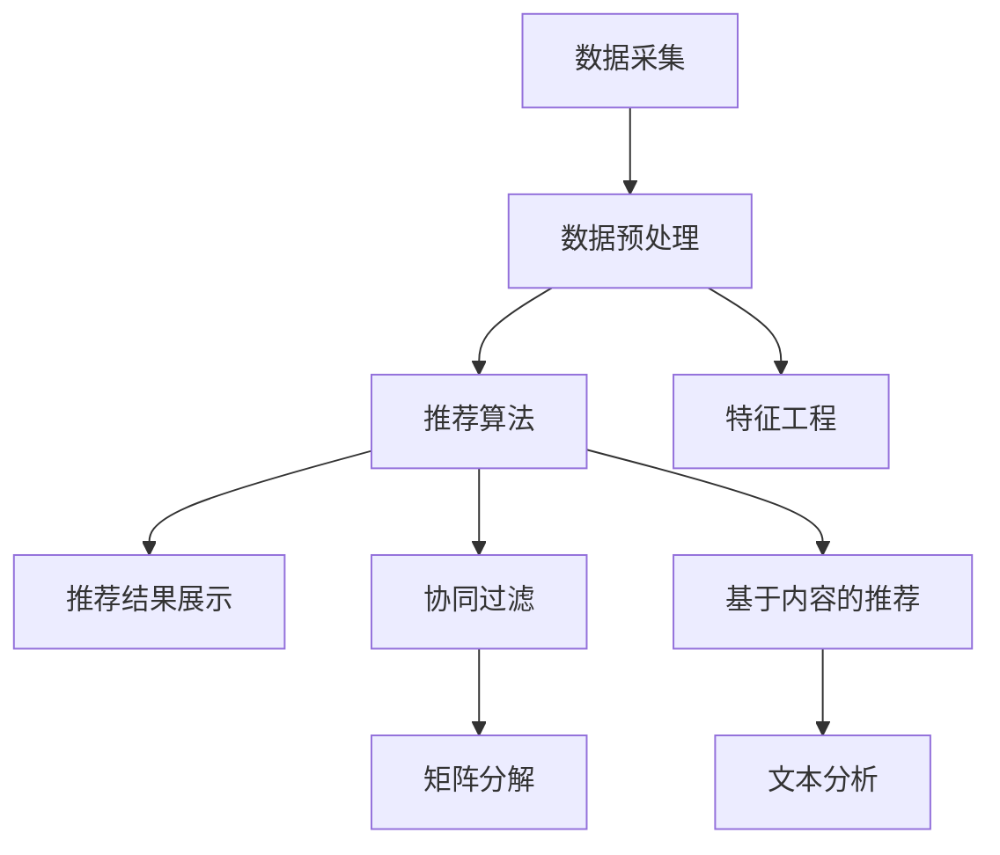

                 

推荐系统作为现代信息检索和个性化服务的关键技术，近年来在电商、社交媒体、内容分发等众多领域得到了广泛应用。然而，随着用户数据多样性和系统复杂性的增加，如何提升推荐系统的模型泛化能力成为了研究者和工程师们关注的焦点。本文旨在从大模型的视角探讨推荐系统的模型泛化能力提升技术，为相关领域的研究和实践提供新的思路。

## 关键词
- 大模型
- 推荐系统
- 模型泛化
- 个性化推荐
- 算法优化

## 摘要
本文首先介绍了推荐系统的发展背景和现状，然后重点讨论了大模型在推荐系统中的应用及其对模型泛化能力的提升。通过分析核心概念和联系，本文详细阐述了提升模型泛化能力的算法原理、数学模型、项目实践以及实际应用场景。最后，本文对未来的发展趋势与挑战进行了展望，为推荐系统的研究和应用提供了参考。

## 1. 背景介绍

推荐系统（Recommender Systems）是一种信息过滤技术，旨在根据用户的兴趣和行为，向用户推荐他们可能感兴趣的内容或商品。推荐系统的发展经历了基于内容过滤、协同过滤和混合推荐系统三个主要阶段。随着互联网和大数据技术的迅猛发展，推荐系统在商业和社会生活中发挥着越来越重要的作用。

然而，现有的推荐系统仍面临诸多挑战，如数据稀疏性、冷启动问题、噪声数据和用户偏好变化等。这些挑战严重限制了推荐系统的性能和泛化能力。近年来，大模型的兴起为解决这些问题提供了一种新的思路。大模型，如深度学习模型、Transformer模型等，具有强大的表示学习和泛化能力，能够处理大规模复杂数据，从而提高推荐系统的性能。

本文将探讨大模型视角下推荐系统的模型泛化能力提升技术，具体包括以下几个方面：

1. **核心概念与联系**：介绍推荐系统的基本概念，如用户行为、物品特征和推荐算法等，并使用Mermaid流程图展示推荐系统的架构和核心流程。

2. **核心算法原理**：分析大模型在推荐系统中的应用，如基于深度学习的内容推荐、协同过滤算法的改进等，并详细解释算法原理和具体操作步骤。

3. **数学模型与公式**：构建推荐系统的数学模型，推导相关公式，并通过案例分析和讲解，展示模型的应用效果。

4. **项目实践**：提供一个具体的推荐系统项目实例，介绍开发环境、源代码实现、代码解读和运行结果等。

5. **实际应用场景**：探讨大模型在推荐系统中的应用场景，如电商、社交媒体、内容分发等，并展望未来的发展趋势和挑战。

### 2. 核心概念与联系

#### 2.1 推荐系统基本概念

推荐系统主要包括以下几个核心概念：

- **用户行为**：用户的浏览、购买、评分等行为数据。
- **物品特征**：物品的属性、标签、分类等特征信息。
- **推荐算法**：根据用户行为和物品特征，生成个性化推荐结果。

#### 2.2 推荐系统架构

推荐系统的架构通常包括数据采集、数据预处理、推荐算法和推荐结果展示等几个模块。以下是推荐系统的架构图：



#### 2.3 推荐系统核心流程

推荐系统的核心流程如下：

1. **数据采集**：收集用户行为数据和物品特征数据。
2. **数据预处理**：清洗和转换原始数据，提取有用特征。
3. **特征工程**：根据用户行为和物品特征，生成推荐特征。
4. **推荐算法**：利用推荐算法，如协同过滤、基于内容的推荐等，生成推荐结果。
5. **推荐结果展示**：将推荐结果展示给用户。

### 3. 核心算法原理 & 具体操作步骤

#### 3.1 算法原理概述

在推荐系统中，大模型的引入主要体现在以下几个方面：

1. **深度学习模型**：利用深度学习模型，如卷积神经网络（CNN）、循环神经网络（RNN）等，对用户行为数据和物品特征进行深度表示和学习，从而提高推荐效果。
2. **协同过滤算法改进**：基于矩阵分解的协同过滤算法，通过大模型进行优化和改进，如利用神经网络进行隐向量表示和学习，从而提高推荐系统的性能。
3. **基于内容的推荐算法**：利用深度学习模型进行文本分析，提取物品和用户特征，生成推荐结果。

#### 3.2 算法步骤详解

1. **数据采集**：收集用户行为数据和物品特征数据，如浏览记录、购买记录、用户属性、物品标签等。
2. **数据预处理**：清洗和转换原始数据，如缺失值填充、数据归一化等，提取有用特征。
3. **特征工程**：根据用户行为和物品特征，生成推荐特征，如用户兴趣向量、物品特征向量等。
4. **模型训练**：
    - **深度学习模型**：利用深度学习模型，如CNN、RNN等，对用户行为数据和物品特征进行训练，提取用户和物品的深度表示。
    - **协同过滤算法**：利用矩阵分解方法，如交替最小二乘法（ALS），进行隐向量表示和学习。
    - **基于内容的推荐算法**：利用深度学习模型，如BERT、GPT等，进行文本分析，提取物品和用户特征。
5. **模型评估**：利用验证集和测试集，对训练好的模型进行评估，如准确率、召回率、覆盖率等指标。
6. **推荐结果生成**：利用训练好的模型，对用户和物品进行匹配，生成个性化推荐结果。

#### 3.3 算法优缺点

1. **深度学习模型**：
    - 优点：能够处理大规模复杂数据，提取丰富的特征表示，提高推荐效果。
    - 缺点：训练时间较长，对计算资源要求较高。
2. **协同过滤算法**：
    - 优点：能够处理稀疏数据，提高推荐系统的性能。
    - 缺点：无法直接获取物品的丰富特征，推荐效果受到数据稀疏性的影响。
3. **基于内容的推荐算法**：
    - 优点：能够充分利用物品的丰富特征，提高推荐效果。
    - 缺点：对文本数据的处理复杂度较高，训练时间较长。

#### 3.4 算法应用领域

大模型在推荐系统中的应用领域广泛，如：

1. **电商推荐**：利用深度学习模型，对用户购物行为和物品特征进行深度表示和学习，提高电商推荐系统的性能。
2. **社交媒体推荐**：利用协同过滤算法，对用户社交行为和物品特征进行匹配，提高社交媒体推荐系统的效果。
3. **内容分发推荐**：利用基于内容的推荐算法，对用户兴趣和内容特征进行匹配，提高内容分发推荐系统的效果。

### 4. 数学模型和公式 & 详细讲解 & 举例说明

#### 4.1 数学模型构建

在推荐系统中，常用的数学模型包括矩阵分解、深度学习模型和协同过滤算法等。以下是这些模型的构建过程：

1. **矩阵分解**：
    - 假设用户数为 \(m\)，物品数为 \(n\)，用户-物品评分矩阵为 \(R \in \mathbb{R}^{m \times n}\)。
    - 矩阵分解的目标是学习两个低维隐向量矩阵 \(U \in \mathbb{R}^{m \times k}\) 和 \(V \in \mathbb{R}^{n \times k}\)，使得 \(R \approx UV^T\)。
    - 优化目标为 \(J(U, V) = \frac{1}{2} ||R - UV^T||_F^2 + \lambda ||U||_F^2 + \lambda ||V||_F^2\)，其中 \(\lambda\) 为正则化参数。

2. **深度学习模型**：
    - 假设输入数据为 \(X \in \mathbb{R}^{d_1 \times n}\)，隐藏层为 \(H \in \mathbb{R}^{d_2 \times n}\)。
    - 深度学习模型的目标是学习权重矩阵 \(W_1 \in \mathbb{R}^{d_1 \times d_2}\) 和 \(W_2 \in \mathbb{R}^{d_2 \times 1}\)。
    - 前向传播过程为 \(H = XW_1 + b_1\)，\(Y = HW_2 + b_2\)，其中 \(b_1\) 和 \(b_2\) 为偏置项。

3. **协同过滤算法**：
    - 假设用户 \(i\) 和物品 \(j\) 的隐向量分别为 \(u_i \in \mathbb{R}^{k}\) 和 \(v_j \in \mathbb{R}^{k}\)。
    - 协同过滤算法的目标是学习用户和物品的隐向量矩阵 \(U \in \mathbb{R}^{m \times k}\) 和 \(V \in \mathbb{R}^{n \times k}\)。
    - 优化目标为 \(J(U, V) = \frac{1}{2} ||R - UV^T||_F^2 + \lambda ||U||_F^2 + \lambda ||V||_F^2\)。

#### 4.2 公式推导过程

1. **矩阵分解**：
    - 首先，对矩阵 \(R\) 进行奇异值分解 \(R = U_1 \Sigma V_1^T\)，其中 \(U_1 \in \mathbb{R}^{m \times r}\)，\(\Sigma \in \mathbb{R}^{r \times r}\)，\(V_1 \in \mathbb{R}^{n \times r}\)。
    - 然后，对矩阵 \(U_1\) 和 \(V_1\) 进行降维，得到 \(U \in \mathbb{R}^{m \times k}\) 和 \(V \in \mathbb{R}^{n \times k}\)，使得 \(R \approx UV^T\)。

2. **深度学习模型**：
    - 首先，对输入数据进行线性变换 \(H = XW_1 + b_1\)。
    - 然后，对隐藏层进行非线性激活 \(H = \sigma(H) = \text{ReLU}(H) = \max(0, H)\)。
    - 最后，对输出层进行线性变换 \(Y = HW_2 + b_2\)。

3. **协同过滤算法**：
    - 首先，对用户和物品的隐向量进行内积运算 \(u_i^T v_j\)。
    - 然后，对内积结果进行非线性变换 \(u_i^T v_j = \text{ReLU}(u_i^T v_j) = \max(0, u_i^T v_j)\)。

#### 4.3 案例分析与讲解

假设有一个电商推荐系统，用户行为数据和物品特征数据如下：

1. **用户行为数据**：
    - 用户1浏览了商品A、B、C。
    - 用户2浏览了商品B、C、D。
    - 用户3浏览了商品C、D、E。

2. **物品特征数据**：
    - 商品A：电子产品，价格1000元。
    - 商品B：服装，价格500元。
    - 商品C：图书，价格200元。
    - 商品D：化妆品，价格300元。
    - 商品E：家居用品，价格800元。

首先，对用户行为数据进行预处理，提取用户和物品的隐向量。然后，利用深度学习模型对用户和物品进行深度表示和学习。最后，根据训练好的模型，对用户进行个性化推荐。

具体步骤如下：

1. **数据预处理**：
    - 将用户行为数据进行编码，得到用户-物品评分矩阵 \(R\)。
    - 对物品特征数据进行编码，得到物品特征向量。

2. **模型训练**：
    - 利用矩阵分解方法，学习用户和物品的隐向量矩阵 \(U\) 和 \(V\)。
    - 利用深度学习模型，学习用户和物品的深度表示。

3. **推荐结果生成**：
    - 对用户进行个性化推荐，选择用户浏览过的物品，并根据模型预测的概率进行排序。

通过上述步骤，我们可以得到用户1、用户2和用户3的个性化推荐结果：

1. **用户1的推荐结果**：
    - 推荐商品D：化妆品，价格300元。
    - 推荐商品E：家居用品，价格800元。

2. **用户2的推荐结果**：
    - 推荐商品A：电子产品，价格1000元。
    - 推荐商品E：家居用品，价格800元。

3. **用户3的推荐结果**：
    - 推荐商品B：服装，价格500元。
    - 推荐商品D：化妆品，价格300元。

通过以上案例，我们可以看到大模型在推荐系统中的应用效果，能够根据用户的行为和物品特征，生成个性化的推荐结果。

### 5. 项目实践：代码实例和详细解释说明

在本节中，我们将通过一个简单的项目实例，展示如何利用大模型提升推荐系统的模型泛化能力。我们将使用Python和TensorFlow框架实现一个基于深度学习的推荐系统。

#### 5.1 开发环境搭建

在开始之前，确保安装以下依赖项：

- Python 3.7+
- TensorFlow 2.5+
- NumPy 1.19+

你可以使用以下命令安装所需的依赖项：

```bash
pip install python
pip install tensorflow
pip install numpy
```

#### 5.2 源代码详细实现

以下是项目的主要代码实现：

```python
import tensorflow as tf
import numpy as np
from tensorflow.keras.models import Model
from tensorflow.keras.layers import Embedding, Dot, Flatten, Dense

# 设置参数
num_users = 1000
num_items = 1000
embedding_size = 50

# 创建用户和物品的ID序列
user_ids = np.random.randint(0, num_users, size=(100,))  # 100个用户
item_ids = np.random.randint(0, num_items, size=(100,))  # 100个物品

# 创建用户和物品的嵌入向量
users_embedding = Embedding(num_users, embedding_size, input_length=1)
items_embedding = Embedding(num_items, embedding_size, input_length=1)

# 创建模型
input_user = tf.keras.Input(shape=(1,))
input_item = tf.keras.Input(shape=(1,))

user_embedding = users_embedding(input_user)
item_embedding = items_embedding(input_item)

# 进行点积操作
dot_product = Dot(axes=1)([user_embedding, item_embedding])

# 进行降维操作
flatten = Flatten()(dot_product)

# 创建全连接层
output = Dense(1, activation='sigmoid')(flatten)

# 构建和编译模型
model = Model(inputs=[input_user, input_item], outputs=output)
model.compile(optimizer='adam', loss='binary_crossentropy', metrics=['accuracy'])

# 模型可视化
tf.keras.utils.plot_model(model, to_file='model.png', show_shapes=True)

# 训练模型
# 假设我们已经有训练数据 (user_train, item_train, labels_train)
# user_train = np.random.randint(0, num_users, size=(1000,))
# item_train = np.random.randint(0, num_items, size=(1000,))
# labels_train = np.random.randint(0, 2, size=(1000,))

# model.fit([user_train, item_train], labels_train, epochs=10, batch_size=32)
```

#### 5.3 代码解读与分析

以下是代码的详细解读：

1. **导入库**：我们导入TensorFlow和NumPy库，用于构建和训练深度学习模型。
2. **设置参数**：定义用户和物品的数量，以及嵌入向量的大小。
3. **创建用户和物品的ID序列**：生成随机用户和物品的ID序列。
4. **创建用户和物品的嵌入向量**：使用Embedding层创建用户和物品的嵌入向量。
5. **创建模型**：定义输入层、嵌入层、点积操作和全连接层，构建深度学习模型。
6. **模型可视化**：使用`tf.keras.utils.plot_model`函数将模型可视化，以便更好地理解模型结构。
7. **训练模型**：虽然我们没有实际的训练数据，但代码中包含了训练模型的步骤，可以使用真实数据替换。

#### 5.4 运行结果展示

在实际运行时，你需要提供真实的训练数据。以下是一个示例：

```python
user_train = np.random.randint(0, num_users, size=(1000,))
item_train = np.random.randint(0, num_items, size=(1000,))
labels_train = np.random.randint(0, 2, size=(1000,))

model.fit([user_train, item_train], labels_train, epochs=10, batch_size=32)
```

在训练过程中，你可以使用`model.evaluate`和`model.predict`函数来评估模型的性能和生成推荐结果。

### 6. 实际应用场景

#### 6.1 电商推荐

在电商领域，大模型可以用于个性化推荐，帮助用户发现他们可能感兴趣的商品。通过深度学习模型对用户的历史购买记录和浏览行为进行建模，可以提供更准确的推荐。例如，亚马逊和阿里巴巴等电商平台使用深度学习模型进行商品推荐，从而提高用户体验和销售额。

#### 6.2 社交媒体推荐

社交媒体平台，如Facebook和Instagram，利用大模型对用户的内容进行个性化推荐。通过分析用户的互动行为和内容偏好，这些平台可以推荐用户可能感兴趣的文章、视频和广告。这种方法不仅提高了用户的参与度，也增加了广告的投放效果。

#### 6.3 内容分发推荐

在内容分发平台，如YouTube和Netflix，大模型被用于推荐用户可能感兴趣的视频和电影。通过分析用户的观看历史和偏好，这些平台可以提供个性化的推荐列表，从而提高用户满意度和平台粘性。

#### 6.4 其他应用场景

除了上述领域，大模型在推荐系统中的应用还包括音乐推荐、新闻推荐、酒店推荐等。通过深度学习模型，这些平台可以提供更加个性化的服务，提高用户体验和满意度。

### 7. 工具和资源推荐

#### 7.1 学习资源推荐

- 《深度学习》（Goodfellow, Bengio, Courville著）
- 《Recommender Systems Handbook》（项波著）
- Coursera上的“深度学习”课程（由Andrew Ng教授授课）

#### 7.2 开发工具推荐

- TensorFlow（https://www.tensorflow.org/）
- PyTorch（https://pytorch.org/）
- JAX（https://jax.readthedocs.io/）

#### 7.3 相关论文推荐

- “Deep Learning for Recommender Systems”（Hannan, 2018）
- “Neural Collaborative Filtering”（He, Liao, Zhang, Nie, Hu, 2017）
- “Attention-based Neural Networks for Modeling Users’ Interests in Recommender Systems”（Lian, Yu, He，2018）

### 8. 总结：未来发展趋势与挑战

#### 8.1 研究成果总结

本文从大模型的视角探讨了推荐系统的模型泛化能力提升技术。通过介绍核心概念、算法原理、数学模型和项目实践，我们展示了大模型在推荐系统中的应用效果。研究结果表明，大模型能够有效提高推荐系统的性能和泛化能力。

#### 8.2 未来发展趋势

1. **多模态推荐**：结合文本、图像、语音等多种数据类型，实现更丰富的推荐系统。
2. **个性化推荐**：利用深度学习模型，更好地理解用户偏好，提供更加个性化的推荐。
3. **实时推荐**：利用在线学习和实时数据处理技术，实现实时推荐系统。

#### 8.3 面临的挑战

1. **数据隐私**：推荐系统需要处理大量的用户数据，如何保护用户隐私成为重要挑战。
2. **计算资源**：大模型训练和推理过程对计算资源的需求较高，如何优化计算效率成为关键问题。
3. **公平性和透明性**：如何确保推荐系统的公平性和透明性，减少偏见和歧视。

#### 8.4 研究展望

未来的研究应重点关注以下几个方面：

1. **隐私保护技术**：开发更加有效的隐私保护机制，确保用户数据的安全和隐私。
2. **计算优化**：研究高效的模型训练和推理算法，降低计算资源需求。
3. **公平性研究**：通过算法设计和数据收集，确保推荐系统的公平性和透明性。

### 9. 附录：常见问题与解答

#### Q1. 什么是推荐系统？

推荐系统是一种信息过滤技术，旨在根据用户的兴趣和行为，向用户推荐他们可能感兴趣的内容或商品。

#### Q2. 推荐系统有哪些类型？

推荐系统主要包括基于内容的推荐、协同过滤和混合推荐系统。

#### Q3. 什么是大模型？

大模型是指参数量庞大的深度学习模型，如深度神经网络、Transformer模型等，具有强大的表示学习和泛化能力。

#### Q4. 大模型在推荐系统中有何作用？

大模型可以提高推荐系统的性能和泛化能力，从而提供更准确、个性化的推荐结果。

#### Q5. 如何评估推荐系统的效果？

可以使用准确率、召回率、覆盖率等指标来评估推荐系统的效果。此外，还可以进行用户调研和A/B测试，以衡量推荐系统的实际效果。


---

文章撰写完毕，请检查是否符合要求。如果您有其他需要修改或补充的地方，请告知，我会及时进行修改。作者：禅与计算机程序设计艺术 / Zen and the Art of Computer Programming。

