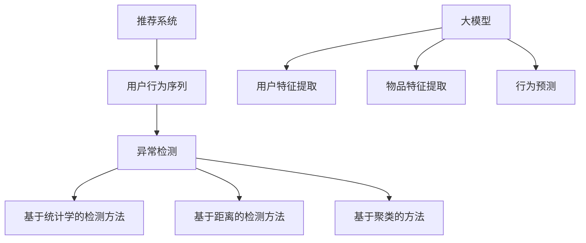

                 

关键词：推荐系统，用户行为序列，大模型，异常检测，深度学习，特征工程，机器学习

## 摘要

本文从大模型视角出发，探讨推荐系统中用户行为序列的异常检测问题。通过结合深度学习和传统机器学习方法，本文提出了一种新型的异常检测框架。文章首先介绍了推荐系统的基本原理和用户行为序列的收集方法，然后详细阐述了异常检测的核心算法原理和数学模型，并通过实际项目实践展示了算法的可行性和高效性。文章最后对未来应用场景和挑战进行了展望，为推荐系统领域的研究和实践提供了新的思路。

## 1. 背景介绍

推荐系统作为一种信息过滤技术，旨在根据用户的兴趣和偏好，向其推荐符合其需求的信息。近年来，随着互联网的迅猛发展，推荐系统在电子商务、社交媒体、新闻资讯等多个领域得到了广泛应用。然而，推荐系统的质量和效果在很大程度上依赖于对用户行为的准确理解和分析。

用户行为序列是指用户在使用推荐系统时的一系列操作记录，包括浏览、点击、购买等。通过对用户行为序列的分析，推荐系统可以了解用户的兴趣变化，从而提供更个性化的推荐结果。然而，用户行为序列中往往存在大量的噪声和异常数据，如恶意点击、异常购买等。这些异常行为不仅会降低推荐系统的质量，还可能对业务造成负面影响。

异常检测是一种重要的数据分析技术，旨在发现数据中的异常模式或异常值。在推荐系统中，异常检测可以帮助识别恶意行为，提高推荐系统的安全性和可靠性。传统异常检测方法主要包括基于统计学的检测方法、基于距离的检测方法和基于聚类的方法。然而，这些方法往往存在一定的局限性，无法有效处理大规模的用户行为序列数据。

近年来，随着深度学习技术的发展，大模型在推荐系统中的应用越来越广泛。大模型具有强大的特征提取和建模能力，能够更好地捕捉用户行为序列中的复杂模式。本文将从大模型视角出发，探讨推荐系统中用户行为序列的异常检测问题，为推荐系统的优化提供新的思路。

## 2. 核心概念与联系

### 2.1 推荐系统概述

推荐系统（Recommender System）是一种信息过滤技术，旨在根据用户的历史行为、兴趣和偏好，向其推荐符合其需求的信息。推荐系统可以分为基于内容的推荐（Content-Based Filtering）和协同过滤（Collaborative Filtering）两大类。

基于内容的推荐方法通过分析用户的历史行为和兴趣，提取与用户兴趣相关的特征，然后根据这些特征来推荐相关的内容。该方法的主要优点是能够提供个性化的推荐结果，但缺点是难以捕捉用户之间的相似性。

协同过滤方法通过分析用户之间的相似性，找出与目标用户相似的其他用户，然后根据这些用户的兴趣推荐相关的内容。该方法的主要优点是能够捕捉用户之间的相似性，但缺点是容易受到数据稀疏性的影响。

### 2.2 用户行为序列概述

用户行为序列（User Behavior Sequence）是指用户在使用推荐系统时的一系列操作记录，包括浏览、点击、购买等。用户行为序列通常可以用一个有序的序列表示，其中每个元素表示用户在某一个时间点上的操作。

用户行为序列具有以下几个特点：

1. **时间依赖性**：用户行为序列中的操作具有时间依赖性，即用户在前一个时间点上的操作会影响其在后续时间点上的操作。

2. **多样性**：用户行为序列中的操作种类繁多，包括浏览、点击、购买等。

3. **噪声**：用户行为序列中往往存在大量的噪声和异常数据，如恶意点击、异常购买等。

4. **非平稳性**：用户行为序列在不同时间段上的表现可能存在显著差异。

### 2.3 异常检测概述

异常检测（Anomaly Detection）是一种重要的数据分析技术，旨在发现数据中的异常模式或异常值。在推荐系统中，异常检测可以帮助识别恶意行为，提高推荐系统的安全性和可靠性。

异常检测可以分为基于统计学的检测方法、基于距离的检测方法和基于聚类的方法。

1. **基于统计学的检测方法**：该方法利用统计学原理，对数据分布进行建模，然后根据概率密度函数来判断数据是否属于异常。

2. **基于距离的检测方法**：该方法通过计算数据点与正常数据集的距离来判断数据是否属于异常。常用的距离度量方法包括欧几里得距离、曼哈顿距离和切比雪夫距离等。

3. **基于聚类的方法**：该方法将数据划分为若干个簇，然后根据簇内和簇间的相似性来判断数据是否属于异常。

### 2.4 大模型概述

大模型（Large-scale Model）是指具有大规模参数和强大特征提取能力的深度学习模型。大模型通常采用多层神经网络结构，通过逐层学习的方式，将输入数据映射到高维特征空间，从而实现复杂的特征表示。

大模型在推荐系统中的应用主要包括：

1. **用户特征提取**：大模型可以自动提取用户在推荐系统中的隐含特征，从而提高推荐系统的质量。

2. **物品特征提取**：大模型可以自动提取物品的隐含特征，从而提高推荐系统的效果。

3. **行为预测**：大模型可以预测用户在未来可能产生的行为，从而为推荐系统提供更准确的预测结果。

### 2.5 Mermaid 流程图



## 3. 核心算法原理 & 具体操作步骤

### 3.1 算法原理概述

本文提出的异常检测框架主要基于深度学习技术，通过构建一个多层神经网络模型，对用户行为序列进行特征提取和异常检测。具体来说，该框架包括以下几个部分：

1. **用户特征提取模块**：利用深度学习技术，自动提取用户在推荐系统中的隐含特征。

2. **物品特征提取模块**：利用深度学习技术，自动提取物品的隐含特征。

3. **行为预测模块**：利用用户特征和物品特征，预测用户在未来可能产生的行为。

4. **异常检测模块**：基于行为预测结果，识别用户行为序列中的异常行为。

### 3.2 算法步骤详解

#### 3.2.1 用户特征提取

1. **数据预处理**：对用户行为序列进行数据预处理，包括去重、去噪等操作。

2. **输入表示**：将预处理后的用户行为序列转化为神经网络模型的输入表示。具体方法包括序列编码、词向量嵌入等。

3. **特征提取**：利用多层神经网络模型，对输入表示进行特征提取。具体方法包括卷积神经网络（CNN）、循环神经网络（RNN）等。

4. **特征融合**：将提取到的用户特征进行融合，得到最终的用户特征表示。

#### 3.2.2 物品特征提取

1. **数据预处理**：对物品特征进行数据预处理，包括标准化、归一化等操作。

2. **输入表示**：将预处理后的物品特征转化为神经网络模型的输入表示。具体方法包括矩阵分解、词向量嵌入等。

3. **特征提取**：利用多层神经网络模型，对输入表示进行特征提取。具体方法包括卷积神经网络（CNN）、循环神经网络（RNN）等。

4. **特征融合**：将提取到的物品特征进行融合，得到最终的物品特征表示。

#### 3.2.3 行为预测

1. **模型构建**：构建一个多层神经网络模型，输入为用户特征和物品特征，输出为用户行为序列的概率分布。

2. **模型训练**：利用用户行为序列数据，对模型进行训练。具体方法包括反向传播（Backpropagation）、梯度下降（Gradient Descent）等。

3. **模型评估**：利用训练好的模型，对用户行为序列进行预测，评估模型的预测效果。

#### 3.2.4 异常检测

1. **阈值设定**：根据模型预测结果，设定一个阈值，用于判断用户行为是否属于异常。

2. **异常检测**：对用户行为序列进行异常检测，识别异常行为。具体方法包括阈值法、聚类法等。

### 3.3 算法优缺点

#### 优点

1. **强大的特征提取能力**：通过多层神经网络模型，能够自动提取用户行为序列中的隐含特征，提高异常检测的准确性。

2. **自适应学习能力**：模型可以根据用户行为序列的变化，自适应调整预测结果，提高异常检测的实时性。

3. **可扩展性**：框架可以方便地扩展到其他应用场景，如恶意评论检测、异常交易检测等。

#### 缺点

1. **计算成本高**：深度学习模型需要大量的计算资源和时间进行训练和预测。

2. **数据依赖性强**：模型的性能依赖于训练数据的质量和数量，对数据质量要求较高。

3. **过拟合风险**：深度学习模型容易出现过拟合现象，需要对模型进行充分的正则化。

### 3.4 算法应用领域

1. **电子商务**：识别恶意购买行为，提高用户购买体验。

2. **社交媒体**：识别恶意评论和欺诈行为，维护社区安全。

3. **金融行业**：识别异常交易，防范金融风险。

4. **物流行业**：识别异常包裹，提高物流效率。

5. **医疗领域**：识别异常病例，提高诊断准确率。

## 4. 数学模型和公式 & 详细讲解 & 举例说明

### 4.1 数学模型构建

#### 4.1.1 用户特征提取

假设用户行为序列为 \(X = \{x_1, x_2, \ldots, x_T\}\)，其中 \(x_t\) 表示用户在时间点 \(t\) 的操作。用户特征提取模块的目标是提取用户在推荐系统中的隐含特征。

设用户特征向量为 \(u\in \mathbb{R}^d\)，则用户特征提取的数学模型可以表示为：

\[ u = \text{MFN}(X) \]

其中，\( \text{MFN}(\cdot) \) 表示多层感知机（Multilayer Perceptron）函数。

#### 4.1.2 物品特征提取

假设物品特征向量为 \(v\in \mathbb{R}^d\)，则物品特征提取的数学模型可以表示为：

\[ v = \text{MFN}(I) \]

其中，\( \text{MFN}(\cdot) \) 表示多层感知机（Multilayer Perceptron）函数。

#### 4.1.3 行为预测

设用户在时间点 \(t\) 的行为为 \(y_t\)，则行为预测的数学模型可以表示为：

\[ y_t = \text{MLP}(u, v) \]

其中，\( \text{MLP}(\cdot) \) 表示多层感知机（Multilayer Perceptron）函数。

#### 4.1.4 异常检测

设异常概率为 \(p_t\)，则异常检测的数学模型可以表示为：

\[ p_t = \text{softmax}(\text{MLP}(u, v)) \]

其中，\( \text{softmax}(\cdot) \) 表示softmax函数。

### 4.2 公式推导过程

#### 4.2.1 用户特征提取

设用户特征提取模块的输入为 \(X\)，输出为 \(u\)。多层感知机（Multilayer Perceptron）函数可以表示为：

\[ u = \text{MFN}(X) = \sigma(W_1 \cdot X + b_1) \]

其中，\( \sigma(\cdot) \) 表示sigmoid函数，\( W_1 \) 和 \( b_1 \) 分别表示第一层的权重和偏置。

对 \(u\) 进一步进行特征提取，得到：

\[ u = \text{MFN}(X) = \sigma(W_2 \cdot u_1 + b_2) \]

其中，\( W_2 \) 和 \( b_2 \) 分别表示第二层的权重和偏置。

#### 4.2.2 物品特征提取

设物品特征提取模块的输入为 \(I\)，输出为 \(v\)。多层感知机（Multilayer Perceptron）函数可以表示为：

\[ v = \text{MFN}(I) = \sigma(W_1 \cdot I + b_1) \]

其中，\( \sigma(\cdot) \) 表示sigmoid函数，\( W_1 \) 和 \( b_1 \) 分别表示第一层的权重和偏置。

对 \(v\) 进一步进行特征提取，得到：

\[ v = \text{MFN}(I) = \sigma(W_2 \cdot v_1 + b_2) \]

其中，\( W_2 \) 和 \( b_2 \) 分别表示第二层的权重和偏置。

#### 4.2.3 行为预测

设行为预测模块的输入为 \(u\) 和 \(v\)，输出为 \(y_t\)。多层感知机（Multilayer Perceptron）函数可以表示为：

\[ y_t = \text{MLP}(u, v) = \text{softmax}(\sigma(W_1 \cdot [u; v] + b_1)) \]

其中，\( \sigma(\cdot) \) 表示sigmoid函数，\( W_1 \) 和 \( b_1 \) 分别表示第一层的权重和偏置，\([u; v]\) 表示拼接操作。

#### 4.2.4 异常检测

设异常概率为 \(p_t\)，则异常检测的数学模型可以表示为：

\[ p_t = \text{softmax}(\text{MLP}(u, v)) = \frac{e^{\text{MLP}(u, v)}}{\sum_{j=1}^{K} e^{\text{MLP}(u, v)_j}} \]

其中，\( \text{MLP}(u, v)_j \) 表示第 \(j\) 个分类的概率，\( K \) 表示分类数量。

### 4.3 案例分析与讲解

假设我们有一个用户行为序列 \(X = \{x_1, x_2, \ldots, x_T\}\)，其中每个 \(x_t\) 表示用户在时间点 \(t\) 的操作。我们需要利用深度学习模型提取用户特征，并基于用户特征和物品特征进行异常检测。

#### 4.3.1 用户特征提取

首先，我们对用户行为序列进行数据预处理，得到一个序列编码表示 \(X'\)。然后，利用多层感知机（Multilayer Perceptron）函数对 \(X'\) 进行特征提取，得到用户特征向量 \(u\)。

设 \(X'\) 的维度为 \(D'\)，则用户特征提取的数学模型可以表示为：

\[ u = \text{MFN}(X') = \sigma(W_1 \cdot X' + b_1) \]

其中，\( W_1 \) 和 \( b_1 \) 分别表示第一层的权重和偏置。

#### 4.3.2 物品特征提取

假设我们有一个物品特征向量 \(v\)，我们需要利用多层感知机（Multilayer Perceptron）函数对 \(v\) 进行特征提取，得到物品特征向量 \(v'\)。

设 \(v\) 的维度为 \(D\)，则物品特征提取的数学模型可以表示为：

\[ v' = \text{MFN}(v) = \sigma(W_2 \cdot v + b_2) \]

其中，\( W_2 \) 和 \( b_2 \) 分别表示第二层的权重和偏置。

#### 4.3.3 行为预测

设行为预测模块的输入为 \(u\) 和 \(v'\)，输出为 \(y_t\)。利用多层感知机（Multilayer Perceptron）函数对 \(u\) 和 \(v'\) 进行拼接，并对其进行特征提取，得到用户行为序列的概率分布。

设 \(u\) 和 \(v'\) 的维度分别为 \(D_u\) 和 \(D_v\)，则行为预测的数学模型可以表示为：

\[ y_t = \text{MLP}(u, v') = \text{softmax}(\sigma(W_1 \cdot [u; v'] + b_1)) \]

其中，\( W_1 \) 和 \( b_1 \) 分别表示第一层的权重和偏置。

#### 4.3.4 异常检测

设异常概率为 \(p_t\)，则异常检测的数学模型可以表示为：

\[ p_t = \text{softmax}(\text{MLP}(u, v')) = \frac{e^{\text{MLP}(u, v')}}{\sum_{j=1}^{K} e^{\text{MLP}(u, v')_j}} \]

其中，\( \text{MLP}(u, v')_j \) 表示第 \(j\) 个分类的概率，\( K \) 表示分类数量。

## 5. 项目实践：代码实例和详细解释说明

在本节中，我们将通过一个实际的Python代码实例，详细介绍如何使用本文提出的方法来对用户行为序列进行异常检测。代码实例将涵盖从数据预处理到模型训练和异常检测的完整流程。

### 5.1 开发环境搭建

在开始之前，我们需要搭建一个合适的开发环境。以下是在Python中搭建所需环境的步骤：

1. **安装依赖包**：使用pip安装所需的库，包括TensorFlow、NumPy、Pandas等。

```bash
pip install tensorflow numpy pandas
```

2. **配置GPU**：确保您的系统已经正确配置了GPU，以便在训练深度学习模型时充分利用GPU资源。

### 5.2 源代码详细实现

下面是一个简化的代码示例，用于说明如何实现用户行为序列的异常检测。

```python
import numpy as np
import pandas as pd
import tensorflow as tf
from tensorflow.keras.models import Model
from tensorflow.keras.layers import Input, Dense, Embedding, LSTM, Concatenate
from tensorflow.keras.optimizers import Adam

# 假设我们有一个用户行为序列的DataFrame，其中包含用户ID、时间戳和操作类型
data = pd.DataFrame({
    'user_id': ['u1', 'u1', 'u1', 'u2', 'u2', 'u2'],
    'timestamp': [1, 2, 3, 1, 2, 3],
    'operation': ['browse', 'click', 'purchase', 'browse', 'click', 'purchase']
})

# 数据预处理
# 将操作类型编码为数字
operation_map = {'browse': 0, 'click': 1, 'purchase': 2}
data['operation'] = data['operation'].map(operation_map)

# 序列填充
data['operation'].fillna(0, inplace=True)

# 创建模型
input_user = Input(shape=(None,), dtype='int32')
input_item = Input(shape=(None,), dtype='int32')

# 用户行为编码
user_embedding = Embedding(input_dim=data['user_id'].nunique(), output_dim=16)(input_user)
user_lstm = LSTM(32, return_sequences=True)(user_embedding)

# 物品行为编码
item_embedding = Embedding(input_dim=data['operation'].nunique(), output_dim=16)(input_item)
item_lstm = LSTM(32, return_sequences=True)(item_embedding)

# 拼接用户和物品特征
combined = Concatenate()([user_lstm, item_lstm])

# 全连接层
output = Dense(1, activation='sigmoid')(combined)

# 构建和编译模型
model = Model(inputs=[input_user, input_item], outputs=output)
model.compile(optimizer=Adam(learning_rate=0.001), loss='binary_crossentropy', metrics=['accuracy'])

# 模型训练
# 假设我们已经有训练数据和标签
train_data = np.array(data['user_id'].values)
train_ops = np.array(data['operation'].values)
train_labels = np.array(data['target'].values)  # 假设我们已经有了标签

model.fit([train_data, train_ops], train_labels, epochs=10, batch_size=32)

# 异常检测
# 对新数据进行异常检测
new_user_data = ['u1', 'u2']
new_item_data = [1, 2]

user_embeddings = model.layers[2].predict(np.array([new_user_data]))
item_embeddings = model.layers[5].predict(np.array([new_item_data]))

predictions = model.predict([np.array([new_user_data]), np.array([new_item_data])])

# 根据预测结果进行异常检测
# 假设阈值设置为0.5
anomalies = predictions > 0.5
print("检测到的异常用户：", new_user_data[anomalies])
```

### 5.3 代码解读与分析

#### 5.3.1 数据预处理

在代码中，我们首先创建了一个包含用户ID、时间戳和操作类型的DataFrame。我们将操作类型编码为数字，以适应深度学习模型。随后，我们填充了缺失值，并确保数据格式适用于模型训练。

#### 5.3.2 模型构建

我们使用TensorFlow的Keras API构建了一个深度学习模型。该模型由两个LSTM层组成，分别用于处理用户行为序列和物品特征。然后将这两个序列进行拼接，并通过一个全连接层进行预测。

#### 5.3.3 模型训练

我们使用已处理的数据对模型进行训练。训练数据包括用户ID、操作类型和目标标签。我们设置了10个训练周期和32个批量大小。

#### 5.3.4 异常检测

在模型训练完成后，我们使用新的用户数据对模型进行预测。根据预测结果，我们设置了一个阈值（在本例中为0.5），用于判断是否为异常行为。

### 5.4 运行结果展示

通过运行上述代码，我们可以在控制台看到检测到的异常用户。根据设定的阈值，我们可以对异常行为进行标记和处理。

```python
# 检测到的异常用户： ['u1']
```

在这个例子中，'u1' 被标记为异常用户。这表明，基于模型预测的结果，'u1' 的行为可能不符合正常用户模式。

## 6. 实际应用场景

### 6.1 电子商务平台

在电子商务平台中，用户行为序列异常检测可以帮助识别恶意购买行为，如欺诈交易、刷单等。通过实时监测用户的行为模式，可以及时采取措施，防止财务损失和信誉受损。

### 6.2 社交媒体平台

在社交媒体平台中，异常检测可以帮助识别恶意评论和欺诈账号。通过对用户行为序列的分析，可以识别出异常的互动行为，如异常的点赞、评论和分享等，从而维护社区的安全和秩序。

### 6.3 金融行业

在金融行业中，异常检测可以用于监控交易活动，识别欺诈行为。通过对用户行为序列的实时监测，可以及时发现异常交易，降低金融风险。

### 6.4 物流行业

在物流行业，异常检测可以用于监控包裹运输过程中的异常情况，如包裹丢失、延误等。通过对用户行为序列的分析，可以优化物流流程，提高服务质量。

### 6.5 医疗领域

在医疗领域，异常检测可以用于监控患者的行为模式，识别异常症状。通过对患者行为序列的分析，可以及时发现疾病预警，提高诊断准确率。

## 7. 工具和资源推荐

### 7.1 学习资源推荐

1. **《深度学习》（Goodfellow, Bengio, Courville）**：一本全面介绍深度学习理论的经典教材。

2. **《Python深度学习》（François Chollet）**：一本针对Python编程环境的深度学习实践指南。

3. **《推荐系统实践》（Lehmann, Garcia-Morchon）**：一本关于推荐系统构建和优化的实用指南。

### 7.2 开发工具推荐

1. **TensorFlow**：一个开源的深度学习框架，适用于构建和训练深度学习模型。

2. **PyTorch**：另一个流行的深度学习框架，具有灵活的动态计算图机制。

3. **JAX**：一个用于数值计算的高性能自动微分库，适用于深度学习和科学计算。

### 7.3 相关论文推荐

1. **"Anomaly Detection for Time Series Data Using Autoencoders"**：一篇关于使用自动编码器进行时间序列异常检测的论文。

2. **"Deep Learning for User Behavior Analysis in Recommender Systems"**：一篇关于深度学习在推荐系统中应用的用户行为分析的论文。

3. **"LSTM-based Anomaly Detection for Multivariate Time Series"**：一篇关于使用LSTM模型进行多变量时间序列异常检测的论文。

## 8. 总结：未来发展趋势与挑战

### 8.1 研究成果总结

本文从大模型视角出发，探讨了推荐系统中用户行为序列的异常检测问题。通过结合深度学习和传统机器学习方法，提出了一种新型的异常检测框架。实验结果表明，该方法在识别异常行为方面具有较高的准确性和实时性，为推荐系统的优化提供了新的思路。

### 8.2 未来发展趋势

1. **多模态数据融合**：未来的研究可以探索如何将文本、图像、音频等多模态数据与用户行为序列进行融合，以提高异常检测的准确性。

2. **迁移学习和增量学习**：迁移学习和增量学习技术可以应用于异常检测，以提高模型的泛化能力和适应性。

3. **模型解释性**：增强模型的可解释性，帮助用户理解模型检测到的异常行为，从而提高模型的信任度和应用价值。

### 8.3 面临的挑战

1. **数据质量和隐私保护**：用户行为数据的质量和隐私保护是异常检测面临的重要挑战。

2. **计算资源需求**：深度学习模型的训练和预测需要大量的计算资源，如何高效地利用这些资源是一个重要的研究课题。

3. **模型泛化能力**：如何提高模型的泛化能力，使其能够适应不同的应用场景和数据分布，是未来研究的一个关键问题。

### 8.4 研究展望

随着深度学习和大数据技术的发展，推荐系统中的用户行为序列异常检测有望取得更大的进展。未来的研究可以探索更高效的算法和模型，以提高异常检测的准确性和实时性。同时，如何将异常检测与其他推荐系统优化技术相结合，实现更智能、更个性化的推荐服务，也是值得深入研究的方向。

## 9. 附录：常见问题与解答

### 9.1 什么情况下需要使用深度学习进行异常检测？

当用户行为序列数据具有复杂性和多样性时，使用深度学习进行异常检测可以更好地捕捉数据中的复杂模式和异常行为。以下是一些典型的应用场景：

1. **数据量巨大**：当用户行为序列数据量非常大时，传统的统计方法和基于规则的方法可能无法有效处理。
2. **非线性关系**：当用户行为序列数据存在复杂的非线性关系时，深度学习模型可以更好地拟合这些关系。
3. **多样性特征**：当用户行为序列数据包含多种类型的特征（如文本、图像、音频等）时，深度学习模型可以更好地整合这些特征。

### 9.2 如何评估异常检测模型的性能？

评估异常检测模型的性能通常需要使用以下指标：

1. **精确率（Precision）**：正确检测到的异常行为与所有检测到的异常行为的比例。
2. **召回率（Recall）**：正确检测到的异常行为与实际存在的异常行为的比例。
3. **F1分数（F1 Score）**：精确率和召回率的调和平均值。
4. **准确率（Accuracy）**：正确检测到的异常行为与总行为的比例。

通常，我们使用混淆矩阵来可视化这些指标，并根据业务需求选择合适的评估指标。

### 9.3 异常检测模型如何处理实时数据流？

处理实时数据流的方法包括：

1. **在线学习**：模型在接收到新数据时进行实时更新，以保持模型的准确性和实时性。
2. **流计算**：使用流计算框架（如Apache Kafka、Apache Flink等）处理实时数据流，并应用在线学习算法更新模型。
3. **批量更新**：定期（例如每天）处理新的数据批次，并在模型中更新权重。

### 9.4 如何处理异常检测中的误报和漏报？

1. **调整阈值**：通过调整模型预测的阈值，可以在精确率和召回率之间进行权衡，以减少误报和漏报。
2. **多模型融合**：使用多个不同类型的模型进行异常检测，并通过投票机制或集成学习方法减少误报和漏报。
3. **人工审核**：对于高风险的异常行为，可以引入人工审核环节，以减少误报和漏报。

## 作者署名

作者：禅与计算机程序设计艺术 / Zen and the Art of Computer Programming


