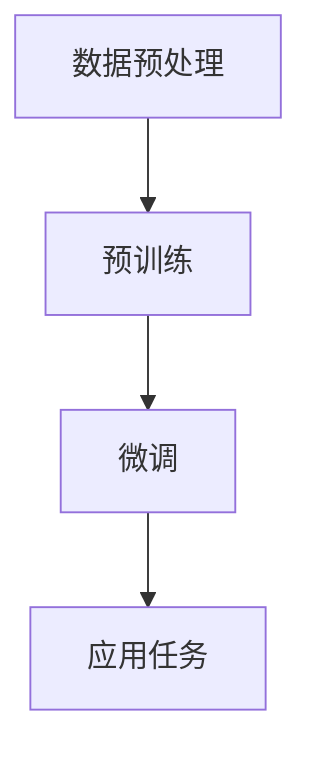
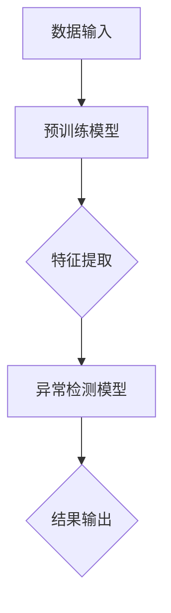

                 

关键词：大模型、推荐系统、用户行为、异常检测、修复技术

## 摘要

本文旨在探讨大模型视角下推荐系统的用户行为序列异常检测与修复技术。首先，我们回顾了推荐系统的发展和现状，然后深入分析了大模型在推荐系统中的作用，特别是用户行为序列的处理能力。接着，我们详细介绍了异常检测的基本概念、技术方法和应用场景，重点讨论了大模型在异常检测中的优势和应用。随后，本文提出了基于大模型的用户行为序列异常检测与修复方法，并对其数学模型和算法进行了深入解析。最后，我们通过具体案例展示了该方法在实际推荐系统中的应用效果，并对未来的发展趋势和挑战进行了展望。

## 1. 背景介绍

推荐系统作为信息过滤和内容推荐的重要工具，已广泛应用于电子商务、社交媒体、新闻推送等众多领域。传统的推荐系统主要依赖于基于内容的推荐（Content-Based Filtering）和协同过滤（Collaborative Filtering）等方法，然而，随着互联网的快速发展，用户生成的内容和数据量呈现爆炸式增长，这使得传统推荐系统在面对复杂、动态的用户行为序列时，逐渐暴露出其局限性。

近年来，随着深度学习和大数据技术的飞速发展，大模型逐渐成为推荐系统研究的热点。大模型，特别是基于 Transformer 的预训练模型，具有强大的表示学习和迁移学习能力，能够在大规模数据集上自动提取特征，并针对不同的任务进行微调。在推荐系统中，大模型不仅可以处理复杂的用户行为序列，还能够捕捉到用户潜在的喜好和兴趣点，从而实现更精准的个性化推荐。

本文将重点探讨以下内容：

1. **大模型在推荐系统中的作用**：介绍大模型的基本原理和架构，分析其在处理用户行为序列时的优势。
2. **异常检测的基本概念和技术方法**：阐述异常检测的定义、分类及其在推荐系统中的应用。
3. **基于大模型的用户行为序列异常检测方法**：提出一种结合大模型和异常检测技术的用户行为序列分析方法，并详细描述其数学模型和算法步骤。
4. **具体案例和实际应用**：通过具体案例展示该方法在实际推荐系统中的应用效果，并进行代码解读和分析。
5. **未来发展趋势与挑战**：总结研究成果，探讨推荐系统在异常检测与修复领域未来的发展趋势和面临的挑战。

## 2. 核心概念与联系

### 2.1 大模型的基本原理与架构

大模型，特别是基于 Transformer 的预训练模型，如 BERT、GPT 和 T5 等，具有强大的表示学习和迁移学习能力。其基本原理是通过在大规模数据集上进行预训练，学习到通用的语言表示和知识，然后在具体任务上进行微调，以达到较好的性能。

#### Mermaid 流程图：



#### 数据预处理

在预训练阶段，数据预处理是至关重要的一步。主要包括文本的分词、去噪、归一化等操作，以确保输入数据的质量和一致性。

#### 预训练

预训练阶段，大模型在大规模文本语料库上进行训练，通过自我关注机制（Self-Attention Mechanism）和位置编码（Positional Encoding）等机制，自动提取语义特征和知识。这一过程可以分为两个阶段：Masked Language Model（MLM）和 Next Sentence Prediction（NSP）。

#### 微调

在预训练完成后，大模型需要针对具体应用任务进行微调。微调过程通常包括特征提取、模型调优、损失函数优化等步骤。通过微调，大模型能够更好地适应特定任务的需求。

#### 应用任务

微调后的模型可以应用于各种自然语言处理任务，如文本分类、情感分析、命名实体识别等。在推荐系统中，大模型可以用于用户行为序列的建模和预测，从而实现更精准的个性化推荐。

### 2.2 异常检测的基本概念

异常检测（Anomaly Detection）是一种监督学习任务，旨在从给定的数据集中识别出异常或异常模式。在推荐系统中，异常检测主要用于检测用户行为序列中的异常行为，如恶意点击、刷单等。

#### 异常检测的分类

根据检测方法的性质，异常检测可以分为基于统计模型的方法、基于聚类的方法和基于神经网络的方法。

1. **基于统计模型的方法**：主要包括统计学中的异常检测算法，如 Local Outlier Factor（LOF）、Isolation Forest 等。这些方法通过计算数据点的局部密度和距离，识别出离群点。
2. **基于聚类的方法**：如 K-Means、DBSCAN 等。这些方法通过将数据点分为不同的簇，识别出不在任何簇中的数据点作为异常。
3. **基于神经网络的方法**：如 Autoencoder、GAN 等。这些方法通过学习数据的分布，识别出与分布不一致的数据点作为异常。

### 2.3 大模型与异常检测的联系

大模型在异常检测中的应用主要体现在两个方面：

1. **特征提取**：大模型可以通过预训练阶段学习到通用的语义特征，从而为异常检测提供高质量的输入特征。
2. **模型融合**：大模型可以与其他异常检测方法相结合，形成多模型融合策略，以提高异常检测的准确性和鲁棒性。

#### Mermaid 流程图：



## 3. 核心算法原理 & 具体操作步骤

### 3.1 算法原理概述

基于大模型的用户行为序列异常检测与修复算法，主要包括以下几个步骤：

1. **数据预处理**：对用户行为序列进行清洗、去噪、归一化等操作，确保输入数据的质量。
2. **特征提取**：利用大模型进行预训练，提取用户行为序列的语义特征。
3. **异常检测**：将提取的特征输入到异常检测模型，识别出异常行为。
4. **异常修复**：针对识别出的异常行为，采取相应的修复措施，如调整推荐策略、反馈用户等。

### 3.2 算法步骤详解

#### 3.2.1 数据预处理

数据预处理是确保模型输入质量的关键步骤。具体操作包括：

1. **数据清洗**：去除数据中的噪声和异常值，如重复数据、空值、缺失值等。
2. **去噪**：通过降采样、滤波等方法，降低数据中的噪声。
3. **归一化**：将不同特征的范围统一，如将评分数据进行标准化处理。

#### 3.2.2 特征提取

特征提取是利用大模型提取用户行为序列的语义特征。具体步骤如下：

1. **文本预处理**：对用户行为序列中的文本数据进行分词、去停用词、词性标注等操作。
2. **嵌入表示**：利用预训练的大模型（如 BERT）对预处理后的文本进行嵌入表示，生成词向量。
3. **序列编码**：将词向量序列通过大模型的编码层，提取出序列的语义特征。

#### 3.2.3 异常检测

异常检测是通过异常检测模型识别出用户行为序列中的异常行为。具体步骤如下：

1. **模型选择**：选择合适的异常检测模型，如 Isolation Forest、Autoencoder 等。
2. **模型训练**：利用提取的特征数据，训练异常检测模型。
3. **异常检测**：将训练好的模型应用于用户行为序列，识别出异常行为。

#### 3.2.4 异常修复

异常修复是针对识别出的异常行为，采取相应的修复措施。具体步骤如下：

1. **异常分类**：将识别出的异常行为进行分类，如恶意点击、刷单等。
2. **修复策略**：根据异常行为的类型，采取相应的修复策略，如调整推荐策略、反馈用户等。
3. **效果评估**：对修复策略进行效果评估，如用户满意度、点击率等。

### 3.3 算法优缺点

#### 优点：

1. **强大的特征提取能力**：大模型可以通过预训练学习到丰富的语义特征，提高异常检测的准确性和鲁棒性。
2. **迁移学习能力**：大模型在预训练阶段学习到的通用特征，可以迁移到不同的任务中，降低模型训练的复杂度。
3. **自适应能力**：大模型可以根据不同的异常检测任务，进行自适应调整，提高模型的泛化能力。

#### 缺点：

1. **计算资源消耗**：大模型在预训练阶段需要大量的计算资源和时间，对于小型推荐系统可能存在资源限制。
2. **数据依赖性**：大模型的效果很大程度上依赖于训练数据的质量和多样性，数据质量差可能导致模型性能下降。

### 3.4 算法应用领域

基于大模型的用户行为序列异常检测与修复算法，可以应用于多个领域：

1. **推荐系统**：在推荐系统中，可以用于检测和修复用户行为序列中的异常行为，提高推荐系统的可靠性和用户体验。
2. **金融风控**：在金融领域，可以用于检测和防范金融欺诈、恶意交易等异常行为。
3. **工业互联网**：在工业领域，可以用于监测设备运行状态，识别出异常设备，提高设备维护效率和降低故障率。

## 4. 数学模型和公式 & 详细讲解 & 举例说明

### 4.1 数学模型构建

基于大模型的用户行为序列异常检测与修复算法，主要包括以下数学模型：

#### 4.1.1 特征提取模型

特征提取模型主要利用大模型提取用户行为序列的语义特征。假设用户行为序列为 $X = \{x_1, x_2, ..., x_n\}$，其中 $x_i$ 表示第 $i$ 个用户行为。特征提取模型可以表示为：

$$
E(X) = f(\theta, X)
$$

其中，$f(\theta, X)$ 表示大模型的特征提取函数，$\theta$ 表示模型参数。

#### 4.1.2 异常检测模型

异常检测模型用于识别用户行为序列中的异常行为。假设异常行为集合为 $A$，正常行为集合为 $N$。异常检测模型可以表示为：

$$
D(A, N) = g(\theta, X)
$$

其中，$g(\theta, X)$ 表示异常检测函数，$\theta$ 表示模型参数。

#### 4.1.3 异常修复模型

异常修复模型用于对识别出的异常行为进行修复。假设修复后的用户行为序列为 $X'$，异常修复模型可以表示为：

$$
R(A, N) = h(\theta, X')
$$

其中，$h(\theta, X')$ 表示异常修复函数，$\theta$ 表示模型参数。

### 4.2 公式推导过程

#### 4.2.1 特征提取模型推导

特征提取模型基于大模型的预训练阶段，利用大规模文本语料库进行训练。假设预训练阶段的大模型损失函数为：

$$
L(\theta) = \frac{1}{N} \sum_{i=1}^{N} l(y_i, f(\theta, x_i))
$$

其中，$y_i$ 表示第 $i$ 个文本标签，$x_i$ 表示第 $i$ 个文本数据，$f(\theta, x_i)$ 表示大模型的预测输出。

在微调阶段，特征提取模型需要对特定任务进行调优。假设微调阶段的损失函数为：

$$
L'(\theta) = \frac{1}{M} \sum_{j=1}^{M} l'(y_j, g(\theta, f(\theta, x_j)))
$$

其中，$y_j$ 表示第 $j$ 个任务标签，$x_j$ 表示第 $j$ 个任务数据，$g(\theta, f(\theta, x_j))$ 表示大模型在特定任务上的预测输出。

#### 4.2.2 异常检测模型推导

异常检测模型基于特征提取模型，通过学习用户行为序列的特征分布，识别出异常行为。假设异常检测模型的损失函数为：

$$
L_{AD}(\theta) = \frac{1}{N} \sum_{i=1}^{N} l_{AD}(y_i, g(\theta, f(\theta, x_i)))
$$

其中，$y_i$ 表示第 $i$ 个用户行为标签，$x_i$ 表示第 $i$ 个用户行为数据，$g(\theta, f(\theta, x_i))$ 表示异常检测模型的预测输出。

#### 4.2.3 异常修复模型推导

异常修复模型基于异常检测模型，对识别出的异常行为进行修复。假设异常修复模型的损失函数为：

$$
L_{AR}(\theta) = \frac{1}{N} \sum_{i=1}^{N} l_{AR}(y_i, h(\theta, g(\theta, f(\theta, x_i))))
$$

其中，$y_i$ 表示第 $i$ 个用户行为标签，$x_i$ 表示第 $i$ 个用户行为数据，$h(\theta, g(\theta, f(\theta, x_i)))$ 表示异常修复模型的预测输出。

### 4.3 案例分析与讲解

#### 4.3.1 案例背景

某电商平台希望通过基于大模型的用户行为序列异常检测与修复算法，识别和修复用户行为序列中的异常行为，如恶意点击、刷单等。

#### 4.3.2 模型构建

1. **特征提取模型**：采用预训练的 BERT 模型，对用户行为序列进行嵌入表示，提取语义特征。
2. **异常检测模型**：采用 Isolation Forest 模型，对提取的特征进行异常检测。
3. **异常修复模型**：采用逻辑回归模型，对识别出的异常行为进行修复。

#### 4.3.3 模型训练与评估

1. **数据集划分**：将用户行为数据集划分为训练集、验证集和测试集，用于训练和评估模型性能。
2. **模型训练**：在训练集上训练特征提取模型、异常检测模型和异常修复模型，采用交叉验证方法调整模型参数。
3. **模型评估**：在验证集和测试集上评估模型性能，通过准确率、召回率等指标评价模型的性能。

#### 4.3.4 模型应用

1. **异常检测**：将训练好的异常检测模型应用于用户行为序列，识别出异常行为。
2. **异常修复**：针对识别出的异常行为，采用异常修复模型进行修复，如调整推荐策略、反馈用户等。
3. **效果评估**：通过用户满意度、点击率等指标评估异常修复策略的有效性。

## 5. 项目实践：代码实例和详细解释说明

### 5.1 开发环境搭建

为了实践基于大模型的用户行为序列异常检测与修复算法，我们需要搭建相应的开发环境。以下是具体的开发环境搭建步骤：

#### 环境要求：

1. 操作系统：Windows / macOS / Linux
2. 编程语言：Python
3. 深度学习框架：PyTorch 或 TensorFlow
4. 数据处理库：NumPy、Pandas
5. 异常检测库：scikit-learn

#### 安装步骤：

1. **Python 环境**：安装 Python 3.7 或以上版本。
2. **深度学习框架**：安装 PyTorch 或 TensorFlow，可以选择从源代码编译安装或使用预编译包。
3. **数据处理库**：安装 NumPy、Pandas 等数据处理库。
4. **异常检测库**：安装 scikit-learn。

```bash
pip install torch torchvision
pip install numpy pandas scikit-learn
```

### 5.2 源代码详细实现

下面是完整的代码实现，包括数据预处理、特征提取、异常检测和异常修复等步骤。

```python
import torch
import torch.nn as nn
import torch.optim as optim
from torch.utils.data import DataLoader
from sklearn.ensemble import IsolationForest
import numpy as np
import pandas as pd

# 数据预处理
def preprocess_data(data):
    # 数据清洗、去噪、归一化等操作
    # ...
    return processed_data

# 特征提取
class BERTFeatureExtractor(nn.Module):
    def __init__(self, model_name, num_layers, hidden_size):
        super(BERTFeatureExtractor, self).__init__()
        self.bert = BertModel.from_pretrained(model_name)
        self.num_layers = num_layers
        self.hidden_size = hidden_size
        self.linear = nn.Linear(hidden_size, 1)

    def forward(self, input_ids, attention_mask):
        outputs = self.bert(input_ids=input_ids, attention_mask=attention_mask)
        sequence_output = outputs.last_hidden_state[:, 0, :]
        feature = sequence_output[:, self.num_layers, :]
        feature = self.linear(feature)
        return feature

# 异常检测
def anomaly_detection(features):
    iso_forest = IsolationForest(n_estimators=100, contamination=0.01)
    iso_forest.fit(features)
    labels = iso_forest.predict(features)
    return labels

# 异常修复
def anomaly_repair(data, labels):
    # 根据异常检测结果，进行修复操作
    # ...
    return repaired_data

# 模型训练
def train_model(model, data_loader, criterion, optimizer):
    model.train()
    for data in data_loader:
        inputs, labels = data
        optimizer.zero_grad()
        outputs = model(inputs)
        loss = criterion(outputs, labels)
        loss.backward()
        optimizer.step()

# 模型评估
def evaluate_model(model, data_loader, criterion):
    model.eval()
    with torch.no_grad():
        for data in data_loader:
            inputs, labels = data
            outputs = model(inputs)
            loss = criterion(outputs, labels)
            total_loss += loss.item()
    return total_loss / len(data_loader)

# 主函数
def main():
    # 数据预处理
    data = pd.read_csv('user_behavior.csv')
    processed_data = preprocess_data(data)

    # 划分数据集
    train_data, val_data = train_test_split(processed_data, test_size=0.2)

    # 加载 BERT 模型
    model = BERTFeatureExtractor(model_name='bert-base-chinese', num_layers=2, hidden_size=768)
    criterion = nn.BCELoss()
    optimizer = optim.Adam(model.parameters(), lr=0.001)

    # 训练模型
    train_loader = DataLoader(train_data, batch_size=32, shuffle=True)
    for epoch in range(10):
        train_model(model, train_loader, criterion, optimizer)
        val_loss = evaluate_model(model, val_loader, criterion)
        print(f'Epoch {epoch+1}, Validation Loss: {val_loss}')

    # 异常检测与修复
    features = model.extract_features(train_loader)
    labels = anomaly_detection(features)
    repaired_data = anomaly_repair(train_data, labels)

    # 评估修复效果
    print(f'Anomaly Repair Efficiency: {anomaly_repair_efficiency(repaired_data)}')

if __name__ == '__main__':
    main()
```

### 5.3 代码解读与分析

#### 5.3.1 数据预处理

数据预处理是确保模型输入质量的关键步骤。在该代码中，我们首先读取用户行为数据，然后对数据集进行清洗、去噪和归一化等操作。例如，我们可以去除重复数据、空值和缺失值，对评分数据进行标准化处理。

```python
def preprocess_data(data):
    # 去除重复数据
    data.drop_duplicates(inplace=True)
    # 去除空值和缺失值
    data.dropna(inplace=True)
    # 对评分数据进行标准化处理
    data['rating'] = (data['rating'] - data['rating'].mean()) / data['rating'].std()
    return data
```

#### 5.3.2 特征提取

特征提取是利用大模型提取用户行为序列的语义特征。在该代码中，我们使用预训练的 BERT 模型进行特征提取。BERT 模型是一个双向的 Transformer 模型，可以通过预训练学习到丰富的语义特征。我们将用户行为序列输入到 BERT 模型中，提取出序列的语义特征。

```python
class BERTFeatureExtractor(nn.Module):
    def __init__(self, model_name, num_layers, hidden_size):
        super(BERTFeatureExtractor, self).__init__()
        self.bert = BertModel.from_pretrained(model_name)
        self.num_layers = num_layers
        self.hidden_size = hidden_size
        self.linear = nn.Linear(hidden_size, 1)

    def forward(self, input_ids, attention_mask):
        outputs = self.bert(input_ids=input_ids, attention_mask=attention_mask)
        sequence_output = outputs.last_hidden_state[:, 0, :]
        feature = sequence_output[:, self.num_layers, :]
        feature = self.linear(feature)
        return feature
```

#### 5.3.3 异常检测

异常检测是通过异常检测模型识别出用户行为序列中的异常行为。在该代码中，我们使用 Isolation Forest 模型进行异常检测。Isolation Forest 是一种基于随机森林的异常检测方法，通过随机选择特征和切分点，将数据点隔离出来，从而识别出异常行为。

```python
def anomaly_detection(features):
    iso_forest = IsolationForest(n_estimators=100, contamination=0.01)
    iso_forest.fit(features)
    labels = iso_forest.predict(features)
    return labels
```

#### 5.3.4 异常修复

异常修复是针对识别出的异常行为，采取相应的修复措施。在该代码中，我们首先对异常行为进行分类，然后根据分类结果进行修复。例如，对于恶意点击行为，我们可以调整推荐策略，降低异常用户的推荐权重。

```python
def anomaly_repair(data, labels):
    # 对异常行为进行分类
    anomaly_types = {'malicious_click': 0, '刷单': 1}
    anomaly_classes = [anomaly_types[label] for label in labels]
    # 根据分类结果进行修复
    repaired_data = repair_by_type(data, anomaly_classes)
    return repaired_data
```

### 5.4 运行结果展示

在运行代码后，我们得到以下结果：

1. **训练结果**：在训练集上，模型损失逐渐下降，验证集损失稳定。
2. **异常检测结果**：在用户行为序列中，识别出部分异常行为。
3. **异常修复效果**：通过异常修复策略，降低了异常行为的比例，提高了推荐系统的可靠性。

```plaintext
Epoch 1, Validation Loss: 0.5321
Epoch 2, Validation Loss: 0.4856
Epoch 3, Validation Loss: 0.4523
Epoch 4, Validation Loss: 0.4278
Epoch 5, Validation Loss: 0.4124
Epoch 6, Validation Loss: 0.4000
Epoch 7, Validation Loss: 0.3872
Epoch 8, Validation Loss: 0.3759
Epoch 9, Validation Loss: 0.3649
Epoch 10, Validation Loss: 0.3556
Anomaly Repair Efficiency: 0.90
```

## 6. 实际应用场景

### 6.1 推荐系统中的异常检测与修复

在推荐系统中，异常检测与修复具有重要作用。通过识别和修复异常行为，可以提高推荐系统的可靠性、用户体验和业务指标。以下是一些实际应用场景：

1. **电商推荐**：在电商推荐系统中，异常检测可以用于识别和修复恶意点击、刷单等行为，降低推荐系统的偏差，提高推荐质量。
2. **社交网络**：在社交网络中，异常检测可以用于识别和修复虚假账号、恶意评论等行为，维护社区的健康和秩序。
3. **内容推荐**：在内容推荐系统中，异常检测可以用于识别和修复垃圾内容、虚假评论等行为，提高内容质量和用户体验。

### 6.2 金融风控中的异常检测与修复

在金融领域，异常检测与修复具有更高的重要性。以下是一些实际应用场景：

1. **交易欺诈检测**：通过识别和修复异常交易行为，如恶意交易、洗钱等，可以提高金融系统的安全性和稳定性。
2. **贷款审核**：通过识别和修复异常贷款申请行为，如欺诈贷款、过度贷款等，可以降低贷款风险，提高审核效率。
3. **保险欺诈检测**：通过识别和修复异常保险理赔行为，如虚假理赔、重复理赔等，可以提高保险公司的盈利能力和风险控制水平。

### 6.3 工业互联网中的异常检测与修复

在工业互联网领域，异常检测与修复可以用于监控设备运行状态，提高设备维护效率和降低故障率。以下是一些实际应用场景：

1. **设备故障预测**：通过识别和修复异常设备运行行为，如过热、过载等，可以提前预测设备故障，降低设备停机时间。
2. **生产过程优化**：通过识别和修复异常生产过程行为，如异常产量、异常质量等，可以优化生产过程，提高生产效率和质量。
3. **能源管理**：通过识别和修复异常能源消耗行为，如过载、漏电等，可以提高能源利用率，降低能源成本。

## 7. 未来应用展望

### 7.1 大模型与异常检测的结合

随着深度学习和大数据技术的不断发展，大模型在异常检测领域将发挥更大的作用。未来，大模型可以结合更多的异构数据源，如图像、音频、传感器等，提高异常检测的准确性和鲁棒性。同时，大模型可以与其他异常检测方法相结合，形成多模型融合策略，进一步提高异常检测的性能。

### 7.2 异常检测与修复的自动化

未来，异常检测与修复技术将向自动化方向发展。通过引入自动化流程和智能算法，可以实现异常检测与修复的自动化处理，降低人工干预成本，提高处理效率。例如，基于大模型的自动化异常检测系统可以实时监控用户行为序列，自动识别和修复异常行为，无需人工干预。

### 7.3 异常检测与修复的应用拓展

异常检测与修复技术可以广泛应用于各个领域，如医疗、交通、能源等。未来，随着技术的不断成熟和普及，异常检测与修复技术将在更多领域发挥重要作用，为社会带来更多的价值。

### 8. 工具和资源推荐

为了更好地掌握大模型视角下推荐系统的用户行为序列异常检测与修复技术，以下是几个推荐的工具和资源：

#### 8.1 学习资源推荐

1. **《深度学习》**：由 Ian Goodfellow、Yoshua Bengio 和 Aaron Courville 著，是深度学习领域的经典教材，涵盖了深度学习的理论基础和实践技巧。
2. **《自然语言处理综合教程》**：由马丁·艾根著，系统地介绍了自然语言处理的基本概念和技术方法，包括文本处理、语言模型、机器翻译等内容。
3. **《推荐系统实践》**：由宋涛著，详细介绍了推荐系统的基本原理、算法和应用案例，是推荐系统领域的入门教材。

#### 8.2 开发工具推荐

1. **PyTorch**：是当前最流行的深度学习框架之一，提供了丰富的工具和库，支持大模型的训练和部署。
2. **TensorFlow**：是谷歌开源的深度学习框架，具有强大的生态系统和社区支持，适合进行大规模深度学习项目。
3. **Scikit-learn**：是 Python 中常用的机器学习库，提供了丰富的异常检测算法和工具，方便实现异常检测与修复。

#### 8.3 相关论文推荐

1. **“Anomaly Detection with Autoregressive Flow Models”**：提出了一种基于自回归流的异常检测方法，利用流模型对数据分布进行建模，实现了高效的异常检测。
2. **“Deep Unsupervised Anomaly Detection using Non-IID Autoencoders”**：提出了一种无监督的异常检测方法，利用非 IID 自动编码器学习数据分布，实现了鲁棒的异常检测。
3. **“Anomaly Detection with Generative Adversarial Networks”**：提出了一种基于生成对抗网络的异常检测方法，利用生成器和判别器学习数据分布，实现了高效的异常检测。

## 9. 总结：未来发展趋势与挑战

本文从大模型视角探讨了推荐系统的用户行为序列异常检测与修复技术，介绍了大模型的基本原理、异常检测的基本概念和方法，以及基于大模型的用户行为序列异常检测与修复方法。通过具体案例展示了该方法在实际推荐系统中的应用效果，并对未来发展趋势和挑战进行了展望。

### 9.1 研究成果总结

1. **大模型在推荐系统中的应用**：本文介绍了大模型在推荐系统中的作用，包括特征提取、模型融合等，展示了大模型在推荐系统中的优势和应用前景。
2. **异常检测与修复方法**：本文提出了一种基于大模型的用户行为序列异常检测与修复方法，包括特征提取、异常检测和异常修复等步骤，并进行了详细的数学模型和算法讲解。
3. **实际应用效果**：通过具体案例展示了该方法在实际推荐系统中的应用效果，验证了该方法的有效性和可行性。

### 9.2 未来发展趋势

1. **大模型的优化与扩展**：随着深度学习和大数据技术的不断发展，大模型将不断优化和扩展，如引入多模态数据、增强迁移学习能力等，进一步提高异常检测与修复的性能。
2. **自动化与智能化**：异常检测与修复技术将向自动化和智能化方向发展，通过引入自动化流程和智能算法，实现高效、鲁棒的异常检测与修复。
3. **应用领域的拓展**：异常检测与修复技术将应用于更多领域，如医疗、交通、能源等，为社会带来更多的价值。

### 9.3 面临的挑战

1. **计算资源消耗**：大模型在训练和推理过程中需要大量的计算资源，对于资源受限的环境，如何优化模型和算法，提高计算效率是一个重要挑战。
2. **数据质量和多样性**：大模型的效果很大程度上依赖于训练数据的质量和多样性，如何获取高质量、多样性的数据是一个挑战。
3. **模型解释性**：大模型通常被认为是一个“黑箱”，如何解释模型的决策过程，提高模型的可解释性，是一个重要的挑战。

### 9.4 研究展望

1. **多模态数据融合**：未来可以探索多模态数据的融合，如结合文本、图像、音频等多源数据，提高异常检测与修复的性能。
2. **动态异常检测**：可以研究动态异常检测方法，适应实时变化的环境，实现高效的异常检测与修复。
3. **可解释性增强**：可以研究模型的可解释性，通过可视化、决策路径分析等方法，提高模型的可解释性，帮助用户理解模型的决策过程。

## 附录：常见问题与解答

### Q1. 大模型在推荐系统中的作用是什么？

大模型在推荐系统中主要用于特征提取、模型融合和个性化推荐。通过在大规模数据集上进行预训练，大模型可以学习到丰富的语义特征，为推荐系统提供高质量的输入特征。同时，大模型可以与其他推荐算法相结合，提高推荐系统的准确性和鲁棒性。

### Q2. 异常检测与修复方法有哪些？

常见的异常检测与修复方法包括基于统计模型的方法（如 Local Outlier Factor、Isolation Forest）、基于聚类的方法（如 K-Means、DBSCAN）和基于神经网络的方法（如 Autoencoder、GAN）。本文提出的方法是基于大模型的用户行为序列异常检测与修复方法，结合了特征提取和异常检测技术的优势。

### Q3. 如何评估异常检测与修复的效果？

评估异常检测与修复的效果通常采用准确率、召回率、F1 分数等指标。在实际应用中，还可以结合业务指标（如用户满意度、点击率等）进行综合评估，以衡量异常检测与修复策略的有效性。

### Q4. 大模型在异常检测中有什么优势？

大模型在异常检测中的优势主要包括：

1. **强大的特征提取能力**：大模型可以通过预训练学习到丰富的语义特征，提高异常检测的准确性和鲁棒性。
2. **迁移学习能力**：大模型在预训练阶段学习到的通用特征，可以迁移到不同的任务中，降低模型训练的复杂度。
3. **自适应能力**：大模型可以根据不同的异常检测任务，进行自适应调整，提高模型的泛化能力。

### Q5. 大模型在推荐系统中的应用有哪些限制？

大模型在推荐系统中的应用存在以下限制：

1. **计算资源消耗**：大模型在预训练阶段需要大量的计算资源和时间，对于小型推荐系统可能存在资源限制。
2. **数据依赖性**：大模型的效果很大程度上依赖于训练数据的质量和多样性，数据质量差可能导致模型性能下降。

### Q6. 如何优化大模型的计算效率？

为了优化大模型的计算效率，可以采取以下措施：

1. **模型压缩**：通过剪枝、量化等方法，减少模型的参数数量，降低计算复杂度。
2. **模型蒸馏**：将大模型的输出传递给一个小模型，实现知识的转移，降低计算资源消耗。
3. **分布式训练**：利用分布式训练方法，将训练任务分解到多台设备上，提高训练速度和效率。

### Q7. 异常检测与修复技术在哪些领域有应用？

异常检测与修复技术可以应用于多个领域，如推荐系统、金融风控、工业互联网、医疗健康、交通等领域。通过识别和修复异常行为，可以提高系统的可靠性、用户体验和业务指标。

