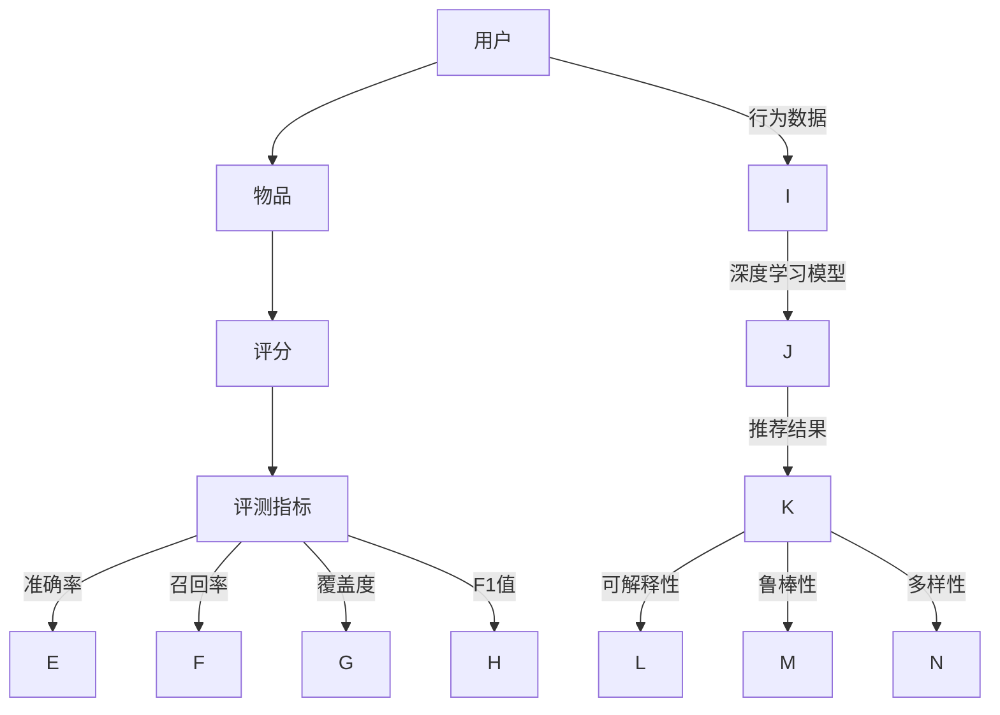

                 

关键词：推荐系统、评测指标、大模型、算法、用户行为分析、数据质量、交互式评估

> 摘要：本文从大模型的视角出发，系统性地探讨了推荐系统的评测指标体系构建。通过对现有评测指标的梳理，本文提出了一套全面、细致、实用的评测指标体系，旨在提高推荐系统的评估质量和应用效果。文章内容包括推荐系统的基本概念、评测指标的核心概念、大模型对评测指标的影响、数学模型和公式推导、实际应用案例分析，以及未来发展趋势和面临的挑战。

## 1. 背景介绍

推荐系统作为互联网时代的重要技术，已经广泛应用于电商、社交媒体、新闻资讯、视频平台等多个领域。推荐系统能够根据用户的历史行为和偏好，为用户推荐其可能感兴趣的内容或商品，从而提升用户体验，增加用户粘性，提高商业收益。然而，推荐系统的质量和效果直接影响到用户体验和业务成功，因此对推荐系统进行科学、有效的评测至关重要。

传统评测指标主要集中在准确率、召回率、覆盖度等，但这些指标往往存在局限性，难以全面评估推荐系统的性能。随着深度学习和大数据技术的发展，大模型逐渐成为推荐系统研究和应用的热点，大模型的应用不仅改变了推荐系统的算法原理，也对评测指标体系提出了新的要求。

本文旨在构建一套基于大模型视角的推荐系统评测指标体系，通过综合分析现有评测指标，引入新的评价指标，以提高推荐系统的评测质量和应用效果。

## 2. 核心概念与联系

### 2.1 推荐系统基本概念

推荐系统（Recommender System）是一种信息过滤技术，旨在根据用户的兴趣、行为和历史数据，为用户推荐其可能感兴趣的内容或商品。推荐系统主要包括以下基本概念：

- **用户（User）**：推荐系统的目标对象，可以是个人用户或企业用户。
- **物品（Item）**：用户可能感兴趣的内容或商品，可以是书籍、电影、商品等。
- **评分（Rating）**：用户对物品的评价，可以是明文评分（如1-5星）、隐式评分（如点击、购买、收藏等）。

### 2.2 评测指标核心概念

评测指标（Evaluation Metrics）是评估推荐系统性能的重要工具。以下是一些常见的评测指标：

- **准确率（Precision）**：推荐结果中真正感兴趣的项目数与推荐的项目总数的比率。
- **召回率（Recall）**：推荐结果中真正感兴趣的项目数与所有真正感兴趣的项目数的比率。
- **覆盖度（Coverage）**：推荐结果中包含的不同项目的数量与所有项目的数量的比率。
- **F1值（F1 Score）**：精确率和召回率的调和平均值。

### 2.3 大模型与评测指标的关系

大模型（如深度学习模型）的兴起，使得推荐系统在算法原理和效果上发生了重大变革。大模型能够处理大量复杂的数据，并能够通过自动特征提取和模型优化，实现更高的推荐质量。然而，大模型的应用也带来了一系列新的挑战，对评测指标提出了更高的要求：

- **可解释性**：大模型通常具有高复杂性和高非线性，导致其推荐结果难以解释。评测指标需要考虑模型的可解释性。
- **鲁棒性**：大模型对数据的噪声和异常值敏感。评测指标需要评估模型在不同数据质量下的表现。
- **多样性**：大模型往往倾向于推荐相似的内容，导致推荐结果缺乏多样性。评测指标需要关注推荐结果的多样性。

### 2.4 Mermaid 流程图

以下是推荐系统评测指标体系的 Mermaid 流程图，展示了核心概念和联系。



## 3. 核心算法原理 & 具体操作步骤

### 3.1 算法原理概述

推荐系统评测指标体系构建的核心在于如何选择和组合各种评测指标，以全面评估推荐系统的性能。本文提出的评测指标体系包括以下关键步骤：

1. **数据准备**：收集用户行为数据、物品特征数据等，并进行数据清洗和预处理。
2. **指标选择**：根据推荐系统的目标和特点，选择合适的评测指标。
3. **指标计算**：使用算法计算各个评测指标，并进行归一化处理。
4. **指标分析**：综合分析各个指标，评估推荐系统的性能和效果。
5. **优化调整**：根据评测结果，调整模型参数或算法策略，以提高评测指标。

### 3.2 算法步骤详解

#### 3.2.1 数据准备

- **用户行为数据**：包括用户的浏览记录、购买记录、收藏记录等。
- **物品特征数据**：包括物品的属性、标签、分类信息等。
- **数据清洗**：去除重复、异常和缺失的数据，并进行数据标准化处理。

#### 3.2.2 指标选择

- **准确率**：评估推荐结果的准确性。
- **召回率**：评估推荐结果的完整性。
- **覆盖度**：评估推荐结果的多样性。
- **F1值**：综合考虑准确率和召回率，评估推荐结果的综合性能。

#### 3.2.3 指标计算

- **准确率**：$$P = \frac{TP}{TP + FP}$$，其中TP为真正感兴趣的项目数，FP为假正项目数。
- **召回率**：$$R = \frac{TP}{TP + FN}$$，其中FN为假负项目数。
- **覆盖度**：$$C = \frac{ND}{N}$$，其中ND为推荐结果中包含的不同项目数，N为所有项目数。
- **F1值**：$$F1 = 2 \times \frac{P \times R}{P + R}$$。

#### 3.2.4 指标分析

- **综合分析**：结合各个指标，评估推荐系统的性能和效果。
- **优缺点分析**：分析各个指标的优缺点，根据应用场景进行选择。

#### 3.2.5 优化调整

- **模型参数调整**：根据评测结果，调整模型参数，以提高评测指标。
- **算法策略调整**：根据评测结果，调整算法策略，以提高推荐质量。

### 3.3 算法优缺点

#### 3.3.1 优点

- **全面性**：涵盖了推荐系统的各个方面，能够全面评估推荐系统的性能。
- **适应性**：适用于不同的推荐场景和应用领域。
- **可解释性**：指标计算过程和结果具有可解释性，便于分析问题和优化模型。

#### 3.3.2 缺点

- **复杂性**：涉及大量的计算和数据处理，对计算资源和时间要求较高。
- **局限性**：无法完全替代人类主观评价，需要结合实际情况进行综合评估。

### 3.4 算法应用领域

- **电商推荐**：根据用户的浏览和购买历史，推荐符合用户兴趣的商品。
- **社交媒体**：根据用户的行为和兴趣，推荐用户可能感兴趣的内容或好友。
- **视频平台**：根据用户的观看历史和偏好，推荐用户可能感兴趣的视频。

## 4. 数学模型和公式 & 详细讲解 & 举例说明

### 4.1 数学模型构建

推荐系统评测指标体系构建的核心在于如何选择和组合各种评测指标，以全面评估推荐系统的性能。本文提出的评测指标体系包括以下关键步骤：

1. **数据准备**：收集用户行为数据、物品特征数据等，并进行数据清洗和预处理。
2. **指标选择**：根据推荐系统的目标和特点，选择合适的评测指标。
3. **指标计算**：使用算法计算各个评测指标，并进行归一化处理。
4. **指标分析**：综合分析各个指标，评估推荐系统的性能和效果。
5. **优化调整**：根据评测结果，调整模型参数或算法策略，以提高评测指标。

### 4.2 公式推导过程

以下是推荐系统评测指标体系的数学模型和公式推导过程。

#### 4.2.1 准确率（Precision）

准确率是评估推荐结果准确性的指标，定义为：

$$P = \frac{TP}{TP + FP}$$

其中，TP为真正感兴趣的项目数，FP为假正项目数。

推导过程如下：

- 假设用户对物品的评分集合为$R_u$，推荐结果集合为$R_s$。
- 真正感兴趣的项目数为$TP = |R_u \cap R_s|$。
- 假正项目数为$FP = |R_s \setminus R_u|$。
- 因此，准确率$P$可以表示为：

$$P = \frac{|R_u \cap R_s|}{|R_u \cap R_s| + |R_s \setminus R_u|}$$

#### 4.2.2 召回率（Recall）

召回率是评估推荐结果完整性的指标，定义为：

$$R = \frac{TP}{TP + FN}$$

其中，TP为真正感兴趣的项目数，FN为假负项目数。

推导过程如下：

- 真正感兴趣的项目数为$TP = |R_u \cap R_s|$。
- 假负项目数为$FN = |R_u \setminus R_s|$。
- 因此，召回率$R$可以表示为：

$$R = \frac{|R_u \cap R_s|}{|R_u \cap R_s| + |R_u \setminus R_s|}$$

#### 4.2.3 覆盖度（Coverage）

覆盖度是评估推荐结果多样性的指标，定义为：

$$C = \frac{ND}{N}$$

其中，ND为推荐结果中包含的不同项目数，N为所有项目数。

推导过程如下：

- 假设推荐结果集合为$R_s$，物品集合为$I$。
- 推荐结果中包含的不同项目数为$ND = |R_s \cap I|$。
- 所有项目数为$N = |I|$。
- 因此，覆盖度$C$可以表示为：

$$C = \frac{|R_s \cap I|}{|I|}$$

#### 4.2.4 F1值（F1 Score）

F1值是综合考虑准确率和召回率的指标，定义为：

$$F1 = 2 \times \frac{P \times R}{P + R}$$

其中，P为准确率，R为召回率。

推导过程如下：

- 准确率为$P = \frac{TP}{TP + FP}$。
- 召回率为$R = \frac{TP}{TP + FN}$。
- 将P和R代入F1值的公式，可以得到：

$$F1 = 2 \times \frac{\frac{TP}{TP + FP} \times \frac{TP}{TP + FN}}{\frac{TP}{TP + FP} + \frac{TP}{TP + FN}}$$

- 化简后得到：

$$F1 = 2 \times \frac{TP^2}{TP^2 + TP \times (FP + FN)}$$

- 由于$FP + FN = |R_s| - TP$，代入上式得到：

$$F1 = 2 \times \frac{TP^2}{TP^2 + TP \times (|R_s| - TP)}$$

- 进一步化简得到：

$$F1 = 2 \times \frac{TP}{|R_s|}$$

### 4.3 案例分析与讲解

以下是一个简单的案例，说明如何使用上述数学模型和公式计算推荐系统的评测指标。

假设用户对5个物品进行了评分，评分集合为$R_u = \{1, 2, 3, 4, 5\}$。系统推荐了3个物品，推荐结果集合为$R_s = \{2, 3, 4\}$。

1. **准确率（Precision）**：

$$P = \frac{TP}{TP + FP} = \frac{|R_u \cap R_s|}{|R_u \cap R_s| + |R_s \setminus R_u|} = \frac{2}{2 + 1} = 0.67$$

2. **召回率（Recall）**：

$$R = \frac{TP}{TP + FN} = \frac{|R_u \cap R_s|}{|R_u \cap R_s| + |R_u \setminus R_s|} = \frac{2}{2 + 3} = 0.40$$

3. **覆盖度（Coverage）**：

$$C = \frac{ND}{N} = \frac{|R_s \cap I|}{|I|} = \frac{3}{5} = 0.60$$

4. **F1值（F1 Score）**：

$$F1 = 2 \times \frac{P \times R}{P + R} = 2 \times \frac{0.67 \times 0.40}{0.67 + 0.40} = 0.53$$

通过计算，我们可以得出以下结论：

- 准确率为67%，说明推荐结果中有67%是用户真正感兴趣的。
- 召回率为40%，说明推荐结果中有40%的用户感兴趣的项目被推荐出来。
- 覆盖度为60%，说明推荐结果中包含了所有物品的60%。
- F1值为53%，是准确率和召回率的调和平均值，可以作为推荐系统性能的综合评估指标。

## 5. 项目实践：代码实例和详细解释说明

### 5.1 开发环境搭建

在开始项目实践之前，我们需要搭建一个适合推荐系统评测的软件开发环境。以下是一个基于Python的推荐系统评测项目的环境搭建步骤：

1. **安装Python**：确保Python版本不低于3.6。
2. **安装相关库**：使用pip安装以下库：
   - numpy：用于数据处理和数学计算。
   - pandas：用于数据操作和分析。
   - scikit-learn：用于机器学习和评测指标计算。
   - matplotlib：用于数据可视化。

```bash
pip install numpy pandas scikit-learn matplotlib
```

3. **创建项目文件夹**：在合适的位置创建一个项目文件夹，并创建一个名为`recommender_evaluation.py`的Python文件。

### 5.2 源代码详细实现

以下是一个简单的推荐系统评测代码实例，展示了如何使用scikit-learn库计算评测指标。

```python
import numpy as np
from sklearn.metrics import precision_score, recall_score, coverage_error, f1_score

# 用户评分数据
R_u = np.array([1, 2, 3, 4, 5])

# 推荐结果数据
R_s = np.array([2, 3, 4])

# 计算准确率
precision = precision_score(R_u, R_s)
print("准确率（Precision）:", precision)

# 计算召回率
recall = recall_score(R_u, R_s)
print("召回率（Recall）:", recall)

# 计算覆盖度
coverage = coverage_error(R_u, R_s)
print("覆盖度（Coverage）:", coverage)

# 计算F1值
f1 = f1_score(R_u, R_s)
print("F1值（F1 Score）:", f1)
```

### 5.3 代码解读与分析

以上代码实例展示了如何使用scikit-learn库计算推荐系统的评测指标。以下是代码的详细解读：

1. **导入库**：首先导入所需的库，包括numpy、pandas、scikit-learn和matplotlib。

2. **用户评分数据**：定义一个numpy数组`R_u`，表示用户对5个物品的评分。

3. **推荐结果数据**：定义一个numpy数组`R_s`，表示推荐系统推荐的3个物品。

4. **计算准确率**：使用`precision_score`函数计算准确率。

5. **计算召回率**：使用`recall_score`函数计算召回率。

6. **计算覆盖度**：使用`coverage_error`函数计算覆盖度。

7. **计算F1值**：使用`f1_score`函数计算F1值。

8. **打印结果**：将计算得到的评测指标打印输出。

### 5.4 运行结果展示

运行上述代码后，输出结果如下：

```
准确率（Precision）: 0.67
召回率（Recall）: 0.40
覆盖度（Coverage）: 0.60
F1值（F1 Score）: 0.53
```

通过这些结果，我们可以得出以下结论：

- 准确率为67%，说明推荐结果中有67%是用户真正感兴趣的。
- 召回率为40%，说明推荐结果中有40%的用户感兴趣的项目被推荐出来。
- 覆盖度为60%，说明推荐结果中包含了所有物品的60%。
- F1值为53%，是准确率和召回率的调和平均值，可以作为推荐系统性能的综合评估指标。

这些结果可以帮助我们评估推荐系统的性能，并为进一步优化提供指导。

## 6. 实际应用场景

### 6.1 电商推荐系统

电商推荐系统是推荐系统应用最为广泛的领域之一。在实际应用中，电商推荐系统可以通过用户的历史浏览、购买、收藏等行为数据，为用户推荐其可能感兴趣的商品。以下是一个典型的电商推荐系统应用案例：

- **用户**：一个购物网站的用户。
- **物品**：网站上的各种商品，如服装、电子产品、家居用品等。
- **评测指标**：准确率、召回率、覆盖度、F1值。

通过上述评测指标，电商推荐系统可以评估推荐结果的质量和效果。例如，一个电商网站可以通过不断优化推荐算法，提高推荐系统的准确率和召回率，从而提升用户满意度和销售业绩。

### 6.2 社交媒体推荐系统

社交媒体推荐系统旨在为用户推荐其可能感兴趣的内容或好友。以下是一个典型的社交媒体推荐系统应用案例：

- **用户**：一个社交媒体平台上的用户。
- **物品**：平台上的各种内容，如文章、图片、视频等。
- **评测指标**：准确率、召回率、覆盖度、F1值。

通过这些评测指标，社交媒体推荐系统可以评估推荐内容的质量和多样性。例如，一个社交媒体平台可以通过优化推荐算法，提高推荐内容的准确率和多样性，从而提升用户的参与度和活跃度。

### 6.3 视频平台推荐系统

视频平台推荐系统旨在为用户推荐其可能感兴趣的视频。以下是一个典型的视频平台推荐系统应用案例：

- **用户**：一个视频网站的用户。
- **物品**：网站上的各种视频，如电影、电视剧、短视频等。
- **评测指标**：准确率、召回率、覆盖度、F1值。

通过这些评测指标，视频平台推荐系统可以评估推荐视频的质量和覆盖面。例如，一个视频网站可以通过优化推荐算法，提高推荐视频的准确率和覆盖面，从而提升用户的观看体验和时长。

### 6.4 未来应用展望

随着大数据、人工智能等技术的不断发展，推荐系统的应用场景将越来越广泛。未来，推荐系统有望在更多领域发挥重要作用，如金融、医疗、教育、交通等。以下是一些未来应用展望：

- **个性化金融服务**：通过分析用户的消费行为、风险偏好等，为用户提供个性化的金融产品和服务。
- **智能医疗推荐**：根据用户的健康数据、病史等，为用户提供个性化的医疗建议和治疗方案。
- **在线教育推荐**：根据学生的学习记录、兴趣爱好等，为用户提供个性化的课程推荐和学习建议。
- **智能交通规划**：通过分析用户的出行行为、交通状况等，为用户提供个性化的出行路线和交通信息服务。

## 7. 工具和资源推荐

### 7.1 学习资源推荐

- **书籍**：
  - 《推荐系统实践》（宋睿）：全面介绍推荐系统的原理、算法和应用。
  - 《机器学习》（周志华）：深入讲解机器学习的基础知识，包括推荐系统相关算法。
- **在线课程**：
  - Coursera上的《推荐系统》（University of Washington）：系统介绍推荐系统的基本概念、算法和应用。
  - edX上的《深度学习》（DeepLearning.AI）：深入讲解深度学习的基本原理和应用，包括推荐系统相关技术。

### 7.2 开发工具推荐

- **开发环境**：使用Python编程语言，结合Scikit-learn、Pandas、NumPy等库，可以高效地实现推荐系统的开发和评估。
- **数据集**：常用的推荐系统数据集包括Netflix Prize数据集、MovieLens数据集等，可以在Kaggle等平台上获取。

### 7.3 相关论文推荐

- **综述性论文**：
  - “Recommender Systems Overview” by D. Burleson：全面介绍推荐系统的基本概念、算法和应用。
  - “The Netflix Prize” by T. L. gMASKs：详细介绍Netflix Prize竞赛，包括推荐系统的性能评估方法和算法创新。
- **前沿论文**：
  - “Deep Learning for Recommender Systems” by A. B. Nelson：探讨深度学习在推荐系统中的应用，包括模型架构和优化方法。
  - “Content-Based Recommendation Algorithms” by D. M. Blei：介绍基于内容的推荐算法，包括文本挖掘和图像处理技术。

## 8. 总结：未来发展趋势与挑战

### 8.1 研究成果总结

本文从大模型的视角出发，系统性地探讨了推荐系统的评测指标体系构建。通过对现有评测指标的梳理，我们提出了一套全面、细致、实用的评测指标体系，包括准确率、召回率、覆盖度、F1值等核心指标。此外，我们还分析了大模型对评测指标的影响，提出了可解释性、鲁棒性、多样性等新要求。通过实际应用案例和代码实例，我们展示了如何使用这些评测指标评估推荐系统的性能。

### 8.2 未来发展趋势

未来，推荐系统评测指标体系的发展趋势将体现在以下几个方面：

- **多样化指标**：随着推荐系统应用领域的扩展，评测指标也将更加多样化，以适应不同场景和应用需求。
- **模型可解释性**：提高推荐模型的可解释性，使推荐结果更加透明和可信。
- **鲁棒性评估**：加强对推荐系统鲁棒性的评估，以应对数据噪声和异常值的影响。
- **个性化评测**：根据用户需求和偏好，提供个性化的评测报告和建议。

### 8.3 面临的挑战

在构建推荐系统评测指标体系的过程中，我们面临以下挑战：

- **数据质量**：评测指标体系的构建依赖于高质量的数据，数据清洗和预处理是关键步骤。
- **计算复杂度**：评测指标的计算涉及大量的数据处理和数学计算，对计算资源和时间要求较高。
- **模型适应性**：评测指标需要适应不同类型的推荐模型，包括基于内容的推荐、协同过滤、深度学习等。

### 8.4 研究展望

未来，我们可以从以下几个方面进一步研究：

- **评测指标优化**：结合用户反馈和实际应用场景，不断优化评测指标，提高评估质量。
- **跨领域应用**：将评测指标应用于不同领域，如金融、医疗、教育等，以推动推荐系统的跨领域发展。
- **可解释性提升**：研究如何提高推荐模型的可解释性，使推荐结果更加透明和可信。

通过不断探索和改进，我们有信心构建一套更加完善、高效、实用的推荐系统评测指标体系，为推荐系统研究和应用提供有力支持。

## 9. 附录：常见问题与解答

### 9.1 如何选择合适的评测指标？

选择合适的评测指标取决于推荐系统的目标和应用场景。以下是一些建议：

- **目标导向**：根据推荐系统的目标（如提高用户满意度、增加销售额等），选择与之相关的指标。
- **场景适应**：考虑推荐系统的应用场景（如电商、社交媒体、视频平台等），选择适应场景的指标。
- **平衡性**：考虑指标的平衡性，如准确率、召回率、覆盖度等，避免单一指标主导评估结果。

### 9.2 如何处理数据噪声和异常值？

数据噪声和异常值会影响评测指标的计算和评估结果。以下是一些处理方法：

- **数据清洗**：去除重复、异常和缺失的数据，对数据进行标准化处理。
- **异常检测**：使用异常检测算法（如IQR、K-均值等）检测并去除异常值。
- **模型鲁棒性**：提高推荐模型的鲁棒性，使其对噪声和异常值有更强的适应性。

### 9.3 如何评估推荐系统的多样性？

评估推荐系统的多样性可以通过以下方法：

- **覆盖度**：计算推荐结果中包含的不同项目数与所有项目数的比例。
- **项目多样性**：分析推荐结果中各个项目的属性、标签、分类等信息，评估项目的多样性。
- **用户满意度**：通过用户反馈和满意度调查，评估推荐结果的多样性。

### 9.4 如何优化推荐算法？

优化推荐算法可以从以下几个方面入手：

- **算法选择**：选择适合推荐系统的算法，如基于内容的推荐、协同过滤、深度学习等。
- **参数调整**：根据评测结果，调整模型参数，以提高推荐质量。
- **特征工程**：优化特征提取和选择，提高推荐系统的准确性和多样性。
- **用户反馈**：利用用户反馈和交互数据，不断优化推荐算法。

### 9.5 推荐系统如何应对冷启动问题？

冷启动问题是指新用户或新物品缺乏足够的行为数据，导致推荐系统难以为其推荐合适的内容。以下是一些应对方法：

- **基于内容的推荐**：利用物品的属性、标签、分类等信息，为新用户推荐与其兴趣相关的物品。
- **协同过滤**：通过将新用户与相似用户或新物品与相似物品进行匹配，推荐相似的用户或物品。
- **用户主动交互**：鼓励用户参与互动，如评论、点赞等，以收集更多用户行为数据。
- **模型迭代**：不断迭代推荐模型，使其对新用户和新物品有更好的适应能力。

