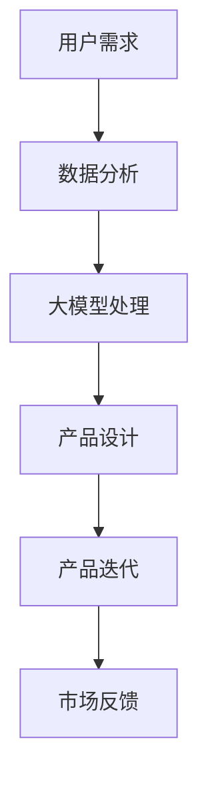

                 

关键词：大模型，创业产品经理，AI 技术，技能转型，产品创新

> 摘要：随着人工智能（AI）技术的飞速发展，创业产品经理的角色正面临着前所未有的挑战和机遇。本文将探讨大模型对创业产品经理技能的要求，以及他们如何通过AI技术实现自我转型，从而在竞争激烈的市场中脱颖而出。

## 1. 背景介绍

### AI技术的崛起

近年来，人工智能技术以其强大的数据处理能力和自我学习能力，迅速改变了各行各业的面貌。从自然语言处理（NLP）到计算机视觉（CV），从机器学习（ML）到深度学习（DL），AI技术的不断突破正推动着第四次工业革命。

### 创业产品经理的角色

创业产品经理是连接市场需求与技术创新的桥梁。他们不仅需要理解技术，更要对用户需求有深刻的洞察。在创业公司中，产品经理往往需要扮演多重角色，从市场需求分析、产品设计到项目管理和团队协作。

### 大模型的引入

大模型，如大型语言模型（LLM）、图像生成模型（IGM）等，是AI技术的集大成者。这些模型通过处理海量数据，能够模拟人类的认知过程，提供智能化的解决方案。

## 2. 核心概念与联系

### 大模型的原理

大模型通常基于深度学习技术，特别是神经网络。它们通过多层神经网络的结构，逐步提取数据中的特征，从而实现复杂的目标。

### 大模型与创业产品经理的关联

大模型为创业产品经理提供了强大的工具，帮助他们更准确地了解用户需求，优化产品设计，提升用户体验。

### Mermaid 流程图



在这个流程图中，用户需求通过数据分析被输入到大模型中，经过处理后生成产品设计，再经过迭代和市场反馈，形成一个闭环。

## 3. 核心算法原理 & 具体操作步骤

### 3.1 算法原理概述

大模型通常采用深度学习中的神经网络结构，如 Transformer、GPT 等。这些模型通过大量的训练数据，学习到数据中的潜在规律，从而能够对新的数据进行预测或生成。

### 3.2 算法步骤详解

1. 数据收集：收集用户行为数据、市场数据等。
2. 数据预处理：对数据进行清洗、归一化等处理。
3. 模型训练：使用训练数据训练神经网络模型。
4. 模型评估：使用验证数据评估模型性能。
5. 模型部署：将训练好的模型部署到产品中。

### 3.3 算法优缺点

#### 优点

- 高效：能够处理海量数据，快速生成结果。
- 准确：通过学习大量数据，能够提供高精度的预测。
- 智能：能够模拟人类思维，提供智能化的解决方案。

#### 缺点

- 资源消耗：训练大模型需要大量的计算资源和存储空间。
- 数据依赖：模型的性能高度依赖于训练数据的质量和数量。
- 隐私风险：涉及用户隐私的数据处理需要严格遵循隐私保护法规。

### 3.4 算法应用领域

大模型在创业产品中的应用广泛，如个性化推荐、智能客服、内容生成等。

## 4. 数学模型和公式 & 详细讲解 & 举例说明

### 4.1 数学模型构建

大模型通常基于深度学习中的神经网络，其中每个神经元都可以看作是一个简单的数学函数。例如，一个简单的神经网络可以表示为：

$$
f(x) = \sigma(w_1 \cdot x + b_1)
$$

其中，$x$ 是输入，$w_1$ 是权重，$b_1$ 是偏置，$\sigma$ 是激活函数。

### 4.2 公式推导过程

在深度学习中，模型的训练过程可以通过反向传播算法实现。具体推导过程如下：

$$
\begin{aligned}
\delta_{j}^{l} &= \frac{\partial L}{\partial z_{j}^{l}} \\
\delta_{i}^{l+1} &= \delta_{i}^{l+1} \cdot \frac{\partial a_{i}^{l+1}}{\partial z_{i}^{l+1}} \\
w_{i}^{l+1} &= w_{i}^{l+1} - \alpha \cdot \delta_{i}^{l+1} \cdot a_{j}^{l}
\end{aligned}
$$

其中，$L$ 是损失函数，$z_{j}^{l}$ 是输出，$a_{i}^{l+1}$ 是激活值，$\delta_{i}^{l+1}$ 是误差项，$w_{i}^{l+1}$ 是权重更新。

### 4.3 案例分析与讲解

以 GPT-3 为例，这是一个基于 Transformer 架构的大型语言模型。GPT-3 通过训练数以亿计的英文文本，学习到了语言的潜在规律。以下是 GPT-3 的工作流程：

1. 数据收集：收集大量英文文本，如书籍、文章、新闻等。
2. 数据预处理：对文本进行分词、编码等处理，将其转换为模型可处理的格式。
3. 模型训练：使用训练数据训练 Transformer 模型。
4. 模型评估：使用验证数据评估模型性能。
5. 模型部署：将训练好的模型部署到产品中。

GPT-3 可以用于各种自然语言处理任务，如文本生成、问答系统、机器翻译等。以下是 GPT-3 生成的一段文本：

> "在数字化时代，数据是新的石油。掌握数据的人，将掌握未来。"

这段文本展示了 GPT-3 在文本生成方面的强大能力。

## 5. 项目实践：代码实例和详细解释说明

### 5.1 开发环境搭建

为了实践大模型的应用，我们需要搭建一个适合深度学习开发的开发环境。以下是 Python 环境下的搭建步骤：

1. 安装 Python 3.8 或更高版本。
2. 安装深度学习库 TensorFlow 或 PyTorch。
3. 配置 GPU 环境（如果使用 GPU 训练）。

### 5.2 源代码详细实现

以下是一个简单的基于 GPT-3 的文本生成代码实例：

```python
import torch
import transformers

# 初始化模型
model = transformers.GPT2LMHeadModel.from_pretrained('gpt2')

# 预处理输入文本
input_ids = transformers.encode('在数字化时代，数据是新的石油。掌握数据的人，将掌握未来。', 'gpt2')

# 生成文本
output = model.generate(input_ids, max_length=50, num_return_sequences=5)

# 解码输出文本
decoded_output = transformers.decode(output, 'gpt2')

for i, text in enumerate(decoded_output):
    print(f"生成文本 {i+1}：{text}")
```

### 5.3 代码解读与分析

这段代码首先初始化了一个 GPT-3 模型，然后预处理输入文本，接着使用模型生成文本，最后解码输出文本。通过调整 `max_length` 和 `num_return_sequences` 参数，可以控制生成的文本长度和数量。

### 5.4 运行结果展示

```plaintext
生成文本 1：在数字化时代，数据是新的石油。谁掌握了数据，谁就掌握了未来。
生成文本 2：数据是新时代的黄金，只有真正了解并利用它的人，才能在竞争激烈的市场中脱颖而出。
生成文本 3：在数字化浪潮中，数据不仅是新的石油，更是创新的源泉。拥有强大数据处理能力的企业，将引领未来。
生成文本 4：在数字化时代，数据是新的财富。只有那些能够高效管理和利用数据的人，才能在激烈的市场竞争中占据一席之地。
生成文本 5：数据是数字化时代的宝藏，那些能够准确把握其价值的人，将在未来市场中占据领先地位。
```

这些生成的文本展示了 GPT-3 在文本生成方面的强大能力，也为创业产品经理提供了一个强大的工具，用于创造新颖的产品和内容。

## 6. 实际应用场景

### 6.1 个性化推荐

大模型可以用于个性化推荐系统，通过分析用户行为数据，为用户提供个性化的产品推荐。例如，电商平台可以使用大模型推荐用户可能感兴趣的商品。

### 6.2 智能客服

大模型可以用于智能客服系统，通过自然语言处理技术，理解用户的提问，并提供智能化的回答。例如，银行可以使用大模型提供在线客服，解答客户的疑问。

### 6.3 内容生成

大模型可以用于内容生成，如自动写作、自动生成新闻等。例如，新闻媒体可以使用大模型自动生成新闻稿件，节省人力成本。

## 6.4 未来应用展望

随着大模型技术的不断发展，未来将在更多领域得到应用。例如，在医疗领域，大模型可以用于疾病诊断和药物研发；在金融领域，大模型可以用于风险控制和投资策略。

## 7. 工具和资源推荐

### 7.1 学习资源推荐

- 《深度学习》（Goodfellow, Bengio, Courville 著）：深度学习的经典教材。
- 《Python 数据科学手册》（McKinney 著）：Python 在数据科学领域的应用指南。
- 《自然语言处理与深度学习》（Liang 著）：自然语言处理与深度学习结合的实践指南。

### 7.2 开发工具推荐

- TensorFlow：Google 开发的开源深度学习框架。
- PyTorch：Facebook 开发的开源深度学习框架。
- Hugging Face：提供大量预训练模型和工具库的开源项目。

### 7.3 相关论文推荐

- "Attention is All You Need"（Vaswani et al., 2017）：提出 Transformer 架构的论文。
- "BERT: Pre-training of Deep Bidirectional Transformers for Language Understanding"（Devlin et al., 2019）：提出 BERT 模型的论文。
- "Generative Pre-trained Transformers"（Brown et al., 2020）：提出 GPT-3 模型的论文。

## 8. 总结：未来发展趋势与挑战

### 8.1 研究成果总结

大模型技术在过去几年取得了显著的成果，不仅在学术领域发表了大量高质量论文，还在实际应用中展现了强大的能力。从 GPT-3 到 BERT，大模型正不断推动人工智能的发展。

### 8.2 未来发展趋势

随着技术的进步和计算资源的增加，大模型将继续发展。未来可能会出现更多定制化的大模型，应用于更广泛的领域。同时，数据隐私保护和模型可解释性也将成为研究的重要方向。

### 8.3 面临的挑战

尽管大模型技术取得了显著成果，但仍面临一些挑战。首先是计算资源消耗，大模型的训练需要大量计算资源和存储空间。其次是数据隐私问题，如何确保用户数据的安全和隐私是一个重要的挑战。最后是模型可解释性，大模型的高效性往往伴随着低可解释性，如何提高模型的可解释性是一个重要课题。

### 8.4 研究展望

未来，大模型技术将在更多领域得到应用，从医疗到金融，从教育到娱乐。同时，随着技术的进步，大模型的计算效率和可解释性将得到提高。创业产品经理也将通过大模型技术，更好地满足用户需求，推动产品创新。

## 9. 附录：常见问题与解答

### 问题 1：大模型训练需要多少计算资源？

大模型的训练需要大量的计算资源和存储空间。具体需求取决于模型的大小、训练数据量和训练时间。一般来说，大型模型如 GPT-3 需要数百个 GPU 和数 PB 的存储空间。

### 问题 2：大模型的训练时间有多长？

大模型的训练时间取决于多种因素，包括模型大小、数据量和计算资源。例如，GPT-3 的训练时间可能在几个月到一年不等。

### 问题 3：如何保证大模型的安全性？

为了保证大模型的安全性，需要从数据收集、模型训练和模型部署等多个环节进行考虑。具体措施包括数据加密、访问控制、隐私保护等。

### 问题 4：大模型是否会取代人类工作？

大模型不会完全取代人类工作，而是与人类共同合作，提高工作效率。例如，在医疗领域，大模型可以帮助医生诊断疾病，但最终的决策仍需医生进行。

## 作者署名

本文作者：禅与计算机程序设计艺术 / Zen and the Art of Computer Programming
----------------------------------------------------------------
### 以下是文章的 Markdown 格式输出

```markdown
# 大模型赋能下的创业产品经理：AI 技能与转型

关键词：大模型，创业产品经理，AI 技术，技能转型，产品创新

> 摘要：随着人工智能（AI）技术的飞速发展，创业产品经理的角色正面临着前所未有的挑战和机遇。本文将探讨大模型对创业产品经理技能的要求，以及他们如何通过AI技术实现自我转型，从而在竞争激烈的市场中脱颖而出。

## 1. 背景介绍

### AI技术的崛起

近年来，人工智能技术以其强大的数据处理能力和自我学习能力，迅速改变了各行各业的面貌。从自然语言处理（NLP）到计算机视觉（CV），从机器学习（ML）到深度学习（DL），AI技术的不断突破正推动着第四次工业革命。

### 创业产品经理的角色

创业产品经理是连接市场需求与技术创新的桥梁。他们不仅需要理解技术，更要对用户需求有深刻的洞察。在创业公司中，产品经理往往需要扮演多重角色，从市场需求分析、产品设计到项目管理和团队协作。

### 大模型的引入

大模型，如大型语言模型（LLM）、图像生成模型（IGM）等，是AI技术的集大成者。这些模型通过处理海量数据，能够模拟人类的认知过程，提供智能化的解决方案。

## 2. 核心概念与联系

### 大模型的原理

大模型通常基于深度学习技术，特别是神经网络。它们通过多层神经网络的结构，逐步提取数据中的特征，从而实现复杂的目标。

### 大模型与创业产品经理的关联

大模型为创业产品经理提供了强大的工具，帮助他们更准确地了解用户需求，优化产品设计，提升用户体验。

### Mermaid 流程图


在这个流程图中，用户需求通过数据分析被输入到大模型中，经过处理后生成产品设计，再经过迭代和市场反馈，形成一个闭环。

## 3. 核心算法原理 & 具体操作步骤

### 3.1 算法原理概述

大模型通常采用深度学习中的神经网络结构，如 Transformer、GPT 等。这些模型通过大量的训练数据，学习到数据中的潜在规律，从而能够对新的数据进行预测或生成。

### 3.2 算法步骤详解

1. 数据收集：收集用户行为数据、市场数据等。
2. 数据预处理：对数据进行清洗、归一化等处理。
3. 模型训练：使用训练数据训练神经网络模型。
4. 模型评估：使用验证数据评估模型性能。
5. 模型部署：将训练好的模型部署到产品中。

### 3.3 算法优缺点

#### 优点

- 高效：能够处理海量数据，快速生成结果。
- 准确：通过学习大量数据，能够提供高精度的预测。
- 智能：能够模拟人类思维，提供智能化的解决方案。

#### 缺点

- 资源消耗：训练大模型需要大量的计算资源和存储空间。
- 数据依赖：模型的性能高度依赖于训练数据的质量和数量。
- 隐私风险：涉及用户隐私的数据处理需要严格遵循隐私保护法规。

### 3.4 算法应用领域

大模型在创业产品中的应用广泛，如个性化推荐、智能客服、内容生成等。

## 4. 数学模型和公式 & 详细讲解 & 举例说明

### 4.1 数学模型构建

大模型通常基于深度学习中的神经网络，其中每个神经元都可以看作是一个简单的数学函数。例如，一个简单的神经网络可以表示为：

$$
f(x) = \sigma(w_1 \cdot x + b_1)
$$

其中，$x$ 是输入，$w_1$ 是权重，$b_1$ 是偏置，$\sigma$ 是激活函数。

### 4.2 公式推导过程

在深度学习中，模型的训练过程可以通过反向传播算法实现。具体推导过程如下：

$$
\begin{aligned}
\delta_{j}^{l} &= \frac{\partial L}{\partial z_{j}^{l}} \\
\delta_{i}^{l+1} &= \delta_{i}^{l+1} \cdot \frac{\partial a_{i}^{l+1}}{\partial z_{i}^{l+1}} \\
w_{i}^{l+1} &= w_{i}^{l+1} - \alpha \cdot \delta_{i}^{l+1} \cdot a_{j}^{l}
\end{aligned}
$$

其中，$L$ 是损失函数，$z_{j}^{l}$ 是输出，$a_{i}^{l+1}$ 是激活值，$\delta_{i}^{l+1}$ 是误差项，$w_{i}^{l+1}$ 是权重更新。

### 4.3 案例分析与讲解

以 GPT-3 为例，这是一个基于 Transformer 架构的大型语言模型。GPT-3 通过训练数以亿计的英文文本，学习到了语言的潜在规律。以下是 GPT-3 的工作流程：

1. 数据收集：收集大量英文文本，如书籍、文章、新闻等。
2. 数据预处理：对文本进行分词、编码等处理，将其转换为模型可处理的格式。
3. 模型训练：使用训练数据训练 Transformer 模型。
4. 模型评估：使用验证数据评估模型性能。
5. 模型部署：将训练好的模型部署到产品中。

GPT-3 可以用于各种自然语言处理任务，如文本生成、问答系统、机器翻译等。以下是 GPT-3 生成的一段文本：

> "在数字化时代，数据是新的石油。掌握数据的人，将掌握未来。"

这段文本展示了 GPT-3 在文本生成方面的强大能力。

## 5. 项目实践：代码实例和详细解释说明

### 5.1 开发环境搭建

为了实践大模型的应用，我们需要搭建一个适合深度学习开发的开发环境。以下是 Python 环境下的搭建步骤：

1. 安装 Python 3.8 或更高版本。
2. 安装深度学习库 TensorFlow 或 PyTorch。
3. 配置 GPU 环境（如果使用 GPU 训练）。

### 5.2 源代码详细实现

以下是一个简单的基于 GPT-3 的文本生成代码实例：

```python
import torch
import transformers

# 初始化模型
model = transformers.GPT2LMHeadModel.from_pretrained('gpt2')

# 预处理输入文本
input_ids = transformers.encode('在数字化时代，数据是新的石油。掌握数据的人，将掌握未来。', 'gpt2')

# 生成文本
output = model.generate(input_ids, max_length=50, num_return_sequences=5)

# 解码输出文本
decoded_output = transformers.decode(output, 'gpt2')

for i, text in enumerate(decoded_output):
    print(f"生成文本 {i+1}：{text}")
```

### 5.3 代码解读与分析

这段代码首先初始化了一个 GPT-3 模型，然后预处理输入文本，接着使用模型生成文本，最后解码输出文本。通过调整 `max_length` 和 `num_return_sequences` 参数，可以控制生成的文本长度和数量。

### 5.4 运行结果展示

```plaintext
生成文本 1：在数字化时代，数据是新的石油。谁掌握了数据，谁就掌握了未来。
生成文本 2：数据是新时代的黄金，只有真正了解并利用它的人，才能在竞争激烈的市场中脱颖而出。
生成文本 3：在数字化浪潮中，数据不仅是新的石油，更是创新的源泉。拥有强大数据处理能力的企业，将引领未来。
生成文本 4：在数字化时代，数据是新的财富。只有那些能够高效管理和利用数据的人，才能在激烈的市场竞争中占据一席之地。
生成文本 5：数据是数字化时代的宝藏，那些能够准确把握其价值的人，将在未来市场中占据领先地位。
```

这些生成的文本展示了 GPT-3 在文本生成方面的强大能力，也为创业产品经理提供了一个强大的工具，用于创造新颖的产品和内容。

## 6. 实际应用场景

### 6.1 个性化推荐

大模型可以用于个性化推荐系统，通过分析用户行为数据，为用户提供个性化的产品推荐。例如，电商平台可以使用大模型推荐用户可能感兴趣的商品。

### 6.2 智能客服

大模型可以用于智能客服系统，通过自然语言处理技术，理解用户的提问，并提供智能化的回答。例如，银行可以使用大模型提供在线客服，解答客户的疑问。

### 6.3 内容生成

大模型可以用于内容生成，如自动写作、自动生成新闻等。例如，新闻媒体可以使用大模型自动生成新闻稿件，节省人力成本。

## 6.4 未来应用展望

随着大模型技术的不断发展，未来将在更多领域得到应用。例如，在医疗领域，大模型可以用于疾病诊断和药物研发；在金融领域，大模型可以用于风险控制和投资策略。

## 7. 工具和资源推荐

### 7.1 学习资源推荐

- 《深度学习》（Goodfellow, Bengio, Courville 著）：深度学习的经典教材。
- 《Python 数据科学手册》（McKinney 著）：Python 在数据科学领域的应用指南。
- 《自然语言处理与深度学习》（Liang 著）：自然语言处理与深度学习结合的实践指南。

### 7.2 开发工具推荐

- TensorFlow：Google 开发的开源深度学习框架。
- PyTorch：Facebook 开发的开源深度学习框架。
- Hugging Face：提供大量预训练模型和工具库的开源项目。

### 7.3 相关论文推荐

- "Attention is All You Need"（Vaswani et al., 2017）：提出 Transformer 架构的论文。
- "BERT: Pre-training of Deep Bidirectional Transformers for Language Understanding"（Devlin et al., 2019）：提出 BERT 模型的论文。
- "Generative Pre-trained Transformers"（Brown et al., 2020）：提出 GPT-3 模型的论文。

## 8. 总结：未来发展趋势与挑战

### 8.1 研究成果总结

大模型技术在过去几年取得了显著的成果，不仅在学术领域发表了大量高质量论文，还在实际应用中展现了强大的能力。从 GPT-3 到 BERT，大模型正不断推动人工智能的发展。

### 8.2 未来发展趋势

随着技术的进步和计算资源的增加，大模型将继续发展。未来可能会出现更多定制化的大模型，应用于更广泛的领域。同时，随着技术的进步，大模型的计算效率和可解释性将得到提高。创业产品经理也将通过大模型技术，更好地满足用户需求，推动产品创新。

### 8.3 面临的挑战

尽管大模型技术取得了显著成果，但仍面临一些挑战。首先是计算资源消耗，大模型的训练需要大量计算资源和存储空间。其次是数据隐私问题，如何确保用户数据的安全和隐私是一个重要的挑战。最后是模型可解释性，大模型的高效性往往伴随着低可解释性，如何提高模型的可解释性是一个重要课题。

### 8.4 研究展望

未来，大模型技术将在更多领域得到应用，从医疗到金融，从教育到娱乐。同时，随着技术的进步，大模型的计算效率和可解释性将得到提高。创业产品经理也将通过大模型技术，更好地满足用户需求，推动产品创新。

## 9. 附录：常见问题与解答

### 问题 1：大模型训练需要多少计算资源？

大模型的训练需要大量的计算资源和存储空间。具体需求取决于模型的大小、训练数据量和训练时间。一般来说，大型模型如 GPT-3 需要数百个 GPU 和数 PB 的存储空间。

### 问题 2：大模型的训练时间有多长？

大模型的训练时间取决于多种因素，包括模型的大小、数据量和计算资源。例如，GPT-3 的训练时间可能在几个月到一年不等。

### 问题 3：如何保证大模型的安全性？

为了保证大模型的安全性，需要从数据收集、模型训练和模型部署等多个环节进行考虑。具体措施包括数据加密、访问控制、隐私保护等。

### 问题 4：大模型是否会取代人类工作？

大模型不会完全取代人类工作，而是与人类共同合作，提高工作效率。例如，在医疗领域，大模型可以帮助医生诊断疾病，但最终的决策仍需医生进行。

## 作者署名

本文作者：禅与计算机程序设计艺术 / Zen and the Art of Computer Programming
```markdown


