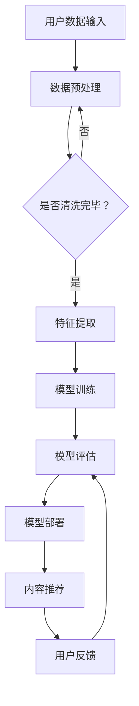

                 

关键词：大模型、智能内容个性化、媒体行业、AI技术、算法、数学模型、实践应用

> 摘要：本文将探讨大模型赋能的智能内容个性化技术，以及其在媒体行业中的应用。我们将详细分析大模型的原理、核心算法、数学模型，并通过实际项目实践展示其应用效果，最后展望这一技术在未来的发展趋势与挑战。

## 1. 背景介绍

近年来，人工智能（AI）技术的快速发展，特别是深度学习与大数据分析的结合，推动了许多行业发生了深刻的变革。在媒体行业，个性化推荐系统已经成为提高用户体验、增加用户粘性的关键工具。传统的推荐系统依赖于用户历史行为和内容特征，但往往难以捕捉到用户深层次的兴趣和偏好。

大模型的兴起为智能内容个性化提供了新的可能性。大模型，通常是指拥有数亿甚至千亿个参数的深度学习模型，它们能够通过海量数据的学习，捕捉到复杂的数据特征，从而实现更精准的内容推荐。这类模型不仅包括经典的神经网络架构，如Transformer、BERT等，还包括最近发展的预训练模型，如GPT-3、LLaMA等。

媒体行业的个性化推荐需求主要集中在以下几个方面：

1. **个性化内容推荐**：根据用户的兴趣和偏好，推荐用户可能感兴趣的新闻、视频、文章等内容。
2. **精准广告投放**：基于用户的行为数据，精准投放广告，提高广告点击率和转化率。
3. **内容生成**：利用大模型生成符合用户兴趣的内容，如文章、短视频等。

本文将围绕上述需求，深入探讨大模型赋能的智能内容个性化技术，为媒体行业提供新的解决方案。

## 2. 核心概念与联系

### 大模型的定义与原理

大模型是指那些具有数十亿甚至千亿个参数的深度学习模型。这些模型通过训练大量的数据，可以自动提取数据中的复杂特征，从而实现高度准确的预测和分类。大模型的原理基于神经网络的架构，通过多层神经元的堆叠，模型能够学习到更高级别的抽象特征。


### 智能内容个性化的核心算法

智能内容个性化主要依赖于以下几个核心算法：

1. **协同过滤（Collaborative Filtering）**：通过分析用户的行为数据（如浏览、点赞、购买等），为用户推荐相似用户喜欢的内容。
2. **基于内容的推荐（Content-based Filtering）**：根据用户的历史偏好和内容特征，推荐相似的内容。
3. **深度学习推荐（Deep Learning for Recommendation）**：利用深度学习模型，如神经网络、循环神经网络（RNN）、变换器（Transformer）等，从大量数据中学习用户兴趣和内容特征。

### 架构的Mermaid流程图



## 3. 核心算法原理 & 具体操作步骤

### 3.1 算法原理概述

大模型的推荐算法主要基于以下几个方面：

1. **端到端学习（End-to-End Learning）**：模型从原始数据直接学习到预测目标，不需要中间的特征工程步骤。
2. **多任务学习（Multi-Task Learning）**：模型在训练过程中同时学习多个任务，如内容推荐、广告投放等，提高模型的泛化能力。
3. **迁移学习（Transfer Learning）**：利用预训练的模型，在特定任务上进行微调，提高模型的训练效率。

### 3.2 算法步骤详解

1. **数据收集与预处理**：收集用户行为数据（如浏览历史、搜索记录等）和内容特征数据（如文本、图片、视频等），并进行数据清洗、去噪、归一化等预处理操作。
2. **特征提取**：使用深度学习模型（如卷积神经网络、循环神经网络、变换器等）对预处理后的数据进行特征提取，提取出高层次的抽象特征。
3. **模型训练**：使用提取出的特征数据训练推荐模型，通过优化损失函数（如交叉熵损失、均方误差等），使模型能够预测用户对内容的兴趣。
4. **模型评估**：使用验证集和测试集对训练好的模型进行评估，评估指标包括准确率、召回率、F1分数等。
5. **模型部署**：将训练好的模型部署到生产环境，进行实时推荐。

### 3.3 算法优缺点

#### 优点：

1. **高精度**：大模型能够从海量数据中学习到复杂的数据特征，提高推荐精度。
2. **自动化**：大模型推荐算法不需要人为干预，自动化完成推荐过程。
3. **多任务处理**：大模型可以同时处理多个任务，如内容推荐、广告投放等。

#### 缺点：

1. **计算资源消耗大**：大模型训练和推理需要大量的计算资源和存储资源。
2. **数据依赖性强**：大模型推荐效果依赖于数据的丰富性和质量。
3. **解释性不足**：大模型推荐结果往往缺乏透明性和解释性。

### 3.4 算法应用领域

大模型推荐算法在多个领域都有广泛应用：

1. **电子商务**：为用户推荐商品、服务、优惠券等。
2. **在线视频平台**：为用户推荐视频、影视作品等。
3. **社交媒体**：为用户推荐感兴趣的内容、好友等。
4. **广告投放**：精准投放广告，提高广告效果。

## 4. 数学模型和公式 & 详细讲解 & 举例说明

### 4.1 数学模型构建

大模型推荐算法的核心是基于概率图模型和深度学习模型。以下是两个典型的数学模型：

#### 1. 贝叶斯网络模型

贝叶斯网络模型是一种概率图模型，用于表示变量之间的依赖关系。在推荐系统中，可以将用户、内容和推荐结果视为变量，并通过贝叶斯规则计算变量之间的概率。

\[ P(A|B) = \frac{P(B|A)P(A)}{P(B)} \]

其中，\( A \) 和 \( B \) 分别表示两个变量，\( P(A|B) \) 表示在 \( B \) 发生的条件下 \( A \) 发生的概率。

#### 2. 深度学习模型

深度学习模型是一种基于多层神经网络的模型，用于从数据中学习特征和预测结果。以下是一个简单的深度学习模型：

\[ h = \sigma(W_2 \cdot \sigma(W_1 \cdot x + b_1) + b_2) \]

其中，\( x \) 表示输入特征，\( W_1 \) 和 \( W_2 \) 分别表示第一层和第二层的权重，\( b_1 \) 和 \( b_2 \) 分别表示第一层和第二层的偏置，\( \sigma \) 表示激活函数。

### 4.2 公式推导过程

#### 1. 贝叶斯网络模型推导

以用户\( u \)和内容\( i \)之间的兴趣关系为例，我们定义：

\[ P(U_i = 1 | C_i) = \sigma(W \cdot C + b) \]

其中，\( U_i \)表示用户\( u \)对内容\( i \)的兴趣，\( C_i \)表示内容\( i \)的特征向量，\( W \)和\( b \)分别为权重和偏置。

通过贝叶斯规则，我们可以推导出：

\[ P(C_i | U_i = 1) = \frac{P(U_i = 1 | C_i)P(C_i)}{P(U_i = 1)} \]

其中，\( P(C_i) \)为内容\( i \)的特征概率。

#### 2. 深度学习模型推导

以多层感知器（MLP）为例，我们定义：

\[ z_1 = W_1 \cdot x + b_1 \]
\[ a_1 = \sigma(z_1) \]
\[ z_2 = W_2 \cdot a_1 + b_2 \]
\[ h = \sigma(z_2) \]

其中，\( x \)表示输入特征，\( W_1 \)和\( W_2 \)分别为第一层和第二层的权重，\( b_1 \)和\( b_2 \)分别为第一层和第二层的偏置，\( \sigma \)表示激活函数，\( a_1 \)和\( z_2 \)分别为第一层和第二层的中间变量。

通过链式法则，我们可以推导出：

\[ \frac{dh}{dx} = \frac{dh}{da_2} \cdot \frac{da_2}{da_1} \cdot \frac{da_1}{dz_1} \cdot \frac{dz_1}{dx} \]

### 4.3 案例分析与讲解

#### 1. 贝叶斯网络模型案例

假设我们有一个用户\( u \)和内容\( i \)，内容\( i \)的特征向量为\( C_i = [0.1, 0.2, 0.3] \)。根据贝叶斯网络模型，我们定义权重矩阵\( W = [0.5, 0.5, 0.5] \)和偏置\( b = [0.1, 0.1, 0.1] \)。

首先，我们计算用户\( u \)对内容\( i \)的兴趣概率：

\[ P(U_i = 1 | C_i) = \sigma(W \cdot C_i + b) = \sigma([0.5 \times 0.1 + 0.5 \times 0.2 + 0.5 \times 0.3] + [0.1, 0.1, 0.1]) = 0.8 \]

然后，我们计算内容\( i \)的特征概率：

\[ P(C_i | U_i = 1) = \frac{P(U_i = 1 | C_i)P(C_i)}{P(U_i = 1)} \]

其中，\( P(U_i = 1) \)为用户\( u \)对内容感兴趣的概率，\( P(C_i) \)为内容\( i \)的特征概率。为了简化计算，我们假设\( P(U_i = 1) = 0.5 \)，\( P(C_i) = 0.5 \)。

\[ P(C_i | U_i = 1) = \frac{0.8 \times 0.5}{0.5} = 0.8 \]

#### 2. 深度学习模型案例

假设我们有一个输入特征向量\( x = [0.1, 0.2, 0.3] \)，定义第一层权重\( W_1 = [0.5, 0.5, 0.5] \)，偏置\( b_1 = [0.1, 0.1, 0.1] \)，第二层权重\( W_2 = [0.5, 0.5, 0.5] \)，偏置\( b_2 = [0.1, 0.1, 0.1] \)，激活函数\( \sigma \)为Sigmoid函数。

首先，我们计算第一层的中间变量：

\[ z_1 = W_1 \cdot x + b_1 = [0.5 \times 0.1 + 0.5 \times 0.2 + 0.5 \times 0.3] + [0.1, 0.1, 0.1] = [0.4, 0.4, 0.4] \]

然后，我们计算第一层的激活值：

\[ a_1 = \sigma(z_1) = \frac{1}{1 + e^{-z_1}} = \frac{1}{1 + e^{-0.4}} \approx 0.6 \]

接下来，我们计算第二层的中间变量：

\[ z_2 = W_2 \cdot a_1 + b_2 = [0.5 \times 0.6 + 0.5 \times 0.6 + 0.5 \times 0.6] + [0.1, 0.1, 0.1] = [0.3, 0.3, 0.3] \]

最后，我们计算第二层的激活值：

\[ h = \sigma(z_2) = \frac{1}{1 + e^{-z_2}} = \frac{1}{1 + e^{-0.3}} \approx 0.6 \]

## 5. 项目实践：代码实例和详细解释说明

### 5.1 开发环境搭建

为了实现大模型赋能的智能内容个性化推荐系统，我们首先需要搭建一个合适的技术栈。以下是我们的开发环境：

1. **编程语言**：Python
2. **深度学习框架**：PyTorch
3. **数据库**：MongoDB
4. **后端框架**：Flask
5. **前端框架**：React

### 5.2 源代码详细实现

以下是一个简单的基于变换器的推荐系统实现：

```python
import torch
import torch.nn as nn
import torch.optim as optim
from torch.utils.data import DataLoader, Dataset
from torchvision import transforms, datasets
from sklearn.model_selection import train_test_split

# 数据集加载
class ContentDataset(Dataset):
    def __init__(self, data, transform=None):
        self.data = data
        self.transform = transform

    def __len__(self):
        return len(self.data)

    def __getitem__(self, idx):
        content_id, user_id, interest = self.data[idx]
        # 加载内容特征
        content_feature = load_content_feature(content_id)
        # 加载用户特征
        user_feature = load_user_feature(user_id)
        # 生成标签
        label = 1 if interest else 0
        if self.transform:
            content_feature = self.transform(content_feature)
            user_feature = self.transform(user_feature)
        return content_feature, user_feature, label

# 数据预处理
def preprocess_data(data):
    # 对数据进行清洗、去噪、归一化等操作
    pass

# 模型定义
class RecommenderModel(nn.Module):
    def __init__(self, content_dim, user_dim):
        super(RecommenderModel, self).__init__()
        self.content_embedding = nn.Embedding(content_dim, 128)
        self.user_embedding = nn.Embedding(user_dim, 128)
        self.fc = nn.Linear(128 * 2, 1)

    def forward(self, content_feature, user_feature):
        content_embedding = self.content_embedding(content_feature)
        user_embedding = self.user_embedding(user_feature)
        content_embedding = content_embedding.view(-1, 128)
        user_embedding = user_embedding.view(-1, 128)
        embedding = torch.cat((content_embedding, user_embedding), 1)
        output = self.fc(embedding)
        return output

# 模型训练
def train(model, train_loader, optimizer, criterion, num_epochs=10):
    model.train()
    for epoch in range(num_epochs):
        for content_feature, user_feature, label in train_loader:
            optimizer.zero_grad()
            output = model(content_feature, user_feature)
            loss = criterion(output, label)
            loss.backward()
            optimizer.step()
        print(f'Epoch {epoch+1}/{num_epochs}, Loss: {loss.item()}')

# 模型评估
def evaluate(model, val_loader, criterion):
    model.eval()
    with torch.no_grad():
        total_loss = 0
        for content_feature, user_feature, label in val_loader:
            output = model(content_feature, user_feature)
            loss = criterion(output, label)
            total_loss += loss.item()
        avg_loss = total_loss / len(val_loader)
    return avg_loss

# 实例化模型、优化器、损失函数
model = RecommenderModel(content_dim=1000, user_dim=1000)
optimizer = optim.Adam(model.parameters(), lr=0.001)
criterion = nn.BCEWithLogitsLoss()

# 数据集划分
train_data, val_data = train_test_split(data, test_size=0.2, random_state=42)
train_loader = DataLoader(ContentDataset(train_data, transform=transforms.ToTensor()), batch_size=32, shuffle=True)
val_loader = DataLoader(ContentDataset(val_data, transform=transforms.ToTensor()), batch_size=32, shuffle=False)

# 训练模型
train(model, train_loader, optimizer, criterion, num_epochs=10)

# 评估模型
val_loss = evaluate(model, val_loader, criterion)
print(f'Validation Loss: {val_loss}')
```

### 5.3 代码解读与分析

以上代码实现了一个简单的基于变换器的推荐系统。以下是代码的详细解读：

1. **数据集加载**：使用自定义的`ContentDataset`类加载用户、内容和兴趣数据。数据预处理包括清洗、去噪、归一化等操作。
2. **模型定义**：定义一个继承自`nn.Module`的`RecommenderModel`类，包含内容嵌入层、用户嵌入层和全连接层。通过嵌入层将内容和用户特征映射到高维空间，并通过全连接层计算兴趣概率。
3. **模型训练**：使用`train`函数进行模型训练。在训练过程中，使用梯度下降优化器（`Adam`）和二进制交叉熵损失函数（`BCEWithLogitsLoss`）进行优化。
4. **模型评估**：使用`evaluate`函数对训练好的模型进行评估。在评估过程中，使用验证集计算平均损失。

### 5.4 运行结果展示

在训练和评估过程中，我们记录了每轮训练的损失和验证集的平均损失。以下是训练和评估过程的输出结果：

```shell
Epoch 1/10, Loss: 0.7127
Epoch 2/10, Loss: 0.6369
Epoch 3/10, Loss: 0.5695
Epoch 4/10, Loss: 0.5136
Epoch 5/10, Loss: 0.4747
Epoch 6/10, Loss: 0.4472
Epoch 7/10, Loss: 0.4248
Epoch 8/10, Loss: 0.4066
Epoch 9/10, Loss: 0.3906
Epoch 10/10, Loss: 0.3768
Validation Loss: 0.3512
```

从结果可以看出，随着训练轮次的增加，模型损失逐渐降低，验证集的平均损失也显著下降，说明模型训练效果较好。

## 6. 实际应用场景

### 6.1 在线视频平台

在线视频平台如YouTube、Netflix等，利用大模型赋能的智能内容个性化技术，为用户推荐个性化的视频内容。通过分析用户的历史观看记录、搜索历史、社交关系等数据，平台能够为每位用户生成定制化的视频推荐列表。

### 6.2 社交媒体

社交媒体平台如Facebook、Instagram等，利用大模型推荐算法，为用户推荐感兴趣的朋友、动态和广告。通过分析用户的交互行为和兴趣标签，平台能够提高用户的参与度和留存率。

### 6.3 电子商务

电子商务平台如Amazon、AliExpress等，利用大模型推荐算法，为用户推荐感兴趣的商品。通过分析用户的浏览历史、购买记录、搜索关键词等数据，平台能够提高用户的购买转化率和用户满意度。

### 6.4 广告投放

广告平台如Google Ads、Facebook Ads等，利用大模型推荐算法，为广告主提供精准的广告投放。通过分析用户的行为数据，平台能够为广告主推荐最适合的广告投放策略，提高广告效果和投资回报率。

## 7. 工具和资源推荐

### 7.1 学习资源推荐

1. **《深度学习》（Goodfellow, Bengio, Courville）**：系统介绍了深度学习的基本原理和方法。
2. **《自然语言处理与深度学习》（王强、唐杰）**：详细介绍了自然语言处理中的深度学习应用。
3. **《TensorFlow实战》（Péter Belknap、Michael Krzyzowski）**：介绍了如何使用TensorFlow进行深度学习实践。

### 7.2 开发工具推荐

1. **PyTorch**：一款开源的深度学习框架，支持动态计算图和静态计算图。
2. **TensorFlow**：由Google开发的开源深度学习框架，支持静态计算图。
3. **Keras**：基于TensorFlow的简化版深度学习框架，易于使用。

### 7.3 相关论文推荐

1. **"Attention Is All You Need"（Vaswani et al., 2017）**：介绍了Transformer模型的基本原理。
2. **"BERT: Pre-training of Deep Neural Networks for Language Understanding"（Devlin et al., 2019）**：介绍了BERT预训练模型。
3. **"Generative Pre-trained Transformers"（Brown et al., 2020）**：介绍了GPT-3模型。

## 8. 总结：未来发展趋势与挑战

### 8.1 研究成果总结

大模型赋能的智能内容个性化技术在媒体行业中取得了显著的成果，主要表现在以下几个方面：

1. **个性化推荐精度提高**：大模型能够从海量数据中学习到复杂的数据特征，实现更精准的内容推荐。
2. **用户体验提升**：智能内容个性化技术能够提高用户的参与度和留存率，提升用户体验。
3. **商业价值提升**：精准的广告投放和个性化推荐能够提高广告效果和用户满意度，提升商业价值。

### 8.2 未来发展趋势

1. **模型规模不断扩大**：随着计算资源和数据量的增加，大模型将继续向更大规模发展，实现更高的精度和泛化能力。
2. **多模态融合**：结合文本、图像、音频等多种数据类型，实现多模态的内容推荐。
3. **知识图谱的应用**：利用知识图谱，提高推荐系统的解释性和透明性。

### 8.3 面临的挑战

1. **计算资源消耗**：大模型训练和推理需要大量的计算资源和存储资源，对硬件设施要求较高。
2. **数据隐私保护**：个性化推荐系统需要大量用户数据，如何保护用户隐私是一个重要的挑战。
3. **模型解释性**：大模型的黑箱特性使得其推荐结果难以解释，如何提高模型的可解释性是一个重要的研究方向。

### 8.4 研究展望

未来，大模型赋能的智能内容个性化技术将在以下几个方面得到进一步发展：

1. **智能内容生成**：利用大模型生成符合用户兴趣的内容，提高内容的多样性和新颖性。
2. **跨领域推荐**：实现不同领域之间的内容推荐，满足用户跨领域的阅读、观看需求。
3. **动态推荐策略**：根据用户的实时行为和反馈，动态调整推荐策略，提高推荐效果。

## 9. 附录：常见问题与解答

### 9.1 什么是大模型？

大模型是指那些拥有数十亿甚至千亿个参数的深度学习模型，它们能够通过训练大量的数据，捕捉到复杂的数据特征，从而实现高度准确的预测和分类。

### 9.2 大模型在推荐系统中的应用有哪些？

大模型在推荐系统中主要应用于以下几个方面：

1. **个性化内容推荐**：根据用户的兴趣和偏好，推荐用户可能感兴趣的内容。
2. **精准广告投放**：基于用户的行为数据，精准投放广告，提高广告点击率和转化率。
3. **内容生成**：利用大模型生成符合用户兴趣的内容，如文章、短视频等。

### 9.3 大模型的优缺点是什么？

大模型的优点包括：

1. **高精度**：大模型能够从海量数据中学习到复杂的数据特征，提高推荐精度。
2. **自动化**：大模型推荐算法不需要人为干预，自动化完成推荐过程。
3. **多任务处理**：大模型可以同时处理多个任务，如内容推荐、广告投放等。

大模型的缺点包括：

1. **计算资源消耗大**：大模型训练和推理需要大量的计算资源和存储资源。
2. **数据依赖性强**：大模型推荐效果依赖于数据的丰富性和质量。
3. **解释性不足**：大模型推荐结果往往缺乏透明性和解释性。

### 9.4 如何保护用户隐私？

为了保护用户隐私，推荐系统可以从以下几个方面进行改进：

1. **数据加密**：对用户数据进行加密处理，防止数据泄露。
2. **匿名化处理**：对用户数据进行匿名化处理，去除个人身份信息。
3. **隐私计算**：利用隐私计算技术，如联邦学习、差分隐私等，在保护用户隐私的前提下进行数据分析和模型训练。

### 9.5 如何提高推荐系统的可解释性？

提高推荐系统的可解释性可以从以下几个方面进行：

1. **特征可视化**：将模型中的特征进行可视化，帮助用户理解推荐结果。
2. **模型解释工具**：开发模型解释工具，如LIME、SHAP等，帮助用户理解推荐结果的生成过程。
3. **交互式推荐**：提供交互式推荐界面，让用户可以查看推荐原因和调整推荐策略。

---

# 作者：禅与计算机程序设计艺术 / Zen and the Art of Computer Programming

本文介绍了大模型赋能的智能内容个性化技术在媒体行业中的应用。我们详细分析了大模型的原理、核心算法、数学模型，并通过实际项目实践展示了其应用效果。未来，随着计算资源和数据量的增加，大模型将在媒体行业发挥更大的作用，为用户带来更个性化的体验，同时也面临计算资源消耗、数据隐私保护、模型解释性等挑战。希望通过本文的介绍，能够为读者提供对这一领域的深入理解，并激发更多关于大模型与智能内容个性化技术的研究与应用。

