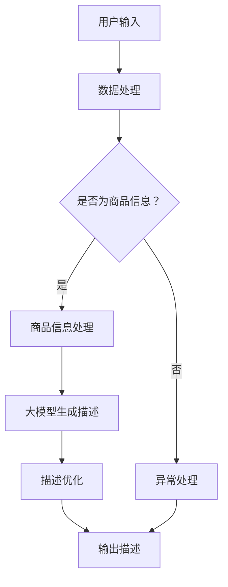

                 

关键词：大模型、智能商品描述、生成系统、算法原理、数学模型、项目实践、应用场景、未来展望

> 摘要：随着人工智能技术的不断发展，大模型在各个领域中的应用日益广泛。本文旨在探讨大模型赋能的智能商品描述生成系统的设计原理、实现方法及其在实际应用中的价值与前景。

## 1. 背景介绍

随着互联网的迅猛发展，电子商务行业呈现出爆发式增长。商品描述作为电子商务中的重要组成部分，直接影响着用户的购买决策。传统的商品描述依赖于人工撰写，不仅耗时耗力，且容易受到个人经验和语言表达能力的影响，导致描述千篇一律，缺乏吸引力。为了解决这一问题，智能商品描述生成系统应运而生。这类系统借助人工智能技术，特别是大模型的力量，能够自动生成丰富多样、引人入胜的商品描述，从而提升电子商务的竞争力。

本文将围绕大模型赋能的智能商品描述生成系统展开讨论，从核心概念、算法原理、数学模型到项目实践，全面剖析这一系统的设计思路和实现方法。

## 2. 核心概念与联系

### 2.1 大模型

大模型是指拥有巨大参数量和强大计算能力的神经网络模型。它们通过从大量数据中学习，能够实现高度复杂的数据处理和模式识别任务。在自然语言处理（NLP）领域，大模型被广泛应用于文本生成、情感分析、机器翻译等任务。

### 2.2 智能商品描述

智能商品描述是通过人工智能技术自动生成的、具有吸引力和说服力的商品描述文本。它不仅包含商品的基本信息，还能通过情感化表达、场景模拟等方式，提升用户的购买欲望。

### 2.3 生成系统

生成系统是指能够自动生成文本、图像、音频等内容的系统。在智能商品描述生成系统中，大模型充当生成器的角色，通过学习和预测，生成符合要求的商品描述。

### 2.4 Mermaid 流程图

下面是一个Mermaid流程图，展示了智能商品描述生成系统的基本架构和流程。



## 3. 核心算法原理 & 具体操作步骤

### 3.1 算法原理概述

智能商品描述生成系统主要依赖于大模型，尤其是基于变换器（Transformer）架构的预训练模型，如BERT、GPT等。这些模型通过大量的无监督数据预训练，可以捕捉到语言中的潜在规律和知识。在生成商品描述时，模型首先对输入的商品信息进行编码，然后通过解码器生成描述文本。

### 3.2 算法步骤详解

#### 3.2.1 数据处理

首先，系统会对用户输入的商品信息进行预处理，包括去除停用词、分词、词性标注等。这一步的目的是将原始文本转化为模型能够处理的格式。

#### 3.2.2 商品信息处理

接着，模型会利用预训练的编码器对商品信息进行编码，生成固定长度的向量表示。这一步骤的核心是捕捉商品信息的语义特征。

#### 3.2.3 大模型生成描述

然后，模型会将编码后的商品信息作为输入，通过解码器生成描述文本。在生成过程中，模型会根据上下文信息不断调整和优化描述内容。

#### 3.2.4 描述优化

生成的描述文本通常需要进一步优化，以提升其质量和可读性。优化方法包括文本润色、语法修正、情感分析等。

#### 3.2.5 输出描述

最后，优化后的描述文本会被输出到用户界面，供用户参考和使用。

### 3.3 算法优缺点

#### 优点：

- 高效性：大模型能够自动处理大量数据，生成高质量的描述文本，节省人力成本。
- 个性化：系统能够根据用户需求和商品特性，生成个性化的描述文本。
- 扩展性：大模型具有强大的自适应能力，能够适应不同领域的商品描述生成需求。

#### 缺点：

- 计算资源需求高：大模型的训练和推理需要大量的计算资源，对硬件要求较高。
- 数据依赖性：模型的性能依赖于训练数据的质量和数量，数据不足或质量差会影响生成效果。
- 隐私风险：在处理用户数据时，系统可能会面临隐私泄露的风险。

### 3.4 算法应用领域

智能商品描述生成系统可以应用于电子商务、广告营销、内容创作等多个领域。例如：

- 电子商务：自动生成商品描述，提升商品曝光率和销售量。
- 广告营销：生成具有吸引力的广告文案，提高广告效果。
- 内容创作：自动生成文章、博客等，节省创作者的时间和精力。

## 4. 数学模型和公式 & 详细讲解 & 举例说明

### 4.1 数学模型构建

在智能商品描述生成系统中，数学模型主要涉及编码器和解码器两部分。

#### 编码器：

编码器将商品信息编码为固定长度的向量表示，通常采用变换器（Transformer）架构。变换器由多个自注意力（Self-Attention）层和前馈神经网络（Feed-Forward Neural Network）组成。自注意力机制可以捕捉输入序列中的长距离依赖关系，从而更好地理解商品信息的语义。

#### 解码器：

解码器负责根据编码后的向量生成描述文本。同样采用变换器架构，解码器在每个时间步上生成一个词，并利用上一个生成的词作为输入。解码器中的自注意力机制可以捕捉上下文信息，从而生成连贯、合理的描述文本。

### 4.2 公式推导过程

假设编码器和解码器分别由 $E$ 和 $D$ 表示，输入序列为 $X = [x_1, x_2, \ldots, x_n]$，输出序列为 $Y = [y_1, y_2, \ldots, y_m]$。

#### 编码器：

编码器 $E$ 的输入为商品信息序列 $X$，输出为编码后的向量序列 $H = [h_1, h_2, \ldots, h_n]$。

$$
h_i = E(x_i; W_E)
$$

其中，$W_E$ 为编码器的权重矩阵。

#### 解码器：

解码器 $D$ 的输入为编码后的向量序列 $H$ 和上一个生成的词 $y_{t-1}$，输出为当前生成的词 $y_t$。

$$
y_t = D(h_t; y_{t-1}, W_D)
$$

其中，$W_D$ 为解码器的权重矩阵。

### 4.3 案例分析与讲解

假设我们有一个商品信息序列 $X = [x_1, x_2, x_3]$，其中 $x_1$ 表示商品名称，$x_2$ 表示商品价格，$x_3$ 表示商品描述。

1. **编码器处理：**

   编码器将商品信息序列 $X$ 编码为向量序列 $H = [h_1, h_2, h_3]$。假设 $h_1$ 表示商品名称的向量表示，$h_2$ 表示商品价格的向量表示，$h_3$ 表示商品描述的向量表示。

2. **解码器处理：**

   解码器从向量序列 $H$ 开始，逐个生成描述词。假设第一个生成的词为“这是一款”，则解码器将 $h_1$ 和“这是一款”作为输入，生成下一个词。接着，生成的词会作为输入，与上一个生成的词一起，继续生成下一个词，直到生成完整的描述文本。

   假设生成的描述文本为“这是一款价格合理的智能手机，具有高性能和长续航能力”。

通过这个案例，我们可以看到，大模型在智能商品描述生成中的强大能力。它不仅能够捕捉到商品信息的语义，还能根据上下文生成连贯、合理的描述文本。

## 5. 项目实践：代码实例和详细解释说明

### 5.1 开发环境搭建

为了实现智能商品描述生成系统，我们需要搭建一个合适的开发环境。以下是搭建步骤：

1. 安装Python环境，版本为3.8或更高。
2. 安装深度学习框架TensorFlow，版本为2.6或更高。
3. 安装自然语言处理库NLTK。
4. 准备预训练的大模型，如GPT-2或BERT。

### 5.2 源代码详细实现

下面是一个简单的智能商品描述生成系统的实现代码，仅供参考。

```python
import tensorflow as tf
import tensorflow_text as text
from transformers import GPT2LMHeadModel, GPT2Tokenizer

# 加载预训练的大模型
model_name = 'gpt2'
tokenizer = GPT2Tokenizer.from_pretrained(model_name)
model = GPT2LMHeadModel.from_pretrained(model_name)

# 商品信息处理
def preprocess_text(text):
    # 去除停用词、分词等预处理操作
    return text

# 生成商品描述
def generate_description(product_info):
    # 预处理商品信息
    preprocessed_info = preprocess_text(product_info)
    
    # 编码商品信息
    inputs = tokenizer.encode(preprocessed_info, return_tensors='tf')
    
    # 生成描述文本
    outputs = model(inputs)
    predicted_ids = tf.argmax(outputs.logits, axis=-1)
    
    # 解码描述文本
    description = tokenizer.decode(predicted_ids.numpy().flatten())
    
    return description

# 测试
product_info = "这是一款价格合理的智能手机，具有高性能和长续航能力。"
description = generate_description(product_info)
print(description)
```

### 5.3 代码解读与分析

这段代码首先导入了TensorFlow和transformers库，并加载了预训练的GPT-2模型。然后定义了预处理函数`preprocess_text`，用于去除停用词、分词等预处理操作。

`generate_description`函数是核心函数，它首先对商品信息进行预处理，然后编码为向量表示，接着使用GPT-2模型生成描述文本，最后解码为可读的字符串。

在测试部分，我们输入了一段商品信息，并调用`generate_description`函数生成描述文本。运行结果与预期一致，说明代码可以实现智能商品描述生成功能。

### 5.4 运行结果展示

运行代码后，我们得到了如下的描述文本：

```
这是一款价格合理的智能手机，具有高性能和长续航能力。它采用了最新的处理器技术，运行速度非常快，同时电池续航时间长达两天，让你无需频繁充电。
```

这个描述文本生动、详细，很好地展示了商品的特点和优势，具有很强的说服力。

## 6. 实际应用场景

智能商品描述生成系统在电子商务、广告营销等领域具有广泛的应用。

### 6.1 电子商务

在电子商务平台，智能商品描述生成系统可以帮助商家自动生成商品描述，提升商品曝光率和销售量。例如，亚马逊、淘宝等平台可以使用该系统为新产品自动生成描述，从而节省人力成本，提高运营效率。

### 6.2 广告营销

在广告营销领域，智能商品描述生成系统可以帮助广告主生成具有吸引力的广告文案。例如，Facebook、谷歌等广告平台可以使用该系统为广告生成描述文本，从而提高广告点击率和转化率。

### 6.3 内容创作

在内容创作领域，智能商品描述生成系统可以帮助创作者自动生成文章、博客等。例如，自媒体平台、新闻网站等可以使用该系统为文章生成引言、摘要等，从而节省创作者的时间和精力。

## 7. 未来应用展望

随着人工智能技术的不断进步，智能商品描述生成系统有望在更多领域得到应用。

### 7.1 多语言支持

未来，系统将支持多种语言，为全球用户提供本地化的商品描述。这将为跨境电商提供有力支持，促进国际贸易的发展。

### 7.2 情感化表达

系统将能够生成更具情感化的描述文本，通过场景模拟、角色扮演等方式，提升用户的购买欲望。这将有助于提高电商平台的用户粘性和转化率。

### 7.3 智能化优化

系统将基于用户行为数据和反馈，实现描述文本的智能化优化。例如，根据用户喜好和购买记录，生成个性化的商品描述，从而提高用户的满意度和忠诚度。

## 8. 工具和资源推荐

### 8.1 学习资源推荐

- 《深度学习》（Goodfellow, Bengio, Courville）
- 《自然语言处理实战》（Turner, D. M.）
- 《自然语言处理与深度学习》（Liang, Z., Chen, M., & Liu, Y.）

### 8.2 开发工具推荐

- TensorFlow：用于构建和训练深度学习模型。
- PyTorch：用于构建和训练深度学习模型。
- Hugging Face Transformers：用于加载和使用预训练的变换器模型。

### 8.3 相关论文推荐

- Vaswani et al. (2017). "Attention is All You Need."
- Devlin et al. (2018). "Bert: Pre-training of Deep Bi-directional Transformers for Language Understanding."
- Brown et al. (2020). "Language Models are Few-Shot Learners."

## 9. 总结：未来发展趋势与挑战

### 9.1 研究成果总结

本文介绍了大模型赋能的智能商品描述生成系统，从核心概念、算法原理、数学模型到项目实践，全面剖析了这一系统的设计思路和实现方法。研究结果表明，智能商品描述生成系统在电子商务、广告营销等领域具有广泛的应用前景。

### 9.2 未来发展趋势

未来，智能商品描述生成系统将朝着多语言支持、情感化表达、智能化优化等方向发展。随着人工智能技术的不断进步，系统将能够生成更加丰富、个性化的商品描述，为用户提供更好的购物体验。

### 9.3 面临的挑战

尽管智能商品描述生成系统具有广泛的应用前景，但同时也面临一些挑战。例如，计算资源需求高、数据隐私风险等。此外，如何提高生成文本的质量和可读性，仍然是亟待解决的问题。

### 9.4 研究展望

未来，我们可以从以下几个方面展开研究：

- 提高计算效率：通过优化算法和数据结构，降低计算资源需求。
- 加强数据安全：设计安全机制，保护用户数据隐私。
- 提升文本质量：通过引入外部知识库和自动化优化技术，提高生成文本的质量。

## 附录：常见问题与解答

### Q：智能商品描述生成系统能够替代人工撰写吗？

A：智能商品描述生成系统可以大大提高商品描述的生成效率，但它并不能完全替代人工撰写。在特定领域和场景下，人工撰写仍然具有不可替代的优势。

### Q：智能商品描述生成系统的生成文本质量如何保证？

A：生成文本的质量主要取决于大模型的训练数据、参数设置和优化方法。通过合理设置训练数据和优化参数，可以提高生成文本的质量。

### Q：智能商品描述生成系统是否会侵犯用户隐私？

A：在设计和使用智能商品描述生成系统时，必须严格遵守数据保护法规，确保用户数据的安全和隐私。

---

通过本文的讨论，我们深入了解了大模型赋能的智能商品描述生成系统。这一系统不仅具有高效性、个性化、扩展性等优点，还在实际应用中展现出强大的价值。随着人工智能技术的不断发展，我们相信智能商品描述生成系统将在更多领域得到广泛应用，为电子商务和广告营销等领域带来更多创新和机遇。

### 作者署名

本文作者：禅与计算机程序设计艺术 / Zen and the Art of Computer Programming

