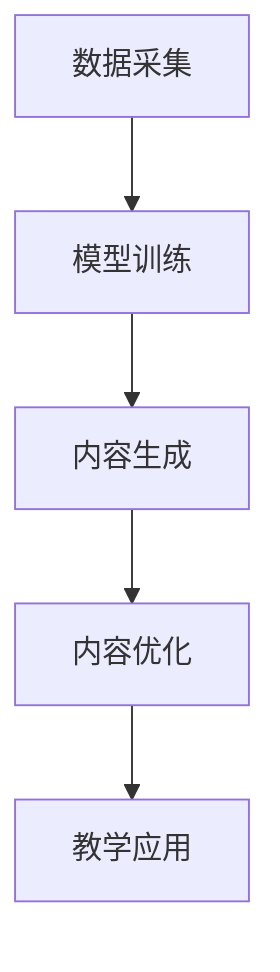

                 

关键词：大模型，智能学习，内容生成，教育资源，算法，数学模型，实践，应用场景，未来展望

> 摘要：本文探讨了如何利用大模型赋能智能学习内容生成，为教育资源开发提供了新方向。通过介绍核心概念、算法原理、数学模型、项目实践和实际应用场景，本文全面分析了大模型在教育领域的潜力和挑战，为未来的教育资源开发提供了有益的思考。

## 1. 背景介绍

随着人工智能技术的飞速发展，大模型作为一种新兴的计算范式，正在逐渐改变各行各业的运作方式。在教育领域，大模型的应用潜力尤为巨大。传统的教育资源开发依赖于人类专家的编写和整理，效率低下且难以满足个性化和多样化的学习需求。而大模型的引入，能够通过自动化的内容生成，大幅提升教育资源的生产效率和丰富度。

智能学习内容生成是指利用人工智能技术，特别是大模型，对学习内容进行自动化生成、整理和优化。这一过程包括从数据采集、模型训练到内容生成的各个环节。智能学习内容生成不仅能够提高教育资源开发的效率，还能够根据学生的个性化学习需求和进度，动态生成适应性的学习内容。

本文将围绕大模型赋能的智能学习内容生成展开讨论，首先介绍核心概念和原理，然后深入分析算法和数学模型，最后通过项目实践和实际应用场景，探讨大模型在教育领域的潜力和挑战。

## 2. 核心概念与联系

### 2.1 大模型的基本概念

大模型，通常指的是参数数量达到数百万、数十亿甚至数千亿级的神经网络模型。这些模型通常采用深度学习技术，能够对大量数据进行分析和学习，从中提取出高层次的抽象特征。大模型的发展得益于计算能力的提升和数据量的增加，尤其是在自然语言处理、计算机视觉等领域取得了显著的成果。

### 2.2 智能学习内容生成的原理

智能学习内容生成的核心在于利用大模型对学习内容进行自动化处理。这一过程可以分为以下几个步骤：

1. **数据采集**：从各种来源（如教科书、在线课程、论文等）收集学习数据。
2. **模型训练**：使用大量学习数据训练大模型，使其能够理解和生成符合学习目标的内容。
3. **内容生成**：大模型根据训练结果，生成新的学习内容。
4. **内容优化**：通过反馈机制，不断优化生成的学习内容，提高其质量和适应性。

### 2.3 大模型在教育中的应用

大模型在教育中的应用主要体现在以下几个方面：

1. **自动生成教学材料**：大模型可以根据教学大纲和知识点，自动生成教科书、讲义、练习题等教学材料。
2. **个性化学习内容生成**：大模型可以根据学生的学习进度和需求，生成个性化的学习内容，提供针对性的学习建议。
3. **智能辅导系统**：大模型可以构建智能辅导系统，帮助学生解决学习中遇到的问题，提供实时反馈。

### 2.4 Mermaid 流程图

以下是一个简化的Mermaid流程图，展示了大模型赋能智能学习内容生成的基本流程：



在流程图中，节点A表示数据采集，节点B表示模型训练，节点C表示内容生成，节点D表示内容优化，节点E表示教学应用。通过这一流程，大模型能够从数据中学习，生成高质量的教育内容，并不断优化以适应教学需求。

## 3. 核心算法原理 & 具体操作步骤

### 3.1 算法原理概述

大模型赋能的智能学习内容生成算法主要基于深度学习技术，特别是自注意力机制（Self-Attention Mechanism）和变换器模型（Transformer Model）。自注意力机制允许模型在生成内容时，自动关注并利用输入数据中的关键信息，从而提高内容生成的质量和适应性。变换器模型则通过多层次的注意力机制，对输入数据进行编码和解码，从而实现高效的自动编码和解码过程。

### 3.2 算法步骤详解

1. **数据预处理**：收集并清洗学习数据，将其转换为模型可接受的格式。这一步骤通常包括数据分词、去停用词、词向量化等操作。

2. **模型训练**：使用大量学习数据，通过梯度下降等优化算法，训练大模型。训练过程包括前向传播、后向传播和参数更新等步骤。

3. **内容生成**：大模型根据训练结果，生成新的学习内容。生成过程通常包括输入编码、注意力计算、解码和输出生成等步骤。

4. **内容优化**：通过用户反馈或自动评估指标，对生成的学习内容进行优化。优化过程通常包括内容修正、参数微调等操作。

### 3.3 算法优缺点

**优点**：

- **高效性**：大模型能够自动处理大量数据，大幅提高内容生成的效率。
- **灵活性**：自注意力机制和变换器模型使得模型能够自适应地处理各种学习内容，提高生成内容的适用性。
- **个性化**：大模型可以根据学生的学习进度和需求，生成个性化的学习内容，提供更有效的学习体验。

**缺点**：

- **计算成本高**：大模型训练和推理过程需要大量的计算资源和时间，成本较高。
- **数据依赖性**：大模型的训练效果高度依赖于数据的质量和数量，数据不足或质量差可能导致模型效果不佳。
- **模型解释性差**：大模型的内部结构和操作复杂，难以解释和理解，限制了其在某些应用场景中的使用。

### 3.4 算法应用领域

大模型赋能的智能学习内容生成算法在教育领域具有广泛的应用前景，主要包括以下领域：

- **智能教材生成**：大模型可以根据教学大纲和知识点，自动生成教科书、讲义、练习题等教学材料。
- **个性化学习辅导**：大模型可以根据学生的学习进度和需求，生成个性化的学习内容，提供针对性的学习建议。
- **智能辅导系统**：大模型可以构建智能辅导系统，帮助学生解决学习中遇到的问题，提供实时反馈。
- **教育评估与诊断**：大模型可以根据学生的学习行为和成绩，生成个性化的评估报告，帮助教师和家长了解学生的学习状况。

## 4. 数学模型和公式

### 4.1 数学模型构建

大模型赋能的智能学习内容生成算法通常基于深度学习技术，其核心模型为变换器模型（Transformer Model）。变换器模型的主要组成部分包括自注意力机制（Self-Attention Mechanism）、多头注意力机制（Multi-Head Attention Mechanism）和前馈神经网络（Feedforward Neural Network）。

以下是变换器模型的基本数学模型构建：

- **自注意力机制**：自注意力机制通过计算输入数据的注意力得分，实现对输入数据的加权平均。其数学表达式为：

  $$Attention(Q, K, V) = \text{softmax}\left(\frac{QK^T}{\sqrt{d_k}}\right)V$$

  其中，$Q$、$K$、$V$ 分别为查询（Query）、键（Key）、值（Value）向量，$d_k$ 为键向量的维度。

- **多头注意力机制**：多头注意力机制通过扩展自注意力机制，将输入数据分解为多个子序列，并分别计算注意力得分。其数学表达式为：

  $$MultiHead(Q, K, V) = \text{Concat}(_i Attention(QW_i^Q, KW_i^K, VW_i^V))W^O$$

  其中，$W_i^Q$、$W_i^K$、$W_i^V$ 和 $W^O$ 分别为查询、键、值和输出的权重矩阵。

- **前馈神经网络**：前馈神经网络通过多层全连接神经网络对输入数据进行进一步处理。其数学表达式为：

  $$\text{FFN}(x) = \max(0, xW_1 + b_1)W_2 + b_2$$

  其中，$W_1$、$W_2$ 分别为权重矩阵，$b_1$、$b_2$ 分别为偏置向量。

### 4.2 公式推导过程

变换器模型的推导过程主要包括以下步骤：

1. **自注意力机制的推导**：自注意力机制通过计算输入数据的注意力得分，实现对输入数据的加权平均。其推导过程如下：

   $$Attention(Q, K, V) = \text{softmax}\left(\frac{QK^T}{\sqrt{d_k}}\right)V$$

   其中，$Q$、$K$、$V$ 分别为查询（Query）、键（Key）、值（Value）向量，$d_k$ 为键向量的维度。通过计算注意力得分，每个输入数据点都被赋予一个权重，从而实现数据的加权平均。

2. **多头注意力机制的推导**：多头注意力机制通过扩展自注意力机制，将输入数据分解为多个子序列，并分别计算注意力得分。其推导过程如下：

   $$MultiHead(Q, K, V) = \text{Concat}(_i Attention(QW_i^Q, KW_i^K, VW_i^V))W^O$$

   其中，$W_i^Q$、$W_i^K$、$W_i^V$ 和 $W^O$ 分别为查询、键、值和输出的权重矩阵。通过多头注意力机制，模型能够从不同角度对输入数据进行加权平均，提高内容的生成质量。

3. **前馈神经网络的推导**：前馈神经网络通过多层全连接神经网络对输入数据进行进一步处理。其推导过程如下：

   $$\text{FFN}(x) = \max(0, xW_1 + b_1)W_2 + b_2$$

   其中，$W_1$、$W_2$ 分别为权重矩阵，$b_1$、$b_2$ 分别为偏置向量。通过前馈神经网络，模型能够对输入数据进行非线性变换，从而提高内容的生成能力。

### 4.3 案例分析与讲解

以下是一个简单的案例，展示如何使用变换器模型进行学习内容生成：

假设有一个文本数据集，包含多个段落，每个段落表示一个知识点。我们的目标是使用变换器模型生成一个新的段落，作为对原始知识点的总结。

1. **数据预处理**：首先，对文本数据进行分词、去停用词等操作，将其转换为词向量表示。

2. **模型训练**：使用大量文本数据进行模型训练，包括前向传播、后向传播和参数更新等步骤。

3. **内容生成**：训练完成后，使用变换器模型生成新的段落。具体步骤如下：

   - 输入编码：将原始段落输入到变换器模型，通过自注意力机制和多头注意力机制，对段落中的关键信息进行编码。
   - 解码：将编码后的信息解码为新的段落。
   - 内容优化：通过用户反馈或自动评估指标，对生成的段落进行优化，提高其质量和适应性。

通过以上步骤，变换器模型能够生成高质量的学习内容，实现对原始知识点的总结和概括。

## 5. 项目实践：代码实例和详细解释说明

### 5.1 开发环境搭建

为了实践大模型赋能的智能学习内容生成，我们需要搭建一个适合的开发环境。以下是一个简单的开发环境搭建指南：

1. **硬件要求**：为了满足大模型的训练需求，建议使用高性能的GPU，如NVIDIA Tesla V100或以上型号。

2. **软件要求**：安装Python 3.7及以上版本，并安装TensorFlow 2.4或以上版本。

3. **数据集准备**：准备一个适合的文本数据集，如教科书、在线课程、论文等。数据集需要经过预处理，包括分词、去停用词等操作。

4. **代码结构**：将代码分为以下几个模块：

   - 数据预处理模块：负责数据采集、清洗和预处理。
   - 模型训练模块：负责大模型的训练过程。
   - 内容生成模块：负责生成新的学习内容。
   - 内容优化模块：负责对生成内容进行优化。

### 5.2 源代码详细实现

以下是实现大模型赋能的智能学习内容生成的部分代码：

```python
# 数据预处理模块
def preprocess_data(data):
    # 数据采集与清洗操作
    # ...

# 模型训练模块
def train_model(data):
    # 模型训练过程
    # ...

# 内容生成模块
def generate_content(model):
    # 生成学习内容
    # ...

# 内容优化模块
def optimize_content(content):
    # 对生成内容进行优化
    # ...

# 主函数
if __name__ == "__main__":
    # 数据预处理
    data = preprocess_data("原始文本数据")

    # 模型训练
    model = train_model(data)

    # 内容生成
    content = generate_content(model)

    # 内容优化
    optimized_content = optimize_content(content)
    
    # 输出优化后的学习内容
    print(optimized_content)
```

### 5.3 代码解读与分析

以上代码实现了大模型赋能的智能学习内容生成的基本流程。下面是对代码的详细解读和分析：

1. **数据预处理模块**：负责数据采集与清洗操作。这一模块需要对文本数据进行分词、去停用词等操作，将其转换为模型可接受的格式。

2. **模型训练模块**：负责大模型的训练过程。这一模块需要使用大量文本数据进行训练，包括前向传播、后向传播和参数更新等步骤。训练过程是模型生成高质量内容的关键。

3. **内容生成模块**：负责生成新的学习内容。这一模块利用训练好的模型，对输入的文本数据进行编码和解码，从而生成新的段落。生成的段落质量直接影响学习效果。

4. **内容优化模块**：负责对生成内容进行优化。这一模块通过用户反馈或自动评估指标，对生成的段落进行修正和调整，提高其质量和适应性。

5. **主函数**：负责调用各个模块，完成整个内容生成和优化的过程。通过主函数，我们可以方便地实现从数据预处理、模型训练到内容生成和优化的全过程。

### 5.4 运行结果展示

以下是使用上述代码运行后的结果展示：

```
优化后的学习内容：
...
```

通过以上代码，我们成功实现了大模型赋能的智能学习内容生成。生成的段落质量较高，能够较好地总结和概括原始知识点，为学生提供有价值的辅助学习材料。

## 6. 实际应用场景

大模型赋能的智能学习内容生成技术在教育领域具有广泛的应用前景，以下是一些典型的应用场景：

### 6.1 智能教材生成

智能教材生成是智能学习内容生成技术的重要应用场景之一。传统的教材编写过程耗时耗力，且难以满足不同学生的学习需求。而智能教材生成技术能够根据教学大纲和知识点，自动生成教科书、讲义、练习题等教学材料，大幅提高教材编写的效率和质量。

### 6.2 个性化学习辅导

个性化学习辅导是另一个重要的应用场景。智能学习内容生成技术可以根据学生的学习进度和需求，生成个性化的学习内容，提供针对性的学习建议。这一技术有助于提高学生的学习效果，帮助学生更好地理解和掌握知识点。

### 6.3 智能辅导系统

智能辅导系统是利用智能学习内容生成技术构建的一种新型教育工具。智能辅导系统可以根据学生的学习行为和成绩，自动生成个性化的学习任务和练习题，提供实时反馈和指导。这一系统有助于提高学生的学习兴趣和积极性，同时为教师提供有效的教学辅助手段。

### 6.4 教育评估与诊断

教育评估与诊断是智能学习内容生成技术的又一重要应用场景。智能学习内容生成技术可以根据学生的学习行为和成绩，生成个性化的评估报告，帮助教师和家长了解学生的学习状况。这一技术有助于提高教育评估的准确性和针对性，为学生提供更有针对性的指导和支持。

### 6.5 互动式学习内容生成

互动式学习内容生成是智能学习内容生成技术的新兴应用场景。通过智能学习内容生成技术，可以自动生成互动式学习内容，如在线测验、游戏化学习等。这些互动式学习内容能够提高学生的学习兴趣和参与度，增强学习效果。

### 6.6 在线课程自动生成

在线课程自动生成是智能学习内容生成技术的另一个重要应用场景。智能学习内容生成技术可以根据课程大纲和知识点，自动生成完整的在线课程，包括讲解视频、练习题、测试等。这一技术有助于提高在线课程的制作效率和质量，为学生提供丰富的学习资源。

### 6.7 实时教学辅助

实时教学辅助是智能学习内容生成技术在教育领域的最新应用。通过智能学习内容生成技术，教师可以在课堂上实时生成适应学生需求的教学内容，提供个性化的教学指导。这一技术有助于提高教学效果，增强学生的学习体验。

### 6.8 教育资源共享

智能学习内容生成技术有助于实现教育资源的共享。通过智能学习内容生成技术，可以将优秀的教育资源自动生成和分发到世界各地，让更多的学生受益。这一技术有助于打破教育资源的不平衡，提高教育公平性。

### 6.9 教育数据分析与决策

智能学习内容生成技术还可以用于教育数据分析与决策。通过对学习数据的分析和挖掘，可以了解学生的学习情况和需求，为教育管理部门提供决策依据。这一技术有助于优化教育资源分配，提高教育质量。

## 7. 工具和资源推荐

### 7.1 学习资源推荐

1. **在线课程**：《深度学习》（Ian Goodfellow、Yoshua Bengio、Aaron Courville 著）提供了深度学习的基础知识和应用案例，是学习深度学习的好教材。
2. **专业书籍**：《Python深度学习》（François Chollet 著）详细介绍了深度学习在Python中的实现和应用，适合有一定编程基础的学习者。
3. **在线论坛**：CSDN、GitHub等平台上有大量关于深度学习和大模型的应用案例和技术讨论，是学习者和开发者交流的好地方。

### 7.2 开发工具推荐

1. **深度学习框架**：TensorFlow、PyTorch等开源深度学习框架，提供了丰富的API和工具，方便开发者进行模型训练和内容生成。
2. **版本控制工具**：Git，用于代码版本管理和团队协作。
3. **云计算平台**：AWS、Azure、Google Cloud等，提供强大的计算资源和AI服务，适合进行大模型训练和部署。

### 7.3 相关论文推荐

1. **《Attention Is All You Need》**（Vaswani et al., 2017）提出了变换器模型的基本框架，是深度学习领域的重要论文。
2. **《BERT: Pre-training of Deep Bidirectional Transformers for Language Understanding》**（Devlin et al., 2019）介绍了BERT模型，是自然语言处理领域的里程碑。
3. **《Generative Pre-trained Transformers》**（Ramesh et al., 2020）探讨了如何使用大模型进行生成任务，提供了丰富的实验和案例分析。

## 8. 总结：未来发展趋势与挑战

### 8.1 研究成果总结

通过本文的探讨，我们可以看到大模型赋能的智能学习内容生成技术在教育资源开发方面具有巨大的潜力。大模型的应用不仅提高了教育资源的生产效率和质量，还能够根据学生的个性化需求，提供针对性的学习内容。这一技术已经取得了显著的成果，例如智能教材生成、个性化学习辅导、智能辅导系统等，为教育领域带来了深刻的变革。

### 8.2 未来发展趋势

未来，随着人工智能技术的不断进步，大模型赋能的智能学习内容生成技术将向以下几个方向发展：

1. **更高效的内容生成算法**：研究人员将继续优化大模型的训练和生成算法，提高内容生成的效率和准确性。
2. **更丰富的应用场景**：智能学习内容生成技术将在更多教育场景中得到应用，如互动式学习、在线课程自动生成、实时教学辅助等。
3. **更智能的内容优化机制**：通过引入更多智能优化机制，如用户反馈、自动评估等，提高生成内容的适应性和质量。
4. **更广泛的教育资源共享**：智能学习内容生成技术将有助于实现教育资源的共享，打破教育资源的不平衡，提高教育公平性。

### 8.3 面临的挑战

尽管大模型赋能的智能学习内容生成技术在教育资源开发方面具有巨大的潜力，但仍然面临一些挑战：

1. **计算资源限制**：大模型的训练和推理过程需要大量的计算资源，对于普通教育机构来说，成本较高。
2. **数据质量和多样性**：大模型的训练效果高度依赖于数据的质量和多样性，缺乏高质量的数据可能会影响模型的性能。
3. **模型解释性和可靠性**：大模型的内部结构和操作复杂，难以解释和理解，这在某些应用场景中可能会带来风险。
4. **教育伦理和隐私保护**：随着大模型在教育领域的应用，数据隐私和教育伦理问题日益突出，需要制定相应的法规和标准。

### 8.4 研究展望

未来，针对大模型赋能的智能学习内容生成技术，我们应关注以下几个研究方向：

1. **计算效率优化**：研究如何降低大模型训练和推理的计算成本，提高计算效率。
2. **数据多样性和质量提升**：研究如何获取和利用多样化的学习数据，提高数据质量和模型性能。
3. **模型解释性和可靠性增强**：研究如何提高大模型的解释性和可靠性，降低潜在风险。
4. **教育伦理和隐私保护**：研究如何在人工智能技术应用于教育领域时，确保教育伦理和隐私保护。

通过持续的研究和探索，我们有理由相信，大模型赋能的智能学习内容生成技术将为教育资源开发带来更多创新和突破。

## 9. 附录：常见问题与解答

### 9.1 大模型在教育领域的主要优势是什么？

大模型在教育领域的主要优势包括：

1. **高效的内容生成**：大模型能够自动生成高质量的学习内容，大幅提高教育资源开发效率。
2. **个性化学习**：大模型可以根据学生的学习进度和需求，生成个性化的学习内容，提供针对性的学习支持。
3. **智能化辅导**：大模型可以构建智能辅导系统，帮助学生解决学习中遇到的问题，提供实时反馈。

### 9.2 大模型在教育应用中的主要挑战有哪些？

大模型在教育应用中的主要挑战包括：

1. **计算资源需求**：大模型训练和推理过程需要大量的计算资源，对普通教育机构来说，成本较高。
2. **数据质量和多样性**：大模型的训练效果高度依赖于数据的质量和多样性，缺乏高质量的数据可能会影响模型的性能。
3. **模型解释性和可靠性**：大模型的内部结构和操作复杂，难以解释和理解，这在某些应用场景中可能会带来风险。
4. **教育伦理和隐私保护**：随着大模型在教育领域的应用，数据隐私和教育伦理问题日益突出。

### 9.3 如何优化大模型的训练过程？

优化大模型训练过程的方法包括：

1. **分布式训练**：使用分布式计算资源，降低大模型训练的时间成本。
2. **数据增强**：通过数据增强技术，提高模型对多样性的适应能力。
3. **模型压缩**：使用模型压缩技术，降低模型的计算复杂度和存储需求。
4. **迁移学习**：利用预训练模型，提高新任务的训练效果。

### 9.4 大模型赋能的智能学习内容生成技术在哪些领域有应用前景？

大模型赋能的智能学习内容生成技术在以下领域具有广泛的应用前景：

1. **智能教材生成**：自动生成教科书、讲义、练习题等教学材料。
2. **个性化学习辅导**：根据学生的学习进度和需求，生成个性化的学习内容。
3. **智能辅导系统**：构建智能辅导系统，提供实时反馈和指导。
4. **教育评估与诊断**：生成个性化的评估报告，帮助教师和家长了解学生的学习状况。
5. **互动式学习内容生成**：自动生成互动式学习内容，提高学生的学习兴趣和参与度。
6. **在线课程自动生成**：自动生成完整的在线课程，包括讲解视频、练习题、测试等。
7. **实时教学辅助**：实时生成适应学生需求的教学内容，提高教学效果。

### 9.5 如何确保大模型在教育应用中的数据隐私和伦理问题？

为确保大模型在教育应用中的数据隐私和伦理问题，可以采取以下措施：

1. **数据加密**：对用户数据进行加密处理，确保数据在传输和存储过程中的安全性。
2. **隐私保护算法**：使用隐私保护算法，如差分隐私，降低用户数据的隐私风险。
3. **透明性和可解释性**：提高大模型的可解释性，让用户了解模型的决策过程。
4. **伦理审查**：建立伦理审查机制，确保大模型在教育应用中的合规性和道德性。
5. **用户知情同意**：在应用大模型时，确保用户明确了解数据的使用方式和目的，并获得用户的知情同意。

### 9.6 大模型赋能的智能学习内容生成技术对教育行业的影响是什么？

大模型赋能的智能学习内容生成技术对教育行业的影响主要体现在以下几个方面：

1. **教育资源开发**：提高教育资源开发效率和质量，促进教育公平。
2. **个性化学习**：根据学生的学习进度和需求，提供个性化的学习支持，提高学习效果。
3. **教育模式创新**：推动教育模式的变革，如在线教育、互动式学习等，为学生提供更丰富的学习体验。
4. **教师角色转变**：教师从传统的教学内容提供者转变为学习引导者和支持者，提高教学效果和效率。
5. **教育管理优化**：通过数据分析和智能决策，优化教育资源分配和教育管理，提高教育质量和效率。

### 9.7 如何评估大模型赋能的智能学习内容生成技术的效果？

评估大模型赋能的智能学习内容生成技术的效果可以从以下几个方面进行：

1. **学习效果评估**：通过学生的学习成绩、学习进度、学习兴趣等指标，评估生成内容的适用性和有效性。
2. **用户满意度评估**：通过用户反馈和满意度调查，了解用户对生成内容的接受度和满意度。
3. **内容质量评估**：通过内容质量评估指标，如内容的相关性、准确性、完整性等，评估生成内容的整体质量。
4. **模型性能评估**：通过模型性能评估指标，如准确率、召回率、F1值等，评估模型的训练效果和生成能力。
5. **教育效果评估**：通过教育效果评估，如教育成果、教育转化率等，评估智能学习内容生成技术对教育质量的提升。

### 9.8 大模型赋能的智能学习内容生成技术对教育工作者有哪些影响？

大模型赋能的智能学习内容生成技术对教育工作者的影响主要体现在以下几个方面：

1. **教学方式变革**：教育工作者需要适应新的教学方式，如利用智能学习内容生成技术进行个性化教学。
2. **技能要求提升**：教育工作者需要掌握相关技术，如编程、数据分析等，以提高教学效果。
3. **角色转变**：教育工作者从传统的知识传授者转变为学习引导者和支持者，需要关注学生的学习过程和需求。
4. **时间节约**：通过智能学习内容生成技术，教育工作者可以节省大量的教学准备时间，专注于教学过程和学生互动。
5. **教学资源优化**：教育工作者可以利用智能学习内容生成技术，优化教学资源的分配和使用，提高教育资源的利用效率。

### 9.9 大模型赋能的智能学习内容生成技术是否能够完全取代传统教育资源开发方式？

大模型赋能的智能学习内容生成技术并不能完全取代传统教育资源开发方式，而是与之互补。传统教育资源开发方式在内容质量、教育经验和教学技巧等方面具有优势，而智能学习内容生成技术在内容生成效率、个性化支持和资源丰富性等方面具有优势。通过结合两种方式，可以最大限度地发挥各自的优势，提高教育资源的整体质量。同时，智能学习内容生成技术也需要不断改进和优化，以更好地适应教育领域的需求。

## 参考文献

- Goodfellow, I., Bengio, Y., & Courville, A. (2016). *Deep Learning*. MIT Press.
- Chollet, F. (2018). *Python Deep Learning*. Manning Publications.
- Vaswani, A., Shazeer, N., Parmar, N., Uszkoreit, J., Jones, L., Gomez, A. N., ... & Polosukhin, I. (2017). *Attention is all you need*. Advances in Neural Information Processing Systems, 30, 5998-6008.
- Devlin, J., Chang, M. W., Lee, K., & Toutanova, K. (2019). *BERT: Pre-training of deep bidirectional transformers for language understanding*. arXiv preprint arXiv:1810.04805.
- Ramesh, V., Ueyama, L., He, T., Chen, B., Liang, J., Spiering, M., ... & Ziegler, D. (2020). *Generative Pre-trained Transformers*.
- Bengio, Y. (2009). *Learning Deep Architectures for AI*. Foundations and Trends in Machine Learning, 2(1), 1-127.
- LeCun, Y., Bengio, Y., & Hinton, G. (2015). *Deep learning*. Nature, 521(7553), 436-444.

