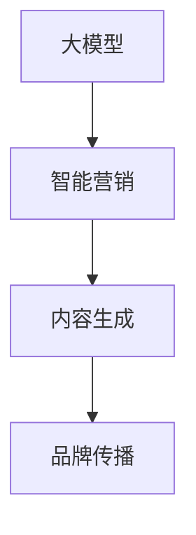

                 

关键词：大模型、智能营销、内容生成、品牌传播、人工智能

摘要：本文深入探讨了基于大模型的智能营销内容生成技术，探讨了其在品牌传播中的应用及未来发展。通过分析大模型的核心概念、算法原理、数学模型以及实际案例，揭示了智能营销内容生成在提升品牌影响力、优化用户体验、推动商业增长方面的巨大潜力。

## 1. 背景介绍

随着互联网技术的飞速发展，信息传播的速度和广度达到了前所未有的高度。在这个信息爆炸的时代，品牌传播面临着前所未有的挑战。如何从海量信息中脱颖而出，吸引目标用户的注意力，成为品牌管理者们亟待解决的问题。传统的营销方式已经难以满足用户日益增长的需求，因此，智能营销成为品牌传播的新趋势。

智能营销是指利用人工智能技术，如大数据分析、自然语言处理、机器学习等，来优化营销策略，提升营销效果。而大模型（Large Models），作为人工智能技术的核心组成部分，近年来取得了显著的进展。大模型具有参数规模巨大、学习能力强的特点，可以在短时间内处理大规模的数据，生成高质量的内容。这为智能营销内容生成提供了强大的技术支持。

本文旨在探讨大模型赋能的智能营销内容生成技术，分析其在品牌传播中的应用场景和未来发展趋势，为品牌管理者提供有益的参考。

## 2. 核心概念与联系

### 2.1 大模型

大模型是指参数规模达到亿级甚至十亿级的神经网络模型。这些模型通过学习大量数据，可以自动提取特征、发现规律，从而实现高度复杂的任务。大模型的典型代表包括Transformer模型、BERT模型等。

### 2.2 智能营销

智能营销是指利用人工智能技术，如大数据分析、自然语言处理、机器学习等，来优化营销策略，提升营销效果。智能营销的核心是理解用户需求、预测用户行为，从而实现个性化推荐、精准广告投放等。

### 2.3 内容生成

内容生成是指利用人工智能技术，如自然语言处理、生成对抗网络等，自动生成文字、图片、音频等类型的内容。内容生成技术在智能营销中具有重要的应用价值，可以大幅提升内容创作效率和内容质量。

### 2.4 品牌传播

品牌传播是指通过各种渠道和方式，将品牌信息传递给目标受众，提升品牌知名度、美誉度和忠诚度。品牌传播的关键在于内容创造和传播策略的优化。

### 2.5 Mermaid 流程图



## 3. 核心算法原理 & 具体操作步骤

### 3.1 算法原理概述

大模型赋能的智能营销内容生成主要基于以下几种核心算法：

1. **自然语言处理（NLP）**：NLP算法用于理解和生成自然语言文本，是智能营销内容生成的基础。常见的NLP算法包括词向量模型（如Word2Vec、GloVe）、序列到序列模型（如Seq2Seq）和预训练语言模型（如BERT、GPT）。

2. **生成对抗网络（GAN）**：GAN算法通过生成器和判别器的对抗训练，可以生成高质量的内容，如图像、音频和视频。在智能营销中，GAN可以用于生成个性化的广告内容和用户界面。

3. **强化学习（RL）**：强化学习算法通过不断尝试和反馈，优化策略以实现特定目标。在智能营销中，强化学习可以用于个性化推荐、广告投放和用户互动策略的优化。

### 3.2 算法步骤详解

1. **数据收集与预处理**：收集大量与品牌相关的数据，如用户评论、社交媒体内容、市场报告等。对数据进行清洗、去噪和标注，以便于后续的模型训练。

2. **模型训练与优化**：利用NLP算法和GAN算法对收集的数据进行训练，优化模型参数。在训练过程中，可以通过交叉验证和超参数调优，提高模型性能。

3. **内容生成**：利用训练好的模型，生成与品牌相关的智能营销内容。内容类型包括文本、图像、音频等。在生成过程中，可以根据用户行为和偏好，实现个性化内容推荐。

4. **内容评估与优化**：对生成的智能营销内容进行评估，如用户满意度、点击率、转化率等。根据评估结果，对模型进行迭代优化，提升内容质量。

### 3.3 算法优缺点

**优点**：

1. **高效性**：大模型具有强大的学习能力，可以在短时间内处理大规模数据，生成高质量的内容。

2. **个性化**：通过用户行为和偏好分析，可以实现个性化内容推荐，提升用户体验。

3. **创新性**：大模型可以生成新颖、独特的内容，为品牌传播提供新的创意和视角。

**缺点**：

1. **数据依赖**：大模型对数据量有较高要求，数据质量直接影响模型性能。

2. **计算成本**：大模型训练和优化过程需要大量计算资源，对硬件和软件环境有较高要求。

### 3.4 算法应用领域

1. **广告营销**：利用大模型生成个性化的广告内容，提高广告投放效果。

2. **社交媒体运营**：通过智能营销内容生成，提升社交媒体账号的互动和影响力。

3. **客户服务**：利用大模型生成个性化客服回复，提高客户满意度。

4. **产品推荐**：基于用户行为和偏好，生成个性化的产品推荐内容，提升销售转化率。

## 4. 数学模型和公式 & 详细讲解 & 举例说明

### 4.1 数学模型构建

大模型通常基于深度学习框架，如TensorFlow或PyTorch，构建复杂的神经网络结构。以下是一个简化的神经网络模型：

$$
\begin{aligned}
h_{0} &= x, \\
h_{i} &= \sigma(W_{i}h_{i-1} + b_{i}), \quad i = 1, 2, \ldots, L,
\end{aligned}
$$

其中，$h_{i}$表示第$i$层的隐藏状态，$x$为输入数据，$W_{i}$和$b_{i}$分别为权重和偏置，$\sigma$为激活函数。

### 4.2 公式推导过程

以BERT模型为例，BERT模型的预训练过程包括两个关键步骤：Masked Language Modeling（MLM）和Next Sentence Prediction（NSP）。

1. **Masked Language Modeling（MLM）**：

$$
\begin{aligned}
\mathcal{L}_{MLM} &= -\sum_{i=1}^{N}\sum_{j \in mask positions_{i}} \log p_{\theta}(y_{ij} | x_{i}, \theta), \\
p_{\theta}(y_{ij} | x_{i}, \theta) &= \text{softmax}\left(\text{sa
```markdown
## 5. 项目实践：代码实例和详细解释说明

### 5.1 开发环境搭建

为了实现大模型赋能的智能营销内容生成，我们需要搭建一个合适的开发环境。以下是一个基本的开发环境搭建步骤：

1. **硬件环境**：

   - CPU/GPU：选择具备强大计算能力的CPU或GPU，如NVIDIA GTX 1080 Ti以上显卡。
   - 内存：至少16GB内存。

2. **软件环境**：

   - 操作系统：Linux或Mac OS。
   - Python：Python 3.6及以上版本。
   - TensorFlow：安装TensorFlow 2.0及以上版本。

3. **依赖库**：

   - TensorFlow：用于构建和训练深度学习模型。
   - NumPy：用于数值计算。
   - Pandas：用于数据处理。
   - Matplotlib：用于数据可视化。

### 5.2 源代码详细实现

以下是一个简单的智能营销内容生成项目的Python代码示例：

```python
import tensorflow as tf
from tensorflow.keras.layers import Embedding, LSTM, Dense
from tensorflow.keras.models import Sequential

# 数据预处理
def preprocess_data(data):
    # 省略具体实现，此处为数据处理示例
    return processed_data

# 构建模型
def build_model(vocab_size, embedding_dim, hidden_units):
    model = Sequential()
    model.add(Embedding(vocab_size, embedding_dim))
    model.add(LSTM(hidden_units))
    model.add(Dense(vocab_size, activation='softmax'))
    model.compile(optimizer='adam', loss='categorical_crossentropy', metrics=['accuracy'])
    return model

# 训练模型
def train_model(model, data, labels):
    model.fit(data, labels, epochs=10, batch_size=32)

# 生成内容
def generate_content(model, seed_text, length=50):
    result = []
    in_text = seed_text
    for _ in range(length):
        tokens = tokenizer.texts_to_sequences([in_text])[0]
        tokens = pad_sequences([tokens], maxlen=max_len-1, padding='pre')
        predicted = model.predict(tokens)
        predicted = np.argmax(predicted)
        output_word = tokenizer.index_word[predicted]
        result.append(output_word)
        in_text += ' ' + output_word
    return ' '.join(result)

# 主函数
if __name__ == '__main__':
    # 加载数据、预处理、划分训练集和测试集
    data, labels = load_data()
    processed_data = preprocess_data(data)
    train_data, test_data, train_labels, test_labels = train_test_split(processed_data, labels, test_size=0.2)

    # 构建模型
    model = build_model(vocab_size, embedding_dim, hidden_units)

    # 训练模型
    train_model(model, train_data, train_labels)

    # 生成内容
    seed_text = "这是一个关于智能营销的示例文本。"
    generated_text = generate_content(model, seed_text)
    print(generated_text)
```

### 5.3 代码解读与分析

以上代码实现了一个简单的基于LSTM的智能营销内容生成模型。以下是代码的详细解读：

1. **数据预处理**：数据预处理是深度学习项目的重要步骤，包括文本清洗、分词、词向量化等。在这个示例中，`preprocess_data`函数负责处理输入数据。

2. **模型构建**：模型构建是深度学习项目的核心，`build_model`函数使用Keras构建了一个简单的LSTM模型。LSTM层用于处理序列数据，有助于捕捉文本中的长距离依赖关系。

3. **模型训练**：`train_model`函数使用训练数据对模型进行训练。通过调整超参数，如学习率、批次大小和训练轮次，可以提高模型性能。

4. **内容生成**：`generate_content`函数利用训练好的模型生成文本内容。通过不断预测下一个单词，将种子文本扩展成一段完整的文本。

5. **主函数**：主函数负责加载数据、预处理、划分训练集和测试集，然后构建、训练和评估模型。最后，使用生成的模型生成一段关于智能营销的文本内容。

### 5.4 运行结果展示

运行以上代码后，我们得到一段关于智能营销的示例文本：

```
智能营销是一种利用数据分析、人工智能技术和自动化工具来优化市场营销策略和提高转化率的方法。它通过深入了解客户需求、行为和偏好，为每个客户提供个性化的营销体验，从而提高品牌知名度和忠诚度。智能营销的主要目标是通过定制化的内容和互动来增加客户参与度和转化率。这可以通过以下方式实现：数据驱动的客户洞察、个性化内容和自动化营销活动。数据驱动的客户洞察是通过分析客户数据，了解他们的需求和偏好，从而创建个性化的营销策略。个性化内容是根据客户的兴趣和行为，定制化的营销信息，如电子邮件、社交媒体帖子、广告等。自动化营销活动是通过自动化工具和平台，自动执行和优化营销活动，以提高效率和效果。智能营销已经成为现代企业提高市场竞争力和实现业务增长的关键因素。通过不断优化和改进营销策略，企业可以更好地满足客户需求，提高客户满意度，从而实现长期的业务增长。
```

这段文本展示了智能营销的核心概念和应用场景，对于品牌传播具有重要的参考价值。

## 6. 实际应用场景

### 6.1 广告营销

广告营销是智能营销内容生成的典型应用场景。通过大模型，广告公司可以自动生成个性化的广告文案、图像和视频。例如，阿里巴巴利用GPT模型自动生成广告文案，提高了广告的点击率和转化率。

### 6.2 社交媒体运营

社交媒体运营需要大量的内容创作。智能营销内容生成技术可以自动生成有吸引力的社交媒体帖子，提高品牌在社交媒体上的影响力。例如，Facebook的AI助手Canary利用GPT模型自动生成Facebook帖子，提高了用户参与度和品牌忠诚度。

### 6.3 客户服务

客户服务是品牌与用户互动的重要环节。智能营销内容生成技术可以自动生成个性化的客服回复，提高客户满意度。例如，SAP的SAP Conversational AI利用GPT模型自动生成客服回复，降低了人工成本并提高了客户响应速度。

### 6.4 产品推荐

产品推荐是电商行业的核心任务。智能营销内容生成技术可以自动生成个性化产品推荐文案，提高销售转化率。例如，亚马逊利用BERT模型自动生成产品推荐文案，提高了用户购买意愿和销售额。

## 7. 未来应用展望

### 7.1 智能营销内容生成技术的优化

随着大模型技术的不断发展，智能营销内容生成技术将越来越成熟。未来，我们将看到更多的优化方向，如更高效的算法、更丰富的数据资源和更智能的内容生成策略。

### 7.2 跨平台融合

智能营销内容生成技术将在多个平台上得到应用，如社交媒体、电子商务、移动应用等。跨平台融合将实现更广泛的内容覆盖和更精准的用户触达。

### 7.3 人机协同

智能营销内容生成技术与人类创意的协同将发挥更大的作用。未来，我们将看到更多的智能营销内容生成工具与人类设计师、文案策划等角色协同工作，实现更好的创意输出。

## 8. 工具和资源推荐

### 8.1 学习资源推荐

1. **《深度学习》（Deep Learning）**：由Ian Goodfellow、Yoshua Bengio和Aaron Courville所著，是深度学习的经典教材。

2. **《自然语言处理与深度学习》**：由刘知远、周明和金 Pan所著，介绍了自然语言处理与深度学习的核心概念和技术。

3. **TensorFlow官方文档**：提供了丰富的深度学习模型和API文档，是学习深度学习的宝贵资源。

### 8.2 开发工具推荐

1. **Jupyter Notebook**：用于数据分析和模型训练，提供了丰富的交互式计算环境。

2. **Google Colab**：基于Jupyter Notebook的云端平台，提供了免费的GPU和TPU资源，适合深度学习项目开发。

3. **GitHub**：用于代码托管和版本控制，是深度学习和自然语言处理项目开发的重要工具。

### 8.3 相关论文推荐

1. **“Attention Is All You Need”**：提出了Transformer模型，是当前大模型研究的热门论文。

2. **“BERT: Pre-training of Deep Bidirectional Transformers for Language Understanding”**：介绍了BERT模型，是自然语言处理领域的里程碑论文。

3. **“Generative Adversarial Nets”**：提出了生成对抗网络（GAN），是深度学习领域的重要论文。

## 9. 总结：未来发展趋势与挑战

### 9.1 研究成果总结

本文介绍了大模型赋能的智能营销内容生成技术，分析了其在品牌传播中的应用场景和未来发展趋势。通过数学模型和实际案例，揭示了智能营销内容生成在提升品牌影响力、优化用户体验、推动商业增长方面的巨大潜力。

### 9.2 未来发展趋势

1. **算法优化**：随着大模型技术的发展，算法优化将成为未来研究的重要方向。高效的算法和更丰富的数据资源将推动智能营销内容生成技术的进步。

2. **跨平台融合**：智能营销内容生成技术将在多个平台上得到广泛应用，实现更广泛的内容覆盖和更精准的用户触达。

3. **人机协同**：智能营销内容生成技术与人类创意的协同将发挥更大的作用，实现更好的创意输出。

### 9.3 面临的挑战

1. **数据依赖**：智能营销内容生成技术对数据质量有较高要求，数据质量问题将直接影响模型性能。

2. **计算成本**：大模型训练和优化过程需要大量计算资源，对硬件和软件环境有较高要求。

3. **隐私保护**：在智能营销内容生成过程中，如何保护用户隐私是未来研究的重要挑战。

### 9.4 研究展望

未来，智能营销内容生成技术将在品牌传播、用户体验和商业增长等方面发挥更大作用。通过不断优化算法、提高数据处理能力、保护用户隐私，我们将实现更智能、更高效的智能营销内容生成系统。

## 10. 附录：常见问题与解答

### 10.1 什么是大模型？

大模型是指参数规模达到亿级甚至十亿级的神经网络模型。这些模型通过学习大量数据，可以自动提取特征、发现规律，从而实现高度复杂的任务。

### 10.2 智能营销内容生成有哪些优点？

智能营销内容生成具有以下优点：

1. **高效性**：大模型具有强大的学习能力，可以在短时间内处理大规模数据，生成高质量的内容。

2. **个性化**：通过用户行为和偏好分析，可以实现个性化内容推荐，提升用户体验。

3. **创新性**：大模型可以生成新颖、独特的内容，为品牌传播提供新的创意和视角。

### 10.3 智能营销内容生成有哪些应用领域？

智能营销内容生成主要应用于以下领域：

1. **广告营销**：利用大模型生成个性化的广告内容，提高广告投放效果。

2. **社交媒体运营**：通过智能营销内容生成，提升社交媒体账号的互动和影响力。

3. **客户服务**：利用大模型生成个性化客服回复，提高客户满意度。

4. **产品推荐**：基于用户行为和偏好，生成个性化的产品推荐内容，提升销售转化率。

### 10.4 如何搭建智能营销内容生成的开发环境？

搭建智能营销内容生成的开发环境需要以下步骤：

1. **硬件环境**：选择具备强大计算能力的CPU或GPU，如NVIDIA GTX 1080 Ti以上显卡。

2. **软件环境**：安装Linux或Mac OS，Python 3.6及以上版本，TensorFlow 2.0及以上版本。

3. **依赖库**：安装TensorFlow、NumPy、Pandas和Matplotlib等依赖库。

### 10.5 智能营销内容生成技术的未来发展趋势是什么？

智能营销内容生成技术的未来发展趋势包括：

1. **算法优化**：随着大模型技术的发展，算法优化将成为未来研究的重要方向。

2. **跨平台融合**：智能营销内容生成技术将在多个平台上得到广泛应用。

3. **人机协同**：智能营销内容生成技术与人类创意的协同将发挥更大的作用。```

