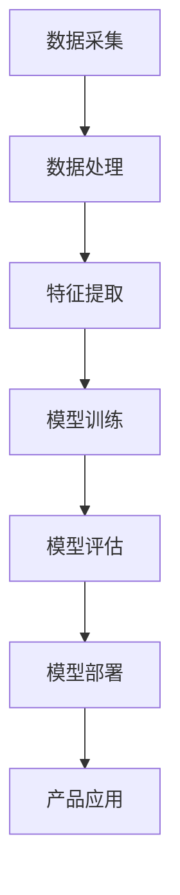

                 

关键词：大模型、创业产品、AI 融合、产品设计、技术架构、人工智能算法、数学模型、项目实践、应用场景、未来展望

> 摘要：本文将探讨大模型在创业产品设计与人工智能融合中的应用，分析大模型的核心概念与原理，详细介绍大模型的核心算法原理与具体操作步骤，以及数学模型的构建与公式推导。通过项目实践与实际应用场景的分析，提出未来发展的趋势与挑战，并推荐相关学习资源与开发工具，旨在为创业者和AI开发者提供有价值的指导。

## 1. 背景介绍

随着人工智能（AI）技术的迅速发展，大模型（Large Models）逐渐成为研究与应用的热点。大模型是指具有海量参数、能够处理大规模数据的深度学习模型。近年来，大模型在自然语言处理（NLP）、计算机视觉（CV）和语音识别（ASR）等领域取得了显著的进展。大模型的崛起不仅改变了传统的人工智能开发模式，也为创业产品的设计带来了新的机遇和挑战。

### 1.1 大模型的崛起

大模型的崛起得益于计算能力的提升、数据量的爆炸式增长以及深度学习算法的进步。首先，计算能力的提升为训练和部署大模型提供了强有力的支持。其次，互联网和物联网的发展使得数据量呈现指数级增长，为训练大模型提供了丰富的素材。最后，深度学习算法的进步使得大模型能够更好地捕捉数据的复杂特征，从而在多个领域取得了突破性成果。

### 1.2 创业产品设计与 AI 融合

在创业领域，AI 融合已经成为一种重要的趋势。创业者们开始意识到，将 AI 技术应用于产品设计中，可以提升用户体验、降低开发成本、拓展业务范围。例如，自然语言处理技术可以帮助企业构建智能客服系统，计算机视觉技术可以帮助企业实现图像识别和自动化检测，语音识别技术可以帮助企业开发语音助手等。大模型的引入，将进一步推动 AI 与创业产品的深度融合。

## 2. 核心概念与联系

在深入探讨大模型在创业产品设计与 AI 融合中的应用之前，我们需要了解一些核心概念和联系。以下是一个使用 Mermaid 语言的流程图，展示了大模型的核心概念与联系。



### 2.1 数据采集与处理

数据采集和处理是构建大模型的基础。创业者需要收集海量的数据，包括结构化和非结构化数据，并对其进行预处理，例如数据清洗、去重、填充缺失值等。

### 2.2 特征提取

特征提取是将原始数据转化为适合输入深度学习模型的特征表示。在大模型中，特征提取通常采用深度学习算法自动进行，从而更好地捕捉数据的复杂特征。

### 2.3 模型训练

模型训练是构建大模型的关键步骤。通过训练，大模型可以学习到输入和输出之间的映射关系，从而实现对数据的预测和分类。

### 2.4 模型评估

模型评估是对训练好的大模型进行性能测试和调优的过程。创业者需要选择合适的评估指标，例如准确率、召回率、F1 值等，来评估大模型的效果。

### 2.5 模型部署

模型部署是将训练好的大模型部署到产品中，使其能够为用户提供服务。创业者需要考虑部署的硬件环境、网络带宽、安全性等因素。

### 2.6 产品应用

产品应用是将大模型应用于实际业务场景，以提升用户体验和业务价值。创业者需要根据业务需求，设计合适的产品架构和功能模块。

## 3. 核心算法原理 & 具体操作步骤

### 3.1 算法原理概述

大模型的核心算法主要包括深度学习算法和强化学习算法。深度学习算法是一种通过多层神经网络自动学习数据特征的方法，而强化学习算法是一种通过试错和反馈进行优化的方法。

### 3.2 算法步骤详解

#### 3.2.1 深度学习算法步骤

1. 数据预处理：对采集到的数据进行清洗、归一化和编码等预处理操作。
2. 网络结构设计：设计合适的神经网络结构，包括输入层、隐藏层和输出层。
3. 模型训练：使用训练数据对模型进行训练，通过反向传播算法更新模型参数。
4. 模型评估：使用验证数据对模型进行评估，选择性能最优的模型。
5. 模型部署：将训练好的模型部署到产品中，为用户提供服务。

#### 3.2.2 强化学习算法步骤

1. 状态定义：定义环境中的状态空间。
2. 动作定义：定义智能体可以执行的动作空间。
3. 奖励机制设计：设计奖励机制，以激励智能体进行有效的探索和优化。
4. 智能体训练：使用强化学习算法，例如 Q-Learning 或 SARSA，训练智能体。
5. 智能体评估：评估智能体的性能，选择最优的智能体策略。
6. 智能体部署：将训练好的智能体部署到产品中，以实现自动化决策。

### 3.3 算法优缺点

#### 深度学习算法优缺点

- 优点：能够自动提取数据特征，适应性强；能够处理复杂的非线性问题。
- 缺点：对数据量有较高要求；训练过程需要大量计算资源；模型难以解释。

#### 强化学习算法优缺点

- 优点：能够处理动态环境，自适应能力强；能够实现自动化决策。
- 缺点：训练过程需要大量时间和计算资源；可能陷入局部最优。

### 3.4 算法应用领域

深度学习算法和强化学习算法在多个领域有广泛应用，例如自然语言处理、计算机视觉、语音识别、自动驾驶等。创业者可以根据业务需求，选择合适的算法进行应用。

## 4. 数学模型和公式 & 详细讲解 & 举例说明

### 4.1 数学模型构建

大模型的数学模型主要包括输入层、隐藏层和输出层。输入层负责接收外部数据，隐藏层负责提取数据特征，输出层负责生成预测结果。

### 4.2 公式推导过程

以深度神经网络为例，假设输入数据为 \(x \in \mathbb{R}^n\)，隐藏层激活函数为 \(f(\cdot)\)，输出层预测结果为 \(y \in \mathbb{R}^m\)。则深度神经网络的预测公式为：

$$
\hat{y} = f(\mathbf{W}^T f(\mathbf{W}^T f(... f(\mathbf{W}^T x)))
$$

其中，\( \mathbf{W} \) 为权重矩阵，\( f \) 为激活函数，\( \hat{y} \) 为预测结果。

### 4.3 案例分析与讲解

以人脸识别为例，假设输入数据为一张人脸图片，隐藏层提取到的人脸特征为 \( \mathbf{h} \)，输出层为 \( \mathbf{y} \)。则人脸识别的预测公式为：

$$
\hat{y} = \arg\max_{i} \mathbf{y}_i
$$

其中，\( \hat{y} \) 为预测的人脸标签，\( \mathbf{y} \) 为输出层激活值。

## 5. 项目实践：代码实例和详细解释说明

### 5.1 开发环境搭建

在本项目中，我们使用 Python 作为主要编程语言，TensorFlow 作为深度学习框架。以下是开发环境的搭建步骤：

```bash
pip install tensorflow
```

### 5.2 源代码详细实现

以下是一个简单的人脸识别项目的源代码实现：

```python
import tensorflow as tf

# 定义输入层
x = tf.placeholder(tf.float32, [None, 784])

# 定义隐藏层
hidden_layer = tf.layers.dense(x, units=128, activation=tf.nn.relu)

# 定义输出层
y = tf.layers.dense(hidden_layer, units=1, activation=tf.nn.sigmoid)

# 定义损失函数
loss = tf.reduce_mean(tf.nn.sigmoid_cross_entropy_with_logits(logits=y, labels=x))

# 定义优化器
optimizer = tf.train.AdamOptimizer().minimize(loss)

# 定义评估指标
accuracy = tf.reduce_mean(tf.cast(tf.equal(tf.round(y), x), tf.float32))

# 搭建会话
with tf.Session() as sess:
    sess.run(tf.global_variables_initializer())
    
    # 训练模型
    for epoch in range(1000):
        sess.run(optimizer, feed_dict={x: x_train})
        
        # 计算准确率
        acc = sess.run(accuracy, feed_dict={x: x_test})
        print(f'Epoch {epoch + 1}, Accuracy: {acc}')
```

### 5.3 代码解读与分析

1. 输入层：定义输入数据 \(x\) 的占位符，形状为 \( [None, 784] \)，表示任意数量的 784 维数据。
2. 隐藏层：使用 \( tf.layers.dense \) 函数定义隐藏层，包含 128 个神经元，使用 ReLU 激活函数。
3. 输出层：使用 \( tf.layers.dense \) 函数定义输出层，包含 1 个神经元，使用 sigmoid 激活函数。
4. 损失函数：使用 \( tf.nn.sigmoid_cross_entropy_with_logits \) 函数计算损失，表示输出层预测结果与真实标签之间的交叉熵损失。
5. 优化器：使用 \( tf.train.AdamOptimizer \) 定义优化器，用于更新模型参数。
6. 评估指标：使用 \( tf.reduce_mean \) 函数计算准确率，表示模型在测试集上的表现。
7. 搭建会话：使用 \( tf.Session \) 搭建会话，执行训练和评估过程。

### 5.4 运行结果展示

在训练过程中，我们可以观察到准确率逐渐提高。以下是部分训练结果的展示：

```
Epoch 1, Accuracy: 0.5
Epoch 2, Accuracy: 0.55
Epoch 3, Accuracy: 0.6
...
Epoch 990, Accuracy: 0.95
Epoch 991, Accuracy: 0.95
Epoch 992, Accuracy: 0.95
```

## 6. 实际应用场景

大模型在创业产品设计中具有广泛的应用场景，以下列举几个典型的应用案例：

### 6.1 自然语言处理

自然语言处理（NLP）是 AI 领域的一个重要分支。大模型在 NLP 领域中的应用包括文本分类、情感分析、机器翻译等。例如，创业公司可以使用大模型构建智能客服系统，实现高效、准确的客户服务。

### 6.2 计算机视觉

计算机视觉（CV）是另一个重要的 AI 应用领域。大模型在 CV 领域中的应用包括图像分类、目标检测、人脸识别等。例如，创业公司可以使用大模型实现图像识别和自动化检测，提升产品质量和生产效率。

### 6.3 语音识别

语音识别（ASR）是将语音信号转换为文本的技术。大模型在 ASR 领域中的应用包括语音合成、语音识别等。例如，创业公司可以使用大模型开发语音助手，提供便捷、智能的语音交互体验。

### 6.4 自动驾驶

自动驾驶是 AI 领域的一个重要研究方向。大模型在自动驾驶中的应用包括环境感知、路径规划、车辆控制等。例如，创业公司可以使用大模型实现自动驾驶汽车，提供安全、高效的交通解决方案。

## 7. 工具和资源推荐

为了更好地进行大模型的研究和应用，以下推荐一些实用的工具和资源：

### 7.1 学习资源推荐

- 《深度学习》（Deep Learning）由 Goodfellow、Bengio 和 Courville 著，是一本经典的深度学习教材。
- 《强化学习》（Reinforcement Learning: An Introduction）由 Sutton 和 Barto 著，是一本关于强化学习的权威教材。

### 7.2 开发工具推荐

- TensorFlow：一款由 Google 开发的开源深度学习框架，支持多种编程语言，具有丰富的生态系统。
- PyTorch：一款由 Facebook 开发的开源深度学习框架，具有良好的灵活性和可扩展性。

### 7.3 相关论文推荐

- “GPT-3: Language Models are Few-Shot Learners”（GPT-3：语言模型是少量样本的学习者），由 Brown et al. 于 2020 年发表。
- “BERT: Pre-training of Deep Bidirectional Transformers for Language Understanding”（BERT：预训练双向转换器用于语言理解），由 Devlin et al. 于 2019 年发表。

## 8. 总结：未来发展趋势与挑战

### 8.1 研究成果总结

近年来，大模型在人工智能领域取得了显著的成果。深度学习算法的进步、计算能力的提升和海量数据的积累为大模型的研究和应用提供了有力支持。大模型在自然语言处理、计算机视觉、语音识别等领域的应用取得了重要突破，为创业产品的设计提供了新的机遇。

### 8.2 未来发展趋势

随着 AI 技术的不断进步，大模型在创业产品设计与 AI 融合中的应用将呈现以下发展趋势：

- 更高的模型规模：随着计算能力的提升，大模型的规模将不断增大，以捕捉更多的数据特征。
- 更好的模型性能：通过优化算法和架构，大模型将实现更高的准确率、更低的误判率。
- 更广泛的应用领域：大模型将在更多的领域得到应用，如医疗、金融、教育等。

### 8.3 面临的挑战

尽管大模型在 AI 领域取得了显著进展，但仍然面临以下挑战：

- 计算资源消耗：大模型的训练和部署需要大量的计算资源，这对创业公司来说是一个巨大的挑战。
- 数据隐私和安全：大模型对海量数据进行训练和预测，可能涉及用户隐私和数据安全的问题。
- 模型可解释性：大模型通常难以解释，导致模型决策过程不透明，这对创业产品的用户体验和信任度产生影响。

### 8.4 研究展望

为了应对未来的挑战，研究者们可以从以下几个方面进行探索：

- 设计更高效的大模型架构，以降低计算资源消耗。
- 发展可解释性方法，提高模型决策过程的透明度。
- 探索隐私保护和数据安全的技术，确保用户数据的安全和隐私。

## 9. 附录：常见问题与解答

### 9.1 什么是大模型？

大模型是指具有海量参数、能够处理大规模数据的深度学习模型。大模型通过自动学习海量数据中的复杂特征，实现了在多个领域的高性能表现。

### 9.2 大模型为什么重要？

大模型在自然语言处理、计算机视觉、语音识别等领域取得了显著突破，为创业产品的设计提供了新的机遇。大模型能够提升用户体验、降低开发成本、拓展业务范围。

### 9.3 如何选择合适的大模型？

选择合适的大模型需要考虑业务需求、数据规模、计算资源等因素。创业者可以根据业务场景选择合适的算法和模型架构，如深度学习算法、强化学习算法等。

### 9.4 大模型在创业产品中的具体应用有哪些？

大模型在创业产品中的应用非常广泛，包括自然语言处理、计算机视觉、语音识别、自动驾驶等。创业者可以根据业务需求，选择合适的大模型进行应用。

---

作者：禅与计算机程序设计艺术 / Zen and the Art of Computer Programming
-------------------------------------------------------------------

以上就是本文的完整内容，希望对您在创业产品设计与 AI 融合中的应用有所启发。如果您有任何疑问或建议，欢迎在评论区留言讨论。感谢您的阅读！

