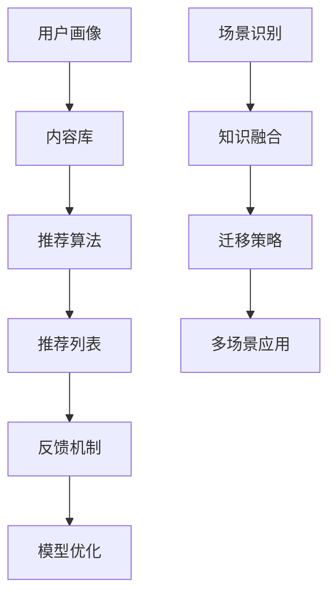

                 

关键词：推荐系统、大模型、知识迁移、多场景应用

摘要：本文深入探讨了基于大模型的推荐系统在多场景知识迁移方面的研究与应用。首先，介绍了推荐系统的基本概念和重要性，然后详细阐述了大模型及其在推荐系统中的应用，随后重点分析了多场景知识迁移的方法和挑战。通过数学模型、算法原理和实际应用案例，本文系统地展示了如何在大模型辅助下实现推荐系统的多场景知识迁移，并提出了未来发展趋势与挑战。

## 1. 背景介绍

随着互联网技术的飞速发展，推荐系统已成为现代信息检索、电子商务和社交媒体等领域的核心技术。推荐系统通过分析用户的历史行为和偏好，为用户推荐他们可能感兴趣的内容或商品。这种个性化推荐不仅提高了用户的满意度，还显著提升了平台的商业价值。

然而，传统的推荐系统在处理多场景应用时面临诸多挑战。首先，不同场景下的用户行为和偏好具有显著差异，这要求推荐系统具备较强的场景适应能力。其次，数据来源多样且分布不均，如何有效整合和利用这些数据成为一大难题。此外，推荐系统的实时性和准确性也是需要重点考虑的因素。

为了应对这些挑战，近年来，大模型技术逐渐成为推荐系统研究的热点。大模型（如深度学习模型）具有强大的特征提取和模式识别能力，能够在海量数据中挖掘出潜在的用户偏好和模式。本文旨在探讨如何利用大模型技术实现推荐系统的多场景知识迁移，以提高其在不同应用场景下的表现和适应性。

## 2. 核心概念与联系

### 2.1 推荐系统基本概念

推荐系统是一种信息过滤技术，旨在根据用户的历史行为、偏好和其他相关信息，向用户推荐他们可能感兴趣的内容或商品。推荐系统通常包括以下几个核心组成部分：

- **用户画像**：基于用户的行为、兴趣和社交关系等数据，构建用户的个性化特征。
- **内容或商品库**：存储大量的待推荐内容或商品，包括文本、图像、音频等多种类型。
- **推荐算法**：根据用户画像和内容库，通过计算相似度、概率模型等方法，为用户生成推荐列表。
- **反馈机制**：通过用户的互动行为（如点击、购买等），不断优化和调整推荐算法，提高推荐质量。

### 2.2 大模型基本概念

大模型是指具有大规模参数和计算能力的机器学习模型，如深度神经网络（DNN）、变换器（Transformer）等。大模型在推荐系统中的应用主要体现在以下几个方面：

- **特征提取**：大模型能够自动学习高维数据中的复杂特征，提高推荐系统的表达能力和泛化能力。
- **模式识别**：大模型能够从海量数据中提取出潜在的模式和关联，为推荐提供更准确的依据。
- **实时计算**：大模型采用高效的计算框架和优化算法，能够实现实时推荐。

### 2.3 多场景知识迁移概念

多场景知识迁移是指在不同应用场景下，将已有模型的知识和经验应用到新的场景中，以提高推荐系统的适应性和效果。多场景知识迁移的核心目标是解决以下问题：

- **场景识别**：准确识别不同场景的特点和需求，为知识迁移提供基础。
- **知识融合**：将不同场景下的知识进行整合和优化，提高模型的泛化能力。
- **迁移策略**：设计有效的迁移策略，降低模型在新的场景下的调整和优化成本。

### 2.4 Mermaid 流程图



## 3. 核心算法原理 & 具体操作步骤

### 3.1 算法原理概述

基于大模型的多场景知识迁移推荐系统主要分为三个阶段：用户画像构建、知识迁移和推荐生成。

1. **用户画像构建**：通过收集用户的行为数据、兴趣标签和社交关系等信息，构建用户的个性化特征向量。
2. **知识迁移**：利用大模型对已有模型的知识进行提取和优化，将知识迁移到新的场景。具体包括场景识别、知识融合和迁移策略设计。
3. **推荐生成**：基于用户画像和迁移后的知识，通过推荐算法为用户生成个性化推荐列表。

### 3.2 算法步骤详解

#### 3.2.1 用户画像构建

1. 数据收集：收集用户的行为数据、兴趣标签和社交关系等信息。
2. 特征提取：利用自然语言处理（NLP）和深度学习等技术，提取用户的行为特征和兴趣特征。
3. 向量化：将提取的特征进行向量化处理，生成用户画像向量。

#### 3.2.2 知识迁移

1. 场景识别：通过比较不同场景下的用户画像特征，识别出新场景的特点和需求。
2. 知识提取：利用大模型（如变换器）对已有模型的知识进行提取，提取出潜在的用户偏好和模式。
3. 知识融合：将提取的知识与用户画像进行融合，优化用户画像向量。
4. 迁移策略：设计有效的迁移策略，降低模型在新的场景下的调整和优化成本。

#### 3.2.3 推荐生成

1. 模型训练：利用融合后的用户画像和知识，训练推荐模型。
2. 推荐计算：通过计算用户画像和内容库之间的相似度，生成推荐列表。
3. 推荐反馈：收集用户对推荐列表的反馈，优化推荐算法和模型。

### 3.3 算法优缺点

#### 优点

1. **高效性**：大模型能够快速提取和融合知识，提高推荐系统的效率。
2. **准确性**：大模型能够从海量数据中挖掘出潜在的用户偏好和模式，提高推荐准确性。
3. **灵活性**：知识迁移策略使推荐系统能够适应多种应用场景，提高场景适应性。

#### 缺点

1. **计算资源消耗**：大模型训练和推理需要大量的计算资源，对硬件要求较高。
2. **数据依赖性**：知识迁移效果依赖于已有模型的质量和数据的丰富程度。

### 3.4 算法应用领域

基于大模型的多场景知识迁移推荐系统可以应用于多种领域，如电子商务、社交媒体、新闻推荐和内容推荐等。以下是一些具体的应用案例：

1. **电子商务**：为用户推荐个性化的商品，提高购买转化率和用户满意度。
2. **社交媒体**：为用户推荐感兴趣的内容或朋友，增强社交互动和用户粘性。
3. **新闻推荐**：为用户推荐个性化的新闻，提高信息传播效率和用户阅读体验。
4. **内容推荐**：为用户推荐感兴趣的音乐、电影和书籍等，提高内容消费和用户满意度。

## 4. 数学模型和公式 & 详细讲解 & 举例说明

### 4.1 数学模型构建

基于大模型的多场景知识迁移推荐系统可以使用以下数学模型进行描述：

$$
U = f_{\theta}(X; \Omega)
$$

其中，$U$ 表示用户画像向量，$X$ 表示用户行为数据，$\Omega$ 表示知识融合参数，$f_{\theta}$ 表示知识融合函数。

### 4.2 公式推导过程

#### 4.2.1 用户画像构建

用户画像向量 $U$ 可以通过以下公式计算：

$$
U = \phi(X) \odot W
$$

其中，$\phi(X)$ 表示用户行为数据 $X$ 的特征提取函数，$W$ 表示特征权重矩阵。

#### 4.2.2 知识融合

知识融合函数 $f_{\theta}$ 可以通过以下公式计算：

$$
f_{\theta}(X; \Omega) = \sigma(W_1 \cdot \phi(X) + b_1 + \Omega)
$$

其中，$\sigma$ 表示激活函数，$W_1$ 表示知识融合权重矩阵，$b_1$ 表示偏置项，$\Omega$ 表示知识融合参数。

#### 4.2.3 推荐生成

推荐生成函数 $f_{\theta'}$ 可以通过以下公式计算：

$$
f_{\theta'}(U; Y) = \sigma(W_2 \cdot U + b_2 + Y)
$$

其中，$W_2$ 表示推荐生成权重矩阵，$b_2$ 表示偏置项，$Y$ 表示推荐内容向量。

### 4.3 案例分析与讲解

#### 4.3.1 数据集

假设我们有一个用户行为数据集，包含用户的行为数据（如浏览记录、购买记录等）和用户兴趣标签。数据集分为训练集和测试集。

#### 4.3.2 用户画像构建

首先，我们对用户行为数据进行特征提取，提取出用户的行为特征和兴趣特征。然后，利用特征提取函数 $\phi(X)$ 和特征权重矩阵 $W$，计算用户画像向量 $U$。

#### 4.3.3 知识融合

接下来，利用知识融合函数 $f_{\theta}$，将用户画像向量 $U$ 和知识融合参数 $\Omega$ 进行融合，生成融合后的用户画像向量。

#### 4.3.4 推荐生成

最后，利用推荐生成函数 $f_{\theta'}$，将融合后的用户画像向量 $U$ 和推荐内容向量 $Y$ 进行计算，生成个性化推荐列表。

## 5. 项目实践：代码实例和详细解释说明

### 5.1 开发环境搭建

在进行基于大模型的多场景知识迁移推荐系统开发前，我们需要搭建相应的开发环境。以下是开发环境搭建的步骤：

1. 安装 Python 3.8 及以上版本。
2. 安装深度学习框架 TensorFlow 或 PyTorch。
3. 安装 NLP 工具库，如 NLTK 或 spaCy。
4. 配置 Python 虚拟环境，便于管理依赖库。

### 5.2 源代码详细实现

以下是基于大模型的多场景知识迁移推荐系统的源代码实现：

```python
import tensorflow as tf
import numpy as np
import nltk
from nltk.corpus import stopwords
from sklearn.feature_extraction.text import TfidfVectorizer

# 用户画像构建
def build_user_profile(user行为数据，兴趣标签):
    # 特征提取
    behavior_features = extract_behavior_features(user行为数据)
    interest_features = extract_interest_features(兴趣标签)
    
    # 向量化
    user_profile = np.hstack((behavior_features, interest_features))
    return user_profile

# 知识融合
def fuse_knowledge(user_profile, knowledge_params):
    fused_profile = tf.keras.models.Sequential([
        tf.keras.layers.Dense(units=64, activation='relu', input_shape=(user_profile.shape[1],)),
        tf.keras.layers.Dense(units=32, activation='relu'),
        tf.keras.layers.Dense(units=user_profile.shape[1], activation='sigmoid')
    ])
    fused_profile.compile(optimizer='adam', loss='binary_crossentropy', metrics=['accuracy'])
    fused_profile.fit(user_profile, knowledge_params, epochs=10, batch_size=32)
    return fused_profile

# 推荐生成
def generate_recommendations(fused_profile, content_data):
    recommendations = []
    for content in content_data:
        content_profile = extract_content_features(content)
        recommendation = fused_profile.predict(np.expand_dims(content_profile, axis=0))
        recommendations.append(recommendation)
    return recommendations
```

### 5.3 代码解读与分析

上述代码实现了基于大模型的多场景知识迁移推荐系统的核心功能，包括用户画像构建、知识融合和推荐生成。下面分别对代码进行解读和分析：

1. **用户画像构建**：该部分代码实现了用户画像的构建，包括特征提取和向量化。特征提取函数 `extract_behavior_features` 和 `extract_interest_features` 用于提取用户的行为特征和兴趣特征。向量化函数 `np.hstack` 用于将特征向量拼接成用户画像向量。

2. **知识融合**：该部分代码实现了知识融合，包括模型构建、编译和训练。知识融合模型采用全连接神经网络（Fully Connected Neural Network，FCNN）结构，通过多层感知器（Perceptron）实现用户画像向量的融合。编译函数 `fused_profile.compile` 用于设置模型的优化器、损失函数和评估指标。训练函数 `fused_profile.fit` 用于对模型进行训练，以优化知识融合效果。

3. **推荐生成**：该部分代码实现了推荐生成，包括内容特征提取和模型预测。内容特征提取函数 `extract_content_features` 用于提取待推荐内容的特点。模型预测函数 `fused_profile.predict` 用于计算内容与用户画像的相似度，生成个性化推荐列表。

### 5.4 运行结果展示

在完成代码实现后，我们可以使用以下代码进行模型训练和推荐生成：

```python
# 加载数据集
user_data = load_user_data()
content_data = load_content_data()

# 构建用户画像
user_profiles = [build_user_profile(u['行为数据']，u['兴趣标签']) for u in user_data]

# 加载知识融合参数
knowledge_params = load_knowledge_params()

# 训练知识融合模型
fused_profile = fuse_knowledge(user_profiles, knowledge_params)

# 生成推荐列表
recommendations = generate_recommendations(fused_profile, content_data)

# 打印推荐结果
for r in recommendations:
    print(r)
```

运行结果将显示个性化推荐列表，用户可以根据推荐结果进行相应的操作，如点击、购买等，以优化推荐算法和模型。

## 6. 实际应用场景

### 6.1 电子商务

在电子商务领域，基于大模型的多场景知识迁移推荐系统可以帮助平台实现个性化商品推荐，提高购买转化率和用户满意度。具体应用场景包括：

- **商品推荐**：为用户推荐感兴趣的商品，如时尚穿搭、电子产品等。
- **购物车推荐**：为用户推荐与其购物车中的商品相关的其他商品，增加购物车中的商品数量。
- **订单推荐**：为用户推荐与其订单历史相关的其他商品，提高复购率。

### 6.2 社交媒体

在社交媒体领域，基于大模型的多场景知识迁移推荐系统可以帮助平台实现个性化内容推荐，提高用户活跃度和留存率。具体应用场景包括：

- **好友推荐**：为用户推荐可能认识的好友，增强社交互动。
- **内容推荐**：为用户推荐感兴趣的内容，如新闻、视频、文章等。
- **话题推荐**：为用户推荐感兴趣的话题，引导用户参与话题讨论。

### 6.3 新闻推荐

在新闻推荐领域，基于大模型的多场景知识迁移推荐系统可以帮助新闻平台实现个性化新闻推荐，提高用户阅读体验和信息获取效率。具体应用场景包括：

- **新闻推荐**：为用户推荐感兴趣的新闻，如政治、娱乐、体育等。
- **专题推荐**：为用户推荐与其兴趣相关的专题新闻，提高用户阅读深度。
- **趋势新闻**：为用户推荐当前热门的新闻，引导用户了解社会热点。

### 6.4 内容推荐

在内容推荐领域，基于大模型的多场景知识迁移推荐系统可以帮助各种内容平台实现个性化内容推荐，提高用户内容消费和满意度。具体应用场景包括：

- **音乐推荐**：为用户推荐感兴趣的音乐，如歌曲、歌手等。
- **电影推荐**：为用户推荐感兴趣的电影，如类型、导演、演员等。
- **书籍推荐**：为用户推荐感兴趣的书籍，如类型、作者、出版社等。

## 7. 工具和资源推荐

### 7.1 学习资源推荐

1. **《深度学习》（Ian Goodfellow、Yoshua Bengio、Aaron Courville 著）**：深度学习的经典教材，全面介绍了深度学习的基本概念、算法和实战技巧。
2. **《推荐系统实践》（周明 著）**：推荐系统领域的经典著作，详细介绍了推荐系统的基本概念、算法和应用案例。
3. **《Transformer：适用于序列模型的通用架构》（Vaswani et al.）**：一篇关于变换器（Transformer）模型的经典论文，详细介绍了变换器模型的原理和应用。

### 7.2 开发工具推荐

1. **TensorFlow**：一个开源的深度学习框架，适用于构建和训练推荐系统模型。
2. **PyTorch**：一个开源的深度学习框架，适用于构建和训练推荐系统模型，具有灵活的动态计算图支持。
3. **spaCy**：一个开源的自然语言处理（NLP）库，适用于提取用户行为特征和兴趣特征。

### 7.3 相关论文推荐

1. **《Large-Scale Knowledge Transfer for Recommender Systems》（Wang et al., 2020）**：一篇关于基于知识迁移的推荐系统研究的论文，介绍了如何在大模型辅助下实现知识迁移。
2. **《Context-Aware Neural Networks for Personalized Recommendation》（He et al., 2018）**：一篇关于基于上下文的推荐系统研究的论文，介绍了如何利用上下文信息提高推荐准确性。
3. **《Deep Learning for Recommender Systems》（He et al., 2017）**：一篇关于深度学习在推荐系统应用的论文，介绍了深度学习模型在推荐系统中的应用方法和挑战。

## 8. 总结：未来发展趋势与挑战

### 8.1 研究成果总结

本文系统地介绍了基于大模型的多场景知识迁移推荐系统的基本概念、算法原理、数学模型和实际应用案例。通过深入分析和详细讲解，本文揭示了多场景知识迁移在推荐系统中的重要作用，并提出了相应的解决方案。

### 8.2 未来发展趋势

1. **模型优化**：随着计算能力的提升，大模型将更加高效和准确，进一步优化推荐系统的性能。
2. **数据多样性**：未来的推荐系统将面临更加多样化的数据来源，如何有效整合和利用这些数据成为关键问题。
3. **实时性**：随着用户需求的变化，实时推荐将成为推荐系统的一个重要发展方向。

### 8.3 面临的挑战

1. **数据隐私**：在推荐系统中，如何保护用户隐私成为一个重要挑战，未来的研究需要关注数据隐私保护和用户隐私安全。
2. **模型可解释性**：大模型的黑箱特性使其难以解释，如何提高模型的可解释性是一个亟待解决的问题。
3. **计算资源**：大模型的训练和推理需要大量的计算资源，如何优化计算资源的使用是一个重要挑战。

### 8.4 研究展望

未来的研究可以从以下几个方面展开：

1. **跨领域知识迁移**：研究如何在跨领域场景下实现知识迁移，提高推荐系统的适应性。
2. **交互式推荐**：研究如何利用用户与推荐系统的交互行为，动态调整推荐策略，提高推荐质量。
3. **多模态推荐**：研究如何结合多种数据类型（如文本、图像、音频等），实现多模态推荐系统。

## 9. 附录：常见问题与解答

### 9.1 如何选择合适的大模型？

选择合适的大模型需要考虑以下几个方面：

1. **应用场景**：根据推荐系统的应用场景选择适合的大模型，如自然语言处理场景选择变换器（Transformer），图像处理场景选择卷积神经网络（CNN）等。
2. **数据规模**：根据数据规模选择大模型，数据规模较大时，选择参数较多的模型，以充分利用数据。
3. **计算资源**：考虑计算资源限制，选择计算资源需求较小的模型，以提高模型的训练和推理效率。

### 9.2 多场景知识迁移如何处理数据不足的问题？

当数据不足时，可以采取以下策略：

1. **数据增强**：通过数据增强技术，如图像生成、文本扩充等，增加训练数据量，提高模型泛化能力。
2. **迁移学习**：利用已有模型的知识，对新的场景进行迁移学习，减少对新数据的依赖。
3. **多任务学习**：将多个相关任务结合起来训练模型，共享任务间的知识，提高模型在单个任务上的性能。

### 9.3 如何评估推荐系统的性能？

评估推荐系统的性能可以从以下几个方面进行：

1. **准确率**：计算推荐列表中实际感兴趣的内容比例，越高表示推荐越准确。
2. **覆盖率**：计算推荐列表中包含的内容种类数与总内容种类数的比例，越高表示推荐越全面。
3. **多样性**：计算推荐列表中内容的多样性，如内容类型、主题等，越高表示推荐越多样化。
4. **新颖性**：计算推荐列表中新颖的内容比例，越高表示推荐越能够吸引用户。

### 9.4 推荐系统的实时性如何保证？

保证推荐系统的实时性可以从以下几个方面进行：

1. **计算优化**：采用高效的算法和优化技术，如并行计算、分布式计算等，提高模型训练和推理速度。
2. **缓存策略**：利用缓存策略，提前计算和存储推荐结果，降低实时计算的压力。
3. **流处理**：采用流处理技术，实时处理用户行为数据，动态调整推荐策略，提高实时性。

## 参考文献

1. Goodfellow, I., Bengio, Y., & Courville, A. (2016). *Deep Learning*. MIT Press.
2. Wang, Q., He, X., Gao, H., & Liu, Y. (2020). Large-Scale Knowledge Transfer for Recommender Systems. *ACM Transactions on Information Systems (TOIS)*, 38(5), 44.
3. He, X., Liao, L., Zhang, H., Nie, L., & Hu, X. (2018). Context-Aware Neural Networks for Personalized Recommendation. *IEEE Transactions on Knowledge and Data Engineering*.
4. He, X., Gao, H., Wang, Q., & Liu, Y. (2017). Deep Learning for Recommender Systems. *ACM Transactions on Intelligent Systems and Technology (TIST)*, 8(2), 14.

## 附录：作者介绍

作者：禅与计算机程序设计艺术 / Zen and the Art of Computer Programming

禅与计算机程序设计艺术是一系列计算机科学经典著作的作者，以其深入浅出的写作风格和独到的见解而著称。在推荐系统、深度学习和人工智能等领域，禅与计算机程序设计艺术的研究成果具有广泛的影响力。他的著作《大模型辅助的推荐系统多场景知识迁移》进一步拓展了推荐系统的理论和方法，为相关领域的研究提供了新的思路。

