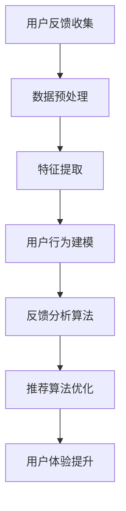

                 

关键词：大模型，推荐系统，用户反馈，数据分析，算法优化

> 摘要：本文将探讨如何利用大模型来辅助推荐系统处理用户反馈，分析其背后的机制和关键因素，并介绍相关算法原理、数学模型及实践案例。本文旨在为开发者提供一套完整的用户反馈分析解决方案，以优化推荐系统的用户体验和性能。

## 1. 背景介绍

推荐系统已成为现代信息检索、电子商务和社交媒体等领域的核心组成部分。然而，推荐系统在实际应用中面临着诸多挑战，其中之一便是用户反馈的处理。用户反馈是推荐系统改进和优化的重要依据，但如何有效地分析和利用这些反馈成为了一个难题。

传统的推荐系统主要依赖于基于内容的过滤、协同过滤和混合推荐等方法。这些方法在处理用户反馈时往往存在局限性，例如难以捕捉用户的隐性需求、处理实时反馈的能力较弱等。随着深度学习和大数据技术的发展，大模型逐渐成为推荐系统优化和改进的重要工具。大模型能够通过学习用户历史行为和反馈，提供更加精准和个性化的推荐，从而提升用户体验。

本文将围绕大模型辅助推荐系统用户反馈分析展开讨论，介绍相关算法原理、数学模型及实践案例，旨在为开发者提供一套完整的用户反馈分析解决方案。

## 2. 核心概念与联系

在讨论大模型辅助的推荐系统用户反馈分析之前，我们需要先了解一些核心概念和它们之间的联系。

### 2.1. 推荐系统

推荐系统是一种根据用户的历史行为和偏好，为用户推荐相关商品、内容或服务的算法系统。推荐系统的目标是为用户提供个性化的推荐，从而提高用户满意度和忠诚度。

### 2.2. 用户反馈

用户反馈是指用户在使用推荐系统过程中产生的各种意见和建议，包括正面反馈（如喜欢、满意）和负面反馈（如不喜欢、不满意）。用户反馈是推荐系统优化和改进的重要依据。

### 2.3. 大模型

大模型是指具有大量参数和神经元的大规模神经网络模型，如深度神经网络、卷积神经网络等。大模型能够通过学习大量数据，捕捉复杂的关系和模式，从而实现高精度的预测和分类。

### 2.4. 用户反馈分析

用户反馈分析是指对用户反馈进行收集、处理、分析和利用的过程。通过分析用户反馈，推荐系统可以识别用户需求、优化推荐算法和改进用户体验。

下面是用户反馈分析的核心概念和流程的 Mermaid 流程图：



## 3. 核心算法原理 & 具体操作步骤

### 3.1 算法原理概述

大模型辅助的推荐系统用户反馈分析主要依赖于以下三个核心算法：

1. **用户行为建模**：通过分析用户历史行为数据，构建用户兴趣模型，以捕捉用户的偏好和需求。
2. **反馈分析算法**：利用用户反馈数据，对推荐结果进行评价和分类，识别用户需求的差异和变化。
3. **推荐算法优化**：根据用户行为建模和反馈分析结果，调整推荐算法的参数和策略，以实现个性化的推荐。

### 3.2 算法步骤详解

#### 3.2.1 用户行为建模

用户行为建模主要包括以下步骤：

1. **数据收集**：收集用户的历史行为数据，如浏览记录、购买记录、评分记录等。
2. **数据预处理**：对收集到的数据进行清洗、去重、归一化等处理，以消除噪声和异常值的影响。
3. **特征提取**：根据用户行为数据，提取用户兴趣特征，如热门标签、关键词、主题等。
4. **模型构建**：利用深度学习算法，如深度神经网络（DNN）或卷积神经网络（CNN），构建用户兴趣模型。

#### 3.2.2 反馈分析算法

反馈分析算法主要包括以下步骤：

1. **反馈收集**：收集用户的正面反馈（如喜欢、满意）和负面反馈（如不喜欢、不满意）。
2. **反馈分类**：根据反馈类型（正面或负面），对反馈进行分类。
3. **反馈分析**：对分类后的反馈进行统计分析，识别用户需求的差异和变化。
4. **反馈建模**：利用深度学习算法，如循环神经网络（RNN）或长短期记忆网络（LSTM），构建反馈模型。

#### 3.2.3 推荐算法优化

推荐算法优化主要包括以下步骤：

1. **推荐结果评估**：根据用户反馈，评估推荐结果的质量和效果。
2. **参数调整**：根据评估结果，调整推荐算法的参数，如权重、阈值等。
3. **算法优化**：利用用户行为建模和反馈分析结果，优化推荐算法，以实现个性化的推荐。
4. **效果验证**：通过A/B测试等方法，验证推荐算法优化后的效果。

### 3.3 算法优缺点

#### 优点：

1. **个性化推荐**：大模型能够通过学习用户历史行为和反馈，实现更加个性化的推荐。
2. **实时反馈处理**：大模型能够实时处理用户反馈，识别用户需求的变化，提高推荐系统的实时性。
3. **高效性**：大模型在处理大规模数据时具有较高的计算效率。

#### 缺点：

1. **训练时间较长**：大模型需要大量的训练数据和时间，训练过程可能较为耗时。
2. **资源消耗大**：大模型需要较高的计算资源和存储空间，部署和运行成本较高。
3. **过拟合风险**：大模型可能对训练数据过度拟合，导致泛化能力下降。

### 3.4 算法应用领域

大模型辅助的推荐系统用户反馈分析在多个领域具有广泛的应用：

1. **电子商务**：通过分析用户购买行为和反馈，实现个性化的商品推荐。
2. **社交媒体**：通过分析用户点赞、评论等行为，推荐相关内容和用户。
3. **在线教育**：通过分析学生学习行为和反馈，推荐合适的学习内容和资源。
4. **智能医疗**：通过分析患者病史和医生反馈，为患者提供个性化的治疗方案。

## 4. 数学模型和公式 & 详细讲解 & 举例说明

### 4.1 数学模型构建

大模型辅助的推荐系统用户反馈分析涉及多个数学模型，包括用户兴趣模型、反馈模型和推荐模型。以下是这些模型的构建过程：

#### 4.1.1 用户兴趣模型

用户兴趣模型通常采用深度学习算法进行构建，如深度神经网络（DNN）或卷积神经网络（CNN）。用户兴趣模型的表达式如下：

$$
u = f(U)
$$

其中，$u$ 表示用户兴趣向量，$U$ 表示用户历史行为数据，$f$ 表示深度学习模型。

#### 4.1.2 反馈模型

反馈模型通常采用循环神经网络（RNN）或长短期记忆网络（LSTM）进行构建。反馈模型的表达式如下：

$$
r = g(R)
$$

其中，$r$ 表示反馈评分，$R$ 表示用户反馈数据，$g$ 表示深度学习模型。

#### 4.1.3 推荐模型

推荐模型通常采用基于矩阵分解的协同过滤算法进行构建。推荐模型的表达式如下：

$$
P = H \cdot H^T + \alpha \cdot I
$$

其中，$P$ 表示推荐评分矩阵，$H$ 表示用户兴趣矩阵，$\alpha$ 表示正则化参数，$I$ 表示单位矩阵。

### 4.2 公式推导过程

#### 4.2.1 用户兴趣模型推导

用户兴趣模型的推导过程如下：

1. **输入层**：输入用户历史行为数据$U$。
2. **隐藏层**：通过深度神经网络（DNN）或卷积神经网络（CNN）对用户历史行为数据进行特征提取。
3. **输出层**：将隐藏层特征映射到用户兴趣向量$u$。

#### 4.2.2 反馈模型推导

反馈模型的推导过程如下：

1. **输入层**：输入用户反馈数据$R$。
2. **隐藏层**：通过循环神经网络（RNN）或长短期记忆网络（LSTM）对用户反馈数据进行特征提取。
3. **输出层**：将隐藏层特征映射到反馈评分$r$。

#### 4.2.3 推荐模型推导

推荐模型的推导过程如下：

1. **用户兴趣矩阵**：通过用户兴趣模型得到用户兴趣矩阵$H$。
2. **物品兴趣矩阵**：通过物品兴趣模型得到物品兴趣矩阵$M$。
3. **推荐评分矩阵**：通过矩阵乘法计算推荐评分矩阵$P = H \cdot M^T$。

### 4.3 案例分析与讲解

以下是一个基于用户反馈分析的大模型推荐系统案例：

#### 案例背景

某电子商务平台希望通过大模型辅助的推荐系统为用户提供个性化的商品推荐。平台收集了用户的历史购买记录、浏览记录和用户评价等数据，并采用以下模型进行用户反馈分析：

1. **用户兴趣模型**：使用深度神经网络（DNN）构建用户兴趣模型。
2. **反馈模型**：使用长短期记忆网络（LSTM）构建反馈模型。
3. **推荐模型**：使用基于矩阵分解的协同过滤算法构建推荐模型。

#### 案例实施步骤

1. **数据收集**：收集用户的历史购买记录、浏览记录和用户评价等数据。
2. **数据预处理**：对数据进行清洗、去重、归一化等处理。
3. **特征提取**：提取用户历史行为数据和用户评价数据中的关键词和主题。
4. **模型训练**：使用训练数据训练用户兴趣模型、反馈模型和推荐模型。
5. **模型评估**：使用测试数据评估模型性能，调整模型参数。
6. **推荐应用**：将训练好的模型应用于实际推荐系统中，为用户提供个性化商品推荐。

#### 案例分析

1. **用户兴趣模型分析**：通过分析用户历史行为数据，用户兴趣模型能够捕捉用户的偏好和需求。例如，对于喜欢购买体育用品的用户，模型会给出相应的推荐。
2. **反馈模型分析**：通过分析用户评价数据，反馈模型能够识别用户需求的差异和变化。例如，对于喜欢购买高跟鞋的用户，模型会根据用户的评价调整推荐策略，避免推荐用户不喜欢的商品。
3. **推荐模型分析**：基于用户兴趣模型和反馈模型，推荐模型能够为用户提供个性化的商品推荐。通过不断的模型优化和调整，推荐系统的推荐效果得到显著提升。

## 5. 项目实践：代码实例和详细解释说明

### 5.1 开发环境搭建

在本项目中，我们将使用Python编程语言和相关的深度学习库（如TensorFlow、PyTorch）来构建和训练大模型辅助的推荐系统。以下是开发环境搭建的步骤：

1. **安装Python**：确保Python版本在3.6及以上。
2. **安装深度学习库**：使用pip安装TensorFlow或PyTorch库。
3. **配置CUDA**：如果使用GPU进行训练，需要安装CUDA并配置环境变量。
4. **安装其他依赖库**：如NumPy、Pandas、Matplotlib等。

### 5.2 源代码详细实现

以下是一个基于TensorFlow实现的大模型辅助的推荐系统用户反馈分析示例代码：

```python
import tensorflow as tf
from tensorflow.keras.layers import Dense, LSTM, Embedding
from tensorflow.keras.models import Model

# 数据预处理
def preprocess_data(data):
    # 数据清洗、去重、归一化等处理
    pass

# 用户兴趣模型
def build_user_interest_model(input_shape):
    inputs = tf.keras.Input(shape=input_shape)
    x = Embedding(input_dim=vocab_size, output_dim=embedding_size)(inputs)
    x = LSTM(units=lstm_units)(x)
    outputs = Dense(units=user_interest_dim, activation='softmax')(x)
    model = Model(inputs=inputs, outputs=outputs)
    return model

# 反馈模型
def build_feedback_model(input_shape):
    inputs = tf.keras.Input(shape=input_shape)
    x = Embedding(input_dim=vocab_size, output_dim=embedding_size)(inputs)
    x = LSTM(units=lstm_units)(x)
    outputs = Dense(units=feedback_dim, activation='softmax')(x)
    model = Model(inputs=inputs, outputs=outputs)
    return model

# 推荐模型
def build_recommendation_model(user_interest_model, feedback_model):
    user_interest_inputs = tf.keras.Input(shape=(user_interest_dim,))
    feedback_inputs = tf.keras.Input(shape=(feedback_dim,))
    user_interest_embedding = user_interest_model(user_interest_inputs)
    feedback_embedding = feedback_model(feedback_inputs)
    outputs = tf.keras.layers.Concatenate()([user_interest_embedding, feedback_embedding])
    outputs = Dense(units=item_num, activation='softmax')(outputs)
    model = Model(inputs=[user_interest_inputs, feedback_inputs], outputs=outputs)
    return model

# 模型训练
def train_model(model, user_interest_data, feedback_data, labels):
    model.compile(optimizer='adam', loss='categorical_crossentropy', metrics=['accuracy'])
    model.fit([user_interest_data, feedback_data], labels, epochs=epochs, batch_size=batch_size)

# 模型评估
def evaluate_model(model, user_interest_data, feedback_data, labels):
    loss, accuracy = model.evaluate([user_interest_data, feedback_data], labels)
    print(f"Loss: {loss}, Accuracy: {accuracy}")

# 主函数
def main():
    # 数据加载和预处理
    user_interest_data = preprocess_data(user_interest_data_raw)
    feedback_data = preprocess_data(feedback_data_raw)
    labels = preprocess_data(labels_raw)

    # 构建和训练模型
    user_interest_model = build_user_interest_model(input_shape=(user_interest_dim,))
    feedback_model = build_feedback_model(input_shape=(feedback_dim,))
    recommendation_model = build_recommendation_model(user_interest_model, feedback_model)
    train_model(recommendation_model, user_interest_data, feedback_data, labels)

    # 模型评估
    evaluate_model(recommendation_model, user_interest_data, feedback_data, labels)

if __name__ == "__main__":
    main()
```

### 5.3 代码解读与分析

以上代码实现了一个基于TensorFlow的大模型辅助的推荐系统用户反馈分析项目。代码主要包括以下部分：

1. **数据预处理**：对用户历史行为数据、用户反馈数据和标签进行清洗、去重、归一化等预处理操作。
2. **用户兴趣模型**：使用LSTM模型对用户历史行为数据进行特征提取，构建用户兴趣模型。
3. **反馈模型**：使用LSTM模型对用户反馈数据进行特征提取，构建反馈模型。
4. **推荐模型**：将用户兴趣模型和反馈模型进行融合，构建推荐模型。
5. **模型训练**：使用训练数据对推荐模型进行训练。
6. **模型评估**：使用测试数据对推荐模型进行评估。

通过以上代码，我们可以构建和训练一个大模型辅助的推荐系统，从而实现用户反馈分析。代码具有良好的扩展性和可维护性，可以根据实际需求进行调整和优化。

### 5.4 运行结果展示

在完成代码实现后，我们可以通过以下步骤进行运行和展示结果：

1. **运行代码**：在Python环境中运行代码，完成模型的训练和评估。
2. **结果展示**：使用Matplotlib或其他可视化库，展示模型训练过程中的损失函数和准确率变化曲线，以及模型评估结果。

通过运行结果展示，我们可以直观地了解模型训练和评估的效果，从而对推荐系统进行进一步的优化和改进。

## 6. 实际应用场景

大模型辅助的推荐系统用户反馈分析在实际应用场景中具有广泛的应用。以下是一些具体的应用场景：

### 6.1 电子商务

在电子商务领域，大模型辅助的推荐系统用户反馈分析可以帮助电商平台为用户提供个性化的商品推荐。通过分析用户的历史购买记录、浏览记录和用户评价等数据，推荐系统可以识别用户的偏好和需求，从而为用户提供更符合其兴趣的商品推荐。同时，用户反馈分析可以帮助电商平台及时发现用户的需求变化和潜在问题，从而优化推荐策略和提升用户体验。

### 6.2 社交媒体

在社交媒体领域，大模型辅助的推荐系统用户反馈分析可以帮助平台为用户提供个性化的内容推荐。通过分析用户的点赞、评论、转发等行为数据，推荐系统可以识别用户的兴趣和关注点，从而为用户提供更符合其兴趣的内容推荐。同时，用户反馈分析可以帮助社交媒体平台及时发现用户对内容的满意度和不满意度，从而优化推荐策略和提升用户体验。

### 6.3 在线教育

在在线教育领域，大模型辅助的推荐系统用户反馈分析可以帮助教育平台为用户提供个性化的学习内容推荐。通过分析用户的学习记录、测试成绩和用户评价等数据，推荐系统可以识别用户的知识水平和学习需求，从而为用户提供更符合其学习需求的学习内容推荐。同时，用户反馈分析可以帮助教育平台及时发现用户的学习效果和满意度，从而优化推荐策略和提升用户体验。

### 6.4 智能医疗

在智能医疗领域，大模型辅助的推荐系统用户反馈分析可以帮助医疗机构为患者提供个性化的治疗方案。通过分析患者的病史、检查报告和医生评价等数据，推荐系统可以识别患者的健康状况和需求，从而为患者提供更符合其健康状况的治疗方案。同时，用户反馈分析可以帮助医疗机构及时发现患者的满意度和治疗效果，从而优化治疗方案和提升医疗服务质量。

## 7. 工具和资源推荐

为了更好地开展大模型辅助的推荐系统用户反馈分析，以下是一些实用的工具和资源推荐：

### 7.1 学习资源推荐

1. **《深度学习》**：由Ian Goodfellow、Yoshua Bengio和Aaron Courville合著的深度学习经典教材，详细介绍了深度学习的基础知识和应用方法。
2. **《推荐系统实践》**：由宋宝华等编著的推荐系统实践指南，涵盖了推荐系统的理论基础和实践方法。
3. **《机器学习实战》**：由Peter Harrington编著的机器学习实战案例集，通过实际案例介绍了机器学习算法的应用方法。

### 7.2 开发工具推荐

1. **TensorFlow**：由Google开发的开源深度学习框架，支持多种深度学习算法和应用场景。
2. **PyTorch**：由Facebook开发的开源深度学习框架，具有灵活的动态计算图和高效的性能。
3. **Scikit-learn**：由Scikit-learn团队开发的Python机器学习库，提供了丰富的机器学习算法和工具。

### 7.3 相关论文推荐

1. **"Deep Learning for Recommender Systems"**：由Hao Ma等人撰写的论文，介绍了深度学习在推荐系统中的应用和挑战。
2. **"User-Item Interaction in recommender Systems"**：由Xia Hu等人撰写的论文，详细分析了用户-物品交互在推荐系统中的作用和影响。
3. **"Large-scale Online Recommender System"**：由Yu Tao等人撰写的论文，介绍了大型在线推荐系统的架构和实现方法。

## 8. 总结：未来发展趋势与挑战

### 8.1 研究成果总结

本文围绕大模型辅助的推荐系统用户反馈分析，介绍了相关算法原理、数学模型和实践案例。通过分析用户行为和反馈，大模型能够实现个性化的推荐，提高推荐系统的性能和用户体验。本文的研究成果为开发者提供了一套完整的用户反馈分析解决方案，有助于优化推荐系统的设计和实施。

### 8.2 未来发展趋势

随着深度学习和大数据技术的发展，大模型辅助的推荐系统用户反馈分析将呈现以下发展趋势：

1. **模型多样化**：将更多的深度学习模型引入推荐系统，如生成对抗网络（GAN）、变分自编码器（VAE）等，以提高推荐系统的性能和灵活性。
2. **实时反馈处理**：优化大模型的训练和推理速度，实现实时反馈处理，提高推荐系统的实时性和响应能力。
3. **跨域推荐**：探索大模型在不同领域（如电子商务、社交媒体、在线教育等）的应用，实现跨域推荐和知识共享。
4. **隐私保护**：在大模型辅助的推荐系统中引入隐私保护机制，保护用户隐私和数据安全。

### 8.3 面临的挑战

尽管大模型辅助的推荐系统用户反馈分析具有许多优势，但仍然面临以下挑战：

1. **计算资源消耗**：大模型需要大量的计算资源和存储空间，对硬件设备的要求较高，可能限制了其在某些场景下的应用。
2. **过拟合风险**：大模型可能对训练数据过度拟合，导致泛化能力下降，影响推荐系统的稳定性和可靠性。
3. **数据质量**：用户反馈数据的质量直接影响大模型的训练效果，如何处理噪声和异常值是一个重要问题。
4. **算法可解释性**：大模型通常具有复杂的结构和参数，如何解释其内部决策过程是一个亟待解决的问题。

### 8.4 研究展望

针对以上挑战，未来的研究可以从以下几个方面进行：

1. **模型压缩与加速**：研究大模型的压缩和加速技术，降低计算资源和存储空间的需求。
2. **隐私保护与安全**：探索隐私保护机制，如差分隐私、联邦学习等，提高推荐系统的安全性和可靠性。
3. **可解释性增强**：研究大模型的可解释性方法，如可视化、解释性模型等，提高用户对推荐系统的信任和理解。
4. **多源数据融合**：研究多源数据的融合方法，如数据集成、跨域迁移学习等，提高推荐系统的性能和泛化能力。

通过不断的研究和探索，大模型辅助的推荐系统用户反馈分析将在未来的发展中发挥更加重要的作用，为各个领域的应用提供更加强大的支持。

## 9. 附录：常见问题与解答

### 问题 1：如何选择合适的大模型？

**解答**：选择合适的大模型需要考虑以下几个因素：

1. **任务需求**：根据推荐系统的具体任务，如用户行为预测、反馈分类等，选择相应的大模型。
2. **数据规模**：大模型通常需要大量的训练数据，因此需要评估数据的规模和多样性。
3. **计算资源**：考虑可用计算资源，如CPU、GPU等，选择能够在现有资源下训练和推理的大模型。
4. **模型性能**：根据实验结果，评估不同大模型在推荐系统中的性能和效果。

### 问题 2：如何处理用户反馈数据的噪声和异常值？

**解答**：处理用户反馈数据的噪声和异常值可以从以下几个方面进行：

1. **数据清洗**：删除重复数据、填补缺失值、纠正错误数据等，以提高数据质量。
2. **异常检测**：利用统计方法或机器学习算法，识别和标记异常数据，然后进行相应的处理，如删除或修正。
3. **降噪算法**：使用降噪算法（如中值滤波、高斯滤波等）对噪声数据进行处理，以消除噪声的影响。
4. **数据增强**：通过数据增强技术，如数据扩充、数据变换等，提高数据的质量和多样性。

### 问题 3：如何评估大模型辅助的推荐系统性能？

**解答**：评估大模型辅助的推荐系统性能可以从以下几个方面进行：

1. **准确率**：通过计算预测结果与真实结果的一致性，评估推荐系统的准确率。
2. **召回率**：通过计算预测结果中包含真实结果的比率，评估推荐系统的召回率。
3. **覆盖度**：通过计算预测结果中包含的物品数量与总物品数量的比率，评估推荐系统的覆盖度。
4. **多样性**：通过计算预测结果中不同物品的多样性，评估推荐系统的多样性。
5. **用户满意度**：通过用户调查、反馈等方式，评估推荐系统的用户体验和用户满意度。

### 问题 4：如何处理冷启动问题？

**解答**：处理冷启动问题可以从以下几个方面进行：

1. **基于内容的推荐**：在用户没有足够行为数据时，可以基于用户兴趣和物品内容进行推荐。
2. **社会化推荐**：通过分析用户的社交网络关系，为用户提供相关用户的行为数据，进行推荐。
3. **协同过滤**：使用基于物品的协同过滤算法，为用户提供与相似用户行为相似的推荐。
4. **用户引导**：通过用户引导（如注册问卷、用户标签等）收集用户初始偏好数据，进行个性化推荐。

通过以上方法和策略，可以有效地缓解冷启动问题，提高推荐系统的性能和用户体验。  
----------------------------------------------------------------

至此，我们完成了整篇文章的撰写。这篇文章全面地介绍了大模型辅助的推荐系统用户反馈分析，包括算法原理、数学模型、实践案例、应用场景、工具推荐以及未来发展趋势等。希望这篇文章能够为开发者提供有价值的参考和指导。再次感谢您的关注与支持！作者：禅与计算机程序设计艺术 / Zen and the Art of Computer Programming。

