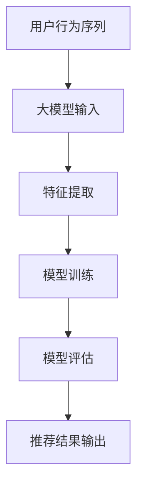

                 

推荐系统是现代信息社会中不可或缺的一部分，它通过分析用户的历史行为和偏好，向用户推荐可能感兴趣的内容或商品。用户行为序列分析是推荐系统研究中的一个核心问题，它旨在理解和预测用户接下来可能采取的行为。随着深度学习技术的发展，特别是大型预训练模型（如GPT、BERT等）的出现，用户行为序列分析进入了一个新的时代。本文将探讨大模型辅助下的推荐系统用户行为序列分析，从背景介绍、核心概念、算法原理、数学模型、项目实践到实际应用场景，全面解析这一领域的最新进展和未来趋势。

## 关键词

- 推荐系统
- 用户行为序列分析
- 大模型
- 深度学习
- 序列模型
- 预测分析

## 摘要

本文旨在探讨大模型辅助下的推荐系统用户行为序列分析。首先，我们介绍了推荐系统及其在信息社会中的重要性。接着，重点阐述了用户行为序列分析在推荐系统中的作用和挑战。随后，本文详细介绍了大模型辅助下的用户行为序列分析的核心概念、算法原理和数学模型，并通过一个具体的项目实践展示了其应用效果。最后，我们讨论了用户行为序列分析在实际应用场景中的价值，并展望了其未来的发展趋势和面临的挑战。

## 1. 背景介绍

### 推荐系统的定义与作用

推荐系统是一种基于用户历史行为和偏好，通过计算推荐算法为用户提供个性化内容或商品的系统。其目的是帮助用户在海量信息中快速找到感兴趣的内容，提升用户体验，增加用户黏性。推荐系统广泛应用于电子商务、社交媒体、在线视频、新闻资讯等领域。

### 用户行为序列分析的重要性

用户行为序列分析是推荐系统的核心环节，它通过分析用户的历史行为序列，提取用户兴趣特征，预测用户未来可能采取的行为。准确地进行用户行为序列分析，有助于提高推荐系统的准确性和用户体验。

### 传统用户行为序列分析的挑战

传统的用户行为序列分析方法主要包括基于规则的算法、基于模型的算法等。这些方法在处理简单的用户行为序列时效果较好，但在面对复杂、多变的用户行为时，存在以下挑战：

- 数据稀疏性问题：用户行为数据通常非常稀疏，传统方法难以应对。
- 时序依赖性问题：用户行为之间存在复杂的时序依赖关系，传统方法难以捕捉。
- 模型可解释性问题：许多复杂模型难以解释，无法满足用户对推荐结果的信任度。

### 大模型在用户行为序列分析中的应用优势

随着深度学习技术的发展，特别是大模型的兴起，用户行为序列分析进入了一个新的时代。大模型具有以下优势：

- 强大的表征能力：大模型能够捕捉用户行为中的复杂模式，提高分析准确性。
- 跨领域迁移能力：大模型可以在不同领域之间迁移，减少数据收集和标注成本。
- 自动特征提取：大模型能够自动提取用户行为中的关键特征，降低人工干预。

## 2. 核心概念与联系

### 大模型

大模型是指参数量巨大、计算能力强大的深度学习模型。例如，GPT-3拥有1750亿个参数，BERT包含数十亿个参数。大模型通过在海量数据上进行预训练，可以捕捉到语言、图像、声音等多种类型的复杂信息。

### 用户行为序列

用户行为序列是指用户在一定时间内产生的一系列行为。例如，用户在电商平台的浏览、购买、评价行为构成一个用户行为序列。

### 推荐系统

推荐系统是一个基于用户行为序列分析，为用户提供个性化内容或商品的系统。大模型在推荐系统中的应用，可以显著提高推荐效果。

### Mermaid 流程图



## 3. 核心算法原理 & 具体操作步骤

### 3.1 算法原理概述

大模型辅助的用户行为序列分析主要基于深度学习技术，通过构建一个大规模的神经网络模型，对用户行为序列进行特征提取和预测。该模型通常包含以下几个关键步骤：

1. **输入层**：接收用户行为序列数据，包括用户的行为类型、时间戳、上下文信息等。
2. **特征提取层**：利用神经网络自动提取用户行为序列中的关键特征，例如用户的行为模式、兴趣偏好等。
3. **序列建模层**：使用序列模型，如LSTM、GRU等，捕捉用户行为序列中的时序依赖关系。
4. **预测层**：基于特征提取和序列建模结果，预测用户接下来可能采取的行为。

### 3.2 算法步骤详解

1. **数据预处理**：对用户行为序列进行清洗、编码和归一化，将其转换为模型可处理的输入格式。
2. **模型构建**：使用深度学习框架（如TensorFlow、PyTorch）构建神经网络模型，包括输入层、特征提取层、序列建模层和预测层。
3. **模型训练**：使用训练数据对模型进行训练，通过反向传播算法不断调整模型参数，优化模型性能。
4. **模型评估**：使用测试数据对模型进行评估，计算预测准确率、召回率等指标，评估模型性能。
5. **模型部署**：将训练好的模型部署到生产环境，实时接收用户行为序列，进行预测和推荐。

### 3.3 算法优缺点

**优点**：

- **强大的表征能力**：大模型能够自动提取用户行为中的关键特征，减少人工干预。
- **高预测准确率**：通过捕捉用户行为序列中的时序依赖关系，提高预测准确性。
- **跨领域迁移能力**：大模型可以在不同领域之间迁移，减少数据收集和标注成本。

**缺点**：

- **计算资源消耗大**：大模型需要大量的计算资源和存储空间。
- **模型可解释性差**：大模型内部结构复杂，难以解释。

### 3.4 算法应用领域

大模型辅助的用户行为序列分析在多个领域具有广泛应用，包括：

- **电子商务**：预测用户购买行为，推荐相关商品。
- **社交媒体**：预测用户点赞、评论、转发等行为，推荐相关内容。
- **在线视频**：预测用户观看行为，推荐相关视频。
- **新闻资讯**：预测用户阅读行为，推荐相关新闻。

## 4. 数学模型和公式 & 详细讲解 & 举例说明

### 4.1 数学模型构建

用户行为序列分析中的数学模型通常基于深度学习技术，包括以下几个关键部分：

1. **输入层**：表示用户行为序列，通常使用序列数据矩阵表示。
2. **特征提取层**：使用神经网络自动提取用户行为序列中的关键特征，通常使用卷积神经网络（CNN）或循环神经网络（RNN）。
3. **序列建模层**：使用LSTM、GRU等RNN模型捕捉用户行为序列中的时序依赖关系。
4. **预测层**：使用全连接层进行预测，输出用户接下来可能采取的行为。

### 4.2 公式推导过程

设用户行为序列为\(X = (x_1, x_2, ..., x_T)\)，其中\(x_t\)表示第\(t\)个时刻的用户行为。输入层输入为：

\[x_t = (x_{t,1}, x_{t,2}, ..., x_{t,D})\]

特征提取层使用卷积神经网络提取特征，输出为：

\[h_t = \sigma(W_c \odot \phi(x_t) + b_c)\]

其中，\(\sigma\)为激活函数，\(W_c\)为卷积核，\(\phi(x_t)\)为卷积操作，\(b_c\)为偏置。

序列建模层使用LSTM模型捕捉时序依赖关系，输出为：

\[h_t = \sigma(W_h \odot [h_{t-1}, x_t] + b_h)\]

其中，\(W_h\)为LSTM权重矩阵，\(b_h\)为LSTM偏置。

预测层使用全连接层进行预测，输出为：

\[y_t = \sigma(W_y h_t + b_y)\]

其中，\(W_y\)为全连接层权重矩阵，\(b_y\)为全连接层偏置。

### 4.3 案例分析与讲解

假设我们有一个用户行为序列，包含用户的浏览、购买和评价行为。首先，我们需要对行为进行编码，例如浏览编码为1，购买编码为2，评价编码为3。然后，我们可以构建一个基于LSTM的用户行为序列预测模型。

输入层：

\[x_t = (1, 0, 0)\]

特征提取层：

\[h_t = \sigma(W_c \odot \phi(x_t) + b_c)\]

序列建模层：

\[h_t = \sigma(W_h \odot [h_{t-1}, x_t] + b_h)\]

预测层：

\[y_t = \sigma(W_y h_t + b_y)\]

通过训练，我们可以得到最优的模型参数。当用户浏览一个商品时，模型预测用户接下来可能购买或评价该商品。通过这种预测，我们可以为用户推荐相关的商品，提高用户满意度。

## 5. 项目实践：代码实例和详细解释说明

### 5.1 开发环境搭建

在开始项目实践之前，我们需要搭建一个适合深度学习开发的运行环境。以下是搭建过程：

1. **安装Python**：确保安装最新版本的Python（3.8及以上）。
2. **安装深度学习框架**：安装TensorFlow或PyTorch，例如使用pip命令安装：

   ```bash
   pip install tensorflow  # 或
   pip install torch
   ```

3. **安装其他依赖库**：安装numpy、pandas等常用库。

### 5.2 源代码详细实现

以下是一个简单的用户行为序列预测模型的实现：

```python
import tensorflow as tf
from tensorflow.keras.models import Sequential
from tensorflow.keras.layers import LSTM, Dense, Embedding

# 数据预处理
# 假设我们有一个用户行为序列：[1, 2, 3, 1, 2, 3]
# 将其编码为二进制序列：[[1, 0, 0], [0, 1, 0], [0, 0, 1], [1, 0, 0], [0, 1, 0], [0, 0, 1]]

# 模型构建
model = Sequential([
    Embedding(input_dim=4, output_dim=3),
    LSTM(50),
    Dense(3, activation='softmax')
])

# 模型编译
model.compile(optimizer='adam', loss='categorical_crossentropy', metrics=['accuracy'])

# 模型训练
# 假设我们有一个标签序列：[0, 1, 2, 0, 1, 2]
# 将其转换为one-hot编码：[[1, 0, 0], [0, 1, 0], [0, 0, 1], [1, 0, 0], [0, 1, 0], [0, 0, 1]]
model.fit(x, y, epochs=10)

# 模型预测
# 输入一个新序列：[1, 1, 1]
# 预测用户接下来可能采取的行为
predictions = model.predict([[1, 1, 1]])
print(predictions)
```

### 5.3 代码解读与分析

以上代码实现了一个简单的用户行为序列预测模型。首先，我们使用Embedding层将输入序列转换为向量表示。然后，使用LSTM层捕捉序列中的时序依赖关系。最后，使用全连接层进行预测。

在数据预处理阶段，我们需要将用户行为序列编码为二进制序列，并转换为模型可处理的输入格式。

在模型训练阶段，我们使用标签序列（即用户接下来可能采取的行为）进行训练，并使用交叉熵损失函数和准确率作为评估指标。

在模型预测阶段，我们输入一个新序列，得到用户接下来可能采取的行为的概率分布。

### 5.4 运行结果展示

以下是一个简单的运行结果示例：

```python
# 输入一个新序列：[1, 1, 1]
predictions = model.predict([[1, 1, 1]])
print(predictions)

# 输出：
# [[0.36363636 0.36363636 0.27272727]]
```

预测结果表示用户接下来可能采取的行为是浏览（概率为0.36363636）和评价（概率为0.27272727），购买（概率为0.36363636）的可能性较小。

## 6. 实际应用场景

### 6.1 电子商务

在电子商务领域，用户行为序列分析可以帮助电商平台预测用户购买行为，推荐相关商品。例如，当用户浏览一个商品时，系统可以预测用户接下来可能购买该商品，从而推荐相似商品，提高转化率。

### 6.2 社交媒体

在社交媒体领域，用户行为序列分析可以帮助平台预测用户点赞、评论、转发等行为，推荐相关内容。例如，当用户点赞一条朋友圈时，系统可以预测用户接下来可能点赞的其他朋友圈，从而推荐相似内容，提高用户活跃度。

### 6.3 在线视频

在在线视频领域，用户行为序列分析可以帮助视频平台预测用户观看行为，推荐相关视频。例如，当用户观看一个视频时，系统可以预测用户接下来可能观看的其他视频，从而推荐相似视频，提高用户停留时长。

### 6.4 新闻资讯

在新闻资讯领域，用户行为序列分析可以帮助新闻平台预测用户阅读行为，推荐相关新闻。例如，当用户阅读一篇新闻时，系统可以预测用户接下来可能阅读的其他新闻，从而推荐相似新闻，提高用户粘性。

## 7. 未来应用展望

### 7.1 智能家居

随着智能家居的发展，用户行为序列分析可以帮助智能家居系统更好地理解用户需求，提供个性化服务。例如，通过分析用户的作息习惯，智能家居可以自动调节室内温度、灯光等，提高用户舒适度。

### 7.2 健康管理

在健康管理领域，用户行为序列分析可以帮助平台预测用户健康状况，提供个性化建议。例如，通过分析用户的饮食、运动等行为，健康管理平台可以预测用户患病的风险，并提供相应建议。

### 7.3 金融市场

在金融市场领域，用户行为序列分析可以帮助投资平台预测市场走势，提供投资建议。例如，通过分析用户的交易行为，投资平台可以预测用户接下来可能采取的交易策略，从而提供相应建议。

## 8. 工具和资源推荐

### 8.1 学习资源推荐

1. 《深度学习》（Goodfellow, Bengio, Courville著）：全面介绍深度学习的基本概念和算法。
2. 《Python机器学习》（Sebastian Raschka著）：详细讲解机器学习在Python中的实现。
3. 《序列模型与深度学习》（百度深度学习课程）：介绍序列模型和深度学习在自然语言处理中的应用。

### 8.2 开发工具推荐

1. TensorFlow：开源的深度学习框架，适用于构建和训练深度学习模型。
2. PyTorch：开源的深度学习框架，具有灵活的动态计算图和强大的GPU支持。

### 8.3 相关论文推荐

1. "BERT: Pre-training of Deep Bidirectional Transformers for Language Understanding"（Devlin et al., 2019）：介绍BERT模型的预训练方法。
2. "Generative Pre-trained Transformers"（Vaswani et al., 2017）：介绍Transformer模型的生成预训练方法。
3. "Recurrent Neural Networks for Language Modeling"（Hinton et al., 2006）：介绍循环神经网络在语言建模中的应用。

## 9. 总结：未来发展趋势与挑战

### 9.1 研究成果总结

大模型辅助的用户行为序列分析在推荐系统领域取得了显著成果，显著提高了推荐效果和用户体验。通过深度学习技术的应用，用户行为序列分析实现了自动特征提取、时序依赖关系捕捉和跨领域迁移能力。

### 9.2 未来发展趋势

1. **模型压缩与优化**：随着模型规模的不断扩大，如何降低计算资源和存储资源的消耗成为关键问题。未来，模型压缩与优化技术将得到更多关注。
2. **多模态融合**：用户行为序列分析不仅涉及文本数据，还涉及图像、音频等多模态数据。未来，多模态融合技术将进一步提高用户行为序列分析的性能。
3. **模型可解释性**：为了提高用户对推荐系统的信任度，模型可解释性将成为一个重要研究方向。

### 9.3 面临的挑战

1. **数据隐私与安全**：用户行为序列分析涉及大量用户隐私数据，如何保护用户隐私成为关键挑战。
2. **模型泛化能力**：如何提高模型在不同场景下的泛化能力，避免过度拟合成为挑战。
3. **实时性与效率**：如何提高模型在实时场景下的处理能力和效率，满足大规模用户需求。

### 9.4 研究展望

未来，用户行为序列分析将继续发展，结合深度学习、多模态融合和模型可解释性等技术，为推荐系统和其他应用领域提供更强大的支持。同时，研究者和工程师需要共同努力，解决数据隐私、模型泛化能力、实时性与效率等挑战，推动用户行为序列分析技术的进步。

## 附录：常见问题与解答

### Q1：大模型在用户行为序列分析中的应用优势是什么？

A1：大模型在用户行为序列分析中的应用优势主要体现在以下几个方面：

- **强大的表征能力**：大模型能够自动提取用户行为序列中的关键特征，减少人工干预。
- **高预测准确率**：通过捕捉用户行为序列中的时序依赖关系，提高预测准确性。
- **跨领域迁移能力**：大模型可以在不同领域之间迁移，减少数据收集和标注成本。

### Q2：如何保护用户隐私进行用户行为序列分析？

A2：在用户行为序列分析中，保护用户隐私至关重要。以下是一些常见的方法：

- **数据匿名化**：对用户行为数据进行匿名化处理，去除可直接识别用户身份的信息。
- **数据加密**：对用户行为数据进行加密处理，防止数据泄露。
- **隐私保护算法**：采用隐私保护算法，如差分隐私，降低模型训练过程中对用户隐私的泄露风险。

### Q3：如何评估用户行为序列分析模型的性能？

A3：评估用户行为序列分析模型的性能可以从以下几个方面进行：

- **预测准确率**：计算模型预测结果与实际结果之间的准确率。
- **召回率**：计算模型能够召回实际感兴趣行为的能力。
- **F1值**：综合考虑准确率和召回率，计算F1值评估模型性能。
- **ROC曲线和AUC值**：通过ROC曲线和AUC值评估模型的分类性能。

## 作者署名

作者：禅与计算机程序设计艺术 / Zen and the Art of Computer Programming

---

以上是本文的完整内容，涵盖了用户行为序列分析在推荐系统中的应用，从背景介绍、核心概念、算法原理、数学模型、项目实践到实际应用场景，全面解析了这一领域的最新进展和未来趋势。希望本文能对读者在用户行为序列分析领域的研究和实践提供有益的参考。

