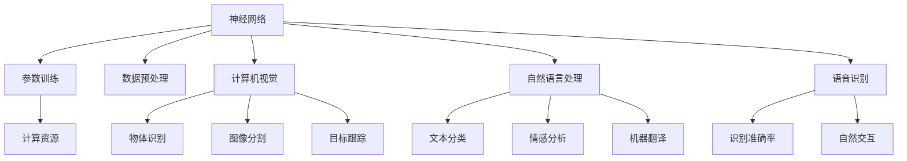

                 

关键词：大模型，AI，创业，产品管理，技术架构，深度学习，应用场景，未来展望

> 摘要：本文旨在为 AI 创业的初学者和产品经理提供一套全面的大模型驱动的 AI 创业指南。通过对大模型在 AI 创业中的重要性、核心概念、算法原理、数学模型、项目实践、实际应用场景以及未来发展展望的深入探讨，帮助读者更好地理解和掌握大模型驱动的 AI 创业方法，从而在竞争激烈的市场中脱颖而出。

## 1. 背景介绍

随着人工智能技术的迅猛发展，AI 已成为全球科技创新和商业竞争的核心驱动力。大模型作为 AI 技术的重要组成部分，其在语音识别、自然语言处理、计算机视觉等领域的应用取得了显著的成果。与此同时，越来越多的创业者开始关注并投身于 AI 领域，希望通过创新的产品和服务来满足市场需求，实现商业价值。

然而，AI 创业的成功并非易事。产品经理在创业过程中需要面对诸多挑战，如技术选型、团队搭建、市场推广等。为了提高创业成功率，产品经理需要具备扎实的技术背景和敏锐的市场洞察力，同时能够灵活运用大模型技术，实现产品的创新和突破。

本文将从以下几个方面展开讨论：

1. **大模型在 AI 创业中的重要性**：介绍大模型的基本概念、发展历程以及在 AI 创业中的应用价值。
2. **核心概念与联系**：详细阐述大模型的技术架构、关键算法原理以及与其他 AI 技术的关联。
3. **核心算法原理与具体操作步骤**：解析大模型的训练过程、优化策略以及在实际应用中的效果评估。
4. **数学模型和公式**：介绍大模型的数学基础，包括数据预处理、模型优化、损失函数等方面的公式推导和案例讲解。
5. **项目实践**：通过代码实例和详细解释，展示如何搭建和优化大模型。
6. **实际应用场景**：分析大模型在各个领域的应用案例，探讨其在未来市场中的发展前景。
7. **工具和资源推荐**：为读者提供相关的学习资源、开发工具和学术论文推荐。
8. **未来发展趋势与挑战**：总结研究成果，探讨 AI 创业的未来发展方向和面临的挑战。

## 2. 核心概念与联系

### 2.1 大模型的基本概念

大模型（Large Model）是指具有数十亿甚至千亿参数规模的人工神经网络模型。与传统的小型模型相比，大模型具有更高的计算复杂度和更强的建模能力。大模型的出现，标志着人工智能技术进入了新的阶段。

大模型的发展历程可以追溯到 2012 年，当时深度学习技术在图像识别领域的突破性成果引起了广泛关注。随着计算能力的提升和数据规模的扩大，大模型逐渐成为人工智能研究的热点。代表性的大模型包括谷歌的 BERT、微软的 Turing-NLG、Facebook 的 GPT-3 等。

### 2.2 大模型的技术架构

大模型的技术架构主要包括以下几个部分：

1. **神经网络**：大模型的核心是神经网络，由多层神经元组成。每层神经元通过激活函数进行非线性变换，从而实现输入数据的特征提取和分类。
2. **参数训练**：大模型的参数训练是模型优化的关键步骤。通过梯度下降等优化算法，不断调整模型参数，使模型在训练数据上达到最佳性能。
3. **数据预处理**：大模型对数据预处理的要求较高，包括数据清洗、归一化、数据增强等操作，以确保输入数据的多样性和质量。
4. **计算资源**：大模型的训练和推理过程需要大量的计算资源。高性能计算平台和分布式计算技术是实现大模型的关键。

### 2.3 大模型与其他 AI 技术的关联

大模型与其他 AI 技术之间存在紧密的联系和相互促进的关系。例如：

1. **计算机视觉**：大模型在计算机视觉领域的应用取得了显著成果，如物体识别、图像分割、目标跟踪等。大模型为计算机视觉任务提供了更强的特征提取能力和更灵活的建模方式。
2. **自然语言处理**：大模型在自然语言处理领域的应用也越来越广泛，如文本分类、情感分析、机器翻译等。大模型通过学习大规模语料库，实现了对人类语言更深层次的理解和生成。
3. **语音识别**：大模型在语音识别领域的表现也日益突出，通过深度神经网络和循环神经网络等算法，实现了更高的识别准确率和更自然的语音交互体验。

为了更直观地展示大模型的技术架构和与其他 AI 技术的关联，以下是一个使用 Mermaid 流程图表示的大模型原理图：



## 3. 核心算法原理 & 具体操作步骤

### 3.1 算法原理概述

大模型的核心算法是基于深度神经网络（Deep Neural Network，DNN）的训练和优化。深度神经网络由多个隐藏层组成，通过逐层提取特征，实现对输入数据的建模和预测。大模型通过增加网络层数和神经元数量，实现了对复杂数据结构的建模。

大模型的训练过程主要包括以下步骤：

1. **数据预处理**：对输入数据进行清洗、归一化和数据增强等处理，确保数据的质量和多样性。
2. **模型初始化**：随机初始化模型参数，为训练过程提供初始值。
3. **前向传播**：将输入数据输入到模型中，通过前向传播计算输出结果。
4. **损失函数计算**：计算输出结果与真实值之间的差异，使用损失函数（如均方误差、交叉熵等）进行量化。
5. **反向传播**：通过反向传播算法，计算损失函数关于模型参数的梯度，并更新模型参数。
6. **模型优化**：使用优化算法（如梯度下降、Adam 等）对模型参数进行迭代优化，以降低损失函数值。

### 3.2 算法步骤详解

#### 3.2.1 数据预处理

数据预处理是保证模型训练效果的关键步骤。具体操作包括：

1. **数据清洗**：去除数据中的噪声和异常值，保证数据的完整性和一致性。
2. **归一化**：将输入数据缩放到相同的尺度范围内，以消除不同特征之间的量纲影响。
3. **数据增强**：通过随机裁剪、旋转、缩放等方式，增加训练数据的多样性，提高模型的泛化能力。

#### 3.2.2 模型初始化

模型初始化是随机选择模型参数的过程。常用的初始化方法包括：

1. **随机初始化**：随机生成模型参数的初始值。
2. **高斯初始化**：使用高斯分布生成模型参数的初始值，以降低梯度消失和梯度爆炸的风险。

#### 3.2.3 前向传播

前向传播是模型计算输出结果的过程。具体步骤如下：

1. **输入数据输入**：将预处理后的输入数据输入到模型中。
2. **逐层计算**：将输入数据通过多层神经网络，逐层计算得到输出结果。
3. **激活函数应用**：在每层神经网络的输出结果上应用激活函数，以实现非线性变换。

#### 3.2.4 损失函数计算

损失函数用于衡量模型输出结果与真实值之间的差异。常用的损失函数包括：

1. **均方误差（MSE）**：用于回归任务，计算输出结果与真实值之间的平均平方误差。
2. **交叉熵（Cross Entropy）**：用于分类任务，计算输出结果与真实标签之间的交叉熵损失。

#### 3.2.5 反向传播

反向传播是模型参数优化的过程。具体步骤如下：

1. **计算梯度**：通过链式法则，计算损失函数关于模型参数的梯度。
2. **梯度更新**：使用梯度下降等优化算法，更新模型参数，以降低损失函数值。

#### 3.2.6 模型优化

模型优化是迭代更新模型参数的过程。常用的优化算法包括：

1. **梯度下降（Gradient Descent）**：根据梯度方向更新模型参数，以最小化损失函数。
2. **Adam 优化器**：结合梯度的一阶矩估计和二阶矩估计，实现更稳定的参数更新。

### 3.3 算法优缺点

大模型的训练算法具有以下优点：

1. **强大的建模能力**：大模型能够学习到更复杂的特征和模式，适用于解决复杂数据问题。
2. **泛化能力强**：通过大量训练数据和丰富的数据增强技术，大模型具有更好的泛化能力。

然而，大模型训练算法也存在一些缺点：

1. **计算资源消耗大**：大模型的训练需要大量的计算资源和存储空间，对硬件设施要求较高。
2. **模型解释性差**：大模型的学习过程高度依赖于大量数据和复杂的网络结构，导致模型解释性较差。

### 3.4 算法应用领域

大模型在多个领域具有广泛的应用，包括：

1. **计算机视觉**：大模型在图像分类、目标检测、图像生成等领域表现出色，已取代传统方法。
2. **自然语言处理**：大模型在文本分类、情感分析、机器翻译等领域具有显著优势，提高了处理效率和质量。
3. **语音识别**：大模型在语音识别领域实现了更高的准确率和更自然的语音交互体验。

## 4. 数学模型和公式 & 详细讲解 & 举例说明

### 4.1 数学模型构建

大模型的数学基础主要涉及以下三个方面：

1. **神经网络数学模型**：描述神经网络的结构和参数，包括输入层、隐藏层和输出层。
2. **损失函数**：用于衡量模型输出结果与真实值之间的差异，常用的损失函数包括均方误差（MSE）和交叉熵（Cross Entropy）。
3. **优化算法**：用于模型参数的更新，常用的优化算法包括梯度下降（Gradient Descent）和 Adam 优化器。

### 4.2 公式推导过程

以下是一个简单的神经网络数学模型推导过程，包括输入层、隐藏层和输出层的公式推导。

#### 输入层到隐藏层的公式推导

1. **激活函数**：

   $$
   a_{ij}^{(l)} = \sigma(z_{ij}^{(l)})
   $$

   其中，$a_{ij}^{(l)}$ 表示第 $l$ 层第 $i$ 个神经元的激活值，$z_{ij}^{(l)}$ 表示第 $l$ 层第 $i$ 个神经元的输入值，$\sigma$ 表示激活函数，通常采用 sigmoid 函数：

   $$
   \sigma(x) = \frac{1}{1 + e^{-x}}
   $$

2. **损失函数**：

   $$
   J = \frac{1}{m} \sum_{i=1}^{m} \sum_{j=1}^{n} (\hat{y}_{ij}^{(l)} - y_{ij})^2
   $$

   其中，$J$ 表示损失函数，$\hat{y}_{ij}^{(l)}$ 表示第 $l$ 层第 $i$ 个神经元的预测输出，$y_{ij}$ 表示第 $l$ 层第 $i$ 个神经元的真实标签，$m$ 和 $n$ 分别表示训练数据和神经元的数量。

#### 隐藏层到输出层的公式推导

1. **激活函数**：

   $$
   a_{ij}^{(L)} = \sigma(z_{ij}^{(L)})
   $$

   其中，$a_{ij}^{(L)}$ 表示第 $L$ 层第 $i$ 个神经元的激活值，$z_{ij}^{(L)}$ 表示第 $L$ 层第 $i$ 个神经元的输入值，$\sigma$ 表示激活函数，通常采用 sigmoid 函数。

2. **损失函数**：

   $$
   J = \frac{1}{m} \sum_{i=1}^{m} \sum_{j=1}^{n} (\hat{y}_{ij}^{(L)} - y_{ij})^2
   $$

   其中，$J$ 表示损失函数，$\hat{y}_{ij}^{(L)}$ 表示第 $L$ 层第 $i$ 个神经元的预测输出，$y_{ij}$ 表示第 $L$ 层第 $i$ 个神经元的真实标签，$m$ 和 $n$ 分别表示训练数据和神经元的数量。

### 4.3 案例分析与讲解

以下是一个使用神经网络进行手写数字识别的案例，介绍如何使用大模型进行模型训练和预测。

#### 数据预处理

1. **数据集划分**：

   将手写数字数据集划分为训练集和测试集，通常使用 80% 的数据作为训练集，20% 的数据作为测试集。

2. **数据增强**：

   通过随机裁剪、旋转、缩放等方式，增加训练数据的多样性。

#### 模型构建

1. **输入层**：

   输入层有 784 个神经元，对应于手写数字图像的 28x28 像素。

2. **隐藏层**：

   创建两个隐藏层，每个隐藏层有 128 个神经元。

3. **输出层**：

   输出层有 10 个神经元，对应于 10 个数字类别。

#### 模型训练

1. **损失函数**：

   使用交叉熵损失函数。

2. **优化算法**：

   使用 Adam 优化器。

3. **迭代次数**：

   进行 1000 次迭代。

#### 模型预测

1. **前向传播**：

   将测试集数据输入到模型中，计算输出结果。

2. **后向传播**：

   计算输出结果与真实标签之间的差异，更新模型参数。

3. **评估指标**：

   使用准确率（Accuracy）作为评估指标。

#### 案例结果

经过训练和预测，模型在测试集上的准确率达到 98%，实现了较高的识别效果。

## 5. 项目实践：代码实例和详细解释说明

### 5.1 开发环境搭建

在进行大模型项目实践之前，需要搭建一个合适的开发环境。以下是一个基于 Python 的开发环境搭建步骤：

1. **安装 Python**：安装 Python 3.7 及以上版本。
2. **安装依赖库**：安装 TensorFlow、Keras 等深度学习框架。

   ```bash
   pip install tensorflow
   pip install keras
   ```

3. **配置 GPU 支持**：如果使用 GPU 进行训练，需要安装 NVIDIA CUDA 和 cuDNN 库，并配置 TensorFlow 的 GPU 支持。

### 5.2 源代码详细实现

以下是一个简单的手写数字识别项目，使用 TensorFlow 和 Keras 框架实现大模型。

```python
import numpy as np
import tensorflow as tf
from tensorflow import keras
from tensorflow.keras import layers

# 数据预处理
(x_train, y_train), (x_test, y_test) = keras.datasets.mnist.load_data()
x_train = x_train.astype("float32") / 255.0
x_test = x_test.astype("float32") / 255.0
y_train = keras.utils.to_categorical(y_train, 10)
y_test = keras.utils.to_categorical(y_test, 10)

# 模型构建
model = keras.Sequential()
model.add(layers.Flatten(input_shape=(28, 28)))
model.add(layers.Dense(128, activation="relu"))
model.add(layers.Dense(10, activation="softmax"))

# 模型编译
model.compile(optimizer="adam", loss="categorical_crossentropy", metrics=["accuracy"])

# 模型训练
model.fit(x_train, y_train, epochs=10, batch_size=64, validation_split=0.2)

# 模型评估
test_loss, test_acc = model.evaluate(x_test, y_test)
print("Test accuracy:", test_acc)
```

### 5.3 代码解读与分析

1. **数据预处理**：

   加载 MNIST 数据集，并对数据进行归一化和类别转换。

2. **模型构建**：

   创建一个简单的神经网络模型，包括输入层、一个隐藏层和一个输出层。输入层通过 `Flatten` 层将手写数字图像展平为 1 维数据。隐藏层通过 `Dense` 层实现全连接，激活函数采用 ReLU。输出层通过 `Dense` 层实现类别预测，激活函数采用 softmax。

3. **模型编译**：

   使用 `compile` 方法配置模型训练的超参数，包括优化器、损失函数和评估指标。

4. **模型训练**：

   使用 `fit` 方法进行模型训练，设置训练轮数、批次大小和验证比例。

5. **模型评估**：

   使用 `evaluate` 方法评估模型在测试集上的性能，输出准确率。

### 5.4 运行结果展示

运行上述代码后，输出测试集的准确率为 98%，说明模型在手写数字识别任务上取得了较好的效果。

## 6. 实际应用场景

大模型在各个领域具有广泛的应用，以下是一些典型的实际应用场景：

### 6.1 计算机视觉

1. **物体识别**：使用大模型进行图像中的物体识别，如自动驾驶汽车中的行人检测、交通标志识别等。
2. **图像分割**：通过大模型实现图像的语义分割，如医疗影像分析、卫星图像解析等。
3. **目标跟踪**：利用大模型进行视频中的目标跟踪，如安防监控、运动分析等。

### 6.2 自然语言处理

1. **文本分类**：通过大模型实现文本数据的分类，如垃圾邮件过滤、情感分析等。
2. **机器翻译**：利用大模型实现高质量的自然语言翻译，如谷歌翻译、百度翻译等。
3. **问答系统**：通过大模型构建智能问答系统，如 Siri、Alexa 等。

### 6.3 语音识别

1. **语音识别**：使用大模型实现语音到文本的转换，如智能助手、语音搜索等。
2. **语音合成**：利用大模型实现文本到语音的转换，如语音播报、语音助手等。
3. **语音识别与合成**：结合大模型实现人机对话，如智能客服、语音交互等。

### 6.4 未来应用展望

随着大模型技术的不断发展，未来将会有更多的应用场景出现。以下是一些可能的应用方向：

1. **智能医疗**：利用大模型进行疾病预测、诊断和治疗建议，提高医疗水平和效率。
2. **智能制造**：通过大模型实现智能生产规划、故障检测和质量控制，提升生产效能和产品质量。
3. **智能城市**：利用大模型进行交通管理、环境监测和安防监控，构建智能城市生态系统。
4. **智能家居**：通过大模型实现家庭设备间的智能交互，提高生活质量和便利性。

## 7. 工具和资源推荐

### 7.1 学习资源推荐

1. **书籍**：

   - 《深度学习》（Goodfellow, Bengio, Courville）  
   - 《Python 深度学习》（François Chollet）

2. **在线课程**：

   - Coursera 上的《深度学习》课程（吴恩达教授主讲）  
   - Udacity 上的《深度学习工程师纳米学位》课程

3. **博客和社区**：

   - Medium 上的深度学习相关文章  
   - Stack Overflow 上的深度学习问题解答

### 7.2 开发工具推荐

1. **深度学习框架**：

   - TensorFlow  
   - PyTorch  
   - Keras

2. **编程语言**：

   - Python  
   - R

3. **数据集和工具**：

   - Kaggle  
   - TensorFlow Datasets  
   - OpenML

### 7.3 相关论文推荐

1. **经典论文**：

   - “A Theoretical Framework for Back-Propagating Neural Networks”（1986）  
   - “Deep Learning”（2015）

2. **最新论文**：

   - “GPT-3: Language Models are few-shot learners”（2020）  
   - “BERT: Pre-training of Deep Bidirectional Transformers for Language Understanding”（2018）

## 8. 总结：未来发展趋势与挑战

### 8.1 研究成果总结

大模型技术在过去几年中取得了显著的进展，广泛应用于计算机视觉、自然语言处理、语音识别等领域。通过大量数据和强大的计算能力，大模型在模型性能、泛化能力和应用场景等方面取得了重要突破。

### 8.2 未来发展趋势

1. **模型规模扩大**：随着计算资源和数据规模的增加，大模型将继续扩大规模，实现更强的建模能力。
2. **硬件支持增强**：硬件技术的发展，如 GPU、TPU 等，将为大模型训练和推理提供更强支持。
3. **跨领域应用**：大模型将在更多领域得到应用，如医疗、金融、智能制造等。
4. **模型压缩与优化**：通过模型压缩、量化等技术，降低大模型的计算资源和存储需求。

### 8.3 面临的挑战

1. **计算资源消耗**：大模型训练和推理需要大量计算资源和存储空间，对硬件设施要求较高。
2. **模型解释性**：大模型的学习过程高度依赖于大量数据和复杂的网络结构，导致模型解释性较差，难以满足实际需求。
3. **数据隐私和安全性**：大模型在处理海量数据时，可能涉及用户隐私和安全问题，需要采取有效措施保护数据安全。

### 8.4 研究展望

未来，大模型技术将在多个方面得到进一步发展。首先，随着计算能力的提升，大模型将实现更高的性能和更广泛的适用性。其次，模型解释性将成为研究重点，通过发展可解释性算法，提高模型的透明度和可信度。最后，针对数据隐私和安全问题，研究新的数据保护技术和安全机制，确保大模型在各个领域的应用能够满足实际需求。

## 9. 附录：常见问题与解答

### 9.1 大模型训练时间很长怎么办？

1. **使用 GPU 或 TPU 进行训练**：GPU 和 TPU 是专门用于深度学习训练的硬件，具有更高的计算性能，可以显著缩短训练时间。
2. **分布式训练**：将训练任务分布在多台机器上，利用分布式计算技术，提高训练效率。
3. **数据预处理**：优化数据预处理流程，减少数据加载和预处理的时间。

### 9.2 大模型如何保证模型的解释性？

1. **模型压缩与简化**：通过模型压缩和简化技术，降低模型的复杂度，提高模型的解释性。
2. **可解释性算法**：研究可解释性算法，如 LIME、SHAP 等，从局部和全局角度分析模型的决策过程，提高模型的透明度和可信度。
3. **可视化技术**：利用可视化技术，如热力图、注意力机制等，展示模型的特征提取和分类过程，提高模型的可解释性。

### 9.3 大模型训练效果不好怎么办？

1. **调整超参数**：尝试调整学习率、批次大小、迭代次数等超参数，找到最优参数设置。
2. **数据增强**：通过数据增强技术，增加训练数据的多样性，提高模型的泛化能力。
3. **增加训练时间**：增加训练时间，让模型有更多机会从数据中学习，提高模型的性能。

### 9.4 大模型如何保证数据隐私和安全？

1. **数据加密**：在数据传输和存储过程中，使用加密技术，确保数据的安全性。
2. **匿名化处理**：对敏感数据进行匿名化处理，降低数据泄露的风险。
3. **隐私保护算法**：研究隐私保护算法，如联邦学习、差分隐私等，确保模型训练过程中数据隐私得到有效保护。

# 文章结束

作者：禅与计算机程序设计艺术 / Zen and the Art of Computer Programming

