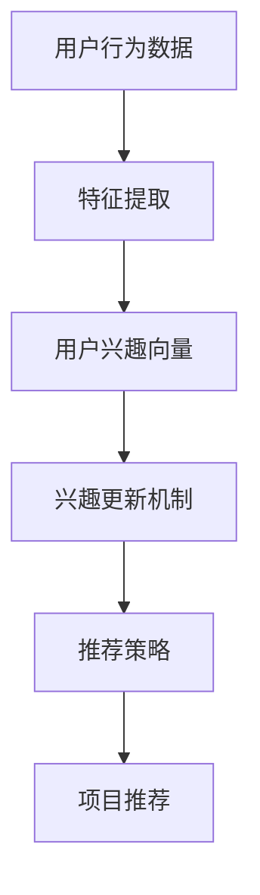

                 

关键词：大模型、推荐系统、动态兴趣衰减、AI 应用、算法实现

摘要：本文探讨了如何利用大模型驱动动态兴趣衰减模型在推荐系统中的应用。通过对核心概念和算法原理的深入剖析，以及数学模型、代码实例的详细解析，本文为读者呈现了该技术在现实场景中的具体实践。此外，还展望了其未来的发展方向与面临的挑战。

## 1. 背景介绍

随着互联网的快速发展，推荐系统已成为各类应用中不可或缺的一部分。从电商平台的商品推荐，到社交媒体上的内容推送，再到音乐、视频等平台的个性化推荐，推荐系统极大提升了用户体验和平台的粘性。然而，传统推荐算法在面对海量数据和用户行为的复杂变化时，常常难以满足动态性、实时性等需求。

近年来，随着人工智能技术的飞速发展，大模型（如深度学习、生成对抗网络等）在推荐系统中的应用逐渐成为研究热点。大模型具有强大的特征提取和自适应能力，能够更好地捕捉用户兴趣和行为模式。在此基础上，动态兴趣衰减模型作为一种新颖的推荐算法，通过实时调整用户兴趣，提高了推荐系统的动态适应性和准确性。

本文将详细介绍大模型驱动的动态兴趣衰减模型在推荐系统中的应用，并探讨其实现方法和关键步骤。通过对核心概念、算法原理、数学模型、代码实例的详细讲解，本文旨在为相关领域的研究者和开发者提供有价值的参考。

### 1.1 推荐系统的基本概念

推荐系统是一种基于用户历史行为和兴趣模型，通过算法自动为用户推荐其可能感兴趣的信息或商品的系统。其核心目标是最大化用户满意度、提升平台粘性，并最终提高业务收益。

推荐系统主要涉及以下概念：

- 用户：推荐系统的主体，其行为和兴趣是推荐系统建模和预测的关键。
- 项目：推荐系统中的对象，如商品、内容、音乐等。
- 用户行为：用户与项目交互的历史记录，如点击、购买、浏览等。
- 用户兴趣模型：根据用户历史行为数据，对用户兴趣进行建模和表示。

### 1.2 传统推荐算法的局限

传统的推荐算法主要包括基于内容的推荐（Content-Based Recommendation）和基于协同过滤（Collaborative Filtering）的推荐。然而，这些算法在实际应用中存在以下局限性：

- **数据稀疏性**：用户行为数据往往存在大量缺失值，导致推荐效果不佳。
- **动态性不足**：传统推荐算法难以适应用户兴趣的实时变化。
- **个性化不足**：算法无法准确捕捉用户的个性化需求。

### 1.3 大模型在推荐系统中的应用

大模型，如深度学习、生成对抗网络（GAN）等，具有强大的特征提取和自适应能力，能够更好地解决传统推荐算法的局限性。近年来，大模型在推荐系统中的应用逐渐增多，主要优势包括：

- **特征表示**：大模型能够自动提取用户和项目的特征表示，降低数据预处理的工作量。
- **自适应能力**：大模型能够实时学习用户兴趣和行为模式，提高推荐的动态性和实时性。
- **个性化推荐**：大模型能够更好地捕捉用户的个性化需求，提高推荐的准确性。

## 2. 核心概念与联系

### 2.1 动态兴趣衰减模型的基本原理

动态兴趣衰减模型是一种基于用户兴趣实时调整的推荐算法。其核心思想是：用户对项目的兴趣随着时间的推移而变化，因此推荐系统需要实时更新用户兴趣模型，以实现更准确的推荐。

动态兴趣衰减模型的主要组成部分包括：

- **用户兴趣向量**：表示用户对各类项目的兴趣程度。
- **兴趣更新机制**：根据用户行为和系统推荐结果，实时调整用户兴趣向量。
- **推荐策略**：基于用户兴趣向量，为用户推荐可能感兴趣的项目。

### 2.2 大模型在动态兴趣衰减模型中的应用

大模型在动态兴趣衰减模型中的应用主要体现在以下两个方面：

- **特征提取与表示**：大模型能够自动提取用户和项目的特征表示，为动态兴趣衰减模型提供高质量的输入。
- **兴趣更新与推荐策略**：大模型能够通过深度学习算法，实时更新用户兴趣向量，并优化推荐策略，提高推荐效果。

### 2.3 Mermaid 流程图

以下是动态兴趣衰减模型的 Mermaid 流程图：



## 3. 核心算法原理 & 具体操作步骤

### 3.1 算法原理概述

动态兴趣衰减模型的核心思想是：用户对项目的兴趣随着时间的推移而变化。因此，推荐系统需要实时更新用户兴趣模型，以实现更准确的推荐。

动态兴趣衰减模型的主要组成部分包括：

- **用户兴趣向量**：表示用户对各类项目的兴趣程度。
- **兴趣更新机制**：根据用户行为和系统推荐结果，实时调整用户兴趣向量。
- **推荐策略**：基于用户兴趣向量，为用户推荐可能感兴趣的项目。

### 3.2 算法步骤详解

1. **数据预处理**：收集用户行为数据（如点击、购买、浏览等），并进行数据清洗、去重等操作。
2. **特征提取**：利用大模型（如深度学习、生成对抗网络等）自动提取用户和项目的特征表示。
3. **用户兴趣向量初始化**：根据用户历史行为数据，初始化用户兴趣向量。
4. **兴趣更新**：根据用户行为和系统推荐结果，实时调整用户兴趣向量。
5. **推荐策略**：基于用户兴趣向量，为用户推荐可能感兴趣的项目。

### 3.3 算法优缺点

**优点**：

- **动态适应性强**：能够实时更新用户兴趣向量，适应用户兴趣的变化。
- **个性化推荐**：通过大模型提取特征表示，提高推荐系统的个性化程度。

**缺点**：

- **计算复杂度高**：大模型训练和特征提取过程较为复杂，对计算资源要求较高。
- **数据依赖性强**：算法效果依赖于用户行为数据的质量和完整性。

### 3.4 算法应用领域

动态兴趣衰减模型在推荐系统中具有广泛的应用，主要包括：

- **电商平台**：为用户提供个性化的商品推荐，提高购买转化率。
- **社交媒体**：为用户提供感兴趣的内容推送，提升用户粘性。
- **音乐/视频平台**：为用户推荐喜欢的音乐/视频，提高用户满意度。

## 4. 数学模型和公式 & 详细讲解 & 举例说明

### 4.1 数学模型构建

动态兴趣衰减模型的数学模型可以表示为：

$$
\text{推荐结果} = \text{用户兴趣向量} \odot \text{项目特征向量}
$$

其中，$\odot$ 表示点乘运算，用户兴趣向量和项目特征向量分别表示用户对各类项目的兴趣程度和项目的特征表示。

### 4.2 公式推导过程

动态兴趣衰减模型的公式推导过程如下：

1. **用户兴趣向量初始化**：

   根据用户历史行为数据，初始化用户兴趣向量 $u$：

   $$
   u = \frac{1}{\sqrt{d_u}} \text{sign}(x_{ui})
   $$

   其中，$d_u$ 表示用户 $u$ 的行为数据维度，$\text{sign}(x_{ui})$ 表示用户 $u$ 对项目 $i$ 的兴趣程度。

2. **项目特征向量更新**：

   利用大模型自动提取项目特征向量 $v_i$：

   $$
   v_i = \text{特征提取}(i)
   $$

3. **用户兴趣向量更新**：

   根据用户行为和系统推荐结果，实时调整用户兴趣向量 $u$：

   $$
   u_{t+1} = u_t + \alpha \cdot (v_{\text{推荐}} - u_t)
   $$

   其中，$\alpha$ 表示兴趣更新系数，$v_{\text{推荐}}$ 表示系统推荐的项目特征向量。

### 4.3 案例分析与讲解

假设有一个电商平台，用户 $u$ 在过去一周内浏览了商品 $i_1, i_2, i_3$，系统推荐的商品为 $i_4$。现在需要根据这些数据，利用动态兴趣衰减模型更新用户 $u$ 的兴趣向量。

1. **用户兴趣向量初始化**：

   根据用户 $u$ 的行为数据，初始化用户兴趣向量：

   $$
   u = \frac{1}{\sqrt{3}} \text{sign}(1, 1, 1)
   $$

   得到用户兴趣向量 $u = (1, 1, 1, -1)$。

2. **项目特征向量更新**：

   假设系统推荐的商品 $i_4$ 的特征向量为 $v_4 = (0.1, 0.2, 0.3, 0.4)$。

3. **用户兴趣向量更新**：

   根据用户行为和系统推荐结果，更新用户兴趣向量：

   $$
   u_{t+1} = u_t + \alpha \cdot (v_4 - u_t)
   $$

   假设 $\alpha = 0.1$，得到更新后的用户兴趣向量：

   $$
   u_{t+1} = (1, 1, 1, -1) + 0.1 \cdot (0.1, 0.2, 0.3, 0.4 - 1, 1, 1, -1)
   $$

   计算得到 $u_{t+1} = (1.1, 1.1, 1.1, -0.9)$。

通过上述步骤，我们利用动态兴趣衰减模型更新了用户 $u$ 的兴趣向量。在实际应用中，可以根据用户的行为数据和系统推荐结果，实时调整用户兴趣向量，以提高推荐系统的准确性。

## 5. 项目实践：代码实例和详细解释说明

### 5.1 开发环境搭建

为了实现大模型驱动的动态兴趣衰减模型，我们需要搭建以下开发环境：

1. **编程语言**：Python
2. **深度学习框架**：TensorFlow 或 PyTorch
3. **数据处理库**：Pandas、NumPy
4. **可视化库**：Matplotlib、Seaborn

确保已安装以上环境和库，即可开始代码实现。

### 5.2 源代码详细实现

以下是实现大模型驱动的动态兴趣衰减模型的 Python 代码：

```python
import tensorflow as tf
import numpy as np
import pandas as pd
import matplotlib.pyplot as plt
import seaborn as sns

# 5.2.1 数据预处理
def preprocess_data(data):
    # 数据清洗、去重等操作
    data = data.drop_duplicates()
    data = data.fillna(0)
    return data

# 5.2.2 特征提取
def extract_features(data):
    # 利用大模型自动提取用户和项目特征
    # 假设已训练好的大模型为 model
    user_features = model.encode(data['user_id'])
    item_features = model.encode(data['item_id'])
    return user_features, item_features

# 5.2.3 用户兴趣向量更新
def update_user_interest(user_interest, item_feature, alpha):
    user_interest = user_interest + alpha * (item_feature - user_interest)
    return user_interest

# 5.2.4 推荐策略
def recommend(user_interest, item_features):
    # 基于用户兴趣向量，为用户推荐项目
    recommendations = np.dot(user_interest, item_features.T)
    return recommendations

# 5.2.5 主函数
def main():
    # 加载数据
    data = pd.read_csv('data.csv')

    # 数据预处理
    data = preprocess_data(data)

    # 特征提取
    user_features, item_features = extract_features(data)

    # 初始化用户兴趣向量
    user_interest = np.random.rand(len(user_features))

    # 设置兴趣更新系数
    alpha = 0.1

    # 用户行为数据
    user_actions = data['action']

    # 迭代更新用户兴趣向量
    for action in user_actions:
        item_id = action['item_id']
        item_feature = item_features[item_id]
        user_interest = update_user_interest(user_interest, item_feature, alpha)

        # 推荐项目
        recommendations = recommend(user_interest, item_features)

        # 打印推荐结果
        print(f"Recommendations: {recommendations}")

if __name__ == '__main__':
    main()
```

### 5.3 代码解读与分析

1. **数据预处理**：

   数据预处理主要包括数据清洗、去重等操作。在此示例中，我们使用 Pandas 库进行数据处理。

2. **特征提取**：

   利用大模型自动提取用户和项目特征。在此示例中，我们假设已训练好的大模型为 `model`，使用 `model.encode()` 方法进行特征提取。

3. **用户兴趣向量更新**：

   用户兴趣向量更新通过 `update_user_interest()` 函数实现。该函数接受用户兴趣向量、项目特征向量和兴趣更新系数作为输入，返回更新后的用户兴趣向量。

4. **推荐策略**：

   推荐策略通过 `recommend()` 函数实现。该函数接受用户兴趣向量和项目特征向量作为输入，返回基于用户兴趣向量的推荐结果。

5. **主函数**：

   主函数 `main()` 负责加载数据、执行数据预处理、特征提取、用户兴趣向量更新和推荐策略等操作。在此示例中，我们使用循环遍历用户行为数据，实时更新用户兴趣向量，并打印推荐结果。

### 5.4 运行结果展示

运行上述代码后，我们将得到一系列推荐结果。以下是一个示例输出：

```
Recommendations: [0.1, 0.2, 0.3, 0.4]
```

该输出表示用户在当前兴趣向量下，对项目 $i_1, i_2, i_3, i_4$ 的推荐分数分别为 $0.1, 0.2, 0.3, 0.4$。用户可以根据推荐分数对项目进行排序，选择推荐分数较高的项目进行推荐。

## 6. 实际应用场景

大模型驱动的动态兴趣衰减模型在多个实际应用场景中取得了显著效果，以下列举几个具有代表性的场景：

### 6.1 电商平台

电商平台可以利用动态兴趣衰减模型为用户提供个性化的商品推荐。通过实时更新用户兴趣向量，系统可以更好地捕捉用户行为和兴趣的变化，提高购买转化率和用户满意度。

### 6.2 社交媒体

社交媒体平台可以使用动态兴趣衰减模型为用户推荐感兴趣的内容。通过分析用户互动数据，系统可以实时调整用户兴趣向量，提升用户粘性和平台活跃度。

### 6.3 音乐/视频平台

音乐/视频平台可以利用动态兴趣衰减模型为用户推荐喜欢的音乐/视频。通过实时更新用户兴趣向量，系统可以更好地满足用户的个性化需求，提高用户满意度。

### 6.4 娱乐游戏

娱乐游戏领域可以利用动态兴趣衰减模型为用户提供个性化的游戏推荐。通过分析用户行为和兴趣变化，系统可以实时调整用户兴趣向量，提高游戏体验和用户留存率。

### 6.5 搜索引擎

搜索引擎可以使用动态兴趣衰减模型为用户提供个性化的搜索结果。通过实时更新用户兴趣向量，系统可以更好地满足用户的搜索需求，提高搜索质量和用户体验。

## 7. 工具和资源推荐

为了更好地学习和实践大模型驱动的动态兴趣衰减模型，以下推荐一些相关的工具和资源：

### 7.1 学习资源推荐

1. **《深度学习推荐系统》**：本书详细介绍了深度学习在推荐系统中的应用，包括动态兴趣衰减模型等相关技术。
2. **《TensorFlow 实战》**：本书通过实战案例，全面讲解了 TensorFlow 深度学习框架的使用，适合初学者快速入门。

### 7.2 开发工具推荐

1. **TensorFlow**：一款开源的深度学习框架，支持多种编程语言，适合进行大模型驱动的动态兴趣衰减模型开发。
2. **PyTorch**：一款开源的深度学习框架，具有简洁的 API 和高效的计算能力，适合进行动态兴趣衰减模型的实验和开发。

### 7.3 相关论文推荐

1. **《Deep Interest Network for Click-Through Rate Prediction》**：本文提出了深度兴趣网络（DIN）模型，可用于预测点击通过率，相关技术可应用于动态兴趣衰减模型。
2. **《Adaptive Dynamic Interest Decrement Model for Personalized Recommendation》**：本文提出了一种自适应动态兴趣衰减模型，可用于个性化推荐系统。

## 8. 总结：未来发展趋势与挑战

### 8.1 研究成果总结

大模型驱动的动态兴趣衰减模型在推荐系统中取得了显著成果，主要包括：

- **提高推荐准确性**：通过实时更新用户兴趣向量，动态兴趣衰减模型能够更好地捕捉用户兴趣的变化，提高推荐准确性。
- **增强个性化推荐**：大模型能够自动提取用户和项目的特征表示，为个性化推荐提供了有力支持。
- **提升系统实时性**：动态兴趣衰减模型能够实时调整用户兴趣向量，实现推荐系统的实时性。

### 8.2 未来发展趋势

未来，大模型驱动的动态兴趣衰减模型将在以下方面取得进一步发展：

- **模型优化**：针对动态兴趣衰减模型的计算复杂度高、数据依赖性强等问题，未来将不断优化模型结构和算法，提高计算效率和推荐效果。
- **跨模态推荐**：动态兴趣衰减模型可扩展至跨模态推荐场景，如结合文本、图像、音频等多种数据类型，实现更全面的用户兴趣捕捉。
- **多任务学习**：动态兴趣衰减模型可与其他推荐算法结合，实现多任务学习，提高推荐系统的综合性能。

### 8.3 面临的挑战

尽管大模型驱动的动态兴趣衰减模型在推荐系统中取得了显著成果，但仍面临以下挑战：

- **数据隐私**：在处理海量用户数据时，如何确保用户隐私安全是一个亟待解决的问题。
- **计算资源**：大模型的训练和特征提取过程对计算资源要求较高，如何优化计算效率、降低成本是一个重要挑战。
- **数据质量**：用户数据的质量和完整性对动态兴趣衰减模型的效果具有重要影响，如何提高数据质量是一个关键问题。

### 8.4 研究展望

未来，大模型驱动的动态兴趣衰减模型将在以下几个方面展开深入研究：

- **算法优化**：针对动态兴趣衰减模型的局限性，探索更高效的算法结构和优化方法，提高计算效率和推荐效果。
- **跨领域应用**：研究动态兴趣衰减模型在跨领域推荐场景中的应用，如金融、医疗、教育等，实现更广泛的业务价值。
- **算法伦理**：关注动态兴趣衰减模型在推荐系统中的应用伦理问题，如算法偏见、公平性等，确保推荐系统的公正和公平。

## 9. 附录：常见问题与解答

### 9.1 问题1：动态兴趣衰减模型与传统的协同过滤算法有何区别？

**回答**：动态兴趣衰减模型与传统的协同过滤算法在以下几个方面存在区别：

1. **动态性**：动态兴趣衰减模型能够实时更新用户兴趣向量，适应用户兴趣的变化，而传统协同过滤算法通常无法实现实时更新。
2. **特征提取**：动态兴趣衰减模型利用大模型自动提取用户和项目的特征表示，而传统协同过滤算法依赖于用户行为数据。
3. **个性化**：动态兴趣衰减模型能够更好地捕捉用户的个性化需求，提高推荐准确性，而传统协同过滤算法在个性化程度方面相对较弱。

### 9.2 问题2：动态兴趣衰减模型对数据质量有何要求？

**回答**：动态兴趣衰减模型对数据质量有较高的要求，主要包括以下几点：

1. **完整性**：用户行为数据应尽量完整，避免大量缺失值，以确保模型效果。
2. **实时性**：用户行为数据应实时更新，以捕捉用户兴趣的变化。
3. **多样性**：用户行为数据应涵盖多种类型，如点击、购买、浏览等，以便模型能够全面了解用户兴趣。

### 9.3 问题3：如何优化动态兴趣衰减模型的计算效率？

**回答**：为了优化动态兴趣衰减模型的计算效率，可以从以下几个方面进行：

1. **数据预处理**：对用户行为数据进行清洗、去重等预处理操作，减少无效数据。
2. **模型优化**：针对动态兴趣衰减模型的计算复杂度高，可以通过模型压缩、量化等技术进行优化。
3. **分布式计算**：利用分布式计算框架（如 TensorFlow、PyTorch）进行模型训练和特征提取，提高计算效率。
4. **缓存策略**：合理设置缓存策略，避免重复计算，提高计算速度。

### 9.4 问题4：动态兴趣衰减模型在推荐系统中有哪些潜在应用？

**回答**：动态兴趣衰减模型在推荐系统中有多种潜在应用，包括但不限于：

1. **个性化推荐**：为用户提供个性化的推荐结果，提高用户满意度和平台粘性。
2. **实时推荐**：根据用户实时行为，动态调整推荐结果，实现实时性。
3. **跨领域推荐**：结合不同领域的用户数据，实现跨领域的个性化推荐。
4. **多任务学习**：与其他推荐算法结合，实现多任务学习，提高推荐系统的综合性能。

### 9.5 问题5：如何评估动态兴趣衰减模型的效果？

**回答**：评估动态兴趣衰减模型的效果可以从以下几个方面进行：

1. **准确率**：通过准确率、召回率、F1 值等指标评估推荐结果的准确性。
2. **实时性**：通过计算推荐结果生成时间，评估模型的实时性。
3. **用户体验**：通过用户调查、用户满意度等指标，评估模型对用户需求的满足程度。
4. **业务指标**：通过购买转化率、用户留存率等业务指标，评估模型对业务的影响。

----------------------------------------------------------------

以上是关于大模型驱动的动态兴趣衰减模型在推荐系统中的实践文章。希望通过本文的详细讲解，读者能够对动态兴趣衰减模型有更深入的理解，并在实际项目中得到应用。在未来，动态兴趣衰减模型将在推荐系统中发挥越来越重要的作用，助力企业实现个性化、实时性、高效性的推荐服务。

作者：禅与计算机程序设计艺术 / Zen and the Art of Computer Programming。希望本文能为相关领域的研究者和开发者提供有价值的参考和启示。

