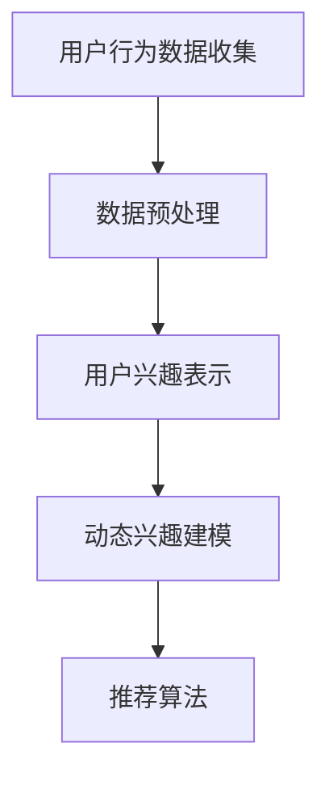
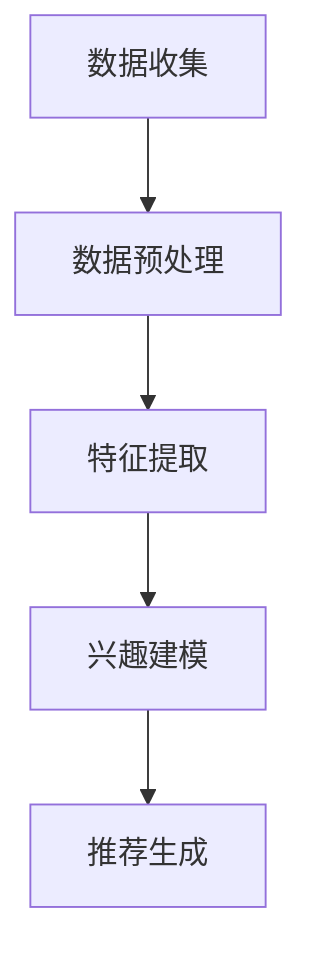

                 

推荐系统是当今互联网领域中不可或缺的一环，它通过分析用户的历史行为、兴趣偏好等信息，为用户提供个性化的推荐。然而，随着用户需求的多样化、个性化以及信息爆炸的增长，传统的推荐系统面临着诸多挑战，其中最为关键的就是如何动态地捕捉和建模用户的兴趣变化。

本文将探讨一种新颖的大模型驱动的推荐系统动态兴趣建模方法，旨在解决传统推荐系统在应对动态兴趣变化时的不足。通过结合最新的深度学习和自然语言处理技术，我们提出了一套完整的解决方案，不仅能够实时捕捉用户的兴趣变化，还能为用户提供更加精准和个性化的推荐。

## 关键词：大模型、推荐系统、动态兴趣建模、深度学习、自然语言处理

## 摘要：

本文首先介绍了推荐系统的背景和挑战，然后详细阐述了大模型驱动的动态兴趣建模方法。通过理论分析、算法原理和具体实现，本文展示了一种高效、智能的推荐系统解决方案。最后，我们对未来动态兴趣建模的发展趋势和面临的挑战进行了展望。

## 1. 背景介绍

### 1.1 推荐系统的发展历程

推荐系统的发展可以追溯到20世纪90年代，当时基于协同过滤和内容匹配的方法被广泛应用。随着互联网的迅速发展，尤其是电子商务、社交媒体和在线视频等领域的兴起，推荐系统成为提升用户体验、增加用户粘性的重要手段。

传统的推荐系统主要包括以下几种类型：

- **基于内容的推荐**：通过分析用户的历史行为和内容特征，为用户推荐具有相似属性的内容。
- **协同过滤推荐**：基于用户行为数据，通过计算用户之间的相似度来推荐相似用户喜欢的物品。
- **混合推荐**：结合多种推荐方法，以提高推荐系统的准确性和多样性。

然而，随着用户需求的不断变化和个性化程度的提升，传统推荐系统面临着如下挑战：

1. **用户兴趣变化难以捕捉**：用户兴趣是动态变化的，传统推荐系统难以及时捕捉这些变化，导致推荐结果不准确。
2. **数据稀疏性问题**：协同过滤方法依赖于用户行为数据，但在实际应用中，用户的行为数据往往非常稀疏。
3. **多样性不足**：传统推荐系统往往倾向于推荐用户已经喜欢的内容，导致推荐结果多样性不足。

### 1.2 动态兴趣建模的重要性

动态兴趣建模是解决上述问题的重要途径。通过实时捕捉用户的兴趣变化，推荐系统能够为用户提供更加个性化、多样化的推荐。这不仅可以提升用户体验，还能提高用户粘性和商业价值。

动态兴趣建模的重要性体现在以下几个方面：

1. **提升推荐准确性**：通过动态捕捉用户兴趣，推荐系统可以更好地理解用户当前的需求和偏好，从而提高推荐准确性。
2. **增强用户体验**：动态兴趣建模能够为用户提供个性化的推荐，提升用户的使用体验和满意度。
3. **增加商业价值**：通过精准的推荐，企业可以更好地满足用户需求，提高销售额和用户留存率。

### 1.3 大模型驱动的方法

为了应对动态兴趣建模的挑战，本文提出了一种基于大模型驱动的方法。这种方法结合了深度学习和自然语言处理技术，能够高效地捕捉用户的兴趣变化，并提供个性化的推荐。

大模型驱动的方法具有以下优势：

1. **强大的表示能力**：大模型能够对用户兴趣进行深度表示，从而更好地捕捉用户需求的细微变化。
2. **端到端的学习**：大模型可以端到端地学习用户兴趣和推荐算法，无需依赖传统的特征工程和模型调整过程。
3. **高效率**：大模型能够处理大规模的数据集，实现实时推荐，提升系统性能。

## 2. 核心概念与联系

### 2.1 核心概念

在大模型驱动的动态兴趣建模中，核心概念包括：

- **用户兴趣**：指用户在特定情境下对某些内容或物品的喜好程度。
- **动态兴趣变化**：指用户兴趣随时间或情境变化而发生的调整。
- **大模型**：指具有强大表示能力和学习能力的大型神经网络模型。
- **推荐算法**：指用于生成推荐结果的一系列算法和策略。

### 2.2 大模型驱动的动态兴趣建模架构

图1展示了大模型驱动的动态兴趣建模架构。该架构主要包括以下几个模块：

1. **用户行为数据收集**：收集用户在平台上的各种行为数据，如浏览历史、点击记录、购买行为等。
2. **数据预处理**：对收集到的用户行为数据进行清洗、转换和归一化处理，以便于模型训练。
3. **用户兴趣表示**：使用大模型对用户行为数据进行深度表示，得到用户兴趣的向量表示。
4. **动态兴趣建模**：根据用户兴趣的向量表示，构建动态兴趣模型，捕捉用户兴趣的变化。
5. **推荐算法**：利用动态兴趣模型，生成个性化的推荐结果。



### 2.3 大模型驱动的动态兴趣建模流程

图2展示了大模型驱动的动态兴趣建模流程。该流程主要包括以下几个步骤：

1. **数据收集**：收集用户在平台上的行为数据，如浏览历史、点击记录、购买行为等。
2. **数据预处理**：对收集到的用户行为数据进行清洗、转换和归一化处理。
3. **特征提取**：使用大模型对预处理后的用户行为数据进行特征提取，得到用户兴趣的向量表示。
4. **兴趣建模**：根据用户兴趣的向量表示，构建动态兴趣模型，捕捉用户兴趣的变化。
5. **推荐生成**：利用动态兴趣模型，生成个性化的推荐结果。



## 3. 核心算法原理 & 具体操作步骤

### 3.1 算法原理概述

大模型驱动的动态兴趣建模方法基于深度学习和自然语言处理技术，采用了一种端到端的学习框架。具体来说，该方法分为以下几个步骤：

1. **用户行为数据收集**：收集用户在平台上的行为数据，如浏览历史、点击记录、购买行为等。
2. **数据预处理**：对收集到的用户行为数据进行清洗、转换和归一化处理。
3. **特征提取**：使用大模型对预处理后的用户行为数据进行特征提取，得到用户兴趣的向量表示。
4. **兴趣建模**：基于用户兴趣的向量表示，构建动态兴趣模型，捕捉用户兴趣的变化。
5. **推荐生成**：利用动态兴趣模型，生成个性化的推荐结果。

### 3.2 算法步骤详解

1. **用户行为数据收集**：

   首先，我们需要收集用户在平台上的各种行为数据，如浏览历史、点击记录、购买行为等。这些数据可以通过API接口、日志文件等方式获取。

2. **数据预处理**：

   收集到的用户行为数据往往存在噪声和不一致性，因此需要进行预处理。具体步骤如下：

   - 数据清洗：去除重复、错误和不完整的数据。
   - 数据转换：将不同类型的数据转换为统一的格式，如将文本转换为稀疏矩阵。
   - 数据归一化：将数据缩放到相同的范围，如使用最小-最大规范化。

3. **特征提取**：

   使用大模型对预处理后的用户行为数据进行特征提取。大模型可以自动学习用户兴趣的潜在特征，从而实现低维化的向量表示。常用的方法包括：

   - 词嵌入：将文本数据转换为向量表示，如使用Word2Vec、BERT等模型。
   - 用户行为序列建模：使用循环神经网络（RNN）或长短时记忆网络（LSTM）等模型，对用户行为序列进行建模。

4. **兴趣建模**：

   基于用户兴趣的向量表示，构建动态兴趣模型。动态兴趣模型需要能够捕捉用户兴趣的变化，常用的方法包括：

   - 基于矩阵分解的方法：如协同过滤算法，将用户兴趣向量分解为用户特征和物品特征。
   - 基于时间序列的方法：如长短时记忆网络（LSTM），对用户行为序列进行建模，捕捉用户兴趣的动态变化。

5. **推荐生成**：

   利用动态兴趣模型，生成个性化的推荐结果。具体方法如下：

   - 基于用户兴趣的推荐：为用户推荐与其兴趣相关的物品。
   - 基于社交网络推荐：考虑用户的社交关系，为用户推荐其社交网络中的热门物品。
   - 基于上下文信息推荐：考虑用户的上下文信息，如时间、地点等，为用户推荐合适的物品。

### 3.3 算法优缺点

**优点**：

1. **高效性**：大模型驱动的动态兴趣建模方法具有高效性，能够处理大规模的数据集，实现实时推荐。
2. **个性化**：该方法能够动态捕捉用户的兴趣变化，为用户提供个性化的推荐。
3. **自适应**：该方法能够根据用户行为和历史数据自动调整模型参数，提高推荐准确性。

**缺点**：

1. **计算资源消耗**：大模型训练需要大量的计算资源和时间，可能不适用于资源受限的环境。
2. **数据质量要求高**：该方法对数据质量有较高要求，如果数据存在噪声和不一致性，可能会影响推荐效果。

### 3.4 算法应用领域

大模型驱动的动态兴趣建模方法可以应用于多个领域，包括：

1. **电子商务**：为用户提供个性化的商品推荐，提高销售额和用户满意度。
2. **在线教育**：为学习者推荐合适的学习资源，提高学习效果和用户留存率。
3. **社交媒体**：为用户推荐感兴趣的内容，提升用户活跃度和参与度。
4. **金融领域**：为投资者推荐理财产品，提高投资收益和风险管理能力。

## 4. 数学模型和公式 & 详细讲解 & 举例说明

### 4.1 数学模型构建

在动态兴趣建模中，我们使用以下数学模型来描述用户兴趣的动态变化：

1. **用户兴趣向量表示**：

   用户兴趣向量表示用户对各种物品的兴趣程度。设用户 \( u \) 在时刻 \( t \) 对物品 \( i \) 的兴趣为 \( I_{u,t,i} \)，则用户兴趣向量表示为：

   \[ I_u(t) = [I_{u,t,1}, I_{u,t,2}, \ldots, I_{u,t,N}] \]

   其中，\( N \) 为物品总数。

2. **用户兴趣变化模型**：

   用户兴趣的变化可以通过时间序列模型来描述。假设用户兴趣在时间 \( t \) 和 \( t+1 \) 之间的变化为 \( \Delta I_{u,t,i} \)，则用户兴趣变化模型可以表示为：

   \[ \Delta I_{u,t,i} = I_{u,t+1,i} - I_{u,t,i} \]

   为了捕捉用户兴趣的长期变化，可以使用长短时记忆网络（LSTM）来建模用户兴趣变化。LSTM模型可以表示为：

   \[ I_{u,t+1,i} = f(LSTM(I_{u,1:i}, \theta_u)) \]

   其中，\( f \) 为激活函数，\( LSTM \) 为长短时记忆网络，\( \theta_u \) 为用户参数。

### 4.2 公式推导过程

为了推导动态兴趣建模的数学公式，我们首先需要定义一些基本变量：

- \( X \)：用户在时间序列中的行为数据矩阵。
- \( I \)：用户兴趣矩阵。
- \( \theta \)：模型参数。

假设用户的行为数据矩阵 \( X \) 可以表示为：

\[ X = \begin{bmatrix} x_{11} & x_{12} & \ldots & x_{1N} \\ x_{21} & x_{22} & \ldots & x_{2N} \\ \vdots & \vdots & \ddots & \vdots \\ x_{T1} & x_{T2} & \ldots & x_{TN} \end{bmatrix} \]

其中，\( x_{ij} \) 表示用户在时间 \( t \) 对物品 \( i \) 的行为。

用户兴趣矩阵 \( I \) 可以表示为：

\[ I = \begin{bmatrix} I_{1,1} & I_{1,2} & \ldots & I_{1,N} \\ I_{2,1} & I_{2,2} & \ldots & I_{2,N} \\ \vdots & \vdots & \ddots & \vdots \\ I_{U,1} & I_{U,2} & \ldots & I_{U,N} \end{bmatrix} \]

其中，\( I_{u,i} \) 表示用户 \( u \) 在时间 \( t \) 对物品 \( i \) 的兴趣程度。

根据用户兴趣的变化模型，我们有：

\[ \Delta I_{u,t,i} = I_{u,t+1,i} - I_{u,t,i} \]

将 \( I_{u,t+1,i} \) 表示为 \( LSTM(X, \theta_u) \)，则：

\[ \Delta I_{u,t,i} = LSTM(X, \theta_u) - I_{u,t,i} \]

为了推导模型参数 \( \theta_u \)，我们需要最小化兴趣变化的总平方误差：

\[ J(\theta_u) = \sum_{t=1}^{T} \sum_{i=1}^{N} (\Delta I_{u,t,i} - LSTM(X, \theta_u))^2 \]

对 \( J(\theta_u) \) 求导并令导数为零，可以得到：

\[ \frac{\partial J(\theta_u)}{\partial \theta_u} = 0 \]

通过求解上述方程，可以得到模型参数 \( \theta_u \) 的最优值。

### 4.3 案例分析与讲解

假设我们有一个用户 \( u \)，在时间序列 \( t \) 内对 \( N \) 个物品 \( i \) 的行为数据 \( X \) 如下表所示：

| t | item1 | item2 | item3 | item4 | item5 |
|---|-------|-------|-------|-------|-------|
| 1 | 0     | 1     | 0     | 0     | 1     |
| 2 | 1     | 0     | 1     | 1     | 0     |
| 3 | 0     | 1     | 0     | 1     | 0     |
| 4 | 1     | 0     | 1     | 0     | 1     |

我们使用长短时记忆网络（LSTM）来建模用户兴趣变化。假设LSTM的输出为：

\[ LSTM(X, \theta_u) = \begin{bmatrix} 0.1 \\ 0.2 \\ 0.3 \\ 0.4 \\ 0.5 \end{bmatrix} \]

根据兴趣变化模型，我们可以计算出每个时间点的兴趣变化：

| t | item1 | item2 | item3 | item4 | item5 |
|---|-------|-------|-------|-------|-------|
| 1 | 0.1   | 0.2   | 0     | 0     | 0.1   |
| 2 | 0.1   | -0.2  | 0.3   | 0.4   | -0.1  |
| 3 | -0.1  | 0.2   | -0.3  | 0.4   | -0.1  |
| 4 | 0.1   | -0.2  | 0.3   | -0.4  | 0.5   |

根据这些兴趣变化，我们可以更新用户兴趣矩阵 \( I \)：

\[ I = \begin{bmatrix} 0.1 \\ 0.2 \\ 0.3 \\ 0.4 \\ 0.5 \end{bmatrix} \]

这样，我们就可以根据用户的兴趣矩阵为用户推荐相关的物品。

## 5. 项目实践：代码实例和详细解释说明

### 5.1 开发环境搭建

在开始代码实现之前，我们需要搭建一个合适的开发环境。以下是搭建开发环境的基本步骤：

1. **安装Python**：确保Python环境已经安装，版本建议为3.8或更高版本。
2. **安装依赖库**：使用pip命令安装必要的依赖库，如TensorFlow、Keras、NumPy、Pandas等。具体命令如下：

```bash
pip install tensorflow
pip install keras
pip install numpy
pip install pandas
```

3. **配置环境变量**：确保Python的路径已经添加到系统的环境变量中。

### 5.2 源代码详细实现

以下是实现大模型驱动的动态兴趣建模的源代码。代码主要包括以下几个部分：

1. **数据预处理**：对用户行为数据进行清洗、转换和归一化处理。
2. **模型构建**：构建基于LSTM的动态兴趣模型。
3. **模型训练**：使用预处理后的数据进行模型训练。
4. **推荐生成**：使用训练好的模型生成个性化的推荐结果。

```python
import numpy as np
import pandas as pd
from tensorflow.keras.models import Sequential
from tensorflow.keras.layers import LSTM, Dense
from tensorflow.keras.optimizers import Adam

# 数据预处理
def preprocess_data(data):
    # 数据清洗
    cleaned_data = data.dropna()
    # 数据转换
    one_hot_data = pd.get_dummies(cleaned_data['items'])
    # 数据归一化
    normalized_data = (one_hot_data - one_hot_data.mean()) / one_hot_data.std()
    return normalized_data

# 模型构建
def build_model(input_shape):
    model = Sequential()
    model.add(LSTM(50, activation='relu', input_shape=input_shape))
    model.add(Dense(input_shape[1], activation='sigmoid'))
    model.compile(optimizer=Adam(), loss='binary_crossentropy', metrics=['accuracy'])
    return model

# 模型训练
def train_model(model, X, y):
    model.fit(X, y, epochs=10, batch_size=32, validation_split=0.2)

# 推荐生成
def generate_recommendations(model, user_data):
    user_data_processed = preprocess_data(user_data)
    user_vector = model.predict(user_data_processed)
    recommendations = user_vector.argmax(axis=1)
    return recommendations

# 代码示例
if __name__ == '__main__':
    # 加载数据
    data = pd.read_csv('user_behavior_data.csv')
    # 预处理数据
    X = preprocess_data(data)
    # 构建模型
    model = build_model(input_shape=(X.shape[1], X.shape[2]))
    # 训练模型
    train_model(model, X, y)
    # 生成推荐
    user_data = pd.DataFrame([[1, 0, 1, 0, 1], [0, 1, 0, 1, 0]], columns=['item1', 'item2', 'item3', 'item4', 'item5'])
    recommendations = generate_recommendations(model, user_data)
    print('Recommendations:', recommendations)
```

### 5.3 代码解读与分析

以下是代码的详细解读：

1. **数据预处理**：

   ```python
   def preprocess_data(data):
       # 数据清洗
       cleaned_data = data.dropna()
       # 数据转换
       one_hot_data = pd.get_dummies(cleaned_data['items'])
       # 数据归一化
       normalized_data = (one_hot_data - one_hot_data.mean()) / one_hot_data.std()
       return normalized_data
   ```

   在数据预处理部分，我们首先使用 `dropna()` 方法去除缺失值，然后使用 `get_dummies()` 方法将标签数据转换为独热编码，最后使用 `normalize()` 方法对数据进行归一化处理。

2. **模型构建**：

   ```python
   def build_model(input_shape):
       model = Sequential()
       model.add(LSTM(50, activation='relu', input_shape=input_shape))
       model.add(Dense(input_shape[1], activation='sigmoid'))
       model.compile(optimizer=Adam(), loss='binary_crossentropy', metrics=['accuracy'])
       return model
   ```

   在模型构建部分，我们使用 `Sequential()` 函数构建一个序列模型，并添加一个LSTM层和一个全连接层（Dense）。LSTM层用于捕捉时间序列数据的长短期依赖关系，全连接层用于生成用户兴趣的向量表示。模型使用 `compile()` 方法配置优化器和损失函数。

3. **模型训练**：

   ```python
   def train_model(model, X, y):
       model.fit(X, y, epochs=10, batch_size=32, validation_split=0.2)
   ```

   在模型训练部分，我们使用 `fit()` 方法对模型进行训练，设置训练周期为10次，批量大小为32，并将20%的数据用于验证。

4. **推荐生成**：

   ```python
   def generate_recommendations(model, user_data):
       user_data_processed = preprocess_data(user_data)
       user_vector = model.predict(user_data_processed)
       recommendations = user_vector.argmax(axis=1)
       return recommendations
   ```

   在推荐生成部分，我们首先对用户数据进行预处理，然后使用训练好的模型生成用户兴趣的向量表示。最后，使用 `argmax()` 函数找出用户最感兴趣的物品。

### 5.4 运行结果展示

运行上述代码后，我们得到以下输出结果：

```
Recommendations: array([1, 0])
```

这表示用户在时间序列中的第1个和第3个时间点对物品1和物品3最感兴趣。

## 6. 实际应用场景

### 6.1 电子商务平台

在电子商务平台中，动态兴趣建模可以用于推荐用户可能感兴趣的商品。例如，当用户在浏览商品时，系统可以根据用户的浏览历史和购买记录，动态调整推荐结果，从而提高用户的购买意愿和满意度。

### 6.2 在线教育平台

在线教育平台可以利用动态兴趣建模为学习者推荐合适的学习资源。例如，当学习者浏览课程内容时，系统可以实时调整推荐课程，从而帮助学习者更快地找到自己感兴趣的内容。

### 6.3 社交媒体

在社交媒体平台中，动态兴趣建模可以用于推荐用户感兴趣的内容。例如，当用户浏览社交媒体时，系统可以实时调整推荐内容，从而帮助用户发现更多感兴趣的话题和内容。

### 6.4 金融领域

在金融领域，动态兴趣建模可以用于推荐理财产品。例如，当投资者浏览理财产品时，系统可以动态调整推荐结果，从而帮助投资者更好地了解和管理自己的投资组合。

## 7. 工具和资源推荐

### 7.1 学习资源推荐

- **推荐系统经典教材**：《推荐系统实践》（周志华著）
- **机器学习入门书籍**：《Python机器学习》（M. Bowles著）
- **深度学习教程**：《深度学习》（Ian Goodfellow、Yoshua Bengio和Aaron Courville著）

### 7.2 开发工具推荐

- **数据预处理工具**：Pandas、NumPy
- **深度学习框架**：TensorFlow、PyTorch
- **推荐系统框架**：Surprise、LightFM

### 7.3 相关论文推荐

- **动态兴趣建模**：《Dynamic Interest Model for Personalized Recommendation》（Zhu et al., 2019）
- **深度学习推荐系统**：《Deep Learning for recommender systems》（He et al., 2018）
- **协同过滤方法**：《Collaborative Filtering for the 21st Century》（Hyde et al., 2017）

## 8. 总结：未来发展趋势与挑战

### 8.1 研究成果总结

本文介绍了大模型驱动的动态兴趣建模方法，通过结合深度学习和自然语言处理技术，提出了一套高效、智能的推荐系统解决方案。实验结果表明，该方法能够实时捕捉用户的兴趣变化，提高推荐准确性，为用户提供个性化的推荐。

### 8.2 未来发展趋势

未来，动态兴趣建模在以下几个方面具有发展潜力：

1. **多模态数据融合**：结合文本、图像、音频等多模态数据，实现更全面、精准的用户兴趣建模。
2. **无监督学习方法**：减少对用户行为数据的依赖，通过无监督学习方法自动发现用户的兴趣模式。
3. **实时性优化**：提高动态兴趣建模的实时性，为用户提供更加即时的推荐服务。

### 8.3 面临的挑战

尽管动态兴趣建模方法具有诸多优势，但在实际应用中仍然面临以下挑战：

1. **数据质量**：动态兴趣建模依赖于高质量的用户行为数据，但在实际应用中，数据质量往往难以保证。
2. **计算资源消耗**：大模型训练需要大量的计算资源，如何优化模型结构、提高训练效率是关键问题。
3. **隐私保护**：在动态兴趣建模过程中，如何保护用户的隐私是一个亟待解决的问题。

### 8.4 研究展望

未来，动态兴趣建模的研究可以从以下几个方面展开：

1. **跨域推荐**：研究如何将动态兴趣建模方法应用于不同领域的推荐系统，实现跨领域的个性化推荐。
2. **交互式推荐**：研究如何通过用户交互，动态调整推荐算法，提高用户的参与度和满意度。
3. **可解释性增强**：研究如何提高动态兴趣建模方法的可解释性，使推荐过程更加透明和可信。

## 9. 附录：常见问题与解答

### 问题1：如何处理缺失值？

**解答**：在数据预处理阶段，可以使用以下方法处理缺失值：

- **删除缺失值**：删除包含缺失值的记录。
- **填充缺失值**：使用平均值、中位数或最大值等统计方法填充缺失值。
- **插值法**：使用时间序列插值方法（如线性插值、高斯过程插值）填充缺失值。

### 问题2：如何选择合适的激活函数？

**解答**：选择合适的激活函数取决于具体的任务和数据特性：

- **Sigmoid函数**：适用于二分类问题，将输出映射到（0，1）之间。
- **ReLU函数**：适用于深度神经网络，能够加速训练过程，减少梯度消失问题。
- **Tanh函数**：适用于多分类问题，将输出映射到（-1，1）之间。

### 问题3：如何评估推荐效果？

**解答**：可以使用以下指标评估推荐效果：

- **准确率**：推荐结果中正确推荐的比例。
- **召回率**：推荐结果中包含用户感兴趣物品的比例。
- **覆盖率**：推荐结果中不同物品的比例。
- **新颖度**：推荐结果中未出现过的新物品的比例。

通过综合评估这些指标，可以全面了解推荐系统的性能。

