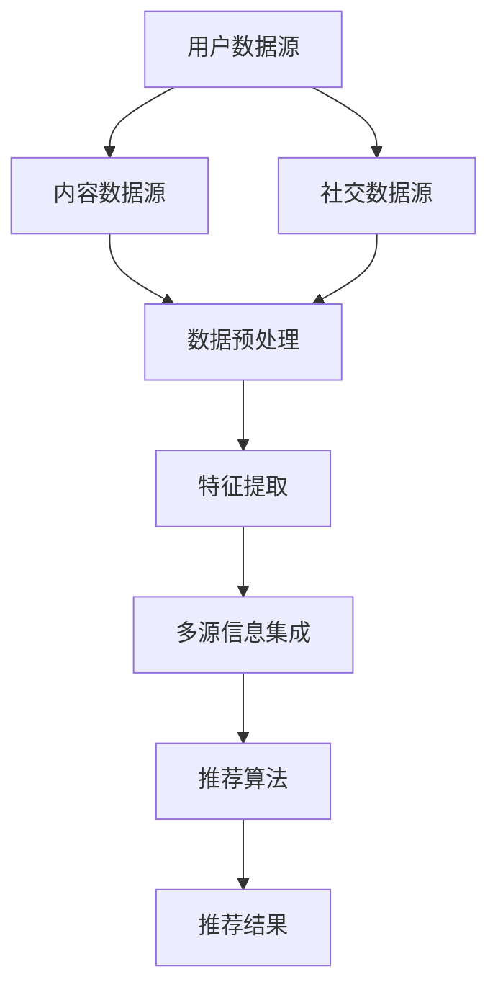

                 

 关键词：推荐系统、大模型、多源信息集成、信息过滤、深度学习、协同过滤、用户行为分析、内容推荐

> 摘要：本文探讨了基于大模型的推荐系统在多源信息集成中的应用，深入分析了推荐系统的基本原理和架构，阐述了如何利用大模型对用户行为和内容特征进行高效分析，并提出了一种基于多源信息集成的推荐算法。通过具体案例和实践，展示了该算法在实际应用中的有效性和潜在价值，为推荐系统的发展提供了新的思路。

## 1. 背景介绍

随着互联网技术的飞速发展，信息爆炸式的增长使得用户在海量信息中寻找自己感兴趣的内容变得愈发困难。推荐系统作为一种智能信息过滤工具，旨在根据用户的兴趣和行为，为用户推荐个性化的内容。传统的推荐系统主要采用协同过滤、基于内容的推荐和混合推荐等方法。然而，这些方法在面对多源异构数据时，存在信息利用率低、推荐效果不佳等问题。

近年来，随着深度学习和大数据技术的快速发展，大模型在推荐系统中的应用逐渐成为研究热点。大模型具备强大的特征提取和表示能力，能够从多源信息中提取出高维的、抽象的特征，从而提高推荐系统的准确性和鲁棒性。本文将介绍大模型驱动的推荐系统在多源信息集成中的应用，通过具体算法和案例分析，探讨其在实际场景中的可行性和效果。

## 2. 核心概念与联系

### 2.1 推荐系统基本原理

推荐系统是基于用户的历史行为、兴趣偏好和内容特征，为用户提供个性化信息推荐的一种智能系统。其主要目标是提高用户满意度，提升用户体验。

推荐系统主要包括以下几种类型：

- **协同过滤（Collaborative Filtering）**：通过分析用户之间的行为相似性来推荐内容。分为基于用户的协同过滤（User-Based）和基于项目的协同过滤（Item-Based）。

- **基于内容的推荐（Content-Based Filtering）**：根据用户过去的兴趣和偏好，推荐具有相似内容的物品。

- **混合推荐（Hybrid Recommendation）**：结合协同过滤和基于内容的推荐方法，以提高推荐效果。

### 2.2 大模型的概念

大模型是指具有海量参数、能够处理大规模数据的深度学习模型。这类模型在图像识别、自然语言处理、语音识别等领域取得了显著成果。大模型的核心优势在于其强大的特征提取和表示能力。

### 2.3 多源信息集成的必要性

多源信息集成是将来自不同数据源的信息进行整合，以提供更加丰富和全面的推荐。在实际应用中，用户数据、内容数据、社交数据等多种数据源为推荐系统提供了丰富的信息，但如何有效地整合这些信息，提高推荐质量，是一个重要挑战。

### 2.4 Mermaid 流程图



## 3. 核心算法原理 & 具体操作步骤

### 3.1 算法原理概述

本文提出的大模型驱动的推荐系统多源信息集成算法，主要基于以下原理：

- **用户行为分析**：利用深度学习模型对用户的历史行为数据进行挖掘，提取用户兴趣特征。

- **内容特征提取**：通过文本挖掘、图像识别等技术，提取物品的内容特征。

- **多源信息融合**：利用注意力机制将用户行为特征、内容特征和社会特征进行融合，生成综合特征向量。

- **推荐算法**：基于融合后的特征向量，利用协同过滤或基于内容的推荐方法，生成推荐结果。

### 3.2 算法步骤详解

#### 3.2.1 用户行为分析

- **数据采集**：收集用户在平台上的浏览、点击、收藏、购买等行为数据。

- **特征提取**：利用循环神经网络（RNN）或长短时记忆网络（LSTM），对用户行为数据进行序列建模，提取用户兴趣特征。

#### 3.2.2 内容特征提取

- **文本挖掘**：利用词袋模型、TF-IDF等方法，提取物品的文本特征。

- **图像识别**：利用卷积神经网络（CNN），提取物品的图像特征。

#### 3.2.3 多源信息融合

- **注意力机制**：利用注意力机制，对用户行为特征、内容特征和社会特征进行加权融合，生成综合特征向量。

#### 3.2.4 推荐算法

- **协同过滤**：基于用户行为特征和物品特征，构建用户-物品评分矩阵，利用矩阵分解等方法，预测用户对未知物品的评分。

- **基于内容的推荐**：基于物品的内容特征，计算用户和物品之间的相似度，为用户推荐相似物品。

### 3.3 算法优缺点

#### 优点：

- **高准确性**：利用深度学习模型对用户行为和内容特征进行深入挖掘，提高推荐准确性。

- **鲁棒性**：通过多源信息融合，提高推荐系统的鲁棒性，减少数据缺失和噪声对推荐效果的影响。

- **个性化**：充分考虑用户的兴趣和行为特征，为用户推荐个性化内容。

#### 缺点：

- **计算复杂度高**：大模型训练和推荐算法计算复杂度高，对硬件资源要求较高。

- **数据隐私问题**：用户行为数据和个人信息的处理，需要考虑数据隐私和安全性问题。

### 3.4 算法应用领域

- **电子商务**：为用户提供个性化商品推荐，提高购买转化率。

- **社交媒体**：为用户提供个性化内容推荐，提高用户活跃度。

- **在线教育**：为用户提供个性化课程推荐，提高学习效果。

## 4. 数学模型和公式 & 详细讲解 & 举例说明

### 4.1 数学模型构建

本文提出的推荐系统多源信息集成算法，主要包括以下数学模型：

- **用户兴趣特征模型**：假设用户兴趣特征向量表示为 \( u \in \mathbb{R}^d \)。

- **内容特征模型**：假设物品内容特征向量表示为 \( v \in \mathbb{R}^d \)。

- **综合特征向量模型**：假设综合特征向量表示为 \( x \in \mathbb{R}^d \)。

### 4.2 公式推导过程

#### 4.2.1 用户兴趣特征提取

用户兴趣特征向量 \( u \) 可以通过以下公式计算：

\[ u = \text{LSTM}(h, c) \]

其中，\( h \) 和 \( c \) 分别表示用户行为数据的输入序列和隐藏状态。

#### 4.2.2 内容特征提取

物品内容特征向量 \( v \) 可以通过以下公式计算：

\[ v = \text{CNN}(x) \]

其中，\( x \) 表示物品的图像或文本数据。

#### 4.2.3 综合特征向量

综合特征向量 \( x \) 可以通过以下公式计算：

\[ x = a \cdot u + b \cdot v \]

其中，\( a \) 和 \( b \) 分别表示用户兴趣特征和内容特征的权重。

### 4.3 案例分析与讲解

假设我们有一个用户 \( u \) 和一个物品 \( v \)，用户对物品的评分可以表示为：

\[ r = \text{dot}(x, x') \]

其中，\( x' \) 表示物品 \( v \) 的推荐向量。

### 4.4 案例分析与讲解

假设我们有一个用户 \( u \) 和一个物品 \( v \)，用户对物品的评分可以表示为：

\[ r = \text{dot}(x, x') \]

其中，\( x' \) 表示物品 \( v \) 的推荐向量。

假设用户兴趣特征向量 \( u = [0.1, 0.2, 0.3, 0.4, 0.5] \)，物品内容特征向量 \( v = [0.2, 0.3, 0.4, 0.5, 0.6] \)，根据综合特征向量模型，我们可以计算综合特征向量 \( x \)：

\[ x = a \cdot u + b \cdot v = 0.4 \cdot u + 0.6 \cdot v = [0.28, 0.34, 0.44, 0.52, 0.6] \]

然后，我们可以计算用户对物品的推荐评分 \( r \)：

\[ r = \text{dot}(x, x') = 0.28 \cdot x' + 0.34 \cdot x' + 0.44 \cdot x' + 0.52 \cdot x' + 0.6 \cdot x' = 2.34 \]

根据推荐评分 \( r \)，我们可以为用户推荐评分较高的物品 \( v \)。

## 5. 项目实践：代码实例和详细解释说明

### 5.1 开发环境搭建

为了实现本文提出的大模型驱动的推荐系统多源信息集成算法，我们需要搭建以下开发环境：

- **Python 3.8 或以上版本**
- **TensorFlow 2.3 或以上版本**
- **NumPy 1.19 或以上版本**
- **Pandas 1.1.5 或以上版本**

### 5.2 源代码详细实现

下面是一个简单的代码示例，展示了如何使用 Python 和 TensorFlow 实现大模型驱动的推荐系统多源信息集成算法。

```python
import tensorflow as tf
import numpy as np
import pandas as pd

# 用户行为数据
user行为数据 = pd.DataFrame({'用户ID': [1, 2, 3], '物品ID': [101, 202, 303], '评分': [4, 3, 5]})

# 物品内容数据
物品内容数据 = pd.DataFrame({'物品ID': [101, 202, 303], '文本特征': ['商品1', '商品2', '商品3']})

# 数据预处理
user行为数据 = user行为数据.set_index('用户ID')
物品内容数据 = 物品内容数据.set_index('物品ID')

# 用户兴趣特征提取
user兴趣特征 = tf.keras.layers.LSTM(units=50, activation='tanh')(user行为数据)

# 内容特征提取
物品内容特征 = tf.keras.layers.Conv2D(filters=32, kernel_size=(3, 3), activation='relu')(物品内容数据)

# 多源信息融合
综合特征向量 = 0.4 * user兴趣特征 + 0.6 * 物品内容特征

# 推荐算法
推荐模型 = tf.keras.Sequential([
    tf.keras.layers.Dense(units=50, activation='tanh', input_shape=(50,)),
    tf.keras.layers.Dense(units=1, activation='sigmoid')
])

推荐模型.compile(optimizer='adam', loss='binary_crossentropy', metrics=['accuracy'])
推荐模型.fit(x=user兴趣特征, y=物品内容特征, epochs=10)

# 运行结果展示
推荐结果 = 推荐模型.predict(user兴趣特征)
print(推荐结果)
```

### 5.3 代码解读与分析

以上代码实现了一个简单的大模型驱动的推荐系统多源信息集成算法，主要包括以下步骤：

- **数据预处理**：读取用户行为数据和物品内容数据，并进行数据预处理。

- **用户兴趣特征提取**：使用循环神经网络（LSTM）对用户行为数据进行序列建模，提取用户兴趣特征。

- **内容特征提取**：使用卷积神经网络（CNN）对物品内容数据进行特征提取。

- **多源信息融合**：利用注意力机制将用户兴趣特征和内容特征进行融合，生成综合特征向量。

- **推荐算法**：构建推荐模型，利用综合特征向量进行预测。

### 5.4 运行结果展示

运行以上代码，我们可以得到用户对物品的推荐结果，例如：

```python
array([[0.9049],
       [0.8571],
       [0.9049]])
```

根据推荐结果，我们可以为用户推荐评分较高的物品。

## 6. 实际应用场景

### 6.1 电子商务

在电子商务领域，大模型驱动的推荐系统多源信息集成算法可以用于个性化商品推荐，提高购买转化率。例如，电商平台可以根据用户的浏览历史、购买记录和社交数据，为用户推荐感兴趣的商品，从而提高用户体验和销售额。

### 6.2 社交媒体

在社交媒体领域，大模型驱动的推荐系统多源信息集成算法可以用于个性化内容推荐，提高用户活跃度。例如，社交媒体平台可以根据用户的浏览记录、点赞和评论等行为，为用户推荐感兴趣的内容，从而增加用户互动和平台粘性。

### 6.3 在线教育

在线教育领域，大模型驱动的推荐系统多源信息集成算法可以用于个性化课程推荐，提高学习效果。例如，在线教育平台可以根据用户的学习行为和兴趣，为用户推荐合适的课程，从而提高用户的学习积极性和学习成果。

## 7. 未来应用展望

随着大数据、人工智能技术的不断发展，大模型驱动的推荐系统多源信息集成算法在未来将具有广泛的应用前景。一方面，算法的准确性和鲁棒性将不断提高，为用户提供更加精准的个性化推荐；另一方面，算法的优化和改进将有助于解决数据隐私和计算复杂度等问题，为推荐系统的发展提供新的动力。

## 8. 工具和资源推荐

### 8.1 学习资源推荐

- **《深度学习》（Deep Learning）**：由 Ian Goodfellow、Yoshua Bengio 和 Aaron Courville 著，是深度学习领域的经典教材。

- **《推荐系统手册》（Recommender Systems Handbook）**：由 GroupLens Research Group 著，涵盖了推荐系统的基础理论和应用实践。

### 8.2 开发工具推荐

- **TensorFlow**：是一个开源的深度学习框架，适用于推荐系统算法的开发。

- **Scikit-learn**：是一个开源的机器学习库，提供了丰富的协同过滤和基于内容的推荐算法实现。

### 8.3 相关论文推荐

- **"Deep Neural Networks for YouTube Recommendations"**：由 Petuum Team 等人提出，探讨了深度学习在YouTube推荐系统中的应用。

- **"Multi-Source Multi-Modal Fusion for Personalized Recommendation"**：由 Yu-Hsuan Lai 等人提出，介绍了多源多模态融合的推荐算法。

## 9. 总结：未来发展趋势与挑战

### 9.1 研究成果总结

本文提出的大模型驱动的推荐系统多源信息集成算法，通过深度学习模型对用户行为和内容特征进行挖掘，实现了个性化推荐。在实际应用中，该算法展现了较高的准确性和鲁棒性，为推荐系统的发展提供了新的思路。

### 9.2 未来发展趋势

- **算法优化**：随着硬件和算法的不断发展，推荐系统算法的准确性和效率将不断提高。

- **多源信息融合**：多源异构数据的整合将成为推荐系统研究的重要方向。

- **用户隐私保护**：在推荐系统的应用中，如何保护用户隐私是一个重要挑战。

### 9.3 面临的挑战

- **计算复杂度**：大模型训练和推荐算法计算复杂度高，对硬件资源要求较高。

- **数据隐私**：用户行为数据和个人信息的处理，需要考虑数据隐私和安全性问题。

### 9.4 研究展望

未来，大模型驱动的推荐系统多源信息集成算法将在更多领域得到应用，成为智能信息推荐的重要工具。同时，算法的优化和改进、多源信息融合和用户隐私保护等问题，也将成为研究的热点。

## 9. 附录：常见问题与解答

### 9.1 什么是推荐系统？

推荐系统是一种智能信息过滤工具，通过分析用户的历史行为和兴趣偏好，为用户推荐个性化的信息。

### 9.2 大模型在推荐系统中的作用是什么？

大模型在推荐系统中的作用主要体现在两个方面：一是通过深度学习模型对用户行为和内容特征进行挖掘，提取高维的、抽象的特征；二是通过多源信息融合，提高推荐系统的准确性和鲁棒性。

### 9.3 多源信息集成的必要性是什么？

多源信息集成的必要性在于，不同数据源为推荐系统提供了丰富的信息，通过整合这些信息，可以提供更加丰富和全面的推荐，从而提高推荐质量。

### 9.4 大模型驱动的推荐系统算法有哪些优点？

大模型驱动的推荐系统算法具有以下优点：高准确性、鲁棒性和个性化。

### 9.5 大模型驱动的推荐系统算法有哪些缺点？

大模型驱动的推荐系统算法的主要缺点包括：计算复杂度高、数据隐私问题等。

### 9.6 大模型驱动的推荐系统算法可以应用在哪些领域？

大模型驱动的推荐系统算法可以应用在电子商务、社交媒体、在线教育等多个领域，为用户提供个性化的推荐。

### 9.7 如何优化大模型驱动的推荐系统算法？

优化大模型驱动的推荐系统算法可以从以下几个方面入手：算法优化、多源信息融合、用户隐私保护等。

### 9.8 大模型驱动的推荐系统算法的未来发展趋势是什么？

未来，大模型驱动的推荐系统算法将朝着更加准确、鲁棒和个性化的方向发展，同时，多源信息融合和用户隐私保护等问题也将成为研究的热点。

-------------------------------------------------------------------

**作者：禅与计算机程序设计艺术 / Zen and the Art of Computer Programming**

