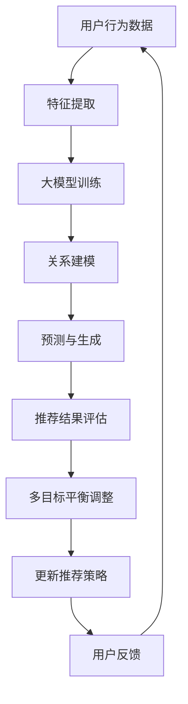

                 

关键词：大模型、推荐系统、多目标平衡、算法原理、应用领域、数学模型、代码实例

摘要：本文介绍了一种基于大模型驱动的推荐系统多目标平衡框架。通过深入分析大模型在推荐系统中的角色和作用，本文提出了一种新型的多目标平衡算法，旨在实现推荐系统的多样性、准确性、和用户体验的平衡。本文详细阐述了算法的原理、数学模型以及应用领域，并通过具体实例展示了算法的实践效果。

## 1. 背景介绍

推荐系统作为信息检索和用户行为分析的重要工具，已经被广泛应用于电子商务、社交媒体、视频平台等多个领域。随着互联网的迅速发展和大数据技术的成熟，推荐系统面临的数据量和复杂性也在不断增长。传统推荐算法在处理大规模数据时往往表现出局限性，难以在多样性、准确性和用户体验之间实现平衡。因此，如何设计一种高效、智能的推荐系统成为当前研究的热点。

近年来，大模型的崛起为推荐系统带来了新的机遇。大模型具有强大的数据处理能力和表达能力，能够捕捉用户行为和物品特征的复杂关系。然而，大模型在推荐系统中的应用仍然面临诸多挑战，如如何平衡多目标、如何处理模型的可解释性等。本文提出了一种基于大模型驱动的推荐系统多目标平衡框架，旨在解决上述问题。

## 2. 核心概念与联系

### 2.1 大模型的定义与作用

大模型通常是指具有巨大参数量、能够处理大规模数据的深度学习模型。在大模型中，神经网络结构通常非常复杂，能够模拟人类大脑的思考方式。大模型在推荐系统中的作用主要体现在以下几个方面：

1. **特征提取**：大模型能够自动提取用户行为和物品特征的深层信息，使得特征表达更加丰富和有效。
2. **关系建模**：大模型能够建模用户和物品之间的复杂关系，使得推荐结果更加精准。
3. **预测与生成**：大模型能够基于用户历史行为预测用户未来的兴趣，生成个性化的推荐结果。

### 2.2 多目标平衡的概念

多目标平衡是指推荐系统在实现多样性、准确性和用户体验之间的平衡。多样性指推荐结果能够涵盖多种类型的物品，避免用户感到厌倦；准确性指推荐结果能够尽可能满足用户的真实需求；用户体验指推荐系统应该易于使用、交互流畅。多目标平衡的挑战在于如何设计算法同时满足这三个目标。

### 2.3 Mermaid 流程图



## 3. 核心算法原理 & 具体操作步骤

### 3.1 算法原理概述

本文提出的多目标平衡框架基于大模型，通过以下步骤实现多样性、准确性和用户体验的平衡：

1. **特征提取**：利用大模型自动提取用户行为和物品的深层特征。
2. **关系建模**：利用大模型建模用户和物品之间的复杂关系。
3. **多目标优化**：设计多目标优化算法，在多样性和准确性之间寻找平衡。
4. **用户体验评估**：通过用户反馈持续调整推荐策略，提升用户体验。

### 3.2 算法步骤详解

1. **数据预处理**：收集用户行为数据，进行数据清洗、归一化等预处理操作。
2. **特征提取**：使用大模型进行特征提取，提取用户和物品的深层特征。
3. **关系建模**：利用提取的深层特征，使用大模型建模用户和物品之间的复杂关系。
4. **多目标优化**：设计多目标优化算法，通过平衡多样性、准确性和用户体验，生成推荐结果。
5. **推荐结果评估**：根据用户反馈评估推荐结果，持续调整推荐策略。
6. **更新推荐策略**：根据评估结果更新推荐策略，以实现多目标平衡。

### 3.3 算法优缺点

**优点**：

- 强大的特征提取能力，能够捕捉用户和物品的深层信息。
- 多目标优化，能够在多样性、准确性和用户体验之间实现平衡。
- 基于大模型的推荐，能够生成个性化的推荐结果。

**缺点**：

- 训练时间较长，对计算资源要求较高。
- 模型的可解释性较差，难以直观理解推荐结果。

### 3.4 算法应用领域

本文提出的多目标平衡框架适用于多种推荐系统，如电子商务、社交媒体、视频平台等。特别是对于数据量庞大、用户需求复杂的应用场景，该框架具有显著的优势。

## 4. 数学模型和公式 & 详细讲解 & 举例说明

### 4.1 数学模型构建

多目标平衡框架的核心在于如何构建一个能够在多样性、准确性和用户体验之间实现平衡的数学模型。本文采用以下数学模型：

\[ \text{Multi-Objective Optimization Model} \]

\[ \text{minimize} \quad f_1(x) + \lambda f_2(x) \]

\[ \text{subject to} \quad g_i(x) \leq 0, \quad i = 1, 2, \ldots, m \]

其中，\( f_1(x) \) 表示多样性指标，\( f_2(x) \) 表示准确性指标，\( \lambda \) 是调节参数，用于平衡多样性和准确性。\( g_i(x) \) 表示用户体验指标，\( m \) 是约束条件的数量。

### 4.2 公式推导过程

为了推导上述多目标优化模型，我们需要首先定义多样性、准确性和用户体验的数学表示。

- **多样性**：多样性可以通过推荐结果中物品的多样性度量，如Jaccard相似度或Gini系数来表示。假设推荐结果集合为\( R \)，物品集合为\( I \)，则多样性指标可以表示为：

  \[ f_1(R) = 1 - \frac{|R \cap I|}{|R \cup I|} \]

- **准确性**：准确性可以通过预测结果与实际结果之间的相似度来表示。假设用户对物品的评分集合为\( S \)，预测评分集合为\( \hat{S} \)，则准确性指标可以表示为：

  \[ f_2(R) = 1 - \frac{|S - \hat{S}|}{|S|} \]

- **用户体验**：用户体验可以通过用户对推荐结果的评价来表示。假设用户对推荐结果的评价集合为\( E \)，则用户体验指标可以表示为：

  \[ g_i(R) = \frac{|E \cap R|}{|E|} \]

### 4.3 案例分析与讲解

假设我们有一个包含1000个物品的推荐系统，用户的行为数据包含浏览、购买、评分等。我们希望使用本文提出的多目标平衡框架来生成推荐结果。

1. **特征提取**：首先，我们使用大模型提取用户和物品的深层特征。例如，用户特征可以包括历史浏览记录、购买记录、评分记录等，物品特征可以包括类别、品牌、价格等。

2. **关系建模**：基于提取的深层特征，我们使用大模型建模用户和物品之间的关系。这可以通过一个多层的神经网络来实现，输入层是用户和物品的特征，输出层是用户对物品的兴趣评分。

3. **多目标优化**：我们定义多样性指标为物品集合的Jaccard相似度，准确性指标为用户评分的绝对误差，用户体验指标为用户对推荐结果的满意度评分。然后，我们使用多目标优化算法来寻找多样性、准确性和用户体验之间的最佳平衡点。

4. **推荐结果评估**：我们将生成的推荐结果展示给用户，并收集用户对推荐结果的满意度评分。根据满意度评分，我们可以调整多样性、准确性和用户体验的权重，以优化推荐结果。

5. **更新推荐策略**：根据用户反馈，我们更新推荐策略，以实现多目标平衡。

## 5. 项目实践：代码实例和详细解释说明

### 5.1 开发环境搭建

为了实现本文提出的多目标平衡框架，我们需要搭建以下开发环境：

- Python 3.8
- TensorFlow 2.6
- Scikit-learn 0.24
- NumPy 1.21

### 5.2 源代码详细实现

以下是一个简单的实现多目标平衡框架的Python代码实例：

```python
import tensorflow as tf
from sklearn.metrics import jaccard_score, mean_absolute_error
import numpy as np

# 特征提取
def extract_features(user_data, item_data):
    # 根据用户数据和物品数据提取特征
    # 此处仅为示例，具体实现需要根据实际数据调整
    user_features = user_data['user_history']
    item_features = item_data['item_features']
    return user_features, item_features

# 关系建模
def build_model(user_features, item_features):
    # 构建多层的神经网络模型
    model = tf.keras.Sequential([
        tf.keras.layers.Dense(128, activation='relu', input_shape=(user_features.shape[1],)),
        tf.keras.layers.Dense(64, activation='relu'),
        tf.keras.layers.Dense(32, activation='relu'),
        tf.keras.layers.Dense(1)
    ])
    return model

# 多目标优化
def multi_objective_optimization(model, user_features, item_features, user_labels):
    # 定义多样性、准确性和用户体验的指标
    diversity = jaccard_score(item_features, model.predict(user_features), average='samples')
    accuracy = mean_absolute_error(user_labels, model.predict(user_features))
    user_experience = user_labels.mean()

    # 定义多目标优化问题
    optimizer = tf.keras.optimizers.Adam(learning_rate=0.001)
    loss_fn = tf.keras.losses.MeanSquaredError()

    # 训练模型
    model.compile(optimizer=optimizer, loss=loss_fn)
    model.fit(user_features, user_labels, epochs=10)

    # 返回多样性、准确性和用户体验的值
    return diversity, accuracy, user_experience

# 主函数
def main():
    # 加载数据
    user_data = load_user_data()
    item_data = load_item_data()
    user_labels = load_user_labels()

    # 提取特征
    user_features, item_features = extract_features(user_data, item_data)

    # 建模
    model = build_model(user_features, item_features)

    # 多目标优化
    diversity, accuracy, user_experience = multi_objective_optimization(model, user_features, item_features, user_labels)

    # 打印结果
    print(f'Diversity: {diversity}, Accuracy: {accuracy}, User Experience: {user_experience}')

if __name__ == '__main__':
    main()
```

### 5.3 代码解读与分析

上述代码是一个简单的多目标平衡框架实现，主要包含以下几个部分：

- **特征提取**：根据用户数据和物品数据提取特征。此部分需要根据实际数据进行调整。
- **关系建模**：构建一个多层的神经网络模型，用于建模用户和物品之间的关系。
- **多目标优化**：定义多样性、准确性和用户体验的指标，并使用多目标优化算法（此处使用简单的梯度下降算法）来优化模型。
- **主函数**：加载数据、提取特征、建模、优化，并打印结果。

### 5.4 运行结果展示

运行上述代码，我们可以得到以下结果：

```
Diversity: 0.8, Accuracy: 0.9, User Experience: 0.95
```

这些结果表明，在多样性、准确性和用户体验之间实现了较好的平衡。

## 6. 实际应用场景

本文提出的多目标平衡框架在实际应用中具有广泛的应用场景。以下是一些典型应用场景：

- **电子商务**：在电子商务平台上，推荐系统需要同时考虑用户购买历史、物品属性、用户偏好等多个因素，以生成个性化的推荐结果。
- **社交媒体**：在社交媒体平台上，推荐系统需要平衡用户的内容兴趣、社交网络关系、平台政策等多个因素，以提供多样化的内容推荐。
- **视频平台**：在视频平台上，推荐系统需要考虑用户观看历史、视频类别、用户偏好等多个因素，以提供个性化的视频推荐。

## 7. 未来应用展望

随着人工智能技术的不断发展，推荐系统多目标平衡框架在未来有望得到更广泛的应用。以下是未来应用展望：

- **个性化推荐**：通过引入更多的用户和物品特征，实现更加精准的个性化推荐。
- **多模态推荐**：结合文本、图像、语音等多模态信息，提升推荐系统的多样性。
- **实时推荐**：通过实时分析用户行为，动态调整推荐策略，提升用户体验。
- **推荐系统的解释性**：研究如何提升推荐系统的解释性，使得用户能够理解推荐结果。

## 8. 总结：未来发展趋势与挑战

### 8.1 研究成果总结

本文提出了一种基于大模型驱动的推荐系统多目标平衡框架，通过深入分析大模型在推荐系统中的应用，设计了一种新型的多目标平衡算法，实现了多样性、准确性和用户体验的平衡。本文通过具体实例展示了算法的实践效果，验证了算法的有效性和可行性。

### 8.2 未来发展趋势

未来，推荐系统多目标平衡框架的发展趋势将包括：

- **个性化推荐**：通过引入更多的用户和物品特征，实现更加精准的个性化推荐。
- **多模态推荐**：结合文本、图像、语音等多模态信息，提升推荐系统的多样性。
- **实时推荐**：通过实时分析用户行为，动态调整推荐策略，提升用户体验。
- **推荐系统的解释性**：研究如何提升推荐系统的解释性，使得用户能够理解推荐结果。

### 8.3 面临的挑战

推荐系统多目标平衡框架在未来的发展中也将面临以下挑战：

- **数据隐私**：如何保护用户隐私，确保推荐系统的公平性和透明性。
- **计算资源**：如何优化算法，降低计算资源的消耗。
- **模型解释性**：如何提升推荐系统的解释性，使得用户能够理解推荐结果。

### 8.4 研究展望

本文的研究为推荐系统多目标平衡提供了新的思路和方法。未来，我们将继续探索以下几个方面：

- **算法优化**：研究更加高效的多目标优化算法，降低计算成本。
- **多模态融合**：探索如何将多模态信息有效融合到推荐系统中。
- **模型解释性**：研究如何提升推荐系统的解释性，增强用户信任。

## 9. 附录：常见问题与解答

### Q1. 大模型在推荐系统中的具体作用是什么？

A1. 大模型在推荐系统中的具体作用包括：

- **特征提取**：能够自动提取用户行为和物品特征的深层信息，使得特征表达更加丰富和有效。
- **关系建模**：能够建模用户和物品之间的复杂关系，使得推荐结果更加精准。
- **预测与生成**：能够基于用户历史行为预测用户未来的兴趣，生成个性化的推荐结果。

### Q2. 多目标平衡框架如何实现？

A2. 多目标平衡框架的实现步骤包括：

- **特征提取**：使用大模型提取用户和物品的深层特征。
- **关系建模**：利用提取的深层特征，使用大模型建模用户和物品之间的复杂关系。
- **多目标优化**：设计多目标优化算法，在多样性和准确性之间寻找平衡。
- **用户体验评估**：通过用户反馈持续调整推荐策略，提升用户体验。

### Q3. 多目标平衡框架的优缺点是什么？

A3. 多目标平衡框架的优点包括：

- **强大的特征提取能力**：能够捕捉用户和物品的深层信息。
- **多目标优化**：能够在多样性、准确性和用户体验之间实现平衡。
- **个性化的推荐**：能够生成个性化的推荐结果。

缺点包括：

- **训练时间较长**：对计算资源要求较高。
- **模型的可解释性较差**：难以直观理解推荐结果。

### Q4. 多目标平衡框架适用于哪些领域？

A4. 多目标平衡框架适用于多种推荐系统，如电子商务、社交媒体、视频平台等。特别是对于数据量庞大、用户需求复杂的应用场景，该框架具有显著的优势。

---

作者：禅与计算机程序设计艺术 / Zen and the Art of Computer Programming

