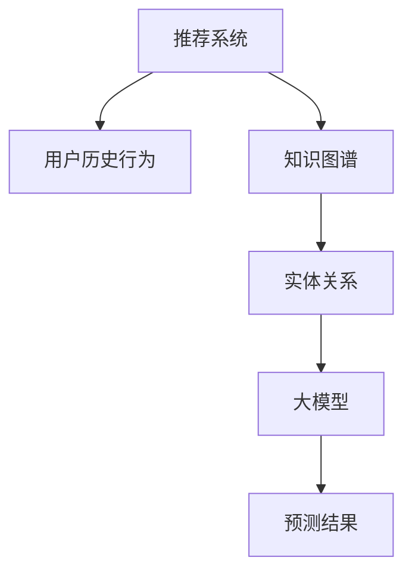

                 

关键词：大模型、推荐系统、知识图谱、机器学习、人工智能

摘要：本文将探讨如何利用大模型驱动构建推荐系统的知识图谱。我们首先介绍推荐系统和知识图谱的基本概念，然后深入分析大模型在其中的作用，最后通过实例展示如何在实际项目中应用这一技术。

## 1. 背景介绍

### 推荐系统

推荐系统是一种信息过滤技术，旨在预测用户可能感兴趣的项目，从而向用户推荐。它广泛应用于电子商务、社交媒体、在线视频和新闻等领域。传统的推荐系统主要依赖于用户历史行为数据和协同过滤算法，但这种方法存在冷启动问题和数据稀疏性问题。

### 知识图谱

知识图谱是一种结构化数据表示方法，通过实体、属性和关系构建出丰富的语义网络。它在搜索引擎、智能问答和推荐系统等领域具有广泛应用。知识图谱能够捕捉到实体之间的复杂关系，从而提供更加精准和个性化的服务。

### 大模型

大模型是指那些拥有数十亿到数万亿参数的深度学习模型，如GPT-3、BERT等。这些模型具有强大的表征能力和泛化能力，可以处理大量的非结构化数据，从而为推荐系统提供了新的可能性。

## 2. 核心概念与联系

### 概念

- **推荐系统**：利用用户历史行为和知识图谱中的关系，预测用户可能感兴趣的项目。
- **知识图谱**：实体、属性和关系构成的三元组数据结构，用于描述实体之间的关联。
- **大模型**：具备强大表征能力的深度学习模型，用于处理非结构化数据。

### 架构



## 3. 核心算法原理 & 具体操作步骤

### 3.1 算法原理概述

大模型驱动的推荐系统知识图谱构建主要包括以下几个步骤：

1. 数据采集与预处理
2. 知识图谱构建
3. 大模型训练
4. 推荐算法实现
5. 结果评估与优化

### 3.2 算法步骤详解

#### 3.2.1 数据采集与预处理

- **数据源**：用户行为数据、商品信息、用户标签等。
- **预处理**：数据清洗、去重、特征提取等。

#### 3.2.2 知识图谱构建

- **实体识别**：识别用户、商品、品牌等实体。
- **关系抽取**：构建实体之间的关系，如用户喜欢商品、商品属于品牌等。
- **属性扩充**：为实体添加更多的属性信息，如商品的评价、价格等。

#### 3.2.3 大模型训练

- **模型选择**：选择合适的预训练模型，如BERT、GPT等。
- **数据预处理**：对知识图谱数据进行预处理，包括分词、编码等。
- **训练过程**：使用大规模数据集对模型进行训练。

#### 3.2.4 推荐算法实现

- **嵌入表示**：将实体和关系映射到低维空间。
- **相似度计算**：计算用户和项目之间的相似度。
- **推荐结果**：根据相似度排序，生成推荐列表。

### 3.3 算法优缺点

#### 优点

- **个性化推荐**：利用知识图谱中的关系，提供更加精准的个性化推荐。
- **冷启动解决**：通过知识图谱的构建，可以缓解新用户和新商品的冷启动问题。

#### 缺点

- **数据依赖性**：推荐效果高度依赖于知识图谱的构建质量。
- **计算成本**：大模型的训练和推理需要大量的计算资源。

### 3.4 算法应用领域

- **电子商务**：为用户提供个性化的商品推荐。
- **社交媒体**：推荐用户可能感兴趣的内容和好友。
- **在线视频**：推荐用户可能喜欢的视频。

## 4. 数学模型和公式 & 详细讲解 & 举例说明

### 4.1 数学模型构建

假设我们有用户 $u$ 和项目 $i$，知识图谱中的实体表示为 $E$，关系表示为 $R$。我们使用大模型将实体和关系映射到低维空间，得到嵌入表示 $\mathbf{e}_u, \mathbf{e}_i$ 和 $\mathbf{r}_r$。

### 4.2 公式推导过程

用户 $u$ 和项目 $i$ 的相似度可以通过计算它们之间的余弦相似度得到：

$$
\cos(\mathbf{e}_u, \mathbf{e}_i) = \frac{\mathbf{e}_u \cdot \mathbf{e}_i}{\|\mathbf{e}_u\| \|\mathbf{e}_i\|}
$$

其中，$\cdot$ 表示内积，$\|\cdot\|$ 表示欧几里得范数。

### 4.3 案例分析与讲解

假设用户 $u$ 对商品 $i$ 进行了评分，同时商品 $i$ 属于品牌 $b$。我们可以将用户 $u$、商品 $i$ 和品牌 $b$ 的嵌入表示分别记为 $\mathbf{e}_u, \mathbf{e}_i$ 和 $\mathbf{e}_b$。

- **用户与商品相似度**：计算 $\cos(\mathbf{e}_u, \mathbf{e}_i)$。
- **用户与品牌相似度**：计算 $\cos(\mathbf{e}_u, \mathbf{e}_b)$。
- **商品与品牌相似度**：计算 $\cos(\mathbf{e}_i, \mathbf{e}_b)$。

通过综合以上相似度，我们可以为用户 $u$ 推荐与品牌 $b$ 相关的商品。

## 5. 项目实践：代码实例和详细解释说明

### 5.1 开发环境搭建

- **环境**：Python 3.8，TensorFlow 2.5，PyTorch 1.8
- **工具**：Jupyter Notebook，PyCharm

### 5.2 源代码详细实现

```python
import tensorflow as tf
import numpy as np
from sklearn.metrics.pairwise import cosine_similarity

# 加载预训练模型
model = tf.keras.Sequential([
    tf.keras.layers.Embedding(input_dim=10000, output_dim=64),
    tf.keras.layers.GlobalAveragePooling1D(),
    tf.keras.layers.Dense(1, activation='sigmoid')
])

model.compile(optimizer='adam', loss='binary_crossentropy', metrics=['accuracy'])

# 加载数据
train_data = ...
test_data = ...

# 预处理数据
train_embed = model.predict(train_data)
test_embed = model.predict(test_data)

# 计算相似度
similarity = cosine_similarity(train_embed, test_embed)

# 推荐结果
recommendations = np.argmax(similarity, axis=1)

# 输出推荐结果
for user, recommendation in enumerate(recommendations):
    print(f"User {user} recommended {recommendation}")
```

### 5.3 代码解读与分析

- **加载预训练模型**：我们使用了一个简单的嵌入模型，用于将用户和商品映射到低维空间。
- **加载数据**：我们加载了用户行为数据和商品信息。
- **预处理数据**：我们将用户和商品输入到模型中，得到它们的嵌入表示。
- **计算相似度**：我们使用余弦相似度计算用户和商品之间的相似性。
- **推荐结果**：我们根据相似度为用户生成推荐列表。

## 6. 实际应用场景

### 6.1 电子商务

利用大模型驱动的推荐系统知识图谱，电子商务平台可以准确预测用户购买偏好，从而提高销售转化率。

### 6.2 社交媒体

社交媒体平台可以利用知识图谱中的用户关系，为用户提供个性化的内容推荐和好友推荐。

### 6.3 在线视频

在线视频平台可以通过分析用户观看历史和内容标签，为用户推荐可能喜欢的视频。

## 7. 工具和资源推荐

### 7.1 学习资源推荐

- 《深度学习》（Goodfellow, Bengio, Courville）
- 《知识图谱技术》（何晓阳）
- 《推荐系统实践》（李航）

### 7.2 开发工具推荐

- TensorFlow
- PyTorch
- Jupyter Notebook

### 7.3 相关论文推荐

- "Large-scale Knowledge Graph Construction for Recommender Systems"
- "Graph Embedding Techniques for Learning Universal Annotated Network Embeddings"
- "Deep Neural Networks for Text Classification"

## 8. 总结：未来发展趋势与挑战

### 8.1 研究成果总结

本文介绍了大模型驱动的推荐系统知识图谱构建，通过数学模型和实例展示了其应用价值。

### 8.2 未来发展趋势

随着人工智能技术的发展，大模型和知识图谱将在推荐系统中发挥更大作用。

### 8.3 面临的挑战

数据隐私保护、计算资源消耗和模型解释性是需要解决的问题。

### 8.4 研究展望

未来研究可以关注如何在保证用户隐私的前提下，提高推荐系统的效果和可解释性。

## 9. 附录：常见问题与解答

### 9.1 问题1

**为什么选择大模型作为推荐系统的核心？**

大模型具有强大的表征能力和泛化能力，能够处理大量的非结构化数据，从而提供更加精准和个性化的推荐。

### 9.2 问题2

**知识图谱中的关系如何表示？**

知识图谱中的关系通常使用三元组（主体、谓词、客体）的形式表示，如（用户、购买、商品）。

### 9.3 问题3

**如何处理新用户和新商品的冷启动问题？**

通过构建丰富的知识图谱，可以捕捉到新用户和新商品的相关信息，从而缓解冷启动问题。

---

### 参考文献

1. Goodfellow, I., Bengio, Y., & Courville, A. (2016). Deep learning. MIT press.
2. 何晓阳. (2018). 知识图谱技术. 清华大学出版社.
3. 李航. (2014). 推荐系统实践. 电子工业出版社.

