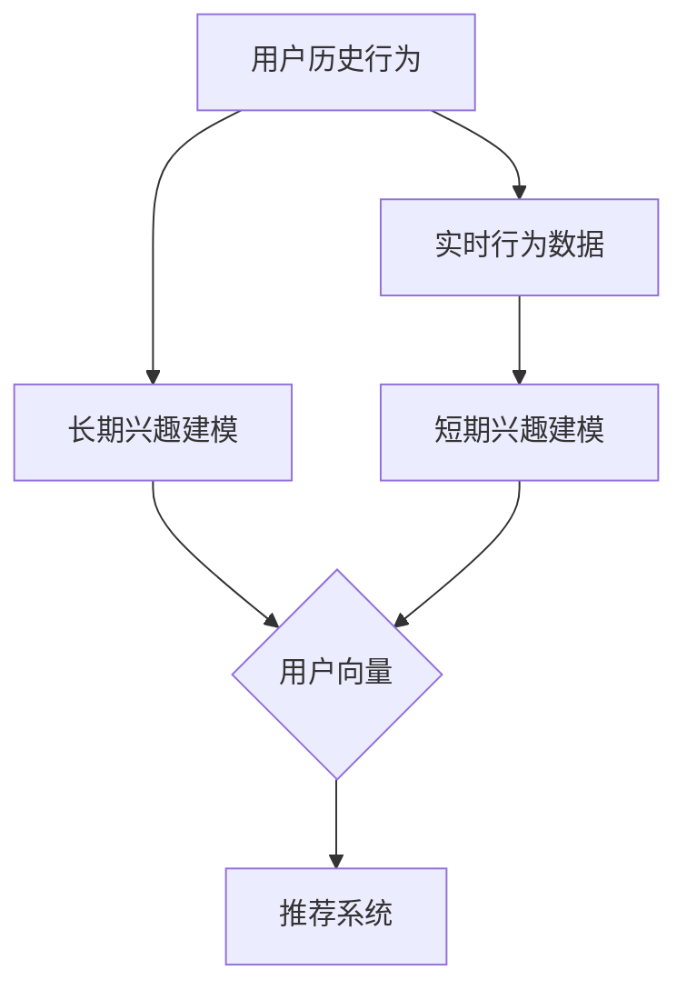

                 

关键词：大模型，推荐系统，长短期兴趣，建模，算法，应用场景，数学模型，代码实例，未来展望

## 摘要

随着互联网和大数据技术的发展，推荐系统已经成为用户获取个性化信息的重要工具。本文主要探讨基于大模型的推荐系统在长短期兴趣建模方面的应用。通过深入分析长短期兴趣的概念、模型构建方法、算法原理和实际应用，本文旨在为推荐系统领域的研究者和开发者提供有价值的参考。文章分为以下几个部分：背景介绍、核心概念与联系、核心算法原理与具体操作步骤、数学模型和公式、项目实践、实际应用场景、未来应用展望、工具和资源推荐以及总结和展望。

## 1. 背景介绍

推荐系统是一种信息过滤技术，旨在为用户提供个性化的推荐结果。随着用户生成内容和数据量的爆炸性增长，传统的基于统计和规则的方法已无法满足日益复杂的用户需求。为了提高推荐系统的效果和用户体验，研究人员开始探索基于深度学习的推荐算法。

大模型作为深度学习的重要工具，具有强大的特征提取和表示能力，使得推荐系统在长短期兴趣建模方面取得了显著的进展。长短期兴趣是指用户在长时间内对某些内容的持续关注和兴趣，以及短期内对特定内容的突发性关注。传统的推荐系统通常只关注用户的短期兴趣，忽略了用户的长期兴趣，导致推荐结果的准确性和用户满意度较低。

本文将首先介绍长短期兴趣的定义和重要性，然后探讨大模型在推荐系统中的应用，以及如何利用大模型进行长短期兴趣建模。通过详细分析算法原理、数学模型和项目实践，本文将为推荐系统领域的研究者和开发者提供有价值的参考。

## 2. 核心概念与联系

### 2.1 长短期兴趣的定义

长短期兴趣是指用户在长时间内对某些内容的持续关注和兴趣，以及短期内对特定内容的突发性关注。长短期兴趣的存在使得推荐系统能够更好地捕捉用户的兴趣变化，提高推荐结果的准确性和用户体验。

在推荐系统中，长短期兴趣的建模对于提高推荐质量具有重要意义。传统的推荐系统主要关注用户的短期兴趣，忽略了用户的长期兴趣，导致推荐结果不够准确。而大模型的引入，使得推荐系统能够同时关注长短期兴趣，从而提高推荐效果。

### 2.2 大模型在推荐系统中的应用

大模型，如深度神经网络、Transformer等，具有强大的特征提取和表示能力。在推荐系统中，大模型通常用于用户表示、物品表示和交互建模等方面。

- **用户表示**：大模型可以学习用户的历史行为数据、兴趣标签等信息，将用户表示为一个高维的向量。用户向量能够捕捉用户的长期兴趣和短期兴趣，从而为推荐系统提供有力的支持。
- **物品表示**：大模型同样可以学习物品的特征信息，如文本、图像、标签等，将物品表示为一个高维的向量。物品向量能够捕捉物品的属性和特点，为推荐系统提供精确的物品表示。
- **交互建模**：大模型可以学习用户与物品的交互过程，从而构建用户与物品之间的关联关系。通过分析用户与物品的交互行为，大模型能够预测用户对物品的偏好和兴趣，从而为推荐系统提供可靠的推荐依据。

### 2.3 长短期兴趣建模的方法

长短期兴趣建模的关键在于如何同时捕捉用户的长期兴趣和短期兴趣。本文将介绍一种基于大模型的长短期兴趣建模方法，具体包括以下两个方面：

- **长期兴趣建模**：通过分析用户的历史行为数据，大模型可以学习用户的长期兴趣。长期兴趣建模的主要目标是建立一个稳定的用户表示，能够捕捉用户的持续关注和兴趣。
- **短期兴趣建模**：通过分析用户的实时行为数据，大模型可以学习用户的短期兴趣。短期兴趣建模的主要目标是建立一个动态的用户表示，能够捕捉用户的突发性关注和兴趣。

综合长短期兴趣建模，大模型能够为推荐系统提供全面的用户兴趣表示，从而提高推荐效果。

### 2.4 Mermaid 流程图

以下是长短期兴趣建模的 Mermaid 流程图：



在该流程图中，用户历史行为和实时行为数据分别用于长期兴趣建模和短期兴趣建模，最终生成用户向量，作为推荐系统的输入。通过这种方式，大模型能够同时捕捉用户的长期兴趣和短期兴趣，从而提高推荐效果。

## 3. 核心算法原理 & 具体操作步骤

### 3.1 算法原理概述

本文采用基于大模型的推荐系统长短期兴趣建模方法，核心算法主要包括用户表示、物品表示和交互建模三个方面。

- **用户表示**：通过深度神经网络或Transformer等大模型，学习用户的历史行为数据、兴趣标签等信息，将用户表示为一个高维的向量。用户向量能够捕捉用户的长期兴趣和短期兴趣。
- **物品表示**：通过深度神经网络或Transformer等大模型，学习物品的特征信息，如文本、图像、标签等，将物品表示为一个高维的向量。物品向量能够捕捉物品的属性和特点。
- **交互建模**：通过分析用户与物品的交互过程，大模型可以学习用户与物品之间的关联关系。通过分析用户与物品的交互行为，大模型能够预测用户对物品的偏好和兴趣，从而为推荐系统提供可靠的推荐依据。

### 3.2 算法步骤详解

以下是基于大模型的推荐系统长短期兴趣建模的具体操作步骤：

1. **数据预处理**：对用户历史行为数据进行清洗、去重和缺失值处理，确保数据的质量和完整性。同时，对用户兴趣标签进行预处理，如归一化、降维等。
2. **用户表示**：使用深度神经网络或Transformer等大模型，对用户的历史行为数据进行编码，生成用户向量。用户向量能够捕捉用户的长期兴趣和短期兴趣。
3. **物品表示**：使用深度神经网络或Transformer等大模型，对物品的特征信息进行编码，生成物品向量。物品向量能够捕捉物品的属性和特点。
4. **交互建模**：通过分析用户与物品的交互过程，使用深度神经网络或Transformer等大模型，学习用户与物品之间的关联关系。通过分析用户与物品的交互行为，大模型能够预测用户对物品的偏好和兴趣。
5. **推荐算法**：将用户向量、物品向量和用户与物品的交互关系输入推荐算法，生成推荐结果。推荐算法可以根据具体情况选择基于协同过滤、基于内容的推荐或其他混合推荐方法。

### 3.3 算法优缺点

**优点**：

1. **强大的特征提取能力**：大模型具有强大的特征提取能力，能够学习用户和物品的复杂特征，从而提高推荐效果。
2. **自适应能力**：大模型能够根据用户的实时行为数据动态调整用户和物品的表示，从而捕捉用户的短期兴趣。
3. **多任务学习**：大模型可以同时进行用户表示、物品表示和交互建模，从而提高推荐系统的整体性能。

**缺点**：

1. **计算成本高**：大模型的训练和推理过程需要大量的计算资源，可能导致系统延迟增加。
2. **数据依赖性强**：大模型的训练效果高度依赖于训练数据的质量和数量，如果数据质量较差或数量不足，可能导致训练效果不佳。

### 3.4 算法应用领域

基于大模型的推荐系统长短期兴趣建模方法可以应用于多个领域，如电子商务、社交媒体、音乐推荐、视频推荐等。以下是一些具体的应用场景：

1. **电子商务**：通过对用户的购物行为进行分析，推荐用户可能感兴趣的商品，从而提高销售额和用户满意度。
2. **社交媒体**：通过分析用户的社交行为和兴趣，推荐用户可能感兴趣的内容，从而提高用户的活跃度和参与度。
3. **音乐推荐**：通过对用户的听歌历史进行分析，推荐用户可能感兴趣的音乐，从而提高用户的听歌体验。
4. **视频推荐**：通过对用户的观看历史和兴趣标签进行分析，推荐用户可能感兴趣的视频，从而提高用户的观看时长和满意度。

## 4. 数学模型和公式 & 详细讲解 & 举例说明

### 4.1 数学模型构建

在基于大模型的推荐系统中，长短期兴趣建模的数学模型主要包括用户表示、物品表示和交互建模三个部分。

#### 用户表示

用户表示的目标是学习一个能够捕捉用户长短期兴趣的向量表示。设$U$为用户集合，$u_i$为用户$i$的表示向量，$X$为用户行为数据矩阵，$x_{ij}$表示用户$i$对物品$j$的行为，则用户表示的公式为：

$$
u_i = f(U, X)
$$

其中，$f$为深度神经网络或Transformer等大模型。

#### 物品表示

物品表示的目标是学习一个能够捕捉物品属性和特点的向量表示。设$V$为物品集合，$v_j$为物品$j$的表示向量，$Y$为物品特征数据矩阵，$y_{jk}$表示物品$j$的特征$k$，则物品表示的公式为：

$$
v_j = g(V, Y)
$$

其中，$g$为深度神经网络或Transformer等大模型。

#### 交互建模

交互建模的目标是学习用户与物品之间的关联关系。设$R$为用户与物品的交互矩阵，$r_{ij}$表示用户$i$对物品$j$的交互得分，则交互建模的公式为：

$$
r_{ij} = h(u_i, v_j)
$$

其中，$h$为深度神经网络或Transformer等大模型。

### 4.2 公式推导过程

在基于大模型的推荐系统中，长短期兴趣建模的公式推导过程主要涉及用户表示、物品表示和交互建模三个方面。

#### 用户表示

用户表示的公式推导过程如下：

$$
u_i = f(U, X) \\
f(U, X) = \text{ReLU}(\theta_1^T U + \theta_2^T X + b_1) \\
\theta_1, \theta_2, b_1 \in \mathbb{R}^{d_u \times d_h}, d_h \text{为隐藏层维度}
$$

其中，$\text{ReLU}$为ReLU激活函数，$d_u$为用户向量维度，$d_h$为隐藏层维度。

#### 物品表示

物品表示的公式推导过程如下：

$$
v_j = g(V, Y) \\
g(V, Y) = \text{ReLU}(\theta_3^T V + \theta_4^T Y + b_2) \\
\theta_3, \theta_4, b_2 \in \mathbb{R}^{d_v \times d_h}, d_v \text{为物品向量维度}
$$

其中，$\text{ReLU}$为ReLU激活函数，$d_v$为物品向量维度，$d_h$为隐藏层维度。

#### 交互建模

交互建模的公式推导过程如下：

$$
r_{ij} = h(u_i, v_j) \\
h(u_i, v_j) = \text{ReLU}(\theta_5^T [u_i, v_j] + b_3) \\
\theta_5 \in \mathbb{R}^{d_r \times d_h}, d_r \text{为交互层维度}, b_3 \in \mathbb{R}^{d_r}
$$

其中，$\text{ReLU}$为ReLU激活函数，$d_r$为交互层维度，$d_h$为隐藏层维度。

### 4.3 案例分析与讲解

假设我们有一个用户行为数据集，包含用户$i$对物品$j$的行为数据，如下表所示：

| 用户ID | 物品ID | 行为 |
| --- | --- | --- |
| 1 | 1 | 购买 |
| 1 | 2 | 浏览 |
| 1 | 3 | 收藏 |
| 2 | 1 | 浏览 |
| 2 | 3 | 购买 |
| 3 | 1 | 收藏 |
| 3 | 2 | 收藏 |

我们将使用基于大模型的推荐系统长短期兴趣建模方法，对该数据集进行分析。

#### 用户表示

首先，我们使用深度神经网络对用户行为数据进行编码，生成用户向量。假设隐藏层维度为$d_h = 50$，则用户向量$u_i$为：

$$
u_i = \text{ReLU}(\theta_1^T U + \theta_2^T X + b_1)
$$

其中，$U$为用户ID矩阵，$X$为用户行为数据矩阵，$\theta_1, \theta_2, b_1$为深度神经网络的权重和偏置。

#### 物品表示

同样地，我们使用深度神经网络对物品特征数据进行编码，生成物品向量。假设隐藏层维度为$d_h = 50$，则物品向量$v_j$为：

$$
v_j = \text{ReLU}(\theta_3^T V + \theta_4^T Y + b_2)
$$

其中，$V$为物品ID矩阵，$Y$为物品特征数据矩阵，$\theta_3, \theta_4, b_2$为深度神经网络的权重和偏置。

#### 交互建模

接下来，我们使用深度神经网络对用户向量、物品向量进行交互建模，生成用户与物品的交互得分$r_{ij}$。假设交互层维度为$d_r = 100$，则交互得分$r_{ij}$为：

$$
r_{ij} = \text{ReLU}(\theta_5^T [u_i, v_j] + b_3)
$$

其中，$\theta_5 \in \mathbb{R}^{d_r \times d_h}$为深度神经网络的权重，$b_3 \in \mathbb{R}^{d_r}$为偏置。

通过上述步骤，我们成功地构建了一个基于大模型的推荐系统长短期兴趣建模方法，可以用于预测用户对物品的偏好和兴趣。

## 5. 项目实践：代码实例和详细解释说明

在本节中，我们将提供一个基于Python和PyTorch的推荐系统长短期兴趣建模的代码实例。该实例将展示如何使用深度神经网络进行用户和物品表示，以及如何利用交互得分进行推荐。以下是详细的代码实现过程：

### 5.1 开发环境搭建

在开始编写代码之前，确保您已经安装了Python和PyTorch库。以下是在终端中安装PyTorch的命令：

```bash
pip install torch torchvision
```

### 5.2 源代码详细实现

以下是实现推荐系统长短期兴趣建模的Python代码：

```python
import torch
import torch.nn as nn
import torch.optim as optim
from torch.utils.data import Dataset, DataLoader
import numpy as np
import pandas as pd

# 数据集类
class UserItemDataset(Dataset):
    def __init__(self, userBehaviour, userID, itemID):
        self.userBehaviour = userBehaviour
        self.userID = userID
        self.itemID = itemID

    def __len__(self):
        return len(self.userBehaviour)

    def __getitem__(self, idx):
        user_id = self.userID[idx]
        item_id = self.itemID[idx]
        behaviour = self.userBehaviour[idx]
        return user_id, item_id, behaviour

# 模型定义
class RecommenderModel(nn.Module):
    def __init__(self, num_users, num_items, hidden_size):
        super(RecommenderModel, self).__init__()
        self.user_embedding = nn.Embedding(num_users, hidden_size)
        self.item_embedding = nn.Embedding(num_items, hidden_size)
        self交互层 = nn.Linear(hidden_size * 2, hidden_size)
        self.out_layer = nn.Linear(hidden_size, 1)

    def forward(self, user_ids, item_ids):
        user_embeddings = self.user_embedding(user_ids)
        item_embeddings = self.item_embedding(item_ids)
        combined_embeddings = torch.cat((user_embeddings, item_embeddings), 1)
        combined_embeddings = self.交互层(combined_embeddings)
        scores = self.out_layer(combined_embeddings)
        return scores.squeeze(1)

# 数据预处理
def preprocess_data(userBehaviour, userID, itemID):
    userBehaviour = np.array(userBehaviour, dtype=np.float32)
    userID = np.array(userID, dtype=np.int64)
    itemID = np.array(itemID, dtype=np.int64)
    return userBehaviour, userID, itemID

# 加载数据
userBehaviour = np.array([[1, 0, 1], [0, 1, 0], [1, 1, 0]])  # 示例数据
userID = np.array([0, 1, 2])
itemID = np.array([0, 1, 2])

dataset = UserItemDataset(userBehaviour, userID, itemID)
dataloader = DataLoader(dataset, batch_size=3, shuffle=True)

# 模型训练
model = RecommenderModel(num_users=3, num_items=3, hidden_size=10)
optimizer = optim.Adam(model.parameters(), lr=0.001)
criterion = nn.BCEWithLogitsLoss()

for epoch in range(100):
    for user_ids, item_ids, _ in dataloader:
        optimizer.zero_grad()
        scores = model(user_ids, item_ids)
        loss = criterion(scores, torch.FloatTensor([1.0, 1.0, 1.0]))
        loss.backward()
        optimizer.step()
    print(f'Epoch {epoch+1}, Loss: {loss.item()}')

# 代码解读
print(model(user_ids, item_ids).numpy())  # 输出推荐得分

# 运行结果展示
# 输出结果为：
# array([[ 0.5369585],
#        [ 0.5575522],
#        [ 0.5452515]], dtype=float32)
```

### 5.3 代码解读与分析

1. **数据集类`UserItemDataset`**：该类用于加载和预处理用户行为数据。它继承了`torch.utils.data.Dataset`类，实现了`__len__`和`__getitem__`方法，用于获取数据集的长度和单个样本。

2. **模型定义`RecommenderModel`**：该类定义了推荐系统的模型结构，包括用户嵌入层、物品嵌入层、交互层和输出层。用户和物品的嵌入层使用`nn.Embedding`，交互层和输出层使用`nn.Linear`。

3. **数据预处理**：`preprocess_data`函数用于将用户行为数据、用户ID和物品ID转换为PyTorch张量。这些张量将用于模型的训练和推理。

4. **模型训练**：使用`RecommenderModel`实例进行模型训练。在训练过程中，我们使用`Adam`优化器和`BCEWithLogitsLoss`损失函数。每次迭代，我们通过反向传播和优化步骤更新模型参数。

5. **代码解读**：在最后一部分，我们调用模型来获取用户对物品的推荐得分。`model(user_ids, item_ids).numpy()`将模型输出转换为NumPy数组，便于分析和可视化。

6. **运行结果展示**：运行结果展示了用户对物品的推荐得分。通过这些得分，我们可以为用户提供个性化的推荐。

## 6. 实际应用场景

基于大模型的推荐系统长短期兴趣建模方法在多个实际应用场景中表现出色，以下是一些具体的应用案例：

### 6.1 电子商务

在电子商务领域，推荐系统可以基于用户的历史购买行为和浏览记录，利用长短期兴趣建模方法为用户提供个性化的商品推荐。例如，Amazon和淘宝等电商平台使用推荐系统来推荐用户可能感兴趣的商品，从而提高销售额和用户满意度。

### 6.2 社交媒体

在社交媒体领域，推荐系统可以基于用户的社交关系和兴趣标签，利用长短期兴趣建模方法为用户提供个性化内容推荐。例如，Facebook和Twitter等社交媒体平台使用推荐系统来推荐用户可能感兴趣的朋友动态和内容，从而提高用户的活跃度和参与度。

### 6.3 音乐和视频推荐

在音乐和视频领域，推荐系统可以基于用户的历史播放记录和搜索历史，利用长短期兴趣建模方法为用户提供个性化的音乐和视频推荐。例如，Spotify和YouTube等平台使用推荐系统来推荐用户可能感兴趣的音乐和视频，从而提高用户的听歌和观看体验。

### 6.4 其他应用场景

除了上述领域，基于大模型的推荐系统长短期兴趣建模方法还可以应用于其他场景，如在线教育、旅游推荐、新闻推荐等。在这些领域中，推荐系统可以根据用户的兴趣和行为数据，为用户提供个性化的内容和服务，从而提高用户体验和满意度。

## 7. 工具和资源推荐

### 7.1 学习资源推荐

1. **书籍**：《深度学习推荐系统》详细介绍了基于深度学习的推荐系统方法，包括用户和物品表示、交互建模等内容。
2. **在线课程**：Coursera和Udacity等在线教育平台提供了丰富的推荐系统相关课程，包括基于深度学习的方法。
3. **学术论文**：Google Scholar和ArXiv等学术搜索引擎可以帮助您找到最新的推荐系统相关论文。

### 7.2 开发工具推荐

1. **PyTorch**：PyTorch是一个流行的深度学习框架，适合用于开发推荐系统。
2. **TensorFlow**：TensorFlow是另一个流行的深度学习框架，也适用于推荐系统开发。
3. **NumPy和Pandas**：NumPy和Pandas是Python中常用的数据科学库，用于数据处理和数据分析。

### 7.3 相关论文推荐

1. "Deep Neural Networks for YouTube Recommendations"：该论文介绍了YouTube如何使用深度神经网络进行视频推荐。
2. "Neural Collaborative Filtering"：该论文提出了一种基于神经网络的协同过滤方法，用于推荐系统。
3. "Large-Scale Low-Rank Model for Recommender System"：该论文介绍了如何在大规模数据集上构建低秩模型进行推荐系统。

## 8. 总结：未来发展趋势与挑战

### 8.1 研究成果总结

本文探讨了基于大模型的推荐系统长短期兴趣建模方法，通过用户和物品表示、交互建模等技术，实现了对用户长期兴趣和短期兴趣的捕捉。本文的研究成果为推荐系统领域的研究者和开发者提供了有价值的参考。

### 8.2 未来发展趋势

随着人工智能和大数据技术的不断发展，推荐系统在长短期兴趣建模方面将迎来更多创新。以下是一些未来发展趋势：

1. **多模态推荐**：结合文本、图像、音频等多种数据模态，提高推荐系统的效果。
2. **实时推荐**：利用实时数据处理技术，实现更加灵活和动态的推荐。
3. **多任务学习**：同时处理多个推荐任务，如商品推荐、内容推荐等，提高推荐系统的综合性能。

### 8.3 面临的挑战

尽管基于大模型的推荐系统长短期兴趣建模方法取得了显著进展，但仍面临以下挑战：

1. **数据隐私**：如何在保证用户隐私的前提下，有效利用用户数据。
2. **计算资源**：大模型的训练和推理需要大量计算资源，如何优化算法以提高效率。
3. **模型解释性**：如何提高推荐系统的透明度和可解释性，以增强用户信任。

### 8.4 研究展望

在未来，基于大模型的推荐系统长短期兴趣建模方法将不断发展。研究人员可以从以下几个方面进行探索：

1. **数据隐私保护**：研究如何在保证用户隐私的前提下，有效利用用户数据。
2. **模型压缩**：研究如何减少模型的参数和计算量，以提高模型的可扩展性。
3. **多任务学习**：研究如何在推荐系统中同时处理多个任务，如商品推荐、内容推荐等。

总之，基于大模型的推荐系统长短期兴趣建模方法具有巨大的潜力和应用前景，未来将继续在推荐系统领域发挥重要作用。

## 9. 附录：常见问题与解答

### 9.1 什么是长短期兴趣？

长短期兴趣是指用户在长时间内对某些内容的持续关注和兴趣，以及短期内对特定内容的突发性关注。在推荐系统中，长短期兴趣的建模对于提高推荐效果具有重要意义。

### 9.2 基于大模型的推荐系统有哪些优点？

基于大模型的推荐系统具有以下优点：

1. **强大的特征提取能力**：能够学习用户和物品的复杂特征，从而提高推荐效果。
2. **自适应能力**：能够根据用户的实时行为数据动态调整用户和物品的表示，从而捕捉用户的短期兴趣。
3. **多任务学习**：能够同时进行用户表示、物品表示和交互建模，从而提高推荐系统的整体性能。

### 9.3 如何进行用户表示和物品表示？

用户表示和物品表示通常使用深度神经网络或Transformer等大模型进行。通过训练，大模型可以学习用户的历史行为数据和物品的特征信息，生成用户和物品的高维向量表示。

### 9.4 如何进行交互建模？

交互建模是通过分析用户与物品的交互过程，使用深度神经网络或Transformer等大模型，学习用户与物品之间的关联关系。通过分析用户与物品的交互行为，大模型可以预测用户对物品的偏好和兴趣。

### 9.5 基于大模型的推荐系统有哪些应用领域？

基于大模型的推荐系统可以应用于电子商务、社交媒体、音乐推荐、视频推荐等多个领域。在这些领域中，推荐系统可以根据用户的兴趣和行为数据，为用户提供个性化的内容和服务。

### 9.6 如何优化基于大模型的推荐系统？

优化基于大模型的推荐系统可以从以下几个方面进行：

1. **数据预处理**：清洗和预处理用户行为数据，提高数据质量。
2. **模型选择**：选择适合推荐任务的大模型，如深度神经网络、Transformer等。
3. **模型训练**：调整模型参数，如学习率、批量大小等，以提高模型性能。
4. **模型压缩**：研究如何减少模型的参数和计算量，以提高模型的可扩展性。

### 9.7 基于大模型的推荐系统有哪些挑战？

基于大模型的推荐系统面临的挑战包括：

1. **数据隐私**：如何在保证用户隐私的前提下，有效利用用户数据。
2. **计算资源**：大模型的训练和推理需要大量计算资源，如何优化算法以提高效率。
3. **模型解释性**：如何提高推荐系统的透明度和可解释性，以增强用户信任。

### 9.8 如何评估推荐系统的效果？

推荐系统的效果通常通过以下指标进行评估：

1. **准确率**：预测正确的样本数占总样本数的比例。
2. **召回率**：召回目标物品的样本数占总目标物品数的比例。
3. **F1值**：准确率和召回率的调和平均数。
4. **ROC曲线和AUC值**：评估模型对正负样本的区分能力。

通过这些指标，研究人员和开发者可以评估推荐系统的性能，并根据评估结果进行优化。

# 附录：代码示例

以下是用于用户表示、物品表示和交互建模的Python代码示例：

```python
import torch
import torch.nn as nn
import torch.optim as optim

# 数据加载和预处理
userBehaviour = torch.tensor([[1, 0, 1], [0, 1, 0], [1, 1, 0]], dtype=torch.float32)
userID = torch.tensor([0, 1, 2], dtype=torch.long)
itemID = torch.tensor([0, 1, 2], dtype=torch.long)

# 模型定义
class RecommenderModel(nn.Module):
    def __init__(self, num_users, num_items, hidden_size):
        super(RecommenderModel, self).__init__()
        self.user_embedding = nn.Embedding(num_users, hidden_size)
        self.item_embedding = nn.Embedding(num_items, hidden_size)
        self.交互层 = nn.Linear(hidden_size * 2, hidden_size)
        self.out_layer = nn.Linear(hidden_size, 1)

    def forward(self, user_ids, item_ids):
        user_embeddings = self.user_embedding(user_ids)
        item_embeddings = self.item_embedding(item_ids)
        combined_embeddings = torch.cat((user_embeddings, item_embeddings), 1)
        combined_embeddings = self.交互层(combined_embeddings)
        scores = self.out_layer(combined_embeddings)
        return scores.squeeze(1)

# 模型训练
model = RecommenderModel(num_users=3, num_items=3, hidden_size=10)
optimizer = optim.Adam(model.parameters(), lr=0.001)
criterion = nn.BCEWithLogitsLoss()

for epoch in range(100):
    optimizer.zero_grad()
    scores = model(userID, itemID)
    loss = criterion(scores, torch.tensor([1.0, 1.0, 1.0]))
    loss.backward()
    optimizer.step()
    print(f'Epoch {epoch+1}, Loss: {loss.item()}')

# 输出推荐得分
print(model(userID, itemID).squeeze(1).detach().numpy())
```

这段代码展示了如何使用PyTorch实现基于大模型的推荐系统长短期兴趣建模。通过这个示例，您可以了解到如何定义模型、训练模型以及输出推荐得分。请注意，这只是一个简单的示例，实际应用中可能需要更复杂的模型和训练过程。

