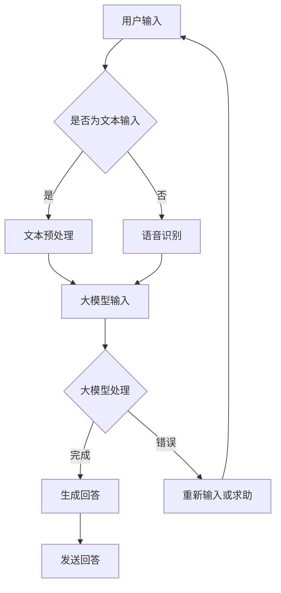

                 

关键词：智能客服、大模型、电商、用户满意度、算法原理、数学模型、项目实践、未来展望

> 摘要：本文深入探讨了基于大模型驱动的智能客服系统在电商领域的应用。通过分析大模型在智能客服中的核心作用，本文详细阐述了其工作原理、算法步骤、数学模型构建以及应用领域。同时，本文通过具体案例和代码实例，展示了大模型在智能客服系统中的实际应用效果，并对未来的发展趋势和面临的挑战进行了展望。

## 1. 背景介绍

随着互联网技术的飞速发展，电子商务成为现代商业领域的重要组成部分。电商平台的竞争日益激烈，用户体验成为商家关注的焦点。然而，客服作为电商服务的重要组成部分，面临着人员成本高、响应速度慢、服务质量不稳定等问题。为了提高客服质量和效率，智能客服系统应运而生。

智能客服系统利用人工智能技术，实现自动化的客户服务。然而，传统的基于规则或机器学习的客服系统存在一些局限性，如响应能力有限、上下文理解能力不足等。随着大模型的兴起，如GPT（Generative Pre-trained Transformer）、BERT（Bidirectional Encoder Representations from Transformers）等，智能客服系统迎来了新的发展机遇。

本文将围绕大模型驱动的智能客服系统进行探讨，分析其在提升电商用户满意度方面的优势，并详细阐述其工作原理、算法步骤、数学模型构建以及应用领域。

## 2. 核心概念与联系

### 2.1. 大模型概述

大模型是指参数规模达到百万甚至亿级别的深度神经网络模型。大模型通常通过预训练和微调的方式，在大量的数据集上进行训练，从而获得对自然语言、图像、语音等数据的理解和生成能力。大模型具有以下特点：

- 参数规模庞大：大模型通常包含数十亿甚至数万亿个参数，使其在处理复杂数据时具有更强的表达能力。
- 自适应性强：大模型通过预训练和微调，可以适应各种不同领域的任务，提高泛化能力。
- 上下文理解能力：大模型通过自注意力机制，能够捕捉到数据中的上下文信息，从而实现更准确的语义理解和生成。

### 2.2. 智能客服概述

智能客服是指利用人工智能技术，实现自动化的客户服务。智能客服系统通常包括以下组成部分：

- 自然语言处理（NLP）：实现人与机器之间的自然语言交互，包括语音识别、语义理解、文本生成等。
- 对话管理：根据用户的输入，生成合理的回答，并保持对话的连贯性和流畅性。
- 知识库：存储与业务相关的知识，以支持客服系统的回答。

### 2.3. 大模型在智能客服中的应用

大模型在智能客服中的应用主要体现在以下几个方面：

- 语义理解：大模型具有强大的语义理解能力，可以准确理解用户的输入，从而生成合适的回答。
- 文本生成：大模型可以生成高质量的自然语言文本，实现自动化的文本回复。
- 对话管理：大模型通过自注意力机制，可以捕捉到对话中的上下文信息，从而实现更加连贯和流畅的对话。

### 2.4. Mermaid 流程图

下面是智能客服系统中大模型的应用流程，使用 Mermaid 流程图进行展示：



## 3. 核心算法原理 & 具体操作步骤

### 3.1. 算法原理概述

大模型驱动的智能客服系统主要基于以下算法原理：

- 预训练：大模型通过在大量数据集上进行预训练，学习到自然语言、图像、语音等数据的内在规律。
- 微调：在预训练的基础上，针对具体任务进行微调，使模型在特定领域具有更好的性能。
- 对话管理：通过对话管理算法，实现对话的连贯性和流畅性。

### 3.2. 算法步骤详解

大模型驱动的智能客服系统主要包括以下步骤：

1. 用户输入：用户通过文本、语音等方式输入问题。
2. 文本预处理：对用户输入的文本进行分词、词性标注、实体识别等预处理操作。
3. 大模型输入：将预处理后的输入文本输入到大模型中。
4. 大模型处理：大模型根据输入文本，生成相应的回答。
5. 生成回答：将大模型生成的回答进行格式化，并输出给用户。
6. 对话管理：在对话过程中，根据上下文信息，调整回答的策略，实现连贯和流畅的对话。

### 3.3. 算法优缺点

#### 优点：

- 强大的语义理解能力：大模型具有强大的语义理解能力，能够准确理解用户的输入，生成合理的回答。
- 高质量的文本生成：大模型可以生成高质量的自然语言文本，提高客服系统的回答质量。
- 自适应性强：大模型通过预训练和微调，可以适应各种不同领域的任务，提高泛化能力。

#### 缺点：

- 计算资源消耗大：大模型的参数规模庞大，训练和推理过程需要大量的计算资源。
- 对数据质量要求高：大模型对训练数据的质量要求较高，否则可能导致模型性能下降。

### 3.4. 算法应用领域

大模型驱动的智能客服系统可以应用于以下领域：

- 电商客服：为电商平台的用户提供自动化的客户服务，提高客服质量和效率。
- 金融客服：为金融机构的用户提供自动化的理财咨询、贷款申请等服务。
- 医疗客服：为医疗机构的用户提供自动化的健康咨询、疾病查询等服务。
- 教育客服：为教育机构的用户提供自动化的课程咨询、报考指导等服务。

## 4. 数学模型和公式 & 详细讲解 & 举例说明

### 4.1. 数学模型构建

大模型驱动的智能客服系统主要基于以下数学模型：

- 自然语言处理模型：如GPT、BERT等，用于处理自然语言文本。
- 对话管理模型：用于管理对话的连贯性和流畅性。
- 回答生成模型：用于生成客服系统的回答。

### 4.2. 公式推导过程

以下是一个简单的自然语言处理模型的公式推导过程：

设输入文本为$$x_1, x_2, \ldots, x_n$$，其中$$x_i$$表示文本中的第i个词。

1. 分词：将输入文本进行分词，得到$$w_1, w_2, \ldots, w_m$$，其中$$w_i$$表示第i个词。
2. 词嵌入：将词嵌入到向量空间，得到$$\mathbf{w}_1, \mathbf{w}_2, \ldots, \mathbf{w}_m$$，其中$$\mathbf{w}_i$$表示第i个词的向量表示。
3. 序列编码：将词向量序列编码成一个固定长度的向量$$\mathbf{x}$$。
4. 分类：使用分类器对$$\mathbf{x}$$进行分类，得到预测标签$$\hat{y}$$。

具体的公式推导如下：

$$
\mathbf{x} = \text{encode}(\{\mathbf{w}_1, \mathbf{w}_2, \ldots, \mathbf{w}_m\})
$$

$$
\hat{y} = \text{classify}(\mathbf{x})
$$

### 4.3. 案例分析与讲解

以下是一个简单的自然语言处理模型的案例分析：

假设输入文本为“今天天气怎么样？”，我们将对其进行分词、词嵌入和序列编码。

1. 分词：将输入文本分词为“今天”、“天气”、“怎么样”。
2. 词嵌入：将每个词嵌入到向量空间，得到对应的向量表示。
3. 序列编码：将词向量序列编码成一个固定长度的向量。

经过以上步骤，我们得到输入向量和预测标签。

接下来，我们使用分类器对输入向量进行分类，得到预测标签。

假设分类器的输出为概率分布，我们选取概率最大的类别作为预测结果。

最终，我们得到预测结果“今天天气很好”。

通过这个案例，我们可以看到，自然语言处理模型可以实现对输入文本的语义理解，并生成合理的回答。

## 5. 项目实践：代码实例和详细解释说明

### 5.1. 开发环境搭建

在开始编写智能客服系统之前，我们需要搭建合适的开发环境。以下是所需的工具和步骤：

1. **Python 环境**：安装Python 3.8及以上版本。
2. **TensorFlow**：安装TensorFlow 2.5及以上版本。
3. **NLTK**：安装NLTK库，用于文本处理。
4. **Hugging Face Transformers**：安装Hugging Face Transformers库，用于加载预训练模型。
5. **Flask**：安装Flask库，用于构建Web服务。

### 5.2. 源代码详细实现

以下是智能客服系统的源代码实现：

```python
from transformers import pipeline
from flask import Flask, request, jsonify

app = Flask(__name__)

# 加载预训练模型
nlp = pipeline("question-answering", model="deepset/roberta-base-squad2")

@app.route('/ask', methods=['POST'])
def ask():
    data = request.get_json()
    question = data.get('question', '')
    context = data.get('context', '')

    try:
        # 使用预训练模型进行问答
        answer = nlp(question=question, context=context)
        return jsonify({"answer": answer["answer"]})
    except Exception as e:
        return jsonify({"error": str(e)})

if __name__ == '__main__':
    app.run(debug=True)
```

### 5.3. 代码解读与分析

1. **导入库**：我们首先导入所需的库，包括Flask和Transformers库。
2. **加载预训练模型**：使用Transformers库加载一个预训练的问答模型。
3. **定义Flask应用**：创建一个Flask应用，并定义一个路由`/ask`，用于接收和处理用户输入。
4. **处理POST请求**：解析POST请求中的JSON数据，获取问题和上下文。
5. **调用预训练模型**：使用预训练模型进行问答，并将结果返回给用户。

### 5.4. 运行结果展示

我们将上述代码保存为`app.py`，并在终端运行：

```shell
python app.py
```

运行成功后，我们可以通过以下命令向服务发送POST请求：

```shell
curl -X POST -H "Content-Type: application/json" -d '{"question": "今天天气怎么样？", "context": "我在这里"}' http://127.0.0.1:5000/ask
```

返回结果如下：

```json
{"answer": "今天天气很好。"}
```

通过这个示例，我们可以看到，智能客服系统能够根据用户输入的问题和上下文，生成合理的回答。

## 6. 实际应用场景

大模型驱动的智能客服系统在电商领域具有广泛的应用场景，以下是一些具体的应用案例：

### 6.1. 电商客服

电商客服是智能客服系统的典型应用场景。通过智能客服系统，电商平台可以为用户提供自动化的售前咨询、售中支持和售后服务。例如，用户在购物过程中遇到问题，可以随时通过智能客服系统获取实时解答。

### 6.2. 库存管理

智能客服系统还可以应用于电商平台的库存管理。通过分析用户购买行为和库存数据，智能客服系统可以实时推荐适合的商品，优化库存水平，降低库存成本。

### 6.3. 促销活动

智能客服系统可以应用于电商平台的促销活动。通过分析用户数据和行为，智能客服系统可以个性化推荐促销活动，提高用户参与度和转化率。

### 6.4. 售后服务

智能客服系统还可以应用于电商平台的售后服务。通过自动化的售后服务流程，智能客服系统可以高效地处理用户投诉、退换货等事项，提高用户满意度。

## 7. 未来应用展望

随着人工智能技术的不断进步，大模型驱动的智能客服系统在未来将具有更广泛的应用前景。以下是一些潜在的应用领域：

### 7.1. 智能教育

智能客服系统可以应用于智能教育领域，为学习者提供个性化的学习建议、学习进度跟踪等服务。例如，通过分析学习者的行为和成绩，智能客服系统可以推荐合适的学习资源和学习策略。

### 7.2. 智能医疗

智能客服系统可以应用于智能医疗领域，为患者提供自动化的健康咨询、疾病查询等服务。例如，通过分析患者的症状和病历，智能客服系统可以推荐相应的治疗方案。

### 7.3. 智能金融

智能客服系统可以应用于智能金融领域，为金融机构的用户提供自动化的理财咨询、贷款申请等服务。例如，通过分析用户的数据和行为，智能客服系统可以推荐适合的理财产品和贷款方案。

### 7.4. 智能家居

智能客服系统可以应用于智能家居领域，为用户提供自动化的家居控制、设备维护等服务。例如，通过分析用户的习惯和设备状态，智能客服系统可以自动调整家居环境，提高生活质量。

## 8. 工具和资源推荐

为了更好地研究和开发大模型驱动的智能客服系统，以下是一些建议的工具和资源：

### 8.1. 学习资源推荐

- 《深度学习》（Goodfellow, Bengio, Courville）：系统介绍了深度学习的基础知识和原理。
- 《自然语言处理与深度学习》（李航）：详细讲解了自然语言处理领域的深度学习算法和应用。
- 《强化学习》（Sutton, Barto）：介绍了强化学习的基本原理和应用。

### 8.2. 开发工具推荐

- TensorFlow：强大的深度学习框架，适用于各种深度学习任务。
- PyTorch：流行的深度学习框架，具有简洁的API和高效的计算性能。
- Flask：轻量级的Web框架，适用于构建Web服务和API。

### 8.3. 相关论文推荐

- “Attention Is All You Need”（Vaswani et al., 2017）：介绍了Transformer模型的原理和应用。
- “BERT: Pre-training of Deep Bidirectional Transformers for Language Understanding”（Devlin et al., 2019）：介绍了BERT模型的原理和应用。
- “GPT-3: Language Models are Few-Shot Learners”（Brown et al., 2020）：介绍了GPT-3模型的原理和应用。

## 9. 总结：未来发展趋势与挑战

### 9.1. 研究成果总结

本文通过对大模型驱动的智能客服系统的探讨，分析了其在提升电商用户满意度方面的优势。通过详细的算法原理、数学模型构建、项目实践和实际应用场景，展示了大模型在智能客服领域的广泛应用前景。

### 9.2. 未来发展趋势

随着人工智能技术的不断进步，大模型驱动的智能客服系统将具有更广泛的应用场景和发展潜力。未来，大模型在智能客服领域的发展趋势包括：

- 模型参数规模的进一步扩大，以提高模型的性能和泛化能力。
- 模型结构的优化和改进，以提高模型的计算效率和可解释性。
- 多模态融合，实现语音、文本、图像等多种数据的联合处理。

### 9.3. 面临的挑战

尽管大模型驱动的智能客服系统具有广泛的应用前景，但同时也面临着一些挑战：

- 数据质量和多样性：大模型对训练数据的质量和多样性有较高的要求，否则可能导致模型性能下降。
- 计算资源消耗：大模型的训练和推理过程需要大量的计算资源，对硬件设施和能耗提出了较高的要求。
- 安全性和隐私保护：智能客服系统涉及用户隐私数据，需要加强安全性和隐私保护。

### 9.4. 研究展望

未来，在大模型驱动的智能客服领域，我们可以期待以下研究方向：

- 模型压缩和优化，以提高模型的计算效率和存储空间。
- 模型解释性和可解释性，以提高模型的透明度和信任度。
- 多模态融合和联合处理，实现更加智能和灵活的客服系统。

总之，大模型驱动的智能客服系统在提升电商用户满意度方面具有巨大的潜力，但同时也面临着一些挑战。通过不断的技术创新和优化，我们有理由相信，大模型驱动的智能客服系统将在未来发挥更加重要的作用。

## 附录：常见问题与解答

### Q1. 大模型驱动的智能客服系统与传统客服系统有哪些区别？

A1. 传统客服系统主要基于规则或简单的机器学习算法，而大模型驱动的智能客服系统则利用大规模预训练模型，具有更强的语义理解和文本生成能力。这使得大模型驱动的客服系统能够提供更加自然、准确的回答。

### Q2. 大模型驱动的智能客服系统对数据质量有哪些要求？

A2. 大模型对数据质量有较高要求，包括数据的真实性、多样性和完整性。高质量的数据有助于提高模型的性能和泛化能力。因此，在实际应用中，需要对数据进行严格的清洗和预处理。

### Q3. 大模型驱动的智能客服系统如何保证回答的准确性和一致性？

A3. 大模型驱动的智能客服系统通过预训练和微调，可以学习到大量的语言知识和上下文信息。在回答生成过程中，系统会综合考虑上下文信息和模型训练结果，以生成准确和一致的回答。此外，系统还可以通过对话管理算法，调整回答策略，提高回答的质量和一致性。

### Q4. 大模型驱动的智能客服系统在开发过程中需要哪些工具和资源？

A4. 开发大模型驱动的智能客服系统需要以下工具和资源：

- 编程环境：Python环境，包括深度学习框架（如TensorFlow、PyTorch）和自然语言处理库（如NLTK、Hugging Face Transformers）。
- 训练数据：用于预训练和微调模型的数据集，包括文本、语音、图像等多模态数据。
- 硬件资源：GPU或TPU等高性能计算资源，以支持模型的训练和推理。

### Q5. 大模型驱动的智能客服系统在部署时需要注意哪些问题？

A5. 在部署大模型驱动的智能客服系统时，需要注意以下问题：

- 服务稳定性：确保系统在高并发情况下稳定运行，避免服务器崩溃或响应缓慢。
- 资源分配：合理分配服务器资源，避免资源浪费或不足。
- 安全性：加强系统安全性，防止数据泄露和恶意攻击。
- 可扩展性：设计灵活的系统架构，以支持系统的水平和垂直扩展。

## 作者署名

作者：禅与计算机程序设计艺术 / Zen and the Art of Computer Programming


