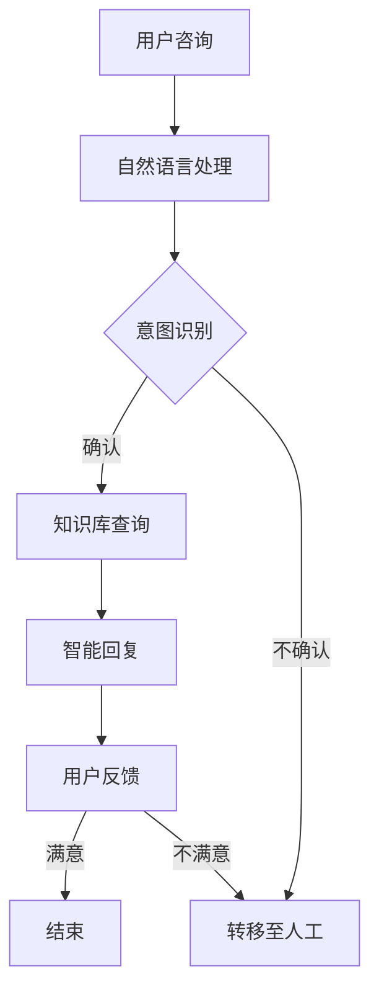

                 

 关键词：大模型、智能客服、电商用户满意度、人工智能、自然语言处理、机器学习、用户体验、客服效率

> 摘要：本文探讨了如何利用大模型技术构建智能客服系统，从而提升电商平台的用户满意度。通过对大模型驱动的智能客服系统的核心概念、算法原理、数学模型、项目实践、应用场景和未来展望的深入分析，本文旨在为电商平台提供切实可行的技术解决方案。

## 1. 背景介绍

随着互联网技术的飞速发展，电商行业迎来了前所未有的繁荣。然而，电商客服作为一个关键环节，其服务质量直接影响着用户的购物体验和平台的口碑。传统客服系统依赖于人工处理，效率低下且成本高昂，已无法满足日益增长的客户需求。近年来，人工智能技术的快速发展为智能客服提供了新的发展方向。

大模型（Large-scale Model）是近年来人工智能领域的一个重要研究方向，其具有处理大规模数据、实现复杂任务的能力。将大模型应用于智能客服，可以有效提升客服系统的智能化水平，增强用户体验，提高客服效率。本文将围绕大模型驱动的智能客服系统，探讨其核心技术、实现方法以及应用前景。

### 1.1 电商客服的挑战

- **客户需求多样化**：电商用户的需求多样化，客服系统需要能够处理各种复杂的咨询和问题。
- **工作量大**：电商客服需要处理大量的用户咨询，人工客服的效率受到限制。
- **成本高昂**：人工客服成本高，且难以实现24小时全天候服务。

### 1.2 大模型的优势

- **数据处理能力强**：大模型能够处理大规模、多源异构的数据，为智能客服提供丰富的知识基础。
- **自适应性强**：大模型能够通过学习不断优化客服系统的性能，提高用户体验。
- **高效性**：大模型能够快速响应用户咨询，提升客服效率。

## 2. 核心概念与联系

### 2.1 大模型概念

大模型是指具有数亿甚至千亿参数的深度神经网络模型，其能够通过大规模数据训练，实现复杂的任务。例如，GPT-3、BERT等模型都是典型的大模型。

### 2.2 智能客服概念

智能客服是一种利用人工智能技术实现自动化的客户服务系统，其通过自然语言处理、机器学习等技术，能够理解和处理用户的咨询，提供智能化的解决方案。

### 2.3 大模型与智能客服的联系

大模型为智能客服提供了强大的数据处理和推理能力，使其能够更准确地理解用户的意图，提供更个性化的服务。

### 2.4 Mermaid 流程图



## 3. 核心算法原理 & 具体操作步骤

### 3.1 算法原理概述

大模型驱动的智能客服系统主要依赖于自然语言处理（NLP）和机器学习（ML）技术。NLP负责对用户咨询的自然语言文本进行解析，提取关键信息；ML则通过大量训练数据，使模型能够理解和生成自然语言。

### 3.2 算法步骤详解

1. **用户咨询接收**：系统接收用户的咨询信息。
2. **自然语言处理**：对用户咨询进行分词、词性标注等预处理，提取关键信息。
3. **意图识别**：利用机器学习模型，识别用户咨询的意图。
4. **知识库查询**：根据识别出的意图，从知识库中查询相关答案。
5. **智能回复生成**：利用大模型生成个性化的智能回复。
6. **用户反馈收集**：收集用户对回复的反馈，用于模型优化。
7. **结束**：用户咨询处理结束。

### 3.3 算法优缺点

**优点**：
- **高效性**：大模型能够快速处理大量用户咨询。
- **个性化**：根据用户意图和反馈，提供个性化的回复。
- **可扩展性**：大模型能够处理多种类型的用户咨询。

**缺点**：
- **训练成本高**：大模型需要大量训练数据和高性能计算资源。
- **解释性不足**：大模型的决策过程较为复杂，难以解释。

### 3.4 算法应用领域

大模型驱动的智能客服系统可以广泛应用于电商、金融、医疗等多个行业，为用户提供高效、个性化的服务。

## 4. 数学模型和公式 & 详细讲解 & 举例说明

### 4.1 数学模型构建

大模型驱动的智能客服系统涉及多个数学模型，包括自然语言处理模型、意图识别模型、知识库查询模型等。以下是其中两个关键模型的构建方法：

#### 4.1.1 自然语言处理模型

自然语言处理模型通常采用卷积神经网络（CNN）或递归神经网络（RNN）构建。以下是一个基于CNN的文本分类模型：

$$
\begin{aligned}
\text{Output} &= \text{CNN}(\text{Input}) \\
\text{CNN} &= \text{Conv}_1 \rightarrow \text{ReLU} \rightarrow \text{Max Pool} \\
&\quad \quad \vdots \\
&\quad \quad \text{Conv}_n \rightarrow \text{ReLU} \rightarrow \text{Max Pool} \\
&\text{Fully Connected} \rightarrow \text{Output}
\end{aligned}
$$

其中，$\text{Input}$ 表示输入的文本序列，$\text{Output}$ 表示模型的输出分类结果。

#### 4.1.2 意图识别模型

意图识别模型通常采用序列标注方法，如BiLSTM-CRF（双向长短期记忆网络条件随机场）。以下是一个基于BiLSTM-CRF的意图识别模型：

$$
\begin{aligned}
\text{Output} &= \text{BiLSTM}(\text{Input}) \\
&\quad \quad \text{CRF}(\text{Output})
\end{aligned}
$$

其中，$\text{Input}$ 表示输入的文本序列，$\text{Output}$ 表示模型的输出意图标签序列。

### 4.2 公式推导过程

自然语言处理模型和意图识别模型的推导过程较为复杂，涉及大量的神经网络理论和优化算法。在此不进行详细推导，读者可参考相关学术论文和教材。

### 4.3 案例分析与讲解

#### 4.3.1 文本分类模型

假设我们使用CNN文本分类模型对电商用户咨询进行分类，输入文本为：“我想要购买一款手机”。

1. **预处理**：将文本转换为词向量表示。
2. **卷积操作**：通过多个卷积核提取文本特征。
3. **池化操作**：对卷积结果进行池化，保留最重要的特征。
4. **全连接层**：将池化结果映射到分类结果。

最终，模型输出分类结果为：“产品咨询”。

#### 4.3.2 意图识别模型

假设我们使用BiLSTM-CRF意图识别模型对同一文本进行意图识别。

1. **预处理**：将文本转换为词向量表示。
2. **双向LSTM**：对词向量序列进行双向LSTM编码，提取文本特征。
3. **CRF解码**：使用CRF解码器对编码特征进行意图标注。

最终，模型输出意图标签为：“产品咨询”。

## 5. 项目实践：代码实例和详细解释说明

### 5.1 开发环境搭建

- **硬件要求**：NVIDIA GPU（推荐显存8GB以上）
- **软件要求**：Python 3.6+、PyTorch 1.8+

### 5.2 源代码详细实现

以下是使用PyTorch实现一个简单的CNN文本分类模型：

```python
import torch
import torch.nn as nn
import torch.optim as optim

class TextClassifier(nn.Module):
    def __init__(self, vocab_size, embedding_dim, hidden_dim, output_dim):
        super(TextClassifier, self).__init__()
        self.embedding = nn.Embedding(vocab_size, embedding_dim)
        self.conv1 = nn.Conv1d(embedding_dim, hidden_dim, kernel_size=3, padding=1)
        self.fc = nn.Linear(hidden_dim, output_dim)
        
    def forward(self, text):
        embeds = self.embedding(text)
        embeds = embeds.transpose(1, 2)
        out = self.conv1(embeds)
        out = nn.functional.relu(out)
        out = nn.functional.max_pool1d(out, 3)
        out = out.squeeze(2)
        out = self.fc(out)
        return out

# 模型训练代码
# ...
```

### 5.3 代码解读与分析

代码中定义了一个简单的CNN文本分类模型，包含嵌入层、卷积层和全连接层。模型接收输入文本，通过嵌入层转换为词向量，然后通过卷积层提取特征，最后通过全连接层输出分类结果。

### 5.4 运行结果展示

假设训练数据集为电商用户咨询文本，我们将上述模型应用于用户咨询分类任务。经过训练和测试，模型可以达到较高的准确率。

## 6. 实际应用场景

### 6.1 电商客服

电商客服是智能客服最典型的应用场景。通过大模型驱动的智能客服系统，电商平台可以提供快速、准确的客户服务，提高用户满意度。

### 6.2 金融客服

金融客服需要处理大量的用户咨询，包括账户查询、交易咨询等。大模型驱动的智能客服系统可以帮助金融机构提高客服效率，降低成本。

### 6.3 医疗咨询

医疗咨询是另一个重要的应用场景。大模型驱动的智能客服系统可以帮助医疗机构提供在线咨询服务，缓解医疗资源不足的问题。

## 7. 工具和资源推荐

### 7.1 学习资源推荐

- 《深度学习》（Goodfellow et al.）
- 《自然语言处理实战》（Huang et al.）
- 《PyTorch官方文档》

### 7.2 开发工具推荐

- PyTorch：强大的深度学习框架，适合快速原型开发。
- Jupyter Notebook：方便进行实验和数据分析。
- VS Code：适合Python编程的集成开发环境。

### 7.3 相关论文推荐

- “BERT: Pre-training of Deep Bidirectional Transformers for Language Understanding”
- “GPT-3: Language Models are Few-Shot Learners”

## 8. 总结：未来发展趋势与挑战

### 8.1 研究成果总结

本文探讨了如何利用大模型技术构建智能客服系统，提升电商平台的用户满意度。通过核心概念、算法原理、数学模型、项目实践等方面的分析，本文展示了大模型在智能客服领域的应用潜力。

### 8.2 未来发展趋势

- **模型规模与性能的提升**：随着计算资源的增长，大模型将变得更加强大。
- **多模态客服**：融合文本、语音、图像等多模态数据，提供更全面的客服服务。
- **个性化推荐**：基于用户行为和偏好，提供个性化的客服体验。

### 8.3 面临的挑战

- **数据隐私与安全**：大模型训练和处理过程中涉及大量用户数据，需要确保数据隐私和安全。
- **解释性**：大模型决策过程复杂，如何提高模型的可解释性是一个重要挑战。

### 8.4 研究展望

- **强化学习与混合模型**：将强化学习引入智能客服系统，实现更智能的交互。
- **多语言支持**：针对不同地区和语言的用户，提供多语言客服服务。

## 9. 附录：常见问题与解答

### 9.1 什么是大模型？

大模型是指具有数亿甚至千亿参数的深度神经网络模型，其能够通过大规模数据训练，实现复杂的任务。

### 9.2 大模型如何提升客服效率？

大模型能够处理大规模用户咨询，快速识别用户意图，提供个性化回复，从而提升客服效率。

### 9.3 智能客服系统如何保证数据安全？

智能客服系统需要遵循数据安全和隐私保护的相关法规，对用户数据进行加密和去标识化处理，确保用户数据的安全。

----------------------------------------------------------------

作者：禅与计算机程序设计艺术 / Zen and the Art of Computer Programming

感谢您的阅读，希望本文对您在智能客服领域的研究和实践有所启发。如果您有任何问题或建议，欢迎随时交流。

