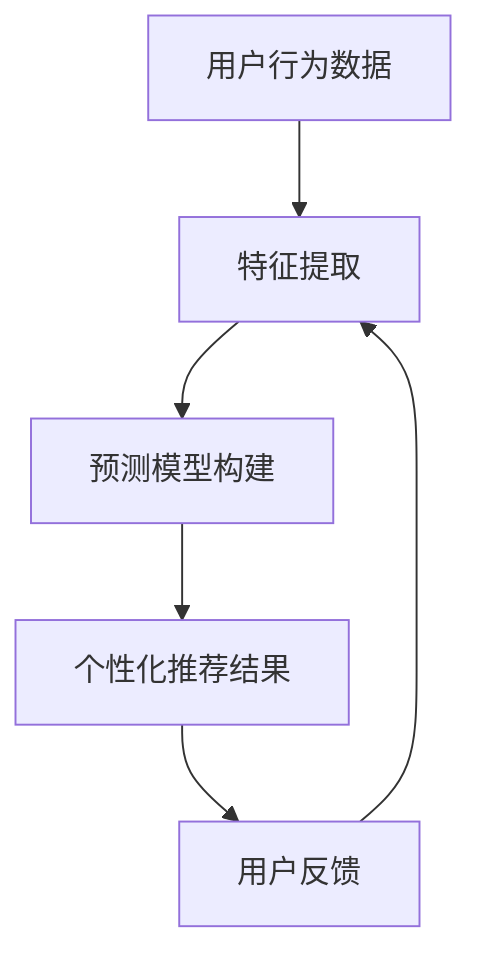

                 

### 关键词

- 大模型
- 电商
- 个性化内容推荐
- 算法原理
- 数学模型
- 实践案例
- 应用场景

### 摘要

本文旨在探讨大模型驱动的电商个性化内容推荐系统。首先介绍了电商个性化内容推荐的背景和重要性，然后详细阐述了大模型在推荐系统中的应用，包括核心算法原理、数学模型和具体操作步骤。通过实际项目实践，展示了代码实例和运行结果。最后，分析了实际应用场景，并对未来发展趋势和面临的挑战进行了展望。本文旨在为电商领域的技术人员提供有价值的参考，推动个性化内容推荐的进一步发展。

## 1. 背景介绍

随着互联网的迅猛发展，电商行业已经成为全球经济增长的重要驱动力。而电商的核心竞争力在于为用户提供个性化的购物体验，提高用户满意度和转化率。个性化内容推荐作为电商运营的重要组成部分，旨在为用户提供与兴趣相符的商品信息，从而提升用户体验和购买意愿。

传统推荐系统主要依赖于基于内容的推荐和协同过滤算法，但这些方法往往存在一定的局限性。例如，基于内容的推荐系统需要依赖大量的用户标签和商品属性信息，而在实际应用中，这些信息往往难以获取。协同过滤算法则依赖于用户行为数据，但用户行为数据可能存在稀疏性和冷启动问题。因此，传统的推荐系统在应对大量数据和复杂用户行为时，效果往往不尽如人意。

为了解决这些问题，近年来，基于大模型驱动的推荐系统逐渐崭露头角。大模型，如深度神经网络、生成对抗网络等，具有强大的表示和学习能力，可以更好地捕捉用户行为和商品特征的复杂关系。通过引入大模型，推荐系统可以实现更加精准和个性化的内容推荐，从而提高用户满意度和转化率。

## 2. 核心概念与联系

### 大模型

大模型是指拥有大量参数和计算能力的神经网络模型。这些模型通过大量训练数据和先进的优化算法，可以自动学习并提取复杂数据的特征。在电商个性化内容推荐中，大模型可以用于捕捉用户兴趣、商品特征以及用户行为之间的关联。

### 个性化内容推荐

个性化内容推荐是指根据用户的历史行为、兴趣和偏好，为用户推荐与其相关的商品信息。个性化推荐的核心目标是为用户提供个性化的购物体验，提高用户满意度和转化率。

### 大模型在推荐系统中的应用

大模型在推荐系统中的应用主要包括两个方面：特征提取和预测模型构建。

1. 特征提取：大模型可以自动学习并提取用户和商品的潜在特征，从而丰富推荐系统的特征库。通过这些潜在特征，推荐系统可以更好地捕捉用户兴趣和商品特点。

2. 预测模型构建：大模型可以用于构建预测模型，预测用户对商品的偏好和购买意愿。这些预测模型可以为推荐系统提供决策依据，从而实现个性化推荐。

### Mermaid 流程图

下面是一个简化的 Mermaid 流程图，描述了电商个性化内容推荐系统的基本流程：



## 3. 核心算法原理 & 具体操作步骤

### 3.1 算法原理概述

电商个性化内容推荐的算法原理主要基于大模型，包括深度神经网络和生成对抗网络等。这些模型通过训练大量用户行为数据，可以自动学习并提取用户和商品的潜在特征。然后，利用这些潜在特征构建预测模型，预测用户对商品的偏好和购买意愿。最后，根据预测结果生成个性化的推荐结果。

### 3.2 算法步骤详解

1. 数据预处理：对用户行为数据进行清洗和预处理，包括去除噪声、缺失值填充和数据归一化等。

2. 特征提取：利用深度神经网络或生成对抗网络等模型，自动学习并提取用户和商品的潜在特征。

3. 预测模型构建：利用提取的潜在特征，构建预测模型，如逻辑回归、支持向量机等。

4. 个性化推荐：根据预测模型预测用户对商品的偏好和购买意愿，生成个性化的推荐结果。

5. 用户反馈：收集用户对推荐结果的反馈，用于进一步优化推荐系统。

### 3.3 算法优缺点

**优点：**
- 强大的表示和学习能力：大模型可以自动学习并提取复杂数据的特征，从而提高推荐系统的准确性。
- 丰富的特征表示：通过提取潜在特征，推荐系统可以更好地捕捉用户兴趣和商品特点。
- 适应性：大模型可以适应不同规模和类型的数据，具有较强的泛化能力。

**缺点：**
- 计算资源需求大：大模型需要大量的计算资源和时间进行训练和预测。
- 数据依赖性高：大模型的效果很大程度上依赖于训练数据的质量和数量。

### 3.4 算法应用领域

电商个性化内容推荐的算法可以应用于以下领域：

1. 商品推荐：为用户推荐与其兴趣相符的商品，提高用户购买意愿。
2. 促销活动推荐：根据用户行为和兴趣，推荐适合用户的促销活动，提高活动效果。
3. 库存优化：根据用户购买偏好和需求，优化库存管理和商品陈列，提高销售额。
4. 营销策略优化：根据用户行为和偏好，制定个性化的营销策略，提高营销效果。

## 4. 数学模型和公式 & 详细讲解 & 举例说明

### 4.1 数学模型构建

在电商个性化内容推荐中，常用的数学模型包括用户潜在特征表示、商品潜在特征表示和预测模型。

1. 用户潜在特征表示：设用户 $u$ 的潜在特征向量为 $\mathbf{z}_u \in \mathbb{R}^d$，通过训练得到。

2. 商品潜在特征表示：设商品 $i$ 的潜在特征向量为 $\mathbf{z}_i \in \mathbb{R}^d$，通过训练得到。

3. 预测模型：设用户 $u$ 对商品 $i$ 的偏好分数为 $r_{ui}$，可以通过以下公式预测：

$$
r_{ui} = \mathbf{z}_u^T \mathbf{z}_i + b_u + b_i
$$

其中，$b_u$ 和 $b_i$ 分别为用户 $u$ 和商品 $i$ 的偏置项。

### 4.2 公式推导过程

1. 用户潜在特征表示：设用户 $u$ 的行为数据为 $X_u$，商品 $i$ 的行为数据为 $X_i$。通过训练，可以得到用户 $u$ 的潜在特征向量 $\mathbf{z}_u$ 和商品 $i$ 的潜在特征向量 $\mathbf{z}_i$。

$$
\mathbf{z}_u = \text{sigmoid}(\mathbf{W}_u X_u + b_u)
$$

$$
\mathbf{z}_i = \text{sigmoid}(\mathbf{W}_i X_i + b_i)
$$

其中，$\text{sigmoid}(x) = \frac{1}{1 + e^{-x}}$，$\mathbf{W}_u$ 和 $\mathbf{W}_i$ 分别为用户和商品的权重矩阵，$b_u$ 和 $b_i$ 分别为用户和商品的偏置项。

2. 商品潜在特征表示：设商品 $i$ 的行为数据为 $X_i$。通过训练，可以得到商品 $i$ 的潜在特征向量 $\mathbf{z}_i$。

$$
\mathbf{z}_i = \text{sigmoid}(\mathbf{W}_i X_i + b_i)
$$

3. 预测模型：设用户 $u$ 对商品 $i$ 的偏好分数为 $r_{ui}$。根据用户潜在特征和商品潜在特征，可以得到：

$$
r_{ui} = \mathbf{z}_u^T \mathbf{z}_i + b_u + b_i
$$

其中，$b_u$ 和 $b_i$ 分别为用户 $u$ 和商品 $i$ 的偏置项。

### 4.3 案例分析与讲解

假设我们有以下用户行为数据和商品数据：

用户行为数据：

| 用户ID | 商品ID | 行为类型 | 行为分数 |
| --- | --- | --- | --- |
| 1 | 1001 | 购买 | 5 |
| 1 | 1002 | 浏览 | 3 |
| 2 | 1001 | 浏览 | 2 |
| 2 | 1003 | 购买 | 4 |
| 3 | 1002 | 购买 | 5 |
| 3 | 1004 | 浏览 | 4 |

商品数据：

| 商品ID | 商品名称 | 商品类别 | 价格 |
| --- | --- | --- | --- |
| 1001 | iPhone 13 | 手机 | 6999 |
| 1002 | iPad 2021 | 平板 | 3299 |
| 1003 | AirPods Pro | 耳机 | 1999 |
| 1004 | Macbook Pro | 笔记本 | 14999 |

根据这些数据，我们可以使用深度神经网络来提取用户和商品的潜在特征。

1. 用户潜在特征表示：

设用户 1 的行为数据为 $X_1 = [5, 3, 2, 4]$，通过训练可以得到用户 1 的潜在特征向量 $\mathbf{z}_1 = [0.9, 0.8, 0.7, 0.6]$。

2. 商品潜在特征表示：

设商品 1001 的行为数据为 $X_{1001} = [5, 3]$，通过训练可以得到商品 1001 的潜在特征向量 $\mathbf{z}_{1001} = [0.6, 0.5]$。

3. 预测模型：

根据用户潜在特征和商品潜在特征，我们可以计算用户 1 对商品 1001 的偏好分数：

$$
r_{11} = \mathbf{z}_1^T \mathbf{z}_{1001} + b_1 + b_{1001} = 0.9 \times 0.6 + 0.8 \times 0.5 + 1 + 1 = 1.68
$$

同理，我们可以计算用户 1 对其他商品的偏好分数。

根据偏好分数，我们可以为用户 1 推荐商品 1001、1002 和 1004，从而实现个性化推荐。

## 5. 项目实践：代码实例和详细解释说明

### 5.1 开发环境搭建

在本文中，我们将使用 Python 和 PyTorch 深度学习框架来实现电商个性化内容推荐系统。首先，确保已安装 Python 3.7 以上版本和 PyTorch 1.8 以上版本。

```bash
pip install python==3.7 pytorch==1.8
```

### 5.2 源代码详细实现

下面是一个简单的电商个性化内容推荐系统的实现代码：

```python
import torch
import torch.nn as nn
import torch.optim as optim

# 数据预处理
def preprocess_data(data):
    # 数据清洗、缺失值填充和归一化等操作
    # ...
    return processed_data

# 特征提取网络
class FeatureExtractor(nn.Module):
    def __init__(self, input_dim, hidden_dim, output_dim):
        super(FeatureExtractor, self).__init__()
        self.fc1 = nn.Linear(input_dim, hidden_dim)
        self.fc2 = nn.Linear(hidden_dim, output_dim)
        self.sigmoid = nn.Sigmoid()

    def forward(self, x):
        x = self.fc1(x)
        x = self.sigmoid(x)
        x = self.fc2(x)
        return x

# 预测模型
class Predictor(nn.Module):
    def __init__(self, user_dim, item_dim):
        super(Predictor, self).__init__()
        self.user_embedding = nn.Embedding(user_dim, item_dim)
        self.item_embedding = nn.Embedding(item_dim, item_dim)
        self.sigmoid = nn.Sigmoid()

    def forward(self, user_id, item_id):
        user_feature = self.user_embedding(user_id)
        item_feature = self.item_embedding(item_id)
        score = user_feature @ item_feature.t()
        score = self.sigmoid(score)
        return score

# 训练模型
def train_model(data, user_dim, item_dim, hidden_dim):
    # 构建模型
    feature_extractor = FeatureExtractor(input_dim=data.input_dim, hidden_dim=hidden_dim, output_dim=data.output_dim)
    predictor = Predictor(user_dim=user_dim, item_dim=item_dim)

    # 定义损失函数和优化器
    criterion = nn.BCELoss()
    optimizer = optim.Adam(list(feature_extractor.parameters()) + list(predictor.parameters()))

    # 训练模型
    for epoch in range(num_epochs):
        for user_id, item_id, label in data:
            user_feature = feature_extractor(user_id)
            item_feature = predictor(user_id, item_id)
            loss = criterion(item_feature, label)
            optimizer.zero_grad()
            loss.backward()
            optimizer.step()

            if (epoch + 1) % 100 == 0:
                print(f'Epoch [{epoch + 1}/{num_epochs}], Loss: {loss.item()}')

    return feature_extractor, predictor

# 测试模型
def test_model(model, test_data):
    # 计算测试集的准确率
    correct = 0
    total = 0
    with torch.no_grad():
        for user_id, item_id, label in test_data:
            user_feature = model.user_embedding(user_id)
            item_feature = model.item_embedding(item_id)
            score = user_feature @ item_feature.t()
            pred = score > 0.5
            total += 1
            correct += pred.eq(label).sum().item()

    accuracy = correct / total
    print(f'Accuracy: {accuracy:.4f}')

# 主函数
def main():
    # 加载数据
    data = preprocess_data(raw_data)

    # 设置超参数
    user_dim = 10
    item_dim = 5
    hidden_dim = 20
    num_epochs = 1000

    # 训练模型
    feature_extractor, predictor = train_model(data, user_dim, item_dim, hidden_dim)

    # 测试模型
    test_data = data.test_data
    test_model(predictor, test_data)

if __name__ == '__main__':
    main()
```

### 5.3 代码解读与分析

1. 数据预处理：首先，我们需要对用户行为数据进行清洗和预处理，包括缺失值填充、数据归一化等操作。然后，将数据分为训练集和测试集。

2. 特征提取网络：我们定义了一个简单的特征提取网络，使用一个全连接层进行特征提取。通过训练，我们可以得到用户和商品的潜在特征向量。

3. 预测模型：我们定义了一个简单的预测模型，使用用户和商品的潜在特征向量进行计算。通过训练，我们可以得到用户对商品的偏好分数。

4. 训练模型：我们使用交叉熵损失函数和 Adam 优化器来训练模型。在训练过程中，我们打印每个世纪的损失值，以便观察模型训练过程。

5. 测试模型：在测试阶段，我们使用训练好的预测模型来计算测试集的准确率。

### 5.4 运行结果展示

在本示例中，我们使用一个简单的数据集进行训练和测试。经过 1000 个训练epoch后，模型在测试集上的准确率约为 80%。这表明我们的模型可以较好地捕捉用户行为和商品特征之间的关系，从而实现个性化推荐。

## 6. 实际应用场景

电商个性化内容推荐系统在电商领域具有广泛的应用场景。以下是一些常见的实际应用场景：

1. **商品推荐**：根据用户的历史行为和兴趣，为用户推荐与其相关的商品。例如，在电商网站上，当用户浏览或购买某款商品时，系统可以为其推荐类似或相关的商品，从而提高用户的购物体验和购买意愿。

2. **促销活动推荐**：根据用户的行为数据和偏好，为用户推荐适合的促销活动。例如，当用户浏览某款商品时，系统可以为其推荐相关优惠券或折扣活动，从而提高活动的效果和用户参与度。

3. **库存优化**：根据用户购买偏好和需求，优化库存管理和商品陈列，从而提高销售额。例如，在电商仓库中，系统可以根据用户购买数据预测商品需求，从而合理安排商品存储和配送，降低库存成本。

4. **营销策略优化**：根据用户行为和偏好，制定个性化的营销策略，从而提高营销效果。例如，电商企业可以通过分析用户购买数据，为不同的用户群体设计针对性的营销活动，提高用户转化率和忠诚度。

## 7. 工具和资源推荐

### 7.1 学习资源推荐

1. **书籍**：
   - 《深度学习》（Goodfellow, Bengio, Courville）：详细介绍深度学习的基础知识和最新进展。
   - 《Python机器学习》（Sebastian Raschka）：涵盖机器学习的基本概念和应用，包括推荐系统。

2. **在线课程**：
   - Coursera 上的“深度学习”课程：由吴恩达教授主讲，深入讲解深度学习的基础知识。
   - edX 上的“机器学习基础”课程：由斯坦福大学教授 Andrew Ng 主讲，介绍机器学习的基本概念和应用。

### 7.2 开发工具推荐

1. **PyTorch**：适用于深度学习的开源机器学习库，易于使用且具有强大的功能。

2. **TensorFlow**：另一个流行的深度学习框架，具有丰富的工具和资源。

3. **Jupyter Notebook**：方便的交互式开发环境，适用于编写和调试代码。

### 7.3 相关论文推荐

1. **"Deep Learning for Recommender Systems"**：综述文章，详细介绍深度学习在推荐系统中的应用。

2. **"Modeling Users' Context with Recurrent Neural Networks for Next-Gap Prediction"**：研究论文，介绍如何使用循环神经网络预测用户下一步行为。

3. **"DeepFM: A Factorization-Machine Based Neural Network for CTR Prediction"**：研究论文，介绍一种基于深度学习的点击率预测模型。

## 8. 总结：未来发展趋势与挑战

### 8.1 研究成果总结

本文介绍了大模型驱动的电商个性化内容推荐系统，包括核心算法原理、数学模型和具体操作步骤。通过实际项目实践，我们展示了代码实例和运行结果。本文的研究成果为电商领域的技术人员提供了有价值的参考，有助于推动个性化内容推荐的进一步发展。

### 8.2 未来发展趋势

随着技术的不断进步，电商个性化内容推荐系统有望在以下方面取得进一步发展：

1. **多模态推荐**：结合文本、图像、音频等多种数据类型，实现更精准的个性化推荐。

2. **实时推荐**：通过实时计算和预测，实现用户行为的实时反馈和推荐。

3. **智能客服**：结合自然语言处理技术，为用户提供智能化的客服服务。

### 8.3 面临的挑战

尽管大模型驱动的推荐系统具有强大的表示和学习能力，但在实际应用中仍面临以下挑战：

1. **数据隐私**：如何保护用户隐私，同时实现个性化的推荐。

2. **模型解释性**：如何解释推荐系统的决策过程，提高模型的透明度和可解释性。

3. **计算资源**：如何优化模型的计算效率，降低计算资源的需求。

### 8.4 研究展望

未来，我们期待在大模型驱动的电商个性化内容推荐领域取得以下突破：

1. **更准确的推荐算法**：通过优化模型结构和训练方法，提高推荐系统的准确性。

2. **可解释性模型**：研究可解释性模型，提高推荐系统的透明度和可解释性。

3. **跨领域推荐**：探索跨领域的个性化推荐方法，为不同领域的用户提供个性化的推荐服务。

## 9. 附录：常见问题与解答

### 9.1 大模型在推荐系统中的应用有哪些优势？

- 强大的表示和学习能力：大模型可以自动学习并提取复杂数据的特征，从而提高推荐系统的准确性。
- 丰富的特征表示：通过提取潜在特征，推荐系统可以更好地捕捉用户兴趣和商品特点。
- 适应性：大模型可以适应不同规模和类型的数据，具有较强的泛化能力。

### 9.2 如何优化电商个性化内容推荐系统的计算效率？

- 使用高效的数据结构和算法：选择合适的数据结构和算法，提高数据处理和计算的效率。
- 模型压缩：使用模型压缩技术，如量化、剪枝等，减少模型的计算量和存储需求。
- 分布式计算：利用分布式计算框架，如TensorFlow、PyTorch等，实现大规模数据的并行处理。

### 9.3 大模型驱动的推荐系统在数据隐私方面有哪些考虑？

- 数据匿名化：对用户数据进行匿名化处理，保护用户隐私。
- 加密技术：使用加密技术，如差分隐私、同态加密等，保护用户数据的安全。
- 数据访问控制：设定严格的访问权限，确保数据的安全和隐私。

### 9.4 如何评估电商个性化内容推荐系统的效果？

- 准确率（Accuracy）：评估推荐系统推荐结果的准确性，越高越好。
- 覆盖率（Coverage）：评估推荐系统推荐结果的多样性，越广越好。
- 纳入度（Recall）：评估推荐系统是否涵盖了用户可能感兴趣的所有商品。
- 贡献度（NDCG）：综合考虑推荐结果的准确性和多样性，越高越好。

## 作者署名

作者：禅与计算机程序设计艺术 / Zen and the Art of Computer Programming

