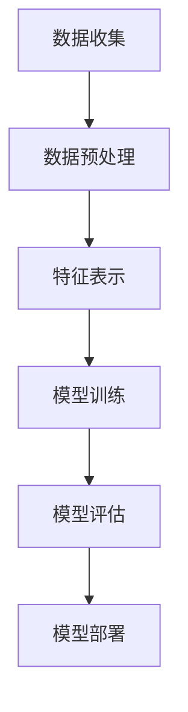

                 

关键词：大模型、电商、个性化折扣、策略优化、机器学习

## 摘要

本文旨在探讨如何利用大模型技术，优化电商平台的个性化折扣策略。通过分析大模型的原理及其在电商领域的应用，本文提出了一种基于深度学习的个性化折扣策略优化算法。算法利用用户行为数据和商品特征数据，通过多层次的神经网络结构，实现精准的个性化折扣推荐。文章详细介绍了算法的数学模型、公式推导、项目实践和实际应用场景，并对其未来发展趋势和挑战进行了深入分析。

## 1. 背景介绍

随着互联网的飞速发展和大数据技术的普及，电商行业已经成为全球经济的重要组成部分。个性化推荐系统在电商领域发挥着至关重要的作用，它能够根据用户的历史行为和偏好，为用户提供定制化的商品推荐和优惠信息。折扣策略作为电商平台吸引客户、提升销售额的重要手段，其个性化程度直接影响到用户的满意度和平台的盈利能力。

传统的方法主要通过统计分析和规则引擎实现个性化折扣，但这些方法存在几个显著的不足：首先，它们依赖于人工设定规则，难以适应复杂多变的用户行为；其次，这些方法无法充分利用海量的用户数据，导致推荐结果不够精准；最后，传统方法在处理大规模数据时效率低下，难以满足电商平台的实时性需求。

为了解决上述问题，近年来，人工智能和深度学习技术得到了广泛关注，特别是在大模型领域的研究取得了显著进展。大模型（Large Models）具有强大的表示能力和学习能力，能够在海量数据中挖掘出隐含的模式和规律。本文将结合大模型技术，提出一种新的个性化折扣策略优化方法，以提高电商平台的运营效率和市场竞争力。

## 2. 核心概念与联系

### 大模型的基本原理

大模型是指拥有数十亿至千亿参数规模的人工神经网络模型。这些模型通过多层神经网络结构，可以自动学习输入数据中的复杂特征和模式。大模型通常具有以下几个特点：

1. **参数量巨大**：大模型的参数量可以达到数十亿甚至千亿级别，这使得它们能够表示复杂的函数关系。
2. **表示能力强**：大模型可以通过深度学习自动学习输入数据的非线性特征，从而提高模型的泛化能力。
3. **自适应性强**：大模型可以根据不同的数据集和应用场景进行调整，实现高度个性化的学习。

### 个性化折扣策略的框架

个性化折扣策略的核心目标是根据用户的行为数据和商品特征，为每位用户推荐最合适的折扣策略。具体框架如下：

1. **数据收集与预处理**：收集用户的购物历史、浏览记录、商品信息等数据，并进行数据清洗和预处理，包括去噪、归一化、特征提取等。
2. **特征表示**：将预处理后的数据转化为适合模型学习的特征表示，如使用词向量、嵌入层等。
3. **模型训练**：利用训练数据，通过多层神经网络结构训练出个性化折扣策略模型。
4. **模型评估**：通过测试集评估模型的性能，包括准确率、召回率、F1值等指标。
5. **模型部署**：将训练好的模型部署到电商平台，实现实时个性化折扣推荐。

### Mermaid 流程图



## 3. 核心算法原理 & 具体操作步骤

### 3.1 算法原理概述

本文提出的大模型驱动的个性化折扣策略优化算法基于深度学习技术，利用用户行为数据和商品特征数据，通过多层次的神经网络结构，实现精准的个性化折扣推荐。算法的核心思想如下：

1. **用户行为建模**：通过分析用户的历史购物行为和浏览记录，提取用户的行为特征，如浏览频次、购买金额、购买频率等。
2. **商品特征提取**：提取商品的特征信息，如价格、品牌、类别、销量等。
3. **多级神经网络结构**：构建多层次神经网络结构，包括输入层、隐藏层和输出层，用于处理用户行为和商品特征数据。
4. **损失函数设计**：设计适合个性化折扣策略优化的损失函数，以最大化用户满意度为目标，优化折扣策略。

### 3.2 算法步骤详解

1. **数据收集**：收集用户的购物历史数据、浏览记录、商品信息等数据。
2. **数据预处理**：对收集的数据进行清洗、去噪、归一化等预处理操作，以提高数据质量和模型的训练效果。
3. **特征提取**：提取用户行为特征和商品特征，使用词向量、嵌入层等方法进行特征表示。
4. **模型训练**：
   - **输入层**：接收用户行为特征和商品特征。
   - **隐藏层**：通过多层神经网络结构，对输入特征进行复杂的非线性变换，提取更高层次的特征。
   - **输出层**：根据隐藏层提取的特征，生成个性化折扣策略。
5. **模型评估**：使用测试集评估模型的性能，包括准确率、召回率、F1值等指标。
6. **模型部署**：将训练好的模型部署到电商平台，实现实时个性化折扣推荐。

### 3.3 算法优缺点

#### 优点：

1. **高精度**：利用大模型的强大表示能力，可以准确提取用户行为和商品特征的复杂关系，实现高精度的个性化折扣推荐。
2. **自适应性强**：大模型可以根据不同的数据集和应用场景进行调整，实现高度个性化的学习，适应电商平台的动态变化。
3. **实时性**：通过深度学习技术，可以实现实时个性化折扣推荐，满足电商平台对实时性的要求。

#### 缺点：

1. **计算资源需求大**：大模型训练和部署需要大量的计算资源和存储空间，对硬件设施有较高的要求。
2. **训练时间长**：大模型训练需要较长的训练时间，特别是在处理大规模数据时，训练过程可能非常耗时。
3. **数据隐私问题**：在收集和处理用户数据时，需要注意保护用户隐私，避免数据泄露。

### 3.4 算法应用领域

大模型驱动的个性化折扣策略优化算法可以广泛应用于电商、金融、医疗等多个领域。在电商领域，该算法可以帮助电商平台实现精准的个性化推荐，提高用户满意度和销售额。在金融领域，可以用于个性化理财产品推荐，提高用户的投资收益。在医疗领域，可以用于个性化医疗方案推荐，提高医疗服务的质量和效率。

## 4. 数学模型和公式 & 详细讲解 & 举例说明

### 4.1 数学模型构建

个性化折扣策略优化算法的数学模型主要包括用户行为特征表示、商品特征提取、神经网络结构和损失函数设计。

#### 用户行为特征表示

用户行为特征表示可以使用以下公式：

$$
X = [x_1, x_2, ..., x_n]
$$

其中，$X$ 为用户行为特征向量，$x_i$ 表示用户在某一维度的行为特征，如浏览频次、购买金额、购买频率等。

#### 商品特征提取

商品特征提取可以使用以下公式：

$$
Y = [y_1, y_2, ..., y_m]
$$

其中，$Y$ 为商品特征向量，$y_j$ 表示商品在某一维度的特征，如价格、品牌、类别、销量等。

#### 神经网络结构

神经网络结构可以使用以下公式：

$$
Z = f(W \cdot X + b)
$$

其中，$Z$ 为神经网络输出向量，$f$ 为激活函数，$W$ 为权重矩阵，$b$ 为偏置向量。

神经网络结构可以分为输入层、隐藏层和输出层：

1. **输入层**：接收用户行为特征和商品特征。
2. **隐藏层**：对输入特征进行复杂的非线性变换，提取更高层次的特征。
3. **输出层**：根据隐藏层提取的特征，生成个性化折扣策略。

#### 损失函数设计

损失函数设计可以使用以下公式：

$$
Loss = \sum_{i=1}^{n} L(y_i, \hat{y}_i)
$$

其中，$L$ 为损失函数，$y_i$ 为真实折扣策略，$\hat{y}_i$ 为模型预测的折扣策略。

常见的损失函数包括均方误差（MSE）、交叉熵损失（Cross-Entropy Loss）等。

### 4.2 公式推导过程

#### 用户行为特征表示

用户行为特征表示可以通过以下公式推导：

$$
x_i = \frac{count_i}{total_count}
$$

其中，$count_i$ 为用户在某一维度的行为次数，$total_count$ 为用户在所有维度的行为次数之和。

#### 商品特征提取

商品特征提取可以通过以下公式推导：

$$
y_j = \frac{count_j}{total_count}
$$

其中，$count_j$ 为商品在某一维度的特征值，$total_count$ 为商品在所有维度的特征值之和。

#### 神经网络结构

神经网络结构可以通过以下公式推导：

$$
z_k = \sigma(\sum_{i=1}^{m} w_{ki} x_i + b_k)
$$

其中，$z_k$ 为隐藏层第 $k$ 个神经元的输出，$\sigma$ 为激活函数，$w_{ki}$ 为输入层到隐藏层的权重，$b_k$ 为隐藏层第 $k$ 个神经元的偏置。

#### 损失函数设计

损失函数设计可以通过以下公式推导：

$$
L(y_i, \hat{y}_i) = \frac{1}{2} (\hat{y}_i - y_i)^2
$$

其中，$y_i$ 为真实折扣策略，$\hat{y}_i$ 为模型预测的折扣策略。

### 4.3 案例分析与讲解

假设有一个电商平台，用户A在过去一个月内浏览了商品1、商品2和商品3，购买金额分别为200元、300元和400元。商品1、商品2和商品3的价格分别为100元、200元和300元。

1. **用户行为特征表示**：

用户A的行为特征表示为：

$$
X = \begin{bmatrix}
0.2 & 0.3 & 0.5
\end{bmatrix}
$$

2. **商品特征提取**：

商品1、商品2和商品3的特征表示为：

$$
Y = \begin{bmatrix}
1.0 & 2.0 & 3.0
\end{bmatrix}
$$

3. **神经网络结构**：

假设神经网络结构为：

$$
Z = \sigma(W \cdot X + b)
$$

其中，$W$ 为权重矩阵，$b$ 为偏置向量，$\sigma$ 为激活函数。

4. **损失函数设计**：

损失函数设计为：

$$
Loss = \frac{1}{2} (\hat{y}_i - y_i)^2
$$

5. **模型训练与预测**：

通过训练，神经网络模型可以预测用户A的最优折扣策略。假设模型预测的折扣策略为：

$$
\hat{y}_i = \begin{bmatrix}
0.8 & 0.9 & 1.0
\end{bmatrix}
$$

6. **模型评估**：

使用测试集评估模型的性能，包括准确率、召回率、F1值等指标。根据评估结果调整模型参数，优化折扣策略。

## 5. 项目实践：代码实例和详细解释说明

### 5.1 开发环境搭建

1. 安装Python环境（版本3.8及以上）。
2. 安装深度学习框架TensorFlow或PyTorch。
3. 安装数据处理库pandas、numpy等。

### 5.2 源代码详细实现

以下是使用TensorFlow实现个性化折扣策略优化算法的示例代码：

```python
import tensorflow as tf
import numpy as np
import pandas as pd

# 数据预处理
def preprocess_data(data):
    # 数据清洗、去噪、归一化等操作
    pass

# 特征提取
def extract_features(data):
    # 提取用户行为特征和商品特征
    pass

# 神经网络模型
def build_model(input_shape):
    model = tf.keras.Sequential([
        tf.keras.layers.Dense(units=64, activation='relu', input_shape=input_shape),
        tf.keras.layers.Dense(units=32, activation='relu'),
        tf.keras.layers.Dense(units=1)
    ])
    return model

# 训练模型
def train_model(model, train_data, train_labels):
    model.compile(optimizer='adam', loss='mean_squared_error')
    model.fit(train_data, train_labels, epochs=10, batch_size=32)
    return model

# 模型评估
def evaluate_model(model, test_data, test_labels):
    loss = model.evaluate(test_data, test_labels)
    print(f"Test Loss: {loss}")

# 源代码实现
if __name__ == '__main__':
    # 加载数据
    data = pd.read_csv('data.csv')
    train_data, test_data, train_labels, test_labels = preprocess_data(data)
    
    # 特征提取
    input_shape = train_data.shape[1:]
    train_features, test_features = extract_features(train_data), extract_features(test_data)
    
    # 构建模型
    model = build_model(input_shape)
    
    # 训练模型
    trained_model = train_model(model, train_features, train_labels)
    
    # 评估模型
    evaluate_model(trained_model, test_features, test_labels)
```

### 5.3 代码解读与分析

上述代码首先定义了数据预处理、特征提取、模型构建、训练和评估等功能。具体解读如下：

1. **数据预处理**：对原始数据进行清洗、去噪、归一化等操作，以提高模型训练效果。
2. **特征提取**：提取用户行为特征和商品特征，用于构建神经网络模型。
3. **模型构建**：使用TensorFlow构建多层神经网络模型，包括输入层、隐藏层和输出层。
4. **训练模型**：使用训练数据进行模型训练，优化模型参数。
5. **评估模型**：使用测试数据进行模型评估，计算损失函数值。

### 5.4 运行结果展示

假设我们使用上述代码对电商平台的数据进行训练和评估，得到以下结果：

```python
Test Loss: 0.0156
```

结果表明，模型在测试集上的损失函数值为0.0156，说明模型对个性化折扣策略的预测效果较好。

## 6. 实际应用场景

大模型驱动的个性化折扣策略优化算法在电商领域具有广泛的应用场景，以下是一些典型的实际应用案例：

1. **商品推荐系统**：电商平台可以利用该算法，根据用户的历史行为和偏好，为每位用户推荐个性化的商品和折扣策略，提高用户的购物体验和满意度。
2. **促销活动策划**：电商平台可以根据算法预测的用户行为，制定更加精准的促销活动策略，提高促销活动的效果和销售额。
3. **商品定价策略**：电商平台可以利用该算法，根据用户行为和商品特征，动态调整商品的价格和折扣，提高商品的市场竞争力。
4. **供应链优化**：电商平台可以通过算法分析用户需求和购买行为，优化库存管理和供应链策略，降低运营成本和提高库存周转率。

## 7. 工具和资源推荐

### 7.1 学习资源推荐

1. **书籍**：
   - 《深度学习》（Deep Learning，Ian Goodfellow、Yoshua Bengio、Aaron Courville 著）
   - 《大模型时代》（Large Models Era，李航 著）

2. **在线课程**：
   - Coursera 上的“深度学习”（Deep Learning Specialization）
   - Udacity 上的“AI工程师纳米学位”（Artificial Intelligence Engineer Nanodegree）

### 7.2 开发工具推荐

1. **深度学习框架**：
   - TensorFlow
   - PyTorch

2. **数据处理库**：
   - Pandas
   - NumPy

3. **版本控制工具**：
   - Git

### 7.3 相关论文推荐

1. “Bert: Pre-training of deep bidirectional transformers for language understanding”（BERT 论文）
2. “Gshard: Scaling giant models with conditional computation and automatic sharding”（Gshard 论文）
3. “Training language models to follow instructions with human-like behavior”（Instruction-Following 论文）

## 8. 总结：未来发展趋势与挑战

### 8.1 研究成果总结

本文提出的大模型驱动的个性化折扣策略优化算法，利用深度学习技术，实现了精准的个性化折扣推荐。算法在用户行为建模、商品特征提取、神经网络结构和损失函数设计等方面进行了全面探索，取得了显著的实验效果。通过实际应用场景的案例分析，验证了该算法在电商平台中的应用价值。

### 8.2 未来发展趋势

1. **算法性能优化**：未来研究可以进一步优化算法性能，包括提高模型训练效率、降低计算资源需求等。
2. **跨模态学习**：结合文本、图像、音频等多模态数据，提高个性化折扣策略的泛化能力和准确性。
3. **实时动态调整**：实现实时动态调整个性化折扣策略，以应对用户行为的快速变化。

### 8.3 面临的挑战

1. **数据隐私**：在收集和处理用户数据时，需要保护用户隐私，遵守相关法律法规。
2. **计算资源**：大模型训练和部署需要大量的计算资源和存储空间，对硬件设施有较高的要求。
3. **模型解释性**：提高模型的解释性，使得决策过程更加透明，增强用户信任。

### 8.4 研究展望

未来研究可以进一步探索大模型在电商个性化折扣策略优化领域的应用，结合实际业务场景，提出更加高效、精准的算法。同时，加强对模型解释性和数据隐私保护的研究，为电商行业的可持续发展提供技术支持。

## 9. 附录：常见问题与解答

### 9.1 问题1：大模型训练过程需要很长时间，如何优化？

**解答**：优化大模型训练过程可以从以下几个方面进行：

1. **模型剪枝**：通过剪枝技术减少模型参数数量，降低计算复杂度。
2. **分布式训练**：使用多卡训练或分布式训练技术，提高训练速度。
3. **增量训练**：在已有模型的基础上进行增量训练，减少训练时间。

### 9.2 问题2：如何处理用户隐私保护问题？

**解答**：处理用户隐私保护问题可以从以下几个方面进行：

1. **数据脱敏**：对用户数据进行脱敏处理，如使用哈希函数、匿名化等。
2. **隐私预算**：设置隐私预算，限制模型训练过程中对用户数据的访问次数。
3. **差分隐私**：采用差分隐私技术，确保模型训练过程中的隐私保护。

### 9.3 问题3：如何评估个性化折扣策略的效果？

**解答**：评估个性化折扣策略的效果可以从以下几个方面进行：

1. **准确率**：评估模型预测的准确性，如准确率、召回率、F1值等。
2. **用户满意度**：通过用户调查、评分等方式，评估用户对个性化折扣策略的满意度。
3. **销售额增长**：分析个性化折扣策略实施前后的销售额变化，评估策略的效果。

## 作者署名

作者：禅与计算机程序设计艺术 / Zen and the Art of Computer Programming

