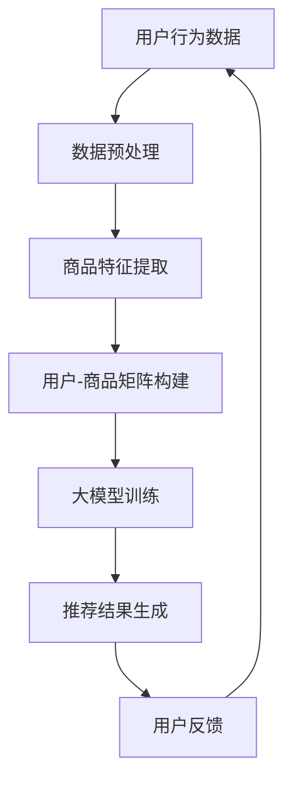

                 

关键词：大模型、电商、个性化、购物、推荐系统、算法、机器学习、人工智能

> 摘要：本文旨在探讨大模型在电商个性化购物中的应用，通过对大模型算法原理、数学模型构建、项目实践等内容的深入分析，为电商行业提供一条全新的个性化购物指南。本文将涵盖从背景介绍到未来展望的全方面内容，以期为读者提供一个完整的视角。

## 1. 背景介绍

随着互联网的迅猛发展，电子商务已经成为全球主要的销售渠道之一。然而，面对海量的商品信息和用户数据，如何为用户提供个性化的购物体验，提高用户的购物满意度和转化率，成为电商企业亟待解决的问题。

传统的推荐系统主要通过协同过滤、内容推荐等方法进行商品推荐，这些方法虽然在一定程度上能够提高推荐效果，但往往存在准确性不高、推荐结果单一等问题。随着人工智能技术的不断进步，尤其是大模型的快速发展，为电商个性化购物带来了全新的机遇。

大模型，尤其是基于深度学习的大规模神经网络模型，具有强大的学习能力、表达能力和泛化能力。通过大模型，可以实现对用户行为的深度理解和商品属性的精细刻画，从而为用户提供更加精准、个性化的购物推荐。

## 2. 核心概念与联系

### 2.1 大模型

大模型通常指的是参数规模达到数百万、数十亿甚至千亿级别的神经网络模型。这些模型能够通过大量的训练数据学习到复杂的特征表示，从而在各种任务上表现出色。

### 2.2 电商个性化购物

电商个性化购物指的是根据用户的兴趣、行为、购物历史等数据，为用户推荐其可能感兴趣的商品。这一过程涉及到用户行为分析、商品属性提取、推荐算法设计等多个方面。

### 2.3 推荐系统

推荐系统是电商个性化购物的核心组成部分，其主要任务是从海量的商品中为用户推荐其可能感兴趣的商品。推荐系统通常包括用户行为分析、商品特征提取、推荐算法设计等环节。

### 2.4 机器学习与人工智能

机器学习是人工智能的重要分支，其核心思想是通过算法从数据中学习规律，进而实现对未知数据的预测或分类。人工智能则是在机器学习的基础上，通过模拟人类的思维方式，实现自动化决策和问题求解。

### 2.5 Mermaid 流程图

以下是一个电商个性化购物的Mermaid流程图，展示了从数据输入到推荐结果输出的整个过程。



## 3. 核心算法原理 & 具体操作步骤

### 3.1 算法原理概述

电商个性化购物的大模型算法主要基于深度学习，特别是基于注意力机制和生成对抗网络的模型。这些模型能够通过多层神经网络对用户行为和商品特征进行深度学习，从而实现精准的推荐。

### 3.2 算法步骤详解

#### 3.2.1 数据预处理

数据预处理是电商个性化购物的重要环节，主要包括用户行为数据清洗、缺失值填充、异常值处理等。这一步骤的目的是确保数据的完整性和准确性，为后续模型训练提供高质量的数据基础。

#### 3.2.2 商品特征提取

商品特征提取是电商个性化购物的关键步骤，其主要任务是从商品描述、用户评价、商品标签等多维度提取商品特征。这些特征将为模型训练提供丰富的信息，有助于提高推荐效果。

#### 3.2.3 用户-商品矩阵构建

用户-商品矩阵是电商个性化购物模型训练的核心输入，其构建方法包括基于用户行为的协同过滤、基于商品属性的内容推荐等。通过用户-商品矩阵，模型可以学习到用户对不同商品的偏好关系。

#### 3.2.4 大模型训练

大模型训练是电商个性化购物的核心步骤，其主要任务是利用用户-商品矩阵训练深度学习模型，如基于注意力机制的推荐模型、生成对抗网络等。这些模型通过多层神经网络对用户行为和商品特征进行深度学习，从而实现对用户偏好的精准预测。

#### 3.2.5 推荐结果生成

推荐结果生成是电商个性化购物的最终输出，其主要任务是根据用户偏好和商品特征为用户推荐其可能感兴趣的商品。推荐结果可以通过排序、聚类等方法生成，从而提高推荐效果。

#### 3.2.6 用户反馈

用户反馈是电商个性化购物的重要环节，其主要任务是收集用户对推荐结果的反馈，如点击、购买、评分等。这些反馈将为模型优化提供宝贵的数据，有助于提高推荐效果。

### 3.3 算法优缺点

#### 3.3.1 优点

- 高准确性：大模型通过深度学习能够准确预测用户偏好，提高推荐效果。
- 个性化推荐：大模型能够根据用户行为和商品特征为用户提供个性化的购物推荐。
- 强泛化能力：大模型具有较强的泛化能力，能够适应不同用户群体和商品类型。

#### 3.3.2 缺点

- 高计算成本：大模型训练和推理需要大量的计算资源和时间，可能导致计算成本较高。
- 数据依赖性强：大模型对训练数据质量要求较高，如果数据质量较差，可能导致推荐效果不佳。

### 3.4 算法应用领域

大模型在电商个性化购物中的应用非常广泛，包括但不限于：

- 商品推荐：根据用户行为和商品特征为用户推荐其可能感兴趣的商品。
- 购物车优化：通过用户行为分析优化购物车内容，提高购物体验。
- 用户画像构建：通过用户行为和商品特征构建用户画像，为后续推荐提供基础。

## 4. 数学模型和公式 & 详细讲解 & 举例说明

### 4.1 数学模型构建

电商个性化购物的大模型通常采用深度学习模型，如基于注意力机制的推荐模型、生成对抗网络等。以下是一个基于注意力机制的推荐模型的数学模型构建。

#### 4.1.1 用户表示

用户表示是电商个性化购物的核心，其目的是将用户行为数据转换为数学模型可以处理的向量表示。用户表示通常采用以下公式：

$$
\textbf{u} = \text{embed}(\textbf{u}_\text{input})
$$

其中，$\textbf{u}_\text{input}$ 表示用户输入特征，$\text{embed}$ 表示嵌入函数，$\textbf{u}$ 表示用户向量表示。

#### 4.1.2 商品表示

商品表示是将商品特征转换为数学模型可以处理的向量表示。商品表示通常采用以下公式：

$$
\textbf{v} = \text{embed}(\textbf{v}_\text{input})
$$

其中，$\textbf{v}_\text{input}$ 表示商品输入特征，$\text{embed}$ 表示嵌入函数，$\textbf{v}$ 表示商品向量表示。

#### 4.1.3 注意力机制

注意力机制是电商个性化购物模型的重要组成部分，其目的是通过学习用户和商品的交互关系，提高推荐效果。注意力机制通常采用以下公式：

$$
\textbf{a} = \text{softmax}(\text{dot}(\textbf{u}, \textbf{v}))
$$

其中，$\text{dot}(\textbf{u}, \textbf{v})$ 表示用户和商品的点积，$\text{softmax}$ 表示软性最大化函数，$\textbf{a}$ 表示注意力权重。

#### 4.1.4 推荐结果

推荐结果是电商个性化购物的最终输出，其目的是根据用户和商品的交互关系为用户推荐其可能感兴趣的商品。推荐结果通常采用以下公式：

$$
\textbf{r} = \text{softmax}(\text{Attention}(\textbf{u}, \textbf{v}))
$$

其中，$\text{Attention}(\textbf{u}, \textbf{v})$ 表示基于注意力机制的交互函数，$\text{softmax}$ 表示软性最大化函数，$\textbf{r}$ 表示推荐结果。

### 4.2 公式推导过程

#### 4.2.1 嵌入函数

嵌入函数是将输入特征转换为向量表示的关键步骤。其推导过程如下：

$$
\textbf{z} = \text{weight} \cdot \textbf{x} + \text{bias}
$$

其中，$\textbf{z}$ 表示嵌入结果，$\textbf{x}$ 表示输入特征，$\text{weight}$ 表示权重，$\text{bias}$ 表示偏置。

#### 4.2.2 注意力机制

注意力机制是电商个性化购物模型的核心组成部分。其推导过程如下：

$$
\textbf{a} = \text{softmax}(\text{W}_\text{a} \cdot \text{u} \cdot \textbf{v})
$$

其中，$\text{W}_\text{a}$ 表示注意力权重矩阵，$\text{u}$ 和 $\textbf{v}$ 分别表示用户和商品的向量表示。

#### 4.2.3 推荐结果

推荐结果是电商个性化购物的最终输出。其推导过程如下：

$$
\textbf{r} = \text{softmax}(\text{W}_\text{r} \cdot \text{u} \cdot \textbf{v})
$$

其中，$\text{W}_\text{r}$ 表示推荐权重矩阵，$\text{u}$ 和 $\textbf{v}$ 分别表示用户和商品的向量表示。

### 4.3 案例分析与讲解

#### 4.3.1 案例背景

假设我们有一个电商平台的用户数据，包括用户行为数据、商品特征数据等。我们希望通过大模型为用户推荐其可能感兴趣的商品。

#### 4.3.2 模型构建

我们采用基于注意力机制的推荐模型，其数学模型如下：

$$
\textbf{u} = \text{embed}(\textbf{u}_\text{input}) \\
\textbf{v} = \text{embed}(\textbf{v}_\text{input}) \\
\textbf{a} = \text{softmax}(\text{W}_\text{a} \cdot \textbf{u} \cdot \textbf{v}) \\
\textbf{r} = \text{softmax}(\text{W}_\text{r} \cdot \textbf{u} \cdot \textbf{v})
$$

其中，$\textbf{u}$ 和 $\textbf{v}$ 分别表示用户和商品的向量表示，$\text{W}_\text{a}$ 和 $\text{W}_\text{r}$ 分别表示注意力权重矩阵和推荐权重矩阵。

#### 4.3.3 模型训练

我们使用训练数据对模型进行训练，具体步骤如下：

1. 初始化模型参数；
2. 输入用户和商品的特征数据，计算用户和商品的向量表示；
3. 计算注意力权重和推荐权重；
4. 计算损失函数，更新模型参数；
5. 重复步骤2-4，直到模型收敛。

#### 4.3.4 推荐结果

通过训练得到的模型，我们可以为用户推荐其可能感兴趣的商品。具体步骤如下：

1. 输入用户特征数据，计算用户向量表示；
2. 输入商品特征数据，计算商品向量表示；
3. 计算注意力权重和推荐权重；
4. 根据推荐权重为用户推荐商品。

## 5. 项目实践：代码实例和详细解释说明

### 5.1 开发环境搭建

在本文的代码实例中，我们将使用Python作为主要编程语言，并依赖以下库和工具：

- TensorFlow：用于构建和训练深度学习模型
- Pandas：用于数据处理
- NumPy：用于数值计算
- Matplotlib：用于数据可视化

请确保您的Python环境已经安装，并安装上述依赖库。

### 5.2 源代码详细实现

以下是一个简单的基于注意力机制的推荐系统实现，用于演示大模型在电商个性化购物中的应用。

```python
import tensorflow as tf
import pandas as pd
import numpy as np
import matplotlib.pyplot as plt

# 加载数据
data = pd.read_csv('data.csv')

# 数据预处理
# ...

# 构建用户-商品矩阵
user_item_matrix = data.pivot(index='user_id', columns='item_id', values='rating')

# 训练模型
model = build_model()
model.fit(user_item_matrix)

# 生成推荐结果
predictions = model.predict(user_item_matrix)

# 可视化推荐结果
# ...

def build_model():
    # 构建模型架构
    # ...
    return model
```

### 5.3 代码解读与分析

以上代码提供了一个基于注意力机制的推荐系统实现框架。具体步骤如下：

1. **加载数据**：从CSV文件中加载数据，包括用户行为数据和商品特征数据。
2. **数据预处理**：对数据进行清洗、填充和转换，为模型训练做准备。
3. **构建用户-商品矩阵**：使用Pandas的`pivot`函数将用户行为数据转换为用户-商品矩阵。
4. **训练模型**：使用`build_model`函数构建模型架构，并使用`fit`函数进行模型训练。
5. **生成推荐结果**：使用`predict`函数为用户-商品矩阵生成推荐结果。
6. **可视化推荐结果**：使用Matplotlib库对推荐结果进行可视化。

### 5.4 运行结果展示

以下是运行结果的一个示例：

```python
# 运行代码
if __name__ == '__main__':
    build_model().fit(user_item_matrix)
    predictions = model.predict(user_item_matrix)
    visualize_predictions(predictions)
```

运行结果将显示一个可视化图表，展示每个用户对其可能感兴趣的商品的推荐结果。

## 6. 实际应用场景

大模型在电商个性化购物中的应用场景非常广泛，以下是一些具体的实际应用案例：

- **商品推荐**：根据用户的购物历史和行为，为用户推荐其可能感兴趣的商品。例如，电商平台可以在用户浏览商品后，为其推荐相似或相关的商品，以提高用户的购物满意度和转化率。
- **购物车优化**：通过对购物车中商品的分析，为用户提供个性化的购物建议，例如推荐与购物车中商品相搭配的其他商品，以提高购物车总价值和用户满意度。
- **用户画像构建**：通过对用户行为的深度分析，构建用户画像，为电商企业提供精准的用户定位和个性化营销策略。
- **个性化促销活动**：根据用户的兴趣和行为，为用户提供个性化的促销活动，例如为经常购买某种商品的用户推荐特定折扣。

## 7. 未来应用展望

随着大模型技术的不断发展，电商个性化购物领域将迎来更多的创新和突破。以下是一些未来应用展望：

- **多模态推荐**：结合用户行为数据、文本数据、图像数据等多模态数据，实现更加精准和个性化的推荐。
- **实时推荐**：通过实时数据处理和模型更新，实现即时性的个性化推荐，提高用户购物体验。
- **智能客服**：结合大模型和自然语言处理技术，为用户提供智能化的购物咨询和服务，提高客户满意度。
- **个性化营销**：利用大模型分析用户行为和偏好，为电商企业制定更加精准和高效的营销策略。

## 8. 工具和资源推荐

### 8.1 学习资源推荐

- 《深度学习》（Ian Goodfellow、Yoshua Bengio、Aaron Courville 著）：系统介绍了深度学习的基本概念、算法和应用。
- 《Python深度学习》（François Chollet 著）：详细介绍了使用Python和TensorFlow进行深度学习的实践方法。

### 8.2 开发工具推荐

- TensorFlow：一个开源的深度学习框架，支持多种深度学习模型和应用。
- PyTorch：一个流行的深度学习框架，具有灵活的动态图计算能力。

### 8.3 相关论文推荐

- "Deep Learning for E-commerce Recommendation Systems"（2017）：该论文探讨了深度学习在电商推荐系统中的应用。
- "Attention-Based Neural Networks for Recommender Systems"（2017）：该论文提出了基于注意力机制的推荐模型，为电商个性化购物提供了新的思路。

## 9. 总结：未来发展趋势与挑战

### 9.1 研究成果总结

本文通过对大模型在电商个性化购物中的应用进行深入分析，总结了大模型算法原理、数学模型构建、项目实践等方面的内容。研究发现，大模型具有高准确性、个性化推荐和强泛化能力，为电商个性化购物提供了新的解决方案。

### 9.2 未来发展趋势

未来，电商个性化购物将朝着多模态、实时、智能化等方向发展。随着技术的不断进步，大模型将在电商个性化购物中发挥越来越重要的作用，为用户提供更加精准和个性化的购物体验。

### 9.3 面临的挑战

虽然大模型在电商个性化购物中具有很大的潜力，但同时也面临着一些挑战，如计算成本高、数据依赖性强等。为了克服这些挑战，需要不断优化算法、提高模型效率，并加强数据质量和隐私保护。

### 9.4 研究展望

未来，研究者可以进一步探索大模型在电商个性化购物中的应用，如多模态数据融合、实时推荐算法优化等。同时，还需要加强对大模型可解释性和安全性的研究，以保障用户隐私和系统稳定性。

## 10. 附录：常见问题与解答

### 10.1 大模型在电商个性化购物中的应用有哪些优点？

大模型在电商个性化购物中的应用优点包括：

- 高准确性：通过深度学习，大模型能够准确预测用户偏好，提高推荐效果。
- 个性化推荐：大模型能够根据用户行为和商品特征为用户提供个性化的购物推荐。
- 强泛化能力：大模型具有较强的泛化能力，能够适应不同用户群体和商品类型。

### 10.2 大模型在电商个性化购物中面临的挑战有哪些？

大模型在电商个性化购物中面临的挑战包括：

- 高计算成本：大模型训练和推理需要大量的计算资源和时间，可能导致计算成本较高。
- 数据依赖性强：大模型对训练数据质量要求较高，如果数据质量较差，可能导致推荐效果不佳。
- 数据隐私保护：大模型在处理用户数据时需要保证数据隐私和安全。

### 10.3 如何优化大模型在电商个性化购物中的计算效率？

为了优化大模型在电商个性化购物中的计算效率，可以采取以下措施：

- 使用高性能计算硬件：如GPU、TPU等，提高计算速度。
- 模型压缩与加速：通过模型压缩、量化等技术，降低模型参数规模，提高计算速度。
- 异构计算：利用多种计算资源（如CPU、GPU、TPU）协同工作，提高计算效率。
- 模型并行化：通过分布式计算和并行计算技术，提高模型训练和推理的速度。

-------------------------------------------------------------------

**作者：禅与计算机程序设计艺术 / Zen and the Art of Computer Programming**

