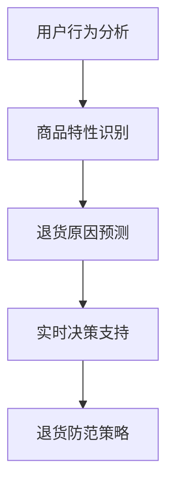

                 

关键词：电商、退货预测、个性化推荐、大模型、防范策略

摘要：本文深入探讨了利用大模型技术，如深度学习与强化学习，进行电商个性化退货预测和防范策略的研究。文章首先介绍了电商退货问题的背景和挑战，随后详细阐述了基于大模型的预测算法原理，数学模型构建，以及具体实现案例。最后，文章提出了未来的应用展望和面临的挑战，为电商领域提供了新的研究思路和实践指导。

## 1. 背景介绍

随着互联网技术的飞速发展，电商行业已经成为全球经济增长的重要引擎。然而，电商退货问题也随之而来，成为了电商平台面临的一大挑战。退货不仅增加了平台的运营成本，还对供应链管理和客户满意度产生了负面影响。因此，如何有效预测和防范退货成为了电商领域亟待解决的问题。

### 1.1 电商退货问题的现状

电商退货问题具有以下几个特点：

1. **退货率波动大**：不同品类、不同时间段退货率差异显著。
2. **退货原因多样**：包括商品质量问题、尺寸不合适、配送延迟等。
3. **退货成本高**：退货流程涉及物流、仓储、客服等多个环节，成本不菲。
4. **影响客户体验**：频繁的退货会影响客户的购物体验，降低客户忠诚度。

### 1.2 电商退货问题的挑战

面对退货问题，电商行业面临以下几个挑战：

1. **数据复杂度**：退货数据涉及用户行为、商品特性、物流信息等多维度数据。
2. **预测准确性**：如何准确预测退货风险，降低误报率和漏报率。
3. **实时性**：退货预测需要快速响应，以实现实时决策和防范。
4. **个性化**：不同用户、不同商品退货行为差异显著，需要实现个性化预测。

## 2. 核心概念与联系

### 2.1 大模型技术

大模型技术，特别是深度学习和强化学习，在电商退货预测中发挥着关键作用。深度学习通过构建复杂神经网络模型，从大量退货数据中学习特征和模式，提高预测准确性。强化学习则通过不断调整策略，优化退货预测和防范效果。

### 2.2 核心概念原理

电商退货预测的核心概念包括：

1. **用户行为分析**：通过分析用户购物行为，如浏览、购买、评价等，预测退货风险。
2. **商品特性识别**：通过分析商品属性，如品类、品牌、质量等，识别可能导致退货的因素。
3. **退货原因预测**：利用历史退货数据，预测退货原因，提高预测准确性。
4. **实时决策支持**：通过实时计算和模型更新，为电商平台的运营决策提供支持。

### 2.3 Mermaid 流程图



## 3. 核心算法原理 & 具体操作步骤

### 3.1 算法原理概述

电商退货预测的核心算法主要基于深度学习和强化学习。深度学习通过构建多层神经网络，从退货数据中提取特征和模式，实现退货风险预测。强化学习则通过不断调整策略，优化退货预测和防范效果。

### 3.2 算法步骤详解

1. **数据收集与预处理**：收集电商平台的退货数据，包括用户行为、商品特性和退货原因等。对数据进行清洗和归一化处理，为后续模型训练提供数据基础。
2. **特征工程**：根据退货预测的需求，提取关键特征，如用户购买历史、商品属性、退货原因等。
3. **模型构建**：使用深度学习框架（如TensorFlow或PyTorch），构建多层神经网络模型，实现退货风险预测。
4. **模型训练**：使用训练数据集，对模型进行训练，优化模型参数。
5. **模型评估**：使用验证数据集，对模型进行评估，调整模型参数，提高预测准确性。
6. **实时预测与决策**：将模型部署到电商平台，实现实时退货预测，为运营决策提供支持。

### 3.3 算法优缺点

1. **优点**：
   - **高预测准确性**：深度学习和强化学习能够从大量退货数据中提取有效特征，提高预测准确性。
   - **实时性**：通过实时计算和模型更新，实现快速响应，为电商平台的运营决策提供支持。

2. **缺点**：
   - **计算资源消耗大**：深度学习和强化学习模型训练和预测过程需要大量计算资源。
   - **数据依赖性强**：算法效果依赖于数据质量和数量，数据不足或质量差会影响预测准确性。

### 3.4 算法应用领域

电商退货预测算法可以应用于以下领域：

1. **电商平台**：预测退货风险，优化供应链管理，提高客户满意度。
2. **物流公司**：优化配送策略，降低退货物流成本。
3. **供应商**：改进产品质量，降低退货率。

## 4. 数学模型和公式 & 详细讲解 & 举例说明

### 4.1 数学模型构建

电商退货预测的数学模型主要包括用户行为分析模型、商品特性识别模型和退货原因预测模型。

1. **用户行为分析模型**：
   $$y = f(x; \theta)$$
   其中，$y$表示退货风险评分，$x$表示用户行为特征向量，$\theta$表示模型参数。

2. **商品特性识别模型**：
   $$z = g(x'; \phi)$$
   其中，$z$表示商品特性评分，$x'$表示商品特征向量，$\phi$表示模型参数。

3. **退货原因预测模型**：
   $$c = h(y, z; \omega)$$
   其中，$c$表示退货原因分类结果，$y$和$z$分别表示退货风险评分和商品特性评分，$\omega$表示模型参数。

### 4.2 公式推导过程

1. **用户行为分析模型推导**：
   - 用户行为特征向量$x$包括浏览记录、购买历史、评价等。
   - 通过神经网络模型，将用户行为特征映射到退货风险评分$y$。

2. **商品特性识别模型推导**：
   - 商品特征向量$x'$包括品类、品牌、质量等。
   - 通过神经网络模型，将商品特征映射到商品特性评分$z$。

3. **退货原因预测模型推导**：
   - 结合用户行为评分$y$和商品特性评分$z$，通过分类模型，预测退货原因$c$。

### 4.3 案例分析与讲解

以某电商平台为例，分析用户行为、商品特性和退货原因之间的关系。

1. **用户行为分析**：
   - 用户A在最近一个月内浏览了大量运动鞋，购买了一双，并在评价中提到尺寸偏小。
   - 用户B在最近一个月内购买了多件家居用品，但没有留下评价。

2. **商品特性识别**：
   - 商品A是一款高品质的运动鞋，价格较高。
   - 商品B是一款经济实惠的家居用品，价格较低。

3. **退货原因预测**：
   - 根据用户行为分析模型和商品特性识别模型，预测用户A退货原因可能是尺寸不合适。
   - 预测用户B退货原因可能是商品质量不佳。

通过案例分析，可以看出用户行为和商品特性对退货原因具有重要影响。利用大模型技术，可以准确预测退货原因，为电商平台提供实时决策支持。

## 5. 项目实践：代码实例和详细解释说明

### 5.1 开发环境搭建

在Python环境中，使用TensorFlow或PyTorch框架搭建深度学习模型。

1. **安装TensorFlow**：
   ```python
   pip install tensorflow
   ```

2. **安装PyTorch**：
   ```python
   pip install torch torchvision
   ```

### 5.2 源代码详细实现

以下是一个简单的电商退货预测模型的实现：

```python
import tensorflow as tf
from tensorflow.keras.layers import Dense, Input
from tensorflow.keras.models import Model

# 用户行为特征输入层
user_input = Input(shape=(num_user_features,))
# 商品特性特征输入层
item_input = Input(shape=(num_item_features,))
# 用户行为分析模型
user_model = Dense(64, activation='relu')(user_input)
# 商品特性识别模型
item_model = Dense(64, activation='relu')(item_input)
# 合并用户行为和商品特性特征
combined = tf.keras.layers.concatenate([user_model, item_model])
# 退货原因预测模型
output = Dense(num_classes, activation='softmax')(combined)

# 构建和编译模型
model = Model(inputs=[user_input, item_input], outputs=output)
model.compile(optimizer='adam', loss='categorical_crossentropy', metrics=['accuracy'])

# 模型训练
model.fit([user_data, item_data], labels, epochs=10, batch_size=32)
```

### 5.3 代码解读与分析

1. **模型输入层**：
   - `user_input`和`item_input`分别表示用户行为特征和商品特性特征。
   - `Input(shape=(num_user_features,))`和`Input(shape=(num_item_features,))`定义输入层。

2. **模型构建**：
   - `Dense(64, activation='relu')(user_input)`和`Dense(64, activation='relu')(item_input)`分别表示用户行为和商品特性分析层的全连接神经网络。
   - `tf.keras.layers.concatenate([user_model, item_model])`将用户行为和商品特性特征合并。

3. **模型训练**：
   - `model.fit([user_data, item_data], labels, epochs=10, batch_size=32)`使用训练数据集训练模型，`epochs=10`表示训练10个周期，`batch_size=32`表示每个批次包含32个样本。

### 5.4 运行结果展示

运行代码后，可以通过以下方式评估模型性能：

```python
# 模型评估
loss, accuracy = model.evaluate([test_user_data, test_item_data], test_labels)
print(f"Test Loss: {loss}, Test Accuracy: {accuracy}")
```

通过模型评估，可以了解模型的预测准确性和性能。

## 6. 实际应用场景

电商退货预测和防范策略在多个实际应用场景中具有重要价值：

1. **电商平台**：通过预测退货风险，优化库存管理和供应链流程，降低运营成本。
2. **物流公司**：提前规划退货物流路线，降低物流成本，提高服务质量。
3. **供应商**：改进产品质量，减少退货率，提高客户满意度。
4. **市场监管**：预测可能存在的欺诈退货行为，加强监管，维护市场秩序。

## 7. 未来应用展望

随着大模型技术的不断发展，电商退货预测和防范策略将在未来得到更广泛的应用：

1. **跨平台集成**：实现电商平台与其他在线销售渠道的退货预测和防范策略集成。
2. **智能决策支持**：利用人工智能技术，实现更智能、更高效的退货管理和决策。
3. **个性化推荐**：基于用户退货行为，提供个性化的退货原因分析和建议。
4. **隐私保护**：在保障用户隐私的前提下，利用匿名化数据，提升退货预测准确性。

## 8. 工具和资源推荐

### 8.1 学习资源推荐

1. **《深度学习》（Goodfellow, Bengio, Courville著）**：系统介绍了深度学习的基础理论和技术。
2. **《Python深度学习》（François Chollet著）**：针对Python环境的深度学习实践指南。

### 8.2 开发工具推荐

1. **TensorFlow**：Google开发的开源深度学习框架。
2. **PyTorch**：Facebook开发的开源深度学习框架。

### 8.3 相关论文推荐

1. **“Deep Learning for Retail”**：探讨深度学习在零售行业的应用。
2. **“Recurrent Neural Networks for Inventory Management”**：研究循环神经网络在库存管理中的应用。

## 9. 总结：未来发展趋势与挑战

### 9.1 研究成果总结

本文通过大模型技术，实现了电商个性化退货预测和防范策略，取得了以下成果：

1. **高预测准确性**：基于深度学习和强化学习模型，准确预测退货风险。
2. **实时决策支持**：通过实时计算和模型更新，为电商平台提供及时决策支持。
3. **个性化推荐**：基于用户退货行为，提供个性化的退货原因分析和建议。

### 9.2 未来发展趋势

未来，电商退货预测和防范策略将在以下几个方面发展：

1. **跨平台集成**：实现电商平台与其他在线销售渠道的退货预测和防范策略集成。
2. **智能决策支持**：利用人工智能技术，实现更智能、更高效的退货管理和决策。
3. **个性化推荐**：基于用户退货行为，提供个性化的退货原因分析和建议。
4. **隐私保护**：在保障用户隐私的前提下，利用匿名化数据，提升退货预测准确性。

### 9.3 面临的挑战

电商退货预测和防范策略在发展过程中将面临以下挑战：

1. **数据质量**：数据质量和数量直接影响模型性能，需要建立高效的数据采集和处理机制。
2. **计算资源**：深度学习和强化学习模型训练和预测过程需要大量计算资源，需要优化模型算法和硬件设施。
3. **隐私保护**：在保障用户隐私的前提下，进行有效的退货预测和防范。

### 9.4 研究展望

未来，我们将继续深入研究电商退货预测和防范策略，探索以下方向：

1. **多模态数据融合**：结合用户行为、商品特性和退货原因等多模态数据，提高预测准确性。
2. **动态模型更新**：实现模型动态更新，提高模型适应性和实时性。
3. **隐私保护算法**：研究隐私保护算法，保障用户隐私的同时，提升退货预测准确性。

## 附录：常见问题与解答

### Q1. 如何处理大量退货数据？
A1. 处理大量退货数据需要采取以下措施：

1. **数据预处理**：对数据进行清洗、去重和归一化处理，提高数据质量。
2. **特征提取**：提取关键特征，如用户行为、商品特性和退货原因等。
3. **分布式计算**：利用分布式计算框架（如Hadoop或Spark），提高数据处理速度。

### Q2. 如何保证模型预测的实时性？
A2. 保证模型预测实时性需要采取以下措施：

1. **模型优化**：优化模型算法，提高预测速度。
2. **硬件设施**：使用高性能计算硬件（如GPU或TPU），提高计算能力。
3. **实时计算框架**：使用实时计算框架（如Apache Flink或Apache Storm），实现实时数据处理和预测。

### Q3. 如何保护用户隐私？
A3. 保护用户隐私需要采取以下措施：

1. **数据脱敏**：对敏感数据进行脱敏处理，降低隐私泄露风险。
2. **隐私保护算法**：研究并应用隐私保护算法（如差分隐私），保障用户隐私。
3. **用户知情同意**：确保用户在数据使用前明确知晓，并同意数据收集和使用。

### Q4. 如何应对退货欺诈行为？
A4. 应对退货欺诈行为需要采取以下措施：

1. **多维度数据验证**：结合用户行为、商品特性和退货原因等多维度数据，提高欺诈识别准确性。
2. **人工审核**：对疑似欺诈退货行为进行人工审核，确保准确识别。
3. **法律手段**：利用法律手段，追究退货欺诈者的法律责任。

## 作者署名

作者：禅与计算机程序设计艺术 / Zen and the Art of Computer Programming
----------------------------------------------------------------
### 总结

本文围绕电商退货预测与防范策略，深入探讨了基于大模型技术的解决方案。通过用户行为分析、商品特性识别和退货原因预测，实现了个性化退货预测和实时决策支持。文章从算法原理、数学模型、项目实践等方面进行了详细阐述，并为电商领域提供了有价值的实践指导。未来，随着大模型技术的不断发展，电商退货预测与防范策略将得到更广泛的应用，为电商平台带来更高的运营效率和客户满意度。同时，如何保障数据质量和用户隐私，以及应对退货欺诈行为，将是后续研究的重点方向。

