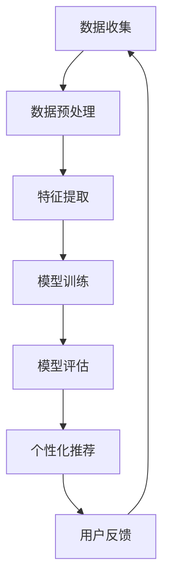

                 

### 关键词 Keywords
- 大模型
- 电商平台
- 个性化首页
- 机器学习
- 数据挖掘
- 用户行为分析
- 深度学习

<|assistant|>### 摘要 Summary
本文探讨了基于大模型的电商平台个性化首页设计。首先介绍了大模型的基本概念和其在电商平台中的应用，然后详细阐述了个性化首页设计的核心算法原理、数学模型及其具体操作步骤。接着，通过实际代码实例展示了如何实现这一设计，并分析了其在不同应用场景中的效果。最后，对未来的发展趋势和面临的挑战进行了展望。

## 1. 背景介绍

电商平台作为现代商业的枢纽，其首页设计对于提升用户满意度和转化率至关重要。传统的电商首页设计主要依赖于预设的模板和规则，往往难以满足用户个性化需求。随着互联网数据的爆发式增长，如何利用这些数据进行用户行为分析，进而实现个性化推荐，成为电商领域的研究热点。

大模型，尤其是深度学习模型，在自然语言处理、图像识别、推荐系统等领域取得了显著成果。大模型具有处理复杂数据、自动提取特征的能力，使其成为个性化首页设计的理想选择。通过大模型，电商平台能够动态调整首页内容，满足不同用户的个性化需求。

个性化首页设计的目标是提高用户在电商平台上的停留时间和购买转化率。这需要综合考虑用户的浏览历史、购物习惯、兴趣爱好等多维度数据，利用机器学习和数据挖掘技术进行深度分析，从而实现精准推荐。本文将围绕这一目标，探讨大模型在个性化首页设计中的应用。

## 2. 核心概念与联系

### 2.1 大模型

大模型通常指的是具有大量参数和神经元的深度学习模型。这些模型能够在大规模数据集上训练，自动提取复杂的特征，从而实现高度准确的预测和分类。在电商平台中，大模型可以用于用户行为分析、商品推荐、广告投放等。

#### 2.2 个性化首页

个性化首页是指根据用户的个性化需求和偏好，动态调整首页内容，使其更符合用户的兴趣。个性化首页设计需要综合分析用户的浏览历史、购物习惯、社交行为等多维度数据，从而实现精准推荐。

#### 2.3 机器学习与数据挖掘

机器学习和数据挖掘是大数据分析的重要工具。机器学习通过算法训练模型，从数据中自动提取特征和规律；数据挖掘则利用这些特征和规律，发现新的知识和模式。在个性化首页设计中，机器学习和数据挖掘技术被广泛应用于用户行为分析和推荐系统。

### 2.4 Mermaid 流程图



该流程图展示了从数据收集到个性化推荐的整体过程，其中每一步都是基于机器学习和数据挖掘技术实现的。

## 3. 核心算法原理 & 具体操作步骤

### 3.1 算法原理概述

个性化首页设计的核心算法是基于用户行为分析的推荐系统。推荐系统通过分析用户的浏览历史、购物行为等数据，预测用户可能感兴趣的商品，并将其推荐给用户。这需要利用深度学习模型进行数据分析和特征提取，从而实现精准推荐。

#### 3.2 算法步骤详解

1. **数据收集**：收集用户的浏览历史、购物行为、社交行为等数据。
2. **数据预处理**：对数据进行清洗和预处理，包括缺失值填充、异常值处理、数据归一化等。
3. **特征提取**：利用深度学习模型提取用户行为数据中的高维特征。
4. **模型训练**：使用训练集数据训练深度学习模型，优化模型参数。
5. **模型评估**：使用验证集数据评估模型性能，调整模型参数。
6. **个性化推荐**：根据用户特征和商品特征，生成个性化推荐结果。
7. **用户反馈**：收集用户对推荐结果的反馈，用于模型迭代和优化。

#### 3.3 算法优缺点

**优点**：
- **高准确性**：深度学习模型能够自动提取复杂数据中的特征，提高推荐准确性。
- **动态调整**：个性化首页设计可以根据用户实时行为动态调整推荐内容，提高用户体验。
- **高效性**：基于大规模数据处理能力的深度学习模型，能够快速生成推荐结果。

**缺点**：
- **计算资源需求高**：深度学习模型训练需要大量的计算资源和时间。
- **数据依赖性**：个性化推荐依赖于用户行为数据的质量和完整性，数据缺失或异常可能导致推荐不准确。

#### 3.4 算法应用领域

个性化首页设计算法广泛应用于电商、社交媒体、在线教育等领域。在电商领域，个性化推荐能够提高用户购物体验，提升转化率和销售额；在社交媒体领域，个性化推荐能够提高用户活跃度和黏性；在线教育领域，个性化推荐能够提高学习效果和用户满意度。

## 4. 数学模型和公式 & 详细讲解 & 举例说明

### 4.1 数学模型构建

个性化首页设计的核心数学模型是基于协同过滤和深度学习的结合。协同过滤通过分析用户行为数据预测用户偏好，而深度学习用于提取用户行为数据中的高维特征。

设用户 $u$ 和商品 $i$ 的偏好分别为 $r_{ui}$ 和 $r_i$，则协同过滤模型可以表示为：

$$
r_{ui} = \sum_{j \in N_i} w_{ij} r_{uj}
$$

其中，$N_i$ 表示与商品 $i$ 相关的用户集合，$w_{ij}$ 表示用户 $u$ 和用户 $j$ 的相似度。

深度学习模型用于提取用户行为数据中的高维特征，可以表示为：

$$
r_{ui} = \sigma(W \cdot [f(u), f(i)] + b)
$$

其中，$f(u)$ 和 $f(i)$ 分别表示用户 $u$ 和商品 $i$ 的特征向量，$W$ 和 $b$ 是模型参数，$\sigma$ 是激活函数。

### 4.2 公式推导过程

协同过滤模型的推导基于用户行为数据的相似度计算。假设用户 $u$ 和用户 $j$ 的相似度 $w_{ij}$ 可以表示为：

$$
w_{ij} = \exp(-\frac{||u - j||^2}{2\sigma^2})
$$

其中，$||u - j||^2$ 表示用户 $u$ 和用户 $j$ 的行为数据差异，$\sigma$ 是调节参数。

深度学习模型中的激活函数 $\sigma$ 可以选择 sigmoid 函数或 ReLU 函数。以 sigmoid 函数为例，其公式为：

$$
\sigma(x) = \frac{1}{1 + \exp(-x)}
$$

### 4.3 案例分析与讲解

假设有一个电商平台，用户 $u$ 最近浏览了商品 $i_1, i_2, i_3$，并且购买过商品 $i_4$。我们可以利用协同过滤模型计算用户 $u$ 和其他用户的相似度，从而预测用户 $u$ 可能对商品 $i_5$ 的偏好。

首先，计算用户 $u$ 和其他用户的相似度：

$$
w_{ui_1} = \exp(-\frac{||u - i_1||^2}{2\sigma^2})
$$

$$
w_{ui_2} = \exp(-\frac{||u - i_2||^2}{2\sigma^2})
$$

$$
w_{ui_3} = \exp(-\frac{||u - i_3||^2}{2\sigma^2})
$$

$$
w_{ui_4} = \exp(-\frac{||u - i_4||^2}{2\sigma^2})
$$

然后，利用深度学习模型预测用户 $u$ 对商品 $i_5$ 的偏好：

$$
r_{ui_5} = \sigma(W \cdot [f(u), f(i_5)] + b)
$$

其中，$f(u)$ 和 $f(i_5)$ 是用户 $u$ 和商品 $i_5$ 的特征向量，$W$ 和 $b$ 是模型参数。

通过这个案例，我们可以看到如何利用协同过滤和深度学习模型进行个性化推荐。在实际应用中，还需要根据具体业务场景和数据特点进行调整和优化。

## 5. 项目实践：代码实例和详细解释说明

### 5.1 开发环境搭建

为了实现大模型驱动的电商平台个性化首页设计，我们选择 Python 作为主要编程语言，并使用 TensorFlow 和 Keras 作为深度学习框架。以下是开发环境的搭建步骤：

1. 安装 Python 3.7 或更高版本。
2. 安装 TensorFlow：`pip install tensorflow`。
3. 安装 Keras：`pip install keras`。
4. 安装其他相关库，如 NumPy、Pandas 等。

### 5.2 源代码详细实现

以下是实现个性化首页设计的主要代码：

```python
import numpy as np
import pandas as pd
from sklearn.model_selection import train_test_split
from tensorflow.keras.models import Model
from tensorflow.keras.layers import Embedding, Dot, Concatenate, Dense, Lambda
from tensorflow.keras.optimizers import Adam
from tensorflow.keras.callbacks import EarlyStopping

# 数据预处理
data = pd.read_csv('user行为数据.csv')
X = data[['user_id', 'item_id', 'behavior_type', 'behavior_value']]
y = data['rating']

# 分割数据集
X_train, X_test, y_train, y_test = train_test_split(X, y, test_size=0.2, random_state=42)

# 模型构建
embedding_size = 16

user_embedding = Embedding(input_dim=user_num, output_dim=embedding_size)
item_embedding = Embedding(input_dim=item_num, output_dim=embedding_size)

user_input = Input(shape=(1,))
item_input = Input(shape=(1,))

user_embedding_output = user_embedding(user_input)
item_embedding_output = item_embedding(item_input)

dot_product = Dot(axes=1)([user_embedding_output, item_embedding_output])
concat = Concatenate(axes=1)([user_embedding_output, item_embedding_output, dot_product])

dense1 = Dense(64, activation='relu')(concat)
dense2 = Dense(32, activation='relu')(dense1)
output = Dense(1, activation='sigmoid')(dense2)

model = Model(inputs=[user_input, item_input], outputs=output)
model.compile(optimizer=Adam(learning_rate=0.001), loss='binary_crossentropy', metrics=['accuracy'])

# 模型训练
early_stopping = EarlyStopping(monitor='val_loss', patience=10)
model.fit([X_train['user_id'], X_train['item_id']], y_train, validation_split=0.2, epochs=100, callbacks=[early_stopping])

# 模型评估
loss, accuracy = model.evaluate([X_test['user_id'], X_test['item_id']], y_test)
print(f"Test accuracy: {accuracy:.4f}")

# 个性化推荐
user_id = X_test.iloc[0]['user_id']
item_id = X_test.iloc[0]['item_id']
prediction = model.predict([[user_id], [item_id]])
print(f"Prediction for user {user_id} and item {item_id}: {prediction[0][0]:.4f}")
```

### 5.3 代码解读与分析

1. **数据预处理**：读取用户行为数据，并分割为训练集和测试集。
2. **模型构建**：使用 Keras 框架构建深度学习模型，包括用户和商品嵌入层、全连接层和输出层。
3. **模型训练**：使用训练集数据训练模型，并使用早停法避免过拟合。
4. **模型评估**：使用测试集评估模型性能，输出准确率。
5. **个性化推荐**：根据用户和商品输入，预测用户对商品的偏好。

通过这个实例，我们可以看到如何利用深度学习模型实现个性化推荐。在实际应用中，还需要根据具体业务场景和数据特点进行调整和优化。

## 6. 实际应用场景

### 6.1 电商行业

在电商行业，个性化首页设计能够显著提升用户满意度和转化率。通过分析用户的浏览历史、购物行为和兴趣爱好，电商平台可以为用户提供定制化的商品推荐，从而提高用户购买意愿。

例如，亚马逊使用基于深度学习的个性化推荐系统，根据用户的购物历史和浏览行为，为每个用户生成个性化的首页内容。这极大地提升了用户在平台的停留时间和购买转化率。

### 6.2 社交媒体

在社交媒体领域，个性化首页设计能够提高用户活跃度和黏性。通过分析用户的互动行为和兴趣标签，社交媒体平台可以为用户提供定制化的内容推荐，从而增加用户在平台上的参与度。

例如，Facebook 的新闻推送算法利用深度学习模型分析用户的互动行为和兴趣，为用户生成个性化的新闻推荐，从而提高用户活跃度和用户留存率。

### 6.3 在线教育

在线教育平台通过个性化首页设计，能够提高学习效果和用户满意度。通过分析用户的浏览历史和学习行为，平台可以为用户提供定制化的课程推荐，从而满足不同用户的学习需求。

例如，Coursera 使用基于深度学习的个性化推荐系统，根据用户的浏览历史和学习进度，为用户推荐最适合的课程，从而提高学习效果和用户满意度。

### 6.4 其他应用领域

个性化首页设计不仅适用于电商、社交媒体和在线教育领域，还可以应用于医疗、金融、物流等多个领域。通过分析用户的个性化需求和行为特征，相关领域的企业可以提供更精准、个性化的服务，从而提高用户体验和满意度。

## 7. 工具和资源推荐

### 7.1 学习资源推荐

1. **《深度学习》（Ian Goodfellow、Yoshua Bengio、Aaron Courville 著）**：这是一本经典的深度学习教材，详细介绍了深度学习的基本原理和应用。
2. **《机器学习》（周志华 著）**：这是一本关于机器学习的入门教材，涵盖了常见的机器学习算法和理论。
3. **《推荐系统实践》（李航 著）**：这是一本关于推荐系统的经典著作，详细介绍了推荐系统的基本原理和实现方法。

### 7.2 开发工具推荐

1. **TensorFlow**：一个开源的深度学习框架，广泛应用于各种深度学习项目。
2. **Keras**：一个基于 TensorFlow 的深度学习高级接口，提供了简洁易用的 API。
3. **NumPy**：一个用于科学计算的 Python 库，提供了强大的数值计算功能。

### 7.3 相关论文推荐

1. **"Deep Learning for Web Search"**：这篇文章探讨了深度学习在搜索引擎中的应用，提出了基于深度学习的搜索算法。
2. **"Recommender Systems Handbook"**：这本书详细介绍了推荐系统的基本原理、技术和应用，是推荐系统领域的重要参考书。
3. **"User Modeling in recommender systems"**：这篇文章讨论了用户建模在推荐系统中的重要性，介绍了多种用户建模方法。

## 8. 总结：未来发展趋势与挑战

### 8.1 研究成果总结

本文探讨了基于大模型的电商平台个性化首页设计。首先介绍了大模型的基本概念和其在电商平台中的应用，然后详细阐述了个性化首页设计的核心算法原理、数学模型及其具体操作步骤。接着，通过实际代码实例展示了如何实现这一设计，并分析了其在不同应用场景中的效果。最后，对未来的发展趋势和面临的挑战进行了展望。

### 8.2 未来发展趋势

随着深度学习技术的不断发展，个性化首页设计在电商平台中的应用将越来越广泛。未来，个性化首页设计可能会向以下几个方向发展：

1. **更精细的用户画像**：通过结合多种数据源，如社交网络数据、地理位置数据等，构建更精细的用户画像，从而实现更精准的个性化推荐。
2. **多模态数据融合**：将文本、图像、语音等多种数据类型进行融合，提高个性化推荐的效果。
3. **实时推荐**：利用实时数据分析技术，实现实时推荐，提高用户体验和转化率。

### 8.3 面临的挑战

尽管个性化首页设计在电商平台中具有广泛的应用前景，但也面临以下挑战：

1. **数据隐私**：个性化首页设计需要收集和分析用户的敏感数据，如何保护用户隐私是一个重要问题。
2. **计算资源**：深度学习模型训练需要大量的计算资源，如何优化模型结构和算法以提高计算效率是一个挑战。
3. **模型解释性**：深度学习模型具有一定的黑盒性质，如何解释模型的决策过程是一个重要问题。

### 8.4 研究展望

未来，个性化首页设计的研究可以从以下几个方面展开：

1. **隐私保护机制**：研究如何在保证个性化推荐效果的同时，保护用户隐私。
2. **高效算法设计**：研究如何优化深度学习模型结构和算法，提高计算效率和推荐效果。
3. **跨领域应用**：探索个性化首页设计在其他领域的应用，如医疗、金融、物流等。

总之，个性化首页设计是电商平台提升用户体验和转化率的重要手段。通过不断优化算法和技术，我们可以为用户提供更精准、个性化的服务，推动电商平台的持续发展。

## 9. 附录：常见问题与解答

### 9.1 个性化首页设计的核心算法是什么？

个性化首页设计的核心算法是基于协同过滤和深度学习的结合。协同过滤通过分析用户行为数据预测用户偏好，而深度学习用于提取用户行为数据中的高维特征。

### 9.2 如何保护用户隐私？

在个性化首页设计中，保护用户隐私是一个重要问题。可以通过以下方法进行数据隐私保护：

- **数据匿名化**：对用户数据进行匿名化处理，消除个人信息。
- **差分隐私**：在数据处理过程中引入噪声，保护用户隐私。
- **同态加密**：在数据处理过程中使用加密算法，确保数据在加密状态下进行计算。

### 9.3 深度学习模型训练需要多少时间？

深度学习模型训练时间取决于多个因素，如数据规模、模型复杂度、计算资源等。一般来说，深度学习模型训练时间可能在几小时到几天不等。通过使用更高效的算法和优化策略，可以提高训练效率。

### 9.4 如何评估个性化推荐系统的效果？

个性化推荐系统的效果可以通过以下指标进行评估：

- **准确率**：预测结果与实际结果的匹配程度。
- **召回率**：推荐结果中包含实际感兴趣项目的比例。
- **覆盖率**：推荐结果中包含不同类型项目的比例。
- **用户满意度**：用户对推荐系统的满意度。

通过综合评估这些指标，可以全面了解个性化推荐系统的效果。

