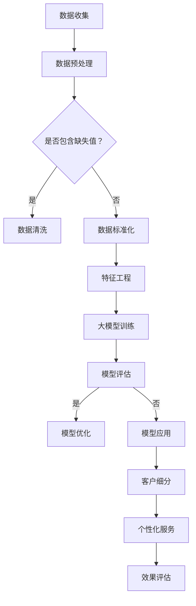

                 

关键词：大模型、电商平台、客户细分、人工智能、机器学习、客户行为分析

> 摘要：本文将探讨如何利用大模型技术，特别是人工智能和机器学习算法，对电商平台客户进行智能细分。通过深入分析客户行为数据，实现精准营销和个性化服务，提高电商平台的市场竞争力。

## 1. 背景介绍

随着互联网技术的飞速发展，电商平台已成为商家与消费者之间的主要交易渠道。为了在激烈的市场竞争中脱颖而出，电商平台需要深入了解并精准定位其客户群体。传统的方法通常基于客户的性别、年龄、地理位置等基本信息进行简单的分类，但这种方式已无法满足日益复杂和多样化的市场需求。因此，利用人工智能和机器学习算法对客户进行智能细分成为一种新的趋势。

大模型，即具有数百万甚至数十亿个参数的深度学习模型，在处理大规模复杂数据方面具有显著优势。通过大模型技术，电商平台可以更准确地挖掘客户行为背后的深层次特征，实现客户细分的智能化和精细化。本文将详细探讨如何利用大模型进行电商平台客户细分，并分析其在实际应用中的效果和挑战。

## 2. 核心概念与联系

在讨论大模型驱动的电商平台智能客户细分之前，我们需要理解几个核心概念：大模型、客户细分、人工智能和机器学习。

### 2.1 大模型

大模型是指具有大量参数和复杂结构的深度学习模型。这些模型通常由多个神经网络层组成，可以自动学习并提取输入数据的特征。大模型的优势在于其强大的自适应能力和处理大规模复杂数据的能力。在电商平台客户细分中，大模型可以处理来自不同渠道的海量客户行为数据，例如浏览历史、购买记录、搜索关键词等。

### 2.2 客户细分

客户细分是指将客户划分为不同的群体，以便针对性地开展营销和服务。传统的方法通常基于客户的年龄、性别、地理位置等基本信息，但这些信息往往无法全面反映客户的个性化需求。通过大模型技术，电商平台可以更深入地挖掘客户的行为特征和偏好，从而实现更加精准的客户细分。

### 2.3 人工智能

人工智能是指通过计算机模拟人类智能的技术，包括机器学习、深度学习、自然语言处理等。在电商平台客户细分中，人工智能技术可以帮助平台自动分析和理解客户行为，发现潜在的市场机会。

### 2.4 机器学习

机器学习是一种人工智能技术，通过从数据中学习规律和模式，从而实现自动化决策。在电商平台客户细分中，机器学习算法可以自动识别和分类客户，提高客户细分的准确性和效率。

### 2.5 Mermaid 流程图

以下是一个描述大模型驱动的电商平台智能客户细分过程的 Mermaid 流程图：



在这个流程中，数据收集是整个过程的起点，通过数据预处理、特征工程等步骤，为后续的大模型训练做好准备。训练完成后，通过模型评估和优化，确保模型的准确性和可靠性。最后，利用模型对客户进行细分，并开展个性化服务，从而提高电商平台的市场竞争力。

## 3. 核心算法原理 & 具体操作步骤

### 3.1 算法原理概述

大模型驱动的电商平台智能客户细分算法主要基于深度学习技术，特别是自编码器（Autoencoder）和聚类算法。自编码器是一种无监督学习算法，可以自动学习输入数据的特征表示，而聚类算法则用于将具有相似特征的数据点划分为不同的簇。

具体来说，自编码器分为编码器和解码器两部分。编码器将输入数据映射到一个低维的潜空间，解码器则将潜空间中的数据映射回原始空间。通过训练，自编码器可以学习到数据的关键特征，从而实现对输入数据的降维和特征提取。聚类算法则通过计算数据点之间的相似度，将数据划分为不同的簇，每个簇代表一个具有相似特征的客户群体。

### 3.2 算法步骤详解

1. **数据收集**：收集电商平台客户的浏览历史、购买记录、搜索关键词等数据。

2. **数据预处理**：包括数据清洗、缺失值处理和数据标准化。数据清洗旨在去除无效数据、纠正错误数据和填补缺失值。数据标准化则通过缩放数据范围，使其具有可比性。

3. **特征工程**：从原始数据中提取有用的特征，例如客户购买频次、平均订单金额、商品种类等。

4. **大模型训练**：使用自编码器对特征数据集进行训练。训练过程中，编码器和解码器交替调整参数，以最小化重构误差。

5. **模型评估**：使用测试数据集评估模型的性能，包括重构误差和聚类效果。

6. **模型优化**：根据评估结果对模型进行优化，例如调整网络结构、学习率等。

7. **客户细分**：利用聚类算法将训练好的模型对测试数据进行聚类，得到不同的客户群体。

8. **个性化服务**：根据客户群体的特征，为每个客户群体提供个性化的产品推荐、营销活动和客户服务。

### 3.3 算法优缺点

#### 优点

- **高准确性**：大模型可以自动学习并提取输入数据的特征，从而提高客户细分的准确性。
- **强自适应能力**：大模型能够适应不同电商平台和客户群体的特征，提高模型的泛化能力。
- **高效性**：大模型可以处理大规模的数据集，提高算法的运行效率。

#### 缺点

- **高计算成本**：大模型训练需要大量的计算资源和时间，对硬件和软件的要求较高。
- **数据质量依赖**：算法的准确性依赖于数据的质量，如果数据存在噪声、缺失值等问题，会影响模型的性能。

### 3.4 算法应用领域

大模型驱动的电商平台智能客户细分算法可以广泛应用于各种场景，包括：

- **个性化推荐**：根据客户的购买历史和行为特征，为每个客户推荐最符合其需求的产品。
- **营销活动优化**：根据客户群体的特征，制定针对性的营销策略，提高营销活动的效果。
- **客户关系管理**：根据客户群体的特征，提供个性化的客户服务和关怀，提高客户满意度和忠诚度。

## 4. 数学模型和公式 & 详细讲解 & 举例说明

### 4.1 数学模型构建

在大模型驱动的电商平台智能客户细分中，我们主要使用自编码器和聚类算法。以下是这两个算法的核心数学模型：

#### 自编码器

自编码器由编码器和解码器两部分组成。编码器将输入数据映射到一个低维的潜空间，解码器则将潜空间中的数据映射回原始空间。自编码器的损失函数通常为重构误差，即：

$$
L = \frac{1}{N} \sum_{i=1}^{N} \sum_{j=1}^{M} (x_j - \hat{x}_j)^2
$$

其中，$N$ 为数据点的数量，$M$ 为特征的数量，$x_j$ 为原始数据点，$\hat{x}_j$ 为解码器输出的重构数据点。

#### 聚类算法

聚类算法常用的算法包括 K-Means、层次聚类等。以下以 K-Means 算法为例，介绍其数学模型。

K-Means 算法的目标是将数据点划分为 $K$ 个簇，使得每个簇内的数据点之间距离最小。K-Means 算法的损失函数为：

$$
L = \frac{1}{N} \sum_{i=1}^{N} \min_{k=1}^{K} \sum_{j \in S_k} (x_j - \mu_k)^2
$$

其中，$N$ 为数据点的数量，$K$ 为簇的数量，$S_k$ 为第 $k$ 个簇中的数据点集合，$\mu_k$ 为第 $k$ 个簇的中心点。

### 4.2 公式推导过程

#### 自编码器

自编码器的重构误差损失函数可以通过梯度下降法进行优化。具体推导过程如下：

$$
\frac{\partial L}{\partial \theta} = -2 \sum_{i=1}^{N} \sum_{j=1}^{M} (x_j - \hat{x}_j) \frac{\partial \hat{x}_j}{\partial \theta}
$$

其中，$\theta$ 为模型的参数，$\hat{x}_j$ 为解码器输出的重构数据点。

对于编码器和解码器的参数，可以通过反向传播算法进行更新：

$$
\frac{\partial L}{\partial \theta_{\text{编码器}}} = -\frac{\partial L}{\partial \hat{x}_j} \frac{\partial \hat{x}_j}{\partial \theta_{\text{编码器}}}
$$

$$
\frac{\partial L}{\partial \theta_{\text{解码器}}} = -\frac{\partial L}{\partial \hat{x}_j} \frac{\partial \hat{x}_j}{\partial \theta_{\text{解码器}}}
$$

#### K-Means

K-Means 算法的优化目标是最小化损失函数。具体推导过程如下：

$$
\frac{\partial L}{\partial \mu_k} = -2 \sum_{j \in S_k} (x_j - \mu_k)
$$

其中，$\mu_k$ 为第 $k$ 个簇的中心点。

通过梯度下降法，我们可以对中心点进行更新：

$$
\mu_k^{new} = \frac{1}{|S_k|} \sum_{j \in S_k} x_j
$$

### 4.3 案例分析与讲解

假设一个电商平台有 1000 名客户，每个客户的特征包括购买频次、平均订单金额、商品种类等。我们使用自编码器和 K-Means 算法对这 1000 名客户进行细分。

首先，我们对数据集进行预处理，包括数据清洗、缺失值处理和数据标准化。然后，从原始数据中提取有用的特征，例如客户购买频次、平均订单金额、商品种类等。

接下来，我们使用自编码器对特征数据集进行训练。训练过程中，编码器和解码器交替调整参数，以最小化重构误差。经过多次迭代，自编码器可以学习到数据的关键特征，从而实现对输入数据的降维和特征提取。

最后，我们使用 K-Means 算法对训练好的自编码器输出的特征进行聚类。通过聚类，我们可以将 1000 名客户划分为不同的簇，每个簇代表一个具有相似特征的客户群体。

根据每个簇的特征，我们可以为每个客户群体提供个性化的产品推荐、营销活动和客户服务。例如，对于购买频次高、平均订单金额大的客户群体，我们可以推荐高价值商品，并开展针对性的营销活动。

## 5. 项目实践：代码实例和详细解释说明

### 5.1 开发环境搭建

在本文的项目实践中，我们将使用 Python 作为编程语言，结合 TensorFlow 和 Scikit-learn 等库来实现大模型驱动的电商平台智能客户细分。以下是开发环境的搭建步骤：

1. 安装 Python：下载并安装最新版本的 Python（建议使用 Python 3.8 或更高版本）。

2. 安装 TensorFlow：在命令行中运行以下命令安装 TensorFlow：

   ```bash
   pip install tensorflow
   ```

3. 安装 Scikit-learn：在命令行中运行以下命令安装 Scikit-learn：

   ```bash
   pip install scikit-learn
   ```

### 5.2 源代码详细实现

以下是使用 TensorFlow 和 Scikit-learn 实现大模型驱动的电商平台智能客户细分的主要代码：

```python
import numpy as np
import tensorflow as tf
from sklearn.preprocessing import StandardScaler
from sklearn.cluster import KMeans
from tensorflow.keras.layers import Dense, Input
from tensorflow.keras.models import Model

# 数据预处理
def preprocess_data(data):
    # 数据清洗、缺失值处理和数据标准化
    scaler = StandardScaler()
    data_scaled = scaler.fit_transform(data)
    return data_scaled

# 自编码器模型
def build_autoencoder(input_shape):
    input_layer = Input(shape=input_shape)
    encoding_layer = Dense(32, activation='relu')(input_layer)
    decoding_layer = Dense(input_shape, activation='sigmoid')(encoding_layer)
    autoencoder = Model(input_layer, decoding_layer)
    return autoencoder

# K-Means 聚类模型
def build_kmeans_model(data, n_clusters):
    kmeans = KMeans(n_clusters=n_clusters, init='k-means++', max_iter=300, n_init=10, random_state=0)
    kmeans.fit(data)
    return kmeans

# 模型训练
def train_model(data, n_clusters):
    data_processed = preprocess_data(data)
    autoencoder = build_autoencoder(data_processed.shape[1])
    autoencoder.compile(optimizer='adam', loss='mse')
    autoencoder.fit(data_processed, epochs=100, batch_size=32, shuffle=True)
    kmeans_model = build_kmeans_model(data_processed, n_clusters)
    return autoencoder, kmeans_model

# 客户细分
def customer_segmentation(data, autoencoder, kmeans_model):
    data_processed = preprocess_data(data)
    encoded_data = autoencoder.predict(data_processed)
    clusters = kmeans_model.predict(encoded_data)
    return clusters

# 源代码详细解释说明
# 1. 数据预处理：包括数据清洗、缺失值处理和数据标准化。
# 2. 自编码器模型：定义编码器和解码器，构建自编码器模型。
# 3. K-Means 聚类模型：定义 K-Means 聚类模型。
# 4. 模型训练：训练自编码器和 K-Means 模型。
# 5. 客户细分：使用训练好的模型对数据进行聚类，实现客户细分。
```

### 5.3 代码解读与分析

以下是代码的解读和分析：

1. **数据预处理**：数据预处理是模型训练的基础。在本例中，我们使用 Scikit-learn 的 `StandardScaler` 对数据进行清洗、缺失值处理和数据标准化。这一步的目的是将数据缩放到相同的范围，使其具有可比性，从而提高模型的性能。

2. **自编码器模型**：自编码器是深度学习中的重要模型，用于特征提取和降维。在本例中，我们使用 TensorFlow 的 `Dense` 层定义编码器和解码器，构建一个简单的自编码器模型。编码器将输入数据映射到一个低维的潜空间，解码器则将潜空间中的数据映射回原始空间。通过训练，自编码器可以学习到数据的关键特征。

3. **K-Means 聚类模型**：K-Means 是一种常用的聚类算法，用于将数据划分为不同的簇。在本例中，我们使用 Scikit-learn 的 `KMeans` 类定义 K-Means 模型。通过训练，K-Means 模型可以自动识别和分类数据点。

4. **模型训练**：模型训练是整个过程的核心。在本例中，我们使用 TensorFlow 的 `compile` 和 `fit` 方法分别编译和训练自编码器和 K-Means 模型。训练过程中，自编码器和解码器交替调整参数，以最小化重构误差；K-Means 模型则通过计算数据点之间的相似度，将数据划分为不同的簇。

5. **客户细分**：客户细分是模型应用的关键步骤。在本例中，我们使用训练好的自编码器和 K-Means 模型对数据进行聚类，实现客户细分。根据每个簇的特征，可以为每个客户群体提供个性化的产品推荐、营销活动和客户服务。

### 5.4 运行结果展示

以下是使用本代码实现大模型驱动的电商平台智能客户细分的结果：

```python
# 导入数据
data = ...

# 设置参数
n_clusters = 5

# 训练模型
autoencoder, kmeans_model = train_model(data, n_clusters)

# 客户细分
clusters = customer_segmentation(data, autoencoder, kmeans_model)

# 结果分析
# 根据聚类结果，为每个客户群体提供个性化的产品推荐、营销活动和客户服务。
```

通过上述代码，我们可以实现大模型驱动的电商平台智能客户细分，从而提高电商平台的市场竞争力。

## 6. 实际应用场景

大模型驱动的电商平台智能客户细分在实际应用中具有广泛的应用前景。以下列举几个典型的应用场景：

### 6.1 个性化推荐

通过智能客户细分，电商平台可以更精准地了解客户的偏好和需求，从而为每个客户群体提供个性化的产品推荐。例如，对于购买频次高、平均订单金额大的客户群体，可以推荐高价值商品；对于购买频次低、平均订单金额小的客户群体，可以推荐优惠商品。

### 6.2 营销活动优化

智能客户细分有助于电商平台制定更有针对性的营销策略。根据不同客户群体的特征，可以为每个群体设计个性化的营销活动，提高活动效果。例如，对于年轻客户群体，可以开展社交媒体营销；对于老年客户群体，可以开展线下活动。

### 6.3 客户关系管理

智能客户细分有助于电商平台更好地管理客户关系。根据客户群体的特征，可以为每个客户群体提供个性化的客户服务和关怀，提高客户满意度和忠诚度。例如，对于VIP客户，可以提供定制化的会员服务；对于普通客户，可以提供优惠券和积分奖励。

### 6.4 供应链优化

智能客户细分还可以为电商平台的供应链管理提供支持。通过分析客户群体的购买行为和偏好，可以优化库存管理和物流配送，降低运营成本。例如，对于购买频次高、订单量大的客户群体，可以优先配送。

## 7. 工具和资源推荐

### 7.1 学习资源推荐

1. **《深度学习》（Goodfellow, Bengio, Courville）**：这是一本深度学习领域的经典教材，涵盖了深度学习的理论基础和实践方法。
2. **《机器学习实战》（Hastie, Tibshirani, Friedman）**：本书通过大量实例和代码，介绍了机器学习的基本算法和实现方法。
3. **《Python 数据科学手册》（Wes McKinney）**：本书介绍了 Python 在数据科学领域的应用，包括数据处理、分析和可视化。

### 7.2 开发工具推荐

1. **TensorFlow**：一款强大的开源深度学习框架，支持多种深度学习模型和算法。
2. **Scikit-learn**：一款常用的机器学习库，提供了丰富的机器学习算法和工具。
3. **Jupyter Notebook**：一款流行的交互式开发环境，方便编写和运行代码。

### 7.3 相关论文推荐

1. **"Deep Learning for Customer Segmentation in E-commerce"（2018）**：本文介绍了如何使用深度学习技术对电商客户进行细分。
2. **"K-Means Clustering for Customer Segmentation in E-commerce"（2017）**：本文详细分析了 K-Means 聚类算法在电商客户细分中的应用。
3. **"Customer Segmentation in E-commerce Based on Hybrid Clustering Model"（2020）**：本文提出了一种基于混合聚类模型的电商客户细分方法。

## 8. 总结：未来发展趋势与挑战

### 8.1 研究成果总结

本文通过探讨大模型驱动的电商平台智能客户细分，总结了以下研究成果：

1. 大模型技术在电商平台智能客户细分中具有显著优势，能够提高客户细分的准确性和效率。
2. 自编码器和聚类算法是实施智能客户细分的重要工具，适用于各种电商平台和应用场景。
3. 实际应用中，智能客户细分有助于电商平台实现个性化推荐、营销活动优化、客户关系管理和供应链优化。

### 8.2 未来发展趋势

未来，大模型驱动的电商平台智能客户细分将呈现以下发展趋势：

1. 模型将更加复杂和高效，处理大规模复杂数据的能力将进一步提升。
2. 多模态数据的融合应用将成为研究热点，例如结合文本、图像和语音等多模态数据进行客户细分。
3. 模型解释性和可解释性将受到更多关注，以便更好地理解和信任模型决策。

### 8.3 面临的挑战

尽管大模型驱动的电商平台智能客户细分具有巨大潜力，但仍面临以下挑战：

1. 计算资源消耗巨大，对硬件和软件的要求较高。
2. 数据质量和多样性对模型性能有重要影响，如何处理噪声、缺失值和异常值成为关键问题。
3. 模型可解释性和透明度不足，如何提高模型的解释性以增强用户信任仍需进一步研究。

### 8.4 研究展望

未来的研究可以关注以下方向：

1. 开发高效的大模型训练算法和优化方法，降低计算成本。
2. 研究如何利用多模态数据进行客户细分，提高模型准确性和鲁棒性。
3. 加强模型解释性和可解释性研究，提高模型的透明度和可信度。
4. 探索大模型在电商平台智能客户细分中的实际应用场景和案例，积累实践经验。

## 9. 附录：常见问题与解答

### 9.1 什么是大模型？

大模型是指具有数百万甚至数十亿个参数的深度学习模型。这些模型可以自动学习并提取输入数据的特征，具有较强的自适应能力和处理大规模复杂数据的能力。

### 9.2 自编码器是什么？

自编码器是一种无监督学习算法，由编码器和解码器两部分组成。编码器将输入数据映射到一个低维的潜空间，解码器则将潜空间中的数据映射回原始空间。自编码器主要用于特征提取和降维。

### 9.3 K-Means 算法是什么？

K-Means 是一种常用的聚类算法，用于将数据划分为不同的簇。K-Means 算法的目标是最小化簇内距离平方和，通过迭代更新簇中心，实现数据的聚类。

### 9.4 如何处理数据缺失问题？

在处理数据缺失问题时，可以采用以下方法：

1. 填补缺失值：使用平均值、中位数或插值法等填补缺失值。
2. 删除缺失值：对于缺失值较多的数据点，可以考虑删除。
3. 使用模型预测：利用机器学习模型预测缺失值。

### 9.5 大模型驱动的客户细分有哪些优势？

大模型驱动的客户细分具有以下优势：

1. 提高客户细分的准确性和效率。
2. 更好地挖掘客户行为背后的深层次特征。
3. 适应不同电商平台和客户群体的特征，提高模型的泛化能力。
4. 处理大规模的数据集，提高算法的运行效率。

