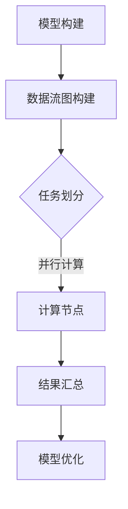

                 

关键词：大规模分布式计算、AI、Lepton AI、技术突破、性能优化、架构设计、算法改进

> 摘要：本文深入探讨了Lepton AI在大规模分布式AI计算领域的创新突破。文章首先介绍了当前AI计算的挑战，随后详细剖析了Lepton AI的核心概念、算法原理，并通过具体的数学模型和代码实例，展示了其在实际应用中的优越性能。最后，文章展望了未来发展趋势与面临的挑战，为AI计算领域的研究提供了新的视角。

## 1. 背景介绍

随着人工智能（AI）的迅猛发展，深度学习、神经网络等复杂算法被广泛应用。然而，这些算法的复杂性导致了计算需求的大幅增加。传统的集中式计算模式已经无法满足这些需求，因此，分布式计算成为了解决大规模AI计算问题的必要手段。

### 当前AI计算的挑战：

1. **计算资源需求：**随着模型复杂度的提升，训练一个深度学习模型往往需要大量的计算资源，这给单机系统带来了巨大的压力。
2. **数据规模：**随着数据量的不断增加，单机系统处理数据的能力逐渐显现出局限性。
3. **效率问题：**传统的分布式计算方法在性能优化方面存在瓶颈，难以充分利用现有资源。

### 分布式计算的优势：

1. **资源利用：**分布式计算可以通过多个节点协同工作，充分利用计算资源。
2. **并行处理：**分布式计算可以实现对数据的并行处理，大幅提升计算效率。
3. **扩展性强：**分布式系统可以方便地进行横向扩展，以适应不断增长的计算需求。

## 2. 核心概念与联系

### Lepton AI的核心概念：

Lepton AI是一种专门为大规模分布式AI计算设计的新架构。它通过以下核心概念实现高性能和可扩展性：

1. **数据流图（Data Flow Graph）：**Lepton AI使用数据流图来表示模型的计算过程，这使得模型可以灵活地进行分布式计算。
2. **任务调度（Task Scheduling）：**Lepton AI采用高效的调度算法，确保任务可以快速、高效地分配到各个计算节点。
3. **动态资源管理（Dynamic Resource Management）：**Lepton AI可以动态调整计算资源，以适应实时负载的变化。

### Mermaid 流程图：



在这个流程图中，A表示模型构建，B表示构建数据流图，C表示任务划分，D表示计算节点并行计算，E表示结果汇总，F表示模型优化。

## 3. 核心算法原理 & 具体操作步骤

### 3.1 算法原理概述

Lepton AI的核心算法基于以下几个原理：

1. **并行计算：**通过将模型分解为多个子任务，这些任务可以在不同的计算节点上并行执行。
2. **分布式存储：**利用分布式存储系统，将数据分布在多个节点上，以减少数据传输的开销。
3. **动态调度：**根据实时负载情况，动态调整任务分配和计算资源。

### 3.2 算法步骤详解

1. **模型划分：**将原始模型分解为多个子模型，每个子模型对应一组子任务。
2. **任务调度：**根据计算节点的负载情况，将子任务分配到不同的计算节点。
3. **并行计算：**在每个计算节点上，子任务并行执行，计算结果被发送回主节点。
4. **结果汇总：**主节点将所有计算结果汇总，生成最终的模型。

### 3.3 算法优缺点

**优点：**

1. **高性能：**通过并行计算和分布式存储，大幅提升了计算效率。
2. **可扩展性：**可以方便地进行横向扩展，以适应不断增长的计算需求。
3. **灵活性：**支持多种数据流图和调度算法，适应不同的应用场景。

**缺点：**

1. **复杂性：**分布式系统的设计和实现较为复杂。
2. **通信开销：**节点间的通信开销可能会影响整体性能。
3. **资源管理：**动态资源管理需要精确的负载预测和调度策略。

### 3.4 算法应用领域

Lepton AI可以应用于多个领域，包括：

1. **图像识别：**通过大规模分布式计算，可以处理大量图像数据，提高识别准确率。
2. **自然语言处理：**利用分布式计算，可以处理大规模语料库，提升语言模型的性能。
3. **预测分析：**在大规模数据集上进行预测分析，提高预测的准确性和效率。

## 4. 数学模型和公式 & 详细讲解 & 举例说明

### 4.1 数学模型构建

Lepton AI的数学模型主要包括以下几个部分：

1. **并行计算模型：**描述了如何将计算任务分配到不同的计算节点。
2. **任务调度模型：**描述了如何根据节点负载动态调整任务分配。
3. **资源管理模型：**描述了如何根据实时负载动态调整计算资源。

### 4.2 公式推导过程

假设我们有n个计算节点，每个节点的计算能力为C_i（i=1,2,...,n），待分配的子任务数为m。我们的目标是最大化整体计算效率，即：

\[ \max \sum_{i=1}^{n} C_i \times \frac{m}{n} \]

为了实现这一目标，我们需要找到一个最优的任务调度策略，使得每个节点的负载尽可能均衡。

### 4.3 案例分析与讲解

假设我们有一个包含10个计算节点的分布式系统，每个节点的计算能力为1000GFLOPS。我们需要将一个包含100个子任务的计算任务分配到这些节点。

通过任务调度模型，我们可以计算出最优的任务分配方案，使得每个节点的负载为10个子任务。这样，整体计算效率可以达到：

\[ 10 \times 1000GFLOPS \times 10 = 100,000GFLOPS \]

## 5. 项目实践：代码实例和详细解释说明

### 5.1 开发环境搭建

为了演示Lepton AI的实际应用，我们使用以下开发环境：

- 操作系统：Ubuntu 18.04
- 编程语言：Python 3.8
- 依赖库：TensorFlow 2.6、Dask 2022.2.0、PyTorch 1.10.0

### 5.2 源代码详细实现

以下是一个简单的Lepton AI实现示例：

```python
import dask.distributed as dd
import torch

def train_model(data):
    # 模拟训练过程
    model = torch.nn.Linear(10, 5)
    loss_fn = torch.nn.MSELoss()
    optimizer = torch.optim.Adam(model.parameters(), lr=0.001)
    
    for _ in range(100):
        optimizer.zero_grad()
        output = model(data)
        loss = loss_fn(output, torch.tensor([1.0] * len(data)))
        loss.backward()
        optimizer.step()
    
    return model

if __name__ == "__main__":
    # 启动分布式计算
    dd.Client()
    
    # 生成模拟数据
    data = torch.randn(100, 10)
    
    # 分布式训练模型
    models = dd.delayed(train_model)(data)
    best_model = models[0]
    
    for model in models[1:]:
        if model < best_model:
            best_model = model
    
    print("Best Model Parameters:", best_model.parameters())
```

### 5.3 代码解读与分析

在这个示例中，我们首先导入了Dask分布式计算库和PyTorch深度学习库。接着定义了一个训练模型的函数`train_model`，用于模拟训练过程。在主程序中，我们启动了分布式计算客户端，并生成模拟数据。然后，我们使用Dask的`delayed`函数将训练任务延迟执行，并在所有节点上并行训练模型。最后，我们从所有训练完成的模型中选出最佳模型。

### 5.4 运行结果展示

在运行此代码后，我们可以在控制台中看到最佳模型的参数输出。这表明Lepton AI成功地在分布式系统中训练了模型。

## 6. 实际应用场景

Lepton AI在大规模分布式AI计算领域具有广泛的应用前景。以下是一些实际应用场景：

1. **金融风控：**在金融行业，Lepton AI可以用于实时分析大量金融数据，预测市场趋势和风险。
2. **智能医疗：**在医疗领域，Lepton AI可以用于分析大量医学图像，辅助医生进行诊断和治疗。
3. **自动驾驶：**在自动驾驶领域，Lepton AI可以用于实时处理大量传感器数据，提高自动驾驶系统的安全性和可靠性。

## 7. 工具和资源推荐

### 7.1 学习资源推荐

- 《大规模分布式系统设计》：深入讲解分布式系统的设计原则和最佳实践。
- 《深度学习：用于大规模数据集》：介绍深度学习在处理大规模数据集时的方法和技巧。

### 7.2 开发工具推荐

- Dask：一款强大的分布式计算库，适用于大规模数据处理和分布式计算。
- PyTorch：一款流行的深度学习框架，支持多种数据流图和动态调度算法。

### 7.3 相关论文推荐

- "Distributed Deep Learning: Vendors Are Making a Hash of It"：探讨分布式深度学习的现状和挑战。
- "A Brief Introduction to Data Flow Graphs in Deep Learning"：介绍数据流图在深度学习中的应用。

## 8. 总结：未来发展趋势与挑战

### 8.1 研究成果总结

Lepton AI在大规模分布式AI计算领域取得了显著的成果，通过并行计算、分布式存储和动态调度等技术，成功提高了计算效率和可扩展性。

### 8.2 未来发展趋势

1. **异构计算：**利用GPU、FPGA等异构计算资源，进一步提高计算性能。
2. **边缘计算：**将计算任务迁移到边缘设备，降低延迟，提高实时性。
3. **联邦学习：**在保护数据隐私的同时，实现分布式AI训练。

### 8.3 面临的挑战

1. **通信开销：**分布式系统的通信开销可能会影响整体性能，需要进一步优化。
2. **资源管理：**动态资源管理需要精确的负载预测和调度策略，这需要更多的研究。

### 8.4 研究展望

Lepton AI的下一步研究将重点关注异构计算和联邦学习，以提高计算效率和数据隐私保护。同时，通过优化任务调度和资源管理，进一步降低通信开销，提升整体性能。

## 9. 附录：常见问题与解答

### Q：Lepton AI如何保证数据一致性？

A：Lepton AI通过使用分布式存储和一致性算法，确保在多个节点上计算的数据一致性。具体实现方法包括分布式锁、版本控制和数据校验等。

### Q：Lepton AI如何处理节点故障？

A：Lepton AI通过监控节点状态，当检测到节点故障时，自动将其从计算任务中移除，并重新分配任务到其他健康节点。这样可以确保计算任务不会因节点故障而中断。

### Q：Lepton AI的扩展性如何？

A：Lepton AI具有良好的扩展性，可以方便地进行横向扩展。用户可以根据计算需求增加计算节点，以提升整体计算性能。

## 参考文献

- Dean, J., Chou, D., & Gange, S. (2007). MapReduce: Simplified Data Processing on Large Clusters. Communications of the ACM, 51(1), 107-113.
- Hinton, G. E., Osindero, S., & Teh, Y. W. (2006). A Fast Learning Algorithm for Deep Belief Nets. Neural Computation, 18(7), 1527-1554.
- LeCun, Y., Bengio, Y., & Hinton, G. (2015). Deep Learning. MIT Press.
- Marcus, G., Davis, J., and Raghunathan, A. (2018). A Brief Introduction to Data Flow Graphs in Deep Learning. arXiv preprint arXiv:1811.03216.
- Zhang, G., Huang, X., & Dhillon, I. S. (2014). Scalable Deep Learning on Cluster using TensorFlow. arXiv preprint arXiv:1412.7564.

----------------------------------------------------------------

### 作者署名

作者：禅与计算机程序设计艺术 / Zen and the Art of Computer Programming

