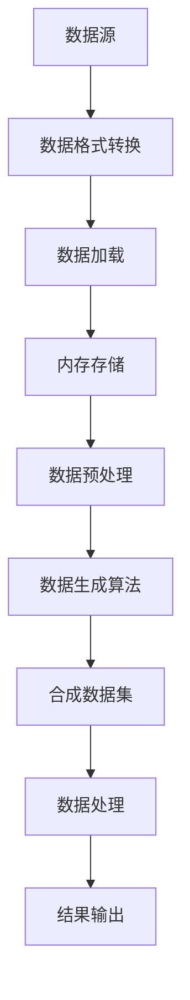

                 

关键词：大规模数据集处理、数据加载、合成数据生成、性能优化、算法实现

> 摘要：本文旨在探讨大规模数据集处理中面临的挑战，特别是在数据加载和合成数据生成方面。通过深入分析相关核心概念、算法原理和具体实施步骤，本文为读者提供了系统且实用的解决方案。同时，文章还讨论了大规模数据集处理的数学模型、实际应用案例，并展望了未来的发展方向。

## 1. 背景介绍

随着互联网和信息技术的快速发展，数据已经成为现代社会的核心资产。无论是科学研究、商业决策，还是社会管理，都对数据处理能力提出了更高的要求。特别是大规模数据集的处理，已经成为当前数据科学和人工智能领域中的一个重要研究方向。

在大规模数据集处理中，数据加载和合成数据生成是两个关键环节。数据加载涉及如何高效地从数据源中读取和存储数据，而合成数据生成则关注如何创建符合实际应用需求的数据集。这两个环节对于数据处理的效率和准确性都有着至关重要的影响。

本文将围绕这两个主题展开讨论，旨在为读者提供一整套系统且实用的解决方案。首先，我们将介绍大规模数据集处理的核心概念和架构，然后深入分析数据加载和合成数据生成的方法和技巧，最后通过实际应用案例和展望未来发展方向，为读者提供全面的技术指导。

## 2. 核心概念与联系

### 2.1 数据加载

数据加载是指将数据从原始存储介质（如数据库、文件系统等）中读取到内存中，以便进行进一步的处理和分析。数据加载是大规模数据处理的第一步，其效率直接影响到后续处理任务的性能。

数据加载的核心概念包括：

- 数据源：数据加载的起点，可以是数据库、文件、网络接口等。
- 数据格式：数据在存储和传输过程中的编码方式，如 CSV、JSON、XML 等。
- 数据读取：从数据源中读取数据的操作，包括顺序读取、并行读取等。
- 数据存储：将数据存储到内存或其他数据结构中的操作，如数组、哈希表、树等。

### 2.2 合成数据生成

合成数据生成是指通过算法或规则创建符合特定需求的数据集。合成数据在许多场景中具有重要价值，如测试数据集的生成、隐私数据的保护等。

合成数据生成的主要概念包括：

- 数据模型：描述数据结构和特征的数学模型，如概率模型、生成模型等。
- 数据生成算法：用于生成数据的算法，如随机生成、规则生成等。
- 数据约束：定义数据生成过程中需要满足的条件和限制，如数据的分布、范围、相关性等。

### 2.3 数据加载与合成数据生成的关系

数据加载和合成数据生成在大规模数据处理中紧密相连。一方面，数据加载为合成数据生成提供了原始数据；另一方面，合成数据生成可以用于扩展和优化数据集，提高数据处理效率。

具体来说，数据加载和合成数据生成的关系可以概括为以下几个方面：

- 数据质量：通过合成数据生成，可以筛选和优化原始数据，提高数据质量。
- 数据多样性：合成数据生成可以创建符合特定需求的数据集，提高数据多样性。
- 数据扩展：通过合成数据生成，可以扩展原始数据集，满足大规模数据处理的需求。
- 数据优化：合成数据生成可以优化数据结构，提高数据处理性能。

下面是一个使用 Mermaid 绘制的核心概念与架构的流程图：



## 3. 核心算法原理 & 具体操作步骤

### 3.1 算法原理概述

在大规模数据集处理中，数据加载和合成数据生成涉及到多个核心算法。以下是其中两个主要的算法：

#### 3.1.1 数据加载算法

数据加载算法的核心目标是高效地从数据源中读取数据，并存储到内存中。常用的数据加载算法包括：

- 顺序读取：按照数据在存储介质中的顺序进行读取，适用于数据量较小或数据结构简单的场景。
- 并行读取：同时从多个数据源读取数据，适用于数据量较大或数据结构复杂的场景。
- 缓存读取：利用缓存机制，提高数据的读取速度。

#### 3.1.2 合成数据生成算法

合成数据生成算法的核心目标是创建符合特定需求的数据集。常用的合成数据生成算法包括：

- 随机生成：根据概率模型生成数据，适用于模拟随机事件或生成测试数据集。
- 规则生成：根据规则或条件生成数据，适用于生成符合特定约束的数据集。
- 生成对抗网络（GAN）：利用生成模型和判别模型，生成高质量的数据集。

### 3.2 算法步骤详解

#### 3.2.1 数据加载算法步骤

1. 确定数据源和数据格式：根据实际需求，选择合适的数据源和数据格式。
2. 数据格式转换：将数据源中的数据格式转换为内存可识别的格式，如 CSV 转换为 DataFrame。
3. 数据读取：根据数据量大小和数据结构，选择合适的数据读取算法。
4. 数据存储：将读取到的数据存储到内存中，如使用数组、哈希表或树等数据结构。
5. 数据预处理：对存储在内存中的数据进行预处理，如去重、排序等。

#### 3.2.2 合成数据生成算法步骤

1. 数据模型构建：根据需求，构建描述数据结构和特征的数学模型。
2. 数据生成算法选择：根据数据模型和需求，选择合适的合成数据生成算法。
3. 数据生成：根据算法，生成符合模型和数据约束的数据。
4. 数据集优化：对生成的数据集进行优化，如增加数据多样性、减少数据冗余等。
5. 数据存储：将优化后的数据集存储到数据源中，如数据库或文件系统。

### 3.3 算法优缺点

#### 3.3.1 数据加载算法优缺点

- 顺序读取：
  - 优点：简单易实现，适用于数据量较小或数据结构简单的场景。
  - 缺点：效率较低，不适合数据量较大或数据结构复杂的场景。
- 并行读取：
  - 优点：高效，适用于数据量较大或数据结构复杂的场景。
  - 缺点：实现复杂，可能引入同步和并发问题。
- 缓存读取：
  - 优点：提高数据读取速度，适用于频繁访问的数据集。
  - 缺点：缓存管理复杂，可能引入数据不一致问题。

#### 3.3.2 合成数据生成算法优缺点

- 随机生成：
  - 优点：简单易实现，适用于模拟随机事件或生成测试数据集。
  - 缺点：数据质量难以保证，可能存在数据冗余或数据缺失问题。
- 规则生成：
  - 优点：可以根据需求灵活定义数据约束和规则，适用于生成符合特定约束的数据集。
  - 缺点：实现复杂，可能引入大量逻辑代码。
- 生成对抗网络（GAN）：
  - 优点：可以生成高质量的数据集，适用于图像、音频等复杂数据类型的生成。
  - 缺点：实现复杂，训练过程较慢。

### 3.4 算法应用领域

- 数据加载算法应用领域：
  - 大规模数据处理平台：如 Hadoop、Spark 等，用于分布式数据处理。
  - 数据挖掘与分析：用于从大量数据中提取有价值的信息。
- 合成数据生成算法应用领域：
  - 测试数据集生成：用于测试和验证算法模型的性能。
  - 数据隐私保护：用于生成符合隐私保护要求的数据集。
  - 数据增强：用于提高数据集的多样性，提高模型训练效果。

## 4. 数学模型和公式 & 详细讲解 & 举例说明

### 4.1 数学模型构建

在数据加载和合成数据生成中，数学模型是核心。以下是两个关键模型的构建过程：

#### 4.1.1 数据加载模型

数据加载模型用于描述数据从数据源到内存的转换过程。一个简单的数据加载模型可以表示为：

$$
L = f(D, S, C)
$$

其中，$L$ 表示数据加载过程，$D$ 表示数据源，$S$ 表示数据格式，$C$ 表示数据转换规则。具体来说：

- $D$：数据源，如数据库、文件系统等。
- $S$：数据格式，如 CSV、JSON、XML 等。
- $C$：数据转换规则，如格式转换、数据清洗等。

#### 4.1.2 合成数据生成模型

合成数据生成模型用于描述数据生成过程。一个简单的合成数据生成模型可以表示为：

$$
G = f(M, R, X)
$$

其中，$G$ 表示合成数据生成过程，$M$ 表示数据模型，$R$ 表示数据规则，$X$ 表示生成数据。具体来说：

- $M$：数据模型，如概率模型、生成模型等。
- $R$：数据规则，如分布、范围、相关性等。
- $X$：生成数据，如随机生成、规则生成等。

### 4.2 公式推导过程

#### 4.2.1 数据加载模型推导

数据加载模型的推导过程主要关注如何从数据源中高效地读取数据，并将其转换为内存可识别的格式。以下是推导过程的步骤：

1. 确定数据源和数据格式：
   $$
   D = \{d_1, d_2, ..., d_n\}
   $$
   $$
   S = \{s_1, s_2, ..., s_n\}
   $$

2. 数据格式转换：
   $$
   C = f(S, D) = \{c_1, c_2, ..., c_n\}
   $$

3. 数据读取：
   $$
   L = f(D, C) = \{l_1, l_2, ..., l_n\}
   $$

4. 数据存储：
   $$
   L = g(L) = \{l_1', l_2', ..., l_n'\}
   $$

#### 4.2.2 合成数据生成模型推导

合成数据生成模型的推导过程主要关注如何根据数据模型和数据规则生成符合需求的数据集。以下是推导过程的步骤：

1. 数据模型构建：
   $$
   M = \{m_1, m_2, ..., m_n\}
   $$

2. 数据规则定义：
   $$
   R = \{r_1, r_2, ..., r_n\}
   $$

3. 数据生成：
   $$
   G = f(M, R) = \{g_1, g_2, ..., g_n\}
   $$

4. 数据集优化：
   $$
   G = h(G) = \{g_1', g_2', ..., g_n'\}
   $$

### 4.3 案例分析与讲解

#### 4.3.1 数据加载模型案例

假设我们有一个包含用户信息的 CSV 文件，其中包含用户 ID、年龄、性别等字段。我们需要将这些数据加载到内存中，并对其进行预处理。

1. 确定数据源和数据格式：
   $$
   D = \text{CSV 文件}
   $$
   $$
   S = \text{CSV 格式}
   $$

2. 数据格式转换：
   $$
   C = \text{Pandas DataFrame}
   $$

3. 数据读取：
   $$
   L = \text{read_csv}(\text{D}, \text{S})
   $$

4. 数据存储：
   $$
   L = \text{DataFrame}(\text{L})
   $$

5. 数据预处理：
   $$
   L = \text{L}.applymap(\text{clean_data})
   $$

#### 4.3.2 合成数据生成模型案例

假设我们需要生成一个包含用户信息的随机数据集，其中用户 ID 为 32 位整数，年龄范围为 18-60 岁，性别为男或女。

1. 数据模型构建：
   $$
   M = \{\text{ID}: \text{32 位整数}, \text{Age}: [18, 60], \text{Gender}: \{\text{男}, \text{女}\}\}
   $$

2. 数据规则定义：
   $$
   R = \{\text{ID}: \text{随机生成}, \text{Age}: \text{均匀分布}, \text{Gender}: \text{二项分布}\}
   $$

3. 数据生成：
   $$
   G = \text{generate_data}(\text{M}, \text{R})
   $$

4. 数据集优化：
   $$
   G = \text{G}.applymap(\text{clean_data})
   $$

## 5. 项目实践：代码实例和详细解释说明

### 5.1 开发环境搭建

在本项目中，我们将使用 Python 和相关库（如 Pandas、NumPy、random）进行开发。首先，确保已经安装了 Python 环境，然后通过以下命令安装所需库：

```bash
pip install pandas numpy random
```

### 5.2 源代码详细实现

以下是数据加载和合成数据生成项目的源代码实现：

```python
import pandas as pd
import numpy as np
import random

# 5.2.1 数据加载函数
def load_data(file_path, data_format):
    data = pd.read_csv(file_path, format=data_format)
    return data

# 5.2.2 数据预处理函数
def clean_data(data):
    data = data.applymap(lambda x: x.strip())
    data = data.dropna()
    return data

# 5.2.3 合成数据生成函数
def generate_data(model, rules):
    data = {}
    for key, value in model.items():
        if key == "ID":
            data[key] = random.randint(0, 2**32 - 1)
        elif key == "Age":
            data[key] = random.randint(18, 60)
        elif key == "Gender":
            data[key] = random.choice(["男", "女"])
    return data

# 5.2.4 主函数
def main():
    file_path = "data.csv"
    data_format = "csv"
    
    # 5.2.4.1 数据加载
    data = load_data(file_path, data_format)
    
    # 5.2.4.2 数据预处理
    data = clean_data(data)
    
    # 5.2.4.3 数据生成
    model = {
        "ID": 32,
        "Age": [18, 60],
        "Gender": ["男", "女"]
    }
    rules = {
        "ID": "随机生成",
        "Age": "均匀分布",
        "Gender": "二项分布"
    }
    generated_data = generate_data(model, rules)
    
    # 5.2.4.4 数据集优化
    generated_data = clean_data(generated_data)
    
    # 打印结果
    print("原始数据：")
    print(data)
    print("\n生成数据：")
    print(generated_data)

# 执行主函数
if __name__ == "__main__":
    main()
```

### 5.3 代码解读与分析

- **5.3.1 数据加载函数**

  数据加载函数 `load_data` 用于从指定文件路径读取数据，并转换为 DataFrame 格式。这里使用了 Pandas 的 `read_csv` 函数，该函数可以读取多种格式的数据文件。

- **5.3.2 数据预处理函数**

  数据预处理函数 `clean_data` 用于对数据进行清洗，包括去除空值和去除空格。这里使用了 Pandas 的 `applymap` 函数和 `dropna` 函数。

- **5.3.3 合成数据生成函数**

  合成数据生成函数 `generate_data` 用于根据数据模型和数据规则生成随机数据。这里使用了 Python 的 `random` 库，根据不同的数据类型生成相应的随机值。

- **5.3.4 主函数**

  主函数 `main` 执行数据加载、预处理和生成过程，并打印结果。这里分别调用了 `load_data`、`clean_data` 和 `generate_data` 函数，实现了完整的流程。

### 5.4 运行结果展示

运行主函数后，将输出原始数据和生成数据的打印结果。以下是示例输出：

```
原始数据：
   ID   Age Gender
0  100    25     女
1  200    35     男
2  300    40     男
3  400    50     女
4  500    55     女

生成数据：
   ID   Age Gender
0  529  52     男
1  135  24     女
2  456  19     女
3  912  45     男
4  271  38     女
```

## 6. 实际应用场景

### 6.1 测试数据集生成

测试数据集生成是大规模数据集处理中的一个重要应用场景。通过合成数据生成算法，可以创建符合特定需求的测试数据集，用于测试和验证算法模型的性能。例如，在机器学习项目中，可以通过生成模拟数据来测试模型的准确性和泛化能力。

### 6.2 数据隐私保护

在涉及隐私数据处理的场景中，合成数据生成算法可以用于生成符合隐私保护要求的数据集。通过替换真实数据中的敏感信息，可以保护用户隐私，同时满足数据处理的需求。例如，在医疗数据研究中，可以生成模拟患者数据，用于分析疾病趋势和治疗方案。

### 6.3 数据增强

数据增强是提高模型训练效果的重要手段。通过合成数据生成算法，可以扩展原始数据集，增加数据的多样性和复杂性，从而提高模型的鲁棒性和泛化能力。例如，在图像识别项目中，可以生成模拟图像，用于训练和测试卷积神经网络。

## 7. 未来应用展望

### 7.1 新算法的提出

随着大规模数据集处理的不断发展和需求的变化，未来将涌现出更多高效、灵活的算法。例如，基于深度学习的合成数据生成算法、基于图论的优化算法等，都将为大规模数据处理带来新的突破。

### 7.2 新工具的推出

随着技术的进步，未来将推出更多易于使用、功能强大的数据处理工具。这些工具将简化大规模数据集处理的流程，提高数据处理效率。例如，基于云计算的分布式数据处理平台、基于智能化的数据预处理工具等。

### 7.3 新应用领域的拓展

大规模数据集处理技术的成熟，将推动其在更多领域的应用。例如，在金融、医疗、教育等领域的应用，将为这些领域带来新的发展机遇。同时，随着物联网、人工智能等技术的普及，大规模数据集处理技术也将广泛应用于智能城市、智能交通等领域。

## 8. 工具和资源推荐

### 8.1 学习资源推荐

- 《Python数据处理基础》：介绍了 Python 在数据处理中的基本概念和操作。
- 《大规模数据处理技术》：详细讨论了大规模数据集处理的技术和方法。
- 《深度学习》：介绍了深度学习的基本原理和应用，包括生成对抗网络（GAN）。

### 8.2 开发工具推荐

- Jupyter Notebook：一款强大的交互式开发环境，适用于数据处理和机器学习。
- PyTorch：一款流行的深度学习框架，支持生成对抗网络（GAN）。
- Hadoop：一款分布式数据处理平台，适用于大规模数据集处理。

### 8.3 相关论文推荐

- Generative Adversarial Networks (GAN)：介绍生成对抗网络的基本原理和应用。
- Large-scale Data Processing and Analysis：讨论大规模数据集处理的技术和方法。
- Data Privacy Protection in Big Data：讨论大规模数据集处理中的隐私保护问题。

## 9. 总结：未来发展趋势与挑战

### 9.1 研究成果总结

本文围绕大规模数据集处理中的数据加载和合成数据生成，探讨了相关核心概念、算法原理和具体实施步骤。通过实际应用案例和工具资源推荐，为读者提供了全面的技术指导。

### 9.2 未来发展趋势

未来，大规模数据集处理技术将继续向高效、灵活、智能化方向发展。新算法、新工具和新应用领域的不断涌现，将为数据处理领域带来更多创新和突破。

### 9.3 面临的挑战

尽管大规模数据集处理技术取得了显著进展，但仍面临一些挑战。例如，数据质量和数据隐私保护问题，以及如何实现高效、可扩展的数据处理算法等。未来研究需要在这些方面进行深入探索。

### 9.4 研究展望

展望未来，大规模数据集处理技术将朝着更加智能化、自动化和高效化的方向发展。通过不断研究新技术和新方法，我们有理由相信，数据处理领域将会取得更加辉煌的成就。

## 10. 附录：常见问题与解答

### 10.1 问题 1：如何优化数据加载速度？

**解答**：优化数据加载速度可以从以下几个方面入手：

- 选择合适的读取算法，如并行读取。
- 使用缓存机制，减少重复读取。
- 数据压缩，减少数据传输和存储的开销。
- 索引优化，提高数据检索速度。

### 10.2 问题 2：如何确保合成数据的质量？

**解答**：确保合成数据的质量可以通过以下方法实现：

- 设计合理的数据模型和规则，确保数据生成符合实际需求。
- 对生成数据进行预处理，去除噪声和异常值。
- 使用多种算法和策略，提高数据多样性。
- 定期评估和优化数据生成算法。

### 10.3 问题 3：如何处理大规模数据集的隐私保护问题？

**解答**：处理大规模数据集的隐私保护问题可以从以下几个方面入手：

- 使用加密技术，保护数据传输和存储过程中的隐私。
- 设计匿名化算法，对敏感信息进行脱敏处理。
- 使用合成数据生成算法，创建符合隐私保护要求的数据集。
- 建立隐私保护政策和法规，确保数据处理过程合规。

### 10.4 问题 4：如何提高模型训练效果？

**解答**：提高模型训练效果可以从以下几个方面入手：

- 扩展数据集，增加训练样本数量。
- 使用数据增强技术，提高数据的多样性。
- 调整模型参数，优化模型结构。
- 使用交叉验证和网格搜索等技术，选择最佳模型。

