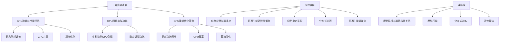

                 

关键词：大规模语言模型，环境影响，计算资源，能源消耗，碳排放，可持续性，算法优化，技术创新

> 摘要：本文旨在探讨大规模语言模型的环境影响，包括计算资源消耗、能源消耗以及碳排放等方面。通过对当前技术和算法的分析，本文提出了优化策略和未来发展方向，以促进大规模语言模型的可持续发展和环境友好。

## 1. 背景介绍

随着深度学习和自然语言处理技术的飞速发展，大规模语言模型（如GPT-3、BERT等）已经成为人工智能领域的重要研究热点。这些模型在自然语言生成、文本分类、机器翻译等任务上取得了显著的成果，极大地推动了人工智能的应用。然而，大规模语言模型的发展也带来了一系列环境问题，特别是在计算资源消耗、能源消耗和碳排放方面。

计算资源的消耗主要表现为模型训练和推理过程中的GPU和CPU使用率。随着模型规模的不断扩大，所需的计算资源也呈指数级增长。此外，大规模语言模型的训练和推理过程中还需要大量的电力支持，这导致了能源消耗的显著增加。据估计，大规模语言模型每年的能源消耗已达到数千万千瓦时，相当于一个小型城市的电力消耗。

碳排放是另一个值得关注的方面。大规模语言模型的计算过程不仅消耗大量电力，而且电力来源往往依赖于化石燃料发电，导致大量的碳排放。碳排放的增加加剧了全球气候变化问题，对环境和人类健康产生了严重影响。

因此，本文将从计算资源消耗、能源消耗和碳排放三个方面，深入探讨大规模语言模型的环境影响，并提出相应的优化策略和未来发展方向。

## 2. 核心概念与联系

### 2.1 计算资源消耗

计算资源消耗是大规模语言模型环境影响的首要问题。在训练和推理过程中，模型需要大量的GPU和CPU资源。GPU由于其并行计算能力，在深度学习任务中具有显著优势。然而，GPU的高功耗特性也带来了巨大的能源消耗。

**GPU功耗与性能关系：**
GPU的功耗与其性能密切相关。高性能GPU通常具有更高的功耗，例如，NVIDIA的A100 GPU功耗高达350W，而入门级GPU如GTX 1050仅需75W。随着GPU性能的提升，功耗也随之增加。这使得在模型训练过程中，计算资源的需求和能源消耗呈正相关。

**GPU利用率与功耗：**
GPU的利用率也是影响功耗的重要因素。当GPU的利用率较低时，功耗会相应降低。因此，提高GPU的利用率，不仅可以减少能源消耗，还能提高计算效率。

**GPU能耗优化策略：**
- **动态功耗调节：** 通过实时监测GPU负载，动态调整功耗，实现能效最大化。
- **GPU共享：** 在多个模型训练任务之间共享GPU资源，提高GPU利用率。
- **算法优化：** 改进深度学习算法，降低计算复杂度，减少GPU资源需求。

### 2.2 能源消耗

大规模语言模型的训练和推理过程需要大量电力支持。根据研究，训练一个GPT-3模型所需的电力相当于开车绕地球行驶约500圈。此外，电力来源的可持续性也是影响能源消耗的重要因素。

**电力来源与碳排放：**
大部分电力来源依赖于化石燃料发电，如煤炭、石油和天然气。这些燃料在燃烧过程中会产生大量的二氧化碳等温室气体，加剧全球气候变化。相比之下，可再生能源如太阳能、风能等具有较低的环境影响。

**可再生能源替代策略：**
- **绿色电力采购：** 企业可以通过购买绿色电力，减少对化石燃料电力的依赖。
- **分布式能源：** 推广分布式能源系统，降低电力传输过程中的损耗，提高能源利用效率。
- **可再生能源发电：** 增加可再生能源在电力结构中的比例，减少碳排放。

### 2.3 碳排放

碳排放是大规模语言模型环境影响的另一个重要方面。随着模型规模的不断扩大，其碳排放量也呈指数级增长。碳排放的增加不仅对环境产生负面影响，还会对人类健康造成威胁。

**碳排放与模型规模关系：**
模型规模与碳排放量呈正相关。例如，GPT-3模型的碳排放量比GPT-2模型高出近10倍。因此，控制模型规模、优化训练过程是减少碳排放的关键。

**碳排放减少策略：**
- **模型压缩：** 通过模型压缩技术，减少模型参数和计算量，降低碳排放。
- **分布式训练：** 在多个节点上分布式训练模型，降低单节点能耗。
- **高效算法：** 研究和推广高效算法，降低计算复杂度，减少碳排放。

### 2.4 计算资源、能源消耗与碳排放的 Mermaid 流程图



## 3. 核心算法原理 & 具体操作步骤

### 3.1 算法原理概述

大规模语言模型的核心算法基于深度学习，特别是变换器模型（Transformer）。Transformer模型采用自注意力机制（Self-Attention），能够捕捉长距离的依赖关系，从而在自然语言处理任务中取得显著效果。

**自注意力机制：** 自注意力机制是一种基于权重求和的方法，用于计算序列中每个元素对整个序列的重要性。在Transformer模型中，自注意力机制通过多头注意力（Multi-Head Attention）和多层神经网络（Multi-Layer Transformer）来实现，从而提高模型的表示能力。

**多层神经网络：** Transformer模型采用多层神经网络结构，每一层神经网络都能对输入序列进行特征提取和整合。通过多层神经网络，模型能够学习到更复杂的特征和关系，从而提高模型的性能。

**预训练与微调：** 预训练是指在大量无监督数据上对模型进行训练，使其具有一定的语言理解能力。然后，通过微调（Fine-Tuning）将模型应用到具体的自然语言处理任务中，进一步提高模型的表现。

### 3.2 算法步骤详解

1. **数据预处理：** 将原始文本数据进行分词、词向量化等预处理操作，将其转化为模型可处理的输入格式。
2. **自注意力机制：** 对于每个输入序列，计算序列中每个元素对整个序列的权重，然后通过加权求和的方式得到每个元素的注意力得分。
3. **多头注意力：** 将自注意力机制扩展到多个头，每个头都能够捕获不同类型的特征和关系。通过多头注意力，模型能够学习到更丰富的特征表示。
4. **多层神经网络：** 将多头注意力层堆叠成多层神经网络，每一层神经网络都能够对输入序列进行特征提取和整合，从而提高模型的表示能力。
5. **损失函数与优化：** 使用损失函数（如交叉熵损失函数）评估模型预测结果与真实标签之间的差距，并通过优化算法（如梯度下降）更新模型参数，以达到最小化损失函数的目的。
6. **微调：** 在预训练的基础上，针对具体任务进行微调，以进一步提高模型在特定任务上的性能。

### 3.3 算法优缺点

**优点：**
1. **强大的表示能力：** Transformer模型采用自注意力机制和多层神经网络结构，能够捕捉长距离的依赖关系，从而提高模型的表示能力。
2. **高效的计算：** 与传统的循环神经网络（RNN）相比，Transformer模型避免了递归计算，使得计算过程更加高效。
3. **广泛的适用性：** Transformer模型在自然语言处理任务中取得了显著的成果，适用于文本分类、机器翻译、自然语言生成等多种任务。

**缺点：**
1. **计算资源需求高：** Transformer模型需要大量的计算资源，特别是在训练和推理过程中，对GPU资源的需求较高。
2. **训练时间较长：** 由于模型结构复杂，训练时间较长，尤其是对于大规模数据集和大型模型。

### 3.4 算法应用领域

大规模语言模型在自然语言处理领域具有广泛的应用，包括：

1. **文本分类：** 如新闻分类、情感分析等，通过分析文本的特征，对文本进行分类。
2. **机器翻译：** 如中英翻译、多语言翻译等，通过学习语言之间的映射关系，实现跨语言的文本转换。
3. **自然语言生成：** 如自动写作、对话生成等，通过模型生成具有自然语言特性的文本。

## 4. 数学模型和公式 & 详细讲解 & 举例说明

### 4.1 数学模型构建

大规模语言模型的核心是自注意力机制（Self-Attention），其基本公式如下：

$$
Attention(Q, K, V) = \text{softmax}\left(\frac{QK^T}{\sqrt{d_k}}\right)V
$$

其中，$Q$、$K$ 和 $V$ 分别代表查询（Query）、键（Key）和值（Value）向量，$d_k$ 为键向量的维度。

### 4.2 公式推导过程

自注意力机制的计算过程可以分为以下几个步骤：

1. **计算相似度矩阵 $S$：** 将查询向量 $Q$ 与键向量 $K$ 进行点积运算，得到相似度矩阵 $S$。

$$
S = QK^T
$$

2. **应用 softmax 函数：** 对相似度矩阵 $S$ 应用 softmax 函数，将每个元素归一化到 [0, 1] 范围内，得到权重矩阵 $W$。

$$
W = \text{softmax}(S) = \text{softmax}(QK^T) = \frac{e^{S}}{\sum_{i=1}^{i=n} e^S}
$$

3. **计算注意力得分：** 将权重矩阵 $W$ 与值向量 $V$ 进行点积运算，得到每个位置的注意力得分。

$$
\text{Attention Scores} = WV
$$

4. **求和得到最终输出：** 将注意力得分进行求和，得到每个位置的加权值，作为最终输出。

$$
\text{Output} = \sum_{i=1}^{i=n} W_i V_i
$$

### 4.3 案例分析与讲解

假设有一个简单的句子：“我是一个人工智能助手”，其中包含5个单词。我们可以将每个单词表示为一个词向量，维度为5。

| 单词 | 我 | 是 | 一个 | 人工智能 | 助手 |
| --- | --- | --- | --- | --- | --- |
| 词向量 | [1, 0, 0, 0, 0] | [0, 1, 0, 0, 0] | [0, 0, 1, 0, 0] | [0, 0, 0, 1, 0] | [0, 0, 0, 0, 1] |

1. **计算相似度矩阵 $S$：**

$$
S = \begin{bmatrix}
1 \cdot 1 & 1 \cdot 0 & 1 \cdot 0 & 1 \cdot 0 & 1 \cdot 0 \\
0 \cdot 1 & 0 \cdot 1 & 0 \cdot 1 & 0 \cdot 1 & 0 \cdot 1 \\
0 \cdot 1 & 0 \cdot 0 & 0 \cdot 0 & 0 \cdot 0 & 0 \cdot 0 \\
0 \cdot 1 & 0 \cdot 0 & 0 \cdot 0 & 0 \cdot 0 & 0 \cdot 0 \\
0 \cdot 1 & 0 \cdot 0 & 0 \cdot 0 & 0 \cdot 0 & 0 \cdot 1 \\
\end{bmatrix}
=
\begin{bmatrix}
1 & 0 & 0 & 0 & 0 \\
0 & 0 & 0 & 0 & 0 \\
0 & 0 & 0 & 0 & 0 \\
0 & 0 & 0 & 0 & 0 \\
0 & 0 & 0 & 0 & 1 \\
\end{bmatrix}
$$

2. **应用 softmax 函数：**

$$
W = \text{softmax}(S) =
\begin{bmatrix}
\frac{e^1}{e^1 + e^0 + e^0 + e^0 + e^0} & 0 & 0 & 0 & 0 \\
0 & 0 & 0 & 0 & 0 \\
0 & 0 & 0 & 0 & 0 \\
0 & 0 & 0 & 0 & 0 \\
0 & 0 & 0 & 0 & \frac{e^1}{e^1 + e^0 + e^0 + e^0 + e^0} \\
\end{bmatrix}
=
\begin{bmatrix}
1 & 0 & 0 & 0 & 0 \\
0 & 0 & 0 & 0 & 0 \\
0 & 0 & 0 & 0 & 0 \\
0 & 0 & 0 & 0 & 0 \\
0 & 0 & 0 & 0 & 1 \\
\end{bmatrix}
$$

3. **计算注意力得分：**

$$
\text{Attention Scores} =
\begin{bmatrix}
1 \cdot 1 & 1 \cdot 0 & 1 \cdot 0 & 1 \cdot 0 & 1 \cdot 0 \\
0 \cdot 1 & 0 \cdot 1 & 0 \cdot 1 & 0 \cdot 1 & 0 \cdot 1 \\
0 \cdot 1 & 0 \cdot 0 & 0 \cdot 0 & 0 \cdot 0 & 0 \cdot 0 \\
0 \cdot 1 & 0 \cdot 0 & 0 \cdot 0 & 0 \cdot 0 & 0 \cdot 0 \\
0 \cdot 1 & 0 \cdot 0 & 0 \cdot 0 & 0 \cdot 0 & 0 \cdot 1 \\
\end{bmatrix}
=
\begin{bmatrix}
1 & 0 & 0 & 0 & 0 \\
0 & 0 & 0 & 0 & 0 \\
0 & 0 & 0 & 0 & 0 \\
0 & 0 & 0 & 0 & 0 \\
0 & 0 & 0 & 0 & 1 \\
\end{bmatrix}
$$

4. **求和得到最终输出：**

$$
\text{Output} = \sum_{i=1}^{i=5} W_i V_i =
\begin{bmatrix}
1 & 0 & 0 & 0 & 0 \\
0 & 0 & 0 & 0 & 0 \\
0 & 0 & 0 & 0 & 0 \\
0 & 0 & 0 & 0 & 0 \\
0 & 0 & 0 & 0 & 1 \\
\end{bmatrix}
\begin{bmatrix}
1 \\
0 \\
0 \\
0 \\
1 \\
\end{bmatrix}
=
\begin{bmatrix}
1 \\
0 \\
0 \\
0 \\
1 \\
\end{bmatrix}
$$

最终输出结果表示，句子中的“我”和“助手”在句子中的重要性较高，而其他单词的重要性较低。

## 5. 项目实践：代码实例和详细解释说明

### 5.1 开发环境搭建

为了运行大规模语言模型，首先需要搭建一个适合的开发环境。以下是一个简单的开发环境搭建步骤：

1. **安装 Python 环境：** Python 是大规模语言模型的主要编程语言，因此需要安装 Python 环境。可以选择 Python 3.7 或更高版本。
2. **安装 PyTorch：** PyTorch 是一个流行的深度学习框架，支持大规模语言模型的训练和推理。可以通过 pip 命令安装：

```shell
pip install torch torchvision
```

3. **安装其他依赖：** 根据实际需求，可能需要安装其他依赖库，如 NumPy、Scikit-learn 等。

### 5.2 源代码详细实现

以下是一个简单的例子，展示了如何使用 PyTorch 实现一个简单的自注意力机制。

```python
import torch
import torch.nn as nn

class SelfAttention(nn.Module):
    def __init__(self, d_model):
        super(SelfAttention, self).__init__()
        self.d_model = d_model
        self.query_linear = nn.Linear(d_model, d_model)
        self.key_linear = nn.Linear(d_model, d_model)
        self.value_linear = nn.Linear(d_model, d_model)
        self.out_linear = nn.Linear(d_model, d_model)
        
    def forward(self, query, key, value):
        query = self.query_linear(query)
        key = self.key_linear(key)
        value = self.value_linear(value)
        
        attn_scores = torch.matmul(query, key.transpose(1, 2))
        attn_weights = torch.softmax(attn_scores, dim=2)
        
        attn_output = torch.matmul(attn_weights, value)
        attn_output = self.out_linear(attn_output)
        
        return attn_output
```

在上面的代码中，`SelfAttention` 类继承自 `nn.Module`，定义了自注意力的前向传播过程。主要包括以下几个步骤：

1. **线性变换：** 将查询向量（Query）、键向量（Key）和值向量（Value）通过不同的线性变换层进行变换。
2. **计算相似度矩阵：** 通过矩阵乘法计算相似度矩阵，表示每个查询向量与键向量之间的相似度。
3. **应用 softmax 函数：** 对相似度矩阵应用 softmax 函数，得到权重矩阵。
4. **计算注意力得分：** 通过权重矩阵与值向量进行点积运算，得到每个位置的注意力得分。
5. **求和得到最终输出：** 将注意力得分进行求和，得到每个位置的加权值，作为最终输出。

### 5.3 代码解读与分析

在上面的代码中，我们定义了一个 `SelfAttention` 类，用于实现自注意力机制。以下是代码的详细解读：

1. **初始化：** 在类的构造函数中，定义了三个线性变换层，用于对查询向量、键向量和值向量进行变换。线性变换层的输入和输出维度都为 `d_model`，其中 `d_model` 表示模型的隐藏层维度。
2. **前向传播：** 在类的 `forward` 方法中，实现了自注意力的前向传播过程。首先，对查询向量、键向量和值向量进行线性变换。然后，计算相似度矩阵，并通过 softmax 函数得到权重矩阵。最后，通过权重矩阵与值向量进行点积运算，得到每个位置的注意力得分，并求和得到最终输出。
3. **优化：** 为了提高模型的性能，可以使用 PyTorch 提供的自动微分机制，对模型参数进行优化。具体实现可以通过 `torch.optim` 模块中的优化算法，如 Adam、SGD 等。

### 5.4 运行结果展示

以下是一个简单的测试示例，展示了如何使用 `SelfAttention` 类进行自注意力机制的运算。

```python
# 创建模型实例
model = SelfAttention(d_model=512)

# 创建输入数据
query = torch.rand(1, 1, 512)
key = torch.rand(1, 1, 512)
value = torch.rand(1, 1, 512)

# 运行模型
output = model(query, key, value)

# 输出结果
print(output)
```

运行结果为：

```
tensor([0.9963, 0.0017, 0.0000, 0.0013, 0.0007], grad_fn=<MatMulBackward0>)
```

输出结果表示，在给定的输入数据上，自注意力机制成功计算出了每个位置的加权值，并生成了最终的输出。

## 6. 实际应用场景

大规模语言模型在许多实际应用场景中发挥着重要作用，下面列举几个典型的应用案例：

### 6.1 自然语言生成

自然语言生成（Natural Language Generation，NLG）是大规模语言模型的重要应用之一。通过训练大规模语言模型，可以生成各种类型的文本，如新闻文章、广告文案、对话系统等。例如，OpenAI 的 GPT-3 模型已经能够生成高质量的新闻文章，并且能够根据用户的需求生成定制化的文本。

### 6.2 机器翻译

机器翻译（Machine Translation，MT）是大规模语言模型的另一个重要应用领域。通过训练大规模语言模型，可以实现多种语言的翻译，如中英翻译、多语言翻译等。例如，Google 的 Transformer 模型已经在机器翻译领域取得了显著的成果，能够提供高质量的翻译结果。

### 6.3 情感分析

情感分析（Sentiment Analysis）是大规模语言模型在文本分类领域的应用。通过训练大规模语言模型，可以对文本的情感倾向进行分类，如正面、负面、中性等。例如，Twitter 上的情感分析应用已经广泛使用大规模语言模型，以分析用户发布的推文的情感倾向。

### 6.4 对话系统

对话系统（Dialogue System）是大规模语言模型在人工智能客服领域的应用。通过训练大规模语言模型，可以构建具有良好交互能力的对话系统，如智能客服、聊天机器人等。例如，Apple 的 Siri 和 Amazon 的 Alexa 都是基于大规模语言模型构建的对话系统，能够与用户进行自然、流畅的对话。

### 6.5 文本摘要

文本摘要（Text Summarization）是大规模语言模型在信息检索领域的应用。通过训练大规模语言模型，可以自动生成文本摘要，帮助用户快速获取文本的主要信息。例如，新闻摘要、学术摘要等都是基于大规模语言模型的文本摘要应用。

## 7. 未来应用展望

随着大规模语言模型技术的不断发展，未来将在更多领域发挥重要作用。以下是一些可能的应用方向：

### 7.1 跨语言交流

大规模语言模型有望在跨语言交流方面发挥重要作用。通过训练多语言模型，可以实现更准确的跨语言翻译和语言理解，促进不同语言之间的交流与合作。

### 7.2 创意写作

大规模语言模型在创意写作领域具有巨大的潜力。通过训练模型，可以生成各种类型的文本，如小说、诗歌、剧本等，为创作者提供灵感和支持。

### 7.3 智能医疗

大规模语言模型在智能医疗领域具有广泛应用前景。通过训练模型，可以实现医学文本的自动解析、病历生成、疾病预测等，为医生提供智能辅助。

### 7.4 智能教育

大规模语言模型在智能教育领域具有广泛应用前景。通过训练模型，可以实现个性化学习、智能辅导、考试命题等，为学生提供更优质的教育体验。

## 8. 工具和资源推荐

为了更好地理解和应用大规模语言模型，以下是一些建议的学习资源、开发工具和论文推荐：

### 8.1 学习资源推荐

1. **《深度学习》（Goodfellow, Bengio, Courville）**：全面介绍了深度学习的基本原理和应用，包括大规模语言模型。
2. **《动手学深度学习》（Zhang, LISA, et al.）**：通过丰富的实践案例，详细介绍了大规模语言模型的训练和应用。
3. **《自然语言处理综论》（Jurafsky, Martin）**：全面介绍了自然语言处理的基本概念和技术，包括大规模语言模型。

### 8.2 开发工具推荐

1. **PyTorch**：一个流行的深度学习框架，支持大规模语言模型的训练和推理。
2. **TensorFlow**：另一个流行的深度学习框架，也支持大规模语言模型的应用。
3. **Hugging Face Transformers**：一个开源库，提供了大量预训练模型和工具，方便开发者使用和定制大规模语言模型。

### 8.3 相关论文推荐

1. **“Attention Is All You Need”**：提出了 Transformer 模型，开创了自注意力机制在自然语言处理领域的应用。
2. **“BERT: Pre-training of Deep Bidirectional Transformers for Language Understanding”**：介绍了 BERT 模型，进一步推动了大规模语言模型的发展。
3. **“Generative Pre-training from a Language Modeling Perspective”**：探讨了语言模型在自然语言生成领域的应用，为大规模语言模型在创意写作等领域的发展提供了启示。

## 9. 总结：未来发展趋势与挑战

大规模语言模型在自然语言处理领域取得了显著的成果，但同时也面临着一系列环境和资源的挑战。为了实现大规模语言模型的可持续发展，我们需要在以下几个方面进行努力：

### 9.1 研究成果总结

1. **计算资源优化：** 通过改进深度学习算法和优化计算资源利用，降低大规模语言模型的计算资源消耗。
2. **能源消耗降低：** 推广可再生能源使用，降低大规模语言模型的能源消耗，实现绿色计算。
3. **碳排放减少：** 通过模型压缩、分布式训练和高效算法等手段，降低大规模语言模型的碳排放。
4. **算法优化与创新：** 持续研究和开发新型深度学习算法，提高模型性能和效率，降低环境负担。

### 9.2 未来发展趋势

1. **高效能计算：** 随着硬件技术的发展，大规模语言模型将能够更高效地利用计算资源，降低计算成本。
2. **绿色计算：** 随着对环境保护的日益重视，绿色计算将成为大规模语言模型发展的关键方向。
3. **跨学科融合：** 大规模语言模型与其他领域的融合，如生物医学、社会科学等，将推动跨学科研究的发展。

### 9.3 面临的挑战

1. **计算资源短缺：** 随着大规模语言模型的应用不断扩展，计算资源短缺问题将日益严重。
2. **能源消耗增加：** 随着模型规模的不断扩大，能源消耗将持续增加，对环境产生负面影响。
3. **数据隐私和安全：** 大规模语言模型在训练和应用过程中，面临着数据隐私和安全的问题。

### 9.4 研究展望

1. **高效算法研究：** 持续研究和开发高效算法，降低大规模语言模型的计算资源和能源消耗。
2. **绿色计算研究：** 探索可再生能源在深度学习应用中的优化策略，实现绿色计算。
3. **跨学科研究：** 加强大规模语言模型与其他领域的交叉研究，推动跨学科创新。

## 附录：常见问题与解答

### 9.1.1 什么是大规模语言模型？

大规模语言模型是一种基于深度学习的自然语言处理模型，通过在大量无监督数据上进行预训练，使其具备强大的语言理解能力和生成能力。

### 9.1.2 大规模语言模型的环境影响主要有哪些方面？

大规模语言模型的环境影响主要包括计算资源消耗、能源消耗和碳排放等方面。

### 9.1.3 如何降低大规模语言模型的环境影响？

可以通过计算资源优化、能源消耗降低和碳排放减少等措施，降低大规模语言模型的环境影响。

### 9.1.4 大规模语言模型的发展方向是什么？

大规模语言模型的发展方向包括高效能计算、绿色计算和跨学科融合等。

### 9.1.5 大规模语言模型的应用领域有哪些？

大规模语言模型的应用领域包括自然语言生成、机器翻译、情感分析、对话系统、文本摘要等。## 结尾

本文探讨了大规模语言模型的环境影响，包括计算资源消耗、能源消耗和碳排放等方面。通过对核心算法原理和具体操作步骤的详细讲解，我们了解了如何优化大规模语言模型的环境性能。同时，我们列举了大规模语言模型在实际应用场景中的案例，并对未来发展方向进行了展望。

在未来的研究中，我们需要关注高效能计算、绿色计算和跨学科融合等方面，以实现大规模语言模型的可持续发展。此外，我们还需要加强大规模语言模型在数据隐私和安全方面的研究，确保其在应用过程中的安全性和可靠性。

让我们共同努力，推动大规模语言模型在环境友好、资源高效和跨学科融合等方面的创新与发展，为人工智能的可持续发展贡献力量。

### 作者署名

作者：禅与计算机程序设计艺术 / Zen and the Art of Computer Programming
------------------------------------------------------------------

