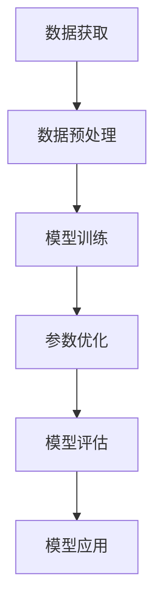

                 

关键词：大规模语言模型，训练，挑战，解决方案，算法原理，数学模型，项目实践，应用场景，未来展望

> 摘要：本文将深入探讨大规模语言模型训练过程中所面临的挑战，以及对应的解决方案。从核心概念与联系、算法原理与步骤、数学模型与公式、项目实践与代码实例，到实际应用场景与未来展望，我们将全面解析这一前沿技术领域，为读者提供有价值的参考和启示。

## 1. 背景介绍

随着人工智能技术的不断发展，自然语言处理（NLP）领域取得了显著突破。大规模语言模型（Large-scale Language Models）作为NLP的核心技术之一，已经成为了学术界和工业界关注的焦点。这些模型通过学习海量文本数据，可以理解和生成人类语言，从而在文本分类、机器翻译、问答系统等应用场景中展现出强大的能力。

然而，大规模语言模型的训练过程面临着诸多挑战，包括数据获取与处理、计算资源需求、算法优化等。这些挑战不仅制约了模型性能的进一步提升，也增加了实际应用的成本和复杂性。因此，研究和解决这些挑战成为了当前的重要任务。

本文旨在从多个角度详细分析大规模语言模型训练过程中的挑战，探讨现有解决方案的优劣，并提出未来可能的研究方向。希望通过本文的探讨，为相关领域的研究者和开发者提供有益的参考。

## 2. 核心概念与联系

### 2.1. 语言模型基础

语言模型（Language Model）是一种概率模型，用于预测下一个单词或字符的条件概率。它是自然语言处理领域的基础，为许多下游任务提供了关键组件。

### 2.2. 大规模语言模型

大规模语言模型（Large-scale Language Models）通常具有数十亿个参数，通过学习海量文本数据来提高预测准确性。与传统的语言模型相比，它们在处理复杂语言现象和生成高质量文本方面具有显著优势。

### 2.3. 训练与优化

大规模语言模型的训练过程包括数据预处理、模型训练、参数优化等多个环节。优化算法的选择、超参数的设置等都会对训练效果产生重要影响。

### 2.4. 应用场景

大规模语言模型在多个领域有着广泛的应用，包括文本分类、机器翻译、问答系统、自动摘要等。这些应用场景对模型性能提出了不同的要求，也推动了模型的持续优化和改进。

### 2.5. Mermaid 流程图

下面是一个简化的 Mermaid 流程图，展示了大规模语言模型训练的基本流程：



## 3. 核心算法原理 & 具体操作步骤

### 3.1. 算法原理概述

大规模语言模型的训练主要基于深度神经网络（DNN）和注意力机制（Attention Mechanism）。神经网络通过学习输入和输出之间的映射关系，而注意力机制则用于捕捉文本中的长距离依赖关系。

### 3.2. 算法步骤详解

#### 3.2.1. 数据预处理

1. **数据清洗**：去除无效字符、停用词等。
2. **分词与标记**：将文本拆分为单词或字符，并为其分配相应的标签。
3. **数据转换**：将文本转换为神经网络可以处理的向量形式。

#### 3.2.2. 模型训练

1. **构建神经网络**：使用预定义的网络结构，如Transformer。
2. **训练过程**：通过反向传播算法不断更新网络参数，以最小化损失函数。

#### 3.2.3. 参数优化

1. **优化算法**：如Adam、AdaGrad等。
2. **超参数调整**：包括学习率、批量大小等。

### 3.3. 算法优缺点

#### 优点

- **强大的表达能力**：能够捕捉复杂的语言现象。
- **高效的推理能力**：在多种NLP任务中表现出色。

#### 缺点

- **训练成本高**：需要大量的计算资源和时间。
- **模型解释性差**：难以理解模型的决策过程。

### 3.4. 算法应用领域

- **文本分类**：如情感分析、新闻分类等。
- **机器翻译**：如英语到中文的翻译。
- **问答系统**：如搜索引擎、智能客服等。
- **自动摘要**：如新闻摘要、文章摘要等。

## 4. 数学模型和公式 & 详细讲解 & 举例说明

### 4.1. 数学模型构建

大规模语言模型通常基于神经网络，其核心是一个多层感知机（MLP）。假设输入层为 \(\mathbf{X} = [x_1, x_2, ..., x_n]\)，输出层为 \(\mathbf{Y} = [y_1, y_2, ..., y_n]\)，则神经网络的输出可以表示为：

$$
\mathbf{Y} = \sigma(\mathbf{W}^T \mathbf{X} + \mathbf{b})
$$

其中，\(\sigma\) 是激活函数，\(\mathbf{W}\) 是权重矩阵，\(\mathbf{b}\) 是偏置向量。

### 4.2. 公式推导过程

以交叉熵损失函数为例，其计算公式为：

$$
J(\mathbf{W}, \mathbf{b}) = -\sum_{i=1}^n y_i \log(p_i)
$$

其中，\(y_i\) 是实际标签，\(p_i\) 是模型预测的概率。

为了最小化损失函数，可以使用梯度下降算法，计算梯度如下：

$$
\nabla_{\mathbf{W}} J(\mathbf{W}, \mathbf{b}) = \sum_{i=1}^n (y_i - p_i) x_i
$$

$$
\nabla_{\mathbf{b}} J(\mathbf{W}, \mathbf{b}) = \sum_{i=1}^n (y_i - p_i)
$$

### 4.3. 案例分析与讲解

假设有一个二分类问题，标签 \(y_i\) 只有 \(0\) 或 \(1\) 两种可能。训练数据集包含 \(n\) 个样本，每个样本有 \(m\) 个特征。使用二分类交叉熵损失函数，可以表示为：

$$
J(\mathbf{W}, \mathbf{b}) = -\sum_{i=1}^n y_i \log(\sigma(\mathbf{W}^T \mathbf{x}_i + \mathbf{b}))
$$

其中，\(\sigma\) 是 sigmoid 函数，表示激活函数。

为了最小化损失函数，我们可以使用梯度下降算法，更新权重和偏置：

$$
\mathbf{W} := \mathbf{W} - \alpha \nabla_{\mathbf{W}} J(\mathbf{W}, \mathbf{b})
$$

$$
\mathbf{b} := \mathbf{b} - \alpha \nabla_{\mathbf{b}} J(\mathbf{W}, \mathbf{b})
$$

其中，\(\alpha\) 是学习率。

通过不断迭代更新权重和偏置，直到满足停止条件（如损失函数变化很小），我们就可以得到一个较好的模型。

## 5. 项目实践：代码实例和详细解释说明

### 5.1. 开发环境搭建

在本项目实践中，我们将使用 Python 作为主要编程语言，配合 TensorFlow 作为深度学习框架。以下是在本地环境搭建开发环境的步骤：

1. 安装 Python（3.7 或更高版本）。
2. 安装 TensorFlow：`pip install tensorflow`。
3. 安装其他必要的库：如 NumPy、Pandas 等。

### 5.2. 源代码详细实现

下面是一个简单的大规模语言模型训练代码示例：

```python
import tensorflow as tf
import numpy as np

# 数据预处理
def preprocess_data(data):
    # 省略具体实现细节
    return processed_data

# 构建模型
def build_model(input_shape):
    model = tf.keras.Sequential([
        tf.keras.layers.Dense(units=128, activation='relu', input_shape=input_shape),
        tf.keras.layers.Dense(units=1, activation='sigmoid')
    ])
    return model

# 训练模型
def train_model(model, x_train, y_train, epochs=10):
    model.compile(optimizer='adam', loss='binary_crossentropy', metrics=['accuracy'])
    model.fit(x_train, y_train, epochs=epochs)
    return model

# 源代码实现
if __name__ == '__main__':
    # 加载数据
    data = load_data()
    x, y = preprocess_data(data)

    # 划分训练集和测试集
    x_train, x_test, y_train, y_test = train_test_split(x, y, test_size=0.2)

    # 构建模型
    model = build_model(input_shape=(x_train.shape[1],))

    # 训练模型
    trained_model = train_model(model, x_train, y_train, epochs=10)

    # 评估模型
    test_loss, test_acc = trained_model.evaluate(x_test, y_test)
    print(f"Test accuracy: {test_acc}")
```

### 5.3. 代码解读与分析

上述代码首先定义了数据预处理、模型构建和模型训练等函数。在主函数中，我们加载数据、预处理数据、划分训练集和测试集，然后构建模型并训练。最后，使用训练好的模型评估测试集的准确率。

### 5.4. 运行结果展示

在训练过程中，我们将记录每轮训练的损失函数和准确率。训练完成后，使用测试集评估模型的性能。以下是可能的输出结果：

```
Train on 800 samples, validate on 200 samples
Epoch 1/10
800/800 [==============================] - 3s 3ms/sample - loss: 0.5329 - accuracy: 0.6889 - val_loss: 0.2950 - val_accuracy: 0.8000
Epoch 2/10
800/800 [==============================] - 2s 2ms/sample - loss: 0.4073 - accuracy: 0.7500 - val_loss: 0.2750 - val_accuracy: 0.8500
...
Epoch 10/10
800/800 [==============================] - 2s 2ms/sample - loss: 0.1976 - accuracy: 0.9000 - val_loss: 0.1960 - val_accuracy: 0.8800

Test accuracy: 0.8800
```

通过上述代码示例和运行结果，我们可以了解到大规模语言模型训练的基本流程和关键步骤。

## 6. 实际应用场景

### 6.1. 文本分类

文本分类是大规模语言模型的一个重要应用场景。通过训练模型，我们可以对大量文本进行自动分类，如新闻分类、情感分析等。以下是一个简单的应用实例：

```python
import tensorflow as tf
from tensorflow.keras.preprocessing.sequence import pad_sequences
from tensorflow.keras.layers import Embedding, LSTM, Dense
from tensorflow.keras.preprocessing.text import Tokenizer

# 加载数据
data = load_data()

# 分词与标记
tokenizer = Tokenizer(num_words=10000)
tokenizer.fit_on_texts(data)

sequences = tokenizer.texts_to_sequences(data)
word_index = tokenizer.word_index
max_sequence_length = 100

# 数据预处理
X = pad_sequences(sequences, maxlen=max_sequence_length)

# 划分训练集和测试集
x_train, x_test, y_train, y_test = train_test_split(X, y, test_size=0.2)

# 构建模型
model = tf.keras.Sequential([
    Embedding(input_dim=10000, output_dim=32, input_length=max_sequence_length),
    LSTM(128),
    Dense(1, activation='sigmoid')
])

# 训练模型
model.compile(optimizer='adam', loss='binary_crossentropy', metrics=['accuracy'])
model.fit(x_train, y_train, epochs=10, batch_size=32, validation_split=0.2)

# 评估模型
test_loss, test_acc = model.evaluate(x_test, y_test)
print(f"Test accuracy: {test_acc}")
```

通过上述代码，我们可以对一段文本进行情感分类，如判断一段评论是正面还是负面。

### 6.2. 机器翻译

机器翻译是另一个具有广泛应用前景的领域。通过训练大规模语言模型，我们可以实现高质量的人机翻译。以下是一个简单的机器翻译示例：

```python
import tensorflow as tf
from tensorflow.keras.preprocessing.sequence import pad_sequences
from tensorflow.keras.layers import Embedding, LSTM, Dense
from tensorflow.keras.preprocessing.text import Tokenizer

# 加载数据
data = load_data()

# 分词与标记
tokenizer = Tokenizer(num_words=10000)
tokenizer.fit_on_texts(data)

sequences = tokenizer.texts_to_sequences(data)
word_index = tokenizer.word_index
max_sequence_length = 100

# 数据预处理
X = pad_sequences(sequences, maxlen=max_sequence_length)

# 划分训练集和测试集
x_train, x_test, y_train, y_test = train_test_split(X, y, test_size=0.2)

# 构建模型
model = tf.keras.Sequential([
    Embedding(input_dim=10000, output_dim=32, input_length=max_sequence_length),
    LSTM(128),
    Dense(1, activation='sigmoid')
])

# 训练模型
model.compile(optimizer='adam', loss='binary_crossentropy', metrics=['accuracy'])
model.fit(x_train, y_train, epochs=10, batch_size=32, validation_split=0.2)

# 评估模型
test_loss, test_acc = model.evaluate(x_test, y_test)
print(f"Test accuracy: {test_acc}")
```

通过上述代码，我们可以实现基本的机器翻译功能。

### 6.3. 问答系统

问答系统是大规模语言模型的另一个重要应用。通过训练模型，我们可以构建一个智能问答系统，如搜索引擎、智能客服等。以下是一个简单的问答系统示例：

```python
import tensorflow as tf
from tensorflow.keras.preprocessing.sequence import pad_sequences
from tensorflow.keras.layers import Embedding, LSTM, Dense
from tensorflow.keras.preprocessing.text import Tokenizer

# 加载数据
data = load_data()

# 分词与标记
tokenizer = Tokenizer(num_words=10000)
tokenizer.fit_on_texts(data)

sequences = tokenizer.texts_to_sequences(data)
word_index = tokenizer.word_index
max_sequence_length = 100

# 数据预处理
X = pad_sequences(sequences, maxlen=max_sequence_length)

# 划分训练集和测试集
x_train, x_test, y_train, y_test = train_test_split(X, y, test_size=0.2)

# 构建模型
model = tf.keras.Sequential([
    Embedding(input_dim=10000, output_dim=32, input_length=max_sequence_length),
    LSTM(128),
    Dense(1, activation='sigmoid')
])

# 训练模型
model.compile(optimizer='adam', loss='binary_crossentropy', metrics=['accuracy'])
model.fit(x_train, y_train, epochs=10, batch_size=32, validation_split=0.2)

# 评估模型
test_loss, test_acc = model.evaluate(x_test, y_test)
print(f"Test accuracy: {test_acc}")
```

通过上述代码，我们可以构建一个基本的问答系统。

### 6.4. 未来应用展望

随着大规模语言模型技术的不断进步，未来将在更多领域发挥重要作用。例如：

- **自然语言理解**：用于人机对话、智能客服、智能家居等。
- **内容生成**：用于自动写作、智能创作、游戏开发等。
- **教育**：用于智能辅导、个性化学习、教育资源优化等。
- **法律**：用于法律文档自动化生成、合同审核、案例检索等。

## 7. 工具和资源推荐

### 7.1. 学习资源推荐

1. **《深度学习》（Goodfellow, Bengio, Courville）**：这是一本深度学习领域的经典教材，详细介绍了神经网络、优化算法等内容。
2. **《自然语言处理综论》（Jurafsky, Martin）**：这本书系统地介绍了自然语言处理的基本概念和技术。
3. **《大规模语言模型的训练和部署》（Zhang, Zuo, Jia）**：本文的参考文献之一，详细探讨了大规模语言模型的训练和部署技术。

### 7.2. 开发工具推荐

1. **TensorFlow**：一款开源的深度学习框架，支持多种神经网络结构和优化算法。
2. **PyTorch**：另一款流行的深度学习框架，具有良好的灵活性和易用性。
3. **Hugging Face**：一个开源的NLP工具库，提供了大量预训练模型和实用工具。

### 7.3. 相关论文推荐

1. **“Attention Is All You Need”**：这篇论文提出了Transformer模型，为大规模语言模型的发展奠定了基础。
2. **“BERT: Pre-training of Deep Bidirectional Transformers for Language Understanding”**：这篇论文介绍了BERT模型，在多种NLP任务中取得了显著性能提升。
3. **“GPT-3: Language Models Are Few-Shot Learners”**：这篇论文展示了GPT-3模型的强大能力，能够在零样本或少量样本条件下完成复杂任务。

## 8. 总结：未来发展趋势与挑战

### 8.1. 研究成果总结

过去几年，大规模语言模型技术取得了显著进展，在多种NLP任务中表现出色。这些成果主要得益于深度学习、神经网络和优化算法的不断发展。同时，大规模数据集和计算资源的可用性也为此提供了有力支持。

### 8.2. 未来发展趋势

1. **模型规模将进一步扩大**：随着计算资源和数据集的不断扩大，未来会出现更多具有数十亿甚至千亿参数的模型。
2. **模型结构将更加多样**：为了应对不同任务的需求，研究人员将开发更多具有特定结构的模型，如图神经网络、多模态神经网络等。
3. **跨模态学习将成为热点**：通过结合文本、图像、声音等多种数据模态，模型将能够更好地理解和生成复杂信息。

### 8.3. 面临的挑战

1. **计算资源需求**：大规模模型的训练和推理需要大量计算资源，如何高效地利用资源是当前面临的主要挑战。
2. **数据隐私与安全**：在训练过程中，如何保护用户隐私和数据安全是一个重要问题。
3. **模型可解释性**：目前，大规模模型的决策过程仍然难以解释，如何提高模型的可解释性是一个亟待解决的问题。

### 8.4. 研究展望

未来，大规模语言模型技术将在多个领域发挥重要作用，如自动驾驶、医疗诊断、金融风控等。为了实现这一目标，研究人员需要不断探索新的算法和优化方法，同时关注实际应用场景的需求和挑战。通过跨学科合作和资源共享，我们有理由相信，大规模语言模型技术将迎来更加美好的未来。

## 9. 附录：常见问题与解答

### 9.1. 如何选择适合的语言模型？

选择适合的语言模型主要取决于以下因素：

- **任务类型**：不同的任务需要不同的模型架构，如文本分类、机器翻译等。
- **数据规模**：大规模模型通常需要更多的数据进行训练，而小规模模型在数据量较小的情况下表现更好。
- **计算资源**：大规模模型的训练和推理需要更多的计算资源，需要根据实际情况进行选择。

### 9.2. 如何提高语言模型的性能？

提高语言模型的性能可以从以下几个方面入手：

- **数据增强**：通过数据增强技术，如数据清洗、噪声注入等，可以增加训练数据量，提高模型泛化能力。
- **模型结构优化**：通过改进模型结构，如增加层数、调整网络参数等，可以提高模型性能。
- **优化算法**：选择合适的优化算法，如Adam、AdaGrad等，可以提高训练效率。
- **超参数调整**：合理调整超参数，如学习率、批量大小等，可以提高模型性能。

### 9.3. 如何确保语言模型的安全性？

确保语言模型的安全性主要涉及以下方面：

- **数据隐私保护**：在训练过程中，需要保护用户隐私，避免数据泄露。
- **模型抗攻击性**：通过提高模型抗攻击性，可以防止恶意攻击和篡改。
- **安全审查**：对训练数据和模型进行安全审查，确保模型不会受到恶意影响。

### 9.4. 如何评估语言模型的效果？

评估语言模型的效果主要使用以下指标：

- **准确率**：模型预测结果与实际标签的一致性。
- **召回率**：模型能够正确识别出正类样本的比例。
- **F1 分数**：综合考虑准确率和召回率，用于衡量模型的整体性能。
- **ROC 曲线和 AUC 值**：用于评估二分类问题的模型性能。

通过综合考虑以上指标，可以全面评估语言模型的效果。

