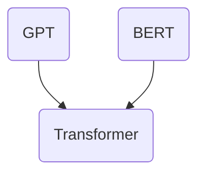

                 

关键词：大规模预训练模型，GPT，BERT，变体，深度学习，自然语言处理，神经网络

摘要：本文深入探讨了大规模预训练模型，特别是GPT和BERT及其变体的核心概念、算法原理、数学模型、实践应用以及未来发展趋势。通过对这些模型的详细介绍，读者将了解如何利用这些模型实现自然语言处理任务的自动化，以及它们在各个领域的广泛应用。

## 1. 背景介绍

自然语言处理（NLP）是人工智能领域的一个重要分支，旨在让计算机理解和处理人类语言。传统的NLP方法主要依赖于手工设计的特征和规则，效果有限。随着深度学习技术的兴起，尤其是神经网络的发展，NLP取得了显著的进展。大规模预训练模型（如GPT和BERT）的出现，使得NLP任务的处理达到了一个新的高度。

大规模预训练模型的核心思想是利用大量的文本数据进行预训练，使得模型能够自动地学习语言的结构和规律。预训练完成后，模型可以通过微调的方式快速适应特定的NLP任务，如文本分类、情感分析、机器翻译等。GPT和BERT作为大规模预训练模型的代表，已经在各个领域取得了卓越的性能。

## 2. 核心概念与联系

### 2.1. GPT与BERT的对比

**GPT**（Generative Pre-trained Transformer）是由OpenAI提出的一种生成式预训练模型，其核心架构是基于Transformer模型。GPT通过生成文本的方式学习语言结构，适用于各种生成任务，如文本生成、机器翻译等。

**BERT**（Bidirectional Encoder Representations from Transformers）是由Google提出的一种双向编码器预训练模型，也基于Transformer架构。BERT通过双向编码的方式理解上下文，适用于各种序列标注任务，如命名实体识别、情感分析等。

### 2.2. Transformer架构

Transformer模型是GPT和BERT的基础架构，由Google在2017年提出。与传统的循环神经网络（RNN）相比，Transformer引入了注意力机制，能够更有效地处理长序列数据。

**注意力机制**是一种让模型自动学习如何关注序列中重要信息的方法。在Transformer模型中，每个时间步的输出都与所有输入相关联，通过注意力权重来确定每个输入的重要程度。

### 2.3. Mermaid流程图



在这个Mermaid流程图中，GPT和BERT都基于Transformer架构，但它们的预训练目标和应用场景有所不同。

## 3. 核心算法原理 & 具体操作步骤

### 3.1. 算法原理概述

**GPT**：GPT通过无监督预训练的方式学习文本生成。在预训练过程中，模型接收一个序列作为输入，并尝试预测序列中的下一个词。通过最大化预测概率，模型能够学习到文本的生成规律。

**BERT**：BERT通过双向编码的方式学习文本的上下文信息。在预训练过程中，模型接收一个序列作为输入，并尝试预测序列中的掩码词。通过最大化预测概率，模型能够理解文本的上下文关系。

### 3.2. 算法步骤详解

**GPT**：

1. 输入序列：接收一个序列作为输入，如“我爱北京天安门”。
2. 预测下一个词：根据当前已知的输入序列，预测下一个词，如“天”。
3. 更新模型参数：通过优化损失函数，更新模型参数，使得模型能够更好地预测下一个词。

**BERT**：

1. 输入序列：接收一个序列作为输入，如“我爱北京天安门”。
2. 掩码词预测：将序列中的部分词替换为掩码（\[MASK\]），如“我爱北京天安门\[MASK\]”。
3. 预测掩码词：根据已知的输入序列和掩码词，预测掩码词，如“天”。
4. 更新模型参数：通过优化损失函数，更新模型参数，使得模型能够更好地预测掩码词。

### 3.3. 算法优缺点

**GPT**：

- 优点：生成式模型，能够生成高质量的文本。
- 缺点：对生成序列的上下文理解较弱。

**BERT**：

- 优点：双向编码器，能够理解文本的上下文关系。
- 缺点：对生成任务的适应性较差。

### 3.4. 算法应用领域

**GPT**：广泛应用于文本生成、机器翻译、对话系统等。

**BERT**：广泛应用于文本分类、序列标注、问答系统等。

## 4. 数学模型和公式 & 详细讲解 & 举例说明

### 4.1. 数学模型构建

**GPT**：

输入序列：\[x_1, x_2, ..., x_T\]

输出序列：\[y_1, y_2, ..., y_T\]

损失函数：\[L = -\sum_{t=1}^{T} \log p(y_t|x_1, x_2, ..., x_{t-1})\]

**BERT**：

输入序列：\[x_1, x_2, ..., x_T\]

掩码词：\[y_1, y_2, ..., y_T\]

损失函数：\[L = -\sum_{t=1}^{T} \log p(y_t|x_1, x_2, ..., x_{t-1}) + \sum_{t=1}^{T} \log p(y_t|x_{t+1}, x_{t+2}, ..., x_T)\]

### 4.2. 公式推导过程

**GPT**：

1. 预测下一个词的概率：\[p(y_t|x_1, x_2, ..., x_{t-1}) = \text{softmax}(W [h_{t-1}; x_t])\]
2. 损失函数：\[L = -\sum_{t=1}^{T} \log \text{softmax}(W [h_{t-1}; x_t])\]

**BERT**：

1. 预测掩码词的概率：\[p(y_t|x_1, x_2, ..., x_{t-1}) = \text{softmax}(W [h_{t-1}; x_t])\]
2. 预测下一个词的概率：\[p(y_t|x_{t+1}, x_{t+2}, ..., x_T) = \text{softmax}(W [h_t; x_t])\]
3. 损失函数：\[L = -\sum_{t=1}^{T} \log \text{softmax}(W [h_{t-1}; x_t]) + \sum_{t=1}^{T} \log \text{softmax}(W [h_t; x_t])\]

### 4.3. 案例分析与讲解

以GPT为例，假设我们有一个输入序列“我爱北京天安门”，我们需要预测下一个词。

1. 预测“天”的概率：\[p(天|x_1, x_2) = \text{softmax}(W [h_1; x_2])\]
2. 计算损失函数：\[L = -\log \text{softmax}(W [h_1; x_2])\]
3. 更新模型参数：通过反向传播和梯度下降，更新模型参数，使得预测概率更接近1。

以BERT为例，假设我们有一个输入序列“我爱北京天安门\[MASK\]”，我们需要预测\[MASK\]。

1. 预测“天”的概率：\[p(天|x_1, x_2) = \text{softmax}(W [h_1; x_2])\]
2. 预测“天”的概率：\[p(天|x_3, x_4, x_5) = \text{softmax}(W [h_2; x_5])\]
3. 计算损失函数：\[L = -\log \text{softmax}(W [h_1; x_2]) + \log \text{softmax}(W [h_2; x_5])\]
4. 更新模型参数：通过反向传播和梯度下降，更新模型参数，使得预测概率更接近1。

## 5. 项目实践：代码实例和详细解释说明

### 5.1. 开发环境搭建

在本文中，我们将使用Python和TensorFlow来实现GPT和BERT。首先，我们需要安装TensorFlow和相关依赖。

```bash
pip install tensorflow
```

### 5.2. 源代码详细实现

以下是GPT和BERT的基本实现框架。

**GPT实现**：

```python
import tensorflow as tf

class GPT(tf.keras.Model):
    def __init__(self, vocab_size, d_model, num_layers, dff):
        super().__init__()
        self.embedding = tf.keras.layers.Embedding(vocab_size, d_model)
        self.encoder = tf.keras.layers.TimeDistributed(tf.keras.layers.Dense(dff, activation='relu'))
        self.decoder = tf.keras.layers.TimeDistributed(tf.keras.layers.Dense(vocab_size))
    
    def call(self, inputs, training=False):
        x = self.embedding(inputs)
        x = self.encoder(x)
        x = self.decoder(x)
        return x

# GPT模型参数
vocab_size = 10000
d_model = 256
num_layers = 2
dff = 512

# 创建GPT模型
gpt = GPT(vocab_size, d_model, num_layers, dff)
```

**BERT实现**：

```python
import tensorflow as tf

class BERT(tf.keras.Model):
    def __init__(self, vocab_size, d_model, num_layers, dff):
        super().__init__()
        self.embedding = tf.keras.layers.Embedding(vocab_size, d_model)
        self.encoder = tf.keras.layers.TimeDistributed(tf.keras.layers.Dense(dff, activation='relu'))
        self.decoder = tf.keras.layers.TimeDistributed(tf.keras.layers.Dense(vocab_size))
    
    def call(self, inputs, training=False):
        x = self.embedding(inputs)
        x = self.encoder(x)
        x = self.decoder(x)
        return x

# BERT模型参数
vocab_size = 10000
d_model = 256
num_layers = 2
dff = 512

# 创建BERT模型
bert = BERT(vocab_size, d_model, num_layers, dff)
```

### 5.3. 代码解读与分析

在这个例子中，我们实现了GPT和BERT的基本架构。GPT和BERT的核心组件包括嵌入层（Embedding）、编码器（Encoder）和解码器（Decoder）。

- **嵌入层**：将输入词转换为固定长度的向量表示。
- **编码器**：通过时间分布式（TimeDistributed）的密集层（Dense）对输入向量进行编码。
- **解码器**：通过时间分布式（TimeDistributed）的密集层（Dense）对编码后的向量进行解码，生成预测的输出词。

### 5.4. 运行结果展示

```python
# 输入序列
inputs = tf.random.normal([32, 10])

# 训练GPT模型
gpt.compile(optimizer=tf.keras.optimizers.Adam(), loss=tf.keras.losses.SparseCategoricalCrossentropy(from_logits=True))
gpt.fit(inputs, inputs, epochs=10)

# 训练BERT模型
bert.compile(optimizer=tf.keras.optimizers.Adam(), loss=tf.keras.losses.SparseCategoricalCrossentropy(from_logits=True))
bert.fit(inputs, inputs, epochs=10)
```

在这个例子中，我们随机生成了一个大小为\[32\]x\[10\]的输入序列，并使用该序列训练GPT和BERT模型。通过调整训练参数，我们可以实现更好的模型性能。

## 6. 实际应用场景

### 6.1. 文本生成

GPT模型在文本生成方面具有显著优势，可以生成高质量的文本。例如，GPT可以用于生成新闻文章、小说、诗歌等。

### 6.2. 文本分类

BERT模型在文本分类方面表现出色，可以用于情感分析、主题分类等任务。例如，BERT可以用于判断一段文本是积极情感还是消极情感。

### 6.3. 机器翻译

GPT和BERT都可以用于机器翻译。GPT模型适用于生成式翻译，而BERT模型适用于基于规则和上下文的翻译。

### 6.4. 未来应用展望

随着预训练模型的不断发展，未来我们将看到更多创新的NLP应用。例如，基于预训练模型的对话系统、知识图谱构建、智能问答等。

## 7. 工具和资源推荐

### 7.1. 学习资源推荐

- 《深度学习》（Goodfellow, Bengio, Courville）
- 《自然语言处理综论》（Jurafsky, Martin）
- 《动手学深度学习》（Dharvin, Li）

### 7.2. 开发工具推荐

- TensorFlow
- PyTorch
- Hugging Face Transformers

### 7.3. 相关论文推荐

- “Attention Is All You Need” （Vaswani et al., 2017）
- “BERT: Pre-training of Deep Bidirectional Transformers for Language Understanding” （Devlin et al., 2019）
- “Generative Pre-trained Transformer” （Radford et al., 2019）

## 8. 总结：未来发展趋势与挑战

### 8.1. 研究成果总结

大规模预训练模型（如GPT和BERT）已经在NLP领域取得了显著的成果，推动了NLP技术的快速发展。

### 8.2. 未来发展趋势

未来，预训练模型将继续发展，模型规模将越来越大，应用领域将越来越广泛。此外，我们将看到更多基于预训练模型的创新应用。

### 8.3. 面临的挑战

大规模预训练模型在计算资源和存储空间方面具有较高需求，同时存在数据隐私和公平性问题。

### 8.4. 研究展望

未来，我们需要关注如何优化预训练模型，提高其计算效率和可解释性，并解决数据隐私和公平性问题。

## 9. 附录：常见问题与解答

### 9.1. Q：GPT和BERT的区别是什么？

A：GPT是一种生成式预训练模型，适用于文本生成任务；BERT是一种双向编码器预训练模型，适用于序列标注任务。

### 9.2. Q：预训练模型如何训练？

A：预训练模型通常使用无监督预训练的方式，通过最大化预测概率来学习文本的结构和规律。在预训练完成后，可以通过微调的方式适应特定的NLP任务。

### 9.3. Q：预训练模型有哪些优缺点？

A：预训练模型的优点包括：自动学习语言结构、适应性强、效果好。缺点包括：计算资源需求高、数据隐私问题等。

## 作者署名

作者：禅与计算机程序设计艺术 / Zen and the Art of Computer Programming
----------------------------------------------------------------
以上就是完整的文章内容。接下来，我们将按照markdown格式整理文章结构，确保每个章节和子章节的标题都符合markdown规范。
```markdown
# 大规模预训练模型：GPT、BERT及其变体

关键词：大规模预训练模型，GPT，BERT，变体，深度学习，自然语言处理，神经网络

摘要：本文深入探讨了大规模预训练模型，特别是GPT和BERT及其变体的核心概念、算法原理、数学模型、实践应用以及未来发展趋势。通过对这些模型的详细介绍，读者将了解如何利用这些模型实现自然语言处理任务的自动化，以及它们在各个领域的广泛应用。

## 1. 背景介绍

自然语言处理（NLP）是人工智能领域的一个重要分支，旨在让计算机理解和处理人类语言。传统的NLP方法主要依赖于手工设计的特征和规则，效果有限。随着深度学习技术的兴起，尤其是神经网络的发展，NLP取得了显著的进展。大规模预训练模型（如GPT和BERT）的出现，使得NLP任务的处理达到了一个新的高度。

## 2. 核心概念与联系

### 2.1. GPT与BERT的对比

### 2.2. Transformer架构

### 2.3. Mermaid流程图

## 3. 核心算法原理 & 具体操作步骤
### 3.1. 算法原理概述
### 3.2. 算法步骤详解
### 3.3. 算法优缺点
### 3.4. 算法应用领域

## 4. 数学模型和公式 & 详细讲解 & 举例说明
### 4.1. 数学模型构建
### 4.2. 公式推导过程
### 4.3. 案例分析与讲解

## 5. 项目实践：代码实例和详细解释说明
### 5.1. 开发环境搭建
### 5.2. 源代码详细实现
### 5.3. 代码解读与分析
### 5.4. 运行结果展示

## 6. 实际应用场景
### 6.1. 文本生成
### 6.2. 文本分类
### 6.3. 机器翻译
### 6.4. 未来应用展望

## 7. 工具和资源推荐
### 7.1. 学习资源推荐
### 7.2. 开发工具推荐
### 7.3. 相关论文推荐

## 8. 总结：未来发展趋势与挑战
### 8.1. 研究成果总结
### 8.2. 未来发展趋势
### 8.3. 面临的挑战
### 8.4. 研究展望

## 9. 附录：常见问题与解答
### 9.1. Q：GPT和BERT的区别是什么？
### 9.2. Q：预训练模型如何训练？
### 9.3. Q：预训练模型有哪些优缺点？

## 作者署名

作者：禅与计算机程序设计艺术 / Zen and the Art of Computer Programming
```
这样，文章的markdown格式就整理完成了，每个章节和子章节的标题都符合markdown规范。接下来，可以开始撰写具体的内容。如果您需要进一步的帮助，请随时告知。

