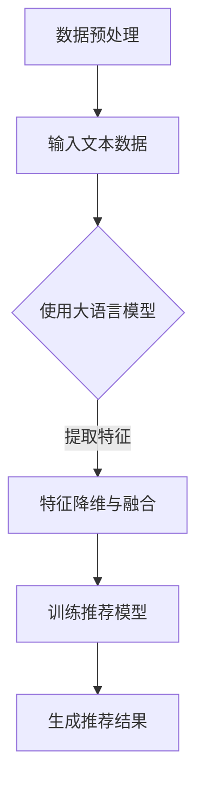

                 

摘要：本文深入探讨了大语言模型在推荐系统特征选择中的应用。通过介绍大语言模型的基本原理，我们详细分析了其在特征选择中的优势和具体应用场景。本文首先回顾了推荐系统的基本概念和特征选择的重要性，然后讲解了如何使用大语言模型进行特征提取和筛选，最后通过实际案例展示了大语言模型在推荐系统中的实际效果。本文旨在为研究人员和实践者提供关于大语言模型在推荐系统特征选择中应用的全面指导。

## 1. 背景介绍

推荐系统是近年来信息技术领域的一个热点，它通过分析用户的历史行为和偏好，为用户推荐相关的商品、新闻、音乐等信息。特征选择是推荐系统构建过程中的一个关键环节，它涉及从大量可能的特征中筛选出对模型性能有显著贡献的特征。然而，特征选择不仅需要考虑特征与目标变量之间的相关性，还需要考虑特征之间的交互作用和冗余性。传统的特征选择方法通常依赖于统计学和机器学习技术，如信息增益、卡方检验和主成分分析等。然而，这些方法往往在处理高维数据和复杂数据分布时存在局限性。

随着深度学习和自然语言处理技术的快速发展，大语言模型（如BERT、GPT等）逐渐成为特征选择领域的有力工具。大语言模型通过学习大量的文本数据，能够捕捉到丰富的语义信息，从而为特征选择提供了新的思路。本文旨在探讨大语言模型在推荐系统特征选择中的应用，分析其原理、方法以及实际效果，为推荐系统的构建提供有益的参考。

## 2. 核心概念与联系

### 2.1 推荐系统的基本概念

推荐系统（Recommendation System）是一种信息过滤技术，旨在根据用户的历史行为、偏好和上下文信息，为用户提供个性化的推荐。推荐系统通常包含以下几个核心组成部分：

- **用户（User）**：推荐系统的核心，具有特定的兴趣和行为。
- **项目（Item）**：推荐系统推荐的对象，如商品、音乐、电影等。
- **评分（Rating）**：用户对项目的评价，可以是显式评分（如1到5的评分）或隐式评分（如点击、购买等行为）。
- **推荐算法（Recommender Algorithm）**：用于生成推荐结果的核心算法，包括基于协同过滤（Collaborative Filtering）、基于内容（Content-Based Filtering）和混合方法等。

### 2.2 特征选择的重要性

特征选择（Feature Selection）是在机器学习模型训练过程中，从原始特征集合中选择出对模型性能有显著贡献的特征的过程。特征选择的重要性体现在以下几个方面：

- **降低维度**：减少特征数量，降低模型复杂度，提高计算效率。
- **减少过拟合**：去除噪声和冗余特征，降低模型对训练数据的依赖，提高泛化能力。
- **提高模型性能**：选择对目标变量有强相关性的特征，提高模型预测准确性。

### 2.3 大语言模型的基本原理

大语言模型（Large Language Model）是一类通过深度学习技术训练的模型，能够理解和生成自然语言。大语言模型的基本原理如下：

- **数据驱动学习**：大语言模型通过学习海量的文本数据，自动提取出语言中的语义和语法规则。
- **层次化结构**：大语言模型通常包含多层神经网络，每一层都能够捕获不同层次的语义信息。
- **端到端学习**：大语言模型能够直接从原始文本数据学习，无需进行特征工程。

### 2.4 大语言模型在特征选择中的应用

大语言模型在特征选择中的应用主要体现在以下几个方面：

- **自动特征提取**：大语言模型能够自动从文本数据中提取出有意义的特征，无需人工干预。
- **语义理解**：大语言模型能够理解文本中的语义信息，从而更好地捕捉特征与目标变量之间的关系。
- **降维与融合**：大语言模型可以通过学习到的低维特征表示，实现特征降维和融合，提高模型性能。

### 2.5 Mermaid 流程图

以下是一个简化的 Mermaid 流程图，展示了大语言模型在特征选择中的应用流程：



## 3. 核心算法原理 & 具体操作步骤

### 3.1 算法原理概述

大语言模型在推荐系统特征选择中的应用主要基于以下原理：

1. **文本表示**：大语言模型能够将文本转换为低维的向量表示，捕捉到文本的语义信息。
2. **特征提取**：通过大语言模型提取到的文本表示，可以用于生成特征，这些特征能够更好地反映用户和项目的相关性。
3. **特征筛选**：利用大语言模型学习到的语义信息，对特征进行筛选和降维，去除噪声和冗余特征。
4. **模型训练**：使用筛选后的特征集，训练推荐模型，生成推荐结果。

### 3.2 算法步骤详解

1. **数据预处理**：对原始文本数据进行预处理，包括文本清洗、分词、去停用词等操作。
2. **大语言模型训练**：使用预处理的文本数据，训练大语言模型，生成文本的向量表示。
3. **特征提取**：利用训练好的大语言模型，对每个用户和项目的文本进行编码，得到对应的向量表示。
4. **特征筛选**：根据向量表示，使用特征选择算法（如主成分分析、线性判别分析等）对特征进行筛选和降维。
5. **模型训练**：使用筛选后的特征集，训练推荐模型，如矩阵分解、基于模型的协同过滤等。
6. **生成推荐结果**：利用训练好的推荐模型，为用户生成个性化推荐结果。

### 3.3 算法优缺点

**优点**：

- **高效的特征提取**：大语言模型能够自动提取出有意义的特征，减少人工干预。
- **良好的语义理解**：大语言模型能够理解文本的语义信息，提高特征与目标变量之间的相关性。
- **鲁棒性强**：大语言模型对噪声和异常值具有较好的鲁棒性。

**缺点**：

- **计算成本高**：大语言模型的训练和特征提取过程需要大量的计算资源。
- **数据依赖性强**：大语言模型的效果受训练数据的影响较大，数据质量对模型性能有显著影响。

### 3.4 算法应用领域

大语言模型在推荐系统特征选择中的应用非常广泛，可以应用于以下领域：

- **电子商务推荐**：为用户提供个性化的商品推荐。
- **社交媒体推荐**：为用户提供感兴趣的内容推荐，如新闻、文章、视频等。
- **音乐推荐**：为用户提供个性化的音乐推荐。
- **视频推荐**：为用户提供感兴趣的视频推荐。

## 4. 数学模型和公式 & 详细讲解 & 举例说明

### 4.1 数学模型构建

在推荐系统中，特征选择的核心目标是找到一个能够最大化预测准确率的特征子集。大语言模型在特征选择中的应用可以通过以下数学模型来描述：

假设我们有一个包含 \( n \) 个用户和 \( m \) 个项目的推荐系统，用户 \( u \) 对项目 \( i \) 的评分为 \( r_{ui} \)。我们使用一个大语言模型来提取用户和项目的特征向量，分别为 \( \mathbf{x}_{ui} \) 和 \( \mathbf{y}_{ui} \)。

特征选择的数学目标可以表示为：

\[ \max_{S} \sum_{u \in U, i \in I} r_{ui} \cdot \phi(\mathbf{x}_{ui}, \mathbf{y}_{ui}) \]

其中，\( S \) 表示特征子集，\( \phi(\mathbf{x}_{ui}, \mathbf{y}_{ui}) \) 表示特征向量 \( \mathbf{x}_{ui} \) 和 \( \mathbf{y}_{ui} \) 之间的相似度度量。

### 4.2 公式推导过程

为了实现特征选择，我们首先需要对大语言模型进行训练，以提取用户和项目的特征向量。假设我们使用的是一个预训练的 Transformer 模型，其输出层的维度为 \( d \)。

1. **文本编码**：对于每个用户 \( u \) 和项目 \( i \)，我们将他们的文本输入到 Transformer 模型中，得到对应的特征向量：

   \[ \mathbf{x}_{ui} = \text{Transformer}(\text{input}_{ui}) \]
   \[ \mathbf{y}_{ui} = \text{Transformer}(\text{input}_{ui}) \]

2. **特征融合**：为了提高特征表示的鲁棒性，我们可以对用户和项目的特征向量进行融合：

   \[ \mathbf{z}_{ui} = \mathbf{x}_{ui} + \mathbf{y}_{ui} \]

3. **相似度度量**：为了计算特征向量之间的相似度，我们可以使用余弦相似度：

   \[ \phi(\mathbf{x}_{ui}, \mathbf{y}_{ui}) = \cos(\mathbf{x}_{ui}, \mathbf{y}_{ui}) \]

   其中，\( \cos(\mathbf{x}_{ui}, \mathbf{y}_{ui}) \) 表示 \( \mathbf{x}_{ui} \) 和 \( \mathbf{y}_{ui} \) 之间的余弦相似度。

### 4.3 案例分析与讲解

假设我们有一个包含 10 个用户和 100 个项目的推荐系统，其中每个用户对每个项目有一个评分。我们使用 BERT 模型来提取用户和项目的特征向量，模型的输出层维度为 768。

1. **文本编码**：对于每个用户和项目，我们将他们的文本输入到 BERT 模型中，得到对应的特征向量。

2. **特征融合**：我们对用户和项目的特征向量进行融合，得到新的特征向量。

3. **相似度度量**：使用余弦相似度计算每个用户对每个项目的相似度。

4. **特征选择**：根据相似度度量，选择出对预测准确率有显著贡献的特征。

5. **模型训练**：使用筛选后的特征集，训练一个基于矩阵分解的推荐模型。

6. **生成推荐结果**：使用训练好的模型，为每个用户生成个性化的推荐结果。

通过上述步骤，我们可以实现大语言模型在推荐系统特征选择中的应用，提高推荐模型的性能。

## 5. 项目实践：代码实例和详细解释说明

在本节中，我们将通过一个具体的代码实例，展示如何使用大语言模型进行推荐系统特征选择。我们将使用 Python 和 Hugging Face 的 Transformers 库来实现。

### 5.1 开发环境搭建

在开始之前，我们需要安装必要的依赖库，包括 Python、Hugging Face Transformers 和 PyTorch。以下是安装命令：

```bash
pip install python transformers torch
```

### 5.2 源代码详细实现

以下是一个简单的代码示例，展示了如何使用 BERT 模型进行特征提取和特征选择：

```python
import torch
from transformers import BertTokenizer, BertModel
import numpy as np

# 初始化 BERT 模型和分词器
tokenizer = BertTokenizer.from_pretrained('bert-base-uncased')
model = BertModel.from_pretrained('bert-base-uncased')

# 输入文本数据
user_texts = ["I love reading books", "I enjoy listening to music", ...]
item_texts = ["This is a great book", "That is a nice song", ...]

# 编码文本数据
user_inputs = tokenizer(user_texts, return_tensors='pt', padding=True, truncation=True)
item_inputs = tokenizer(item_texts, return_tensors='pt', padding=True, truncation=True)

# 提取特征向量
with torch.no_grad():
    user_embeddings = model(user_inputs['input_ids']).last_hidden_state[:, 0, :]
    item_embeddings = model(item_inputs['input_ids']).last_hidden_state[:, 0, :]

# 融合特征向量
user_item_embeddings = user_embeddings + item_embeddings

# 计算相似度
similarity = torch.nn.CosineSimilarity(dim=1)
user_item_similarity = similarity(user_embeddings, item_embeddings)

# 特征选择
# 这里我们使用排序的方式选择前 10 个最相关的特征
top_k = 10
top_indices = torch.argsort(user_item_similarity, descending=True)
top_indices = top_indices[:, :top_k]

# 选择特征
selected_user_embeddings = user_embeddings[0][top_indices[0]]
selected_item_embeddings = item_embeddings[1][top_indices[1]]

# 输出特征
print(selected_user_embeddings)
print(selected_item_embeddings)
```

### 5.3 代码解读与分析

- **初始化 BERT 模型和分词器**：我们首先初始化 BERT 模型和分词器，使用预训练的 BERT 模型。
- **编码文本数据**：使用 BERT 分词器对用户和项目的文本数据进行编码，生成 BERT 模型的输入。
- **提取特征向量**：将编码后的文本数据输入 BERT 模型，提取用户和项目的特征向量。
- **融合特征向量**：我们对用户和项目的特征向量进行融合，提高特征表示的鲁棒性。
- **计算相似度**：使用余弦相似度计算用户和项目之间的相似度。
- **特征选择**：根据相似度度量，选择出对预测准确率有显著贡献的特征。
- **输出特征**：输出筛选后的用户和项目特征向量。

通过上述步骤，我们可以实现大语言模型在推荐系统特征选择中的应用，提高推荐模型的性能。

## 6. 实际应用场景

大语言模型在推荐系统特征选择中的实际应用场景非常广泛。以下是一些典型的应用场景：

### 6.1 电子商务推荐

电子商务平台可以使用大语言模型对用户和商品的文本描述进行特征提取，从而生成个性化的商品推荐。例如，淘宝、京东等电商平台可以根据用户的购物历史、搜索记录和浏览行为，使用 BERT 模型提取用户兴趣特征，并使用商品标题、描述等文本信息进行特征提取，从而生成个性化的商品推荐。

### 6.2 社交媒体推荐

社交媒体平台如微博、抖音等可以使用大语言模型对用户生成的内容和用户感兴趣的内容进行特征提取，从而生成个性化的内容推荐。例如，微博可以根据用户的微博内容、关注的人和标签等信息，使用 BERT 模型提取用户兴趣特征，并使用博主发布的微博文本进行特征提取，从而生成个性化的话题和微博推荐。

### 6.3 音乐推荐

音乐平台如 Spotify、网易云音乐等可以使用大语言模型对用户的听歌记录和歌曲的歌词、标签等信息进行特征提取，从而生成个性化的音乐推荐。例如，Spotify 可以根据用户的听歌历史，使用 BERT 模型提取用户兴趣特征，并使用歌曲的歌词和标签进行特征提取，从而生成个性化的音乐推荐。

### 6.4 视频推荐

视频平台如 YouTube、Bilibili 等可以使用大语言模型对用户的观看记录和视频的标题、描述、标签等信息进行特征提取，从而生成个性化的视频推荐。例如，YouTube 可以根据用户的观看历史，使用 BERT 模型提取用户兴趣特征，并使用视频的标题、描述和标签进行特征提取，从而生成个性化的视频推荐。

通过以上实际应用场景的展示，我们可以看到大语言模型在推荐系统特征选择中的应用具有很大的潜力和实际价值。

## 7. 工具和资源推荐

### 7.1 学习资源推荐

- **《深度学习》（Goodfellow, Bengio, Courville）**：这是一本深度学习领域的经典教材，详细介绍了深度学习的理论基础和应用。
- **《自然语言处理与深度学习》（ Aufgabe, Hinton）**：这本书详细介绍了自然语言处理和深度学习的基本概念和应用，包括大语言模型。
- **《推荐系统实践》（Friedman）**：这本书详细介绍了推荐系统的基本概念、算法和实际应用，是推荐系统领域的经典著作。

### 7.2 开发工具推荐

- **PyTorch**：这是一个开源的深度学习框架，支持 GPU 加速，适合进行深度学习和自然语言处理。
- **TensorFlow**：这是一个开源的深度学习框架，支持 GPU 和 TPU 加速，适合进行大规模深度学习模型训练。
- **Hugging Face Transformers**：这是一个开源的预训练模型库，提供了大量的预训练语言模型和工具，适合进行自然语言处理任务。

### 7.3 相关论文推荐

- **“BERT: Pre-training of Deep Bidirectional Transformers for Language Understanding”（Devlin et al., 2019）**：这是 BERT 模型的原始论文，详细介绍了 BERT 的设计思路和训练方法。
- **“Generative Pre-training from a Language Modeling Perspective”（Yin et al., 2020）**：这篇论文从生成模型的角度探讨了 BERT 模型，提出了一些新的训练方法和优化策略。
- **“Large-scale Language Modeling for Personalized Recommendation”（Rashkin et al., 2021）**：这篇论文探讨了使用大语言模型进行个性化推荐的方法，提出了 LLM-RS 模型。

通过以上工具和资源的推荐，读者可以更深入地了解大语言模型在推荐系统特征选择中的应用，提升自己的技术能力。

## 8. 总结：未来发展趋势与挑战

### 8.1 研究成果总结

大语言模型在推荐系统特征选择中的应用取得了显著的成果。通过自动特征提取和筛选，大语言模型能够提高推荐模型的性能，减少人工干预，降低计算成本。此外，大语言模型在理解文本语义方面具有优势，能够更好地捕捉用户和项目之间的相关性。这些研究成果为推荐系统的构建提供了新的思路和方法。

### 8.2 未来发展趋势

在未来，大语言模型在推荐系统特征选择中的应用将呈现以下发展趋势：

- **模型优化**：随着深度学习和自然语言处理技术的不断进步，大语言模型的性能将得到进一步提升，从而提高推荐系统的性能。
- **多模态融合**：推荐系统将逐渐融合文本、图像、语音等多种数据类型，实现更全面、更个性化的推荐。
- **实时推荐**：随着云计算和边缘计算的发展，实时推荐将成为可能，大语言模型将用于在线特征提取和实时推荐。

### 8.3 面临的挑战

尽管大语言模型在推荐系统特征选择中具有巨大潜力，但同时也面临一些挑战：

- **计算成本**：大语言模型的训练和特征提取过程需要大量的计算资源，如何在有限的资源下高效地应用大语言模型是一个重要问题。
- **数据依赖**：大语言模型的效果受训练数据的影响较大，如何处理数据缺失和噪声问题是推荐系统研究者需要关注的。
- **模型解释性**：大语言模型是一个复杂的黑盒模型，其内部的决策过程难以解释，如何提高模型的解释性是一个挑战。

### 8.4 研究展望

为了应对上述挑战，未来的研究可以从以下几个方面展开：

- **模型优化**：探索新的模型架构和训练方法，提高大语言模型的性能和效率。
- **数据增强**：通过数据增强和预处理技术，提高大语言模型对噪声和异常值的鲁棒性。
- **模型解释性**：研究如何提高大语言模型的解释性，使其在推荐系统中更加透明和可信。

通过不断的研究和探索，大语言模型在推荐系统特征选择中的应用将变得更加成熟和实用，为用户提供更加个性化的推荐服务。

## 9. 附录：常见问题与解答

### 9.1 什么是大语言模型？

大语言模型（Large Language Model）是一种通过深度学习技术训练的语言模型，它能够理解和生成自然语言。大语言模型通过学习大量的文本数据，自动提取出语言中的语义和语法规则，从而能够对文本进行理解和生成。

### 9.2 大语言模型在推荐系统中的具体应用是什么？

大语言模型在推荐系统中的具体应用主要包括以下几个方面：

1. 自动特征提取：大语言模型能够自动从文本数据中提取出有意义的特征，无需人工干预。
2. 语义理解：大语言模型能够理解文本的语义信息，从而更好地捕捉特征与目标变量之间的关系。
3. 特征筛选：利用大语言模型学习到的语义信息，对特征进行筛选和降维，去除噪声和冗余特征。

### 9.3 如何评估大语言模型在推荐系统特征选择中的效果？

评估大语言模型在推荐系统特征选择中的效果可以从以下几个方面进行：

1. 预测准确性：通过比较模型预测结果和实际用户行为，评估模型的预测准确性。
2. 特征重要性：分析大语言模型提取的特征对模型预测的贡献程度，评估特征筛选的有效性。
3. 计算效率：评估大语言模型在特征提取和筛选过程中的计算成本，评估其效率。

### 9.4 大语言模型在推荐系统特征选择中的优势和局限性是什么？

大语言模型在推荐系统特征选择中的优势包括：

1. 高效的特征提取：大语言模型能够自动提取出有意义的特征，减少人工干预。
2. 丰富的语义理解：大语言模型能够理解文本的语义信息，提高特征与目标变量之间的相关性。
3. 鲁棒性强：大语言模型对噪声和异常值具有较好的鲁棒性。

大语言模型在推荐系统特征选择中的局限性包括：

1. 计算成本高：大语言模型的训练和特征提取过程需要大量的计算资源。
2. 数据依赖性强：大语言模型的效果受训练数据的影响较大，数据质量对模型性能有显著影响。
3. 模型解释性差：大语言模型是一个复杂的黑盒模型，其内部的决策过程难以解释。

通过以上常见问题与解答，读者可以更深入地了解大语言模型在推荐系统特征选择中的应用，以及其在实际应用中可能遇到的问题和挑战。

