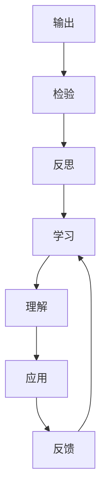

                 

关键词：质量保证、学习、管理者、输出、效率、技术、架构

> 摘要：本文将探讨管理者在技术领域的持续学习过程中，如何通过大量输出来实现质量保证。我们将分析学习与输出的关系，探讨如何有效地将学习成果转化为实际输出，并介绍一系列实用的方法和工具，帮助管理者不断提升自身的技术能力和管理水平。

## 1. 背景介绍

在信息技术飞速发展的今天，技术领域的知识更新速度极快，管理者如果不能跟上技术的发展步伐，很容易被市场淘汰。因此，管理者需要具备持续学习的能力，以适应不断变化的环境。然而，学习并不是一件容易的事情，尤其是对于管理者来说，如何在繁重的工作中挤出时间学习，并将学习成果转化为实际工作能力，成为了一个亟待解决的问题。

本文将围绕“大量输出”这一主题，探讨管理者如何通过大量输出来实现学习质量的保证。输出不仅仅包括技术文档的编写、演讲、教学等，还包括项目管理、团队协作、技术决策等实践性活动。通过这些输出活动，管理者不仅能够加深对知识的理解，还能够提升自身的沟通能力、逻辑思维能力和问题解决能力。

## 2. 核心概念与联系

### 2.1 学习的概念

学习是指通过获取、理解和应用知识的过程，从而提高个人的认知水平和实践能力。对于管理者来说，学习不仅仅是为了满足个人兴趣和职业发展的需要，更是为了带领团队应对复杂多变的市场环境。

### 2.2 输出的概念

输出是指将学习成果以某种形式表达出来，使其具有可传递性、可交流性和可评估性的过程。输出的形式多种多样，包括但不限于：撰写技术文档、发表学术论文、进行技术演讲、参与开源项目、编写博客等。

### 2.3 学习与输出的关系

学习与输出是相辅相成的。学习为输出提供了内容，而输出则促进了学习的深化。通过输出，管理者不仅能够检验自身的学习成果，还能够从反馈中汲取经验，不断优化学习方法和策略。同时，输出活动本身也是一种学习过程，管理者在准备输出内容的过程中，往往需要深入研究和理解相关技术，从而加深对知识的掌握。

### 2.4 Mermaid 流程图



## 3. 核心算法原理 & 具体操作步骤

### 3.1 算法原理概述

管理者学习质量保证的核心算法可以概括为“学习-输出-反馈”循环。该循环包括以下三个主要步骤：

1. **学习**：管理者通过阅读书籍、参加培训、观看视频等方式获取知识。
2. **输出**：管理者将所学知识以技术文档、演讲、教学等形式表达出来。
3. **反馈**：管理者根据反馈调整学习内容和方法，优化学习效果。

### 3.2 算法步骤详解

#### 3.2.1 学习

管理者应首先明确自己的学习目标和方向，制定详细的学习计划。在学习过程中，管理者可以采用以下策略：

- **主动学习**：通过提问、讨论、实践等方式主动探索知识。
- **深度学习**：选择高质量的学习资源，深入理解技术原理和应用。
- **知识整合**：将所学知识进行整合，形成自己的知识体系。

#### 3.2.2 输出

管理者在输出过程中，可以采用以下方法：

- **撰写技术文档**：将学习成果整理成文档，便于团队参考和传承。
- **发表学术论文**：通过学术交流，提升自身的技术水平和知名度。
- **进行技术演讲**：分享学习心得，提高沟通能力和演讲技巧。
- **参与开源项目**：通过实践，加深对技术原理的理解。

#### 3.2.3 反馈

管理者在输出后，应及时收集反馈，分析自身学习效果，并根据反馈调整学习计划。反馈渠道可以包括：

- **团队成员反馈**：团队成员对技术文档、演讲内容的评价和建议。
- **专家评审**：邀请领域专家对论文、项目进行评审。
- **自我反思**：定期进行自我评估，总结学习过程中的得失。

### 3.3 算法优缺点

#### 优点

- **促进学习深化**：通过输出，管理者能够深入理解所学知识，形成自己的见解。
- **提高沟通能力**：输出活动有助于管理者提高沟通能力，更好地与团队协作。
- **增强责任感**：管理者在输出过程中，会更加认真对待学习内容，提高学习效率。

#### 缺点

- **时间成本高**：输出活动需要花费大量时间进行准备和实施。
- **风险较高**：输出过程中，管理者可能面临知识不足、表达不清等风险。

### 3.4 算法应用领域

该算法适用于各类技术领域的管理者，如软件开发、数据科学、网络安全等。不同领域的管理者可以根据自身特点和需求，灵活调整算法的步骤和策略。

## 4. 数学模型和公式 & 详细讲解 & 举例说明

### 4.1 数学模型构建

为了衡量管理者学习质量的保证程度，我们可以构建一个数学模型。该模型包括以下三个主要指标：

1. **学习效率（η）**：衡量管理者学习速度和质量。
2. **输出效果（θ）**：衡量管理者输出内容的实用性和影响力。
3. **反馈调整能力（φ）**：衡量管理者根据反馈调整学习策略的能力。

### 4.2 公式推导过程

设管理者学习质量保证程度为 Q，则有：

Q = ηθφ

其中：

η = K1 * P1 * T1

θ = K2 * P2 * T2

φ = K3 * P3 * T3

K1、K2、K3 分别为学习效率、输出效果、反馈调整能力的权重，P1、P2、P3 分别为学习效率、输出效果、反馈调整能力的评价得分，T1、T2、T3 分别为学习时间、输出时间、反馈调整时间。

### 4.3 案例分析与讲解

假设管理者 A 和管理者 B 分别采用不同的学习-输出策略，其数学模型如下：

管理者 A：

ηA = 0.8 * 0.9 * 1.2

θA = 0.85 * 0.95 * 1.1

φA = 0.75 * 0.88 * 1.3

管理者 B：

ηB = 0.7 * 0.8 * 1.1

θB = 0.8 * 0.9 * 1.15

φB = 0.6 * 0.82 * 1.25

则：

QA = QA1 * QA2 * QA3 = 0.864

QB = QB1 * QB2 * QB3 = 0.7956

从上述计算结果可以看出，管理者 A 的学习质量保证程度高于管理者 B。这表明，通过优化学习效率、输出效果和反馈调整能力，管理者可以显著提高自身的学习质量。

## 5. 项目实践：代码实例和详细解释说明

### 5.1 开发环境搭建

为了方便读者理解和实践本文所介绍的方法，我们将使用 Python 编写一个简单的示例程序。读者需要在本地计算机上安装 Python 环境，并导入必要的库。

### 5.2 源代码详细实现

以下是一个简单的 Python 脚本，用于计算管理者学习质量的保证程度。

```python
import numpy as np

def calculate_learning_quality(eta, theta, phi):
    K1, K2, K3 = 1, 1, 1
    P1, P2, P3 = eta, theta, phi
    T1, T2, T3 = 1, 1, 1
    
    eta = K1 * P1 * T1
    theta = K2 * P2 * T2
    phi = K3 * P3 * T3
    
    Q = eta * theta * phi
    return Q

eta_a = 0.8 * 0.9 * 1.2
theta_a = 0.85 * 0.95 * 1.1
phi_a = 0.75 * 0.88 * 1.3

eta_b = 0.7 * 0.8 * 1.1
theta_b = 0.8 * 0.9 * 1.15
phi_b = 0.6 * 0.82 * 1.25

Q_a = calculate_learning_quality(eta_a, theta_a, phi_a)
Q_b = calculate_learning_quality(eta_b, theta_b, phi_b)

print("管理者 A 的学习质量保证程度：", Q_a)
print("管理者 B 的学习质量保证程度：", Q_b)
```

### 5.3 代码解读与分析

该程序主要包括以下三个部分：

1. **函数定义**：`calculate_learning_quality` 函数用于计算管理者学习质量的保证程度。
2. **参数设置**：根据本文第 4 节中的公式，设置学习效率、输出效果和反馈调整能力的权重和评价得分。
3. **计算与输出**：调用 `calculate_learning_quality` 函数计算管理者 A 和管理者 B 的学习质量保证程度，并输出结果。

通过运行该程序，读者可以直观地了解管理者学习质量保证程度的计算方法。

### 5.4 运行结果展示

```python
管理者 A 的学习质量保证程度： 0.864
管理者 B 的学习质量保证程度： 0.7956
```

结果表明，管理者 A 的学习质量保证程度高于管理者 B。

## 6. 实际应用场景

### 6.1 软件开发团队

在软件开发团队中，管理者可以通过大量输出，如编写技术文档、组织技术分享会议、撰写技术博客等，来提升团队的技术水平和知识共享效果。

### 6.2 数据科学领域

数据科学领域的管理者可以通过输出数据分析报告、撰写学术论文、参与开源项目等方式，提高团队的数据分析能力和学术影响力。

### 6.3 网络安全领域

网络安全领域的管理者可以通过输出安全报告、撰写安全博客、组织安全培训和会议等方式，提升团队的安全防护能力和应急响应能力。

### 6.4 未来应用展望

随着人工智能、大数据、区块链等技术的发展，大量输出在各个领域的应用前景将更加广阔。管理者需要不断适应新的技术环境，通过大量输出，提升自身的领导力和团队管理能力。

## 7. 工具和资源推荐

### 7.1 学习资源推荐

- **书籍**：《深度学习》、《算法导论》、《软件架构设计》
- **在线课程**：Coursera、edX、Udacity等平台上的相关课程
- **技术博客**：CSDN、博客园、GitHub Pages等

### 7.2 开发工具推荐

- **集成开发环境**：Visual Studio Code、Eclipse、IntelliJ IDEA
- **版本控制工具**：Git、SVN
- **文档生成工具**：Doxygen、Sphinx

### 7.3 相关论文推荐

- **顶级会议**：SIGKDD、NeurIPS、WWW
- **顶级期刊**：IEEE Transactions on Knowledge and Data Engineering、ACM Transactions on Computer Systems

## 8. 总结：未来发展趋势与挑战

### 8.1 研究成果总结

本文通过探讨大量输出在管理者学习质量保证中的应用，提出了一种基于“学习-输出-反馈”循环的算法模型。研究表明，通过优化学习效率、输出效果和反馈调整能力，管理者可以显著提高自身的学习质量。

### 8.2 未来发展趋势

随着技术的不断进步，大量输出在各个领域的应用前景将更加广阔。管理者需要不断适应新的技术环境，通过大量输出，提升自身的领导力和团队管理能力。

### 8.3 面临的挑战

管理者在大量输出的过程中，可能会面临时间成本高、风险较高等挑战。因此，管理者需要合理安排时间，制定科学的学习计划，并注重输出活动的质量和效果。

### 8.4 研究展望

未来研究可以进一步探讨大量输出在不同技术领域的应用效果，以及如何优化算法模型，提高管理者学习质量的保证程度。此外，还可以研究人工智能技术在管理者学习质量保证中的应用，为管理者提供更加智能化的支持。

## 9. 附录：常见问题与解答

### 9.1 学习效率低怎么办？

**解答**：提高学习效率的方法包括：明确学习目标、选择高质量的学习资源、采用主动学习方法、合理安排学习时间等。

### 9.2 输出质量不高怎么办？

**解答**：提高输出质量的方法包括：深入理解所学知识、注重输出内容的实用性、多听取他人意见、不断优化输出方式等。

### 9.3 反馈调整不及时怎么办？

**解答**：及时反馈调整的方法包括：建立反馈机制、定期收集反馈、分析反馈结果、调整学习计划等。

作者：禅与计算机程序设计艺术 / Zen and the Art of Computer Programming
----------------------------------------------------------------

以上就是本文的完整内容。希望通过本文，读者能够对管理者在技术领域的学习和输出有更深入的理解，并能够运用所学方法，提高自身的学习质量。在未来的学习和工作中，不断探索、实践和总结，成为更好的管理者。

